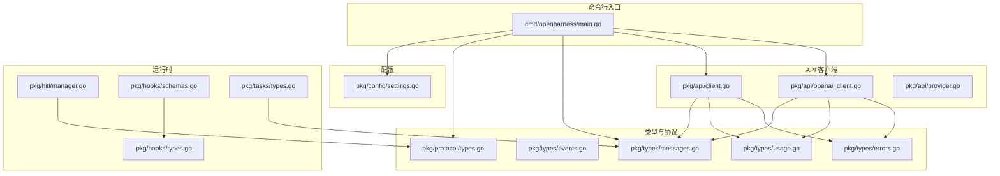
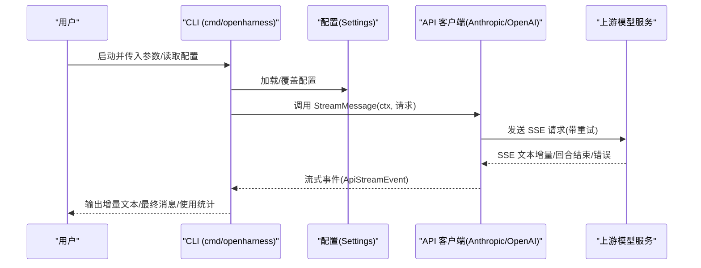
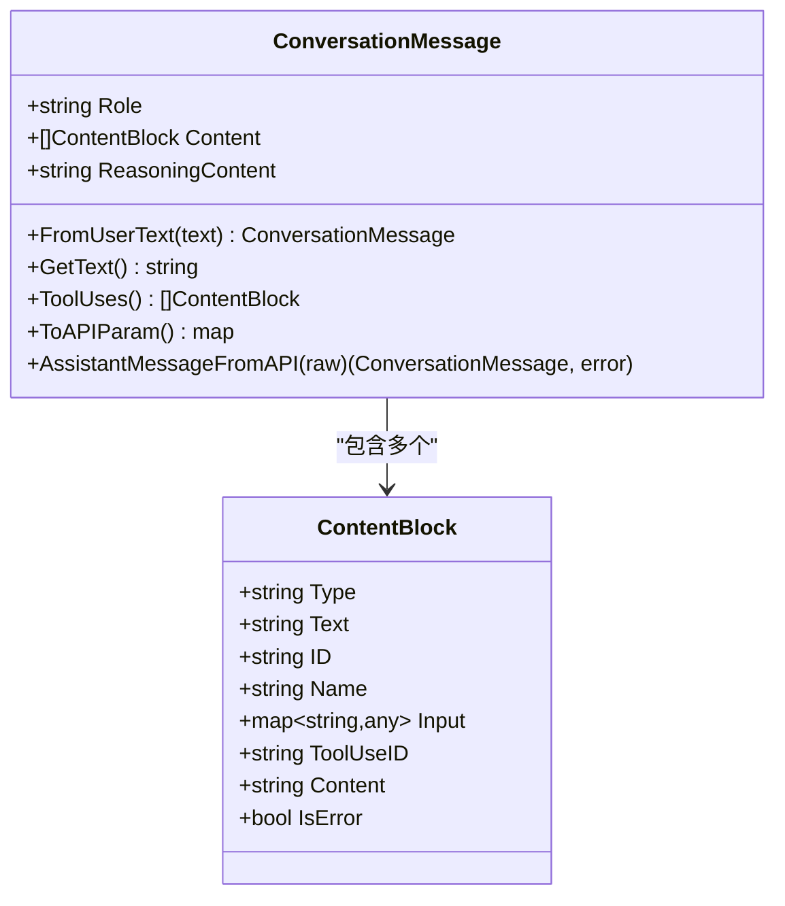
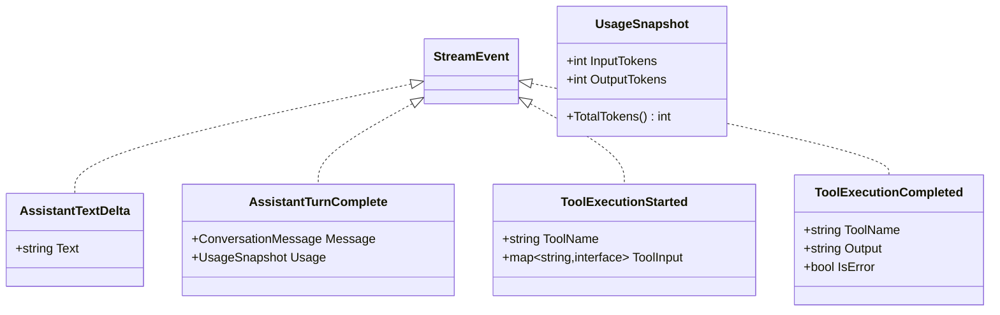
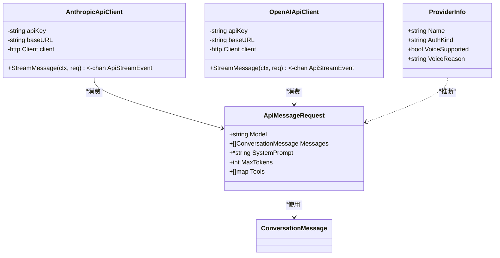
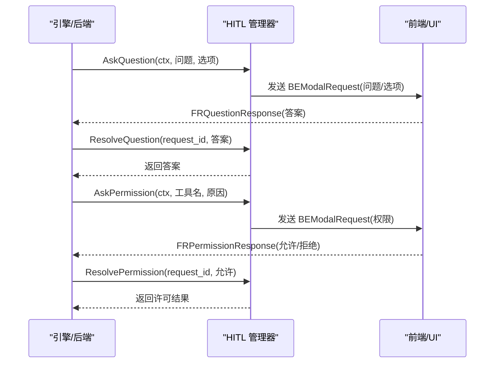
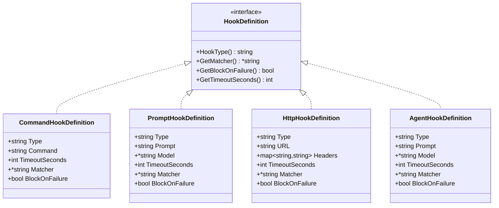
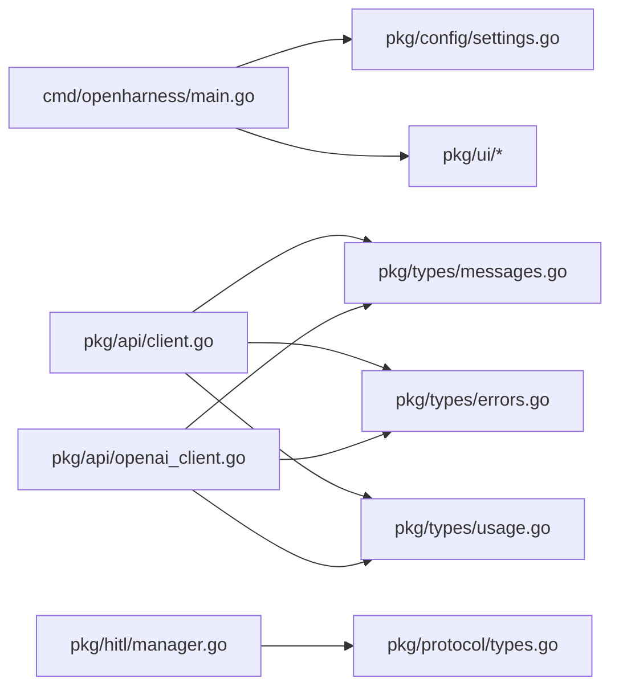

# API 参考

<cite>
**本文引用的文件**
- [go.mod](file://go.mod)
- [pkg/api/client.go](file://pkg/api/client.go)
- [pkg/api/openai_client.go](file://pkg/api/openai_client.go)
- [pkg/api/provider.go](file://pkg/api/provider.go)
- [pkg/protocol/types.go](file://pkg/protocol/types.go)
- [pkg/tokens/types.go](file://pkg/tokens/types.go)
- [pkg/types/messages.go](file://pkg/types/messages.go)
- [pkg/types/events.go](file://pkg/types/events.go)
- [pkg/types/usage.go](file://pkg/types/usage.go)
- [pkg/types/errors.go](file://pkg/types/errors.go)
- [pkg/hitl/manager.go](file://pkg/hitl/manager.go)
- [pkg/tasks/types.go](file://pkg/tasks/types.go)
- [pkg/hooks/types.go](file://pkg/hooks/types.go)
- [pkg/hooks/schemas.go](file://pkg/hooks/schemas.go)
- [pkg/config/settings.go](file://pkg/config/settings.go)
- [cmd/openharness/main.go](file://cmd/openharness/main.go)
</cite>

## 目录
1. [简介](#简介)
2. [项目结构](#项目结构)
3. [核心组件](#核心组件)
4. [架构总览](#架构总览)
5. [详细组件分析](#详细组件分析)
6. [依赖关系分析](#依赖关系分析)
7. [性能与可靠性](#性能与可靠性)
8. [故障排查指南](#故障排查指南)
9. [结论](#结论)
10. [附录：端点与协议规范](#附录端点与协议规范)

## 简介
本文件为 OpenHarness Go 的 API 参考文档，面向集成开发者，系统性梳理公开接口、数据类型、消息格式、事件流、错误模型与使用统计等，覆盖以下方面：
- 消息与内容块模型（ContentBlock、ConversationMessage）
- 流式事件与使用统计（StreamEvent、UsageSnapshot）
- 多提供商 API 客户端（Anthropic、OpenAI 兼容）及重试与 SSE 解析
- 人机交互协议（HITL）事件与请求类型
- 钩子（Hooks）定义与聚合结果
- 任务（Tasks）状态与消息结构
- 配置（Settings）与运行入口（CLI）

## 项目结构
OpenHarness 采用按功能域分层的模块化组织方式，核心 API 位于 pkg/api；人机交互协议在 pkg/protocol；消息与事件在 pkg/types；配置在 pkg/config；CLI 入口在 cmd/openharness。



图示来源
- [cmd/openharness/main.go:15-102](file://cmd/openharness/main.go#L15-L102)
- [pkg/config/settings.go:97-142](file://pkg/config/settings.go#L97-L142)
- [pkg/protocol/types.go:53-101](file://pkg/protocol/types.go#L53-L101)
- [pkg/types/messages.go:15-169](file://pkg/types/messages.go#L15-L169)
- [pkg/types/events.go:3-40](file://pkg/types/events.go#L3-L40)
- [pkg/types/usage.go:3-13](file://pkg/types/usage.go#L3-L13)
- [pkg/types/errors.go:5-40](file://pkg/types/errors.go#L5-L40)
- [pkg/api/client.go:43-104](file://pkg/api/client.go#L43-L104)
- [pkg/api/openai_client.go:23-84](file://pkg/api/openai_client.go#L23-L84)
- [pkg/api/provider.go:17-75](file://pkg/api/provider.go#L17-L75)
- [pkg/hitl/manager.go:11-26](file://pkg/hitl/manager.go#L11-L26)
- [pkg/hooks/types.go:3-44](file://pkg/hooks/types.go#L3-L44)
- [pkg/hooks/schemas.go:97-182](file://pkg/hooks/schemas.go#L97-L182)
- [pkg/tasks/types.go:18-59](file://pkg/tasks/types.go#L18-L59)

章节来源
- [go.mod:1-43](file://go.mod#L1-L43)
- [cmd/openharness/main.go:15-102](file://cmd/openharness/main.go#L15-L102)

## 核心组件
- 消息与内容块
  - ContentBlock：文本、工具调用、工具结果三态联合体，字段按 Type 填充。
  - ConversationMessage：角色与内容块列表，支持从用户文本构造、提取文本、转换为上游 API 参数。
- 流式事件与使用统计
  - StreamEvent 接口与具体事件：文本增量、回合完成（含最终消息与使用统计）、工具执行开始/完成。
  - UsageSnapshot：输入/输出 token 统计。
- API 客户端
  - AnthropicApiClient：封装 Anthropic Messages API 的流式调用、重试与 SSE 解析。
  - OpenAIApiClient：封装 OpenAI 兼容 Chat Completions API 的流式调用、格式转换与 SSE 解析。
  - ProviderInfo：根据设置推断提供商类型与鉴权方式。
- 协议与人机交互
  - BackendEvent/FrontendRequest：后端事件与前端请求的类型与载荷。
  - Manager：会话内的人机交互请求管理（问题/权限），阻塞等待前端响应。
- 钩子与任务
  - HookDefinition 及其四种类型（command/prompt/http/agent），支持超时、匹配器、失败阻断。
  - AggregatedHookResult：聚合钩子执行结果，支持阻断判定与原因提取。
  - TaskPacket/TaskEntry/TaskMessage/SubAgentType：任务对象、消息与子代理类型枚举。
- 配置
  - Settings：API、行为、权限、内存、插件、MCP、UI 等配置项与默认值、加载/保存、环境变量覆盖。

章节来源
- [pkg/types/messages.go:15-169](file://pkg/types/messages.go#L15-L169)
- [pkg/types/events.go:3-40](file://pkg/types/events.go#L3-L40)
- [pkg/types/usage.go:3-13](file://pkg/types/usage.go#L3-L13)
- [pkg/api/client.go:43-104](file://pkg/api/client.go#L43-L104)
- [pkg/api/openai_client.go:23-84](file://pkg/api/openai_client.go#L23-L84)
- [pkg/api/provider.go:17-75](file://pkg/api/provider.go#L17-L75)
- [pkg/protocol/types.go:53-101](file://pkg/protocol/types.go#L53-L101)
- [pkg/hitl/manager.go:11-26](file://pkg/hitl/manager.go#L11-L26)
- [pkg/hooks/types.go:3-44](file://pkg/hooks/types.go#L3-L44)
- [pkg/hooks/schemas.go:97-182](file://pkg/hooks/schemas.go#L97-L182)
- [pkg/tasks/types.go:18-59](file://pkg/tasks/types.go#L18-L59)
- [pkg/config/settings.go:97-142](file://pkg/config/settings.go#L97-L142)

## 架构总览
下图展示从 CLI 到 API 客户端、再到上游模型服务的调用链路，以及流式事件的产生与消费路径。



图示来源
- [cmd/openharness/main.go:46-76](file://cmd/openharness/main.go#L46-L76)
- [pkg/config/settings.go:160-178](file://pkg/config/settings.go#L160-L178)
- [pkg/api/client.go:107-148](file://pkg/api/client.go#L107-L148)
- [pkg/api/openai_client.go:42-84](file://pkg/api/openai_client.go#L42-L84)

## 详细组件分析

### 消息与内容块模型
- ContentBlock
  - 字段：Type、Text、ID、Name、Input、ToolUseID、Content、IsError。
  - 工具函数：NewTextBlock、NewToolUseBlock、NewToolResultBlock。
- ConversationMessage
  - 字段：Role、Content、ReasoningContent。
  - 方法：FromUserText、GetText、ToolUses、ToAPIParam、AssistantMessageFromAPI。
- 使用要点
  - ContentBlock 为“标签联合体”，仅 Type 对应字段有效。
  - ToAPIParam 将内部消息转换为上游 API 的 wire 格式。
  - AssistantMessageFromAPI 支持从原始响应反序列化为内部消息。



图示来源
- [pkg/types/messages.go:15-169](file://pkg/types/messages.go#L15-L169)

章节来源
- [pkg/types/messages.go:15-169](file://pkg/types/messages.go#L15-L169)

### 流式事件与使用统计
- StreamEvent 接口与实现
  - AssistantTextDelta：文本增量。
  - AssistantTurnComplete：回合完成，携带最终消息与使用统计。
  - ToolExecutionStarted/ToolExecutionCompleted：工具调用生命周期事件。
- UsageSnapshot
  - 字段：InputTokens、OutputTokens。
  - 方法：TotalTokens()。



图示来源
- [pkg/types/events.go:3-40](file://pkg/types/events.go#L3-L40)
- [pkg/types/usage.go:3-13](file://pkg/types/usage.go#L3-L13)

章节来源
- [pkg/types/events.go:3-40](file://pkg/types/events.go#L3-L40)
- [pkg/types/usage.go:3-13](file://pkg/types/usage.go#L3-L13)

### API 客户端（Anthropic 与 OpenAI 兼容）
- 请求与事件类型
  - ApiMessageRequest：模型名、消息列表、系统提示、最大输出 token、工具定义。
  - ApiStreamEvent：TextDelta、MessageComplete、Err。
- AnthropicApiClient
  - 支持重试（指数退避+抖动）、网络错误识别、HTTP 错误翻译为统一错误类型。
  - SSE 解析：content_block_delta/message_delta/error 等事件分发。
- OpenAIApiClient
  - 将内部消息转换为 OpenAI 兼容的消息数组与工具定义。
  - SSE 解析：逐块解析 choices.delta.content/tool_calls/usage.finish_reason。
- ProviderInfo
  - 根据配置推断提供商名称与鉴权方式，并给出语音能力说明。



图示来源
- [pkg/api/client.go:43-104](file://pkg/api/client.go#L43-L104)
- [pkg/api/openai_client.go:23-84](file://pkg/api/openai_client.go#L23-L84)
- [pkg/api/provider.go:17-75](file://pkg/api/provider.go#L17-L75)

章节来源
- [pkg/api/client.go:107-148](file://pkg/api/client.go#L107-L148)
- [pkg/api/client.go:174-210](file://pkg/api/client.go#L174-L210)
- [pkg/api/client.go:242-295](file://pkg/api/client.go#L242-L295)
- [pkg/api/client.go:359-405](file://pkg/api/client.go#L359-L405)
- [pkg/api/openai_client.go:260-402](file://pkg/api/openai_client.go#L260-L402)
- [pkg/api/provider.go:17-75](file://pkg/api/provider.go#L17-L75)

### 人机交互协议（HITL）
- BackendEvent：后端向前端发出的事件，包含类型、文本、错误、模态请求、选择选项与扩展字段。
- FrontendRequest：前端对后端的请求，包含类型、请求 ID、回答或许可。
- Manager
  - AskQuestion/AskPermission：阻塞等待前端响应，内部维护 request_id 映射。
  - ResolveQuestion/ResolvePermission：解析并回填响应。
  - HandleFrontendRequest：处理前端请求并路由到对应通道。



图示来源
- [pkg/protocol/types.go:53-101](file://pkg/protocol/types.go#L53-L101)
- [pkg/hitl/manager.go:33-90](file://pkg/hitl/manager.go#L33-L90)
- [pkg/hitl/manager.go:120-142](file://pkg/hitl/manager.go#L120-L142)

章节来源
- [pkg/protocol/types.go:16-66](file://pkg/protocol/types.go#L16-L66)
- [pkg/hitl/manager.go:11-26](file://pkg/hitl/manager.go#L11-L26)

### 钩子（Hooks）与任务（Tasks）
- 钩子定义
  - Command/Prompt/Http/Agent 四种类型，均实现 HookDefinition 接口。
  - 支持超时、匹配器、失败阻断等属性。
  - UnmarshalHookDefinition 根据 type 字段动态反序列化。
- 聚合结果
  - AggregatedHookResult：收集各钩子执行结果，提供 IsBlocked/BlockReason 辅助判断。
- 任务
  - TaskPacket：任务目标、范围、分支/提交/报告/升级策略等。
  - TaskEntry：任务条目，包含状态、消息、包、时间戳与错误信息。
  - TaskMessage：任务消息。
  - SubAgentType：子代理类型枚举。



图示来源
- [pkg/hooks/schemas.go:9-95](file://pkg/hooks/schemas.go#L9-L95)

章节来源
- [pkg/hooks/types.go:3-44](file://pkg/hooks/types.go#L3-L44)
- [pkg/hooks/schemas.go:97-182](file://pkg/hooks/schemas.go#L97-L182)
- [pkg/tasks/types.go:18-59](file://pkg/tasks/types.go#L18-L59)

### 配置与 CLI
- Settings
  - API 配置（APIKey、Model、Provider、MaxTokens、BaseURL）、行为（SystemPrompt、Permission）、内存（Memory）、插件（EnabledPlugins）、MCP（McpServers）、UI（Theme、OutputStyle、VimMode、VoiceMode、FastMode、Effort、Passes、Verbose）。
  - 默认值与加载/保存逻辑，支持环境变量覆盖。
- CLI
  - 主命令：支持模型、提供商、API Key、Base URL、MaxTokens、系统提示、权限模式、输出格式、调试、快速模式、努力级别、轮次、打印模式、直接提示、恢复/继续占位。
  - 子命令：mcp（list/add/remove）、auth（status/login/logout）。

```mermaid
flowchart TD
Start(["启动 CLI"]) --> LoadCfg["加载配置(文件/默认/环境)"]
LoadCfg --> ApplyFlags["应用命令行标志覆盖"]
ApplyFlags --> Mode{"运行模式"}
Mode --> |直接提示(-p)| PrintMode["非交互打印模式"]
Mode --> |标准输入(--print)| StdinMode["读取stdin并打印"]
Mode --> |占位(恢复/继续)| Placeholder["暂不支持"]
Mode --> |默认| REPL["交互式REPL"]
PrintMode --> End(["退出"])
StdinMode --> End
REPL --> End
Placeholder --> End
```

图示来源
- [cmd/openharness/main.go:46-76](file://cmd/openharness/main.go#L46-L76)
- [pkg/config/settings.go:160-195](file://pkg/config/settings.go#L160-L195)

章节来源
- [pkg/config/settings.go:97-142](file://pkg/config/settings.go#L97-L142)
- [cmd/openharness/main.go:22-102](file://cmd/openharness/main.go#L22-L102)

## 依赖关系分析
- 内部依赖
  - pkg/api 依赖 pkg/types（消息/事件/使用统计/错误）。
  - pkg/hitl 依赖 pkg/protocol。
  - cmd/openharness 依赖 pkg/config 与 pkg/ui（CLI 运行入口）。
- 外部依赖
  - go.mod 中声明了 cobra、logrus、sonic 等外部库，用于 CLI、日志与 JSON 处理。



图示来源
- [go.mod:5-42](file://go.mod#L5-L42)
- [cmd/openharness/main.go:10-13](file://cmd/openharness/main.go#L10-L13)
- [pkg/api/client.go:19](file://pkg/api/client.go#L19)
- [pkg/api/openai_client.go:16](file://pkg/api/openai_client.go#L16)
- [pkg/hitl/manager.go:8](file://pkg/hitl/manager.go#L8)

章节来源
- [go.mod:1-43](file://go.mod#L1-L43)

## 性能与可靠性
- 重试策略
  - 最大重试次数、基础延迟、最大延迟、抖动、基于 Retry-After 头的优先级处理。
  - 可重试状态码集合与网络错误关键字识别。
- 流式解析
  - SSE 扫描器缓冲区大小优化，避免大块数据导致内存峰值。
- 并发与阻塞
  - 流事件通道容量固定，避免无界增长；HITL 请求通过通道阻塞等待，保证顺序与一致性。
- 配置与资源
  - 默认内存与文件数量限制，避免资源滥用；可由配置调整。

章节来源
- [pkg/api/client.go:26-37](file://pkg/api/client.go#L26-L37)
- [pkg/api/client.go:379-390](file://pkg/api/client.go#L379-L390)
- [pkg/api/client.go:242-280](file://pkg/api/client.go#L242-L280)
- [pkg/config/settings.go:68-75](file://pkg/config/settings.go#L68-L75)

## 故障排查指南
- 鉴权失败
  - 现象：401/403。
  - 处理：检查 API Key 设置与环境变量覆盖；确认提供商鉴权方式。
- 速率限制
  - 现象：429。
  - 处理：等待 Retry-After 或降低请求频率；观察重试日志。
- 网络错误
  - 现象：连接被拒、超时、EOF 等。
  - 处理：检查网络连通性与代理设置；增大超时或减少并发。
- SSE 解析异常
  - 现象：解析 content_block_delta/message_delta 出错。
  - 处理：查看上游返回格式变化；更新客户端以适配新字段。
- 人机交互未响应
  - 现象：AskQuestion/AskPermission 阻塞。
  - 处理：确认前端已发送 FRQuestionResponse/FRPermissionResponse；检查 request_id 是否匹配。

章节来源
- [pkg/types/errors.go:11-39](file://pkg/types/errors.go#L11-L39)
- [pkg/api/client.go:359-405](file://pkg/api/client.go#L359-L405)
- [pkg/api/client.go:282-353](file://pkg/api/client.go#L282-L353)
- [pkg/hitl/manager.go:33-90](file://pkg/hitl/manager.go#L33-L90)

## 结论
本文档系统梳理了 OpenHarness Go 的消息模型、流式事件、多提供商 API 客户端、人机交互协议、钩子与任务结构、配置与 CLI 入口。结合重试与 SSE 解析机制，开发者可稳定地集成与扩展 OpenHarness 的对话与工具调用能力。建议在生产环境中：
- 明确提供商与鉴权方式，确保 BaseURL 与 API Key 正确。
- 使用流式事件进行增量渲染与工具调用追踪。
- 通过权限与内存配置控制资源消耗。
- 在前端实现 HITL 请求的可靠回传，保障交互闭环。

## 附录：端点与协议规范

### 消息与事件类型
- ContentBlock
  - 字段：Type、Text、ID、Name、Input、ToolUseID、Content、IsError。
  - 工具函数：NewTextBlock、NewToolUseBlock、NewToolResultBlock。
- ConversationMessage
  - 字段：Role、Content、ReasoningContent。
  - 方法：FromUserText、GetText、ToolUses、ToAPIParam、AssistantMessageFromAPI。
- StreamEvent
  - AssistantTextDelta、AssistantTurnComplete、ToolExecutionStarted、ToolExecutionCompleted。
- UsageSnapshot
  - 字段：InputTokens、OutputTokens；方法：TotalTokens()。

章节来源
- [pkg/types/messages.go:15-169](file://pkg/types/messages.go#L15-L169)
- [pkg/types/events.go:3-40](file://pkg/types/events.go#L3-L40)
- [pkg/types/usage.go:3-13](file://pkg/types/usage.go#L3-L13)

### API 客户端请求/响应模式
- 请求
  - ApiMessageRequest：model、messages、system_prompt、max_tokens、tools。
- 流式事件
  - ApiTextDeltaEvent：text。
  - ApiMessageCompleteEvent：message、usage、stop_reason。
- 错误
  - OpenHarnessApiError 及其子类：AuthenticationFailure、RateLimitFailure、RequestFailure。

章节来源
- [pkg/api/client.go:43-79](file://pkg/api/client.go#L43-L79)
- [pkg/types/errors.go:11-39](file://pkg/types/errors.go#L11-L39)

### 协议类型与消息传递机制
- BackendEvent
  - 类型：ready、state_snapshot、tasks_snapshot、transcript_item、assistant_delta、assistant_complete、line_complete、tool_started、tool_completed、clear_transcript、error、shutdown、modal_request、select_request。
  - 字段：text、error、modal、select_options、extra。
- FrontendRequest
  - 类型：submit_line、question_response、permission_response、list_sessions、shutdown。
  - 字段：request_id、line、answer、allowed。

章节来源
- [pkg/protocol/types.go:16-66](file://pkg/protocol/types.go#L16-L66)
- [pkg/protocol/types.go:77-93](file://pkg/protocol/types.go#L77-L93)

### 状态管理与人机交互
- Manager
  - AskQuestion(ctx, question, options)：返回字符串或上下文取消错误。
  - AskPermission(ctx, toolName, reason)：返回布尔或上下文取消错误。
  - HandleFrontendRequest：校验 request_id 并路由到对应通道。

章节来源
- [pkg/hitl/manager.go:33-90](file://pkg/hitl/manager.go#L33-L90)
- [pkg/hitl/manager.go:120-142](file://pkg/hitl/manager.go#L120-L142)

### 钩子与任务
- 钩子定义
  - CommandHookDefinition、PromptHookDefinition、HttpHookDefinition、AgentHookDefinition。
  - UnmarshalHookDefinition 根据 type 动态反序列化。
- 聚合结果
  - AggregatedHookResult：Results、IsBlocked、BlockReason。
- 任务
  - TaskPacket、TaskEntry、TaskMessage、SubAgentType。

章节来源
- [pkg/hooks/schemas.go:97-182](file://pkg/hooks/schemas.go#L97-L182)
- [pkg/hooks/types.go:3-44](file://pkg/hooks/types.go#L3-L44)
- [pkg/tasks/types.go:18-59](file://pkg/tasks/types.go#L18-L59)

### 配置与 CLI
- Settings
  - API、行为、权限、内存、插件、MCP、UI 等字段与默认值。
  - LoadSettings/SaveSettings、ResolveAPIKey、环境变量覆盖。
- CLI
  - 主命令标志：model、provider、api-key、base-url、max-tokens、system-prompt、permission-mode、output-format、verbose、fast、effort、passes、print、prompt、resume、continue。
  - 子命令：mcp list/add/remove、auth status/login/logout。

章节来源
- [pkg/config/settings.go:97-142](file://pkg/config/settings.go#L97-L142)
- [pkg/config/settings.go:160-195](file://pkg/config/settings.go#L160-L195)
- [cmd/openharness/main.go:22-102](file://cmd/openharness/main.go#L22-L102)
- [cmd/openharness/main.go:165-231](file://cmd/openharness/main.go#L165-L231)
- [cmd/openharness/main.go:237-298](file://cmd/openharness/main.go#L237-L298)