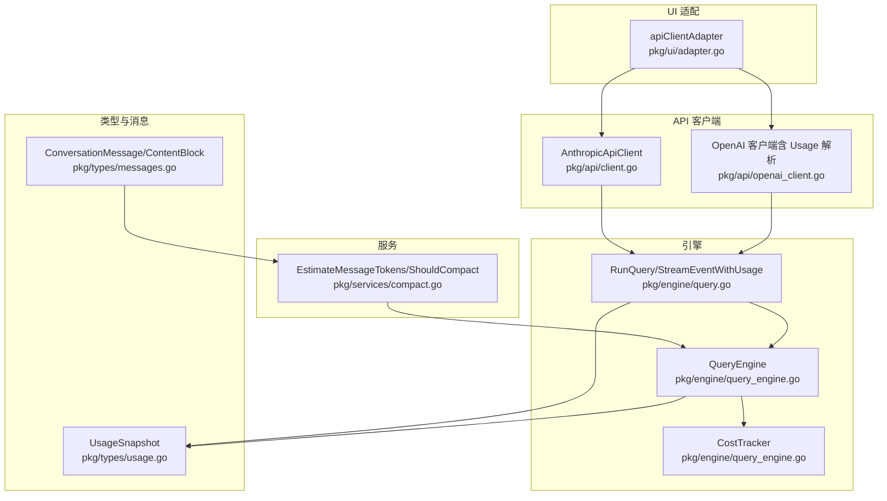
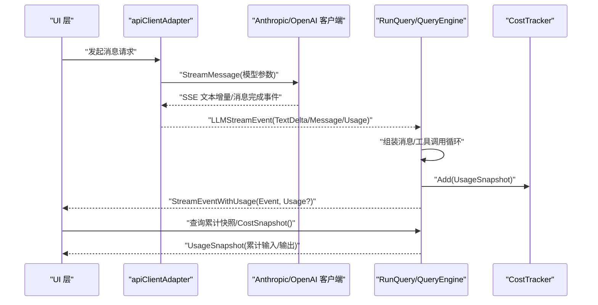
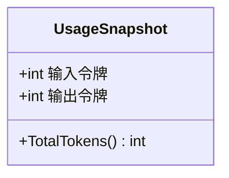
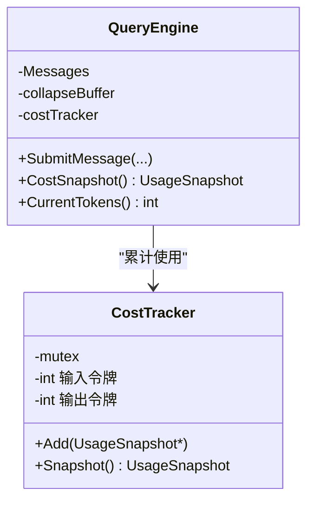
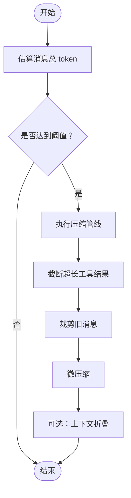
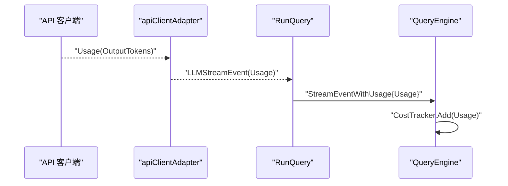
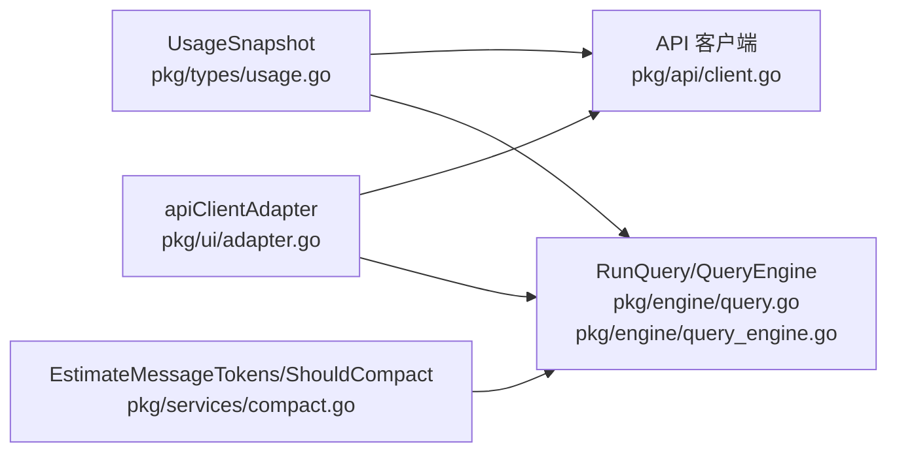

# 使用统计 API

<cite>
**本文引用的文件**
- [pkg/types/usage.go](file://pkg/types/usage.go)
- [pkg/engine/query_engine.go](file://pkg/engine/query_engine.go)
- [pkg/engine/query.go](file://pkg/engine/query.go)
- [pkg/services/compact.go](file://pkg/services/compact.go)
- [pkg/ui/adapter.go](file://pkg/ui/adapter.go)
- [pkg/api/client.go](file://pkg/api/client.go)
- [pkg/api/openai_client.go](file://pkg/api/openai_client.go)
- [pkg/types/messages.go](file://pkg/types/messages.go)
</cite>

## 目录
1. [简介](#简介)
2. [项目结构](#项目结构)
3. [核心组件](#核心组件)
4. [架构总览](#架构总览)
5. [详细组件分析](#详细组件分析)
6. [依赖关系分析](#依赖关系分析)
7. [性能考量](#性能考量)
8. [故障排查指南](#故障排查指南)
9. [结论](#结论)
10. [附录](#附录)

## 简介
本文件面向 OpenHarness Go 的“使用统计 API”，系统性阐述以下内容：
- Usage 统计结构与数据模型
- 计费模型与资源使用跟踪机制
- token 计数、API 调用统计与成本计算方法
- 完整统计数据格式与聚合规则
- 实际使用场景示例与统计分析方法
- 如何监控与报告资源使用情况
- 开发者实现指南：统计采集、处理与展示

## 项目结构
围绕使用统计的关键代码分布在如下模块：
- 类型定义：UsageSnapshot（token 使用快照）
- 引擎层：CostTracker（累计 token 使用）、QueryEngine（会话与统计集成）
- 服务层：消息压缩与 token 估算（用于上下文规模控制）
- UI 适配层：将底层 API 流式事件映射为引擎可消费的流事件，并注入 Usage
- API 客户端：解析流式响应中的 Usage 并传递给上层

图表来源
- [pkg/types/usage.go:1-13](file://pkg/types/usage.go#L1-L13)
- [pkg/types/messages.go:1-169](file://pkg/types/messages.go#L1-L169)
- [pkg/engine/query_engine.go:1-247](file://pkg/engine/query_engine.go#L1-L247)
- [pkg/engine/query.go:1-200](file://pkg/engine/query.go#L1-L200)
- [pkg/services/compact.go:1-100](file://pkg/services/compact.go#L1-L100)
- [pkg/ui/adapter.go:1-59](file://pkg/ui/adapter.go#L1-L59)
- [pkg/api/client.go:1-406](file://pkg/api/client.go#L1-L406)
- [pkg/api/openai_client.go:270-318](file://pkg/api/openai_client.go#L270-L318)

章节来源
- [pkg/types/usage.go:1-13](file://pkg/types/usage.go#L1-L13)
- [pkg/engine/query_engine.go:1-247](file://pkg/engine/query_engine.go#L1-L247)
- [pkg/engine/query.go:1-200](file://pkg/engine/query.go#L1-L200)
- [pkg/services/compact.go:1-100](file://pkg/services/compact.go#L1-L100)
- [pkg/ui/adapter.go:1-59](file://pkg/ui/adapter.go#L1-L59)
- [pkg/api/client.go:1-406](file://pkg/api/client.go#L1-L406)
- [pkg/api/openai_client.go:270-318](file://pkg/api/openai_client.go#L270-L318)

## 核心组件
- UsageSnapshot：记录单次调用的输入/输出 token 数量，提供总 token 求和方法
- CostTracker：在多轮对话中累计输入/输出 token，提供快照导出
- QueryEngine：封装会话状态管理，接收流式事件中的 Usage 并累加到 CostTracker；提供当前会话 token 估算与累计快照查询
- 估算与压缩：EstimateMessageTokens 基于消息内容块估算 token；ShouldCompact/RunPipeline 控制上下文规模，避免 token 爆炸
- UI 适配器：将底层 API 流事件转换为引擎事件，注入 Usage
- API 客户端：从 SSE/流响应中提取 Usage 并向上游传递

章节来源
- [pkg/types/usage.go:1-13](file://pkg/types/usage.go#L1-L13)
- [pkg/engine/query_engine.go:1-247](file://pkg/engine/query_engine.go#L1-L247)
- [pkg/engine/query.go:1-200](file://pkg/engine/query.go#L1-L200)
- [pkg/services/compact.go:1-100](file://pkg/services/compact.go#L1-L100)
- [pkg/ui/adapter.go:1-59](file://pkg/ui/adapter.go#L1-L59)
- [pkg/api/client.go:1-406](file://pkg/api/client.go#L1-L406)
- [pkg/api/openai_client.go:270-318](file://pkg/api/openai_client.go#L270-L318)

## 架构总览
下图展示了从 API 流式响应到引擎统计的完整链路，以及统计快照的导出路径。

图表来源
- [pkg/ui/adapter.go:17-59](file://pkg/ui/adapter.go#L17-L59)
- [pkg/api/client.go:106-148](file://pkg/api/client.go#L106-L148)
- [pkg/api/openai_client.go:270-318](file://pkg/api/openai_client.go#L270-L318)
- [pkg/engine/query.go:142-200](file://pkg/engine/query.go#L142-L200)
- [pkg/engine/query_engine.go:18-43](file://pkg/engine/query_engine.go#L18-L43)

## 详细组件分析

### Usage 统计结构与数据模型
- UsageSnapshot：包含输入 token 与输出 token 字段，提供 TotalTokens 方法用于快速求和
- 数据来源：由底层 API 客户端在流式响应中解析得到，随后注入到引擎事件中

图表来源
- [pkg/types/usage.go:3-12](file://pkg/types/usage.go#L3-L12)

章节来源
- [pkg/types/usage.go:1-13](file://pkg/types/usage.go#L1-L13)

### 计费模型与资源使用跟踪机制
- 累计跟踪：CostTracker 在多轮对话中累积输入/输出 token，线程安全
- 快照导出：通过 Snapshot 返回当前累计值，供外部查询
- 查询引擎集成：QueryEngine 在收到流式事件时，若包含 Usage，则累加到 CostTracker；同时提供 CostSnapshot 与 CurrentTokens（估算）

图表来源
- [pkg/engine/query_engine.go:17-43](file://pkg/engine/query_engine.go#L17-L43)
- [pkg/engine/query_engine.go:236-246](file://pkg/engine/query_engine.go#L236-L246)

章节来源
- [pkg/engine/query_engine.go:17-43](file://pkg/engine/query_engine.go#L17-L43)
- [pkg/engine/query_engine.go:236-246](file://pkg/engine/query_engine.go#L236-L246)

### token 计数与上下文压缩
- Estimation 规则：对文本、工具调用名称与输入、工具结果内容分别估算 token，再叠加固定开销
- 上下文压缩：当消息数量与 token 总量超过阈值时触发压缩管线，包括截断超长工具结果、裁剪旧消息、微压缩等步骤，以控制后续请求的 token 消耗

图表来源
- [pkg/services/compact.go:41-72](file://pkg/services/compact.go#L41-L72)
- [pkg/services/compact.go:74-100](file://pkg/services/compact.go#L74-L100)

章节来源
- [pkg/services/compact.go:32-59](file://pkg/services/compact.go#L32-L59)
- [pkg/services/compact.go:61-72](file://pkg/services/compact.go#L61-L72)
- [pkg/services/compact.go:74-100](file://pkg/services/compact.go#L74-L100)

### API 调用统计与成本计算方法
- Usage 来源：Anthropic 客户端在 message_delta 中返回输出 token；OpenAI 客户端在流式块中返回 prompt/tokens 等字段，最终汇总为 UsageSnapshot
- 注入流程：UI 适配器将 Usage 注入到 LLMStreamEvent，再由 RunQuery 包装为 StreamEventWithUsage，QueryEngine 在循环中累加
- 成本计算：当前仓库未内置“美元成本”字段或换算逻辑，仅提供 token 快照；如需成本统计，可在应用侧基于模型单价进行换算

图表来源
- [pkg/api/client.go:318-340](file://pkg/api/client.go#L318-L340)
- [pkg/api/openai_client.go:299-318](file://pkg/api/openai_client.go#L299-L318)
- [pkg/ui/adapter.go:47-54](file://pkg/ui/adapter.go#L47-L54)
- [pkg/engine/query.go:195-197](file://pkg/engine/query.go#L195-L197)
- [pkg/engine/query_engine.go:25-33](file://pkg/engine/query_engine.go#L25-L33)

章节来源
- [pkg/api/client.go:318-340](file://pkg/api/client.go#L318-L340)
- [pkg/api/openai_client.go:299-318](file://pkg/api/openai_client.go#L299-L318)
- [pkg/ui/adapter.go:47-54](file://pkg/ui/adapter.go#L47-L54)
- [pkg/engine/query.go:195-197](file://pkg/engine/query.go#L195-L197)
- [pkg/engine/query_engine.go:25-33](file://pkg/engine/query_engine.go#L25-L33)

### 数据统计格式与聚合规则
- 单次调用统计：UsageSnapshot（输入/输出 token）
- 累计统计：CostSnapshot 返回累计输入/输出 token
- 会话内估算：CurrentTokens 返回当前消息历史的估算 token 数
- 聚合建议：
  - 按会话：导出每次 SubmitMessage 的 UsageSnapshot 列表与最终 CostSnapshot
  - 按时间窗口：按日/小时聚合 UsageSnapshot，计算每窗口的输入/输出 token 总和
  - 按模型/工具：在上游事件中附加维度标签，便于分组统计

章节来源
- [pkg/types/usage.go:9-12](file://pkg/types/usage.go#L9-L12)
- [pkg/engine/query_engine.go:236-246](file://pkg/engine/query_engine.go#L236-L246)

### 实际使用场景示例与统计分析方法
- 场景一：调试与优化提示词
  - 目标：观察不同提示词下的 token 使用变化，定位高消耗片段
  - 方法：记录每次调用的 UsageSnapshot，对比输入 token 变化
- 场景二：上下文膨胀防护
  - 目标：防止历史消息导致 token 超限
  - 方法：启用 ShouldCompact，结合 CurrentTokens 与 EstimateMessageTokens 监控趋势
- 场景三：成本预算控制
  - 目标：在应用侧按模型单价换算成本，设置预算阈值告警
  - 方法：基于 CostSnapshot 的累计输入/输出 token 进行成本估算

章节来源
- [pkg/services/compact.go:61-72](file://pkg/services/compact.go#L61-L72)
- [pkg/engine/query_engine.go:241-246](file://pkg/engine/query_engine.go#L241-L246)

### 监控与报告资源使用
- 实时监控：订阅 StreamEventWithUsage，实时打印/上报 UsageSnapshot
- 周期报告：定时导出 CostSnapshot，生成输入/输出 token 报表
- 告警策略：基于 CurrentTokens 与 Token 阈值，触发压缩或中断策略

章节来源
- [pkg/engine/query.go:44-48](file://pkg/engine/query.go#L44-L48)
- [pkg/engine/query_engine.go:236-246](file://pkg/engine/query_engine.go#L236-L246)

### 开发者实现指南：采集、处理与展示
- 采集
  - 在 UI 适配层捕获 Usage 并注入事件
  - 在 RunQuery 循环中检测 Usage 并累加到 CostTracker
- 处理
  - 对 UsageSnapshot 进行聚合（sum、avg、max），生成会话级指标
  - 结合 EstimateMessageTokens 与 ShouldCompact，动态调整上下文规模
- 展示
  - 提供 CostSnapshot 导出接口，支持前端可视化
  - 将 UsageSnapshot 列表与 CurrentTokens 曲线结合展示

章节来源
- [pkg/ui/adapter.go:17-59](file://pkg/ui/adapter.go#L17-L59)
- [pkg/engine/query.go:142-200](file://pkg/engine/query.go#L142-L200)
- [pkg/engine/query_engine.go:236-246](file://pkg/engine/query_engine.go#L236-L246)

## 依赖关系分析
- 类型依赖：UsageSnapshot 被 API 客户端与引擎共享
- 引擎依赖：QueryEngine 依赖 CostTracker 与服务层的估算函数
- UI 适配：apiClientAdapter 将具体 API 客户端抽象为 StreamingLLMClient
- 事件链路：API -> Adapter -> RunQuery -> QueryEngine -> CostTracker

图表来源
- [pkg/types/usage.go:1-13](file://pkg/types/usage.go#L1-L13)
- [pkg/api/client.go:106-148](file://pkg/api/client.go#L106-L148)
- [pkg/engine/query.go:142-200](file://pkg/engine/query.go#L142-L200)
- [pkg/engine/query_engine.go:18-43](file://pkg/engine/query_engine.go#L18-L43)
- [pkg/services/compact.go:41-72](file://pkg/services/compact.go#L41-L72)
- [pkg/ui/adapter.go:17-59](file://pkg/ui/adapter.go#L17-L59)

章节来源
- [pkg/types/usage.go:1-13](file://pkg/types/usage.go#L1-L13)
- [pkg/engine/query_engine.go:1-247](file://pkg/engine/query_engine.go#L1-L247)
- [pkg/engine/query.go:1-200](file://pkg/engine/query.go#L1-L200)
- [pkg/services/compact.go:1-100](file://pkg/services/compact.go#L1-L100)
- [pkg/ui/adapter.go:1-59](file://pkg/ui/adapter.go#L1-L59)
- [pkg/api/client.go:1-406](file://pkg/api/client.go#L1-L406)

## 性能考量
- token 估算复杂度：EstimateMessageTokens 对每条消息遍历所有内容块，时间复杂度 O(N)，N 为消息总数；空间复杂度 O(1)
- 压缩阈值：通过 TokenThreshold 与 MinMessages 控制压缩触发频率，避免频繁压缩带来的额外 CPU 开销
- 并发安全：CostTracker 使用互斥锁保护累计过程，保证多协程并发写入的安全性
- 流式处理：API 客户端采用 SSE/流式解析，降低内存峰值占用

章节来源
- [pkg/services/compact.go:41-72](file://pkg/services/compact.go#L41-L72)
- [pkg/engine/query_engine.go:18-43](file://pkg/engine/query_engine.go#L18-L43)
- [pkg/api/client.go:242-280](file://pkg/api/client.go#L242-L280)

## 故障排查指南
- API 错误分类：客户端将 HTTP 错误映射为认证失败、速率限制、请求失败等类型，便于统一处理
- 重试策略：指数退避 + 抖动，优先读取 Retry-After 头部
- 事件解析：SSE 事件解析失败时记录错误，避免中断流式链路
- 建议排查步骤：
  - 检查 Usage 是否为空（可能为网络波动或上游不支持）
  - 关注 CurrentTokens 是否持续上升，必要时触发压缩
  - 对比 CostSnapshot 与预期成本，确认模型单价与计费周期

章节来源
- [pkg/api/client.go:359-405](file://pkg/api/client.go#L359-L405)
- [pkg/api/client.go:282-295](file://pkg/api/client.go#L282-L295)
- [pkg/engine/query_engine.go:241-246](file://pkg/engine/query_engine.go#L241-L246)

## 结论
OpenHarness Go 的使用统计体系以 UsageSnapshot 为核心，结合 CostTracker 与 QueryEngine，实现了从流式响应到累计统计的完整闭环。通过 EstimateMessageTokens 与压缩机制，系统能够在高交互场景下保持稳定的 token 使用节奏。开发者可在此基础上扩展成本计算与可视化能力，满足更精细的资源监控与报告需求。

## 附录
- 数据模型与事件类型定义可参考以下文件路径：
  - [UsageSnapshot 定义:3-12](file://pkg/types/usage.go#L3-L12)
  - [消息与内容块结构:15-67](file://pkg/types/messages.go#L15-L67)
  - [流事件与带 Usage 的事件包装:33-48](file://pkg/engine/query.go#L33-L48)
  - [引擎与统计集成:17-43](file://pkg/engine/query_engine.go#L17-L43)
  - [上下文压缩与估算:32-72](file://pkg/services/compact.go#L32-L72)
  - [UI 适配器与 Usage 注入:47-54](file://pkg/ui/adapter.go#L47-L54)
  - [API 客户端 Usage 解析:318-340](file://pkg/api/client.go#L318-340)
  - [OpenAI 客户端 Usage 解析:299-318](file://pkg/api/openai_client.go#L299-318)