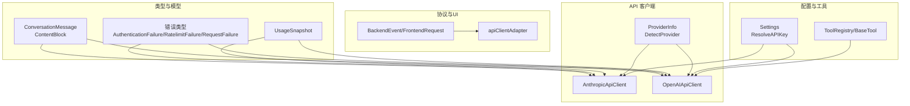
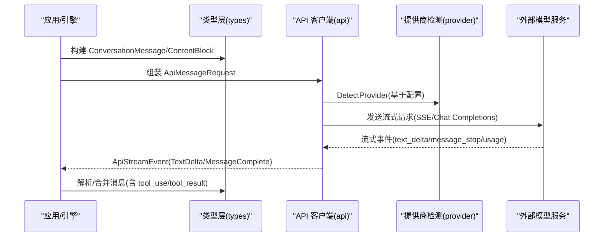
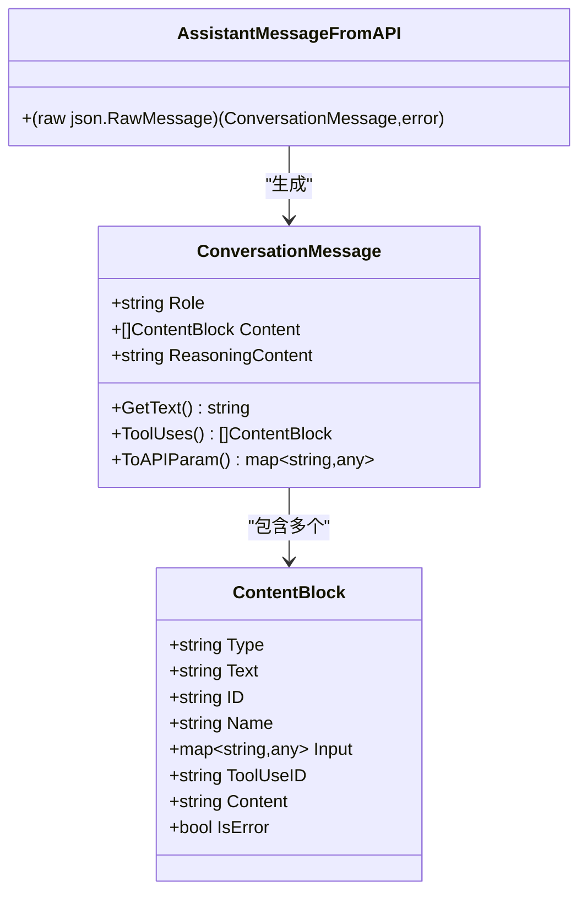
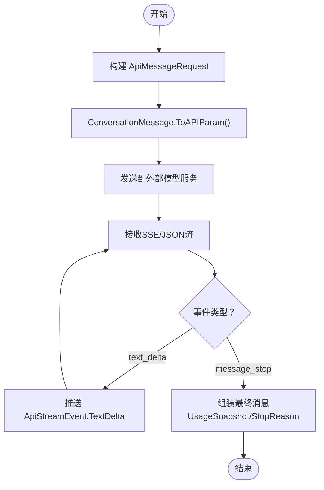
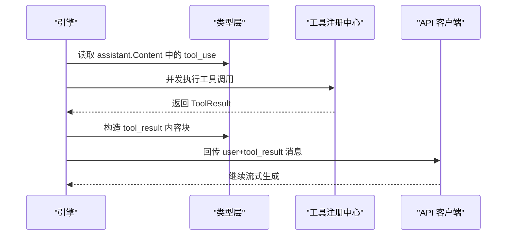
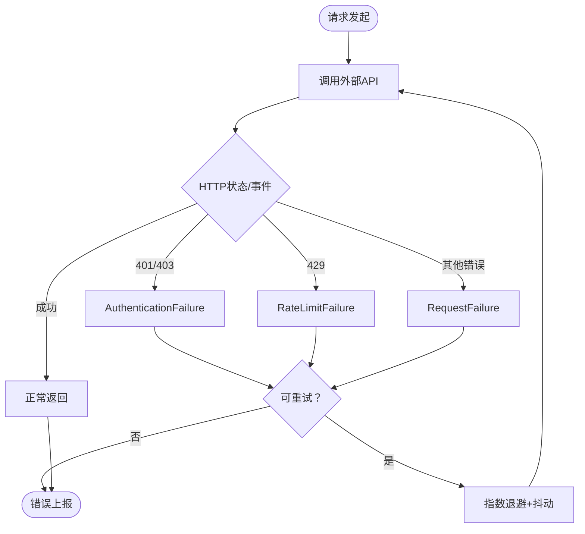
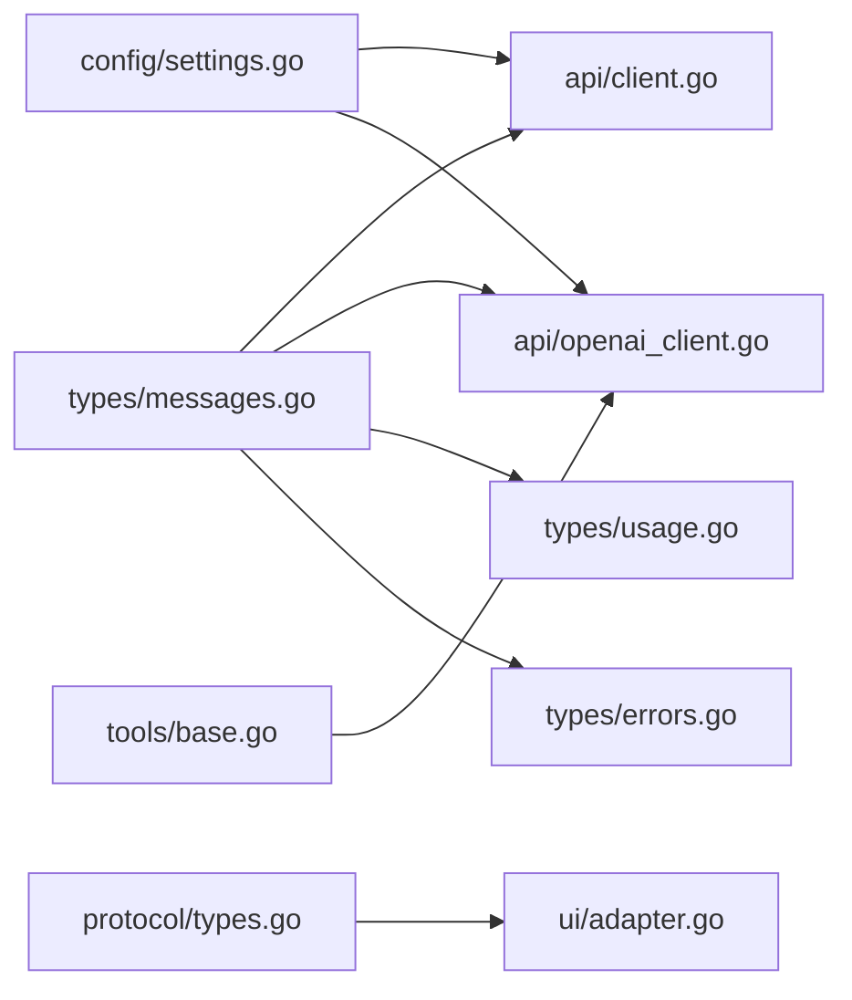

# 核心 API 接口

<cite>
**本文引用的文件**
- [pkg/types/messages.go](file://pkg/types/messages.go)
- [pkg/types/errors.go](file://pkg/types/errors.go)
- [pkg/types/usage.go](file://pkg/types/usage.go)
- [pkg/api/client.go](file://pkg/api/client.go)
- [pkg/api/openai_client.go](file://pkg/api/openai_client.go)
- [pkg/api/provider.go](file://pkg/api/provider.go)
- [pkg/protocol/types.go](file://pkg/protocol/types.go)
- [pkg/ui/adapter.go](file://pkg/ui/adapter.go)
- [pkg/config/settings.go](file://pkg/config/settings.go)
- [pkg/tools/base.go](file://pkg/tools/base.go)
- [cmd/openharness/main.go](file://cmd/openharness/main.go)
</cite>

## 目录
1. [简介](#简介)
2. [项目结构](#项目结构)
3. [核心组件](#核心组件)
4. [架构总览](#架构总览)
5. [详细组件分析](#详细组件分析)
6. [依赖关系分析](#依赖关系分析)
7. [性能考量](#性能考量)
8. [故障排查指南](#故障排查指南)
9. [结论](#结论)
10. [附录](#附录)

## 简介
本文件面向 OpenHarness Go 的核心 API 接口，系统性地阐述以下主题：
- 数据模型：ConversationMessage、ContentBlock、AssistantMessage 的结构与使用方法
- 消息传递机制：从应用层到外部模型服务（Anthropic、OpenAI 兼容）的序列化与反序列化流程
- 内容块类型：text、tool_use、tool_result 的转换与序列化
- 完整 API 端点说明：请求/响应格式、参数定义与返回值规范
- 实际示例路径：如何构建与解析消息
- 外部 API 兼容性：Anthropic 与 OpenAI 兼容模式的差异与适配策略
- 最佳实践：错误处理、重试、流式事件与工具调用

## 项目结构
OpenHarness 将“消息模型”“API 客户端”“协议与 UI 适配”“配置与工具注册”等模块分层组织，核心 API 能力集中在 pkg/types 与 pkg/api 下。

**图表来源**
- [pkg/types/messages.go:15-168](file://pkg/types/messages.go#L15-L168)
- [pkg/types/errors.go:5-39](file://pkg/types/errors.go#L5-L39)
- [pkg/types/usage.go:3-12](file://pkg/types/usage.go#L3-L12)
- [pkg/api/client.go:43-231](file://pkg/api/client.go#L43-L231)
- [pkg/api/openai_client.go:130-238](file://pkg/api/openai_client.go#L130-L238)
- [pkg/api/provider.go:17-58](file://pkg/api/provider.go#L17-L58)
- [pkg/protocol/types.go:53-101](file://pkg/protocol/types.go#L53-L101)
- [pkg/ui/adapter.go:17-58](file://pkg/ui/adapter.go#L17-L58)
- [pkg/config/settings.go:144-154](file://pkg/config/settings.go#L144-L154)
- [pkg/tools/base.go:51-131](file://pkg/tools/base.go#L51-L131)

**章节来源**
- [pkg/types/messages.go:15-168](file://pkg/types/messages.go#L15-L168)
- [pkg/api/client.go:43-231](file://pkg/api/client.go#L43-L231)
- [pkg/api/openai_client.go:130-238](file://pkg/api/openai_client.go#L130-L238)
- [pkg/api/provider.go:17-58](file://pkg/api/provider.go#L17-L58)
- [pkg/protocol/types.go:53-101](file://pkg/protocol/types.go#L53-L101)
- [pkg/ui/adapter.go:17-58](file://pkg/ui/adapter.go#L17-L58)
- [pkg/config/settings.go:144-154](file://pkg/config/settings.go#L144-L154)
- [pkg/tools/base.go:51-131](file://pkg/tools/base.go#L51-L131)

## 核心组件
- ConversationMessage：封装角色与内容块数组，并支持转为 Anthropic API 参数格式、从 API 响应解析为消息对象。
- ContentBlock：带标签联合体，支持 text、tool_use、tool_result 三类内容块；提供便捷构造函数。
- AssistantMessageFromAPI：将外部 API 返回的 JSON 转换为 ConversationMessage，自动补齐缺失字段。
- ApiMessageRequest：统一的请求载荷，包含模型名、消息列表、系统提示、最大输出 token 数与工具定义。
- ApiStreamEvent：流式事件载体，包含增量文本与最终消息完成事件。
- UsageSnapshot：记录输入/输出 token 使用量。
- ProviderInfo/DetectProvider：根据配置推断当前使用的上游提供商及鉴权方式。
- apiClientAdapter：将 api 层客户端适配为引擎可消费的流式接口。

**章节来源**
- [pkg/types/messages.go:15-168](file://pkg/types/messages.go#L15-L168)
- [pkg/api/client.go:43-69](file://pkg/api/client.go#L43-L69)
- [pkg/types/usage.go:3-12](file://pkg/types/usage.go#L3-L12)
- [pkg/api/provider.go:9-58](file://pkg/api/provider.go#L9-L58)
- [pkg/ui/adapter.go:17-58](file://pkg/ui/adapter.go#L17-L58)

## 架构总览
OpenHarness 的消息与工具调用在“类型层”“客户端层”“协议层”“UI 适配层”之间解耦协作，形成如下链路：

**图表来源**
- [pkg/types/messages.go:62-168](file://pkg/types/messages.go#L62-L168)
- [pkg/api/client.go:106-231](file://pkg/api/client.go#L106-L231)
- [pkg/api/openai_client.go:42-238](file://pkg/api/openai_client.go#L42-L238)
- [pkg/api/provider.go:17-58](file://pkg/api/provider.go#L17-L58)

## 详细组件分析

### 数据模型：ContentBlock 与 ConversationMessage
- ContentBlock 字段
  - type：枚举值，取值为 "text"、"tool_use"、"tool_result"
  - text：当 type="text" 时有效
  - id/name/input：当 type="tool_use" 时有效，其中 id 自动生成，input 为任意 JSON 对象
  - tool_use_id/content/is_error：当 type="tool_result" 时有效
- ConversationMessage 字段
  - role：取值 "user" 或 "assistant"
  - content：ContentBlock 列表
  - reasoning_content：推理内容（部分模型支持）
- 工具函数
  - NewTextBlock/NewToolUseBlock/NewToolResultBlock：便捷构造函数
  - FromUserText：从纯文本快速构造用户消息
  - GetText：拼接所有 text 类型内容
  - ToolUses：筛选出所有 tool_use 内容块
  - ToAPIParam：将消息转换为 Anthropic API 的 wire 格式
  - AssistantMessageFromAPI：将外部 API 返回 JSON 反序列化为 ConversationMessage

**图表来源**
- [pkg/types/messages.go:15-168](file://pkg/types/messages.go#L15-L168)

**章节来源**
- [pkg/types/messages.go:15-168](file://pkg/types/messages.go#L15-L168)

### 消息序列化与反序列化流程
- Anthropic 客户端
  - 请求：ApiMessageRequest -> ConversationMessage.ToAPIParam -> JSON payload
  - 响应：SSE 事件解析，逐条推送 ApiStreamEvent，最终聚合为完整消息
- OpenAI 兼容客户端
  - 请求：将 ContentBlock 转换为 OpenAI 的 messages 结构（含 tool_calls、role=tool 等）
  - 响应：SSE/JSON chunk 解析，累积文本与 tool_calls，最终组装为 ConversationMessage

**图表来源**
- [pkg/api/client.go:106-231](file://pkg/api/client.go#L106-L231)
- [pkg/api/openai_client.go:260-402](file://pkg/api/openai_client.go#L260-L402)
- [pkg/types/messages.go:99-132](file://pkg/types/messages.go#L99-L132)

**章节来源**
- [pkg/api/client.go:106-231](file://pkg/api/client.go#L106-L231)
- [pkg/api/openai_client.go:260-402](file://pkg/api/openai_client.go#L260-L402)
- [pkg/types/messages.go:99-132](file://pkg/types/messages.go#L99-L132)

### 工具调用与结果回传
- 引擎从 assistant 的 tool_use 内容块中提取工具调用，异步并发执行
- 执行完成后，将结果封装为 tool_result 内容块，回传给模型以继续对话
- OpenAI 兼容模式下，tool_result 会转换为独立的 role="tool" 消息

**图表来源**
- [pkg/engine/query.go:217-264](file://pkg/engine/query.go#L217-L264)
- [pkg/api/openai_client.go:150-166](file://pkg/api/openai_client.go#L150-L166)
- [pkg/tools/base.go:51-131](file://pkg/tools/base.go#L51-L131)

**章节来源**
- [pkg/engine/query.go:217-264](file://pkg/engine/query.go#L217-L264)
- [pkg/api/openai_client.go:150-166](file://pkg/api/openai_client.go#L150-L166)
- [pkg/tools/base.go:51-131](file://pkg/tools/base.go#L51-L131)

### 错误处理与重试
- OpenHarnessApiError 接口与具体错误类型：AuthenticationFailure、RateLimitFailure、RequestFailure
- Anthropic/OpenAI 客户端内置指数退避与抖动重试，依据状态码或网络错误判定是否可重试
- 流式错误通过 SSE "error" 事件或 HTTP 状态码上报

**图表来源**
- [pkg/types/errors.go:5-39](file://pkg/types/errors.go#L5-L39)
- [pkg/api/client.go:359-405](file://pkg/api/client.go#L359-L405)
- [pkg/api/openai_client.go:42-84](file://pkg/api/openai_client.go#L42-L84)

**章节来源**
- [pkg/types/errors.go:5-39](file://pkg/types/errors.go#L5-L39)
- [pkg/api/client.go:359-405](file://pkg/api/client.go#L359-L405)
- [pkg/api/openai_client.go:42-84](file://pkg/api/openai_client.go#L42-L84)

## 依赖关系分析
- 类型层依赖 UID 生成器用于 tool_use 的 id 补齐
- API 客户端依赖类型层的消息模型与使用快照
- 协议层定义了 UI 与后端之间的事件与请求格式
- 配置层提供 API Key、模型、提供商等运行时参数
- UI 适配层将 API 客户端的流式事件桥接到引擎

**图表来源**
- [pkg/types/messages.go:15-168](file://pkg/types/messages.go#L15-L168)
- [pkg/api/client.go:43-231](file://pkg/api/client.go#L43-L231)
- [pkg/api/openai_client.go:130-238](file://pkg/api/openai_client.go#L130-L238)
- [pkg/types/usage.go:3-12](file://pkg/types/usage.go#L3-L12)
- [pkg/types/errors.go:5-39](file://pkg/types/errors.go#L5-L39)
- [pkg/protocol/types.go:53-101](file://pkg/protocol/types.go#L53-L101)
- [pkg/ui/adapter.go:17-58](file://pkg/ui/adapter.go#L17-L58)
- [pkg/config/settings.go:144-154](file://pkg/config/settings.go#L144-L154)
- [pkg/tools/base.go:51-131](file://pkg/tools/base.go#L51-L131)

**章节来源**
- [pkg/types/messages.go:15-168](file://pkg/types/messages.go#L15-L168)
- [pkg/api/client.go:43-231](file://pkg/api/client.go#L43-L231)
- [pkg/api/openai_client.go:130-238](file://pkg/api/openai_client.go#L130-L238)
- [pkg/protocol/types.go:53-101](file://pkg/protocol/types.go#L53-L101)
- [pkg/ui/adapter.go:17-58](file://pkg/ui/adapter.go#L17-L58)
- [pkg/config/settings.go:144-154](file://pkg/config/settings.go#L144-L154)
- [pkg/tools/base.go:51-131](file://pkg/tools/base.go#L51-L131)

## 性能考量
- 流式事件缓冲：客户端通道容量设置为 64，避免阻塞；可根据吞吐需求调整
- SSE 扫描缓冲：Anthropic 客户端使用较大缓冲区以提升稳定性
- 工具调用并发：引擎对多个 tool_use 并发执行，显著缩短端到端延迟
- 重试策略：指数退避+抖动，结合 Retry-After 头优化限速场景下的等待时间
- Token 计数：UsageSnapshot 提供输入/输出 token 统计，便于成本控制与配额管理

[本节为通用指导，不直接分析具体文件]

## 故障排查指南
- 鉴权失败（401/403）
  - 现象：抛出 AuthenticationFailure
  - 排查：确认配置中的 API Key 是否正确，或环境变量 ANTHROPIC_API_KEY 是否设置
- 速率限制（429）
  - 现象：抛出 RateLimitFailure
  - 排查：检查 Retry-After 头或指数退避后的重试间隔
- 网络错误
  - 现象：RequestFailure（连接被拒、超时、EOF 等）
  - 排查：检查网络连通性、代理设置与超时配置
- 工具调用异常
  - 现象：ToolResult.IsError=true
  - 排查：查看工具执行上下文与输入参数，确认只读/权限策略
- 消息解析失败
  - 现象：AssistantMessageFromAPI 抛错
  - 排查：核对外部 API 返回的 content 结构与字段命名

**章节来源**
- [pkg/types/errors.go:11-39](file://pkg/types/errors.go#L11-L39)
- [pkg/api/client.go:359-405](file://pkg/api/client.go#L359-L405)
- [pkg/api/openai_client.go:260-402](file://pkg/api/openai_client.go#L260-L402)
- [pkg/tools/base.go:34-49](file://pkg/tools/base.go#L34-L49)

## 结论
OpenHarness 通过统一的消息模型与多提供商客户端抽象，实现了对 Anthropic 与 OpenAI 兼容模型的无缝集成。借助流式事件、工具调用与完善的错误处理机制，开发者可以稳定地构建具备工具能力的智能体应用。建议在生产环境中启用合理的重试策略、监控 UsageSnapshot，并对工具调用进行细粒度的权限控制。

[本节为总结性内容，不直接分析具体文件]

## 附录

### API 端点与请求/响应规范

- 端点：/v1/messages（Anthropic）
  - 方法：POST
  - 请求头：Content-Type: application/json, X-Api-Key: <API_KEY>, Anthropic-Version: 2023-06-01, Accept: text/event-stream
  - 请求体字段
    - model: 字符串，模型名称
    - messages: 数组，元素为 ConversationMessage.ToAPIParam() 的结果
    - system_prompt: 可选字符串
    - max_tokens: 整数
    - tools: 可选数组，每个元素为工具定义映射
  - 响应：SSE 流，事件类型包括 content_block_delta、message_delta、error 等
  - 返回：ApiStreamEvent，包含 TextDelta 与 MessageComplete（含 UsageSnapshot）

- 端点：/chat/completions（OpenAI 兼容）
  - 方法：POST
  - 请求头：Content-Type: application/json, Authorization: Bearer <API_KEY>, Accept: text/event-stream
  - 请求体字段
    - model: 字符串
    - messages: 数组，按 OpenAI 格式组织（含 role、content、tool_calls、tool_call_id 等）
    - max_tokens: 可选
    - stream: 布尔，true
    - tools: 可选，函数工具定义
  - 响应：SSE 流，每行为 data: <JSON chunk>，最后为 [DONE]

**章节来源**
- [pkg/api/client.go:174-231](file://pkg/api/client.go#L174-L231)
- [pkg/api/openai_client.go:260-238](file://pkg/api/openai_client.go#L260-L238)

### 内容块类型转换与序列化

- text
  - 输入：ContentBlock{Type: "text", Text: "..."}
  - 输出：{"type":"text","text":"..."}
- tool_use
  - 输入：ContentBlock{Type: "tool_use", ID: "...", Name: "...", Input: {...}}
  - 输出：{"type":"tool_use","id":"...","name":"...","input":{...}}
- tool_result
  - 输入：ContentBlock{Type: "tool_result", ToolUseID: "...", Content: "...", IsError: true/false}
  - 输出：{"type":"tool_result","tool_use_id":"...","content":"...","is_error":true/false}

**章节来源**
- [pkg/types/messages.go:111-132](file://pkg/types/messages.go#L111-L132)

### 示例：构建与解析消息（示例路径）
- 构建用户消息
  - [FromUserText:69-75](file://pkg/types/messages.go#L69-L75)
  - [NewTextBlock:33-36](file://pkg/types/messages.go#L33-L36)
- 构建工具调用
  - [NewToolUseBlock:38-46](file://pkg/types/messages.go#L38-L46)
- 构建工具结果
  - [NewToolResultBlock:48-56](file://pkg/types/messages.go#L48-L56)
- 解析助手响应
  - [AssistantMessageFromAPI:134-168](file://pkg/types/messages.go#L134-L168)
- OpenAI 兼容转换
  - [buildRequestBody（OpenAI）:130-238](file://pkg/api/openai_client.go#L130-L238)
  - [streamOnce（OpenAI）:260-402](file://pkg/api/openai_client.go#L260-L402)

**章节来源**
- [pkg/types/messages.go:33-56](file://pkg/types/messages.go#L33-L56)
- [pkg/types/messages.go:134-168](file://pkg/types/messages.go#L134-L168)
- [pkg/api/openai_client.go:130-238](file://pkg/api/openai_client.go#L130-L238)
- [pkg/api/openai_client.go:260-402](file://pkg/api/openai_client.go#L260-L402)

### 外部 API 兼容性处理
- ProviderInfo/DetectProvider
  - 根据配置的 Provider、BaseURL、Model 推断提供商类型与鉴权方式
  - 支持 Anthropic、OpenAI 兼容、Bedrock、Vertex 等
- 配置加载与覆盖
  - ResolveAPIKey：优先使用实例配置，其次环境变量，否则报错
  - 环境变量覆盖：ANTHROPIC_API_KEY、ANTHROPIC_MODEL、ANTHROPIC_BASE_URL 等

**章节来源**
- [pkg/api/provider.go:17-58](file://pkg/api/provider.go#L17-L58)
- [pkg/config/settings.go:144-211](file://pkg/config/settings.go#L144-L211)

### 最佳实践建议
- 使用 UsageSnapshot 追踪 token 使用，合理设置 max_tokens
- 在工具调用前进行权限校验与只读策略判断
- 对流式事件进行背压控制，避免内存膨胀
- 在高并发工具调用场景下，为工具注册中心加锁保护
- 对外部 API 的错误进行分类处理，区分可重试与不可重试错误

[本节为通用指导，不直接分析具体文件]