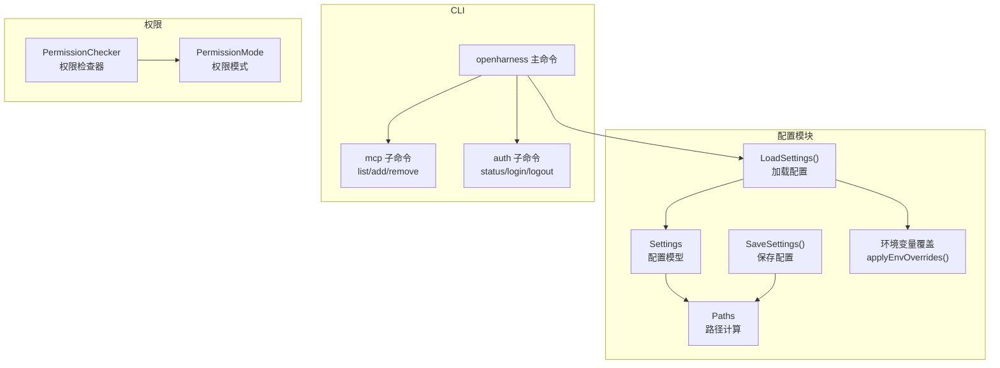
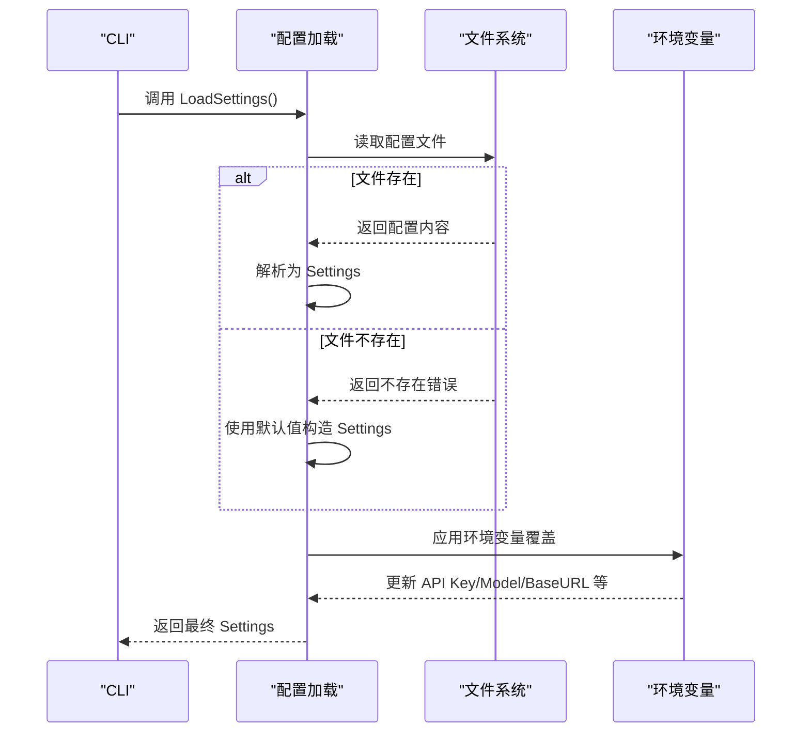
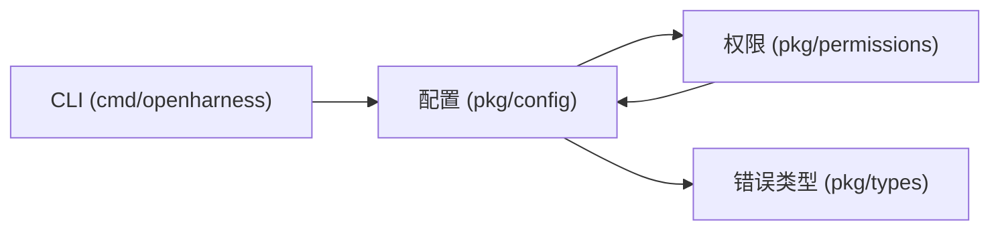

# 配置 API

<cite>
**本文档引用的文件**
- [settings.go](file://pkg/config/settings.go)
- [paths.go](file://pkg/config/paths.go)
- [main.go](file://cmd/openharness/main.go)
- [checker.go](file://pkg/permissions/checker.go)
- [modes.go](file://pkg/permissions/modes.go)
- [errors.go](file://pkg/types/errors.go)
- [README.md](file://README.md)
- [go.mod](file://go.mod)
</cite>

## 目录
1. [简介](#简介)
2. [项目结构](#项目结构)
3. [核心组件](#核心组件)
4. [架构概览](#架构概览)
5. [详细组件分析](#详细组件分析)
6. [依赖分析](#依赖分析)
7. [性能考虑](#性能考虑)
8. [故障排除指南](#故障排除指南)
9. [结论](#结论)
10. [附录](#附录)

## 简介
本文件为 OpenHarness Go 配置系统的完整 API 参考文档，涵盖 Settings 结构、配置项定义、配置加载与保存机制、环境变量映射、默认值处理、配置继承与优先级、动态更新流程，以及路径配置、安全配置与性能配置选项。同时提供配置 API 端点说明、最佳实践与故障排除指南，帮助开发者高效管理配置。

## 项目结构
配置系统主要位于 pkg/config 目录，核心文件包括：
- settings.go：定义 Settings 结构及默认值、加载/保存逻辑、环境变量覆盖
- paths.go：提供配置文件路径与数据目录的计算函数
- main.go（CLI）：演示配置加载、命令行标志覆盖与 MCP/认证子命令
- 权限模块：checker.go 与 modes.go 提供权限模式与路径规则评估
- 错误类型：errors.go 定义上游 API 错误接口与具体错误类型
- README.md：包含配置文件示例与使用说明
- go.mod：声明外部依赖（如 Cobra）

**图表来源**
- [settings.go:97-142](file://pkg/config/settings.go#L97-L142)
- [paths.go:8-75](file://pkg/config/paths.go#L8-L75)
- [main.go:46-102](file://cmd/openharness/main.go#L46-L102)
- [checker.go:25-82](file://pkg/permissions/checker.go#L25-L82)

**章节来源**
- [settings.go:1-212](file://pkg/config/settings.go#L1-L212)
- [paths.go:1-75](file://pkg/config/paths.go#L1-L75)
- [main.go:1-299](file://cmd/openharness/main.go#L1-L299)

## 核心组件
- Settings：主配置模型，包含 API 配置、行为设置、权限、钩子/插件/MCP、UI 设置等
- 默认值：DefaultSettings、DefaultPermissionSettings、DefaultMemorySettings
- 加载/保存：LoadSettings、SaveSettings
- 环境变量覆盖：applyEnvOverrides
- 路径计算：GetConfigDir、GetConfigFilePath、GetDataDir、GetLogsDir、GetSessionsDir、GetTasksDir、GetFeedbackDir、GetFeedbackLogPath、GetCronRegistryPath、GetProjectConfigDir、GetProjectIssueFile、GetProjectPRCommentsFile
- 权限模式：PermissionMode、PermissionChecker
- 错误类型：OpenHarnessApiError 及其子类 AuthenticationFailure、RateLimitFailure、RequestFailure

**章节来源**
- [settings.go:97-142](file://pkg/config/settings.go#L97-L142)
- [settings.go:127-142](file://pkg/config/settings.go#L127-L142)
- [settings.go:160-195](file://pkg/config/settings.go#L160-L195)
- [settings.go:197-212](file://pkg/config/settings.go#L197-L212)
- [paths.go:8-75](file://pkg/config/paths.go#L8-L75)
- [checker.go:10-82](file://pkg/permissions/checker.go#L10-L82)
- [modes.go:4-27](file://pkg/permissions/modes.go#L4-L27)
- [errors.go:5-40](file://pkg/types/errors.go#L5-L40)

## 架构概览
配置系统采用“文件 + 环境变量”的双源加载策略，CLI 与子命令通过 Cobra 提供命令行覆盖，最终形成运行时配置对象。权限模块基于配置进行工具执行决策，错误类型统一抽象以便上层处理。

**图表来源**
- [settings.go:160-178](file://pkg/config/settings.go#L160-L178)
- [settings.go:197-212](file://pkg/config/settings.go#L197-L212)

## 详细组件分析

### Settings 结构与配置项
Settings 是配置的核心载体，包含以下主要字段类别：
- API 配置：api_key、model、provider、max_tokens、base_url
- 行为设置：system_prompt、permission（含权限模式、工具黑白名单、路径规则、命令黑名单）
- 钩子/插件/MCP：hooks、memory、enabled_plugins、mcp_servers
- UI 设置：theme、output_style、vim_mode、voice_mode、fast_mode、effort、passes、verbose

默认值策略：
- DefaultSettings 提供合理的默认值（如 model、max_tokens、权限、内存、UI 等）
- DefaultPermissionSettings 和 DefaultMemorySettings 分别提供权限与内存的默认配置

环境变量覆盖：
- applyEnvOverrides 会根据环境变量覆盖 Settings 中的部分字段（如 ANTHROPIC_API_KEY、ANTHROPIC_MODEL、ANTHROPIC_BASE_URL 等）

配置加载与保存：
- LoadSettings 读取配置文件，不存在则使用默认值并应用环境变量覆盖
- SaveSettings 将 Settings 写回配置文件，确保目录存在并使用缩进格式化

**章节来源**
- [settings.go:97-142](file://pkg/config/settings.go#L97-L142)
- [settings.go:127-142](file://pkg/config/settings.go#L127-L142)
- [settings.go:160-195](file://pkg/config/settings.go#L160-L195)
- [settings.go:197-212](file://pkg/config/settings.go#L197-L212)

### 配置文件格式与位置
- 配置文件路径：~/.openharness/settings.json（可通过 OPENHARNESS_CONFIG_DIR 覆盖）
- 文件格式：JSON，字段与 Settings 结构一致
- 示例：README.md 展示了 provider、base_url、api_key、model 等字段的示例

路径计算：
- GetConfigDir：优先使用 OPENHARNESS_CONFIG_DIR，否则使用用户主目录下的 .openharness
- GetConfigFilePath：配置文件路径
- 数据目录与子目录：data、logs、sessions、tasks、feedback 及其日志与注册表文件路径

**章节来源**
- [paths.go:8-75](file://pkg/config/paths.go#L8-L75)
- [README.md:56-67](file://README.md#L56-L67)

### 环境变量映射与优先级
优先级（从高到低）：
1. 命令行标志（flags）：CLI 运行时通过 Cobra 参数覆盖配置
2. 环境变量：applyEnvOverrides 应用环境变量覆盖
3. 配置文件：settings.json
4. 默认值：DefaultSettings 等

环境变量映射：
- ANTHROPIC_API_KEY → api_key
- ANTHROPIC_MODEL 或 OPENHARNESS_MODEL → model
- ANTHROPIC_BASE_URL 或 OPENHARNESS_BASE_URL → base_url

CLI 覆盖逻辑：
- newRootCmd 定义了丰富的命令行标志，applyFlags 将这些标志写入 Settings 对象

**章节来源**
- [settings.go:197-212](file://pkg/config/settings.go#L197-L212)
- [main.go:104-144](file://cmd/openharness/main.go#L104-L144)

### 权限配置与继承规则
权限模式：
- default：默认模式，只读工具允许，其他工具需用户确认
- plan：计划模式，阻止修改类工具直到退出计划模式
- full_auto：自动模式，允许所有工具

权限规则：
- AllowedTools/DeninedTools：工具级别的白/黑名单
- PathRules：基于通配符的路径规则（Allow/Disallow）
- DeniedCommands：命令模式的黑名单（支持通配符匹配）

继承与评估：
- PermissionChecker 基于配置构建，Evaluate 按顺序判断：显式拒绝/允许、路径规则、命令规则、模式策略
- 返回 PermissionDecision，包含是否允许、是否需要确认、原因

**章节来源**
- [modes.go:4-27](file://pkg/permissions/modes.go#L4-L27)
- [checker.go:10-82](file://pkg/permissions/checker.go#L10-L82)
- [settings.go:37-44](file://pkg/config/settings.go#L37-L44)

### MCP 服务器配置与动态更新
MCP 服务器配置：
- McpServerConfig：包含命令、参数、环境变量映射
- Settings.McpServers：以名称为键的映射

动态更新（CLI 子命令）：
- mcp list：列出已配置的 MCP 服务器
- mcp add：添加新的 MCP 服务器并保存配置
- mcp remove：删除指定 MCP 服务器并保存配置

注意：当前实现为本地 stdio 传输，其他传输类型标记为待实现。

**章节来源**
- [settings.go:86-91](file://pkg/config/settings.go#L86-L91)
- [main.go:165-231](file://cmd/openharness/main.go#L165-L231)
- [checker.go:114-182](file://pkg/permissions/checker.go#L114-L182)

### 认证与安全配置
认证：
- auth status：显示当前认证状态（配置文件或环境变量）
- auth login：将 API Key 写入配置文件
- auth logout：移除配置文件中的 API Key

安全建议：
- 优先使用环境变量存储敏感信息
- 在 CI/CD 环境中通过密钥管理服务注入环境变量
- 使用最小权限原则配置 PathRules 与 DeniedCommands

**章节来源**
- [main.go:237-298](file://cmd/openharness/main.go#L237-L298)

### 性能配置选项
- MaxTokens：限制最大输出 token 数
- FastMode：快速模式（降低质量换取速度）
- Effort/Pases：调整推理/优化轮次
- MemorySettings：启用内存、最大文件数、入口文件最大行数

最佳实践：
- 根据任务复杂度调整 Effort 与 Passes
- 控制 MaxTokens 以平衡成本与质量
- 合理设置 MemorySettings 以避免上下文膨胀

**章节来源**
- [settings.go:62-75](file://pkg/config/settings.go#L62-L75)
- [settings.go:103-124](file://pkg/config/settings.go#L103-L124)

## 依赖分析
配置系统内部耦合度低，主要依赖关系如下：
- CLI 依赖配置加载与保存
- 权限模块依赖配置中的权限设置
- 错误类型被上层服务用于统一错误处理

**图表来源**
- [main.go:10-12](file://cmd/openharness/main.go#L10-L12)
- [settings.go:3-8](file://pkg/config/settings.go#L3-L8)
- [checker.go:3-8](file://pkg/permissions/checker.go#L3-L8)
- [errors.go:3-4](file://pkg/types/errors.go#L3-L4)

**章节来源**
- [go.mod:1-43](file://go.mod#L1-L43)

## 性能考虑
- 配置加载：仅在程序启动时读取一次，避免频繁 IO
- 环境变量覆盖：applyEnvOverrides 仅在加载阶段执行一次
- MCP 连接：当前仅支持 stdio，避免网络开销；其他传输类型待实现
- 内存与上下文：通过 MemorySettings 控制上下文大小，减少 Token 消耗

## 故障排除指南
常见问题与解决方案：
- 未找到 API Key
  - 现象：ResolveAPIKey 返回错误
  - 排查：检查 ANTHROPIC_API_KEY 环境变量或配置文件中的 api_key
  - 参考：[settings.go:144-154](file://pkg/config/settings.go#L144-L154)
- 配置文件解析失败
  - 现象：LoadSettings 返回解析错误
  - 排查：检查 settings.json 格式与字段拼写
  - 参考：[settings.go:170-178](file://pkg/config/settings.go#L170-L178)
- MCP 服务器未连接
  - 现象：状态为 pending 或 failed
  - 排查：确认命令可执行、参数正确、环境变量可用
  - 参考：[checker.go:114-182](file://pkg/permissions/checker.go#L114-L182)
- 权限拒绝
  - 现象：工具执行被拒绝
  - 排查：检查权限模式、AllowedTools/DeniedTools、PathRules、DeniedCommands
  - 参考：[checker.go:42-82](file://pkg/permissions/checker.go#L42-L82)
- 上游 API 错误
  - 现象：认证失败、速率限制、请求失败
  - 排查：使用 IsOpenHarnessError 判断错误类型并采取相应措施
  - 参考：[errors.go:35-40](file://pkg/types/errors.go#L35-L40)

**章节来源**
- [settings.go:144-154](file://pkg/config/settings.go#L144-L154)
- [settings.go:170-178](file://pkg/config/settings.go#L170-L178)
- [checker.go:114-182](file://pkg/permissions/checker.go#L114-L182)
- [errors.go:35-40](file://pkg/types/errors.go#L35-L40)

## 结论
OpenHarness Go 的配置系统通过“文件 + 环境变量 + 命令行标志”的多源覆盖机制，提供了灵活、可控且易于维护的配置管理方式。配合权限模块与错误抽象，开发者可以构建安全、稳定且高性能的 AI 编码助手。建议在生产环境中优先使用环境变量存储敏感信息，并结合权限规则与性能配置实现最佳实践。

## 附录

### 配置 API 端点说明（CLI）
- 配置读取
  - openharness：加载配置并进入 REPL 或单次执行
  - mcp list：列出已配置的 MCP 服务器
  - auth status：显示认证状态
- 配置写入
  - mcp add：添加 MCP 服务器并保存
  - mcp remove：删除 MCP 服务器并保存
  - auth login：保存 API Key
  - auth logout：移除 API Key
- 配置验证
  - CLI 会在运行前加载配置并应用覆盖，若配置无效会返回错误

**章节来源**
- [main.go:46-102](file://cmd/openharness/main.go#L46-L102)
- [main.go:165-231](file://cmd/openharness/main.go#L165-L231)
- [main.go:237-298](file://cmd/openharness/main.go#L237-L298)

### 配置项定义与默认值一览
- API 配置：api_key、model、provider、max_tokens、base_url
- 行为设置：system_prompt、permission（mode、allowed_tools、denied_tools、path_rules、denied_commands）
- 钩子/插件/MCP：hooks、memory（enabled、max_files、max_entrypoint_lines）、enabled_plugins、mcp_servers
- UI 设置：theme、output_style、vim_mode、voice_mode、fast_mode、effort、passes、verbose

默认值来源：
- DefaultSettings、DefaultPermissionSettings、DefaultMemorySettings

**章节来源**
- [settings.go:97-142](file://pkg/config/settings.go#L97-L142)
- [settings.go:127-142](file://pkg/config/settings.go#L127-L142)