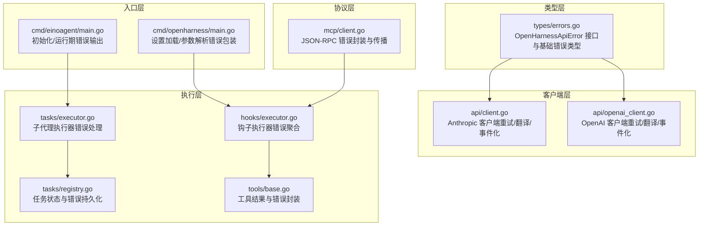
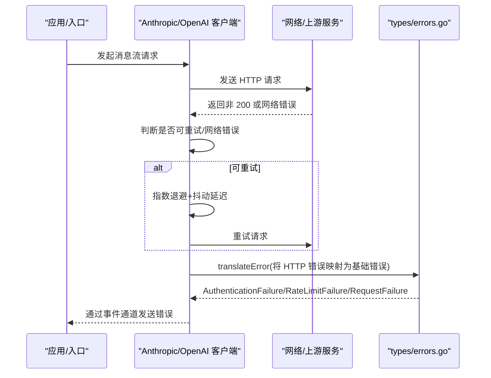
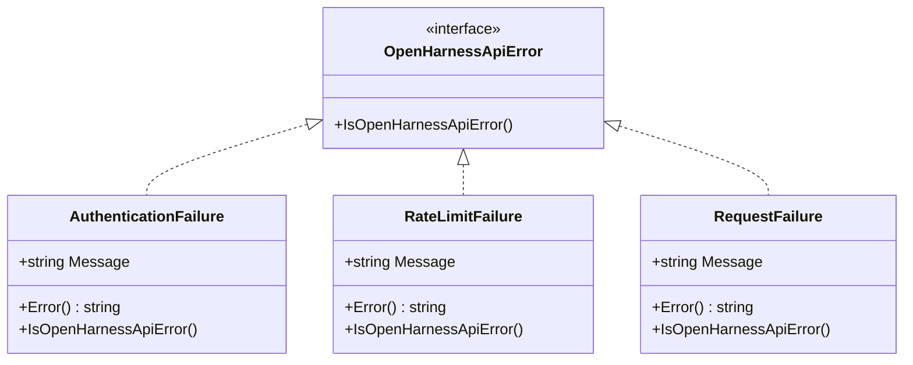
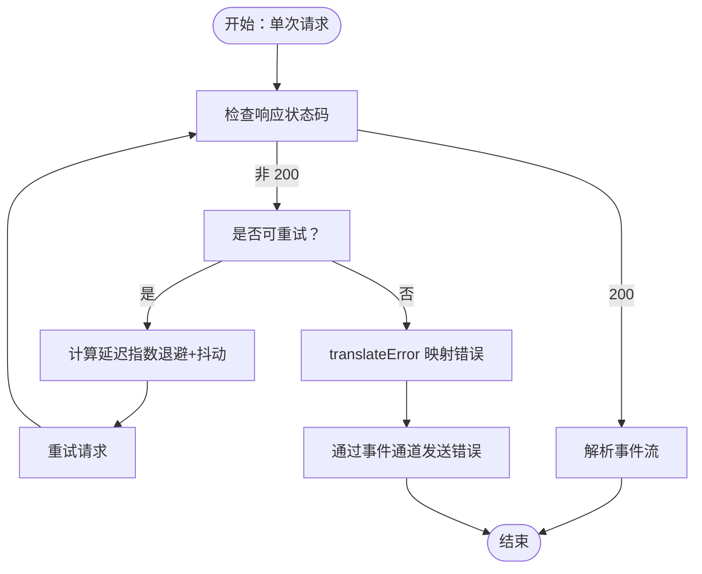
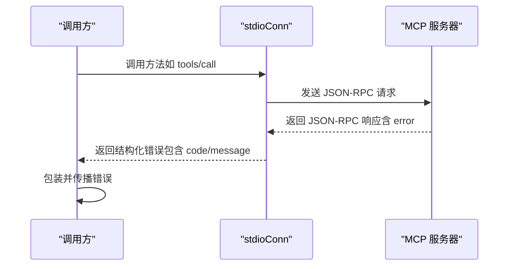
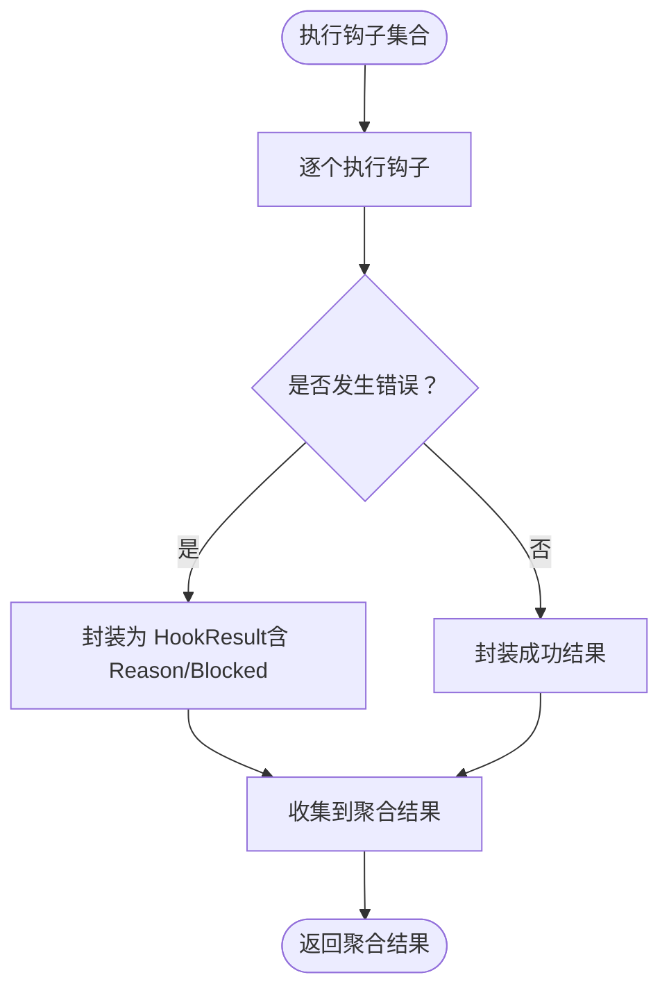
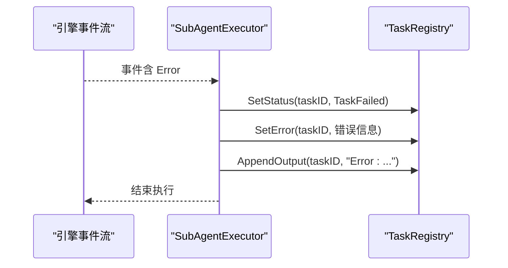
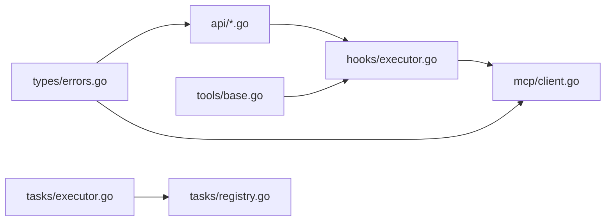

# 错误处理 API

<cite>
**本文引用的文件**
- [pkg/types/errors.go](file://pkg/types/errors.go)
- [pkg/api/client.go](file://pkg/api/client.go)
- [pkg/api/openai_client.go](file://pkg/api/openai_client.go)
- [pkg/mcp/client.go](file://pkg/mcp/client.go)
- [pkg/hooks/executor.go](file://pkg/hooks/executor.go)
- [pkg/tasks/executor.go](file://pkg/tasks/executor.go)
- [pkg/tasks/registry.go](file://pkg/tasks/registry.go)
- [pkg/tools/base.go](file://pkg/tools/base.go)
- [cmd/einoagent/main.go](file://cmd/einoagent/main.go)
- [cmd/openharness/main.go](file://cmd/openharness/main.go)
</cite>

## 目录
1. [简介](#简介)
2. [项目结构](#项目结构)
3. [核心组件](#核心组件)
4. [架构总览](#架构总览)
5. [详细组件分析](#详细组件分析)
6. [依赖关系分析](#依赖关系分析)
7. [性能考量](#性能考量)
8. [故障排查指南](#故障排查指南)
9. [结论](#结论)
10. [附录](#附录)

## 简介
本文件为 OpenHarness Go 错误处理系统的全面 API 参考与实践指南。内容覆盖错误类型与错误码、错误分类体系、错误传播与恢复策略、错误码对照表与信息格式规范、最佳实践与调试技巧，以及跨组件传递与处理的实现要点。目标是帮助集成开发者快速理解并正确使用错误处理机制，提升系统的稳定性与可观测性。

## 项目结构
OpenHarness 的错误处理涉及多层组件：
- 类型层：定义统一的错误接口与基础错误类型（认证失败、速率限制、请求失败）。
- 客户端层：对上游 API（Anthropic/OpenAI）进行重试、翻译与事件化错误传播。
- 协议层：MCP JSON-RPC 错误的封装与传播。
- 执行层：钩子执行器、任务执行器与工具注册表对错误的聚合与上报。
- 入口层：命令行入口对初始化与运行期错误进行打印与退出控制。

**图表来源**
- [pkg/types/errors.go:1-40](file://pkg/types/errors.go#L1-L40)
- [pkg/api/client.go:1-406](file://pkg/api/client.go#L1-L406)
- [pkg/api/openai_client.go:1-409](file://pkg/api/openai_client.go#L1-L409)
- [pkg/mcp/client.go:1-440](file://pkg/mcp/client.go#L1-L440)
- [pkg/hooks/executor.go:1-336](file://pkg/hooks/executor.go#L1-L336)
- [pkg/tasks/executor.go:1-224](file://pkg/tasks/executor.go#L1-L224)
- [pkg/tasks/registry.go:164-190](file://pkg/tasks/registry.go#L164-L190)
- [pkg/tools/base.go:1-132](file://pkg/tools/base.go#L1-L132)
- [cmd/einoagent/main.go:1-107](file://cmd/einoagent/main.go#L1-L107)
- [cmd/openharness/main.go:15-172](file://cmd/openharness/main.go#L15-L172)

**章节来源**
- [pkg/types/errors.go:1-40](file://pkg/types/errors.go#L1-L40)
- [pkg/api/client.go:1-406](file://pkg/api/client.go#L1-L406)
- [pkg/api/openai_client.go:1-409](file://pkg/api/openai_client.go#L1-L409)
- [pkg/mcp/client.go:1-440](file://pkg/mcp/client.go#L1-L440)
- [pkg/hooks/executor.go:1-336](file://pkg/hooks/executor.go#L1-L336)
- [pkg/tasks/executor.go:1-224](file://pkg/tasks/executor.go#L1-L224)
- [pkg/tasks/registry.go:164-190](file://pkg/tasks/registry.go#L164-L190)
- [pkg/tools/base.go:1-132](file://pkg/tools/base.go#L1-L132)
- [cmd/einoagent/main.go:1-107](file://cmd/einoagent/main.go#L1-L107)
- [cmd/openharness/main.go:15-172](file://cmd/openharness/main.go#L15-L172)

## 核心组件
- 统一错误接口与基础错误类型
  - OpenHarnessApiError：上游 API 失败的统一接口，用于识别 OpenHarness 自身定义的 API 错误。
  - AuthenticationFailure：认证失败（如 401/403）。
  - RateLimitFailure：速率限制触发（如 429）。
  - RequestFailure：通用请求或传输失败。
  - IsOpenHarnessError：判断错误是否属于 OpenHarnessApiError。
- 客户端错误翻译与重试
  - AnthropicApiClient 与 OpenAIApiClient 在单次调用失败时，通过 translateError 将 HTTP 错误映射到上述基础错误类型；对网络错误与可重试状态码进行指数退避与抖动重试。
- 协议层错误
  - MCP JSON-RPC 错误以结构化方式返回，便于上层捕获与处理。
- 执行层错误聚合
  - 钩子执行器将每个钩子的执行结果与错误聚合为统一的执行结果；任务执行器在事件流中遇到错误时设置任务状态与错误信息；工具结果支持错误标记。
- 入口层错误输出
  - 命令行入口在初始化与运行阶段对错误进行标准错误输出与进程退出控制。

**章节来源**
- [pkg/types/errors.go:5-39](file://pkg/types/errors.go#L5-L39)
- [pkg/api/client.go:359-405](file://pkg/api/client.go#L359-L405)
- [pkg/api/openai_client.go:260-402](file://pkg/api/openai_client.go#L260-L402)
- [pkg/mcp/client.go:33-40](file://pkg/mcp/client.go#L33-L40)
- [pkg/hooks/executor.go:70-105](file://pkg/hooks/executor.go#L70-L105)
- [pkg/tasks/executor.go:116-137](file://pkg/tasks/executor.go#L116-L137)
- [pkg/tools/base.go:34-49](file://pkg/tools/base.go#L34-L49)
- [cmd/einoagent/main.go:28-47](file://cmd/einoagent/main.go#L28-L47)
- [cmd/openharness/main.go:15-172](file://cmd/openharness/main.go#L15-L172)

## 架构总览
下图展示错误从上游 API 到应用层的传播路径与转换规则：

**图表来源**
- [pkg/api/client.go:107-148](file://pkg/api/client.go#L107-L148)
- [pkg/api/client.go:359-405](file://pkg/api/client.go#L359-L405)
- [pkg/types/errors.go:11-33](file://pkg/types/errors.go#L11-L33)

## 详细组件分析

### 组件 A：统一错误类型与分类
- 错误接口与基础类型
  - OpenHarnessApiError：标记接口，用于区分上游 API 错误与普通错误。
  - AuthenticationFailure：携带消息字段，表示认证失败。
  - RateLimitFailure：携带消息字段，表示速率限制。
  - RequestFailure：携带消息字段，表示通用请求/传输失败。
  - IsOpenHarnessError：用于判定错误是否属于 OpenHarnessApiError。
- 分类与用途
  - 该分类体系用于在客户端层将 HTTP 错误标准化为统一的错误类型，便于上层一致处理与区分。

**图表来源**
- [pkg/types/errors.go:5-33](file://pkg/types/errors.go#L5-L33)

**章节来源**
- [pkg/types/errors.go:5-39](file://pkg/types/errors.go#L5-L39)

### 组件 B：API 客户端错误翻译与重试
- 关键行为
  - 单次请求失败后，若为网络错误或可重试状态码（429/500/502/503/529），则进行最多 N 次重试，采用指数退避与抖动延迟。
  - translateError 将 HTTP 错误映射为 AuthenticationFailure/RateLimitFailure/RequestFailure。
  - 对 OpenHarnessApiError 类型错误，直接通过事件通道发送，不再重试。
- 传播模式
  - 通过 ApiStreamEvent.Err 字段向调用方传播错误，调用方可据此中断流程或回退。

**图表来源**
- [pkg/api/client.go:107-148](file://pkg/api/client.go#L107-L148)
- [pkg/api/client.go:359-405](file://pkg/api/client.go#L359-L405)

**章节来源**
- [pkg/api/client.go:107-148](file://pkg/api/client.go#L107-L148)
- [pkg/api/client.go:359-405](file://pkg/api/client.go#L359-L405)

### 组件 C：MCP JSON-RPC 错误
- 行为说明
  - JSON-RPC 错误以结构化对象返回，包含 code 与 message。
  - 上层在调用工具或资源读取时，若收到错误，会将其包装为带上下文的错误并返回。
- 传播模式
  - 调用方在捕获到错误后，可根据 code/message 进行差异化处理（例如重试、降级或提示用户）。

**图表来源**
- [pkg/mcp/client.go:54-105](file://pkg/mcp/client.go#L54-L105)
- [pkg/mcp/client.go:33-40](file://pkg/mcp/client.go#L33-L40)

**章节来源**
- [pkg/mcp/client.go:54-105](file://pkg/mcp/client.go#L54-L105)
- [pkg/mcp/client.go:33-40](file://pkg/mcp/client.go#L33-L40)

### 组件 D：钩子执行器错误聚合
- 行为说明
  - 对命令钩子、HTTP 钩子与 LLM 钩子分别执行，若发生错误，将错误信息封装为 HookResult 并记录 Reason 与 Blocked 字段。
  - 支持 BlockOnFailure：当钩子配置为阻断时，错误会导致后续流程被阻断。
- 传播模式
  - 返回 AggregatedHookResult，其中包含每个钩子的执行结果与错误摘要，便于上层决策。

**图表来源**
- [pkg/hooks/executor.go:70-105](file://pkg/hooks/executor.go#L70-L105)
- [pkg/hooks/executor.go:111-151](file://pkg/hooks/executor.go#L111-L151)
- [pkg/hooks/executor.go:157-206](file://pkg/hooks/executor.go#L157-L206)
- [pkg/hooks/executor.go:212-269](file://pkg/hooks/executor.go#L212-L269)

**章节来源**
- [pkg/hooks/executor.go:70-105](file://pkg/hooks/executor.go#L70-L105)
- [pkg/hooks/executor.go:111-151](file://pkg/hooks/executor.go#L111-L151)
- [pkg/hooks/executor.go:157-206](file://pkg/hooks/executor.go#L157-L206)
- [pkg/hooks/executor.go:212-269](file://pkg/hooks/executor.go#L212-L269)

### 组件 E：任务执行器与任务注册表
- 行为说明
  - 子代理执行器在事件循环中捕获错误事件，设置任务状态为失败，写入错误信息与输出，并终止执行。
  - 任务注册表提供 SetError 方法，用于持久化错误信息。
- 传播模式
  - 通过任务状态与错误字段对外暴露，便于上层监控与恢复。

**图表来源**
- [pkg/tasks/executor.go:116-137](file://pkg/tasks/executor.go#L116-L137)
- [pkg/tasks/registry.go:180-190](file://pkg/tasks/registry.go#L180-L190)

**章节来源**
- [pkg/tasks/executor.go:116-137](file://pkg/tasks/executor.go#L116-L137)
- [pkg/tasks/registry.go:180-190](file://pkg/tasks/registry.go#L180-L190)

### 组件 F：工具结果与错误封装
- 行为说明
  - 工具结果支持错误标记（IsError），便于在执行链路中识别与传播工具级错误。
- 传播模式
  - 工具执行器在捕获到错误时，构造错误结果并通过事件或回调返回给上层。

**章节来源**
- [pkg/tools/base.go:34-49](file://pkg/tools/base.go#L34-L49)

## 依赖关系分析
- 类型依赖
  - api 客户端依赖 types 错误类型进行错误映射与识别。
- 执行依赖
  - 钩子执行器依赖工具注册表与 LLM 客户端；任务执行器依赖引擎与工具注册表。
- 协议依赖
  - MCP 客户端依赖 JSON-RPC 响应结构进行错误解析与传播。

**图表来源**
- [pkg/types/errors.go:1-40](file://pkg/types/errors.go#L1-L40)
- [pkg/api/client.go:19-19](file://pkg/api/client.go#L19-L19)
- [pkg/mcp/client.go:3-13](file://pkg/mcp/client.go#L3-L13)
- [pkg/tools/base.go:4-12](file://pkg/tools/base.go#L4-L12)
- [pkg/hooks/executor.go:3-16](file://pkg/hooks/executor.go#L3-L16)
- [pkg/tasks/executor.go:9-12](file://pkg/tasks/executor.go#L9-L12)
- [pkg/tasks/registry.go:164-190](file://pkg/tasks/registry.go#L164-L190)

**章节来源**
- [pkg/types/errors.go:1-40](file://pkg/types/errors.go#L1-L40)
- [pkg/api/client.go:19-19](file://pkg/api/client.go#L19-L19)
- [pkg/mcp/client.go:3-13](file://pkg/mcp/client.go#L3-L13)
- [pkg/tools/base.go:4-12](file://pkg/tools/base.go#L4-L12)
- [pkg/hooks/executor.go:3-16](file://pkg/hooks/executor.go#L3-L16)
- [pkg/tasks/executor.go:9-12](file://pkg/tasks/executor.go#L9-L12)
- [pkg/tasks/registry.go:164-190](file://pkg/tasks/registry.go#L164-L190)

## 性能考量
- 重试策略
  - 指数退避与抖动可避免雪崩效应，建议结合上游 Retry-After 头进行动态延迟调整。
- 事件通道缓冲
  - 客户端使用固定大小的事件通道，避免内存膨胀；在高并发场景需评估缓冲区大小与背压策略。
- 日志与可观测性
  - 在重试与错误传播过程中保留上下文信息（如尝试次数、状态码、延迟），有助于定位问题与优化重试参数。

[本节为通用指导，无需特定文件来源]

## 故障排查指南
- 认证失败（401/403）
  - 现象：出现 AuthenticationFailure。
  - 排查：确认密钥与权限范围；检查服务端策略变更。
  - 参考
    - [pkg/api/client.go:398-399](file://pkg/api/client.go#L398-L399)
    - [pkg/api/openai_client.go:285-292](file://pkg/api/openai_client.go#L285-L292)
- 速率限制（429）
  - 现象：出现 RateLimitFailure。
  - 排查：遵循 Retry-After 头或降低请求频率；增加重试上限与退避时间。
  - 参考
    - [pkg/api/client.go:400-401](file://pkg/api/client.go#L400-L401)
    - [pkg/api/client.go:380-389](file://pkg/api/client.go#L380-L389)
- 网络错误与不可重试错误
  - 现象：出现 RequestFailure；或直接通过事件通道返回错误。
  - 排查：检查网络连通性、超时设置与上游可用性。
  - 参考
    - [pkg/api/client.go:366-377](file://pkg/api/client.go#L366-L377)
    - [pkg/api/client.go:395-404](file://pkg/api/client.go#L395-L404)
- 钩子执行失败
  - 现象：AggregatedHookResult 中包含失败项，Reason 描述失败原因。
  - 排查：检查命令钩子的环境变量、HTTP 钩子的状态码与响应体、LLM 钩子的模型可用性。
  - 参考
    - [pkg/hooks/executor.go:93-101](file://pkg/hooks/executor.go#L93-L101)
    - [pkg/hooks/executor.go:136-144](file://pkg/hooks/executor.go#L136-L144)
    - [pkg/hooks/executor.go:191-199](file://pkg/hooks/executor.go#L191-L199)
    - [pkg/hooks/executor.go:249-251](file://pkg/hooks/executor.go#L249-L251)
- 任务执行失败
  - 现象：任务状态为失败，错误信息持久化至注册表。
  - 排查：查看任务输出与错误详情，定位具体环节（工具执行、引擎事件、权限等）。
  - 参考
    - [pkg/tasks/executor.go:121-125](file://pkg/tasks/executor.go#L121-L125)
    - [pkg/tasks/registry.go:180-190](file://pkg/tasks/registry.go#L180-L190)
- MCP 调用失败
  - 现象：JSON-RPC 错误返回，调用方包装为带上下文的错误。
  - 排查：检查服务器连接、初始化流程与工具/资源列表。
  - 参考
    - [pkg/mcp/client.go:33-40](file://pkg/mcp/client.go#L33-L40)
    - [pkg/mcp/client.go:100-104](file://pkg/mcp/client.go#L100-L104)
    - [pkg/mcp/client.go:296-373](file://pkg/mcp/client.go#L296-L373)

**章节来源**
- [pkg/api/client.go:359-405](file://pkg/api/client.go#L359-L405)
- [pkg/api/openai_client.go:260-402](file://pkg/api/openai_client.go#L260-L402)
- [pkg/hooks/executor.go:70-105](file://pkg/hooks/executor.go#L70-L105)
- [pkg/tasks/executor.go:116-137](file://pkg/tasks/executor.go#L116-L137)
- [pkg/tasks/registry.go:180-190](file://pkg/tasks/registry.go#L180-L190)
- [pkg/mcp/client.go:33-40](file://pkg/mcp/client.go#L33-L40)
- [pkg/mcp/client.go:296-373](file://pkg/mcp/client.go#L296-L373)

## 结论
OpenHarness 的错误处理体系以统一的错误接口为基础，结合客户端的重试与翻译、协议层的结构化错误、执行层的聚合与持久化，形成从上游到应用层的完整错误闭环。通过明确的分类与传播机制，开发者可以更高效地定位问题、制定恢复策略并提升系统韧性。

[本节为总结性内容，无需特定文件来源]

## 附录

### 错误码对照表与错误信息格式规范
- HTTP 状态码映射
  - 401/403 → AuthenticationFailure
  - 429 → RateLimitFailure
  - 其他 4xx/5xx 或网络错误 → RequestFailure
- 错误信息格式
  - 统一包含“错误类型 + 具体描述”，便于日志检索与告警分级。
  - MCP JSON-RPC 错误包含 code 与 message，建议在上层包装为带上下文的错误以便追踪。
- 事件化错误
  - 客户端通过事件通道发送错误，调用方可监听 Err 字段并进行差异化处理。

**章节来源**
- [pkg/api/client.go:392-405](file://pkg/api/client.go#L392-L405)
- [pkg/api/openai_client.go:285-292](file://pkg/api/openai_client.go#L285-L292)
- [pkg/mcp/client.go:33-40](file://pkg/mcp/client.go#L33-L40)

### 错误传播与恢复策略
- 传播策略
  - 客户端：优先传播 OpenHarnessApiError，避免重复包装；对网络错误与可重试状态码进行自动重试。
  - 执行器：将错误封装为可读的结果并记录 Reason，支持 BlockOnFailure 控制流程。
  - 任务执行器：在事件流中捕获错误并持久化，便于外部观察与恢复。
- 恢复策略
  - 限流与退避：根据 Retry-After 动态调整延迟，避免持续冲击上游。
  - 降级与旁路：在认证失败或网络不稳定时，提供降级路径或缓存回退。
  - 用户与权限：在工具执行前进行权限校验与用户确认，减少执行期失败。

**章节来源**
- [pkg/api/client.go:107-148](file://pkg/api/client.go#L107-L148)
- [pkg/hooks/executor.go:93-101](file://pkg/hooks/executor.go#L93-L101)
- [pkg/tasks/executor.go:121-125](file://pkg/tasks/executor.go#L121-L125)

### 最佳实践与调试技巧
- 最佳实践
  - 使用统一的错误接口与类型，确保跨模块一致性。
  - 在关键边界（钩子、工具、任务）添加错误聚合与可观测性。
  - 合理设置重试上限与退避参数，避免放大效应。
- 调试技巧
  - 通过事件通道与任务注册表查看错误详情与时间线。
  - 在 MCP 与钩子执行器中增加上下文日志，定位调用来源。
  - 使用根因追溯法（从症状回溯到原始触发点），并在源头加固防御。

**章节来源**
- [pkg/tasks/registry.go:180-190](file://pkg/tasks/registry.go#L180-L190)
- [pkg/mcp/client.go:296-373](file://pkg/mcp/client.go#L296-L373)
- [pkg/hooks/executor.go:93-101](file://pkg/hooks/executor.go#L93-L101)

### 入口中错误处理实现指南
- 初始化阶段
  - 若缺少必要环境变量或配置加载失败，应在标准错误输出后退出。
- 运行阶段
  - 对运行期错误进行标准错误输出，避免静默失败；根据错误类型决定是否中断流程。

**章节来源**
- [cmd/einoagent/main.go:28-47](file://cmd/einoagent/main.go#L28-L47)
- [cmd/einoagent/main.go:97-102](file://cmd/einoagent/main.go#L97-L102)
- [cmd/openharness/main.go:15-172](file://cmd/openharness/main.go#L15-L172)