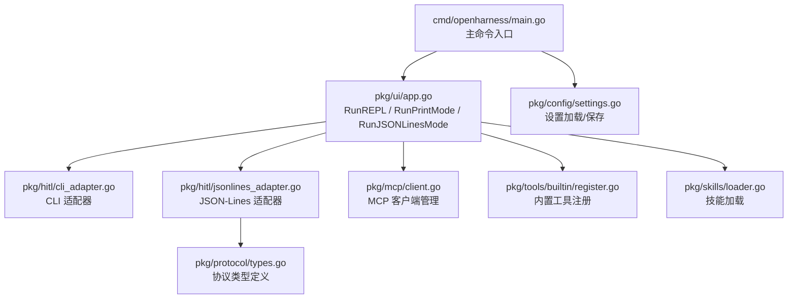
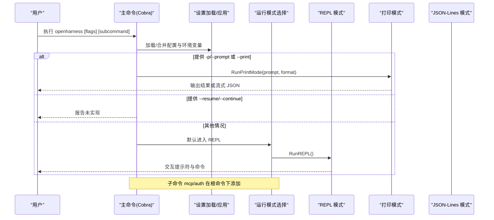
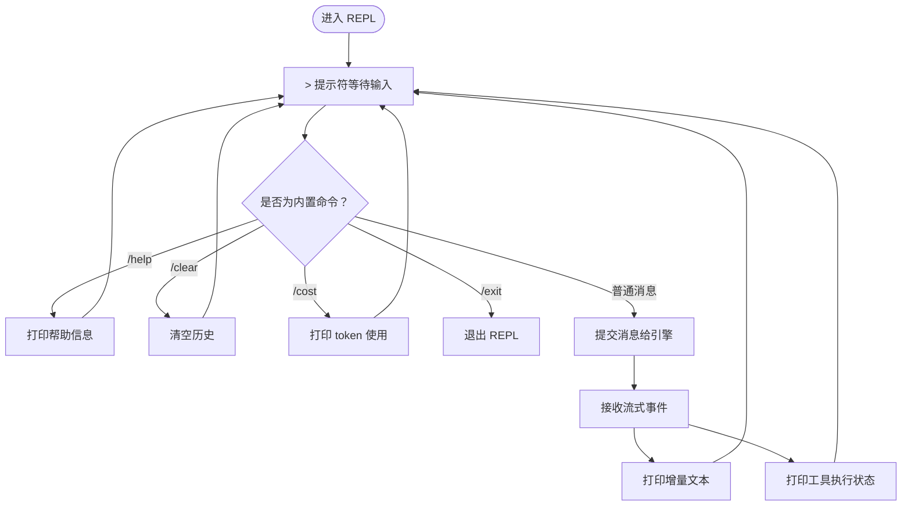
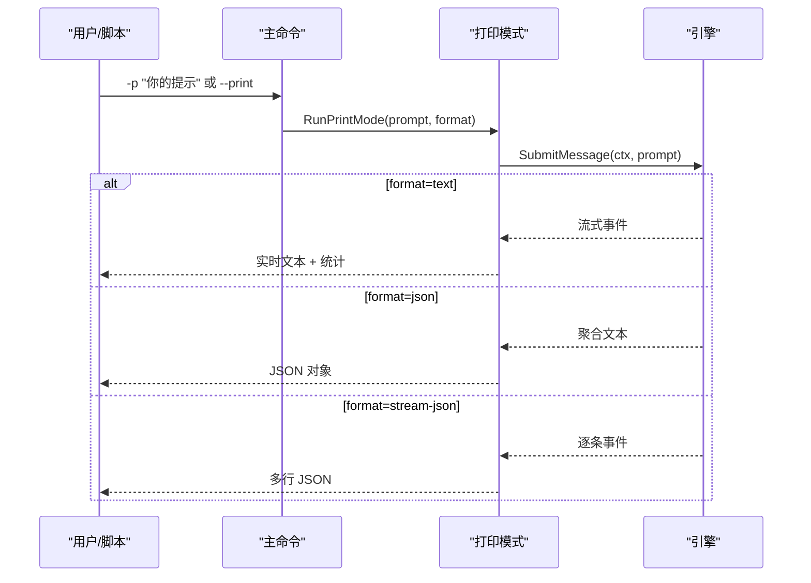
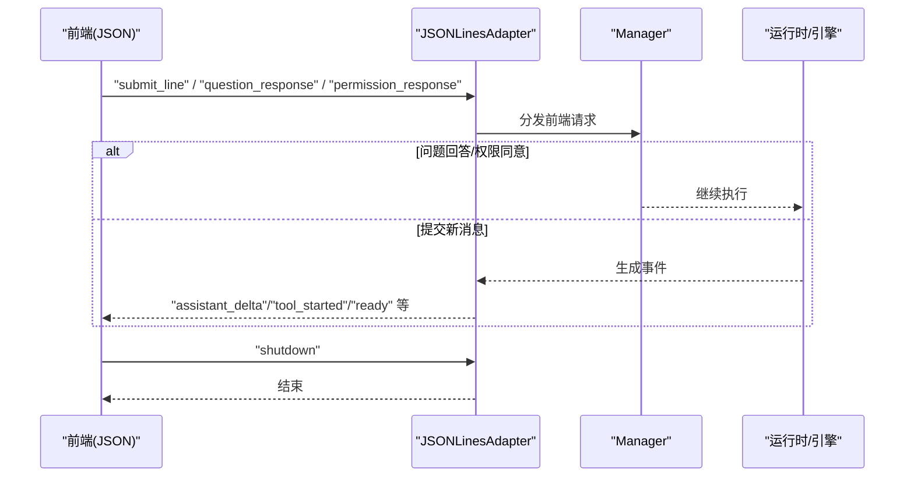
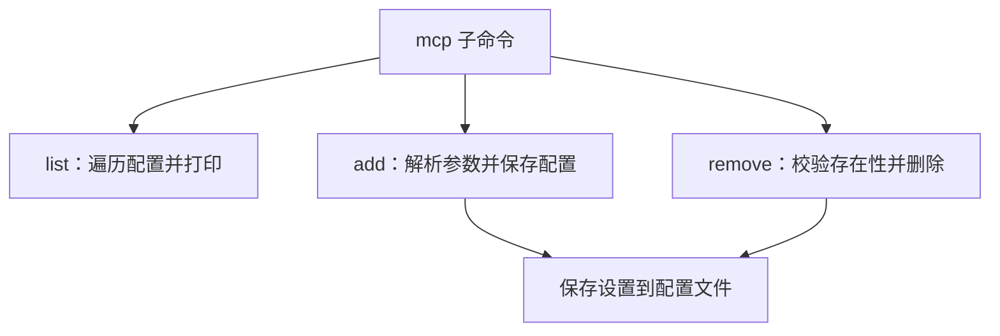
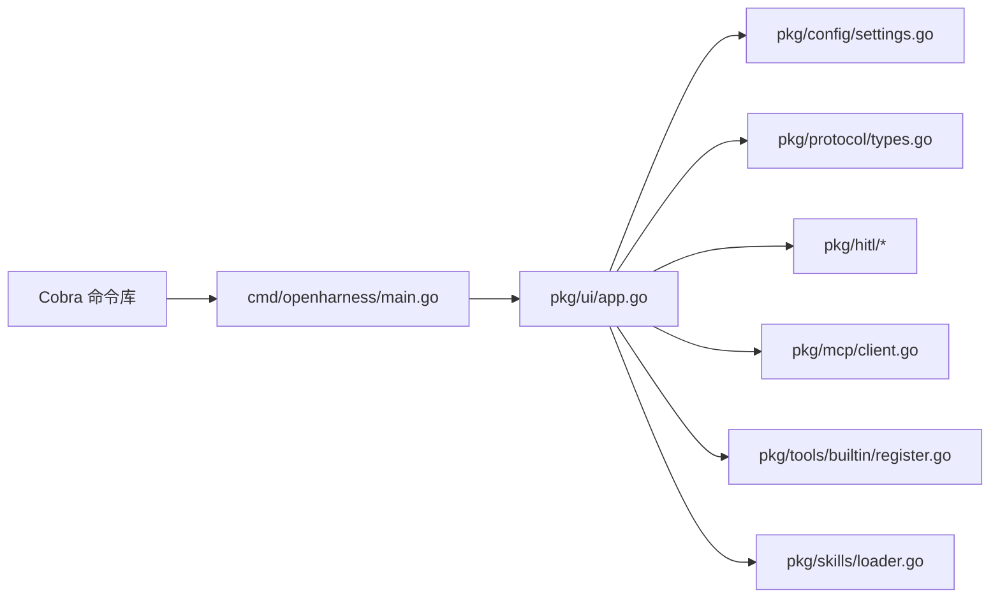

# CLI 使用指南

<cite>
**本文引用的文件**
- [cmd/openharness/main.go](file://cmd/openharness/main.go)
- [pkg/ui/app.go](file://pkg/ui/app.go)
- [pkg/hitl/cli_adapter.go](file://pkg/hitl/cli_adapter.go)
- [pkg/hitl/jsonlines_adapter.go](file://pkg/hitl/jsonlines_adapter.go)
- [pkg/protocol/types.go](file://pkg/protocol/types.go)
- [pkg/mcp/client.go](file://pkg/mcp/client.go)
- [pkg/config/settings.go](file://pkg/config/settings.go)
- [pkg/tools/builtin/register.go](file://pkg/tools/builtin/register.go)
- [pkg/skills/loader.go](file://pkg/skills/loader.go)
- [go.mod](file://go.mod)
</cite>

## 目录
1. [简介](#简介)
2. [项目结构](#项目结构)
3. [核心组件](#核心组件)
4. [架构总览](#架构总览)
5. [详细组件分析](#详细组件分析)
6. [依赖关系分析](#依赖关系分析)
7. [性能考虑](#性能考虑)
8. [故障排查指南](#故障排查指南)
9. [结论](#结论)
10. [附录](#附录)

## 简介
本指南面向 OpenHarness Go 的 CLI 用户，系统讲解主命令、MCP 服务器管理命令与认证命令；深入说明 REPL 交互模式的使用技巧（连续对话、复杂任务拆解、查看历史与成本信息）；介绍非交互模式与 JSON-Lines 协议在 TUI/IDE 集成中的用法；提供参数说明、输出格式解释与常见问题解决方案。

## 项目结构
OpenHarness CLI 基于 Cobra 构建，入口位于 cmd/openharness/main.go，核心运行逻辑在 pkg/ui/app.go 中实现，支持三种运行模式：
- REPL 交互模式（默认）
- 非交互打印模式（-p/--prompt 或 --print）
- JSON-Lines 协议模式（供 TUI/IDE/远程前端）

图表来源
- [cmd/openharness/main.go:15-102](file://cmd/openharness/main.go#L15-L102)
- [pkg/ui/app.go:18-238](file://pkg/ui/app.go#L18-L238)
- [pkg/hitl/cli_adapter.go:12-102](file://pkg/hitl/cli_adapter.go#L12-L102)
- [pkg/hitl/jsonlines_adapter.go:14-96](file://pkg/hitl/jsonlines_adapter.go#L14-L96)
- [pkg/protocol/types.go:12-102](file://pkg/protocol/types.go#L12-L102)
- [pkg/mcp/client.go:115-440](file://pkg/mcp/client.go#L115-L440)
- [pkg/config/settings.go:97-212](file://pkg/config/settings.go#L97-L212)
- [pkg/tools/builtin/register.go:7-30](file://pkg/tools/builtin/register.go#L7-L30)
- [pkg/skills/loader.go:21-198](file://pkg/skills/loader.go#L21-L198)

章节来源
- [cmd/openharness/main.go:15-102](file://cmd/openharness/main.go#L15-L102)
- [pkg/ui/app.go:18-238](file://pkg/ui/app.go#L18-L238)

## 核心组件
- 主命令与全局标志
  - 支持模型、提供商、API 密钥、基础 URL、最大输出 token、系统提示词、权限模式、输出格式、详细日志、快速模式、执行努力级别、迭代轮次、非交互模式、直接提示、会话恢复/继续等。
- 子命令
  - mcp：列出/添加/移除 MCP 服务器配置
  - auth：状态查询、登录（保存密钥）、登出（清除密钥）
- 运行模式
  - REPL：交互式对话，支持 /help、/clear、/cost、/exit
  - 打印模式：一次性请求，支持 text、json、stream-json 输出
  - JSON-Lines：前后端通过 JSON-Lines 协议通信

章节来源
- [cmd/openharness/main.go:22-102](file://cmd/openharness/main.go#L22-L102)
- [cmd/openharness/main.go:165-298](file://cmd/openharness/main.go#L165-L298)
- [pkg/ui/app.go:18-238](file://pkg/ui/app.go#L18-L238)

## 架构总览
下图展示 CLI 启动流程与三种运行模式的控制流：

图表来源
- [cmd/openharness/main.go:46-76](file://cmd/openharness/main.go#L46-L76)
- [pkg/ui/app.go:18-61](file://pkg/ui/app.go#L18-L61)
- [pkg/ui/app.go:122-181](file://pkg/ui/app.go#L122-L181)

## 详细组件分析

### 主命令与标志详解
- 模型与提供商
  - --model：模型名称
  - --provider：显式提供商（如 openai 兼容）
  - --base-url：API 基础地址
  - --api-key：API 密钥
- 行为控制
  - --max-tokens：最大输出 token
  - --system-prompt：自定义系统提示词
  - --permission-mode：权限模式（default/plan/full_auto）
  - --output-format：输出格式（text/json/stream-json）
  - --verbose：启用详细日志
  - --fast：快速模式（质量较低但更快）
  - --effort：执行努力级别（low/medium/high）
  - --passes：迭代轮次
- 非交互模式
  - -p/--prompt：直接提交提示并退出
  - --print：从标准输入读取提示并打印响应
- 会话控制
  - --resume/--continue：占位未实现

章节来源
- [cmd/openharness/main.go:22-102](file://cmd/openharness/main.go#L22-L102)
- [cmd/openharness/main.go:104-144](file://cmd/openharness/main.go#L104-L144)
- [pkg/config/settings.go:97-142](file://pkg/config/settings.go#L97-L142)

### REPL 交互模式
- 启动与提示符
  - 默认进入 REPL，显示版本、模型与工作目录
  - 提示符为 >，支持 Ctrl-D 退出
- 内置命令
  - /help：显示帮助
  - /clear：清空对话历史
  - /cost：查看当前记忆 token 使用与阈值
  - /exit：退出 REPL
- 人机交互（HITL）
  - 当需要用户确认或选择时，CLI 适配器通过标准输入输出进行问答与授权
- 流式输出
  - 文本模式下实时打印增量文本与工具执行状态
  - JSON 模式下聚合完整内容；stream-json 模式逐条输出事件类型与文本

图表来源
- [pkg/ui/app.go:122-189](file://pkg/ui/app.go#L122-L189)
- [pkg/hitl/cli_adapter.go:23-102](file://pkg/hitl/cli_adapter.go#L23-L102)

章节来源
- [pkg/ui/app.go:122-189](file://pkg/ui/app.go#L122-L189)
- [pkg/hitl/cli_adapter.go:23-102](file://pkg/hitl/cli_adapter.go#L23-L102)

### 非交互打印模式
- 一次性请求
  - -p/--prompt：直接提交提示
  - --print：从标准输入读取提示
- 输出格式
  - text：实时打印增量文本，并在完成后显示“大脑容量”百分比与当前 token 数
  - json：聚合完整内容为 JSON 对象
  - stream-json：逐条输出事件类型与文本
- 适用场景
  - 脚本化调用、CI/CD 集成、批处理任务

图表来源
- [cmd/openharness/main.go:58-67](file://cmd/openharness/main.go#L58-L67)
- [pkg/ui/app.go:18-120](file://pkg/ui/app.go#L18-L120)

章节来源
- [cmd/openharness/main.go:58-67](file://cmd/openharness/main.go#L58-L67)
- [pkg/ui/app.go:18-120](file://pkg/ui/app.go#L18-L120)

### JSON-Lines 协议模式（TUI/IDE 集成）
- 协议要点
  - 前端发送 JSON-Lines 请求（如 submit_line/question_response/permission_response/shutdown）
  - 后端通过 JSON-Lines 发送事件（如 ready/state_snapshot/transcript_item/assistant_delta/tool_started 等）
- 适配器职责
  - JSONLinesAdapter 负责读取前端请求、解析并分发；同时负责向前端回推事件
  - Manager 将前端响应路由到后端引擎，驱动对话推进
- 典型流程
  - 启动后先发送 ready 事件
  - 接收 submit_line 后异步处理并回推中间与最终事件
  - 收到 shutdown 后优雅退出

图表来源
- [pkg/ui/app.go:191-238](file://pkg/ui/app.go#L191-L238)
- [pkg/hitl/jsonlines_adapter.go:34-96](file://pkg/hitl/jsonlines_adapter.go#L34-L96)
- [pkg/protocol/types.go:53-101](file://pkg/protocol/types.go#L53-L101)

章节来源
- [pkg/ui/app.go:191-238](file://pkg/ui/app.go#L191-L238)
- [pkg/hitl/jsonlines_adapter.go:34-96](file://pkg/hitl/jsonlines_adapter.go#L34-L96)
- [pkg/protocol/types.go:53-101](file://pkg/protocol/types.go#L53-L101)

### MCP 服务器管理命令
- 列表：显示已配置的 MCP 服务器名称、命令与参数
- 添加：添加新的 MCP 服务器（名称、命令、参数列表）
- 移除：根据名称删除已配置的 MCP 服务器
- 注意：当前仅支持 stdio 传输，其他传输方式标记为待实现

图表来源
- [cmd/openharness/main.go:165-231](file://cmd/openharness/main.go#L165-L231)
- [pkg/mcp/client.go:136-148](file://pkg/mcp/client.go#L136-L148)

章节来源
- [cmd/openharness/main.go:165-231](file://cmd/openharness/main.go#L165-L231)
- [pkg/mcp/client.go:136-148](file://pkg/mcp/client.go#L136-L148)

### 认证命令
- 状态：显示当前认证状态（未配置/已配置(api_key)/已配置(环境变量)）
- 登录：交互式输入 API Key 并保存到配置文件
- 登出：移除存储的 API Key

章节来源
- [cmd/openharness/main.go:237-298](file://cmd/openharness/main.go#L237-L298)
- [pkg/config/settings.go:144-154](file://pkg/config/settings.go#L144-L154)

### 设置与环境变量
- 设置来源优先级：命令行标志 > 配置文件 > 环境变量
- 关键环境变量
  - ANTHROPIC_API_KEY：API 密钥
  - ANTHROPIC_MODEL / OPENHARNESS_MODEL：模型名
  - ANTHROPIC_BASE_URL / OPENHARNESS_BASE_URL：基础 URL
- 权限模式
  - default/plan/full_auto：影响工具与命令的执行策略

章节来源
- [pkg/config/settings.go:160-212](file://pkg/config/settings.go#L160-L212)

### 内置工具与技能
- 内置工具
  - 文件读写、编辑、搜索、通配符匹配、询问用户等
- 技能加载
  - 支持从目录与插件目录加载 Markdown 技能，生成虚拟插件索引与前缀化子技能

章节来源
- [pkg/tools/builtin/register.go:7-30](file://pkg/tools/builtin/register.go#L7-L30)
- [pkg/skills/loader.go:21-198](file://pkg/skills/loader.go#L21-L198)

## 依赖关系分析
- CLI 依赖 Cobra 进行命令解析
- 运行时依赖配置模块、协议模块、HITL 适配器与 MCP 客户端
- 输出格式与事件流由 UI 层统一调度

图表来源
- [go.mod:5](file://go.mod#L5)
- [cmd/openharness/main.go:10-12](file://cmd/openharness/main.go#L10-L12)
- [pkg/ui/app.go:3-16](file://pkg/ui/app.go#L3-L16)

章节来源
- [go.mod:5](file://go.mod#L5)
- [cmd/openharness/main.go:10-12](file://cmd/openharness/main.go#L10-L12)

## 性能考虑
- 快速模式与努力级别
  - --fast 可降低质量换取速度
  - --effort 控制推理深度（low/medium/high）
- 输出格式选择
  - stream-json 适合流式消费，减少一次性 JSON 编码开销
- 记忆与压缩
  - REPL 模式结束后可观察“大脑容量”百分比，合理规划长对话与大文件操作
- MCP 连接
  - 仅 stdio 传输已实现，避免网络阻塞；资源列表失败不中断流程

章节来源
- [pkg/ui/app.go:38-61](file://pkg/ui/app.go#L38-L61)
- [pkg/mcp/client.go:136-148](file://pkg/mcp/client.go#L136-L148)

## 故障排查指南
- 无 API Key
  - 现象：无法初始化引擎
  - 解决：使用 auth login 输入或设置 ANTHROPIC_API_KEY 环境变量
- 配置文件错误
  - 现象：解析配置失败
  - 解决：检查配置文件格式，必要时删除后重试以生成默认配置
- MCP 服务器未连接
  - 现象：工具/资源不可用
  - 解决：确认命令与参数正确，确保进程可启动；当前仅 stdio 传输有效
- JSON-Lines 协议异常
  - 现象：前端请求无效或无响应
  - 解决：检查每行 JSON 是否合法；前端需按协议类型发送请求并在收到 ready 后再提交消息

章节来源
- [pkg/config/settings.go:144-154](file://pkg/config/settings.go#L144-L154)
- [pkg/mcp/client.go:296-373](file://pkg/mcp/client.go#L296-L373)
- [pkg/hitl/jsonlines_adapter.go:55-82](file://pkg/hitl/jsonlines_adapter.go#L55-L82)

## 结论
OpenHarness Go 的 CLI 提供了灵活的三种运行模式，既能满足日常交互式开发，也能无缝对接自动化与第三方集成场景。通过合理配置与标志使用，可在不同任务场景中取得最佳体验与性能。

## 附录

### 常用命令与示例（路径引用）
- REPL 模式
  - 启动：openharness
  - 查看帮助：/help
  - 清空历史：/clear
  - 查看成本：/cost
  - 退出：/exit
- 非交互模式
  - 直接提示：openharness -p "你的提示"
  - 从标准输入读取：echo "你的提示" | openharness --print
  - JSON 输出：openharness -p "你的提示" --output-format json
  - 流式 JSON：openharness -p "你的提示" --output-format stream-json
- MCP 管理
  - 列表：openharness mcp list
  - 添加：openharness mcp add 名称 命令 参数...
  - 删除：openharness mcp remove 名称
- 认证
  - 状态：openharness auth status
  - 登录：openharness auth login
  - 登出：openharness auth logout

章节来源
- [cmd/openharness/main.go:46-76](file://cmd/openharness/main.go#L46-L76)
- [cmd/openharness/main.go:165-298](file://cmd/openharness/main.go#L165-L298)
- [pkg/ui/app.go:122-189](file://pkg/ui/app.go#L122-L189)