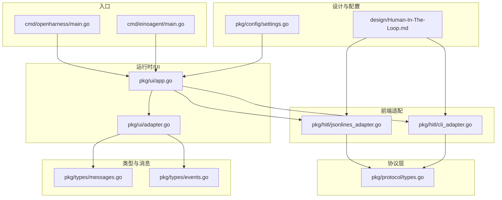
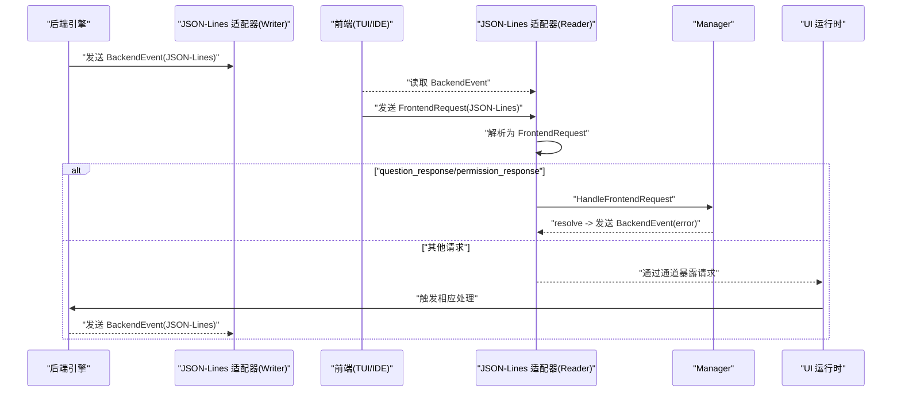
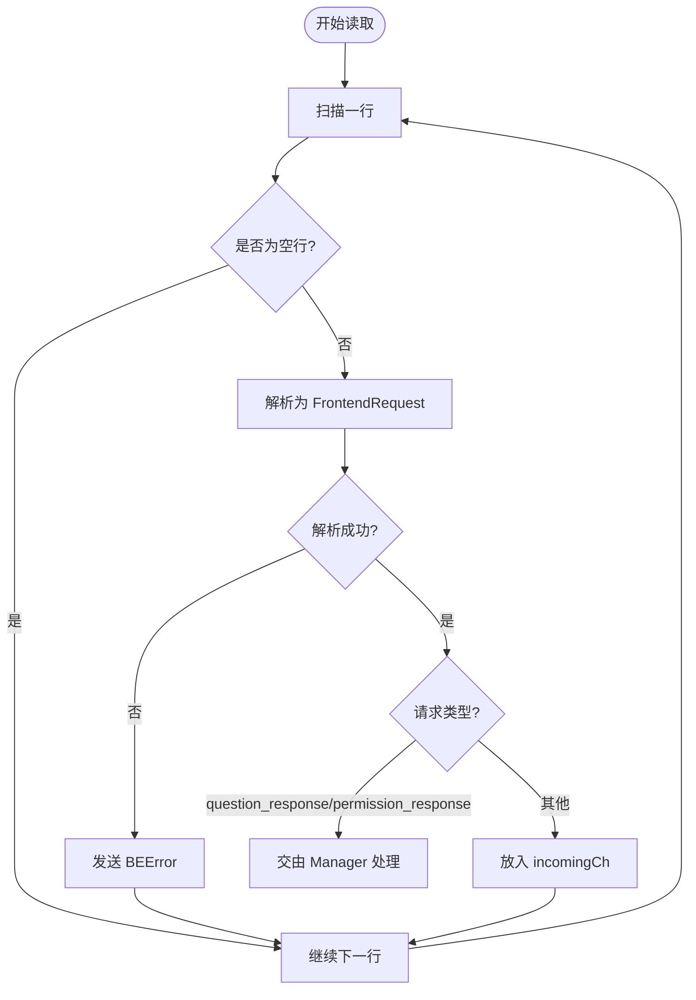
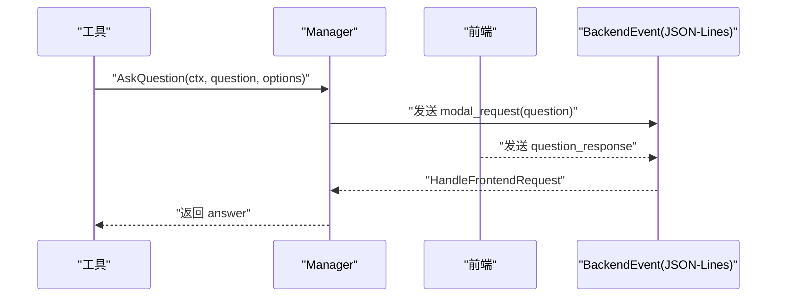
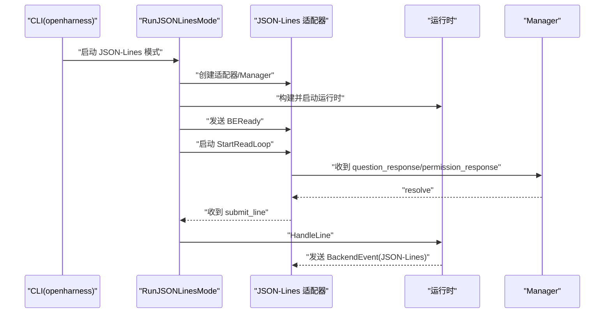
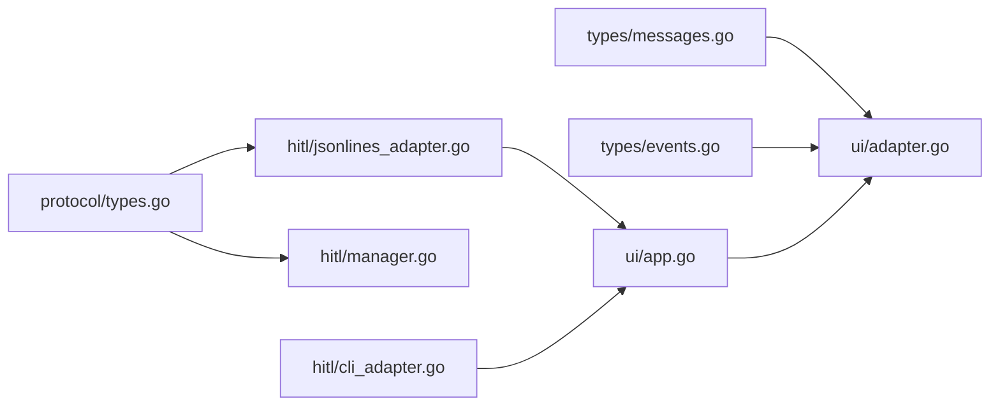

# JSON-Lines 协议

<cite>
**本文引用的文件**
- [pkg/protocol/types.go](file://pkg/protocol/types.go)
- [pkg/hitl/jsonlines_adapter.go](file://pkg/hitl/jsonlines_adapter.go)
- [pkg/hitl/manager.go](file://pkg/hitl/manager.go)
- [pkg/hitl/cli_adapter.go](file://pkg/hitl/cli_adapter.go)
- [pkg/ui/app.go](file://pkg/ui/app.go)
- [pkg/ui/adapter.go](file://pkg/ui/adapter.go)
- [pkg/types/messages.go](file://pkg/types/messages.go)
- [pkg/types/events.go](file://pkg/types/events.go)
- [cmd/openharness/main.go](file://cmd/openharness/main.go)
- [cmd/einoagent/main.go](file://cmd/einoagent/main.go)
- [design/Human-In-The-Loop.md](file://design/Human-In-The-Loop.md)
- [pkg/config/settings.go](file://pkg/config/settings.go)
</cite>

## 目录
1. [简介](#简介)
2. [项目结构](#项目结构)
3. [核心组件](#核心组件)
4. [架构总览](#架构总览)
5. [详细组件分析](#详细组件分析)
6. [依赖关系分析](#依赖关系分析)
7. [性能考量](#性能考量)
8. [故障排查指南](#故障排查指南)
9. [结论](#结论)
10. [附录](#附录)

## 简介
本指南面向希望在 OpenHarness Go 中使用 JSON-Lines 协议与 TUI 或 IDE 集成的开发者。内容涵盖协议工作原理、消息格式、事件类型、状态管理、与 UI/引擎的集成方式、扩展与自定义消息类型、调试与测试方法，以及常见问题的解决方案。

## 项目结构
与 JSON-Lines 协议直接相关的模块主要分布在以下位置：
- 协议定义：pkg/protocol/types.go
- 前端适配器（JSON-Lines）：pkg/hitl/jsonlines_adapter.go
- 人机交互管理器：pkg/hitl/manager.go
- CLI 适配器（用于 REPL 模式）：pkg/hitl/cli_adapter.go
- UI 入口与运行时：pkg/ui/app.go、pkg/ui/adapter.go
- 类型与消息模型：pkg/types/messages.go、pkg/types/events.go
- 命令行入口：cmd/openharness/main.go、cmd/einoagent/main.go
- 设计文档：design/Human-In-The-Loop.md
- 配置：pkg/config/settings.go



图表来源
- [pkg/protocol/types.go:1-102](file://pkg/protocol/types.go#L1-L102)
- [pkg/hitl/jsonlines_adapter.go:1-96](file://pkg/hitl/jsonlines_adapter.go#L1-L96)
- [pkg/hitl/cli_adapter.go:1-102](file://pkg/hitl/cli_adapter.go#L1-L102)
- [pkg/ui/app.go:1-238](file://pkg/ui/app.go#L1-L238)
- [pkg/ui/adapter.go:1-60](file://pkg/ui/adapter.go#L1-L60)
- [pkg/types/messages.go:1-169](file://pkg/types/messages.go#L1-L169)
- [pkg/types/events.go:1-40](file://pkg/types/events.go#L1-L40)
- [cmd/openharness/main.go:1-299](file://cmd/openharness/main.go#L1-L299)
- [cmd/einoagent/main.go:1-107](file://cmd/einoagent/main.go#L1-L107)
- [design/Human-In-The-Loop.md:1-800](file://design/Human-In-The-Loop.md#L1-L800)
- [pkg/config/settings.go:1-212](file://pkg/config/settings.go#L1-L212)

章节来源
- [pkg/protocol/types.go:1-102](file://pkg/protocol/types.go#L1-L102)
- [pkg/hitl/jsonlines_adapter.go:1-96](file://pkg/hitl/jsonlines_adapter.go#L1-L96)
- [pkg/hitl/manager.go:1-148](file://pkg/hitl/manager.go#L1-L148)
- [pkg/hitl/cli_adapter.go:1-102](file://pkg/hitl/cli_adapter.go#L1-L102)
- [pkg/ui/app.go:1-238](file://pkg/ui/app.go#L1-L238)
- [pkg/ui/adapter.go:1-60](file://pkg/ui/adapter.go#L1-L60)
- [pkg/types/messages.go:1-169](file://pkg/types/messages.go#L1-L169)
- [pkg/types/events.go:1-40](file://pkg/types/events.go#L1-L40)
- [cmd/openharness/main.go:1-299](file://cmd/openharness/main.go#L1-L299)
- [cmd/einoagent/main.go:1-107](file://cmd/einoagent/main.go#L1-L107)
- [design/Human-In-The-Loop.md:1-800](file://design/Human-In-The-Loop.md#L1-L800)
- [pkg/config/settings.go:1-212](file://pkg/config/settings.go#L1-L212)

## 核心组件
- 协议类型与消息
  - 后端事件类型与结构：定义了 ready、state_snapshot、tasks_snapshot、transcript_item、assistant_delta、assistant_complete、line_complete、tool_started、tool_completed、clear_transcript、error、shutdown、modal_request、select_request 等事件类型，以及 ModalInfo、SelectOption 等配套结构。
  - 前端请求类型与结构：定义了 submit_line、question_response、permission_response、list_sessions、shutdown 等请求类型，以及 FrontendRequest 结构。
- JSON-Lines 适配器
  - 从 Reader 逐行读取 JSON-Lines，解析为 FrontendRequest；对 question_response/permission_response 请求交由 Manager 处理；其他请求通过通道暴露给上层。
  - 提供 EmitFn 将 BackendEvent 以 JSON-Lines 形式输出。
- 人机交互管理器（Manager）
  - 维护问题与权限两类请求的等待通道，生成 request_id，发出 modal_request 事件，接收前端回答后派发到对应通道。
- CLI 适配器
  - 在 REPL 模式下通过 stdin/stdout 与用户交互，支持多选题数字输入与自由文本输入。
- UI 运行时
  - 提供 RunJSONLinesMode，建立 JSON-Lines 适配器与 Manager，并在启动后发送 BEReady 事件，随后进入请求处理循环。
  - 提供 RunREPL，注入 CLI 适配器，支持命令与帮助。
- 类型与消息模型
  - ContentBlock、ConversationMessage、StreamEvent 接口及其实现（AssistantTextDelta、AssistantTurnComplete、ToolExecutionStarted、ToolExecutionCompleted）等，支撑对话与工具执行的结构化表示。

章节来源
- [pkg/protocol/types.go:14-101](file://pkg/protocol/types.go#L14-L101)
- [pkg/hitl/jsonlines_adapter.go:14-96](file://pkg/hitl/jsonlines_adapter.go#L14-L96)
- [pkg/hitl/manager.go:11-148](file://pkg/hitl/manager.go#L11-L148)
- [pkg/hitl/cli_adapter.go:12-102](file://pkg/hitl/cli_adapter.go#L12-L102)
- [pkg/ui/app.go:191-238](file://pkg/ui/app.go#L191-L238)
- [pkg/types/messages.go:11-169](file://pkg/types/messages.go#L11-L169)
- [pkg/types/events.go:3-40](file://pkg/types/events.go#L3-L40)

## 架构总览
JSON-Lines 协议在 OpenHarness Go 中的运行路径如下：
- 后端引擎产生 BackendEvent（如 modal_request），通过 JSON-Lines 适配器以 JSON-Lines 输出。
- 前端（TUI/IDE）读取后端事件，根据事件类型构造 FrontendRequest（如 question_response/permission_response）并通过 stdin 发送。
- JSON-Lines 适配器解析请求，将问题/权限类请求路由至 Manager，其他请求通过通道交给上层处理。
- 上层（UI 运行时）根据请求类型调用引擎或工具，最终将结果以 BackendEvent 形式回传。



图表来源
- [pkg/hitl/jsonlines_adapter.go:34-96](file://pkg/hitl/jsonlines_adapter.go#L34-L96)
- [pkg/hitl/manager.go:120-142](file://pkg/hitl/manager.go#L120-L142)
- [pkg/ui/app.go:191-238](file://pkg/ui/app.go#L191-L238)

## 详细组件分析

### 协议类型与消息格式
- 后端事件（BackendEvent）
  - 类型：ready、state_snapshot、tasks_snapshot、transcript_item、assistant_delta、assistant_complete、line_complete、tool_started、tool_completed、clear_transcript、error、shutdown、modal_request、select_request。
  - 结构：包含 type、text、error、modal、select_options、extra 等字段。
- 前端请求（FrontendRequest）
  - 类型：submit_line、question_response、permission_response、list_sessions、shutdown。
  - 结构：包含 type、request_id、line、answer、allowed。
- 模态信息（ModalInfo）
  - 类型：question、permission。
  - 结构：kind、request_id、question、options、tool_name、reason。
- 选择项（SelectOption）
  - 结构：label、value、description。

```mermaid
classDiagram
class BackendEvent {
+BackendEventType type
+string text
+string error
+ModalInfo modal
+SelectOption[] select_options
+map[string]interface{} extra
}
class FrontendRequest {
+FrontendRequestType type
+string request_id
+string line
+string answer
+bool* allowed
}
class ModalInfo {
+ModalKind kind
+string request_id
+string question
+string[] options
+string tool_name
+string reason
}
class SelectOption {
+string label
+string value
+string description
}
BackendEvent --> ModalInfo : "包含"
BackendEvent --> SelectOption : "包含多个"
FrontendRequest --> ModalInfo : "用于响应"
```

图表来源
- [pkg/protocol/types.go:53-101](file://pkg/protocol/types.go#L53-L101)

章节来源
- [pkg/protocol/types.go:14-101](file://pkg/protocol/types.go#L14-L101)

### JSON-Lines 适配器
- 功能要点
  - 使用 bufio.Scanner 逐行读取输入，解析为 FrontendRequest。
  - 对 question_response/permission_response 请求交由 Manager 处理；其他请求通过 incomingCh 通道暴露。
  - 提供 EmitFn 将 BackendEvent 序列化为 JSON-Lines 并输出。
- 错误处理
  - 解析失败时发送 BEError 事件。
  - 读取 EOF 返回 io.EOF。
- 并发与缓冲
  - incomingCh 缓冲大小为 32。
  - 扫描器设置大缓冲区以提升长行读取性能。



图表来源
- [pkg/hitl/jsonlines_adapter.go:34-82](file://pkg/hitl/jsonlines_adapter.go#L34-L82)

章节来源
- [pkg/hitl/jsonlines_adapter.go:14-96](file://pkg/hitl/jsonlines_adapter.go#L14-L96)

### 人机交互管理器（Manager）
- 功能要点
  - 生成 request_id，维护问题与权限两类等待通道。
  - 发出 modal_request 事件，前端回答后通过通道返回。
  - 支持上下文取消，清理未决请求。
- 状态管理
  - 通过互斥锁保护请求映射表。
  - 提供 PendingCount 查看未决请求数量。



图表来源
- [pkg/hitl/manager.go:33-90](file://pkg/hitl/manager.go#L33-L90)
- [pkg/hitl/jsonlines_adapter.go:64-73](file://pkg/hitl/jsonlines_adapter.go#L64-L73)

章节来源
- [pkg/hitl/manager.go:11-148](file://pkg/hitl/manager.go#L11-L148)

### CLI 适配器与 REPL 集成
- CLI 适配器
  - 通过 stdout 输出问题/权限请求提示，通过 stdin 读取用户输入。
  - 支持多选题数字输入映射到选项值，也支持自由文本输入。
- REPL 模式
  - 注入 CLIAdapter，支持 /clear、/cost、/help、/exit 等命令。
  - 与 JSON-Lines 模式共享相同的工具与引擎逻辑。

章节来源
- [pkg/hitl/cli_adapter.go:12-102](file://pkg/hitl/cli_adapter.go#L12-L102)
- [pkg/ui/app.go:122-189](file://pkg/ui/app.go#L122-L189)

### UI 运行时与 JSON-Lines 模式
- RunJSONLinesMode
  - 创建 JSON-Lines 适配器与 Manager，注入到运行时。
  - 启动后发送 BEReady 事件，启动读取循环，监听 incomingCh 并处理 submit_line/shutdown。
- 输出格式
  - 支持文本、JSON、stream-json 三种输出格式（非 JSON-Lines 模式）。



图表来源
- [pkg/ui/app.go:191-238](file://pkg/ui/app.go#L191-L238)
- [pkg/hitl/jsonlines_adapter.go:34-96](file://pkg/hitl/jsonlines_adapter.go#L34-L96)
- [pkg/hitl/manager.go:120-142](file://pkg/hitl/manager.go#L120-L142)

章节来源
- [pkg/ui/app.go:191-238](file://pkg/ui/app.go#L191-L238)

### 类型与消息模型
- ContentBlock
  - 支持 text、tool_use、tool_result 三种类型，字段按类型填充。
- ConversationMessage
  - 角色与内容块列表，支持文本拼接、工具调用提取、API 参数转换。
- 流式事件
  - AssistantTextDelta、AssistantTurnComplete、ToolExecutionStarted、ToolExecutionCompleted，作为流式事件的载体。

章节来源
- [pkg/types/messages.go:11-169](file://pkg/types/messages.go#L11-L169)
- [pkg/types/events.go:3-40](file://pkg/types/events.go#L3-L40)

## 依赖关系分析
- 协议层（pkg/protocol/types.go）保持无外部依赖，避免循环引用。
- JSON-Lines 适配器依赖协议层进行请求解析与事件序列化。
- Manager 依赖协议层的事件与模态信息结构。
- UI 运行时同时依赖 CLI 与 JSON-Lines 适配器，实现多前端支持。
- 类型与消息模型被 UI 适配器与引擎共同使用。



图表来源
- [pkg/protocol/types.go:1-102](file://pkg/protocol/types.go#L1-L102)
- [pkg/hitl/jsonlines_adapter.go:1-96](file://pkg/hitl/jsonlines_adapter.go#L1-L96)
- [pkg/hitl/manager.go:1-148](file://pkg/hitl/manager.go#L1-L148)
- [pkg/hitl/cli_adapter.go:1-102](file://pkg/hitl/cli_adapter.go#L1-L102)
- [pkg/ui/app.go:1-238](file://pkg/ui/app.go#L1-L238)
- [pkg/ui/adapter.go:1-60](file://pkg/ui/adapter.go#L1-L60)
- [pkg/types/messages.go:1-169](file://pkg/types/messages.go#L1-L169)
- [pkg/types/events.go:1-40](file://pkg/types/events.go#L1-L40)

章节来源
- [pkg/protocol/types.go:1-102](file://pkg/protocol/types.go#L1-L102)
- [pkg/hitl/jsonlines_adapter.go:1-96](file://pkg/hitl/jsonlines_adapter.go#L1-L96)
- [pkg/hitl/manager.go:1-148](file://pkg/hitl/manager.go#L1-L148)
- [pkg/hitl/cli_adapter.go:1-102](file://pkg/hitl/cli_adapter.go#L1-L102)
- [pkg/ui/app.go:1-238](file://pkg/ui/app.go#L1-L238)
- [pkg/ui/adapter.go:1-60](file://pkg/ui/adapter.go#L1-L60)
- [pkg/types/messages.go:1-169](file://pkg/types/messages.go#L1-L169)
- [pkg/types/events.go:1-40](file://pkg/types/events.go#L1-L40)

## 性能考量
- JSON-Lines 读取
  - 使用 bufio.Scanner 并设置大缓冲区，适合长行或多行消息。
  - incomingCh 缓冲为 32，建议前端控制并发请求速率，避免阻塞。
- 事件序列化
  - 使用标准库 json.Marshal，简单可靠；若对吞吐有更高要求，可考虑复用缓冲区或优化序列化策略。
- 并发与锁
  - Manager 使用互斥锁保护请求映射，通道为带缓冲的单次写入，整体并发安全且开销较小。

## 故障排查指南
- 前端无法收到 ready 事件
  - 确认 UI 运行时已发送 BEReady；检查 stdout 是否被正确重定向。
- 前端发送的请求解析失败
  - JSON-Lines 适配器会在解析错误时发送 BEError；检查请求 JSON 的字段完整性与类型。
- question_response/permission_response 未生效
  - 确认 request_id 存在且未过期；检查 Manager 的 ResolveQuestion/ResolvePermission 是否被调用。
- REPL 模式与 JSON-Lines 模式混用
  - REPL 模式使用 CLI 适配器，JSON-Lines 模式使用 Manager；两者不可同时注入到同一运行时。
- 输出格式与调试
  - 非 JSON-Lines 模式支持 text、json、stream-json 输出；可通过命令行参数切换，便于调试。

章节来源
- [pkg/hitl/jsonlines_adapter.go:56-73](file://pkg/hitl/jsonlines_adapter.go#L56-L73)
- [pkg/hitl/manager.go:120-142](file://pkg/hitl/manager.go#L120-L142)
- [pkg/ui/app.go:191-238](file://pkg/ui/app.go#L191-L238)

## 结论
OpenHarness Go 的 JSON-Lines 协议通过清晰的事件/请求类型、可靠的适配器与管理器实现，为 TUI/IDE 集成提供了稳定、可扩展的双向通信能力。结合 CLI 与 JSON-Lines 两种前端适配方式，既满足本地 REPL 场景，又支持远程前端接入。遵循本文的集成步骤与最佳实践，可快速完成协议对接与调试。

## 附录

### 协议消息格式与事件类型速查
- 后端事件（BackendEvent）
  - 类型：ready、state_snapshot、tasks_snapshot、transcript_item、assistant_delta、assistant_complete、line_complete、tool_started、tool_completed、clear_transcript、error、shutdown、modal_request、select_request。
  - 字段：type、text、error、modal、select_options、extra。
- 前端请求（FrontendRequest）
  - 类型：submit_line、question_response、permission_response、list_sessions、shutdown。
  - 字段：type、request_id、line、answer、allowed。
- 模态信息（ModalInfo）
  - 字段：kind、request_id、question、options、tool_name、reason。
- 选择项（SelectOption）
  - 字段：label、value、description。

章节来源
- [pkg/protocol/types.go:14-101](file://pkg/protocol/types.go#L14-L101)

### 与 TUI/IDE 集成步骤
- 启动后端
  - 使用命令行入口启动后端（例如 openharness），确保 stdout 输出 JSON-Lines。
- 前端连接
  - TUI/IDE 读取后端输出，识别 BEReady 后开始发送 FrontendRequest。
  - 对于 modal_request，前端需构造 question_response 或 permission_response 并发送。
- 请求处理
  - 后端 JSON-Lines 适配器解析请求，Manager 处理问题/权限请求，其他请求通过通道交给运行时处理。
- 断开与关闭
  - 前端发送 shutdown 请求，后端退出。

章节来源
- [pkg/ui/app.go:191-238](file://pkg/ui/app.go#L191-L238)
- [pkg/hitl/jsonlines_adapter.go:34-96](file://pkg/hitl/jsonlines_adapter.go#L34-L96)
- [pkg/hitl/manager.go:120-142](file://pkg/hitl/manager.go#L120-L142)

### 与 IDE 集成示例（概念性流程）
- 初始化
  - 启动后端进程，捕获 stdout 作为 JSON-Lines 输入源。
- 事件消费
  - 解析 BackendEvent，根据类型更新 UI 状态（如显示模态框、工具执行进度）。
- 请求生产
  - 当收到 modal_request 时，弹出对话框，收集用户输入后构造 FrontendRequest 并写入 stdin。
- 日志与调试
  - 记录所有 JSON-Lines 往返，便于定位问题。

（本节为概念性说明，不直接对应具体源码）

### 协议扩展与自定义消息类型
- 新增事件类型
  - 在 BackendEventType 常量集中添加新类型，并在 UI 与前端中实现对应的渲染与交互。
- 新增请求类型
  - 在 FrontendRequestType 常量集中添加新类型，并在 JSON-Lines 适配器中增加解析与处理分支。
- 自定义字段
  - 在 BackendEvent/FrontendRequest 中添加字段时，确保序列化/反序列化兼容性，并在两端同步更新。

章节来源
- [pkg/protocol/types.go:16-101](file://pkg/protocol/types.go#L16-L101)
- [pkg/hitl/jsonlines_adapter.go:56-80](file://pkg/hitl/jsonlines_adapter.go#L56-L80)

### 调试工具与测试方法
- 文本输出模式
  - 使用非交互模式输出完整响应，便于验证内容与格式。
- 流式 JSON 输出
  - 使用 stream-json 输出事件流，便于前端实时渲染。
- 单次运行模式
  - einoagent 示例展示了非交互模式的运行方式，可作为测试脚本的基础。

章节来源
- [pkg/ui/app.go:18-120](file://pkg/ui/app.go#L18-L120)
- [cmd/einoagent/main.go:65-107](file://cmd/einoagent/main.go#L65-L107)

### 常见问题与解决方案
- 问题：前端未收到 ready 事件
  - 检查后端是否已发送 BEReady；确认 stdout 未被截断。
- 问题：请求解析失败
  - 检查 JSON 字段是否完整；核对类型与命名。
- 问题：权限/问题请求无响应
  - 确认 request_id 正确；检查 Manager 的 resolve 分支。
- 问题：REPL 与 JSON-Lines 混用导致冲突
  - 仅注入一种前端适配器到运行时。

章节来源
- [pkg/hitl/jsonlines_adapter.go:56-73](file://pkg/hitl/jsonlines_adapter.go#L56-L73)
- [pkg/hitl/manager.go:120-142](file://pkg/hitl/manager.go#L120-L142)
- [pkg/ui/app.go:191-238](file://pkg/ui/app.go#L191-L238)