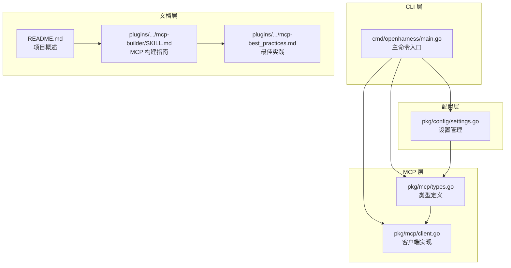
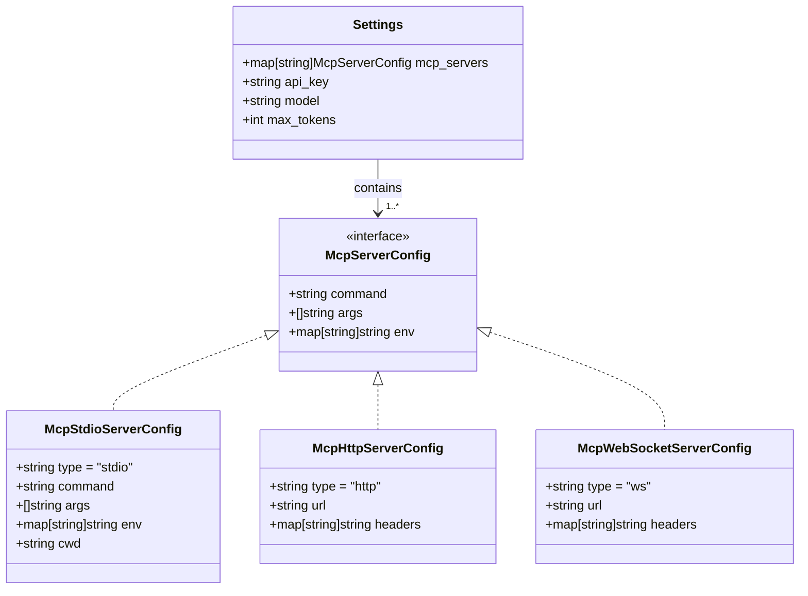
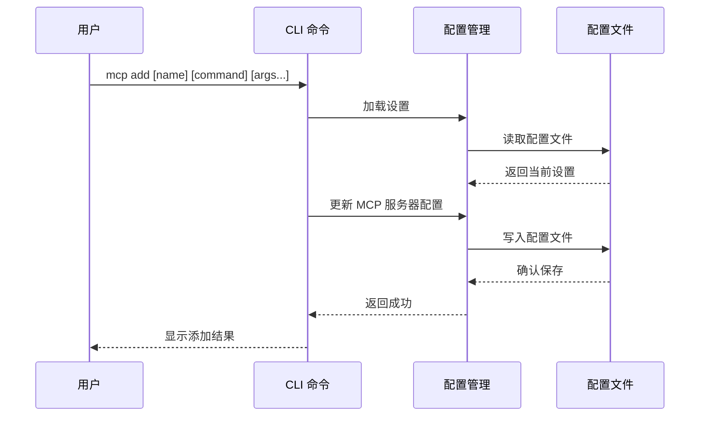
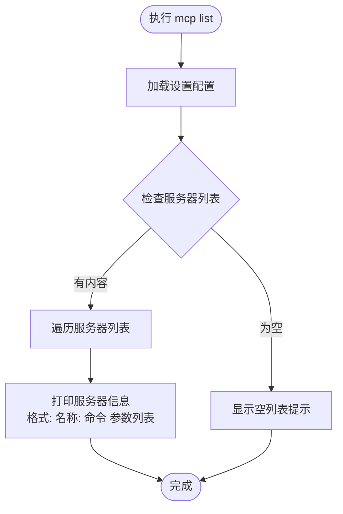
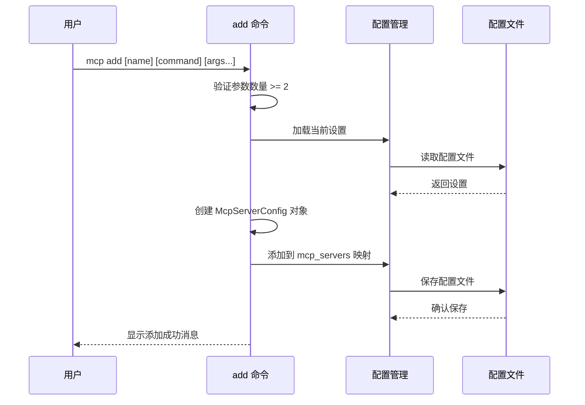
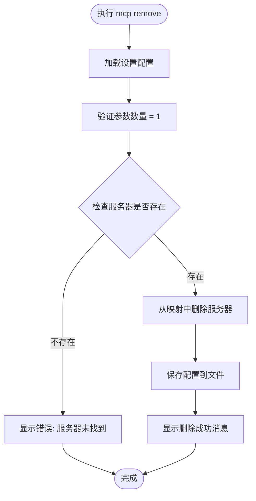
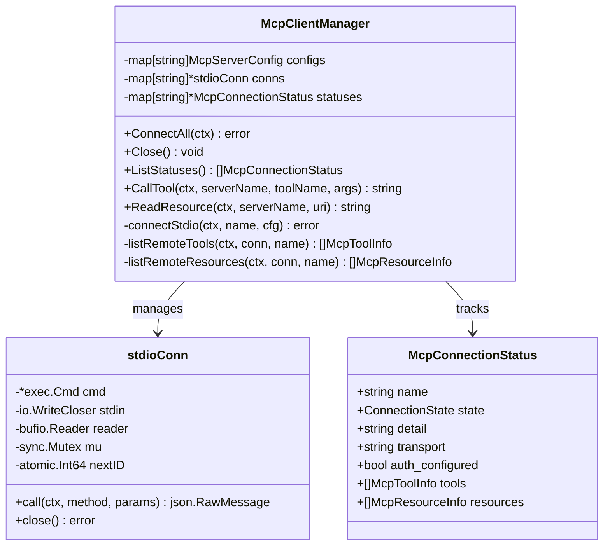
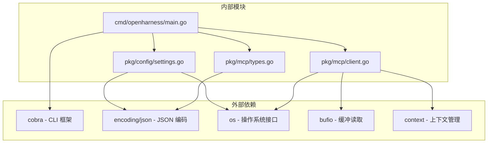

# MCP 服务器管理

<cite>
**本文档引用的文件**
- [cmd/openharness/main.go](file://cmd/openharness/main.go)
- [pkg/config/settings.go](file://pkg/config/settings.go)
- [pkg/mcp/types.go](file://pkg/mcp/types.go)
- [pkg/mcp/client.go](file://pkg/mcp/client.go)
- [README.md](file://README.md)
- [plugins/anthropic/skills/mcp-builder/SKILL.md](file://plugins/anthropic/skills/mcp-builder/SKILL.md)
- [plugins/anthropic/skills/mcp-builder/reference/mcp_best_practices.md](file://plugins/anthropic/skills/mcp-builder/reference/mcp_best_practices.md)
</cite>

## 目录
1. [简介](#简介)
2. [项目结构](#项目结构)
3. [核心组件](#核心组件)
4. [架构概览](#架构概览)
5. [详细组件分析](#详细组件分析)
6. [依赖关系分析](#依赖关系分析)
7. [性能考虑](#性能考虑)
8. [故障排除指南](#故障排除指南)
9. [结论](#结论)
10. [附录](#附录)

## 简介

OpenHarness Go 的 MCP（Model Context Protocol）服务器管理功能为开发者提供了完整的外部工具和服务集成解决方案。MCP 协议允许 AI 代理通过标准化接口访问各种外部服务，包括本地命令行工具、远程 Web 服务和专用 API 接口。

本文档详细介绍了 MCP 服务器管理子命令的使用方法，包括：
- `mcp list`：查看已配置的 MCP 服务器列表
- `mcp add`：添加新的 MCP 服务器配置
- `mcp remove`：移除现有的 MCP 服务器配置

同时涵盖了 MCP 服务器配置格式、命令参数说明、配置验证方法，以及如何集成常见的开发工具和外部服务。

## 项目结构

OpenHarness Go 项目采用模块化架构设计，MCP 功能主要分布在以下关键模块中：



**图表来源**
- [cmd/openharness/main.go:165-231](file://cmd/openharness/main.go#L165-L231)
- [pkg/config/settings.go:86-125](file://pkg/config/settings.go#L86-L125)
- [pkg/mcp/types.go:13-46](file://pkg/mcp/types.go#L13-L46)

**章节来源**
- [cmd/openharness/main.go:165-231](file://cmd/openharness/main.go#L165-L231)
- [pkg/config/settings.go:86-125](file://pkg/config/settings.go#L86-L125)

## 核心组件

### MCP 服务器配置类型

OpenHarness Go 支持多种传输协议的 MCP 服务器配置：

| 配置类型 | 传输方式 | 使用场景 | 关键字段 |
|---------|----------|----------|----------|
| McpStdioServerConfig | stdio | 本地命令行工具 | command, args, env, cwd |
| McpHttpServerConfig | HTTP | 远程 Web 服务 | url, headers |
| McpWebSocketServerConfig | WebSocket | 实时双向通信 | url, headers |

### 设置管理结构

MCP 服务器配置存储在全局设置中，采用键值对映射：



**图表来源**
- [pkg/config/settings.go:86-125](file://pkg/config/settings.go#L86-L125)
- [pkg/mcp/types.go:13-46](file://pkg/mcp/types.go#L13-L46)

**章节来源**
- [pkg/config/settings.go:86-125](file://pkg/config/settings.go#L86-L125)
- [pkg/mcp/types.go:13-46](file://pkg/mcp/types.go#L13-L46)

## 架构概览

MCP 服务器管理采用分层架构设计，实现了配置持久化、运行时连接管理和状态监控：



**图表来源**
- [cmd/openharness/main.go:188-207](file://cmd/openharness/main.go#L188-L207)
- [pkg/config/settings.go:160-195](file://pkg/config/settings.go#L160-L195)

## 详细组件分析

### MCP 子命令实现

#### mcp list 命令

`mcp list` 命令用于显示当前所有已配置的 MCP 服务器：



**图表来源**
- [cmd/openharness/main.go:170-186](file://cmd/openharness/main.go#L170-L186)

#### mcp add 命令

`mcp add` 命令用于添加新的 MCP 服务器配置：



**图表来源**
- [cmd/openharness/main.go:188-207](file://cmd/openharness/main.go#L188-L207)

#### mcp remove 命令

`mcp remove` 命令用于删除指定的 MCP 服务器配置：



**图表来源**
- [cmd/openharness/main.go:209-229](file://cmd/openharness/main.go#L209-L229)

**章节来源**
- [cmd/openharness/main.go:170-229](file://cmd/openharness/main.go#L170-L229)

### MCP 客户端管理器

MCP 客户端管理器负责建立和维护与 MCP 服务器的连接：



**图表来源**
- [pkg/mcp/client.go:116-132](file://pkg/mcp/client.go#L116-L132)
- [pkg/mcp/client.go:46-52](file://pkg/mcp/client.go#L46-L52)
- [pkg/mcp/types.go:124-133](file://pkg/mcp/types.go#L124-L133)

**章节来源**
- [pkg/mcp/client.go:116-132](file://pkg/mcp/client.go#L116-L132)
- [pkg/mcp/client.go:46-52](file://pkg/mcp/client.go#L46-L52)

## 依赖关系分析

MCP 服务器管理功能的依赖关系清晰明确，遵循单一职责原则：



**图表来源**
- [cmd/openharness/main.go:10-12](file://cmd/openharness/main.go#L10-L12)
- [pkg/config/settings.go:3-8](file://pkg/config/settings.go#L3-L8)
- [pkg/mcp/client.go:3-13](file://pkg/mcp/client.go#L3-L13)

**章节来源**
- [cmd/openharness/main.go:10-12](file://cmd/openharness/main.go#L10-L12)
- [pkg/config/settings.go:3-8](file://pkg/config/settings.go#L3-L8)
- [pkg/mcp/client.go:3-13](file://pkg/mcp/client.go#L3-L13)

## 性能考虑

### 连接管理优化

MCP 客户端管理器采用了以下性能优化策略：

1. **并发连接管理**：使用互斥锁保护共享状态，支持多服务器并发连接
2. **延迟初始化**：仅在需要时建立连接，减少资源占用
3. **连接池复用**：重用已建立的连接，避免频繁创建销毁
4. **异步 I/O**：使用缓冲读取器提高数据传输效率

### 内存使用优化

- **增量数据处理**：支持流式数据处理，避免大对象内存占用
- **连接状态缓存**：缓存服务器状态信息，减少重复查询
- **资源清理**：及时关闭不再使用的连接和文件句柄

## 故障排除指南

### 常见问题诊断

#### 服务器连接失败

**症状**：`mcp list` 显示服务器状态为 failed

**可能原因**：
1. 可执行文件路径不正确
2. 服务器进程启动失败
3. JSON-RPC 协议初始化失败
4. 权限不足

**解决步骤**：
1. 验证命令路径是否正确
2. 检查服务器进程是否能独立运行
3. 确认 JSON-RPC 初始化参数完整
4. 检查文件和网络权限

#### 配置文件损坏

**症状**：`mcp add` 或 `mcp remove` 命令失败

**解决方法**：
1. 备份当前配置文件
2. 手动编辑配置文件修正语法错误
3. 使用 `mcp list` 验证配置有效性
4. 重新加载配置

#### 环境变量问题

**症状**：服务器启动但无法访问外部资源

**解决方法**：
1. 检查必要的环境变量是否设置
2. 验证 API 密钥的有效性
3. 确认网络连接正常
4. 检查防火墙设置

**章节来源**
- [pkg/mcp/client.go:134-148](file://pkg/mcp/client.go#L134-L148)
- [pkg/mcp/client.go:296-373](file://pkg/mcp/client.go#L296-L373)

## 结论

OpenHarness Go 的 MCP 服务器管理功能提供了完整的外部工具和服务集成解决方案。通过简洁的命令行接口和灵活的配置选项，用户可以轻松地添加、管理和监控各种 MCP 服务器。

主要优势包括：
- **简单易用**：直观的命令行界面，无需复杂的配置
- **灵活配置**：支持多种传输协议和配置选项
- **可靠稳定**：完善的错误处理和状态监控机制
- **扩展性强**：模块化设计便于功能扩展和维护

建议在生产环境中：
1. 建立配置备份和版本控制
2. 制定标准化的服务器命名规范
3. 定期验证服务器连接状态
4. 建立故障恢复和应急响应流程

## 附录

### 配置文件格式示例

标准配置文件位置：`~/.openharness/settings.json`

```json
{
  "mcp_servers": {
    "github": {
      "command": "/usr/local/bin/github-mcp",
      "args": ["--api-token", "${GITHUB_TOKEN}"],
      "env": {
        "GITHUB_TOKEN": "${GITHUB_TOKEN}"
      }
    },
    "slack": {
      "command": "python3",
      "args": ["/opt/slack-mcp/server.py"],
      "env": {
        "SLACK_BOT_TOKEN": "${SLACK_BOT_TOKEN}"
      }
    }
  }
}
```

### 常用 MCP 服务器示例

#### 本地 Git 工具集成

```bash
# 添加 Git 服务器
openharness mcp add git /usr/bin/git

# 查看可用工具
openharness mcp list
```

#### 远程 API 服务集成

```bash
# 添加 GitHub 服务器
openharness mcp add github /usr/local/bin/github-mcp --api-token=${GITHUB_TOKEN}

# 添加 Slack 服务器
openharness mcp add slack python3 /opt/slack-mcp/server.py --bot-token=${SLACK_BOT_TOKEN}
```

### 高级配置选项

对于需要更精细控制的场景，可以使用以下配置选项：

| 选项 | 类型 | 描述 | 示例 |
|------|------|------|------|
| command | string | 服务器可执行文件路径 | `/usr/local/bin/my-mcp-server` |
| args | string[] | 命令行参数数组 | `["--port", "8080"]` |
| env | object | 环境变量映射 | `{"API_KEY": "${API_KEY}"}` |
| cwd | string | 工作目录路径 | `"/opt/my-service"` |

**章节来源**
- [README.md:56-67](file://README.md#L56-L67)
- [plugins/anthropic/skills/mcp-builder/reference/mcp_best_practices.md:108-149](file://plugins/anthropic/skills/mcp-builder/reference/mcp_best_practices.md#L108-L149)