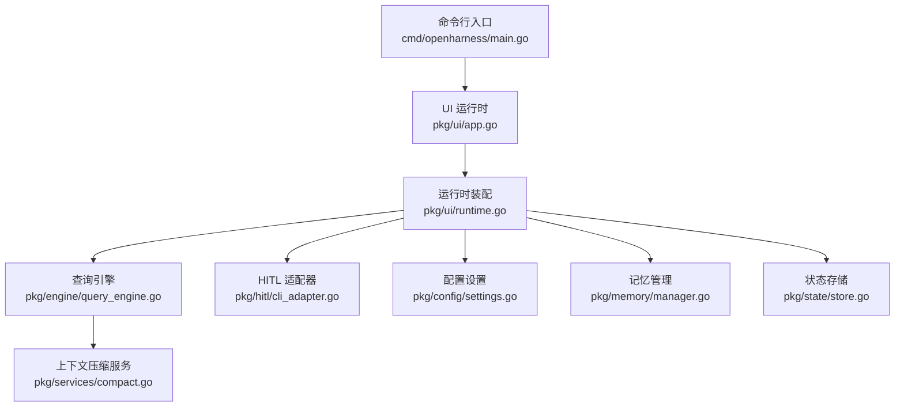
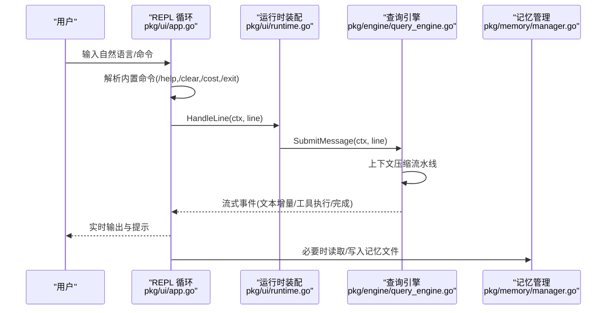
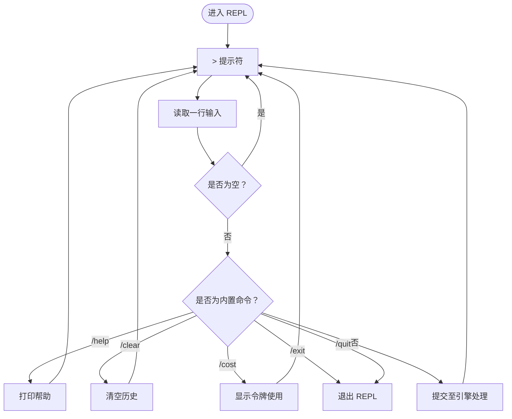
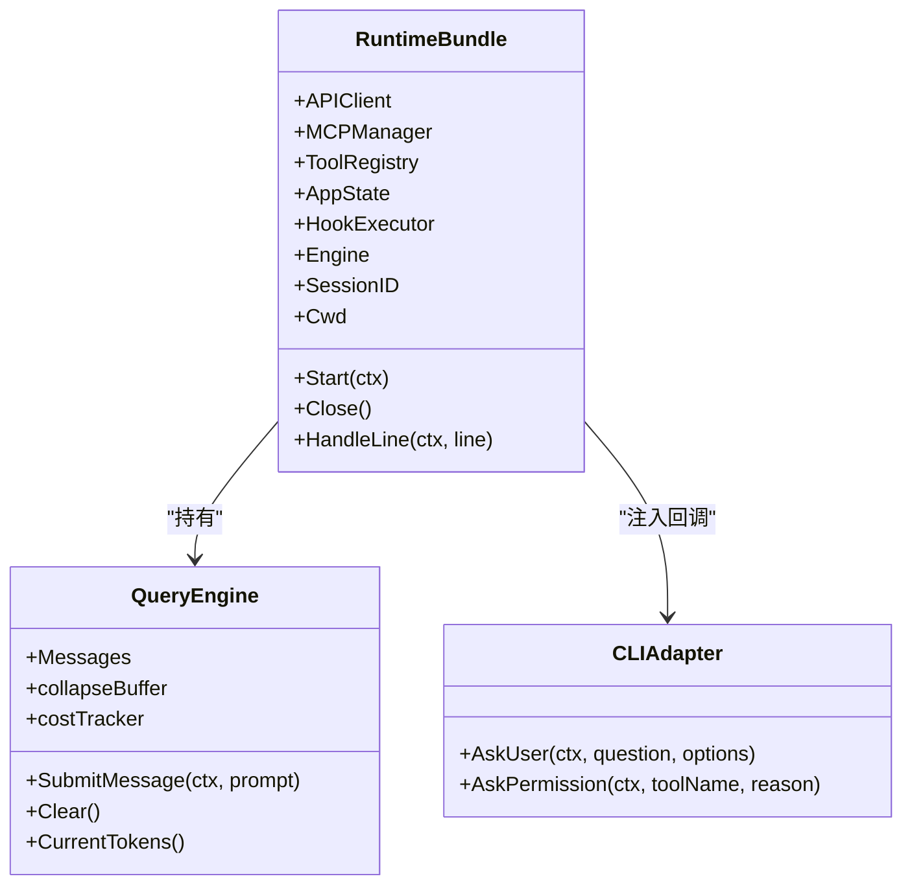
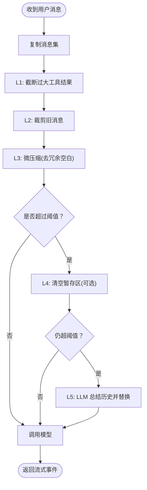
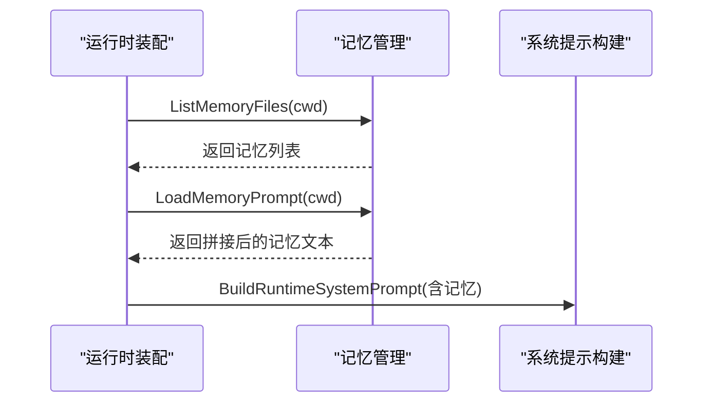
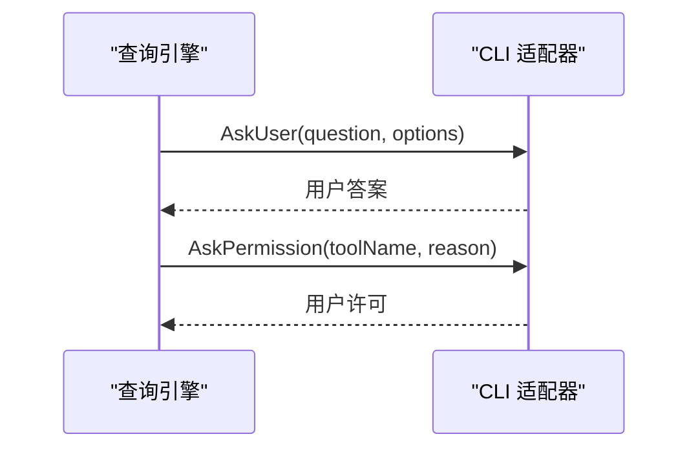
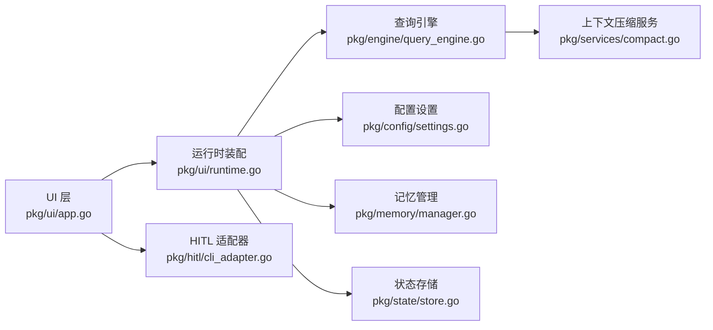

# REPL 交互模式

<cite>
**本文引用的文件**
- [cmd/openharness/main.go](file://cmd/openharness/main.go)
- [pkg/ui/app.go](file://pkg/ui/app.go)
- [pkg/ui/runtime.go](file://pkg/ui/runtime.go)
- [pkg/hitl/cli_adapter.go](file://pkg/hitl/cli_adapter.go)
- [pkg/engine/query_engine.go](file://pkg/engine/query_engine.go)
- [pkg/memory/manager.go](file://pkg/memory/manager.go)
- [pkg/memory/types.go](file://pkg/memory/types.go)
- [pkg/state/store.go](file://pkg/state/store.go)
- [pkg/config/settings.go](file://pkg/config/settings.go)
- [pkg/services/compact.go](file://pkg/services/compact.go)
- [docs/context_compaction_and_caching.md](file://docs/context_compaction_and_caching.md)
</cite>

## 目录
1. [简介](#简介)
2. [项目结构](#项目结构)
3. [核心组件](#核心组件)
4. [架构总览](#架构总览)
5. [详细组件分析](#详细组件分析)
6. [依赖关系分析](#依赖关系分析)
7. [性能考量](#性能考量)
8. [故障排除指南](#故障排除指南)
9. [结论](#结论)
10. [附录](#附录)

## 简介
本指南面向 OpenHarness Go 的 REPL 交互模式，帮助用户高效使用交互式对话功能，涵盖会话启动与结束、复杂任务处理、对话历史管理、交互命令与快捷键、实际对话示例、上下文与记忆机制、性能优化与故障排除等内容。REPL 模式通过命令行界面提供即时反馈，支持工具调用、权限确认、人类在回路（HITL）问答等能力。

## 项目结构
REPL 交互模式的关键入口与实现分布于以下模块：
- 命令行入口：解析参数并选择运行模式（REPL/打印模式/JSON-Lines 模式）
- UI 层：REPL 循环、命令解析、输出渲染
- 引擎层：对话状态管理、上下文压缩、流式事件处理
- 记忆与状态：项目级记忆文件、应用状态存储
- 配置与权限：设置加载、API 密钥解析、权限模式
- 上下文压缩：五级流水线，保障长对话的上下文健康

图表来源
- [cmd/openharness/main.go:46-76](file://cmd/openharness/main.go#L46-L76)
- [pkg/ui/app.go:122-181](file://pkg/ui/app.go#L122-L181)
- [pkg/ui/runtime.go:51-192](file://pkg/ui/runtime.go#L51-L192)
- [pkg/engine/query_engine.go:98-205](file://pkg/engine/query_engine.go#L98-L205)
- [pkg/hitl/cli_adapter.go:12-102](file://pkg/hitl/cli_adapter.go#L12-L102)
- [pkg/config/settings.go:97-142](file://pkg/config/settings.go#L97-L142)
- [pkg/memory/manager.go:72-90](file://pkg/memory/manager.go#L72-L90)
- [pkg/state/store.go:6-23](file://pkg/state/store.go#L6-L23)
- [pkg/services/compact.go:74-115](file://pkg/services/compact.go#L74-L115)

章节来源
- [cmd/openharness/main.go:46-76](file://cmd/openharness/main.go#L46-L76)
- [pkg/ui/app.go:122-181](file://pkg/ui/app.go#L122-L181)
- [pkg/ui/runtime.go:51-192](file://pkg/ui/runtime.go#L51-L192)

## 核心组件
- REPL 主循环与命令解析：负责读取用户输入、识别内置命令、转发给引擎处理
- 运行时装配：构建引擎、工具注册表、MCP 管理器、Hook 执行器、应用状态存储
- 查询引擎：维护对话历史、执行上下文压缩、流式事件分发、累计用量统计
- HITL 适配器：在 CLI 中实现“询问用户/请求权限”的回调
- 记忆管理：项目级知识库文件的增删查与注入系统提示
- 上下文压缩：五级流水线，保障长对话的上下文健康与缓存命中

章节来源
- [pkg/ui/app.go:122-189](file://pkg/ui/app.go#L122-L189)
- [pkg/ui/runtime.go:25-192](file://pkg/ui/runtime.go#L25-L192)
- [pkg/engine/query_engine.go:49-205](file://pkg/engine/query_engine.go#L49-L205)
- [pkg/hitl/cli_adapter.go:12-102](file://pkg/hitl/cli_adapter.go#L12-L102)
- [pkg/memory/manager.go:12-90](file://pkg/memory/manager.go#L12-L90)
- [pkg/services/compact.go:12-115](file://pkg/services/compact.go#L12-L115)

## 架构总览
REPL 交互模式的运行流程如下：

图表来源
- [pkg/ui/app.go:122-181](file://pkg/ui/app.go#L122-L181)
- [pkg/ui/runtime.go:221-283](file://pkg/ui/runtime.go#L221-L283)
- [pkg/engine/query_engine.go:124-205](file://pkg/engine/query_engine.go#L124-L205)
- [pkg/memory/manager.go:72-90](file://pkg/memory/manager.go#L72-L90)

## 详细组件分析

### REPL 循环与命令
- 启动提示：显示版本、模型与工作目录
- 内置命令：
  - /help：显示帮助
  - /clear：清空对话历史
  - /cost：查看当前内存占用与阈值
  - /exit 或 /quit：退出 REPL
- 错误处理：捕获并打印错误
- 退出条件：扫描器 EOF 或用户输入退出命令

图表来源
- [pkg/ui/app.go:143-181](file://pkg/ui/app.go#L143-L181)

章节来源
- [pkg/ui/app.go:122-189](file://pkg/ui/app.go#L122-L189)

### 运行时装配与依赖注入
- 构建运行时：组装 API 客户端、工具注册表、MCP 管理器、Hook 执行器、应用状态存储
- 注入 HITL 回调：AskUser、AskPermission
- 初始化系统提示：合并自定义系统提示、项目记忆、技能与工具 Schema、CLAUDE.md 文档
- 启动阶段：连接 MCP 服务器并更新应用状态

图表来源
- [pkg/ui/runtime.go:25-192](file://pkg/ui/runtime.go#L25-L192)
- [pkg/engine/query_engine.go:49-205](file://pkg/engine/query_engine.go#L49-L205)
- [pkg/hitl/cli_adapter.go:12-102](file://pkg/hitl/cli_adapter.go#L12-L102)

章节来源
- [pkg/ui/runtime.go:51-192](file://pkg/ui/runtime.go#L51-L192)

### 查询引擎与上下文压缩
- 对话历史管理：追加用户消息，复制当前消息集参与压缩
- 上下文压缩流水线：L1 截断工具结果、L2 裁剪旧消息、L3 微压缩、L4 上下文坍缩、L5 自动总结
- 流式事件：文本增量、工具执行开始/完成、模型思考提示、回合完成
- 用量统计：累计输入/输出 Token，实时显示“大脑容量”百分比

图表来源
- [pkg/engine/query_engine.go:124-205](file://pkg/engine/query_engine.go#L124-L205)
- [pkg/services/compact.go:74-115](file://pkg/services/compact.go#L74-L115)

章节来源
- [pkg/engine/query_engine.go:124-205](file://pkg/engine/query_engine.go#L124-L205)
- [pkg/services/compact.go:74-115](file://pkg/services/compact.go#L74-L115)

### 记忆与上下文管理
- 记忆文件：项目级记忆以 Markdown 文件形式保存，按修改时间排序
- 记忆注入：将所有记忆内容拼接后注入系统提示，增强上下文
- 相关操作：新增、删除、列出、查找相关记忆（简单子串匹配）

图表来源
- [pkg/ui/runtime.go:125-137](file://pkg/ui/runtime.go#L125-L137)
- [pkg/memory/manager.go:36-90](file://pkg/memory/manager.go#L36-L90)

章节来源
- [pkg/memory/manager.go:12-90](file://pkg/memory/manager.go#L12-L90)
- [pkg/ui/runtime.go:125-137](file://pkg/ui/runtime.go#L125-L137)

### 人类在回路（HITL）交互
- 问答交互：助手提问，用户可从选项中选择或自由输入
- 权限请求：请求执行工具的许可，用户确认后继续
- CLI 适配器：阻塞式读取用户输入，支持上下文取消

图表来源
- [pkg/hitl/cli_adapter.go:22-102](file://pkg/hitl/cli_adapter.go#L22-L102)

章节来源
- [pkg/hitl/cli_adapter.go:22-102](file://pkg/hitl/cli_adapter.go#L22-L102)

### 应用状态与配置
- 应用状态：模型、权限模式、主题、工作目录、提供商、认证状态、MCP 连接情况、输出风格等
- 设置加载：默认设置、环境变量覆盖、配置文件读取与保存
- 输出样式：文本/JSON/流式 JSON 的切换

章节来源
- [pkg/state/store.go:6-23](file://pkg/state/store.go#L6-L23)
- [pkg/config/settings.go:97-142](file://pkg/config/settings.go#L97-L142)
- [pkg/ui/app.go:18-61](file://pkg/ui/app.go#L18-L61)

## 依赖关系分析
REPL 交互模式的组件耦合与职责划分：
- UI 层依赖运行时装配，运行时装配依赖引擎、记忆、配置、状态与服务
- 引擎依赖工具注册表、上下文压缩服务、Hook 执行器
- 记忆与状态为纯数据层，被运行时装配读取并注入系统提示
- 配置贯穿全局，影响模型、输出风格、权限模式等

图表来源
- [pkg/ui/app.go:122-181](file://pkg/ui/app.go#L122-L181)
- [pkg/ui/runtime.go:51-192](file://pkg/ui/runtime.go#L51-L192)
- [pkg/engine/query_engine.go:98-205](file://pkg/engine/query_engine.go#L98-L205)
- [pkg/services/compact.go:74-115](file://pkg/services/compact.go#L74-L115)
- [pkg/hitl/cli_adapter.go:12-102](file://pkg/hitl/cli_adapter.go#L12-L102)
- [pkg/memory/manager.go:72-90](file://pkg/memory/manager.go#L72-L90)
- [pkg/state/store.go:6-23](file://pkg/state/store.go#L6-L23)
- [pkg/config/settings.go:97-142](file://pkg/config/settings.go#L97-L142)

章节来源
- [pkg/ui/app.go:122-181](file://pkg/ui/app.go#L122-L181)
- [pkg/ui/runtime.go:51-192](file://pkg/ui/runtime.go#L51-L192)

## 性能考量
- 上下文压缩策略：采用五级渐进式流水线，阈值较高，尽量保持前缀缓存命中；仅在接近红线时触发压缩
- 缓存利用：建议在系统提示的静态长文本区末端打上缓存标记，避免动态对话区修改导致缓存失效
- 令牌估算：提供简易估算方法，用于快速判断是否需要压缩
- 输出样式：在长对话场景下优先使用流式 JSON，便于前端/IDE 实时渲染

章节来源
- [docs/context_compaction_and_caching.md:70-77](file://docs/context_compaction_and_caching.md#L70-L77)
- [pkg/services/compact.go:12-59](file://pkg/services/compact.go#L12-L59)

## 故障排除指南
- 无法启动 REPL
  - 检查 API 密钥配置（环境变量或配置文件）
  - 确认工作目录有效
- 无响应或卡顿
  - 查看“大脑容量”百分比，接近阈值时会触发压缩
  - 使用 /clear 清空历史，降低令牌占用
- 工具调用失败
  - 查看工具执行完成事件中的错误标记
  - 检查权限模式与路径规则
- 记忆文件未生效
  - 确认记忆文件为 .md，位于项目记忆目录
  - 检查标题安全转换逻辑（非法字符替换为下划线）

章节来源
- [pkg/ui/app.go:165-175](file://pkg/ui/app.go#L165-L175)
- [pkg/ui/runtime.go:221-283](file://pkg/ui/runtime.go#L221-L283)
- [pkg/memory/manager.go:12-90](file://pkg/memory/manager.go#L12-L90)
- [pkg/config/settings.go:144-154](file://pkg/config/settings.go#L144-L154)

## 结论
OpenHarness Go 的 REPL 交互模式通过清晰的分层架构与完善的上下文管理，为复杂编码任务提供了稳定高效的交互体验。结合内置命令、记忆注入、上下文压缩与 HITL 机制，用户可在 CLI 中完成从代码编写、调试到重构的全流程任务。建议在长对话场景下关注缓存利用与令牌阈值，以获得更佳的性能与成本表现。

## 附录

### 交互命令速览
- /help：显示帮助
- /clear：清空对话历史
- /cost：查看当前内存令牌占用与阈值
- /exit 或 /quit：退出 REPL

章节来源
- [pkg/ui/app.go:183-189](file://pkg/ui/app.go#L183-L189)

### 实际对话示例（步骤说明）
- 开始会话：启动 REPL，查看提示与模型信息
- 编写代码：输入具体需求，等待模型输出与工具执行
- 调试问题：根据工具结果定位问题，必要时请求权限执行修复
- 重构建议：提出重构目标，模型给出方案与工具调用
- 管理历史：使用 /clear 清空历史，或继续对话推进任务
- 查看成本：使用 /cost 关注令牌使用，避免接近阈值

章节来源
- [pkg/ui/app.go:140-181](file://pkg/ui/app.go#L140-L181)
- [pkg/ui/runtime.go:221-283](file://pkg/ui/runtime.go#L221-L283)