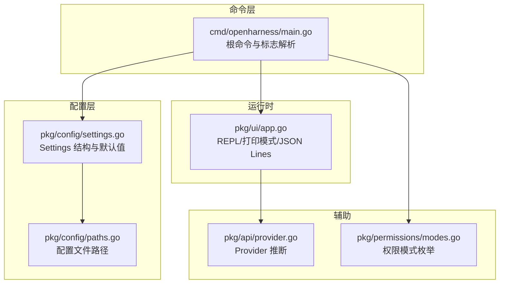
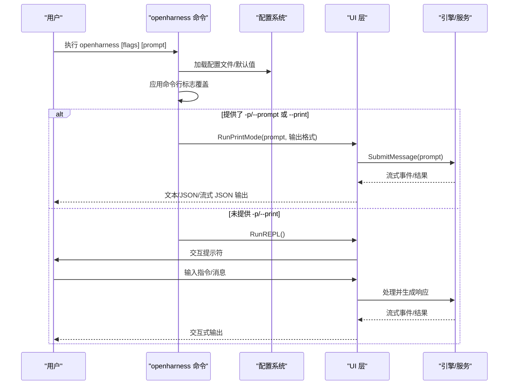
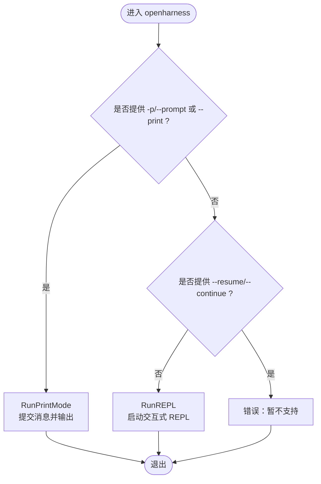
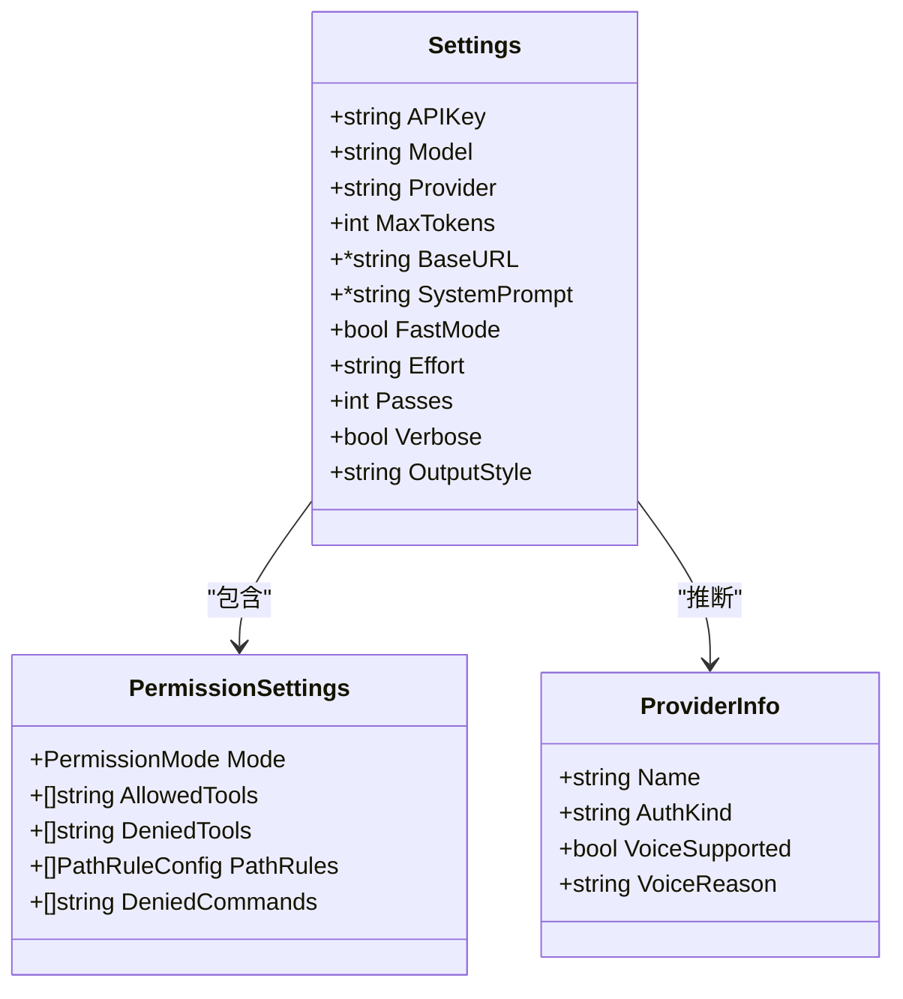
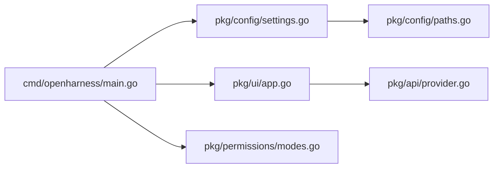

# 基础 CLI 命令

<cite>
**本文引用的文件**
- [cmd/openharness/main.go](file://cmd/openharness/main.go)
- [pkg/config/settings.go](file://pkg/config/settings.go)
- [pkg/config/paths.go](file://pkg/config/paths.go)
- [pkg/api/provider.go](file://pkg/api/provider.go)
- [pkg/permissions/modes.go](file://pkg/permissions/modes.go)
- [pkg/ui/app.go](file://pkg/ui/app.go)
</cite>

## 目录
1. [简介](#简介)
2. [项目结构](#项目结构)
3. [核心组件](#核心组件)
4. [架构总览](#架构总览)
5. [详细组件分析](#详细组件分析)
6. [依赖关系分析](#依赖关系分析)
7. [性能与行为特性](#性能与行为特性)
8. [故障排查指南](#故障排查指南)
9. [结论](#结论)
10. [附录：常用用法与最佳实践](#附录常用用法与最佳实践)

## 简介
本文件面向 OpenHarness Go 的基础 CLI 命令“openharness”，系统性说明其基本用法、全部可用标志参数的作用与使用场景，并给出配置优先级与默认值说明、常见使用模式与最佳实践建议。读者无需深入源码即可高效上手。

## 项目结构
OpenHarness 的 CLI 入口位于命令模块，通过 Cobra 构建命令树；运行时根据设置决定交互模式（REPL 或非交互打印模式）；配置由配置模块加载与持久化；权限模式定义在权限模块；输出格式由 UI 模块处理。

图表来源
- [cmd/openharness/main.go:22-102](file://cmd/openharness/main.go#L22-L102)
- [pkg/config/settings.go:97-142](file://pkg/config/settings.go#L97-L142)
- [pkg/config/paths.go:8-23](file://pkg/config/paths.go#L8-L23)
- [pkg/ui/app.go:18-61](file://pkg/ui/app.go#L18-L61)
- [pkg/api/provider.go:17-59](file://pkg/api/provider.go#L17-L59)
- [pkg/permissions/modes.go:4-17](file://pkg/permissions/modes.go#L4-L17)

章节来源
- [cmd/openharness/main.go:22-102](file://cmd/openharness/main.go#L22-L102)
- [pkg/config/settings.go:97-142](file://pkg/config/settings.go#L97-L142)
- [pkg/config/paths.go:8-23](file://pkg/config/paths.go#L8-L23)
- [pkg/ui/app.go:18-61](file://pkg/ui/app.go#L18-L61)
- [pkg/api/provider.go:17-59](file://pkg/api/provider.go#L17-L59)
- [pkg/permissions/modes.go:4-17](file://pkg/permissions/modes.go#L4-L17)

## 核心组件
- 根命令与标志解析：负责解析命令行参数、加载配置、选择运行模式（REPL/打印/JSON Lines）。
- 配置系统：提供默认值、环境变量覆盖、配置文件读写与持久化。
- 运行时 UI：支持交互 REPL、非交互打印模式（文本/JSON/流式 JSON）、以及 JSON-Lines 协议模式。
- 权限模式：定义三种权限模式，用于控制工具执行策略。
- Provider 推断：根据配置推断当前使用的 Provider 类型与鉴权方式。

章节来源
- [cmd/openharness/main.go:46-76](file://cmd/openharness/main.go#L46-L76)
- [pkg/config/settings.go:160-195](file://pkg/config/settings.go#L160-L195)
- [pkg/ui/app.go:18-61](file://pkg/ui/app.go#L18-L61)
- [pkg/permissions/modes.go:4-17](file://pkg/permissions/modes.go#L4-L17)
- [pkg/api/provider.go:17-59](file://pkg/api/provider.go#L17-L59)

## 架构总览
下图展示了 openharness 命令从启动到运行的关键流程：解析标志 → 加载配置 → 应用标志覆盖 → 选择运行模式 → 启动引擎与 UI。

图表来源
- [cmd/openharness/main.go:46-76](file://cmd/openharness/main.go#L46-L76)
- [pkg/ui/app.go:18-61](file://pkg/ui/app.go#L18-L61)

## 详细组件分析

### 命令与标志参数详解
- 命令名称：openharness
- 主要用途：AI 编程助手 CLI，支持交互 REPL 与非交互打印模式
- 支持的标志参数（按功能分组）：
  - 模型与提供商
    - --model：模型名称
    - --provider：显式指定 API 提供商（如 openai 兼容）
    - --base-url：API 基础地址（用于兼容其他平台）
    - --api-key：API 密钥
  - 输出与行为
    - --max-tokens：最大输出 token 数
    - --system-prompt：自定义系统提示词
    - --permission-mode：权限模式（default、plan、full_auto）
    - --output-format：输出格式（text、json、stream-json）
    - --verbose：启用详细日志
    - --fast：快速模式（较低质量，更快）
    - --effort：努力级别（low、medium、high）
    - --passes：迭代轮数
  - 运行模式
    - -p/--prompt：非交互一次性执行指定提示词
    - --print：从标准输入读取提示词并打印响应
    - --resume/--continue：会话恢复占位（当前未实现）

- 参数优先级与默认值
  - 命令行标志优先于配置文件字段
  - 配置文件优先于环境变量覆盖
  - 默认值来源于默认设置对象
  - 环境变量覆盖规则：
    - ANTHROPIC_API_KEY → 设置 APIKey
    - ANTHROPIC_MODEL 或 OPENHARNESS_MODEL → 设置 Model
    - ANTHROPIC_BASE_URL 或 OPENHARNESS_BASE_URL → 设置 BaseURL

- 使用场景举例
  - 快速问答：openharness -p "解释 Go 语言的并发模型"
  - 非交互批处理：echo "写一个排序函数" | openharness --print --output-format json
  - 自定义模型与提供商：openharness --model gpt-4o --provider openai-compatible --base-url https://api.openai.com/v1
  - 严格权限控制：openharness --permission-mode plan
  - 调试与诊断：openharness --verbose --output-format stream-json -p "调试信息"

章节来源
- [cmd/openharness/main.go:79-95](file://cmd/openharness/main.go#L79-L95)
- [cmd/openharness/main.go:104-144](file://cmd/openharness/main.go#L104-L144)
- [pkg/config/settings.go:127-142](file://pkg/config/settings.go#L127-L142)
- [pkg/config/settings.go:197-211](file://pkg/config/settings.go#L197-L211)
- [pkg/config/paths.go:20-23](file://pkg/config/paths.go#L20-L23)

### 运行模式与输出格式
- 非交互打印模式（--print/-p）
  - 从标准输入读取提示词或接收 -p 指定的提示词
  - 根据 --output-format 输出文本、JSON 或流式 JSON
  - 适合脚本化与 CI 场景
- 交互 REPL 模式（默认）
  - 提供命令提示符与内置命令（/help、/clear、/cost、/exit）
  - 支持人类在环（HITL）与工具执行反馈
- JSON-Lines 模式（内部使用）
  - 供 TUI/IDE/远程客户端使用，遵循协议事件流

图表来源
- [cmd/openharness/main.go:58-72](file://cmd/openharness/main.go#L58-L72)
- [pkg/ui/app.go:18-61](file://pkg/ui/app.go#L18-L61)

章节来源
- [cmd/openharness/main.go:58-72](file://cmd/openharness/main.go#L58-L72)
- [pkg/ui/app.go:18-61](file://pkg/ui/app.go#L18-L61)

### 权限模式与 Provider 推断
- 权限模式
  - default：默认策略
  - plan：先计划再执行
  - full_auto：完全自动执行
- Provider 推断
  - 若显式设置 provider，则根据字符串包含关系判断鉴权类型与语音支持
  - 否则根据 base_url 或 model 名称推断（如 Moonshot、OpenAI 兼容、Bedrock、Vertex 等）
  - 无显式设置时默认为 Anthropic

图表来源
- [pkg/config/settings.go:97-125](file://pkg/config/settings.go#L97-L125)
- [pkg/config/settings.go:37-44](file://pkg/config/settings.go#L37-L44)
- [pkg/api/provider.go:9-15](file://pkg/api/provider.go#L9-L15)
- [pkg/api/provider.go:17-59](file://pkg/api/provider.go#L17-L59)
- [pkg/permissions/modes.go:4-17](file://pkg/permissions/modes.go#L4-L17)

章节来源
- [pkg/config/settings.go:37-44](file://pkg/config/settings.go#L37-L44)
- [pkg/permissions/modes.go:4-17](file://pkg/permissions/modes.go#L4-L17)
- [pkg/api/provider.go:17-59](file://pkg/api/provider.go#L17-L59)

## 依赖关系分析
- 命令层依赖配置层与 UI 层
- 配置层提供默认值与环境变量覆盖
- UI 层根据输出格式与运行模式调用引擎
- Provider 推断依赖配置中的 Provider/BaseURL/Model 字段

图表来源
- [cmd/openharness/main.go:10-12](file://cmd/openharness/main.go#L10-L12)
- [pkg/config/settings.go:160-195](file://pkg/config/settings.go#L160-L195)
- [pkg/ui/app.go:18-61](file://pkg/ui/app.go#L18-L61)
- [pkg/config/paths.go:8-23](file://pkg/config/paths.go#L8-L23)
- [pkg/api/provider.go:17-59](file://pkg/api/provider.go#L17-L59)
- [pkg/permissions/modes.go:4-17](file://pkg/permissions/modes.go#L4-L17)

章节来源
- [cmd/openharness/main.go:10-12](file://cmd/openharness/main.go#L10-L12)
- [pkg/config/settings.go:160-195](file://pkg/config/settings.go#L160-L195)
- [pkg/ui/app.go:18-61](file://pkg/ui/app.go#L18-L61)
- [pkg/config/paths.go:8-23](file://pkg/config/paths.go#L8-L23)
- [pkg/api/provider.go:17-59](file://pkg/api/provider.go#L17-L59)
- [pkg/permissions/modes.go:4-17](file://pkg/permissions/modes.go#L4-L17)

## 性能与行为特性
- 快速模式（--fast）：降低质量以提升速度，适合快速预览
- 努力级别（--effort）：low/medium/high 影响推理深度与资源消耗
- 迭代轮数（--passes）：多次迭代可提升复杂任务的稳定性
- 输出格式影响吞吐与可观测性：stream-json 便于实时监控与集成

章节来源
- [cmd/openharness/main.go:88-91](file://cmd/openharness/main.go#L88-L91)
- [pkg/ui/app.go:38-61](file://pkg/ui/app.go#L38-L61)

## 故障排查指南
- 未找到 API 密钥
  - 现象：报错提示未配置 API 密钥
  - 处理：通过环境变量 ANTHROPIC_API_KEY 或在配置文件中设置 api_key
- 会话恢复占位
  - 现象：--resume/--continue 报错提示尚未实现
  - 处理：使用当前版本的 REPL 或打印模式
- 配置文件路径
  - 默认位置：用户主目录下的 .openharness/settings.json
  - 可通过环境变量 OPENHARNESS_CONFIG_DIR 自定义

章节来源
- [pkg/config/settings.go:144-154](file://pkg/config/settings.go#L144-L154)
- [cmd/openharness/main.go:70-72](file://cmd/openharness/main.go#L70-L72)
- [pkg/config/paths.go:8-23](file://pkg/config/paths.go#L8-L23)

## 结论
openharness CLI 提供了灵活的参数体系与多样的运行模式，既能满足日常交互式开发，也能胜任批处理与自动化集成。通过合理设置模型、提供商、权限模式与输出格式，可在安全与效率之间取得平衡。

## 附录：常用用法与最佳实践
- 快速问答
  - 使用 -p 直接传入问题，配合 --output-format json 获取结构化输出
- 批处理与 CI
  - 使用 --print 从标准输入读取提示词，结合 --output-format stream-json 实时消费
- 定制化模型与提供商
  - 使用 --model、--provider、--base-url 指向第三方兼容接口
- 安全与可控
  - 使用 --permission-mode plan 在执行前先汇报计划
- 性能优化
  - 对简单任务开启 --fast；对复杂任务提高 --passes 并调整 --effort
- 配置管理
  - 将通用配置保存在配置文件中，敏感信息通过环境变量注入

章节来源
- [cmd/openharness/main.go:79-95](file://cmd/openharness/main.go#L79-L95)
- [pkg/config/settings.go:127-142](file://pkg/config/settings.go#L127-L142)
- [pkg/config/settings.go:197-211](file://pkg/config/settings.go#L197-L211)
- [pkg/ui/app.go:38-61](file://pkg/ui/app.go#L38-L61)