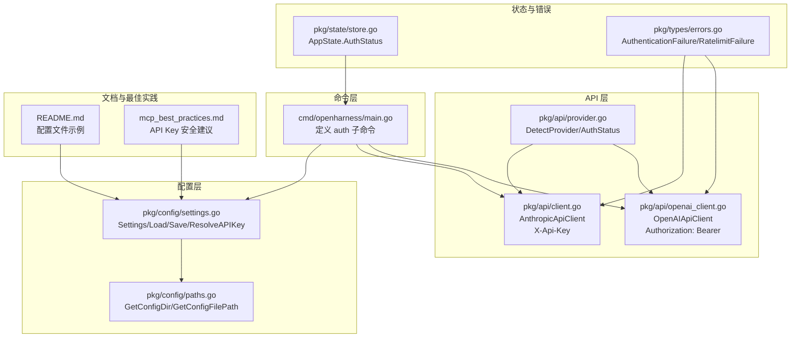
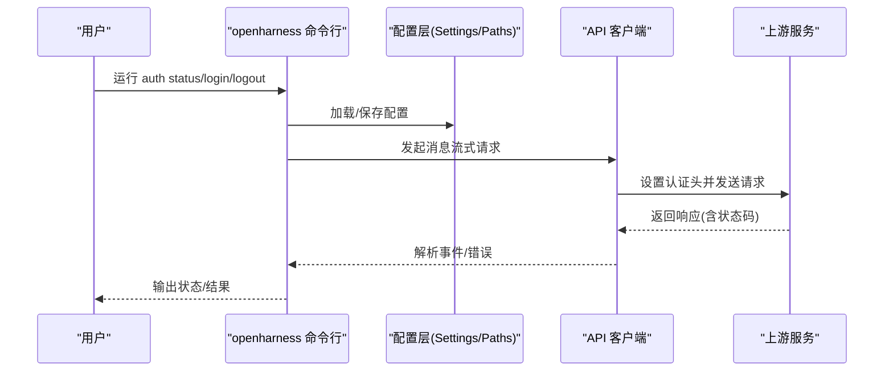
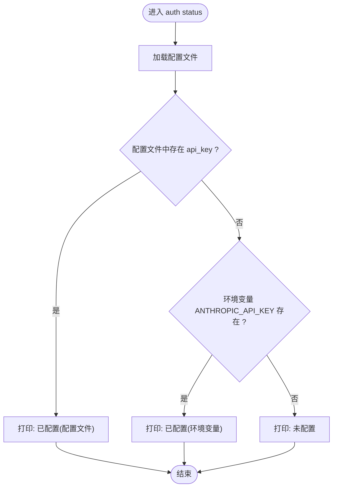
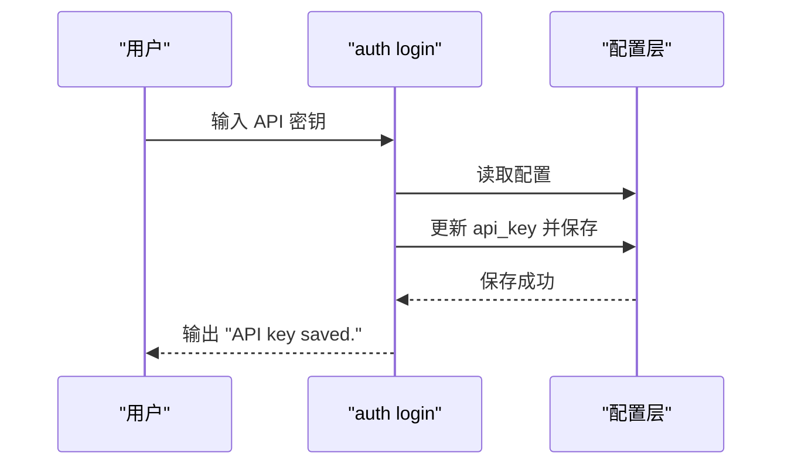
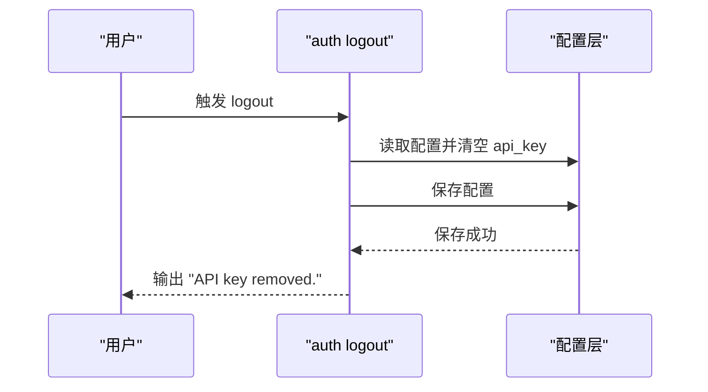
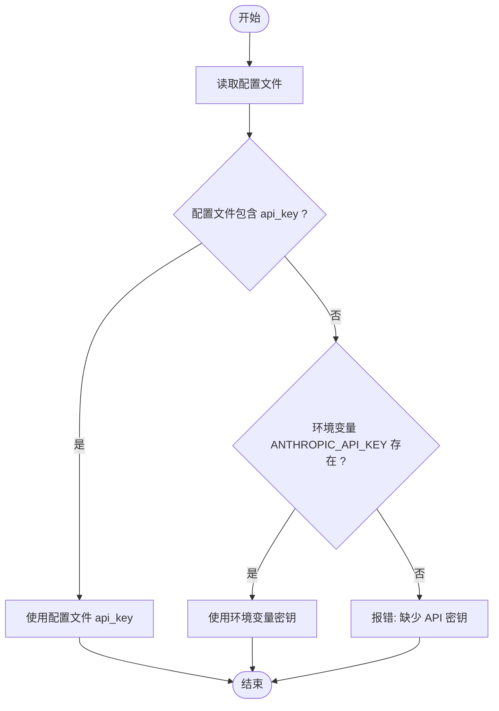
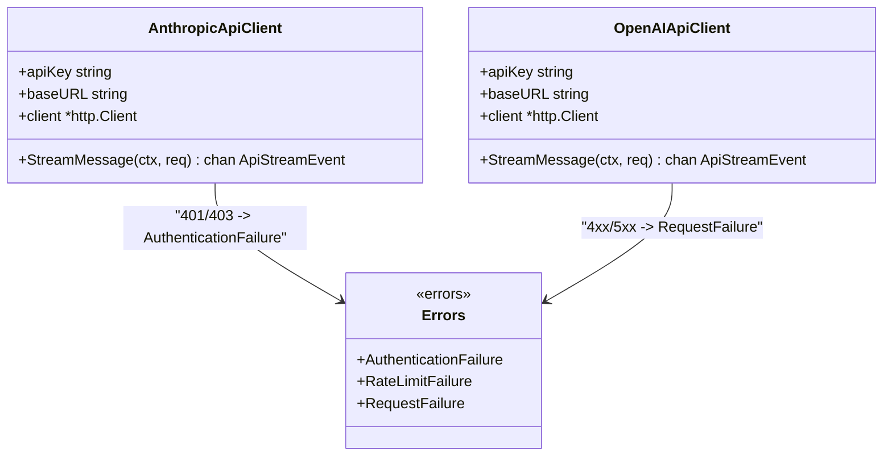
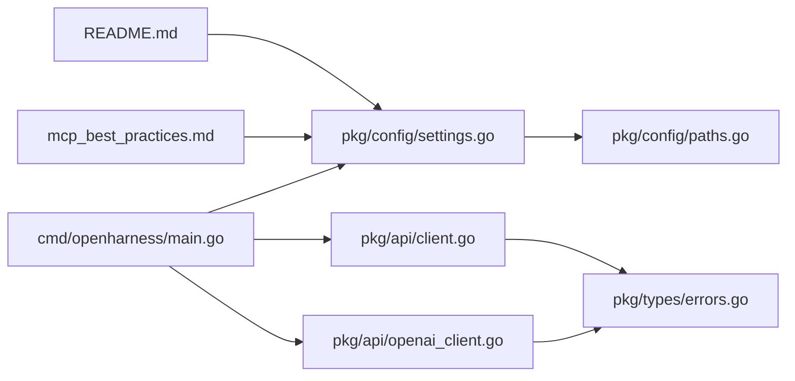

# 认证管理

<cite>
**本文档引用的文件**
- [cmd/openharness/main.go](file://cmd/openharness/main.go)
- [pkg/config/settings.go](file://pkg/config/settings.go)
- [pkg/config/paths.go](file://pkg/config/paths.go)
- [pkg/api/client.go](file://pkg/api/client.go)
- [pkg/api/openai_client.go](file://pkg/api/openai_client.go)
- [pkg/api/provider.go](file://pkg/api/provider.go)
- [pkg/state/store.go](file://pkg/state/store.go)
- [pkg/timeseries/store.go](file://pkg/timeseries/store.go)
- [pkg/types/errors.go](file://pkg/types/errors.go)
- [README.md](file://README.md)
- [plugins/anthropic/skills/mcp-builder/reference/mcp_best_practices.md](file://plugins/anthropic/skills/mcp-builder/reference/mcp_best_practices.md)
</cite>

## 目录
1. [简介](#简介)
2. [项目结构](#项目结构)
3. [核心组件](#核心组件)
4. [架构概览](#架构概览)
5. [详细组件分析](#详细组件分析)
6. [依赖关系分析](#依赖关系分析)
7. [性能考量](#性能考量)
8. [故障排除指南](#故障排除指南)
9. [结论](#结论)
10. [附录](#附录)

## 简介
本指南面向 OpenHarness Go 的认证管理子命令，系统讲解 auth 子命令的使用方法与安全注意事项，涵盖：
- auth status：检查当前认证状态
- auth login：保存或更新 API 密钥
- auth logout：移除已保存的 API 密钥
同时深入说明 API 密钥的存储机制、环境变量配置、错误处理与安全最佳实践，并提供本地开发、CI/CD 环境与生产部署的配置示例，以及认证状态检查与故障排除技巧。

## 项目结构
OpenHarness Go 的认证相关逻辑主要分布在以下模块：
- 命令层：定义 auth 子命令及其行为
- 配置层：负责设置加载、保存与环境变量覆盖
- API 层：封装上游服务调用与认证头设置
- 错误类型：统一错误分类与传播
- 文档与最佳实践：提供安全与配置参考

**图表来源**
- [cmd/openharness/main.go:233-298](file://cmd/openharness/main.go#L233-L298)
- [pkg/config/settings.go:94-211](file://pkg/config/settings.go#L94-L211)
- [pkg/config/paths.go:8-23](file://pkg/config/paths.go#L8-L23)
- [pkg/api/client.go:85-210](file://pkg/api/client.go#L85-L210)
- [pkg/api/openai_client.go:21-409](file://pkg/api/openai_client.go#L21-L409)
- [pkg/api/provider.go:17-74](file://pkg/api/provider.go#L17-L74)
- [pkg/state/store.go:6-23](file://pkg/state/store.go#L6-L23)
- [pkg/types/errors.go:11-39](file://pkg/types/errors.go#L11-L39)
- [README.md:56-67](file://README.md#L56-L67)
- [plugins/anthropic/skills/mcp-builder/reference/mcp_best_practices.md:152-164](file://plugins/anthropic/skills/mcp-builder/reference/mcp_best_practices.md#L152-L164)

**章节来源**
- [cmd/openharness/main.go:233-298](file://cmd/openharness/main.go#L233-L298)
- [pkg/config/settings.go:94-211](file://pkg/config/settings.go#L94-L211)
- [pkg/config/paths.go:8-23](file://pkg/config/paths.go#L8-L23)
- [pkg/api/client.go:85-210](file://pkg/api/client.go#L85-L210)
- [pkg/api/openai_client.go:21-409](file://pkg/api/openai_client.go#L21-L409)
- [pkg/api/provider.go:17-74](file://pkg/api/provider.go#L17-L74)
- [pkg/state/store.go:6-23](file://pkg/state/store.go#L6-L23)
- [pkg/types/errors.go:11-39](file://pkg/types/errors.go#L11-L39)
- [README.md:56-67](file://README.md#L56-L67)
- [plugins/anthropic/skills/mcp-builder/reference/mcp_best_practices.md:152-164](file://plugins/anthropic/skills/mcp-builder/reference/mcp_best_practices.md#L152-L164)

## 核心组件
- 认证子命令
  - auth status：显示当前认证状态（已配置/未配置）
  - auth login：交互式输入 API 密钥并保存至配置文件
  - auth logout：移除配置文件中的 API 密钥
- 配置与存储
  - Settings 结构体包含 api_key、model、provider、base_url 等字段
  - LoadSettings/SaveSettings 负责读写 ~/.openharness/settings.json
  - ResolveAPIKey 优先使用配置文件中的 api_key，其次使用环境变量 ANTHROPIC_API_KEY
  - GetConfigDir/GetConfigFilePath 支持通过 OPENHARNESS_CONFIG_DIR 覆盖配置目录
- API 客户端
  - AnthropicApiClient 使用 X-Api-Key 请求头
  - OpenAIApiClient 使用 Authorization: Bearer 请求头
  - provider.go 提供 DetectProvider 与 AuthStatus 辅助
- 错误与状态
  - types/errors.go 定义 AuthenticationFailure、RateLimitFailure、RequestFailure
  - state/store.go 的 AppState.AuthStatus 用于运行时状态展示

**章节来源**
- [cmd/openharness/main.go:233-298](file://cmd/openharness/main.go#L233-L298)
- [pkg/config/settings.go:94-211](file://pkg/config/settings.go#L94-L211)
- [pkg/config/paths.go:8-23](file://pkg/config/paths.go#L8-L23)
- [pkg/api/client.go:184-210](file://pkg/api/client.go#L184-L210)
- [pkg/api/openai_client.go:265-292](file://pkg/api/openai_client.go#L265-L292)
- [pkg/api/provider.go:17-74](file://pkg/api/provider.go#L17-L74)
- [pkg/types/errors.go:11-39](file://pkg/types/errors.go#L11-L39)
- [pkg/state/store.go:6-23](file://pkg/state/store.go#L6-L23)

## 架构概览
认证流程从命令层进入，经配置层解析密钥，再由 API 层发起上游请求。若上游返回 401/403，将被转换为 AuthenticationFailure 错误类型。

**图表来源**
- [cmd/openharness/main.go:233-298](file://cmd/openharness/main.go#L233-L298)
- [pkg/config/settings.go:144-154](file://pkg/config/settings.go#L144-L154)
- [pkg/api/client.go:184-210](file://pkg/api/client.go#L184-L210)
- [pkg/api/openai_client.go:265-292](file://pkg/api/openai_client.go#L265-L292)
- [pkg/types/errors.go:11-39](file://pkg/types/errors.go#L11-L39)

## 详细组件分析

### auth status：认证状态检查
- 功能要点
  - 读取配置文件，判断是否设置了 api_key
  - 若未设置，则检查环境变量 ANTHROPIC_API_KEY 是否存在
  - 输出“已配置/未配置”的状态提示
- 典型输出
  - 已配置（配置文件 api_key 存在）
  - 已配置（环境变量 ANTHROPIC_API_KEY 存在）
  - 未配置
- 使用建议
  - 在执行任何需要认证的命令前，先运行 status 确认密钥可用
  - 在 CI/CD 环境中，优先通过环境变量注入密钥，避免在配置文件中明文存储

**图表来源**
- [cmd/openharness/main.go:243-258](file://cmd/openharness/main.go#L243-L258)

**章节来源**
- [cmd/openharness/main.go:243-258](file://cmd/openharness/main.go#L243-L258)

### auth login：保存 API 密钥
- 功能要点
  - 交互式提示输入 API 密钥
  - 读取现有配置，将密钥写入配置文件
  - 保存成功后提示“API key saved.”
- 安全注意事项
  - 不要在命令行历史中暴露密钥
  - 在 CI/CD 环境中优先使用环境变量，而非将密钥写入配置文件
  - 配置文件默认权限为 0644，注意服务器上的访问控制

**图表来源**
- [cmd/openharness/main.go:260-279](file://cmd/openharness/main.go#L260-L279)
- [pkg/config/settings.go:180-195](file://pkg/config/settings.go#L180-L195)

**章节来源**
- [cmd/openharness/main.go:260-279](file://cmd/openharness/main.go#L260-L279)
- [pkg/config/settings.go:180-195](file://pkg/config/settings.go#L180-L195)

### auth logout：移除 API 密钥
- 功能要点
  - 读取配置，清空 api_key
  - 保存配置，提示“API key removed.”
- 使用建议
  - 在共享主机或临时容器中执行 logout，确保密钥不会被后续命令复用
  - 与 CI/CD 的密钥轮换配合，先切换环境变量，再执行 logout 清理本地缓存

**图表来源**
- [cmd/openharness/main.go:281-296](file://cmd/openharness/main.go#L281-L296)
- [pkg/config/settings.go:180-195](file://pkg/config/settings.go#L180-L195)

**章节来源**
- [cmd/openharness/main.go:281-296](file://cmd/openharness/main.go#L281-L296)
- [pkg/config/settings.go:180-195](file://pkg/config/settings.go#L180-L195)

### API 密钥解析与存储机制
- 解析顺序
  - 优先使用配置文件中的 api_key
  - 若不存在，则使用环境变量 ANTHROPIC_API_KEY
  - 若仍不存在，报错提示缺少密钥
- 存储位置
  - 默认配置文件路径：用户主目录下的 .openharness/settings.json
  - 可通过 OPENHARNESS_CONFIG_DIR 覆盖配置目录
- 环境变量覆盖
  - 支持 ANTHROPIC_MODEL、OPENHARNESS_MODEL、ANTHROPIC_BASE_URL、OPENHARNESS_BASE_URL 等环境变量覆盖配置项

**图表来源**
- [pkg/config/settings.go:144-154](file://pkg/config/settings.go#L144-L154)
- [pkg/config/paths.go:8-23](file://pkg/config/paths.go#L8-L23)

**章节来源**
- [pkg/config/settings.go:144-154](file://pkg/config/settings.go#L144-L154)
- [pkg/config/paths.go:8-23](file://pkg/config/paths.go#L8-L23)

### 认证头设置与错误处理
- Anthropic 客户端
  - 请求头：X-Api-Key
  - 对 401/403 等认证失败状态码，转换为 AuthenticationFailure
- OpenAI 兼容客户端
  - 请求头：Authorization: Bearer
  - 对 4xx/5xx 状态码进行重试与错误翻译
- 错误类型
  - AuthenticationFailure：认证失败
  - RateLimitFailure：速率限制
  - RequestFailure：通用请求失败

**图表来源**
- [pkg/api/client.go:85-210](file://pkg/api/client.go#L85-L210)
- [pkg/api/openai_client.go:21-409](file://pkg/api/openai_client.go#L21-L409)
- [pkg/types/errors.go:11-39](file://pkg/types/errors.go#L11-L39)

**章节来源**
- [pkg/api/client.go:184-210](file://pkg/api/client.go#L184-L210)
- [pkg/api/openai_client.go:265-292](file://pkg/api/openai_client.go#L265-L292)
- [pkg/types/errors.go:11-39](file://pkg/types/errors.go#L11-L39)

### 认证状态的运行时展示
- AppState.AuthStatus 用于 UI 或状态面板展示当前认证状态
- provider.go 提供 AuthStatus 辅助函数，便于在业务层快速判断“已配置/缺失”

**章节来源**
- [pkg/state/store.go:6-23](file://pkg/state/store.go#L6-L23)
- [pkg/api/provider.go:61-67](file://pkg/api/provider.go#L61-L67)

## 依赖关系分析
- 命令层依赖配置层进行设置读写
- API 层依赖配置层提供的密钥与基础地址
- 错误类型被 API 层用于统一错误传播
- 文档与最佳实践为安全配置提供参考

**图表来源**
- [cmd/openharness/main.go:233-298](file://cmd/openharness/main.go#L233-L298)
- [pkg/config/settings.go:94-211](file://pkg/config/settings.go#L94-L211)
- [pkg/config/paths.go:8-23](file://pkg/config/paths.go#L8-L23)
- [pkg/api/client.go:85-210](file://pkg/api/client.go#L85-L210)
- [pkg/api/openai_client.go:21-409](file://pkg/api/openai_client.go#L21-L409)
- [pkg/types/errors.go:11-39](file://pkg/types/errors.go#L11-L39)
- [README.md:56-67](file://README.md#L56-L67)
- [plugins/anthropic/skills/mcp-builder/reference/mcp_best_practices.md:152-164](file://plugins/anthropic/skills/mcp-builder/reference/mcp_best_practices.md#L152-L164)

**章节来源**
- [cmd/openharness/main.go:233-298](file://cmd/openharness/main.go#L233-L298)
- [pkg/config/settings.go:94-211](file://pkg/config/settings.go#L94-L211)
- [pkg/config/paths.go:8-23](file://pkg/config/paths.go#L8-L23)
- [pkg/api/client.go:85-210](file://pkg/api/client.go#L85-L210)
- [pkg/api/openai_client.go:21-409](file://pkg/api/openai_client.go#L21-L409)
- [pkg/types/errors.go:11-39](file://pkg/types/errors.go#L11-L39)
- [README.md:56-67](file://README.md#L56-L67)
- [plugins/anthropic/skills/mcp-builder/reference/mcp_best_practices.md:152-164](file://plugins/anthropic/skills/mcp-builder/reference/mcp_best_practices.md#L152-L164)

## 性能考量
- 认证头设置开销极小，主要影响在首次请求时的网络往返
- API 层具备重试与退避策略，有助于在上游服务不稳定时提升成功率
- 配置文件读写为本地 IO，通常不影响整体性能

## 故障排除指南
- “未配置”状态
  - 检查配置文件是否存在 api_key；若不存在，确认 ANTHROPIC_API_KEY 环境变量是否设置
  - 使用 OPENHARNESS_CONFIG_DIR 覆盖配置目录时，确认路径正确
- “认证失败”
  - 上游返回 401/403 时，会被转换为 AuthenticationFailure
  - 检查密钥是否过期或权限不足
- “速率限制”
  - 上游返回 429 时，会被转换为 RateLimitFailure
  - 适当降低请求频率或等待冷却时间
- “通用请求失败”
  - 网络错误、超时等会被转换为 RequestFailure
  - 检查网络连通性与代理设置

**章节来源**
- [pkg/config/settings.go:144-154](file://pkg/config/settings.go#L144-L154)
- [pkg/api/client.go:392-405](file://pkg/api/client.go#L392-L405)
- [pkg/api/openai_client.go:285-292](file://pkg/api/openai_client.go#L285-L292)
- [pkg/types/errors.go:11-39](file://pkg/types/errors.go#L11-L39)

## 结论
OpenHarness Go 的认证管理通过简洁的子命令与清晰的配置解析机制，实现了本地与 CI/CD 环境下的灵活密钥管理。遵循环境变量优先、配置文件最小化暴露的原则，并结合错误类型化处理与安全最佳实践，可在保证易用性的同时提升安全性与稳定性。

## 附录

### 不同认证场景的配置示例
- 本地开发
  - 方式一：在配置文件中设置 api_key（适合短期开发）
  - 方式二：设置 ANTHROPIC_API_KEY 环境变量（推荐，避免误提交）
- CI/CD 环境
  - 将密钥作为受保护变量注入，避免硬编码在脚本中
  - 使用 OPENHARNESS_CONFIG_DIR 指定隔离的配置目录
- 生产部署
  - 通过环境变量注入密钥，避免将密钥写入镜像或配置文件
  - 使用只读文件系统与最小权限原则，限制配置文件的读写范围

**章节来源**
- [README.md:56-67](file://README.md#L56-L67)
- [pkg/config/paths.go:8-23](file://pkg/config/paths.go#L8-L23)
- [plugins/anthropic/skills/mcp-builder/reference/mcp_best_practices.md:161-164](file://plugins/anthropic/skills/mcp-builder/reference/mcp_best_practices.md#L161-L164)