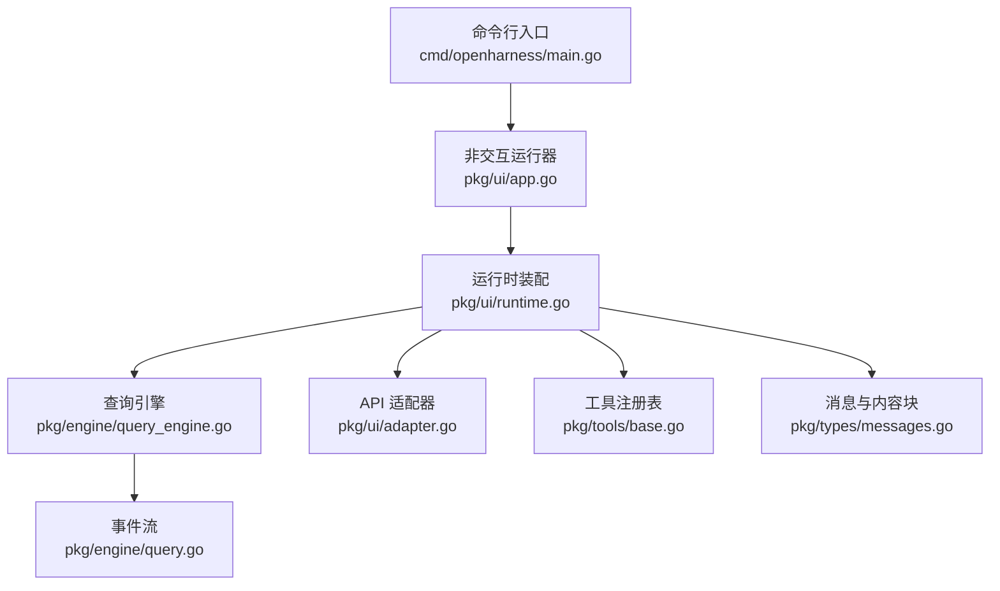
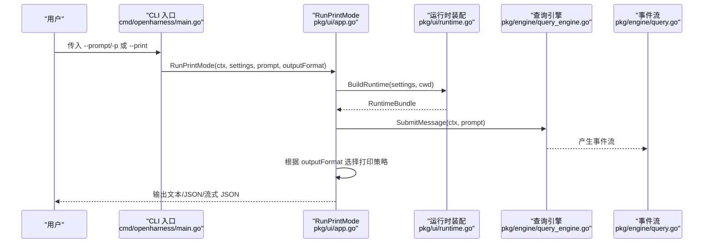
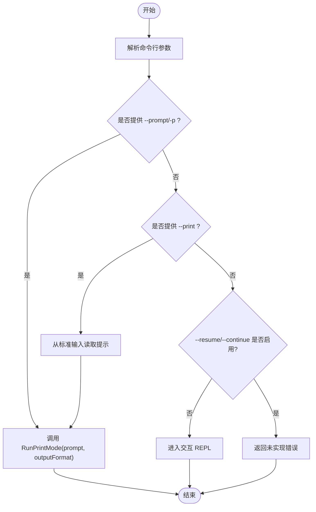
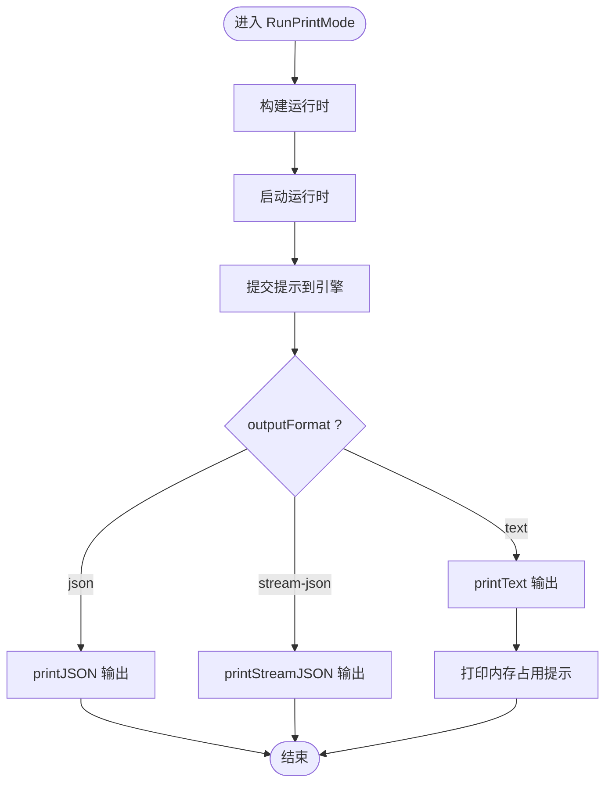
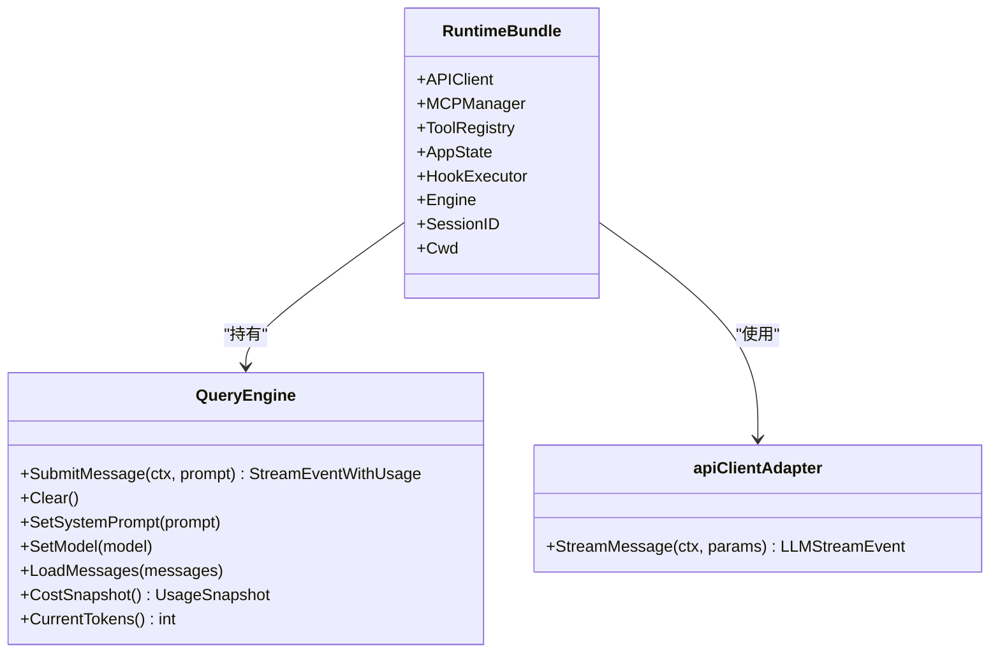
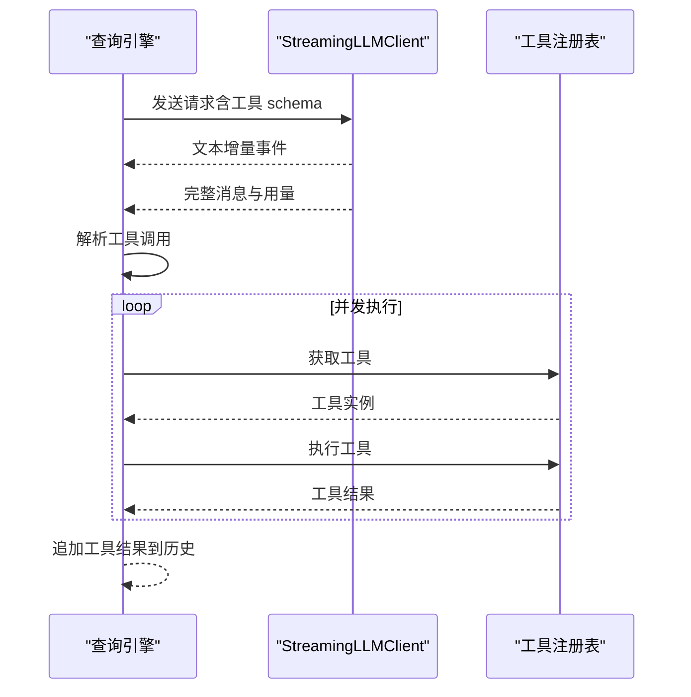
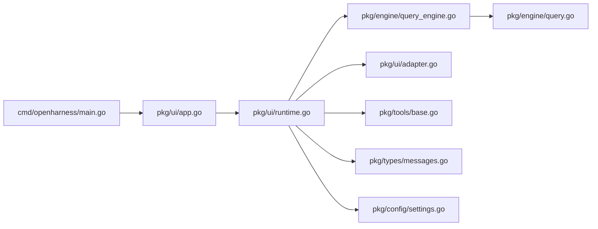

# 非交互模式

<cite>
**本文引用的文件**
- [cmd/openharness/main.go](file://cmd/openharness/main.go)
- [pkg/ui/app.go](file://pkg/ui/app.go)
- [pkg/ui/runtime.go](file://pkg/ui/runtime.go)
- [pkg/ui/adapter.go](file://pkg/ui/adapter.go)
- [pkg/engine/query_engine.go](file://pkg/engine/query_engine.go)
- [pkg/engine/query.go](file://pkg/engine/query.go)
- [pkg/config/settings.go](file://pkg/config/settings.go)
- [pkg/times/base.go](file://pkg/tools/base.go)
- [pkg/types/messages.go](file://pkg/types/messages.go)
- [pkg/hitl/cli_adapter.go](file://pkg/hitl/cli_adapter.go)
- [pkg/hitl/jsonlines_adapter.go](file://pkg/hitl/jsonlines_adapter.go)
</cite>

## 目录
1. [简介](#简介)
2. [项目结构](#项目结构)
3. [核心组件](#核心组件)
4. [架构总览](#架构总览)
5. [详细组件分析](#详细组件分析)
6. [依赖关系分析](#依赖关系分析)
7. [性能与资源特性](#性能与资源特性)
8. [使用场景与实践示例](#使用场景与实践示例)
9. [输出格式详解与解析](#输出格式详解与解析)
10. [错误处理与调试](#错误处理与调试)
11. [结论](#结论)

## 简介
本指南面向在 CI/CD、自动化脚本与批量处理中使用 OpenHarness Go 的用户，系统讲解“非交互模式”的用法与最佳实践。重点覆盖以下内容：
- 如何通过命令行参数一次性执行任务
- 如何从标准输入读取提示并以非交互方式输出
- 不同输出格式（text、json、stream-json）的适用场景与解析方法
- 在自动化流水线中的集成策略
- 错误处理与调试技巧

## 项目结构
OpenHarness 的非交互模式由 CLI 入口、运行时装配、引擎与输出打印器协同完成。核心路径如下：
- CLI 入口负责解析参数与路由到非交互执行
- 运行时装配负责构建 API 客户端、工具注册表、查询引擎与会话状态
- 引擎负责多轮对话、工具调用与事件流
- 输出层根据输出格式选择文本、JSON 或流式 JSON 打印

**图示来源**
- [cmd/openharness/main.go:22-102](file://cmd/openharness/main.go#L22-L102)
- [pkg/ui/app.go:18-61](file://pkg/ui/app.go#L18-L61)
- [pkg/ui/runtime.go:52-192](file://pkg/ui/runtime.go#L52-L192)
- [pkg/engine/query_engine.go:49-205](file://pkg/engine/query_engine.go#L49-L205)
- [pkg/engine/query.go:142-280](file://pkg/engine/query.go#L142-L280)
- [pkg/ui/adapter.go:11-59](file://pkg/ui/adapter.go#L11-L59)
- [pkg/tools/base.go:81-132](file://pkg/tools/base.go#L81-L132)
- [pkg/types/messages.go:15-97](file://pkg/types/messages.go#L15-L97)

**章节来源**
- [cmd/openharness/main.go:22-102](file://cmd/openharness/main.go#L22-L102)
- [pkg/ui/app.go:18-61](file://pkg/ui/app.go#L18-L61)
- [pkg/ui/runtime.go:52-192](file://pkg/ui/runtime.go#L52-L192)
- [pkg/engine/query_engine.go:49-205](file://pkg/engine/query_engine.go#L49-L205)
- [pkg/engine/query.go:142-280](file://pkg/engine/query.go#L142-L280)
- [pkg/ui/adapter.go:11-59](file://pkg/ui/adapter.go#L11-L59)
- [pkg/tools/base.go:81-132](file://pkg/tools/base.go#L81-L132)
- [pkg/types/messages.go:15-97](file://pkg/types/messages.go#L15-L97)

## 核心组件
- 命令行入口与参数解析：负责解析 --prompt/-p 与 --print，并将控制权交给非交互运行器
- 非交互运行器：根据输出格式选择文本、JSON 或流式 JSON 输出
- 运行时装配：构建 API 客户端、工具注册表、查询引擎与会话状态
- 查询引擎：管理对话历史、触发 LLM 请求、并发执行工具并产出事件流
- 输出层：按格式打印文本、JSON 或流式 JSON；在 text 模式下还显示内存占用提示

**章节来源**
- [cmd/openharness/main.go:46-76](file://cmd/openharness/main.go#L46-L76)
- [pkg/ui/app.go:18-61](file://pkg/ui/app.go#L18-L61)
- [pkg/ui/runtime.go:52-192](file://pkg/ui/runtime.go#L52-L192)
- [pkg/engine/query_engine.go:124-205](file://pkg/engine/query_engine.go#L124-L205)
- [pkg/engine/query.go:142-280](file://pkg/engine/query.go#L142-L280)

## 架构总览
非交互模式的关键流程：
- CLI 解析 --prompt/-p 或 --print
- 调用 RunPrintMode，构建运行时并启动
- 提交提示给查询引擎，接收事件流
- 根据输出格式打印结果或流式事件

**图示来源**
- [cmd/openharness/main.go:46-76](file://cmd/openharness/main.go#L46-L76)
- [pkg/ui/app.go:18-61](file://pkg/ui/app.go#L18-L61)
- [pkg/ui/runtime.go:52-192](file://pkg/ui/runtime.go#L52-L192)
- [pkg/engine/query_engine.go:124-205](file://pkg/engine/query_engine.go#L124-L205)
- [pkg/engine/query.go:142-280](file://pkg/engine/query.go#L142-L280)

## 详细组件分析

### 命令行入口与参数路由
- 支持 --prompt/-p 直接传入提示字符串
- 支持 --print 从标准输入读取提示
- 支持 --output-format 指定输出格式（默认 text）
- 当两者都未指定时进入交互 REPL

**图示来源**
- [cmd/openharness/main.go:46-76](file://cmd/openharness/main.go#L46-L76)
- [cmd/openharness/main.go:146-159](file://cmd/openharness/main.go#L146-L159)

**章节来源**
- [cmd/openharness/main.go:46-76](file://cmd/openharness/main.go#L46-L76)
- [cmd/openharness/main.go:87-95](file://cmd/openharness/main.go#L87-L95)
- [cmd/openharness/main.go:146-159](file://cmd/openharness/main.go#L146-L159)

### 非交互运行器（RunPrintMode）
- 构建运行时并启动
- 提交提示，接收事件流
- 根据 outputFormat 分派到 printText、printJSON 或 printStreamJSON
- 在 text 模式下额外打印当前内存占用百分比

**图示来源**
- [pkg/ui/app.go:18-61](file://pkg/ui/app.go#L18-L61)
- [pkg/ui/app.go:63-120](file://pkg/ui/app.go#L63-L120)

**章节来源**
- [pkg/ui/app.go:18-61](file://pkg/ui/app.go#L18-L61)
- [pkg/ui/app.go:63-120](file://pkg/ui/app.go#L63-L120)

### 运行时装配与引擎
- 运行时装配负责：
  - 解析 API Key、检测 Provider
  - 创建默认工具注册表并加载技能/插件
  - 构建查询引擎与会话状态
- 查询引擎负责：
  - 将用户提示加入历史
  - 触发 LLM 流式请求
  - 并发执行工具调用
  - 产出事件流供输出层消费

**图示来源**
- [pkg/ui/runtime.go:25-192](file://pkg/ui/runtime.go#L25-L192)
- [pkg/engine/query_engine.go:49-205](file://pkg/engine/query_engine.go#L49-L205)
- [pkg/ui/adapter.go:11-59](file://pkg/ui/adapter.go#L11-L59)

**章节来源**
- [pkg/ui/runtime.go:52-192](file://pkg/ui/runtime.go#L52-L192)
- [pkg/engine/query_engine.go:124-205](file://pkg/engine/query_engine.go#L124-L205)
- [pkg/ui/adapter.go:11-59](file://pkg/ui/adapter.go#L11-L59)

### 事件流与工具执行
- 事件类型包括模型回合开始、文本增量、工具执行开始/完成、助手回合完成与错误
- 引擎在每轮对话中：
  - 发送消息给 LLM，逐字节推送文本增量
  - 解析助手消息中的工具调用，逐一执行
  - 将工具结果作为用户消息追加到历史

**图示来源**
- [pkg/engine/query.go:142-280](file://pkg/engine/query.go#L142-L280)
- [pkg/engine/query_engine.go:174-205](file://pkg/engine/query_engine.go#L174-L205)
- [pkg/tools/base.go:51-59](file://pkg/tools/base.go#L51-L59)

**章节来源**
- [pkg/engine/query.go:142-280](file://pkg/engine/query.go#L142-L280)
- [pkg/engine/query_engine.go:174-205](file://pkg/engine/query_engine.go#L174-L205)
- [pkg/tools/base.go:51-59](file://pkg/tools/base.go#L51-L59)

## 依赖关系分析
- CLI 依赖配置与 UI 层
- UI 运行时依赖引擎、API 适配器、工具注册表与类型定义
- 引擎依赖工具注册表与 LLM 客户端抽象
- 输出层依赖事件流与服务估算

**图示来源**
- [cmd/openharness/main.go:22-102](file://cmd/openharness/main.go#L22-L102)
- [pkg/ui/app.go:18-61](file://pkg/ui/app.go#L18-L61)
- [pkg/ui/runtime.go:52-192](file://pkg/ui/runtime.go#L52-L192)
- [pkg/engine/query_engine.go:49-205](file://pkg/engine/query_engine.go#L49-L205)
- [pkg/engine/query.go:142-280](file://pkg/engine/query.go#L142-L280)
- [pkg/ui/adapter.go:11-59](file://pkg/ui/adapter.go#L11-L59)
- [pkg/tools/base.go:81-132](file://pkg/tools/base.go#L81-L132)
- [pkg/types/messages.go:15-97](file://pkg/types/messages.go#L15-L97)
- [pkg/config/settings.go:97-142](file://pkg/config/settings.go#L97-L142)

**章节来源**
- [cmd/openharness/main.go:22-102](file://cmd/openharness/main.go#L22-L102)
- [pkg/ui/app.go:18-61](file://pkg/ui/app.go#L18-L61)
- [pkg/ui/runtime.go:52-192](file://pkg/ui/runtime.go#L52-L192)
- [pkg/engine/query_engine.go:49-205](file://pkg/engine/query_engine.go#L49-L205)
- [pkg/engine/query.go:142-280](file://pkg/engine/query.go#L142-L280)
- [pkg/ui/adapter.go:11-59](file://pkg/ui/adapter.go#L11-L59)
- [pkg/tools/base.go:81-132](file://pkg/tools/base.go#L81-L132)
- [pkg/types/messages.go:15-97](file://pkg/types/messages.go#L15-L97)
- [pkg/config/settings.go:97-142](file://pkg/config/settings.go#L97-L142)

## 性能与资源特性
- 内存占用提示：text 模式会在完成后打印当前对话令牌占用百分比，帮助监控资源使用
- 令牌统计：查询引擎累计记录输入/输出令牌，便于成本估算
- 工具并发：工具执行采用并发模式，提升吞吐但需关注外部资源竞争

**章节来源**
- [pkg/ui/app.go:46-58](file://pkg/ui/app.go#L46-L58)
- [pkg/engine/query_engine.go:17-43](file://pkg/engine/query_engine.go#L17-L43)
- [pkg/engine/query.go:231-258](file://pkg/engine/query.go#L231-L258)

## 使用场景与实践示例

### 自动化脚本
- 单次任务执行：直接使用 --prompt/-p 传入提示，结合 --output-format=json 获取结构化输出，便于后续解析
- 批量处理：循环读取多个提示，每次调用 RunPrintMode，将输出写入文件或管道

### CI/CD 集成
- 在流水线步骤中调用 openharness，使用 --output-format=stream-json 实时消费事件流，快速失败与日志聚合
- 使用 --print 从标准输入读取提示，便于在流水线中动态拼装提示

### 与远程/IDE 集成
- 可通过 JSON-Lines 协议（非交互模式的扩展）与前端通信，参考 JSON-Lines 适配器与协议类型

**章节来源**
- [cmd/openharness/main.go:87-95](file://cmd/openharness/main.go#L87-L95)
- [pkg/ui/app.go:18-61](file://pkg/ui/app.go#L18-L61)
- [pkg/ui/runtime.go:194-237](file://pkg/ui/runtime.go#L194-L237)
- [pkg/hitl/jsonlines_adapter.go:14-96](file://pkg/hitl/jsonlines_adapter.go#L14-L96)

## 输出格式详解与解析

### text（默认）
- 行为：实时打印文本增量与工具执行状态，最后打印内存占用提示
- 适用：人类可读、调试友好
- 解析：直接输出文本，无需解析

**章节来源**
- [pkg/ui/app.go:38-61](file://pkg/ui/app.go#L38-L61)
- [pkg/ui/app.go:63-90](file://pkg/ui/app.go#L63-L90)

### json
- 行为：等待完整响应后，输出包含角色与内容的 JSON 对象
- 适用：需要结构化数据的自动化处理
- 解析：解析顶层对象，读取 role 与 content 字段

**章节来源**
- [pkg/ui/app.go:38-61](file://pkg/ui/app.go#L38-L61)
- [pkg/ui/app.go:92-106](file://pkg/ui/app.go#L92-L106)

### stream-json
- 行为：逐条输出事件对象，包含事件类型与文本片段
- 适用：实时消费与日志聚合、流式处理
- 解析：逐行解析 JSON 对象，根据 type 字段区分事件类型

**章节来源**
- [pkg/ui/app.go:38-61](file://pkg/ui/app.go#L38-L61)
- [pkg/ui/app.go:108-120](file://pkg/ui/app.go#L108-L120)

## 错误处理与调试

### 常见错误与定位
- API Key 缺失：运行时会检查配置与环境变量，若均未设置则报错
- LLM 流异常：事件流中出现错误事件，输出层直接返回错误
- 工具执行失败：工具结果标记为错误，输出层在 text 模式下打印失败提示
- 超出最大轮次：超过引擎设定的最大轮次限制时返回错误

### 调试建议
- 使用 --verbose（在设置中体现）开启详细日志
- 在 CI 中优先使用 --output-format=stream-json，便于实时观测事件
- 使用 --print 从标准输入注入提示，便于在流水线中动态组合提示
- 关注 text 模式下的内存占用提示，避免历史过长导致资源紧张

**章节来源**
- [pkg/config/settings.go:144-154](file://pkg/config/settings.go#L144-L154)
- [pkg/engine/query.go:173-206](file://pkg/engine/query.go#L173-L206)
- [pkg/engine/query.go:286-325](file://pkg/engine/query.go#L286-L325)
- [pkg/ui/app.go:63-90](file://pkg/ui/app.go#L63-L90)

## 结论
OpenHarness Go 的非交互模式通过简洁的命令行参数与统一的事件流输出，为自动化脚本、CI/CD 与批量处理提供了稳定可靠的执行通道。合理选择输出格式与提示构造策略，可显著提升集成效率与可观测性。