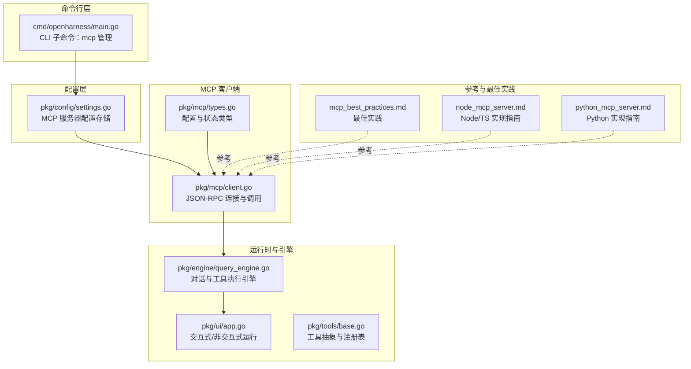
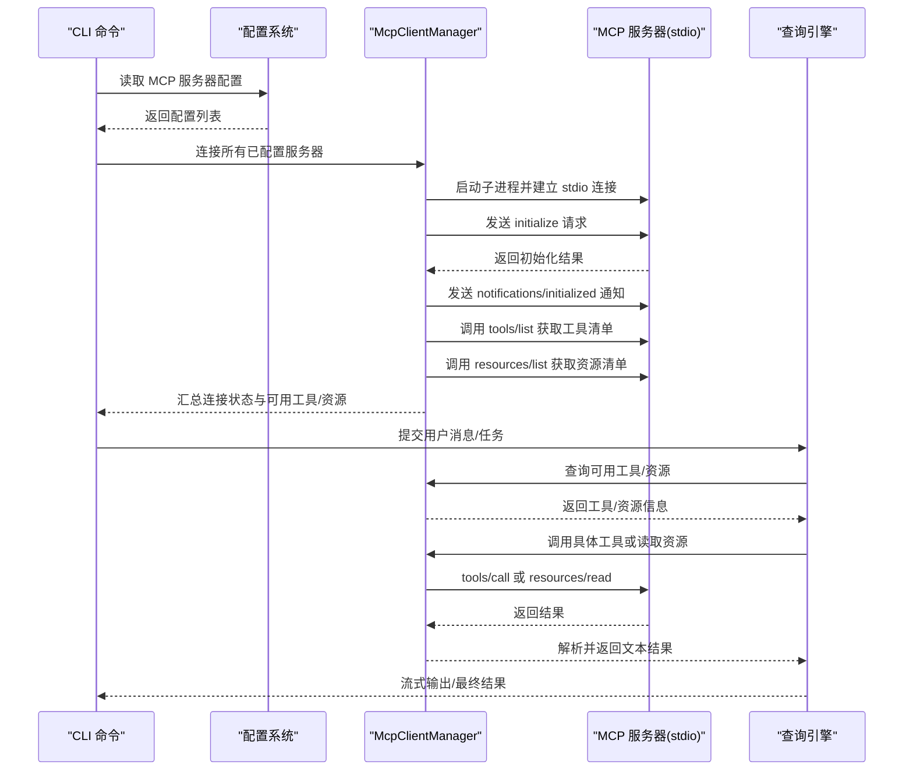
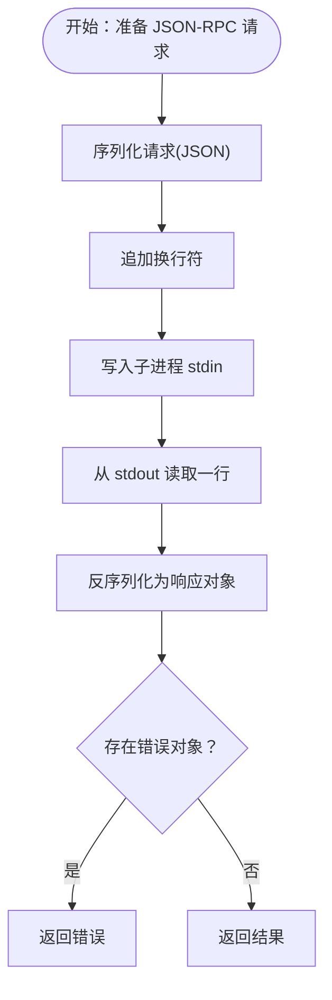
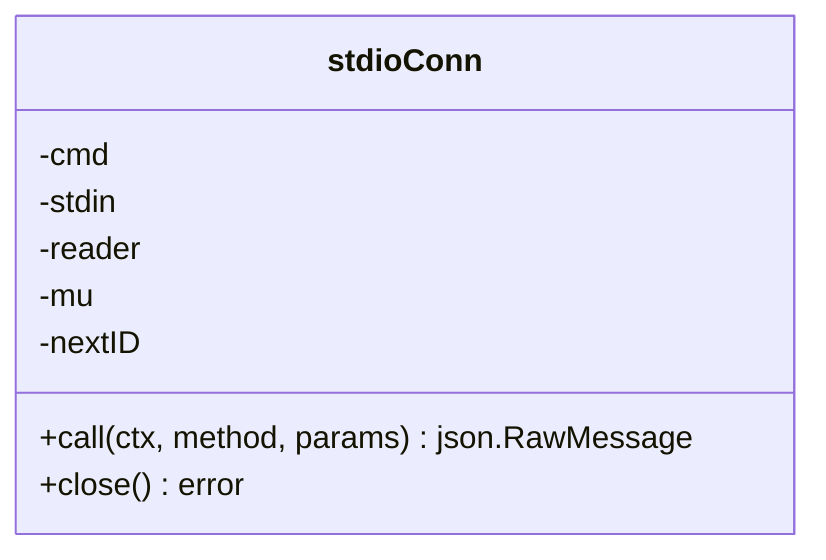
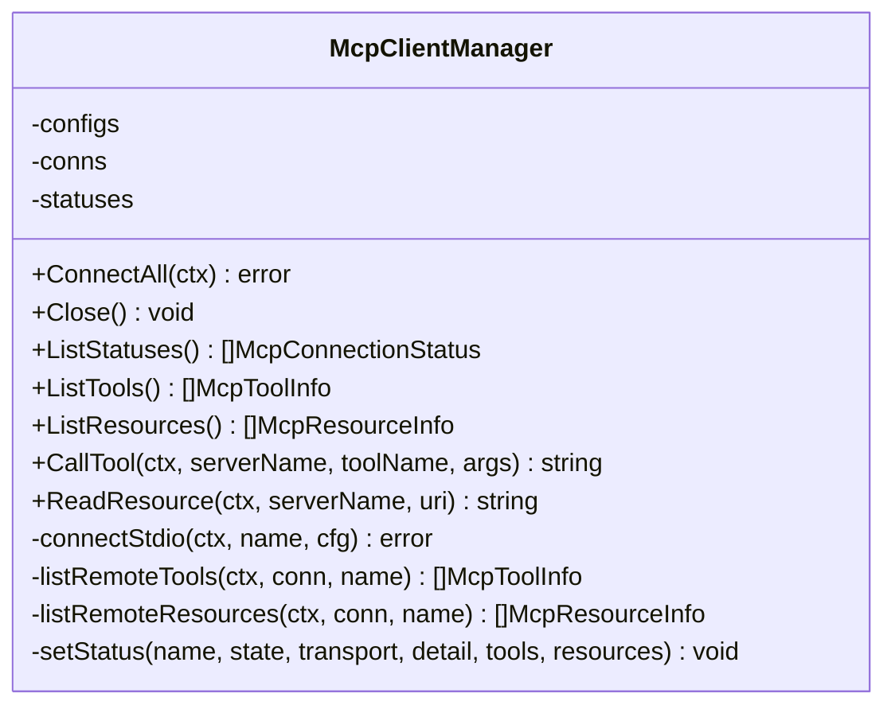
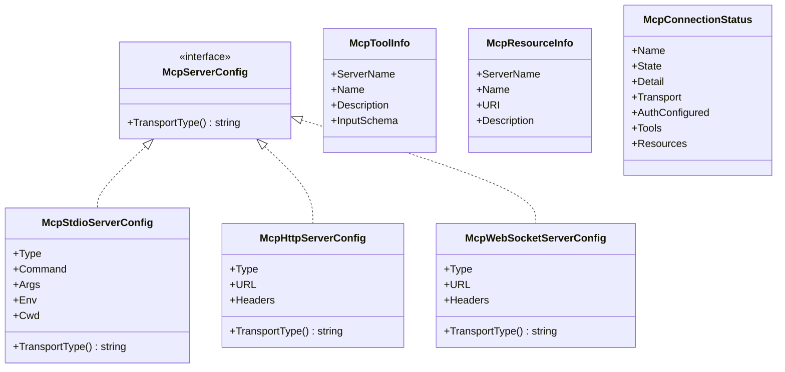
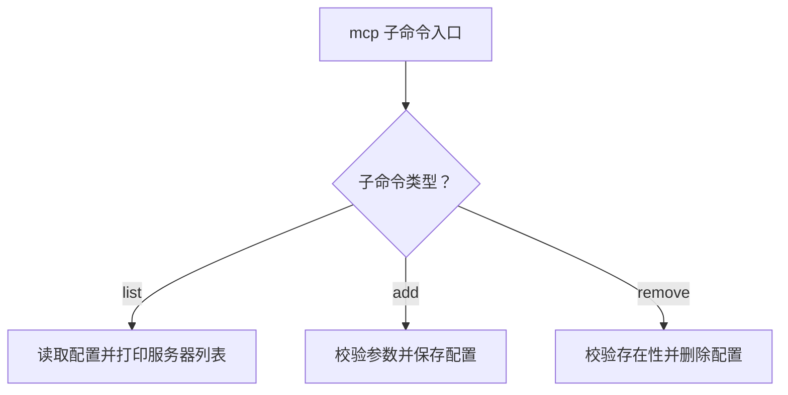
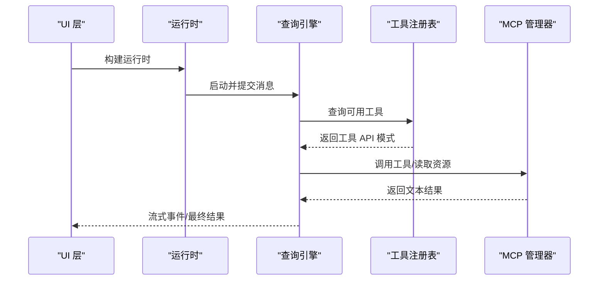
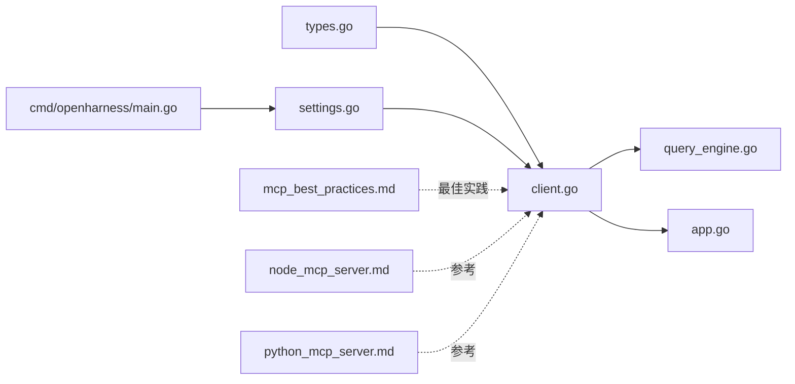

# MCP 协议概述

<cite>
**本文档引用的文件**
- [pkg/mcp/client.go](file://pkg/mcp/client.go)
- [pkg/mcp/types.go](file://pkg/mcp/types.go)
- [plugins/anthropic/skills/mcp-builder/reference/mcp_best_practices.md](file://plugins/anthropic/skills/mcp-builder/reference/mcp_best_practices.md)
- [plugins/anthropic/skills/mcp-builder/reference/node_mcp_server.md](file://plugins/anthropic/skills/mcp-builder/reference/node_mcp_server.md)
- [plugins/anthropic/skills/mcp-builder/reference/python_mcp_server.md](file://plugins/anthropic/skills/mcp-builder/reference/python_mcp_server.md)
- [cmd/openharness/main.go](file://cmd/openharness/main.go)
- [pkg/config/settings.go](file://pkg/config/settings.go)
- [pkg/ui/app.go](file://pkg/ui/app.go)
- [pkg/engine/query_engine.go](file://pkg/engine/query_engine.go)
- [pkg/tools/base.go](file://pkg/tools/base.go)
</cite>

## 目录
1. [引言](#引言)
2. [项目结构](#项目结构)
3. [核心组件](#核心组件)
4. [架构总览](#架构总览)
5. [详细组件分析](#详细组件分析)
6. [依赖关系分析](#依赖关系分析)
7. [性能考量](#性能考量)
8. [故障排查指南](#故障排查指南)
9. [结论](#结论)
10. [附录](#附录)

## 引言
本文件面向希望理解与使用 MCP（多方计算协议）的开发者，系统梳理 OpenHarness Go 实现中对 MCP 的支持与应用。内容涵盖：
- MCP 核心概念与设计理念
- JSON-RPC 2.0 在 MCP 中的应用（请求/响应格式、错误处理、消息序列化）
- MCP 在 AI 编码助手中的作用与价值（工具与服务的标准化集成）
- 协议版本管理、兼容性与扩展机制
- 面向开发者的理论基础与实践指导

## 项目结构
OpenHarness 将 MCP 能力以模块化方式组织，核心位于 pkg/mcp，并通过命令行工具、配置系统与运行时引擎进行集成。

图表来源
- [cmd/openharness/main.go:165-231](file://cmd/openharness/main.go#L165-L231)
- [pkg/config/settings.go:86-114](file://pkg/config/settings.go#L86-L114)
- [pkg/mcp/types.go:13-46](file://pkg/mcp/types.go#L13-L46)
- [pkg/mcp/client.go:116-148](file://pkg/mcp/client.go#L116-L148)
- [pkg/ui/app.go:18-61](file://pkg/ui/app.go#L18-L61)
- [pkg/engine/query_engine.go:49-68](file://pkg/engine/query_engine.go#L49-L68)
- [pkg/tools/base.go:82-132](file://pkg/tools/base.go#L82-L132)

章节来源
- [cmd/openharness/main.go:165-231](file://cmd/openharness/main.go#L165-L231)
- [pkg/config/settings.go:86-114](file://pkg/config/settings.go#L86-L114)
- [pkg/mcp/types.go:13-46](file://pkg/mcp/types.go#L13-L46)
- [pkg/mcp/client.go:116-148](file://pkg/mcp/client.go#L116-L148)
- [pkg/ui/app.go:18-61](file://pkg/ui/app.go#L18-L61)
- [pkg/engine/query_engine.go:49-68](file://pkg/engine/query_engine.go#L49-L68)
- [pkg/tools/base.go:82-132](file://pkg/tools/base.go#L82-L132)

## 核心组件
- JSON-RPC 2.0 请求/响应模型：用于与 MCP 服务器通信，包含版本标识、请求 ID、方法名与参数，以及结果或错误对象。
- stdioConn：封装子进程的标准输入输出，负责序列化请求、发送、读取响应并按顺序解析。
- McpClientManager：多服务器连接管理器，负责初始化、列举工具与资源、调用工具、读取资源，并维护连接状态。
- 配置与类型：统一的服务器配置类型（stdio/http/ws），以及工具/资源/连接状态的数据结构。
- CLI 子命令：提供 MCP 服务器的增删查操作，便于用户管理本地/远程 MCP 服务器。
- 运行时与引擎：将 MCP 工具与资源纳入对话流程，支持权限控制、上下文与流式输出。

章节来源
- [pkg/mcp/client.go:19-36](file://pkg/mcp/client.go#L19-L36)
- [pkg/mcp/client.go:46-110](file://pkg/mcp/client.go#L46-L110)
- [pkg/mcp/client.go:116-182](file://pkg/mcp/client.go#L116-L182)
- [pkg/mcp/types.go:13-46](file://pkg/mcp/types.go#L13-L46)
- [cmd/openharness/main.go:165-231](file://cmd/openharness/main.go#L165-L231)

## 架构总览
下图展示了从 CLI 到 MCP 服务器的完整调用链路，以及与运行时引擎的协作关系。

图表来源
- [pkg/mcp/client.go:296-373](file://pkg/mcp/client.go#L296-L373)
- [pkg/mcp/client.go:375-427](file://pkg/mcp/client.go#L375-L427)
- [pkg/mcp/client.go:198-261](file://pkg/mcp/client.go#L198-L261)
- [pkg/ui/app.go:18-61](file://pkg/ui/app.go#L18-L61)
- [pkg/engine/query_engine.go:124-205](file://pkg/engine/query_engine.go#L124-L205)

## 详细组件分析

### JSON-RPC 2.0 在 MCP 中的应用
- 请求格式：包含 jsonrpc 版本、唯一 id、方法名与可选参数；客户端通过 stdio 发送每条请求后换行分隔。
- 响应格式：包含 jsonrpc 版本、对应 id、结果或错误对象；客户端按顺序读取一行并反序列化。
- 错误处理：当响应包含错误对象时，客户端直接返回该错误；当序列化失败或 IO 失败时，包装为可识别的错误。
- 消息序列化：使用标准 JSON 编解码，确保跨语言互通。

图表来源
- [pkg/mcp/client.go:54-104](file://pkg/mcp/client.go#L54-L104)

章节来源
- [pkg/mcp/client.go:19-36](file://pkg/mcp/client.go#L19-L36)
- [pkg/mcp/client.go:54-104](file://pkg/mcp/client.go#L54-L104)

### stdioConn 与连接生命周期
- 连接建立：启动子进程，合并环境变量，丢弃 stderr，使用带缓冲的 reader 逐行读取。
- 写入串行化：使用互斥锁保证并发写入安全，避免交错请求。
- 请求 ID：原子自增生成唯一 ID，确保响应匹配。
- 关闭策略：关闭 stdin 并终止子进程。

图表来源
- [pkg/mcp/client.go:46-110](file://pkg/mcp/client.go#L46-L110)

章节来源
- [pkg/mcp/client.go:46-110](file://pkg/mcp/client.go#L46-L110)

### McpClientManager：多服务器管理与工具/资源聚合
- 连接管理：遍历配置，仅支持 stdio；其他传输类型标记为“待实现”。
- 初始化与通知：发送 initialize 请求并上报 initialized 通知。
- 工具与资源枚举：调用 tools/list 与 resources/list，聚合到连接状态。
- 工具调用与资源读取：封装参数并调用对应方法，解析返回的文本内容。
- 状态维护：线程安全地更新连接状态、工具与资源列表。

图表来源
- [pkg/mcp/client.go:116-182](file://pkg/mcp/client.go#L116-L182)
- [pkg/mcp/client.go:296-373](file://pkg/mcp/client.go#L296-L373)
- [pkg/mcp/client.go:375-427](file://pkg/mcp/client.go#L375-L427)

章节来源
- [pkg/mcp/client.go:116-182](file://pkg/mcp/client.go#L116-L182)
- [pkg/mcp/client.go:296-373](file://pkg/mcp/client.go#L296-L373)
- [pkg/mcp/client.go:375-427](file://pkg/mcp/client.go#L375-L427)

### 配置与类型系统
- 服务器配置类型：支持 stdio/http/ws 三种传输，通过 discriminator 字段动态解析。
- 工具与资源信息：不可变值对象，携带服务器名称、描述与输入模式等元数据。
- 连接状态：记录服务器名称、当前状态、传输类型、认证配置、可用工具与资源。

图表来源
- [pkg/mcp/types.go:13-46](file://pkg/mcp/types.go#L13-L46)
- [pkg/mcp/types.go:94-108](file://pkg/mcp/types.go#L94-L108)
- [pkg/mcp/types.go:124-133](file://pkg/mcp/types.go#L124-L133)

章节来源
- [pkg/mcp/types.go:13-46](file://pkg/mcp/types.go#L13-L46)
- [pkg/mcp/types.go:94-108](file://pkg/mcp/types.go#L94-L108)
- [pkg/mcp/types.go:124-133](file://pkg/mcp/types.go#L124-L133)

### CLI 子命令：MCP 服务器管理
- list：列出已配置的 MCP 服务器及其命令与参数。
- add：添加新的 MCP 服务器配置（命令、参数、环境变量）。
- remove：移除指定的 MCP 服务器配置。

图表来源
- [cmd/openharness/main.go:165-231](file://cmd/openharness/main.go#L165-L231)

章节来源
- [cmd/openharness/main.go:165-231](file://cmd/openharness/main.go#L165-L231)

### 运行时与工具集成
- 运行时构建：根据设置与工作目录构建运行时，支持 HITL 回调。
- 查询引擎：管理对话历史、成本统计、压缩与工具执行，支持流式事件输出。
- 工具注册表：提供线程安全的工具注册与查询接口，支持 API 模式导出。
- UI 输出：支持文本、JSON、流式 JSON 输出，展示工具执行状态与令牌用量。

图表来源
- [pkg/ui/app.go:18-61](file://pkg/ui/app.go#L18-L61)
- [pkg/engine/query_engine.go:124-205](file://pkg/engine/query_engine.go#L124-L205)
- [pkg/tools/base.go:82-132](file://pkg/tools/base.go#L82-L132)

章节来源
- [pkg/ui/app.go:18-61](file://pkg/ui/app.go#L18-L61)
- [pkg/engine/query_engine.go:124-205](file://pkg/engine/query_engine.go#L124-L205)
- [pkg/tools/base.go:82-132](file://pkg/tools/base.go#L82-L132)

## 依赖关系分析
- 组件耦合与内聚：McpClientManager 对 stdioConn 具有强依赖，但通过接口化的配置类型与状态结构实现了较好的内聚。
- 外部依赖与集成点：
  - JSON-RPC 2.0：作为 MCP 通信协议的基础。
  - 子进程 stdio：用于本地 MCP 服务器集成。
  - 配置系统：提供 MCP 服务器的持久化配置。
  - 运行时与引擎：将 MCP 工具整合进对话流程。
- 潜在循环依赖：未发现直接循环依赖；各模块职责清晰，通过接口与数据结构传递。

图表来源
- [pkg/mcp/types.go:13-46](file://pkg/mcp/types.go#L13-L46)
- [pkg/mcp/client.go:116-182](file://pkg/mcp/client.go#L116-L182)
- [pkg/engine/query_engine.go:49-68](file://pkg/engine/query_engine.go#L49-L68)
- [pkg/ui/app.go:18-61](file://pkg/ui/app.go#L18-L61)
- [cmd/openharness/main.go:165-231](file://cmd/openharness/main.go#L165-L231)
- [pkg/config/settings.go:86-114](file://pkg/config/settings.go#L86-L114)

章节来源
- [pkg/mcp/types.go:13-46](file://pkg/mcp/types.go#L13-L46)
- [pkg/mcp/client.go:116-182](file://pkg/mcp/client.go#L116-L182)
- [pkg/engine/query_engine.go:49-68](file://pkg/engine/query_engine.go#L49-L68)
- [pkg/ui/app.go:18-61](file://pkg/ui/app.go#L18-L61)
- [cmd/openharness/main.go:165-231](file://cmd/openharness/main.go#L165-L231)
- [pkg/config/settings.go:86-114](file://pkg/config/settings.go#L86-L114)

## 性能考量
- 序列化与 IO：使用带缓冲的 reader 逐行读取，减少系统调用开销；写入采用互斥锁保证顺序性。
- 并发与阻塞：当前实现按顺序等待响应，适合单客户端场景；若需并发，建议引入基于 ID 的响应分发与 goroutine 管理。
- 资源清理：连接关闭时显式终止子进程，避免僵尸进程；stderr 丢弃以防止阻塞。
- 扩展性：支持多种传输类型（http/ws 待实现），可通过新增配置类型与连接器扩展。

## 故障排查指南
- 连接失败：检查子进程启动、管道创建与环境变量合并是否成功；确认 MCP 服务器可正常启动。
- 初始化失败：核对 initialize 请求参数（协议版本、能力、客户端信息）与服务器期望一致。
- 工具/资源列表为空：确认服务器正确实现 tools/list 与 resources/list；检查网络或权限问题。
- 响应解析错误：验证 JSON-RPC 响应格式与换行分隔；检查服务器是否按顺序返回响应。
- 权限与安全：遵循最佳实践中的认证与授权要求，避免在 stdout 输出日志。

章节来源
- [pkg/mcp/client.go:296-373](file://pkg/mcp/client.go#L296-L373)
- [pkg/mcp/client.go:375-427](file://pkg/mcp/client.go#L375-L427)
- [plugins/anthropic/skills/mcp-builder/reference/mcp_best_practices.md:152-212](file://plugins/anthropic/skills/mcp-builder/reference/mcp_best_practices.md#L152-L212)

## 结论
OpenHarness 通过简洁的 JSON-RPC 2.0 封装与 stdio 连接，提供了对 MCP 协议的稳定支持。结合配置系统、运行时与引擎，MCP 工具与资源得以无缝融入对话流程，为 AI 编码助手提供标准化、可扩展的外部服务接入能力。未来可在并发响应处理、多传输类型支持与更丰富的错误诊断方面持续优化。

## 附录

### 协议版本管理与兼容性
- 协议版本：客户端在 initialize 请求中声明协议版本，确保与服务器兼容。
- 兼容性策略：服务器应向前兼容，客户端在新版本发布时逐步升级；通过能力字段声明支持的功能集合。

章节来源
- [pkg/mcp/client.go:331-343](file://pkg/mcp/client.go#L331-L343)

### 扩展机制
- 新增传输类型：通过实现 McpServerConfig 接口与对应的连接器，扩展 http/ws 等传输。
- 工具与资源注册：遵循最佳实践命名与注解，提供清晰的输入/输出模式与错误处理。

章节来源
- [pkg/mcp/types.go:13-46](file://pkg/mcp/types.go#L13-L46)
- [plugins/anthropic/skills/mcp-builder/reference/mcp_best_practices.md:1-250](file://plugins/anthropic/skills/mcp-builder/reference/mcp_best_practices.md#L1-L250)
- [plugins/anthropic/skills/mcp-builder/reference/node_mcp_server.md:1-800](file://plugins/anthropic/skills/mcp-builder/reference/node_mcp_server.md#L1-L800)
- [plugins/anthropic/skills/mcp-builder/reference/python_mcp_server.md:1-719](file://plugins/anthropic/skills/mcp-builder/reference/python_mcp_server.md#L1-L719)