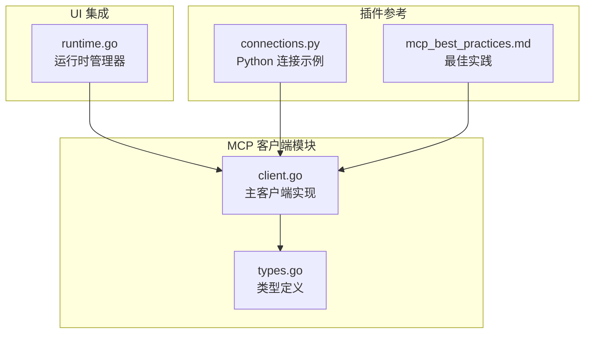
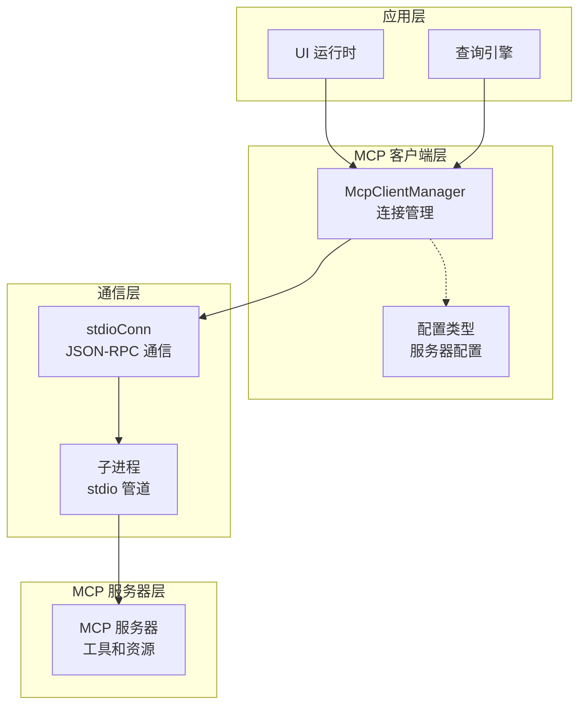
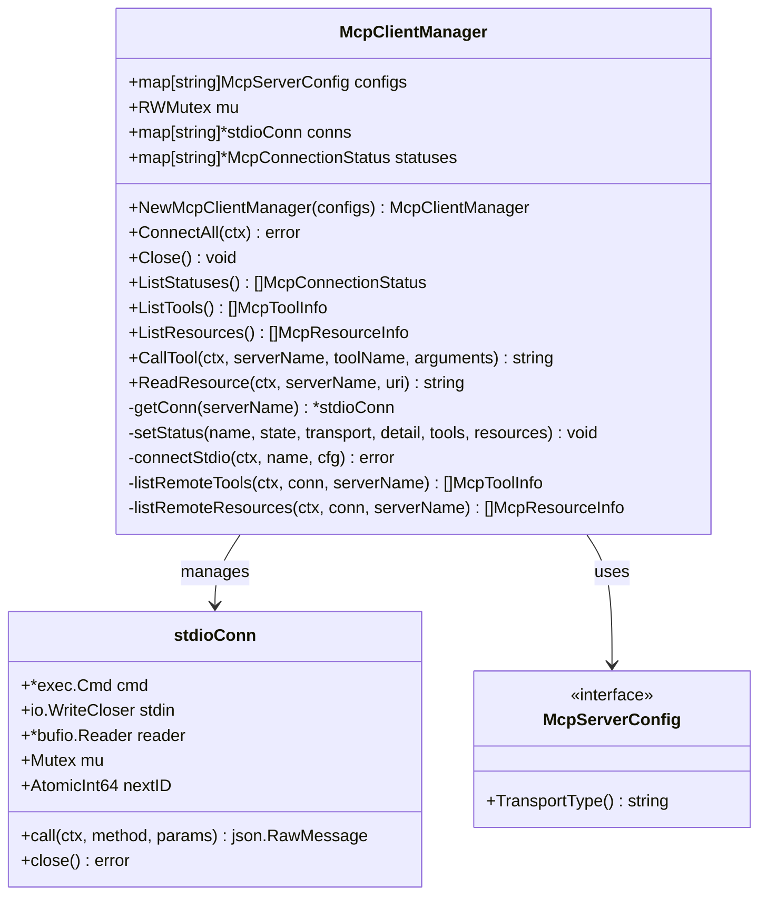
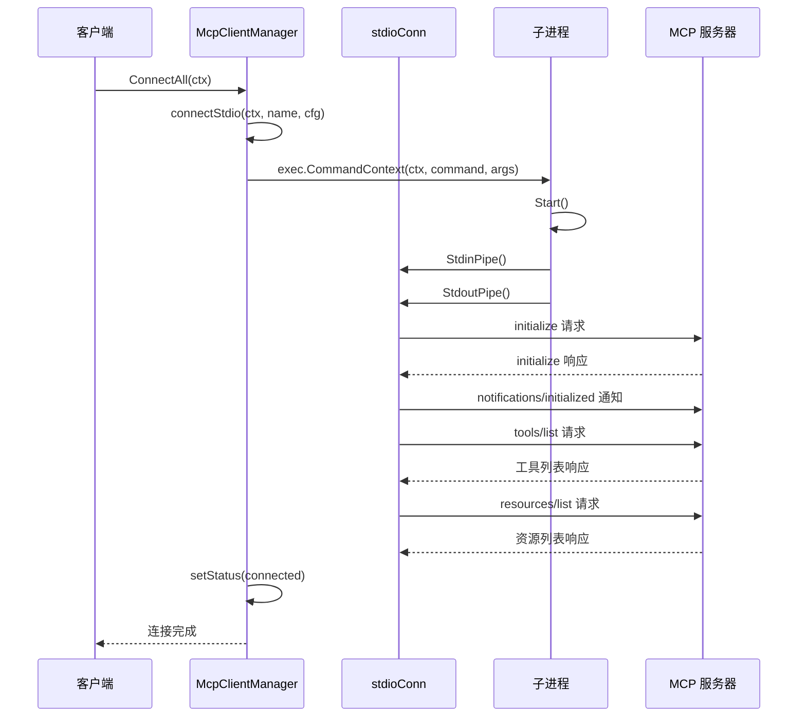
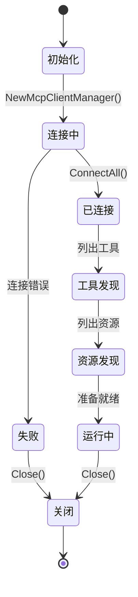
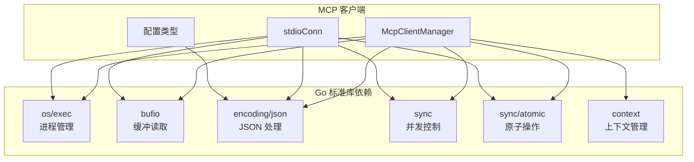
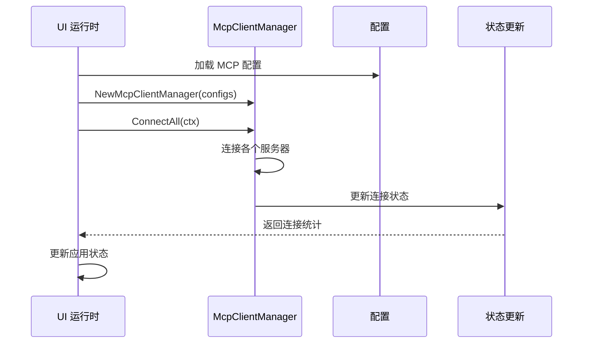

# MCP 客户端实现

<cite>
**本文档引用的文件**
- [client.go](file://pkg/mcp/client.go)
- [types.go](file://pkg/mcp/types.go)
- [runtime.go](file://pkg/ui/runtime.go)
- [connections.py](file://plugins/anthropic/skills/mcp-builder/scripts/connections.py)
- [mcp_best_practices.md](file://plugins/anthropic/skills/mcp-builder/reference/mcp_best_practices.md)
</cite>

## 目录
1. [简介](#简介)
2. [项目结构](#项目结构)
3. [核心组件](#核心组件)
4. [架构概览](#架构概览)
5. [详细组件分析](#详细组件分析)
6. [依赖关系分析](#依赖关系分析)
7. [性能考虑](#性能考虑)
8. [故障排除指南](#故障排除指南)
9. [结论](#结论)

## 简介

本文档详细分析了 OpenHarness 项目中的 MCP（模型上下文协议）客户端实现。MCP 是一个用于在 AI 应用程序和外部服务之间建立标准化通信的协议。该实现提供了对多个 MCP 服务器的连接管理、状态跟踪和并发控制功能，特别专注于通过标准输入输出（stdio）管道进行通信的本地服务器集成。

该客户端实现采用 Go 语言编写，实现了完整的 JSON-RPC 2.0 协议支持，并提供了优雅的错误处理、超时管理和资源清理机制。文档将深入探讨 McpClientManager 的架构设计、stdioConn 的实现机制，以及从初始化到连接建立、工具发现和资源获取的完整生命周期管理。

## 项目结构

OpenHarness 项目采用模块化架构，MCP 客户端位于 `pkg/mcp/` 目录下，与 UI 运行时和其他系统组件紧密集成。

**图表来源**
- [client.go:1-50](file://pkg/mcp/client.go#L1-L50)
- [types.go:1-50](file://pkg/mcp/types.go#L1-L50)
- [runtime.go:90-120](file://pkg/ui/runtime.go#L90-L120)

**章节来源**
- [client.go:1-50](file://pkg/mcp/client.go#L1-L50)
- [types.go:1-50](file://pkg/mcp/types.go#L1-L50)
- [runtime.go:90-120](file://pkg/ui/runtime.go#L90-L120)

## 核心组件

MCP 客户端实现包含三个核心组件：McpClientManager、stdioConn 和各种配置类型。这些组件协同工作以提供完整的 MCP 服务器连接管理功能。

### 主要组件概述

1. **McpClientManager**: 主要的连接管理器，负责协调多个 MCP 服务器的连接
2. **stdioConn**: 封装单个子进程的 JSON-RPC 通信连接
3. **配置类型**: 支持多种传输方式的配置结构

**章节来源**
- [client.go:116-132](file://pkg/mcp/client.go#L116-L132)
- [client.go:46-52](file://pkg/mcp/client.go#L46-L52)
- [types.go:13-47](file://pkg/mcp/types.go#L13-L47)

## 架构概览

MCP 客户端采用分层架构设计，从底层的进程通信到高层的应用集成都有清晰的职责分离。

**图表来源**
- [client.go:116-132](file://pkg/mcp/client.go#L116-L132)
- [client.go:46-52](file://pkg/mcp/client.go#L46-L52)
- [types.go:19-47](file://pkg/mcp/types.go#L19-L47)

## 详细组件分析

### McpClientManager 架构设计

McpClientManager 是整个 MCP 客户端的核心，负责管理多个 MCP 服务器的连接生命周期。

#### 关键特性

1. **并发安全**: 使用读写互斥锁确保线程安全
2. **状态跟踪**: 维护每个服务器的连接状态和元数据
3. **批量操作**: 支持同时连接多个服务器
4. **资源管理**: 提供统一的关闭和清理机制

**图表来源**
- [client.go:116-132](file://pkg/mcp/client.go#L116-L132)
- [client.go:46-52](file://pkg/mcp/client.go#L46-L52)
- [types.go:13-17](file://pkg/mcp/types.go#L13-L17)

#### 并发控制机制

McpClientManager 使用读写互斥锁实现高效的并发访问：

- **读锁**: 用于只读操作（如列出工具、资源）
- **写锁**: 用于修改操作（如更新状态、添加连接）

这种设计允许多个读操作同时进行，但写操作会阻塞所有其他操作。

**章节来源**
- [client.go:120-123](file://pkg/mcp/client.go#L120-L123)
- [client.go:161-169](file://pkg/mcp/client.go#L161-L169)

### stdioConn 实现机制

stdioConn 是连接到 MCP 服务器的核心组件，专门处理通过标准输入输出管道的 JSON-RPC 通信。

#### 进程启动和管道通信

**图表来源**
- [client.go:296-373](file://pkg/mcp/client.go#L296-L373)
- [client.go:54-105](file://pkg/mcp/client.go#L54-L105)

#### JSON-RPC 消息处理

stdioConn 实现了完整的 JSON-RPC 2.0 协议支持：

1. **请求序列化**: 将方法调用转换为 JSON-RPC 请求
2. **ID 分配**: 使用原子计数器分配唯一请求 ID
3. **响应解析**: 解析服务器响应并处理错误
4. **超时处理**: 支持上下文取消和超时

**章节来源**
- [client.go:54-105](file://pkg/mcp/client.go#L54-L105)
- [client.go:19-40](file://pkg/mcp/client.go#L19-L40)

### 客户端生命周期管理

MCP 客户端的生命周期从初始化到资源清理包含以下关键阶段：

#### 初始化阶段

1. 创建配置映射
2. 初始化内部状态存储
3. 准备连接管理器

#### 连接建立阶段

1. 验证服务器配置
2. 启动子进程
3. 建立管道连接
4. 执行 MCP 协议握手

#### 工具和资源发现

1. 发送 `tools/list` 请求
2. 发送 `resources/list` 请求
3. 解析并缓存结果

#### 资源清理阶段

1. 关闭所有连接
2. 终止子进程
3. 清理状态存储

**章节来源**
- [client.go:126-132](file://pkg/mcp/client.go#L126-L132)
- [client.go:136-148](file://pkg/mcp/client.go#L136-L148)
- [client.go:151-158](file://pkg/mcp/client.go#L151-L158)

### 错误处理策略

MCP 客户端实现了多层次的错误处理机制：

#### 连接级错误处理

- **进程启动失败**: 记录详细错误信息
- **管道创建失败**: 提供具体的错误描述
- **协议握手失败**: 包装原始错误并返回

#### 运行时错误处理

- **JSON 序列化错误**: 标准化错误格式
- **网络通信错误**: 包装为可识别的客户端错误
- **超时处理**: 支持上下文取消

#### 资源清理

- **优雅关闭**: 确保所有资源被正确释放
- **进程终止**: 强制终止未正常退出的进程
- **状态同步**: 更新连接状态以反映错误

**章节来源**
- [client.go:140-142](file://pkg/mcp/client.go#L140-L142)
- [client.go:340-343](file://pkg/mcp/client.go#L340-L343)
- [client.go:107-110](file://pkg/mcp/client.go#L107-L110)

## 依赖关系分析

MCP 客户端实现具有清晰的依赖关系，主要依赖于 Go 标准库的功能。

**图表来源**
- [client.go:3-13](file://pkg/mcp/client.go#L3-L13)
- [types.go:4-7](file://pkg/mcp/types.go#L4-L7)

### 外部依赖集成

MCP 客户端与 UI 运行时的集成展示了实际使用场景：

**图表来源**
- [runtime.go:99-101](file://pkg/ui/runtime.go#L99-L101)
- [runtime.go:195-213](file://pkg/ui/runtime.go#L195-L213)

**章节来源**
- [runtime.go:99-101](file://pkg/ui/runtime.go#L99-L101)
- [runtime.go:195-213](file://pkg/ui/runtime.go#L195-L213)

## 性能考虑

MCP 客户端实现考虑了多个性能优化方面：

### 并发优化

1. **读写分离**: 使用 RWMutex 允许多个读操作并行
2. **原子操作**: 使用 atomic.Int64 确保 ID 分配的线程安全
3. **缓冲读取**: 使用 bufio.Reader 提高 I/O 性能

### 内存管理

1. **连接复用**: 保持活跃连接以避免频繁重启
2. **状态缓存**: 缓存工具和资源列表减少重复查询
3. **资源清理**: 及时关闭管道和终止进程

### 网络优化

1. **流式处理**: 使用行分隔的 JSON-RPC 消息
2. **超时控制**: 支持上下文取消避免阻塞
3. **错误快速失败**: 及时检测和报告连接问题

## 故障排除指南

### 常见问题诊断

#### 连接失败

**症状**: 连接状态显示为 failed

**可能原因**:
- MCP 服务器进程无法启动
- 可执行文件路径不正确
- 权限不足

**解决步骤**:
1. 验证命令路径和参数
2. 检查文件权限
3. 查看服务器日志输出

#### 工具列表为空

**症状**: 工具发现阶段失败

**可能原因**:
- MCP 服务器不支持工具接口
- 协议版本不兼容
- 服务器配置错误

**解决步骤**:
1. 验证 MCP 服务器版本
2. 检查服务器配置
3. 测试直接连接

#### 资源访问失败

**症状**: 资源读取操作失败

**可能原因**:
- 资源 URI 不正确
- 服务器不支持资源接口
- 权限问题

**解决步骤**:
1. 验证资源 URI 格式
2. 检查服务器资源注册
3. 确认访问权限

### 调试技巧

1. **启用详细日志**: 检查服务器的标准错误输出
2. **验证协议**: 确保 JSON-RPC 消息格式正确
3. **测试连接**: 使用简单的工具调用来验证连接

**章节来源**
- [client.go:140-142](file://pkg/mcp/client.go#L140-L142)
- [client.go:355-358](file://pkg/mcp/client.go#L355-L358)

## 结论

OpenHarness 项目中的 MCP 客户端实现展现了优秀的软件工程实践，具有以下特点：

1. **架构清晰**: 分层设计使得职责明确，易于维护
2. **并发安全**: 采用适当的同步机制确保线程安全
3. **错误处理**: 实现了全面的错误处理和恢复机制
4. **性能优化**: 考虑了多方面的性能优化
5. **可扩展性**: 支持多种传输方式的配置

该实现为本地 MCP 服务器提供了可靠的集成解决方案，通过标准输入输出管道实现了简单而有效的通信机制。配合 UI 运行时的集成，为用户提供了完整的 MCP 服务器管理功能。

未来可以考虑的改进方向包括：
- 添加 HTTP 和 WebSocket 传输支持
- 实现更复杂的连接池管理
- 增加监控和指标收集功能
- 提供更丰富的配置选项