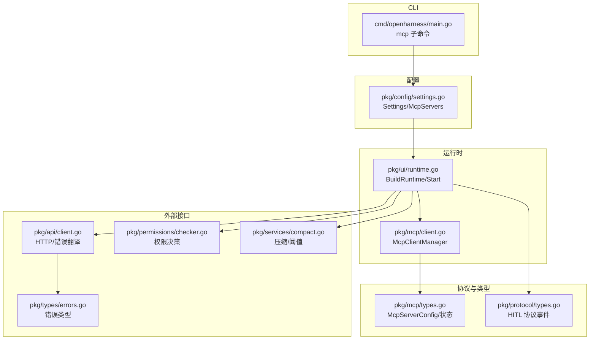
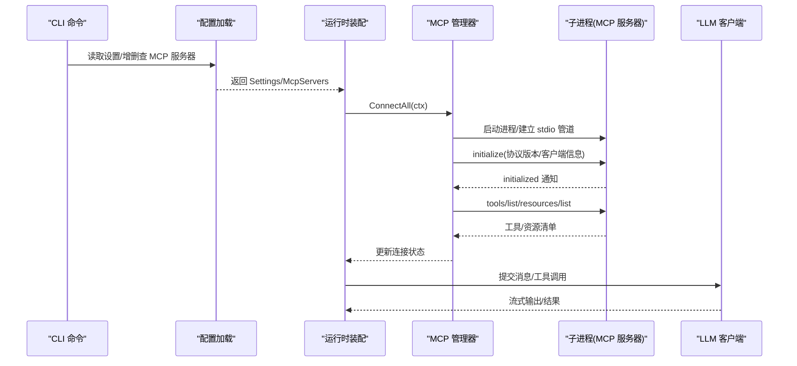
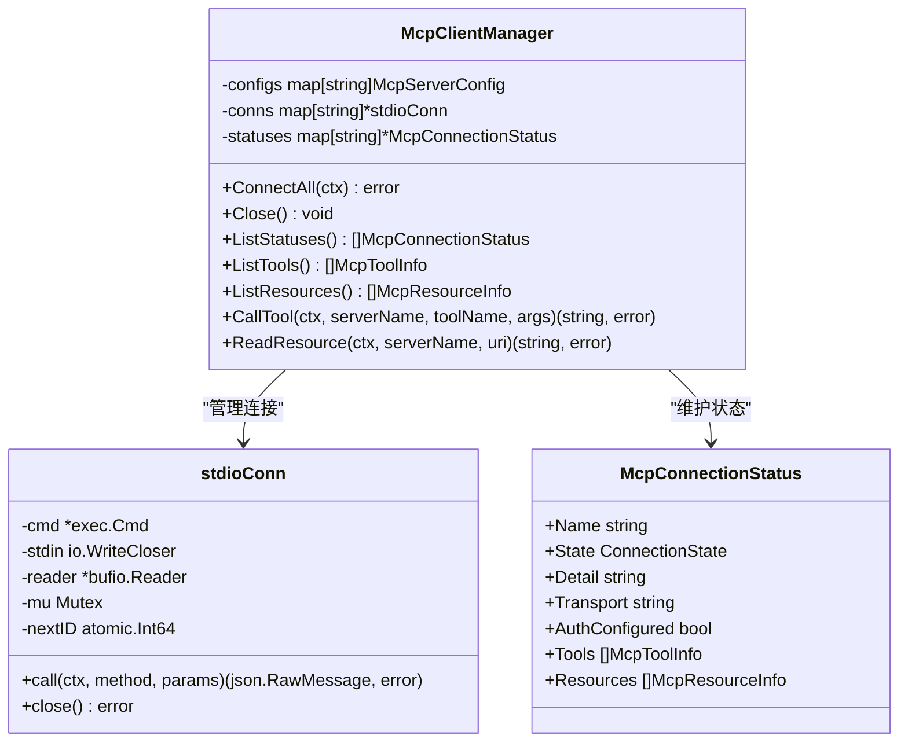
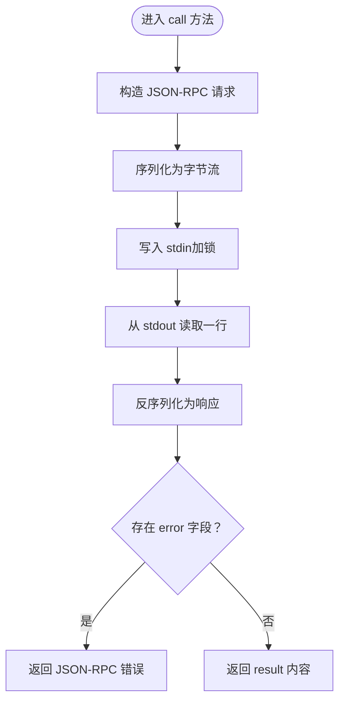
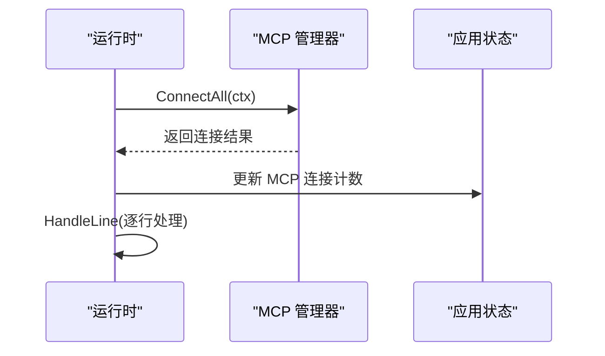
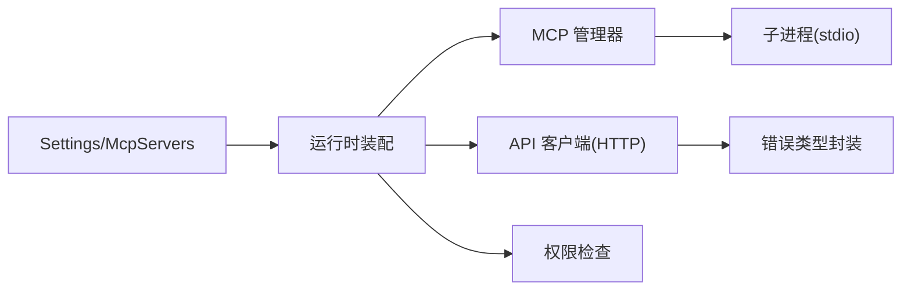

# MCP 故障排除

<cite>
**本文引用的文件**   
- [pkg/mcp/client.go](file://pkg/mcp/client.go)
- [pkg/mcp/types.go](file://pkg/mcp/types.go)
- [pkg/config/settings.go](file://pkg/config/settings.go)
- [cmd/openharness/main.go](file://cmd/openharness/main.go)
- [pkg/ui/runtime.go](file://pkg/ui/runtime.go)
- [pkg/api/client.go](file://pkg/api/client.go)
- [pkg/times/errors.go](file://pkg/types/errors.go)
- [pkg/permissions/checker.go](file://pkg/permissions/checker.go)
- [pkg/services/compact.go](file://pkg/services/compact.go)
- [pkg/protocol/types.go](file://pkg/protocol/types.go)
- [plugins/superpowers/skills/systematic-debugging/SKILL.md](file://plugins/superpowers/skills/systematic-debugging/SKILL.md)
- [plugins/superpowers/skills/systematic-debugging/root-cause-tracing.md](file://plugins/superpowers/skills/systematic-debugging/root-cause-tracing.md)
</cite>

## 目录
1. [简介](#简介)
2. [项目结构](#项目结构)
3. [核心组件](#核心组件)
4. [架构总览](#架构总览)
5. [详细组件分析](#详细组件分析)
6. [依赖分析](#依赖分析)
7. [性能考虑](#性能考虑)
8. [故障排除指南](#故障排除指南)
9. [结论](#结论)
10. [附录](#附录)

## 简介
本指南面向运维与开发人员，聚焦 MCP（模型上下文协议）系统在本仓库中的实现与运行，提供从连接建立到运行期问题的全链路故障排除方法。内容覆盖：
- 进程启动失败、管道通信异常、协议协商错误的定位与修复
- 错误码与错误类型解读（JSON-RPC 错误、超时错误、权限错误）
- 诊断工具与调试方法（日志、网络监控、状态检查）
- 连接状态管理（断开检测、自动重连、优雅降级）
- 性能问题排查（响应延迟、内存泄漏、资源竞争）
- 监控指标与告警建议

## 项目结构
MCP 相关能力主要由以下模块组成：
- 配置层：读取并解析 MCP 服务器配置
- 客户端层：负责子进程启动、stdio 管道通信、JSON-RPC 协议交互
- 运行时层：装配引擎、工具注册、MCP 管理器初始化与连接
- CLI 层：提供 MCP 服务器的增删查与认证状态管理命令
- 权限与错误：权限决策与上游错误类型封装
- 服务与压缩：对话历史压缩、令牌估算与阈值控制

**图表来源**
- [cmd/openharness/main.go:165-231](file://cmd/openharness/main.go#L165-L231)
- [pkg/config/settings.go:94-125](file://pkg/config/settings.go#L94-L125)
- [pkg/ui/runtime.go:51-192](file://pkg/ui/runtime.go#L51-L192)
- [pkg/mcp/client.go:116-158](file://pkg/mcp/client.go#L116-L158)
- [pkg/mcp/types.go:13-46](file://pkg/mcp/types.go#L13-L46)
- [pkg/protocol/types.go:15-35](file://pkg/protocol/types.go#L15-L35)
- [pkg/api/client.go:358-405](file://pkg/api/client.go#L358-L405)
- [pkg/types/errors.go:5-39](file://pkg/types/errors.go#L5-L39)
- [pkg/permissions/checker.go:25-82](file://pkg/permissions/checker.go#L25-L82)
- [pkg/services/compact.go:12-30](file://pkg/services/compact.go#L12-L30)

**章节来源**
- [cmd/openharness/main.go:165-231](file://cmd/openharness/main.go#L165-L231)
- [pkg/config/settings.go:94-125](file://pkg/config/settings.go#L94-L125)
- [pkg/ui/runtime.go:51-192](file://pkg/ui/runtime.go#L51-L192)
- [pkg/mcp/client.go:116-158](file://pkg/mcp/client.go#L116-L158)
- [pkg/mcp/types.go:13-46](file://pkg/mcp/types.go#L13-L46)
- [pkg/protocol/types.go:15-35](file://pkg/protocol/types.go#L15-L35)
- [pkg/api/client.go:358-405](file://pkg/api/client.go#L358-L405)
- [pkg/types/errors.go:5-39](file://pkg/types/errors.go#L5-L39)
- [pkg/permissions/checker.go:25-82](file://pkg/permissions/checker.go#L25-L82)
- [pkg/services/compact.go:12-30](file://pkg/services/compact.go#L12-L30)

## 核心组件
- MCP 客户端管理器：负责多服务器连接、状态维护、工具与资源清单获取、调用转发
- MCP 类型定义：服务器配置、连接状态、工具/资源信息
- 配置模型：MCP 服务器配置项（命令、参数、环境变量、工作目录）
- 运行时装配：构建运行时组件、启动 MCP 管理器、更新应用状态
- CLI 子命令：列出、添加、删除 MCP 服务器；认证状态查询
- 权限检查：工具执行前的权限决策与用户确认流程
- 错误类型：统一上游错误类型，便于区分认证失败、限流与通用请求失败
- 服务与压缩：对话历史压缩策略与阈值控制，避免上下文膨胀

**章节来源**
- [pkg/mcp/client.go:116-158](file://pkg/mcp/client.go#L116-L158)
- [pkg/mcp/types.go:13-46](file://pkg/mcp/types.go#L13-L46)
- [pkg/config/settings.go:86-91](file://pkg/config/settings.go#L86-L91)
- [pkg/ui/runtime.go:51-192](file://pkg/ui/runtime.go#L51-L192)
- [cmd/openharness/main.go:165-231](file://cmd/openharness/main.go#L165-L231)
- [pkg/permissions/checker.go:25-82](file://pkg/permissions/checker.go#L25-L82)
- [pkg/types/errors.go:5-39](file://pkg/types/errors.go#L5-L39)
- [pkg/services/compact.go:12-30](file://pkg/services/compact.go#L12-L30)

## 架构总览
MCP 在运行时通过配置加载 MCP 服务器列表，使用管理器启动子进程并通过 stdio 与之进行 JSON-RPC 通信。初始化阶段完成协议协商与工具/资源清单拉取，并将状态写入运行时状态存储。

**图表来源**
- [pkg/ui/runtime.go:194-213](file://pkg/ui/runtime.go#L194-L213)
- [pkg/mcp/client.go:296-373](file://pkg/mcp/client.go#L296-L373)
- [pkg/mcp/client.go:375-427](file://pkg/mcp/client.go#L375-L427)
- [pkg/config/settings.go:110-114](file://pkg/config/settings.go#L110-L114)

## 详细组件分析

### 组件一：MCP 客户端管理器与连接生命周期
- 连接建立：根据配置启动子进程，建立 stdin/stdout 管道，丢弃 stderr 避免阻塞
- 协议初始化：发送 initialize 请求，随后发送 notifications/initialized 通知
- 资源发现：拉取工具与资源清单，填充状态
- 调用转发：对工具调用与资源读取进行 JSON-RPC 封装与结果解析
- 状态管理：维护连接状态、工具/资源列表，支持查询与聚合

**图表来源**
- [pkg/mcp/client.go:116-158](file://pkg/mcp/client.go#L116-L158)
- [pkg/mcp/client.go:46-52](file://pkg/mcp/client.go#L46-L52)
- [pkg/mcp/types.go:124-133](file://pkg/mcp/types.go#L124-L133)

**章节来源**
- [pkg/mcp/client.go:134-148](file://pkg/mcp/client.go#L134-L148)
- [pkg/mcp/client.go:296-373](file://pkg/mcp/client.go#L296-L373)
- [pkg/mcp/client.go:375-427](file://pkg/mcp/client.go#L375-L427)
- [pkg/mcp/types.go:114-133](file://pkg/mcp/types.go#L114-L133)

### 组件二：JSON-RPC 请求/响应与错误处理
- 请求封装：序列化 JSON-RPC 2.0 请求，带自增 ID
- 响应解析：反序列化响应，若存在 error 字段则返回错误对象
- 错误类型：JSON-RPC 错误包含 code 与 message，便于区分不同协议错误

**图表来源**
- [pkg/mcp/client.go:54-105](file://pkg/mcp/client.go#L54-L105)
- [pkg/mcp/client.go:33-40](file://pkg/mcp/client.go#L33-L40)

**章节来源**
- [pkg/mcp/client.go:54-105](file://pkg/mcp/client.go#L54-L105)
- [pkg/mcp/client.go:33-40](file://pkg/mcp/client.go#L33-L40)

### 组件三：运行时装配与连接启动
- 构建运行时：加载 API 凭据、装配工具注册表、插件与技能、任务执行器、查询引擎
- 启动 MCP：调用管理器 ConnectAll，统计连接成功/失败数量并更新应用状态
- 处理输入：逐行提交至引擎，流式渲染事件与工具执行状态

**图表来源**
- [pkg/ui/runtime.go:194-213](file://pkg/ui/runtime.go#L194-L213)
- [pkg/ui/runtime.go:221-283](file://pkg/ui/runtime.go#L221-L283)

**章节来源**
- [pkg/ui/runtime.go:51-192](file://pkg/ui/runtime.go#L51-L192)
- [pkg/ui/runtime.go:194-213](file://pkg/ui/runtime.go#L194-L213)
- [pkg/ui/runtime.go:221-283](file://pkg/ui/runtime.go#L221-L283)

## 依赖分析
- 配置到运行时：Settings 中的 McpServers 作为运行时装配的输入
- 运行时到 MCP：运行时创建 McpClientManager 并调用 ConnectAll
- MCP 到子进程：stdioConn 通过 exec.Command 启动进程并建立管道
- API 层：HTTP 错误翻译为统一错误类型，便于上层识别与处理
- 权限层：工具执行前进行权限决策，必要时触发用户确认

**图表来源**
- [pkg/config/settings.go:110-114](file://pkg/config/settings.go#L110-L114)
- [pkg/ui/runtime.go:51-192](file://pkg/ui/runtime.go#L51-L192)
- [pkg/mcp/client.go:296-373](file://pkg/mcp/client.go#L296-L373)
- [pkg/api/client.go:358-405](file://pkg/api/client.go#L358-L405)
- [pkg/permissions/checker.go:42-82](file://pkg/permissions/checker.go#L42-L82)

**章节来源**
- [pkg/config/settings.go:110-114](file://pkg/config/settings.go#L110-L114)
- [pkg/ui/runtime.go:51-192](file://pkg/ui/runtime.go#L51-L192)
- [pkg/mcp/client.go:296-373](file://pkg/mcp/client.go#L296-L373)
- [pkg/api/client.go:358-405](file://pkg/api/client.go#L358-L405)
- [pkg/permissions/checker.go:42-82](file://pkg/permissions/checker.go#L42-L82)

## 性能考虑
- 上下文膨胀：当消息总数与令牌估算超过阈值时，触发多阶段压缩（截断、裁剪、微压缩、可选自动总结），以降低延迟与成本
- 令牌估算：按文本/工具调用/工具结果分别估算，避免高估或低估
- 缓冲区与通道：引擎流式事件通道具备背压缓冲，注意下游消费速率
- 资源竞争：stdio 写入加锁串行化，避免竞态；stderr 丢弃避免阻塞

**章节来源**
- [pkg/services/compact.go:62-115](file://pkg/services/compact.go#L62-L115)
- [pkg/services/compact.go:32-59](file://pkg/services/compact.go#L32-L59)
- [pkg/mcp/client.go:70-75](file://pkg/mcp/client.go#L70-L75)
- [pkg/mcp/client.go:317-318](file://pkg/mcp/client.go#L317-L318)

## 故障排除指南

### 一、常见连接问题与排查

1) 进程启动失败
- 现象：连接状态为 failed，详情包含启动错误
- 排查要点：
  - 检查命令是否存在、路径是否正确、权限是否足够
  - 检查工作目录与环境变量是否正确传递
  - 观察 stderr 是否被丢弃导致信息缺失（当前实现为丢弃）
- 解决方案：
  - 使用系统命令行手动验证命令与参数
  - 临时恢复 stderr 输出以便捕获错误日志
  - 修正命令、参数、环境变量或工作目录

2) 管道通信异常
- 现象：读取响应时报错或超时
- 排查要点：
  - 确认子进程是否正常启动且未提前退出
  - 检查 JSON-RPC 请求格式与 ID 递增
  - 验证 stdout 是否被正确读取（单行换行分隔）
- 解决方案：
  - 修复子进程输出格式，确保每条消息以换行结尾
  - 检查并发写入是否加锁（已加锁，但需确认调用方未重复并发写）

3) 协议协商错误
- 现象：initialize 或后续方法返回 JSON-RPC 错误
- 排查要点：
  - 核对协议版本字符串与客户端信息字段
  - 检查服务器是否实现所需方法与通知
- 解决方案：
  - 对齐协议版本与能力声明
  - 确保服务器实现 initialize 与 notifications/initialized

**章节来源**
- [pkg/mcp/client.go:296-373](file://pkg/mcp/client.go#L296-L373)
- [pkg/mcp/client.go:54-105](file://pkg/mcp/client.go#L54-L105)
- [pkg/mcp/client.go:331-351](file://pkg/mcp/client.go#L331-L351)

### 二、错误代码与错误类型解读

- JSON-RPC 错误
  - 结构：包含 code 与 message
  - 用途：用于标识协议层错误（如方法不存在、参数错误等）
  - 处理：在调用处捕获并转换为业务错误或提示用户

- 超时错误
  - 来源：HTTP 层对网络错误关键字的识别
  - 行为：可重试的网络错误（如连接超时、I/O 超时）
  - 处理：指数退避与抖动，尊重 Retry-After 头

- 权限错误
  - 认证失败：401/403 映射为认证失败
  - 限流：429 映射为速率限制
  - 其他：映射为通用请求失败

**章节来源**
- [pkg/mcp/client.go:33-40](file://pkg/mcp/client.go#L33-L40)
- [pkg/api/client.go:358-405](file://pkg/api/client.go#L358-L405)
- [pkg/types/errors.go:11-39](file://pkg/types/errors.go#L11-L39)

### 三、诊断工具与调试方法

- 日志分析
  - 关注 MCP 初始化与工具/资源列表阶段的错误
  - 若需要更详细的子进程错误，可临时恢复 stderr 输出
  - 结合运行时状态输出（连接成功/失败计数）判断整体健康度

- 网络监控
  - 对 HTTP/WSS 传输的 MCP 服务器，关注网络错误关键字与状态码
  - 使用重试与退避策略处理瞬时网络波动

- 状态检查
  - 使用 CLI 的 mcp list/add/remove 子命令核对配置
  - 通过运行时状态查看各服务器连接状态与工具/资源清单

- 人类在回路（HITL）事件
  - 当需要用户确认或提问时，系统会发出相应事件，需确保前端适配正确

**章节来源**
- [cmd/openharness/main.go:165-231](file://cmd/openharness/main.go#L165-L231)
- [pkg/ui/runtime.go:194-213](file://pkg/ui/runtime.go#L194-L213)
- [pkg/protocol/types.go:15-35](file://pkg/protocol/types.go#L15-L35)

### 四、连接状态管理

- 断开检测
  - 通过连接状态枚举与状态对象中的 detail 字段识别失败原因
  - 对 stdio 连接，可通过进程退出码与管道读取错误判断

- 自动重连
  - 当前实现未内置自动重连逻辑，可在上层策略中实现定时重试
  - 建议结合退避策略与最大重试次数

- 优雅降级
  - 当某服务器失败时，保持其他服务器可用
  - 对工具/资源调用进行条件分支，优先使用可用服务器

**章节来源**
- [pkg/mcp/types.go:114-133](file://pkg/mcp/types.go#L114-L133)
- [pkg/mcp/client.go:134-148](file://pkg/mcp/client.go#L134-L148)

### 五、性能问题排查

- 响应延迟
  - 检查是否频繁触发压缩流程，适当调整阈值
  - 优化工具调用与资源读取的批处理与缓存
  - 关注通道背压与下游消费速率

- 内存泄漏
  - 确认连接关闭后资源释放（stdin 关闭、进程杀死）
  - 检查运行时组件的生命周期管理

- 资源竞争
  - 确认写入管道的互斥保护
  - 避免同时多次写入同一连接

**章节来源**
- [pkg/services/compact.go:62-115](file://pkg/services/compact.go#L62-L115)
- [pkg/mcp/client.go:107-110](file://pkg/mcp/client.go#L107-L110)
- [pkg/mcp/client.go:70-75](file://pkg/mcp/client.go#L70-L75)

### 六、运维监控与告警建议

- 监控指标
  - MCP 连接总数、成功数、失败数
  - 工具/资源清单数量
  - 压缩触发次数与阈值使用率
  - LLM 请求耗时与错误率

- 告警规则
  - 连接失败率持续升高
  - 压缩阈值使用率长期高于阈值
  - LLM 错误（认证失败/限流/网络错误）占比异常

- 可视化
  - 在 UI 中展示连接状态与阈值使用率
  - 提供 MCP 服务器列表与详情页

**章节来源**
- [pkg/ui/runtime.go:194-213](file://pkg/ui/runtime.go#L194-L213)
- [pkg/services/compact.go:62-72](file://pkg/services/compact.go#L62-L72)
- [pkg/api/client.go:358-405](file://pkg/api/client.go#L358-L405)

## 结论
本指南围绕 MCP 在本项目中的实现与运行，提供了从连接建立到性能优化的全链路故障排除方法。建议在生产环境中：
- 明确连接状态与错误分类，完善自动重连与降级策略
- 强化日志与监控，及时发现并定位问题
- 通过压缩与阈值控制维持系统性能稳定
- 严格区分认证、限流与通用错误，采取差异化处理

## 附录

### A. 常见排查步骤清单
- 检查 MCP 配置与命令行子命令输出
- 手动验证子进程启动与 JSON-RPC 交互
- 分析运行时状态与工具/资源清单
- 关注压缩触发与阈值使用情况
- 区分并处理不同类型的错误

**章节来源**
- [cmd/openharness/main.go:165-231](file://cmd/openharness/main.go#L165-L231)
- [pkg/ui/runtime.go:194-213](file://pkg/ui/runtime.go#L194-L213)
- [pkg/services/compact.go:62-115](file://pkg/services/compact.go#L62-L115)

### B. 调试方法参考
- 系统性调试与根因追踪方法
- 条件等待与稳定性改进实践

**章节来源**
- [plugins/superpowers/lessons/systematic-debugging/SKILL.md:54-120](file://plugins/superpowers/lessons/systematic-debugging/SKILL.md#L54-L120)
- [plugins/superpowers/lessons/systematic-debugging/root-cause-tracing.md:54-170](file://plugins/superpowers/lessons/systematic-debugging/root-cause-tracing.md#L54-L170)