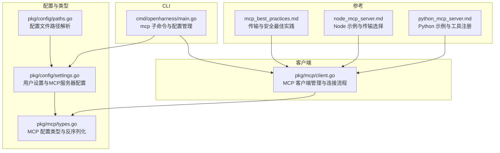
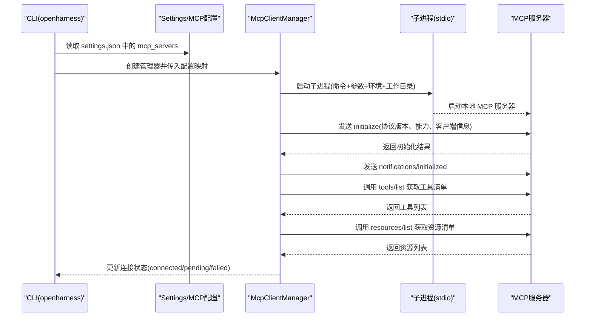
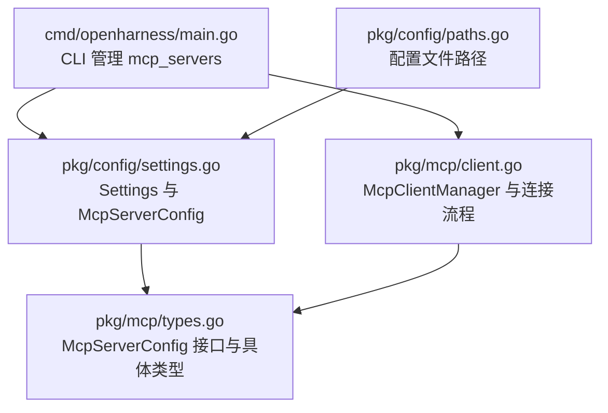

# MCP 服务器配置

<cite>
**本文引用的文件**
- [types.go](file://pkg/mcp/types.go)
- [client.go](file://pkg/mcp/client.go)
- [settings.go](file://pkg/config/settings.go)
- [paths.go](file://pkg/config/paths.go)
- [main.go](file://cmd/openharness/main.go)
- [mcp_best_practices.md](file://plugins/anthropic/skills/mcp-builder/reference/mcp_best_practices.md)
- [node_mcp_server.md](file://plugins/anthropic/skills/mcp-builder/reference/node_mcp_server.md)
- [python_mcp_server.md](file://plugins/anthropic/skills/mcp-builder/reference/python_mcp_server.md)
</cite>

## 目录
1. [简介](#简介)
2. [项目结构](#项目结构)
3. [核心组件](#核心组件)
4. [架构总览](#架构总览)
5. [详细组件分析](#详细组件分析)
6. [依赖关系分析](#依赖关系分析)
7. [性能考虑](#性能考虑)
8. [故障排查指南](#故障排查指南)
9. [结论](#结论)
10. [附录](#附录)

## 简介
本指南面向开发者与运维人员，提供在本仓库中使用 MCP（模型上下文协议）服务器的完整配置与运行指南。重点覆盖以下方面：
- McpServerConfig 及其子类型（stdio/http/ws）的配置项与语义
- McpStdioServerConfig 的命令行参数、工作目录与环境变量设置
- 服务器发现与连接流程：初始化参数、协议版本协商、能力声明
- 不同传输类型的配置示例与最佳实践
- 健康检查、重连与故障恢复策略
- 自定义 MCP 服务器的配置模板与调试方法

## 项目结构
与 MCP 配置直接相关的模块主要分布在以下位置：
- 协议与配置类型定义：pkg/mcp/types.go
- 客户端连接与管理：pkg/mcp/client.go
- 用户配置与持久化：pkg/config/settings.go、pkg/config/paths.go
- CLI 管理命令：cmd/openharness/main.go
- 参考实现与最佳实践：plugins/anthropic/skills/mcp-builder/reference/*.md

**图表来源**
- [types.go:1-134](file://pkg/mcp/types.go#L1-L134)
- [client.go:1-440](file://pkg/mcp/client.go#L1-L440)
- [settings.go:1-212](file://pkg/config/settings.go#L1-L212)
- [paths.go:1-75](file://pkg/config/paths.go#L1-L75)
- [main.go:165-232](file://cmd/openharness/main.go#L165-L232)
- [mcp_best_practices.md:108-164](file://plugins/anthropic/skills/mcp-builder/reference/mcp_best_practices.md#L108-L164)
- [node_mcp_server.md:584-756](file://plugins/anthropic/skills/mcp-builder/reference/node_mcp_server.md#L584-L756)
- [python_mcp_server.md:1-200](file://plugins/anthropic/skills/mcp-builder/reference/python_mcp_server.md#L1-L200)

**章节来源**
- [types.go:1-134](file://pkg/mcp/types.go#L1-L134)
- [client.go:1-440](file://pkg/mcp/client.go#L1-L440)
- [settings.go:1-212](file://pkg/config/settings.go#L1-L212)
- [paths.go:1-75](file://pkg/config/paths.go#L1-L75)
- [main.go:165-232](file://cmd/openharness/main.go#L165-L232)

## 核心组件
本节概述 MCP 配置与连接的核心构件及其职责。

- 配置类型与反序列化
  - McpServerConfig 接口：统一的传输类型标识
  - McpStdioServerConfig：本地子进程通信（stdio）
  - McpHttpServerConfig：HTTP 传输
  - McpWebSocketServerConfig：WebSocket 传输
  - UnmarshalServerConfig：根据 type 字段反序列化为具体配置

- 客户端管理
  - McpClientManager：维护多服务器连接、状态与工具/资源清单
  - 连接流程：启动子进程、发送 initialize 与 initialized、查询 tools/resources、更新状态

- 用户配置
  - Settings：包含 mcp_servers 映射，键为服务器名称，值为 McpServerConfig
  - 配置文件路径：GetConfigFilePath 返回 settings.json 路径

- CLI 管理
  - openharness mcp list/add/remove：对 mcp_servers 进行增删查改

**章节来源**
- [types.go:13-88](file://pkg/mcp/types.go#L13-L88)
- [client.go:116-148](file://pkg/mcp/client.go#L116-L148)
- [settings.go:86-125](file://pkg/config/settings.go#L86-L125)
- [paths.go:20-23](file://pkg/config/paths.go#L20-L23)
- [main.go:165-232](file://cmd/openharness/main.go#L165-L232)

## 架构总览
下图展示了从配置到连接的总体流程，以及各组件之间的交互。

**图表来源**
- [client.go:296-373](file://pkg/mcp/client.go#L296-L373)
- [client.go:375-427](file://pkg/mcp/client.go#L375-L427)
- [settings.go:114-114](file://pkg/config/settings.go#L114-L114)

**章节来源**
- [client.go:134-148](file://pkg/mcp/client.go#L134-L148)
- [client.go:296-373](file://pkg/mcp/client.go#L296-L373)
- [client.go:375-427](file://pkg/mcp/client.go#L375-L427)

## 详细组件分析

### 配置类型与字段详解
- McpStdioServerConfig
  - type: 固定为 "stdio"
  - command: 服务器可执行文件路径或命令
  - args: 参数数组
  - env: 环境变量映射（合并至系统环境）
  - cwd: 工作目录（可选）

- McpHttpServerConfig
  - type: 固定为 "http"
  - url: 服务器地址
  - headers: 请求头映射

- McpWebSocketServerConfig
  - type: 固定为 "ws"
  - url: WebSocket 地址
  - headers: 连接头映射

- 反序列化行为
  - UnmarshalServerConfig 根据 type 字段选择对应结构体
  - 对于缺失字段（如 http/ws 的 headers），会进行默认初始化

- 运行时状态
  - ConnectionState：connected/failed/pending/disabled
  - McpConnectionStatus：包含服务器名称、状态、传输类型、工具与资源清单等

**章节来源**
- [types.go:19-46](file://pkg/mcp/types.go#L19-L46)
- [types.go:48-88](file://pkg/mcp/types.go#L48-L88)
- [types.go:114-133](file://pkg/mcp/types.go#L114-L133)

### McpStdioServerConfig 的命令行参数、工作目录与环境变量
- 命令行参数
  - args 数组按顺序传递给 command
  - 若未提供，将使用空数组作为默认值

- 工作目录
  - cwd 指定子进程的工作目录；若未提供则使用当前工作目录

- 环境变量
  - 合并系统环境与配置中的 env
  - 配置中的键值对优先级高于系统环境

- 子进程生命周期
  - 启动后通过 stdin/stdout 进行 JSON-RPC 通信
  - stderr 被丢弃，避免阻塞

**章节来源**
- [types.go:63-66](file://pkg/mcp/types.go#L63-L66)
- [client.go:296-318](file://pkg/mcp/client.go#L296-L318)
- [client.go:324-328](file://pkg/mcp/client.go#L324-L328)

### 服务器发现与连接建立流程
- 初始化参数
  - protocolVersion：固定为 "2024-11-05"
  - capabilities：空对象（表示当前未声明特定能力）
  - clientInfo：包含 name 与 version

- 协议版本协商
  - 客户端发送 initialize 并期望服务器返回确认
  - 版本不匹配可能导致连接失败

- 能力声明
  - 当前实现未声明额外能力（capabilities 为空）
  - 可扩展为声明工具/资源能力

- 连接状态更新
  - 成功：connected，并填充工具与资源清单
  - 失败：failed，并记录错误详情
  - 其他传输类型：pending（尚未实现）

**章节来源**
- [client.go:330-343](file://pkg/mcp/client.go#L330-L343)
- [client.go:345-351](file://pkg/mcp/client.go#L345-L351)
- [client.go:353-372](file://pkg/mcp/client.go#L353-L372)

### 不同传输类型的配置示例与最佳实践
- stdio（本地子进程）
  - 适用场景：本地开发、桌面应用、单用户场景
  - 注意：服务器不应向 stdout 输出日志，应使用 stderr
  - 参考：Node/Python 示例均支持 stdio 传输

- Streamable HTTP（远程服务）
  - 适用场景：多客户端、云部署、Web 应用集成
  - 特性：双向通信、可通知、可部署为 Web 服务
  - 参考：Node 示例展示如何基于 Express 提供 /mcp 接口

- WebSocket（实时双向）
  - 类型：ws
  - 适用场景：需要实时推送或浏览器端直连
  - 注意：需正确设置 headers 与 URL

- 传输选择建议
  - 单客户端、本地：stdio
  - 多客户端、远程：Streamable HTTP
  - 实时需求：WebSocket

**章节来源**
- [mcp_best_practices.md:108-164](file://plugins/anthropic/skills/mcp-builder/reference/mcp_best_practices.md#L108-L164)
- [node_mcp_server.md:817-858](file://plugins/anthropic/skills/mcp-builder/reference/node_mcp_server.md#L817-L858)
- [types.go:39-46](file://pkg/mcp/types.go#L39-L46)

### 健康检查、重连机制与故障恢复
- 健康检查
  - 连接成功后，客户端会拉取工具与资源清单，作为“健康”信号
  - 状态可通过 ListStatuses 获取，包含 state、detail、transport 等

- 重连机制
  - 当前实现仅在 ConnectAll 时尝试连接非 stdio 服务器，标记为 pending
  - stdio 服务器在失败时会关闭子进程并上报 failed
  - 未实现自动重连循环；可在上层业务逻辑中周期性调用 ConnectAll

- 故障恢复策略
  - 记录失败原因（err.Error）并保持状态为 failed
  - 修复配置后重新启动进程或重启客户端
  - 对于 stdio，确保命令可执行、参数正确、环境变量可用

**章节来源**
- [client.go:134-148](file://pkg/mcp/client.go#L134-L148)
- [client.go:140-142](file://pkg/mcp/client.go#L140-L142)
- [client.go:277-294](file://pkg/mcp/client.go#L277-L294)

### 自定义 MCP 服务器的配置模板与调试方法
- 配置模板（settings.json）
  - 结构要点：mcp_servers 映射，键为服务器名称，值包含 command、args、env
  - 文件路径：由 GetConfigFilePath 决定，默认位于用户主目录下的 .openharness/settings.json

- 调试方法
  - 使用 CLI 列出/添加/删除 MCP 服务器配置
  - 观察连接状态：connected/failed/pending
  - 检查子进程是否正常启动、stderr 是否有异常输出
  - 确认服务器实现是否正确处理 initialize 与 tools/resources 请求

- 参考实现
  - Node 示例：支持 stdio 与 Streamable HTTP 两种传输方式
  - Python 示例：使用 FastMCP 注册工具与资源，提供输入验证与响应格式

**章节来源**
- [settings.go:114-114](file://pkg/config/settings.go#L114-L114)
- [paths.go:20-23](file://pkg/config/paths.go#L20-L23)
- [main.go:165-232](file://cmd/openharness/main.go#L165-L232)
- [node_mcp_server.md:584-756](file://plugins/anthropic/skills/mcp-builder/reference/node_mcp_server.md#L584-L756)
- [python_mcp_server.md:1-200](file://plugins/anthropic/skills/mcp-builder/reference/python_mcp_server.md#L1-L200)

## 依赖关系分析
MCP 配置与连接涉及的主要依赖如下：

**图表来源**
- [main.go:165-232](file://cmd/openharness/main.go#L165-L232)
- [settings.go:86-125](file://pkg/config/settings.go#L86-L125)
- [types.go:13-46](file://pkg/mcp/types.go#L13-L46)
- [client.go:116-148](file://pkg/mcp/client.go#L116-L148)
- [paths.go:20-23](file://pkg/config/paths.go#L20-L23)

**章节来源**
- [main.go:165-232](file://cmd/openharness/main.go#L165-L232)
- [settings.go:86-125](file://pkg/config/settings.go#L86-L125)
- [types.go:13-46](file://pkg/mcp/types.go#L13-L46)
- [client.go:116-148](file://pkg/mcp/client.go#L116-L148)
- [paths.go:20-23](file://pkg/config/paths.go#L20-L23)

## 性能考虑
- 子进程 I/O
  - stdio 采用缓冲读取，避免阻塞；stderr 被丢弃以减少阻塞风险
- 连接并发
  - 当前实现为串行请求/响应；生产环境可引入请求 ID 解复用
- 资源清理
  - 连接失败或关闭时，及时释放子进程与管道资源
- 传输选择
  - 多客户端场景优先选择 Streamable HTTP，减少进程数量与上下文切换

[本节为通用指导，无需列出具体文件来源]

## 故障排查指南
- 常见问题与定位
  - 子进程无法启动：检查 command 是否存在、args 是否正确、cwd 是否有效
  - 初始化失败：核对 protocolVersion 与服务器实现是否一致
  - 工具/资源列表为空：确认服务器已正确注册工具与资源
  - 连接状态为 pending：当前非 stdio 传输类型尚未实现

- 建议步骤
  - 使用 openharness mcp list 查看配置
  - 使用 openharness mcp add/remove 修改配置
  - 查看连接状态：connected/failed/pending
  - 检查服务器日志（stderr）与网络连通性（HTTP/WebSocket）

**章节来源**
- [client.go:134-148](file://pkg/mcp/client.go#L134-L148)
- [client.go:140-142](file://pkg/mcp/client.go#L140-L142)
- [client.go:277-294](file://pkg/mcp/client.go#L277-L294)

## 结论
本指南基于仓库中的类型定义、客户端实现与 CLI 管理功能，提供了 MCP 服务器配置的系统性说明。通过合理设置 McpStdioServerConfig 的命令、参数、工作目录与环境变量，结合正确的初始化与能力声明流程，可以稳定地完成服务器发现与连接。对于多客户端与远程部署场景，推荐使用 Streamable HTTP 或 WebSocket 传输，并遵循安全与最佳实践文档中的建议。

[本节为总结性内容，无需列出具体文件来源]

## 附录

### 配置字段速查表
- McpStdioServerConfig
  - type: "stdio"
  - command: 字符串
  - args: 字符串数组
  - env: 键值对映射
  - cwd: 字符串（可选）

- McpHttpServerConfig
  - type: "http"
  - url: 字符串
  - headers: 键值对映射

- McpWebSocketServerConfig
  - type: "ws"
  - url: 字符串
  - headers: 键值对映射

**章节来源**
- [types.go:19-46](file://pkg/mcp/types.go#L19-L46)

### CLI 管理命令
- 列出 MCP 服务器：openharness mcp list
- 添加 MCP 服务器：openharness mcp add [name] [command] [args...]
- 删除 MCP 服务器：openharness mcp remove [name]

**章节来源**
- [main.go:165-232](file://cmd/openharness/main.go#L165-L232)

### 参考实现与最佳实践
- 传输与安全最佳实践：参见 mcp_best_practices.md
- Node MCP 服务器示例：参见 node_mcp_server.md
- Python MCP 服务器示例：参见 python_mcp_server.md

**章节来源**
- [mcp_best_practices.md:108-164](file://plugins/anthropic/skills/mcp-builder/reference/mcp_best_practices.md#L108-L164)
- [node_mcp_server.md:584-756](file://plugins/anthropic/skills/mcp-builder/reference/node_mcp_server.md#L584-L756)
- [python_mcp_server.md:1-200](file://plugins/anthropic/skills/mcp-builder/reference/python_mcp_server.md#L1-L200)