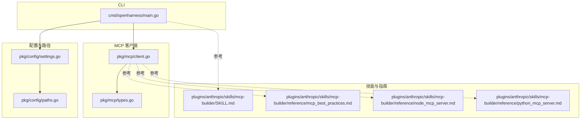
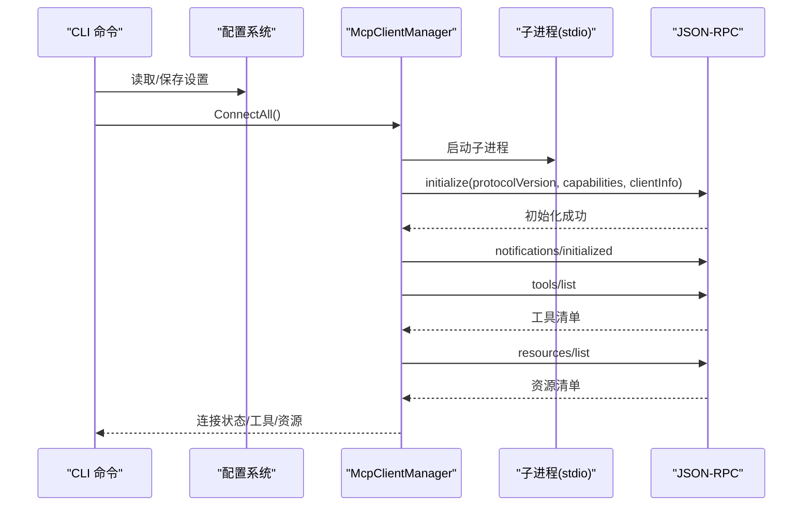
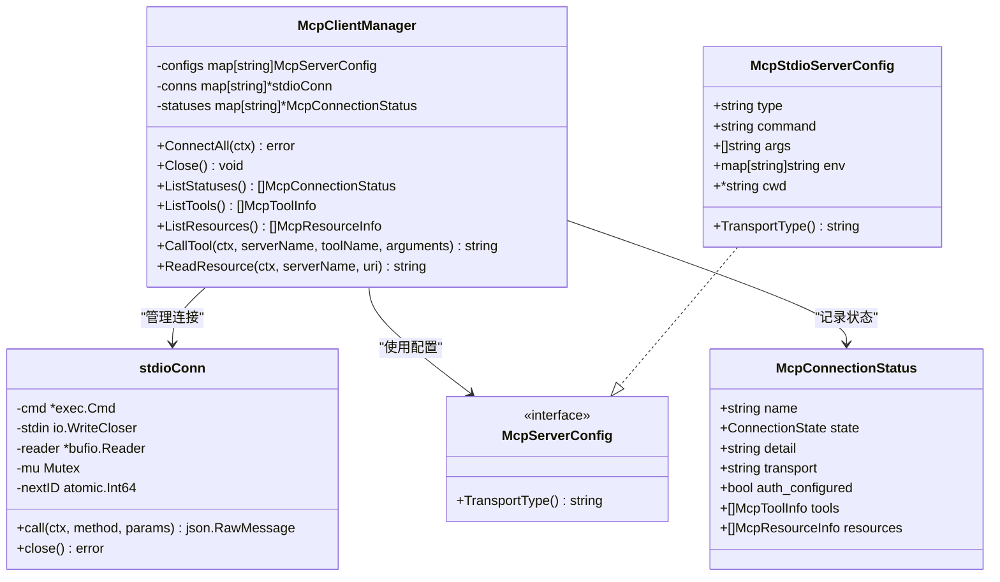
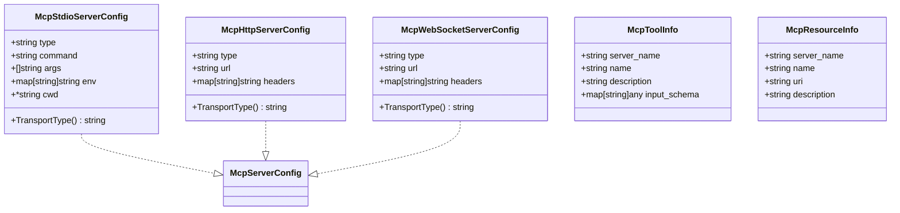
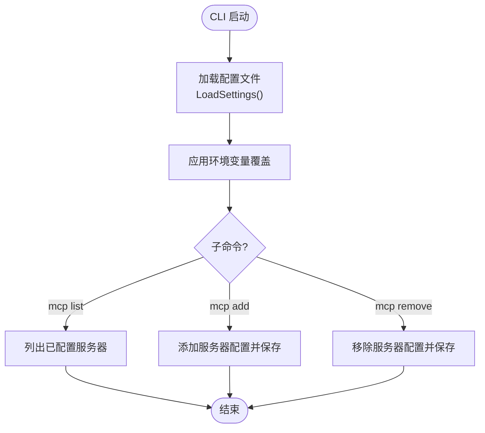
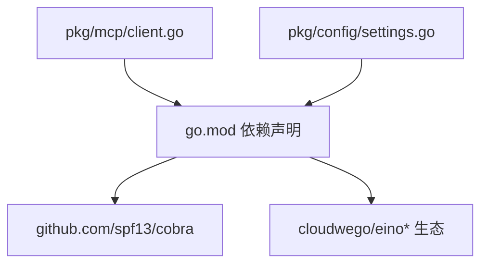
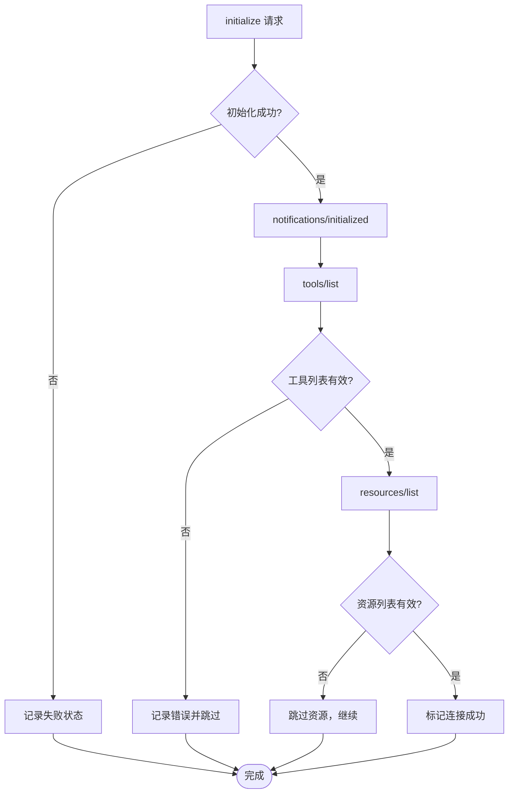

# MCP 服务器集成

<cite>
**本文档引用的文件**
- [pkg/mcp/client.go](file://pkg/mcp/client.go)
- [pkg/mcp/types.go](file://pkg/mcp/types.go)
- [cmd/openharness/main.go](file://cmd/openharness/main.go)
- [pkg/config/settings.go](file://pkg/config/settings.go)
- [pkg/config/paths.go](file://pkg/config/paths.go)
- [plugins/anthropic/skills/mcp-builder/SKILL.md](file://plugins/anthropic/skills/mcp-builder/SKILL.md)
- [plugins/anthropic/skills/mcp-builder/reference/mcp_best_practices.md](file://plugins/anthropic/skills/mcp-builder/reference/mcp_best_practices.md)
- [plugins/anthropic/skills/mcp-builder/reference/node_mcp_server.md](file://plugins/anthropic/skills/mcp-builder/reference/node_mcp_server.md)
- [plugins/anthropic/skills/mcp-builder/reference/python_mcp_server.md](file://plugins/anthropic/skills/mcp-builder/reference/python_mcp_server.md)
- [go.mod](file://go.mod)
- [design/Human-In-The-Loop.md](file://design/Human-In-The-Loop.md)
- [design/TASK.md](file://design/TASK.md)
</cite>

## 目录
1. [简介](#简介)
2. [项目结构](#项目结构)
3. [核心组件](#核心组件)
4. [架构总览](#架构总览)
5. [详细组件分析](#详细组件分析)
6. [依赖关系分析](#依赖关系分析)
7. [性能考量](#性能考量)
8. [故障排除指南](#故障排除指南)
9. [结论](#结论)
10. [附录](#附录)

## 简介
本文件面向 MCP（多方计算协议）服务器集成，围绕开源项目 openharness-go 提供系统化技术文档。内容涵盖：
- MCP 协议概念、标准规范与应用场景
- MCP 客户端实现细节、连接管理与消息处理机制
- MCP 服务器配置与部署指南（含服务发现、认证与通信协议）
- 外部工具与服务的集成方法与最佳实践
- 故障排除、性能监控与安全考虑
- 开发者自定义 MCP 服务器的开发与扩展实践

## 项目结构
本项目采用模块化组织方式，MCP 客户端与类型定义位于 pkg/mcp；配置与路径管理位于 pkg/config；CLI 入口位于 cmd/openharness；技能与 MCP 服务器开发指南位于 plugins/anthropic/skills/mcp-builder。

**图表来源**
- [cmd/openharness/main.go:15-102](file://cmd/openharness/main.go#L15-L102)
- [pkg/mcp/client.go:116-148](file://pkg/mcp/client.go#L116-L148)
- [pkg/mcp/types.go:13-46](file://pkg/mcp/types.go#L13-L46)
- [pkg/config/settings.go:97-125](file://pkg/config/settings.go#L97-L125)
- [pkg/config/paths.go:8-23](file://pkg/config/paths.go#L8-L23)

**章节来源**
- [cmd/openharness/main.go:15-102](file://cmd/openharness/main.go#L15-L102)
- [pkg/mcp/client.go:116-148](file://pkg/mcp/client.go#L116-L148)
- [pkg/mcp/types.go:13-46](file://pkg/mcp/types.go#L13-L46)
- [pkg/config/settings.go:97-125](file://pkg/config/settings.go#L97-L125)
- [pkg/config/paths.go:8-23](file://pkg/config/paths.go#L8-L23)

## 核心组件
- MCP 客户端管理器：负责连接多个 MCP 服务器、维护连接状态、列举工具与资源、调用工具与读取资源。
- MCP 类型系统：统一描述服务器配置（stdio/http/ws）、连接状态、工具与资源信息。
- CLI 子命令：提供 MCP 服务器的增删查操作，便于本地开发与调试。
- 配置系统：集中管理 API 密钥、模型参数、权限策略、MCP 服务器清单等。

**章节来源**
- [pkg/mcp/client.go:116-182](file://pkg/mcp/client.go#L116-L182)
- [pkg/mcp/types.go:13-133](file://pkg/mcp/types.go#L13-L133)
- [cmd/openharness/main.go:165-231](file://cmd/openharness/main.go#L165-L231)
- [pkg/config/settings.go:97-125](file://pkg/config/settings.go#L97-L125)

## 架构总览
MCP 客户端通过 JSON-RPC over stdio 与外部 MCP 服务器交互，遵循初始化、通知、工具与资源列举的协议流程。CLI 提供 MCP 服务器的配置与管理能力，配置文件由 pkg/config 管理。

**图表来源**
- [pkg/mcp/client.go:296-373](file://pkg/mcp/client.go#L296-L373)
- [pkg/mcp/client.go:375-427](file://pkg/mcp/client.go#L375-L427)
- [cmd/openharness/main.go:165-231](file://cmd/openharness/main.go#L165-L231)

**章节来源**
- [pkg/mcp/client.go:296-373](file://pkg/mcp/client.go#L296-L373)
- [pkg/mcp/client.go:375-427](file://pkg/mcp/client.go#L375-L427)
- [cmd/openharness/main.go:165-231](file://cmd/openharness/main.go#L165-L231)

## 详细组件分析

### MCP 客户端管理器
- 连接管理：按配置启动子进程，建立 stdio 通道，串行发送 JSON-RPC 请求。
- 协议交互：执行 initialize 与 notifications/initialized，随后列举 tools 与 resources。
- 状态聚合：汇总连接状态、工具清单与资源清单，支持查询与展示。
- 工具调用与资源读取：封装 tools/call 与 resources/read，解析返回内容。

**图表来源**
- [pkg/mcp/client.go:116-132](file://pkg/mcp/client.go#L116-L132)
- [pkg/mcp/client.go:46-52](file://pkg/mcp/client.go#L46-L52)
- [pkg/mcp/types.go:13-46](file://pkg/mcp/types.go#L13-L46)
- [pkg/mcp/types.go:124-133](file://pkg/mcp/types.go#L124-L133)

**章节来源**
- [pkg/mcp/client.go:116-182](file://pkg/mcp/client.go#L116-L182)
- [pkg/mcp/client.go:296-373](file://pkg/mcp/client.go#L296-L373)
- [pkg/mcp/types.go:13-46](file://pkg/mcp/types.go#L13-L46)
- [pkg/mcp/types.go:124-133](file://pkg/mcp/types.go#L124-L133)

### MCP 类型系统
- 配置类型：McpStdioServerConfig、McpHttpServerConfig、McpWebSocketServerConfig，均实现 TransportType 接口。
- 运行时状态：McpConnectionStatus 记录连接名、状态、传输方式、认证配置、工具与资源清单。
- 工具与资源信息：McpToolInfo、McpResourceInfo 描述远端暴露的能力与资源。

**图表来源**
- [pkg/mcp/types.go:13-46](file://pkg/mcp/types.go#L13-L46)
- [pkg/mcp/types.go:94-108](file://pkg/mcp/types.go#L94-L108)
- [pkg/mcp/types.go:102-108](file://pkg/mcp/types.go#L102-L108)

**章节来源**
- [pkg/mcp/types.go:13-46](file://pkg/mcp/types.go#L13-L46)
- [pkg/mcp/types.go:94-108](file://pkg/mcp/types.go#L94-L108)
- [pkg/mcp/types.go:102-108](file://pkg/mcp/types.go#L102-L108)

### CLI 与 MCP 管理
- 子命令：mcp list/add/remove 提供 MCP 服务器的查看、添加与删除。
- 配置持久化：settings.json 位于用户配置目录，路径由 GetConfigFilePath 决定。
- 环境变量覆盖：支持通过环境变量覆盖模型、基础地址等配置项。

**图表来源**
- [cmd/openharness/main.go:165-231](file://cmd/openharness/main.go#L165-L231)
- [pkg/config/settings.go:160-195](file://pkg/config/settings.go#L160-L195)
- [pkg/config/paths.go:20-23](file://pkg/config/paths.go#L20-L23)

**章节来源**
- [cmd/openharness/main.go:165-231](file://cmd/openharness/main.go#L165-L231)
- [pkg/config/settings.go:160-195](file://pkg/config/settings.go#L160-L195)
- [pkg/config/paths.go:20-23](file://pkg/config/paths.go#L20-L23)

### MCP 服务器开发与最佳实践
- 概念与流程：指南提供了 MCP 服务器开发的四个阶段（研究规划、实现、评审测试、评估）。
- 传输选择：推荐根据场景选择 stdio（本地）或 Streamable HTTP（远程）。
- 安全与认证：建议使用 OAuth 2.1 或 API Key，并在启动时进行校验。
- TypeScript/Python 实现：提供 SDK 使用、工具注册、输入校验、响应格式与分页等最佳实践。

**章节来源**
- [plugins/anthropic/skills/mcp-builder/SKILL.md:1-237](file://plugins/anthropic/skills/mcp-builder/SKILL.md#L1-L237)
- [plugins/anthropic/skills/mcp-builder/reference/mcp_best_practices.md:108-164](file://plugins/anthropic/skills/mcp-builder/reference/mcp_best_practices.md#L108-L164)
- [plugins/anthropic/skills/mcp-builder/reference/node_mcp_server.md:1-200](file://plugins/anthropic/skills/mcp-builder/reference/node_mcp_server.md#L1-L200)
- [plugins/anthropic/skills/mcp-builder/reference/python_mcp_server.md:1-200](file://plugins/anthropic/skills/mcp-builder/reference/python_mcp_server.md#L1-L200)

## 依赖关系分析
- 外部依赖：CLI 框架 cobra；JSON 解析与高性能序列化库；云雀 eino 生态用于智能体与对话引擎。
- MCP 客户端依赖：os/exec 启动子进程；bufio 读取 stdout；sync 控制并发与互斥。
- 配置系统依赖：标准库 os、path/filepath；JSON 序列化。

**图表来源**
- [go.mod:5-42](file://go.mod#L5-L42)
- [pkg/mcp/client.go:3-13](file://pkg/mcp/client.go#L3-L13)
- [pkg/config/settings.go:3-8](file://pkg/config/settings.go#L3-L8)

**章节来源**
- [go.mod:5-42](file://go.mod#L5-L42)
- [pkg/mcp/client.go:3-13](file://pkg/mcp/client.go#L3-L13)
- [pkg/config/settings.go:3-8](file://pkg/config/settings.go#L3-L8)

## 性能考量
- 连接与并发：stdioConn 使用互斥锁保证写入顺序，避免竞争；连接池按名称维护，避免重复创建。
- I/O 优化：bufio.Reader 读取 stdout，减少系统调用次数；丢弃 stderr 避免阻塞。
- 资源管理：连接关闭时主动终止子进程，释放系统资源。
- 配置加载：配置文件采用延迟加载与环境变量覆盖，减少不必要的 IO。

**章节来源**
- [pkg/mcp/client.go:46-52](file://pkg/mcp/client.go#L46-L52)
- [pkg/mcp/client.go:107-110](file://pkg/mcp/client.go#L107-L110)
- [pkg/mcp/client.go:317-318](file://pkg/mcp/client.go#L317-L318)
- [pkg/config/settings.go:160-195](file://pkg/config/settings.go#L160-L195)

## 故障排除指南
- 进程启动失败：检查命令路径、工作目录与环境变量合并是否正确。
- 初始化失败：确认 protocolVersion、capabilities 与 clientInfo 是否符合预期。
- 工具/资源列举失败：检查远端服务器是否实现对应接口；必要时降级处理并记录错误。
- 连接断开：确认子进程存活状态；在关闭时显式终止进程。
- 配置读取失败：核对配置文件路径与权限；确保 JSON 格式有效。

**章节来源**
- [pkg/mcp/client.go:296-343](file://pkg/mcp/client.go#L296-L343)
- [pkg/mcp/client.go:353-373](file://pkg/mcp/client.go#L353-L373)
- [pkg/config/paths.go:20-23](file://pkg/config/paths.go#L20-L23)

## 结论
本项目提供了 MCP 客户端的核心实现与 CLI 管理能力，结合配置系统与技能开发指南，能够支撑本地与远程 MCP 服务器的集成。通过标准化的连接管理、协议交互与状态聚合，开发者可以快速接入外部工具与服务，提升智能体的上下文能力与自动化水平。

## 附录

### MCP 协议与客户端交互流程

**图表来源**
- [pkg/mcp/client.go:330-373](file://pkg/mcp/client.go#L330-L373)
- [pkg/mcp/client.go:375-427](file://pkg/mcp/client.go#L375-L427)

### MCP 服务器开发参考
- 传输选择：根据部署场景选择 stdio 或 Streamable HTTP。
- 安全与认证：使用 OAuth 2.1 或 API Key，并在启动时校验。
- 输入校验：TypeScript 使用 Zod，Python 使用 Pydantic。
- 响应格式：支持 Markdown 与 JSON，便于人类阅读与机器处理。

**章节来源**
- [plugins/anthropic/skills/mcp-builder/reference/mcp_best_practices.md:108-164](file://plugins/anthropic/skills/mcp-builder/reference/mcp_best_practices.md#L108-L164)
- [plugins/anthropic/skills/mcp-builder/reference/node_mcp_server.md:1-200](file://plugins/anthropic/skills/mcp-builder/reference/node_mcp_server.md#L1-L200)
- [plugins/anthropic/skills/mcp-builder/reference/python_mcp_server.md:1-200](file://plugins/anthropic/skills/mcp-builder/reference/python_mcp_server.md#L1-L200)