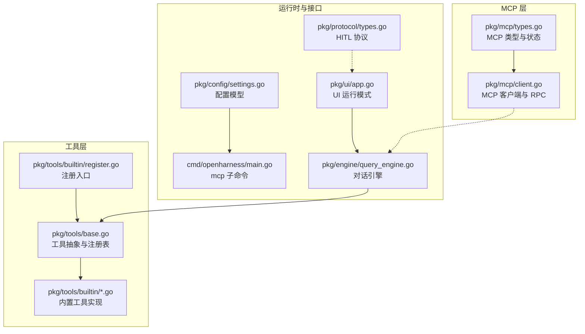
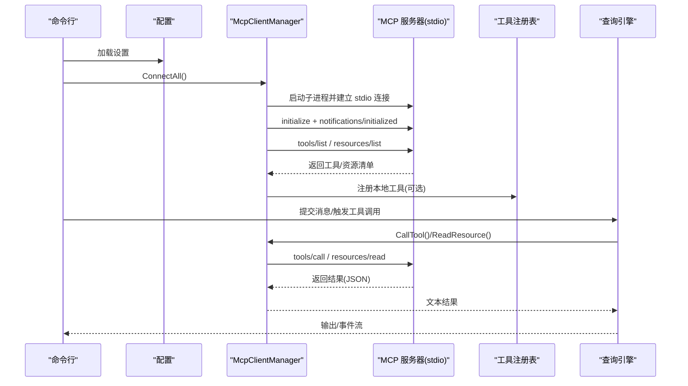
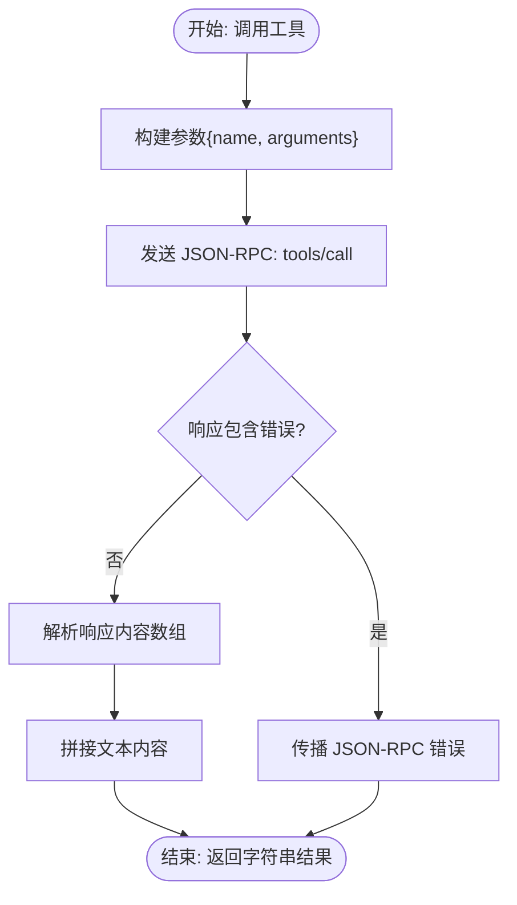
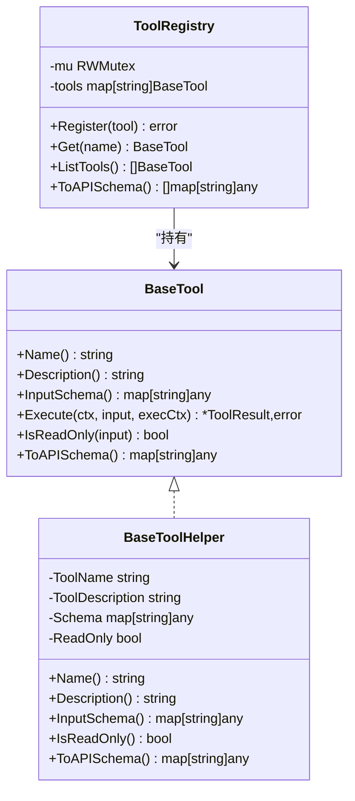
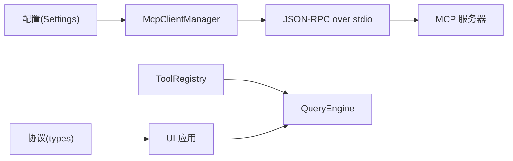

# 工具和资源集成

<cite>
**本文引用的文件**
- [pkg/mcp/types.go](file://pkg/mcp/types.go)
- [pkg/mcp/client.go](file://pkg/mcp/client.go)
- [pkg/tools/base.go](file://pkg/tools/base.go)
- [pkg/tools/builtin/register.go](file://pkg/tools/builtin/register.go)
- [pkg/tools/builtin/bash.go](file://pkg/tools/builtin/bash.go)
- [pkg/tools/builtin/file_read.go](file://pkg/tools/builtin/file_read.go)
- [pkg/tools/builtin/file_write.go](file://pkg/tools/builtin/file_write.go)
- [pkg/tools/builtin/grep.go](file://pkg/tools/builtin/grep.go)
- [pkg/tools/builtin/skill.go](file://pkg/tools/builtin/skill.go)
- [pkg/protocol/types.go](file://pkg/protocol/types.go)
- [cmd/openharness/main.go](file://cmd/openharness/main.go)
- [pkg/config/settings.go](file://pkg/config/settings.go)
- [pkg/ui/app.go](file://pkg/ui/app.go)
- [pkg/engine/query_engine.go](file://pkg/engine/query_engine.go)
</cite>

## 目录
1. [简介](#简介)
2. [项目结构](#项目结构)
3. [核心组件](#核心组件)
4. [架构总览](#架构总览)
5. [详细组件分析](#详细组件分析)
6. [依赖分析](#依赖分析)
7. [性能考量](#性能考量)
8. [故障排查指南](#故障排查指南)
9. [结论](#结论)
10. [附录](#附录)

## 简介
本技术文档聚焦于 MCP（模型上下文协议）在本项目中的工具与资源集成方案，围绕以下目标展开：
- 工具调用机制：tools/call 的参数格式、返回值处理与错误传播
- 资源读取功能：resources/read 的 URI 规范、内容格式与缓存策略
- 工具与服务发现：tools/list 与 resources/list 的响应格式与元数据管理
- 最佳实践：输入验证、输出格式化与安全考虑
- 自定义开发指南：如何实现自定义工具与资源提供者

## 项目结构
本项目采用分层与按功能模块组织的结构。与 MCP 集成直接相关的模块包括：
- MCP 客户端与类型：pkg/mcp
- 内置工具与注册：pkg/tools/builtin
- 工具抽象与注册表：pkg/tools/base.go
- 配置与命令行：pkg/config、cmd/openharness
- UI 与引擎：pkg/ui、pkg/engine
- 人机交互协议：pkg/protocol

图表来源
- [pkg/mcp/types.go:1-134](file://pkg/mcp/types.go#L1-L134)
- [pkg/mcp/client.go:1-440](file://pkg/mcp/client.go#L1-L440)
- [pkg/tools/base.go:1-132](file://pkg/tools/base.go#L1-L132)
- [pkg/tools/builtin/register.go:1-30](file://pkg/tools/builtin/register.go#L1-L30)
- [pkg/config/settings.go:1-212](file://pkg/config/settings.go#L1-L212)
- [cmd/openharness/main.go:165-231](file://cmd/openharness/main.go#L165-L231)
- [pkg/ui/app.go:1-238](file://pkg/ui/app.go#L1-L238)
- [pkg/engine/query_engine.go:1-247](file://pkg/engine/query_engine.go#L1-L247)
- [pkg/protocol/types.go:1-102](file://pkg/protocol/types.go#L1-L102)

章节来源
- [pkg/mcp/types.go:1-134](file://pkg/mcp/types.go#L1-L134)
- [pkg/mcp/client.go:1-440](file://pkg/mcp/client.go#L1-L440)
- [pkg/tools/base.go:1-132](file://pkg/tools/base.go#L1-L132)
- [pkg/tools/builtin/register.go:1-30](file://pkg/tools/builtin/register.go#L1-L30)
- [pkg/config/settings.go:1-212](file://pkg/config/settings.go#L1-L212)
- [cmd/openharness/main.go:165-231](file://cmd/openharness/main.go#L165-L231)
- [pkg/ui/app.go:1-238](file://pkg/ui/app.go#L1-L238)
- [pkg/engine/query_engine.go:1-247](file://pkg/engine/query_engine.go#L1-L247)
- [pkg/protocol/types.go:1-102](file://pkg/protocol/types.go#L1-L102)

## 核心组件
- MCP 客户端与连接管理：负责初始化、列举工具与资源、封装 JSON-RPC 请求与响应，以及工具调用与资源读取的编排。
- MCP 类型与状态：定义服务器配置、工具与资源信息、连接状态等不可变值对象。
- 工具抽象与注册表：统一工具契约、默认实现与注册表，支持并发安全访问。
- 内置工具：提供 Bash、文件读写、Grep、技能加载等常用能力。
- 配置与命令行：提供 MCP 服务器的增删查与持久化配置。
- UI 与引擎：承载工具执行的生命周期事件与输出格式化。

章节来源
- [pkg/mcp/client.go:116-195](file://pkg/mcp/client.go#L116-L195)
- [pkg/mcp/types.go:94-133](file://pkg/mcp/types.go#L94-L133)
- [pkg/tools/base.go:51-131](file://pkg/tools/base.go#L51-L131)
- [pkg/tools/builtin/register.go:7-29](file://pkg/tools/builtin/register.go#L7-L29)
- [pkg/config/settings.go:86-125](file://pkg/config/settings.go#L86-L125)
- [cmd/openharness/main.go:165-231](file://cmd/openharness/main.go#L165-L231)
- [pkg/ui/app.go:18-120](file://pkg/ui/app.go#L18-L120)
- [pkg/engine/query_engine.go:49-122](file://pkg/engine/query_engine.go#L49-L122)

## 架构总览
下图展示 MCP 客户端与工具/资源交互的总体流程，包括初始化、列举、调用与读取的关键步骤。

图表来源
- [pkg/mcp/client.go:136-373](file://pkg/mcp/client.go#L136-L373)
- [pkg/mcp/client.go:375-427](file://pkg/mcp/client.go#L375-L427)
- [pkg/mcp/client.go:198-261](file://pkg/mcp/client.go#L198-L261)
- [pkg/engine/query_engine.go:124-205](file://pkg/engine/query_engine.go#L124-L205)
- [pkg/tools/base.go:82-131](file://pkg/tools/base.go#L82-L131)

## 详细组件分析

### MCP 客户端与工具/资源调用
- 初始化与连接
  - 通过 stdio 启动外部 MCP 服务器进程，发送 initialize 并上报 notifications/initialized。
  - 记录连接状态，包含传输类型、认证状态、工具与资源列表。
- 工具调用（tools/call）
  - 参数：包含工具名与参数对象。
  - 返回：解析 MCP 响应中的内容数组，拼接文本作为最终结果；若解析失败则回退为原始字节串。
  - 错误：JSON-RPC 错误或底层通信错误均向上游传播。
- 资源读取（resources/read）
  - 参数：URI 字符串。
  - 返回：聚合 contents 中的文本字段，拼接为单一字符串；解析失败回退。
- 工具与资源发现
  - tools/list：返回工具名称、描述与输入 Schema。
  - resources/list：返回资源名称、URI 与描述。
  - 元数据：工具与资源信息以不可变值对象形式保存，便于 UI 与引擎消费。

图表来源
- [pkg/mcp/client.go:198-230](file://pkg/mcp/client.go#L198-L230)

章节来源
- [pkg/mcp/client.go:136-195](file://pkg/mcp/client.go#L136-L195)
- [pkg/mcp/client.go:198-261](file://pkg/mcp/client.go#L198-L261)
- [pkg/mcp/client.go:375-427](file://pkg/mcp/client.go#L375-L427)
- [pkg/mcp/types.go:94-108](file://pkg/mcp/types.go#L94-L108)

### 工具抽象与注册表
- BaseTool 接口：定义名称、描述、输入 Schema、执行、只读性与 API Schema 导出。
- BaseToolHelper：提供默认实现，简化工具开发。
- ToolRegistry：线程安全的工具注册与查询容器，支持导出 API Schema。
- 内置工具：通过注册入口集中注册，形成默认工具集。

图表来源
- [pkg/tools/base.go:51-131](file://pkg/tools/base.go#L51-L131)

章节来源
- [pkg/tools/base.go:51-131](file://pkg/tools/base.go#L51-L131)
- [pkg/tools/builtin/register.go:7-29](file://pkg/tools/builtin/register.go#L7-L29)

### 内置工具实现要点
- Bash 工具：支持命令与超时，输出合并标准输出与错误输出，超时与非零退出码转换为错误结果。
- 文件读取工具：支持绝对/相对路径、偏移与行数限制，按行切分后截取范围。
- 文件写入工具：确保父目录存在，覆盖写入，返回写入字节数统计。
- Grep 工具：递归遍历目录，支持通配过滤，正则匹配，限制最大结果数量。
- 技能工具：根据名称从已加载技能映射中提取指令文本，用于向 LLM 提供渐进式披露。

章节来源
- [pkg/tools/builtin/bash.go:55-98](file://pkg/tools/builtin/bash.go#L55-L98)
- [pkg/tools/builtin/file_read.go:59-98](file://pkg/tools/builtin/file_read.go#L59-L98)
- [pkg/tools/builtin/file_write.go:53-79](file://pkg/tools/builtin/file_write.go#L53-L79)
- [pkg/tools/builtin/grep.go:61-140](file://pkg/tools/builtin/grep.go#L61-L140)
- [pkg/tools/builtin/skill.go:54-72](file://pkg/tools/builtin/skill.go#L54-L72)

### 配置与命令行（MCP 服务器管理）
- 配置模型包含 MCP 服务器列表，每项包含命令、参数与环境变量。
- 命令行提供列出、添加、删除 MCP 服务器的子命令，支持持久化到配置文件。

章节来源
- [pkg/config/settings.go:86-125](file://pkg/config/settings.go#L86-L125)
- [cmd/openharness/main.go:165-231](file://cmd/openharness/main.go#L165-L231)

### UI 与引擎（工具执行生命周期）
- UI 支持打印模式、REPL 与 JSON-Lines 模式，输出文本、JSON 或流式 JSON。
- 引擎负责对话历史管理、压缩与成本跟踪，向 UI 发送工具执行开始/完成事件。
- 协议类型定义了前端事件、后端事件与选择请求等，支撑人机交互。

章节来源
- [pkg/ui/app.go:18-120](file://pkg/ui/app.go#L18-L120)
- [pkg/engine/query_engine.go:49-122](file://pkg/engine/query_engine.go#L49-L122)
- [pkg/protocol/types.go:16-66](file://pkg/protocol/types.go#L16-L66)

## 依赖分析
- MCP 客户端依赖 JSON-RPC 2.0 协议与 stdio 传输，负责与外部 MCP 服务器通信。
- 工具层通过注册表统一管理工具，引擎在执行阶段按名称查找并调用。
- 配置驱动 MCP 服务器的启动参数，命令行提供运维能力。
- UI 与协议类型解耦引擎与前端，便于扩展不同交互方式。

图表来源
- [pkg/config/settings.go:86-125](file://pkg/config/settings.go#L86-L125)
- [pkg/mcp/client.go:136-195](file://pkg/mcp/client.go#L136-L195)
- [pkg/tools/base.go:82-131](file://pkg/tools/base.go#L82-L131)
- [pkg/engine/query_engine.go:49-122](file://pkg/engine/query_engine.go#L49-L122)
- [pkg/protocol/types.go:16-66](file://pkg/protocol/types.go#L16-L66)

章节来源
- [pkg/mcp/client.go:136-195](file://pkg/mcp/client.go#L136-L195)
- [pkg/tools/base.go:82-131](file://pkg/tools/base.go#L82-L131)
- [pkg/config/settings.go:86-125](file://pkg/config/settings.go#L86-L125)
- [pkg/protocol/types.go:16-66](file://pkg/protocol/types.go#L16-L66)

## 性能考量
- IO 与序列化
  - stdio 读写采用缓冲行读取，避免阻塞；建议外部 MCP 服务器不要向 stdout 输出日志。
- 结果拼接
  - 工具与资源返回文本通过简单拼接，注意大体量数据时的内存占用与延迟。
- 列表与发现
  - tools/list 与 resources/list 仅在连接成功后拉取一次，后续通过状态缓存复用。
- 超时与取消
  - 工具执行支持上下文取消，避免长时间阻塞；建议为外部工具设置合理超时。

[本节为通用指导，不直接分析具体文件]

## 故障排查指南
- 连接失败
  - 检查 MCP 服务器命令与参数是否正确，确认进程可启动且未被权限限制。
  - 查看连接状态中的传输类型与详细信息。
- 工具调用错误
  - 确认工具名与参数 Schema 匹配；检查 JSON-RPC 错误码与消息。
  - 若返回解析失败，客户端会回退为原始字节串，可用于诊断。
- 资源读取异常
  - 确认 URI 格式与资源提供者支持；检查 contents 数组结构。
- 权限与安全
  - 使用默认权限模式或自定义策略限制工具调用；对外部服务器启用鉴权与最小权限原则。

章节来源
- [pkg/mcp/client.go:136-195](file://pkg/mcp/client.go#L136-L195)
- [pkg/mcp/client.go:198-261](file://pkg/mcp/client.go#L198-L261)
- [pkg/config/settings.go:37-55](file://pkg/config/settings.go#L37-L55)

## 结论
本项目通过 MCP 客户端实现了对多来源工具与资源的统一接入，结合工具注册表与引擎的生命周期管理，提供了可扩展、可观测的工具执行框架。内置工具覆盖常见场景，同时保留了清晰的扩展点，便于开发者实现自定义工具与资源提供者。

[本节为总结，不直接分析具体文件]

## 附录

### 工具调用机制详解（tools/call）
- 参数格式
  - name：目标工具名称
  - arguments：工具期望的参数对象（由工具输入 Schema 描述）
- 返回值处理
  - 解析响应中的内容数组，仅拼接类型为文本的部分
  - 解析失败时回退为原始字节串
- 错误传播
  - JSON-RPC 错误直接返回
  - 通信错误包装后上抛

章节来源
- [pkg/mcp/client.go:198-230](file://pkg/mcp/client.go#L198-L230)

### 资源读取功能详解（resources/read）
- URI 规范
  - 使用字符串 URI 表示资源标识
- 内容格式
  - 返回 contents 数组中的文本字段，按顺序拼接
- 缓存策略
  - 客户端未内置缓存；建议资源提供者实现幂等与缓存控制

章节来源
- [pkg/mcp/client.go:232-261](file://pkg/mcp/client.go#L232-L261)

### 工具与资源发现（tools/list / resources/list）
- 响应格式
  - tools/list：包含 name、description、inputSchema
  - resources/list：包含 name、uri、description
- 元数据管理
  - 工具与资源信息以不可变值对象保存，便于 UI 与引擎消费

章节来源
- [pkg/mcp/client.go:375-427](file://pkg/mcp/client.go#L375-L427)
- [pkg/mcp/types.go:94-108](file://pkg/mcp/types.go#L94-L108)

### 最佳实践
- 输入验证
  - 严格遵循工具输入 Schema；在工具内部进行参数校验与边界检查
- 输出格式化
  - 统一返回文本；必要时在上层进行结构化解析
- 安全考虑
  - 对外部命令与文件操作实施白名单与路径规则
  - 为 MCP 服务器启用鉴权与最小权限

章节来源
- [pkg/tools/builtin/bash.go:55-98](file://pkg/tools/builtin/bash.go#L55-L98)
- [pkg/tools/builtin/file_read.go:59-98](file://pkg/tools/builtin/file_read.go#L59-L98)
- [pkg/tools/builtin/file_write.go:53-79](file://pkg/tools/builtin/file_write.go#L53-L79)
- [pkg/config/settings.go:37-55](file://pkg/config/settings.go#L37-L55)

### 自定义工具开发指南
- 实现 BaseTool 接口或继承 BaseToolHelper
- 在输入 Schema 中明确必填字段与默认值
- 在执行函数中处理上下文取消与错误返回
- 将工具注册到 ToolRegistry

章节来源
- [pkg/tools/base.go:51-131](file://pkg/tools/base.go#L51-L131)
- [pkg/tools/builtin/register.go:7-29](file://pkg/tools/builtin/register.go#L7-L29)

### 自定义资源提供者实现指南
- 依据 MCP 协议规范实现 resources/read 处理逻辑
- 明确 URI 模板与参数，保证幂等与可缓存性
- 在初始化阶段通过 resources/list 暴露资源清单

章节来源
- [pkg/mcp/client.go:375-427](file://pkg/mcp/client.go#L375-L427)