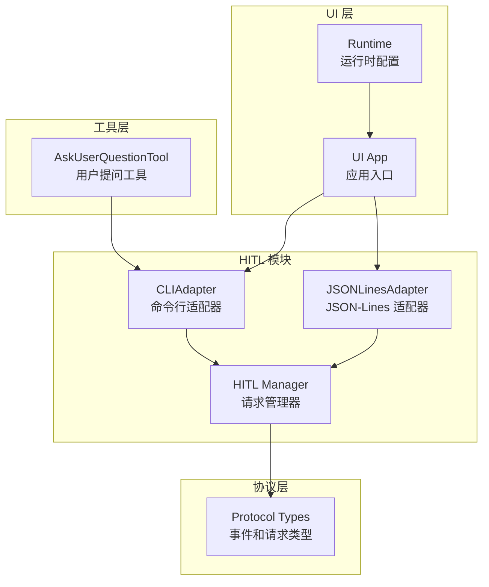
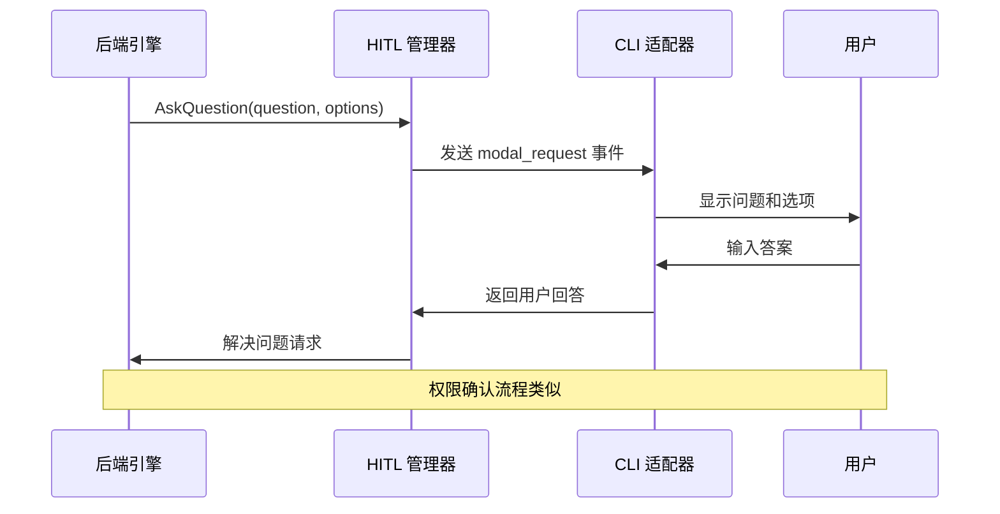
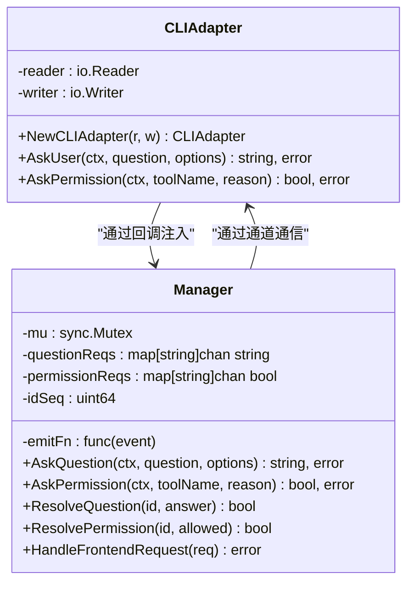
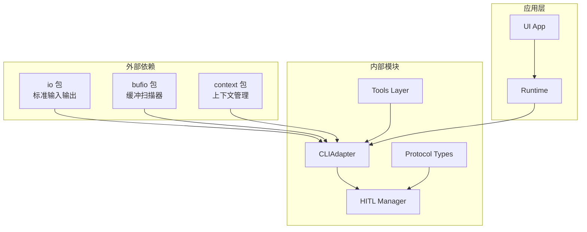
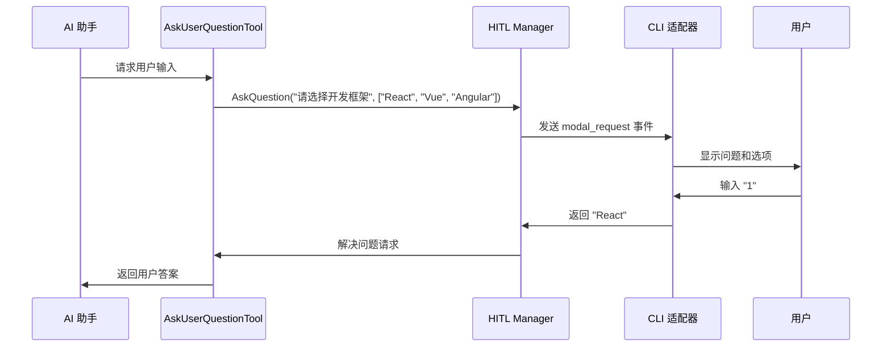
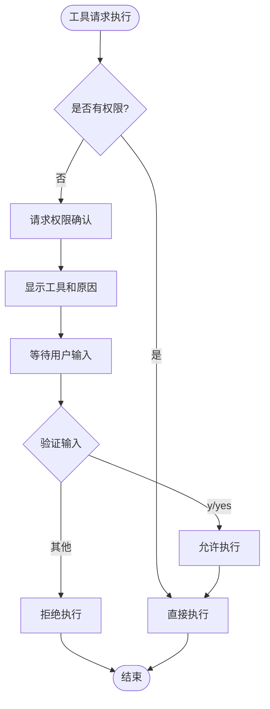

# CLI 适配器

<cite>
**本文档引用的文件**
- [cli_adapter.go](file://pkg/hitl/cli_adapter.go)
- [manager.go](file://pkg/hitl/manager.go)
- [jsonlines_adapter.go](file://pkg/hitl/jsonlines_adapter.go)
- [types.go](file://pkg/protocol/types.go)
- [app.go](file://pkg/ui/app.go)
- [runtime.go](file://pkg/ui/runtime.go)
- [ask_user_question.go](file://pkg/tools/builtin/ask_user_question.go)
- [Human-In-The-Loop.md](file://design/Human-In-The-Loop.md)
</cite>

## 目录
1. [简介](#简介)
2. [项目结构](#项目结构)
3. [核心组件](#核心组件)
4. [架构概览](#架构概览)
5. [详细组件分析](#详细组件分析)
6. [依赖关系分析](#依赖关系分析)
7. [性能考虑](#性能考虑)
8. [使用示例](#使用示例)
9. [故障排除指南](#故障排除指南)
10. [结论](#结论)

## 简介

CLI 适配器是 openharness-go 项目中用于实现人机协作（HITL, Human-In-The-Loop）功能的关键组件。它负责将后端引擎发出的 HITL 请求转换为命令行界面的交互体验，支持问答模式和权限确认两种主要的交互方式。

该适配器通过标准输入输出（stdin/stdout）提供直观的命令行交互界面，支持多种选择题格式和权限确认流程，为用户提供流畅的人机协作体验。

## 项目结构

CLI 适配器位于 `pkg/hitl` 目录下，包含以下关键文件：



**图表来源**
- [cli_adapter.go:1-102](file://pkg/hitl/cli_adapter.go#L1-L102)
- [manager.go:1-148](file://pkg/hitl/manager.go#L1-L148)
- [jsonlines_adapter.go:1-96](file://pkg/hitl/jsonlines_adapter.go#L1-L96)

**章节来源**
- [cli_adapter.go:1-102](file://pkg/hitl/cli_adapter.go#L1-L102)
- [manager.go:1-148](file://pkg/hitl/manager.go#L1-L148)
- [jsonlines_adapter.go:1-96](file://pkg/hitl/jsonlines_adapter.go#L1-L96)

## 核心组件

CLI 适配器包含三个核心组件：

### 1. CLIAdapter 结构体
- **职责**: 处理命令行环境中的用户交互
- **输入输出**: 使用 `io.Reader` 和 `io.Writer` 接口
- **功能**: 支持问答和权限确认两种交互模式

### 2. HITL Manager
- **职责**: 管理所有正在进行的 HITL 请求
- **并发安全**: 使用互斥锁和通道确保线程安全
- **请求跟踪**: 维护问题请求和权限请求的映射关系

### 3. 协议类型系统
- **BackendEvent**: 后端向前端发送的事件
- **FrontendRequest**: 前端向后端发送的请求
- **ModalInfo**: 弹窗信息的数据结构

**章节来源**
- [cli_adapter.go:12-20](file://pkg/hitl/cli_adapter.go#L12-L20)
- [manager.go:11-18](file://pkg/hitl/manager.go#L11-L18)
- [types.go:16-60](file://pkg/protocol/types.go#L16-L60)

## 架构概览

CLI 适配器采用分层架构设计，实现了前后端分离的交互模式：



**图表来源**
- [manager.go:33-61](file://pkg/hitl/manager.go#L33-L61)
- [cli_adapter.go:22-68](file://pkg/hitl/cli_adapter.go#L22-L68)

### 架构特点

1. **解耦设计**: 适配器与具体前端实现完全解耦
2. **异步处理**: 使用 goroutine 和通道实现非阻塞交互
3. **上下文支持**: 原生支持 Go 的 context.Cancel 取消机制
4. **错误处理**: 完善的错误传播和处理机制

## 详细组件分析

### CLIAdapter 组件

CLIAdapter 是命令行交互的核心实现，提供了两种主要的交互方法：

#### AskUser 方法
支持问答模式，包含以下特性：
- **多选题支持**: 自动渲染选项列表
- **数字选择**: 支持通过数字键选择选项
- **自由文本**: 允许用户输入自定义答案
- **输入验证**: 自动去除空白字符

#### AskPermission 方法
支持权限确认模式：
- **清晰的工具名称显示**
- **详细的执行原因说明**
- **标准化的 yes/no 输入格式**



**图表来源**
- [cli_adapter.go:13-20](file://pkg/hitl/cli_adapter.go#L13-L20)
- [manager.go:12-18](file://pkg/hitl/manager.go#L12-L18)

**章节来源**
- [cli_adapter.go:22-102](file://pkg/hitl/cli_adapter.go#L22-L102)
- [manager.go:33-118](file://pkg/hitl/manager.go#L33-L118)

### Manager 组件

HITL Manager 提供了完整的请求管理功能：

#### 请求生命周期管理
- **请求 ID 生成**: 基于递增序列号的唯一标识符
- **通道管理**: 为每个请求维护专用的 goroutine 通道
- **超时处理**: 原生支持 context.Cancel 取消机制

#### 错误处理机制
- **未知请求识别**: 检测并报告无效的请求 ID
- **状态清理**: 在取消时自动清理相关状态
- **错误传播**: 将底层错误透明地传递给调用方

**章节来源**
- [manager.go:28-148](file://pkg/hitl/manager.go#L28-L148)

### 协议类型系统

协议层定义了前后端通信的标准格式：

#### BackendEvent 类型
- **BEReady**: 运行就绪事件
- **BEModalRequest**: 弹窗请求事件
- **BEError**: 错误事件

#### FrontendRequest 类型
- **FRQuestionResponse**: 问题回答响应
- **FRPermissionResponse**: 权限确认响应
- **FRSubmitLine**: 行提交请求

**章节来源**
- [types.go:16-101](file://pkg/protocol/types.go#L16-L101)

## 依赖关系分析

CLI 适配器的依赖关系体现了清晰的分层架构：



**图表来源**
- [cli_adapter.go:3-10](file://pkg/hitl/cli_adapter.go#L3-L10)
- [manager.go:3-9](file://pkg/hitl/manager.go#L3-L9)

### 依赖注入模式

CLI 适配器采用了依赖注入的设计模式：

1. **回调注入**: 通过 `WithHITLCallbacks` 函数注入回调
2. **接口抽象**: 使用 `io.Reader` 和 `io.Writer` 接口
3. **运行时配置**: 通过 `RuntimeOption` 配置运行时行为

**章节来源**
- [runtime.go:37-49](file://pkg/ui/runtime.go#L37-L49)
- [app.go:129-130](file://pkg/ui/app.go#L129-L130)

## 性能考虑

### 内存使用优化
- **缓冲区大小**: 使用 1MB 缓冲区处理大型 JSON 行
- **通道容量**: 使用带缓冲的通道避免阻塞
- **字符串处理**: 最小化字符串复制操作

### 并发性能
- **goroutine 隔离**: 每个请求使用独立的 goroutine
- **互斥锁粒度**: 最小化锁持有时间
- **非阻塞 I/O**: 使用通道实现异步 I/O 操作

### 错误恢复
- **优雅降级**: 当适配器不可用时提供有意义的错误信息
- **资源清理**: 确保在错误情况下正确释放资源
- **状态一致性**: 维护请求状态的一致性

## 使用示例

### 基本问答模式

以下是一个典型的问答交互流程：



**图表来源**
- [ask_user_question.go:56-80](file://pkg/tools/builtin/ask_user_question.go#L56-L80)
- [cli_adapter.go:22-68](file://pkg/hitl/cli_adapter.go#L22-L68)

### 权限确认流程

权限确认提供了更严格的控制机制：



**图表来源**
- [cli_adapter.go:70-102](file://pkg/hitl/cli_adapter.go#L70-L102)

### 配置选项和定制化

CLI 适配器支持多种配置选项：

#### 自定义输入输出
- **标准流重定向**: 可以重定向到文件或管道
- **缓冲策略**: 可以调整缓冲区大小
- **编码设置**: 支持不同的字符编码

#### 交互定制
- **提示格式**: 可以修改提示文本格式
- **输入验证**: 可以添加自定义验证规则
- **超时设置**: 可以配置交互超时时间

**章节来源**
- [app.go:129-130](file://pkg/ui/app.go#L129-L130)
- [runtime.go:162-168](file://pkg/ui/runtime.go#L162-L168)

## 故障排除指南

### 常见问题及解决方案

#### 1. 无法读取用户输入
**症状**: 程序卡在等待输入状态
**可能原因**:
- 标准输入被重定向到文件
- 父进程意外关闭了标准输入
- 系统资源限制

**解决方案**:
- 确保直接从终端运行程序
- 检查输入重定向是否正确
- 增加系统文件描述符限制

#### 2. 权限请求不生效
**症状**: 工具执行时没有出现权限确认
**可能原因**:
- 适配器未正确注入到运行时
- 上下文已取消
- 网络连接中断

**解决方案**:
- 检查 `WithHITLCallbacks` 调用
- 验证运行时配置
- 确认网络连接状态

#### 3. 多选题输入错误
**症状**: 输入数字后程序报错
**可能原因**:
- 输入超出选项范围
- 输入非数字字符
- 空白字符处理问题

**解决方案**:
- 确保输入 1 到 n 的数字
- 检查键盘布局和输入法
- 清理输入缓冲区

### 调试技巧

#### 启用详细日志
```bash
export DEBUG_HITL=true
./openharness
```

#### 测试环境搭建
```bash
# 创建测试脚本
cat > test_input.sh << EOF
echo "测试答案"
EOF

# 重定向输入进行测试
./openharness < test_input.sh
```

#### 性能监控
```bash
# 监控内存使用
watch -n 1 'ps aux | grep openharness'

# 监控文件描述符
lsof -p $(pidof openharness) | wc -l
```

**章节来源**
- [cli_adapter.go:41-67](file://pkg/hitl/cli_adapter.go#L41-L67)
- [manager.go:52-60](file://pkg/hitl/manager.go#L52-L60)

## 结论

CLI 适配器作为 openharness-go 项目中人机协作功能的核心组件，提供了强大而灵活的命令行交互能力。其设计充分体现了现代 Go 语言的最佳实践，包括：

1. **清晰的架构分离**: 适配器、管理器和协议层职责明确
2. **强大的并发支持**: 基于 goroutine 和通道的异步处理
3. **完善的错误处理**: 从底层到应用层的多层次错误处理
4. **灵活的配置选项**: 支持多种定制化需求

通过问答模式和权限确认两种交互方式，CLI 适配器为用户提供了直观、高效的协作体验。无论是简单的问答场景还是复杂的权限控制，都能通过统一的接口实现一致的用户体验。

随着项目的不断发展，CLI 适配器将继续演进，为用户提供更加智能和便捷的人机协作功能。