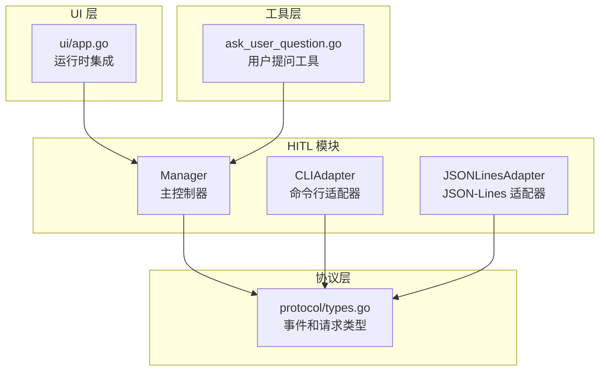
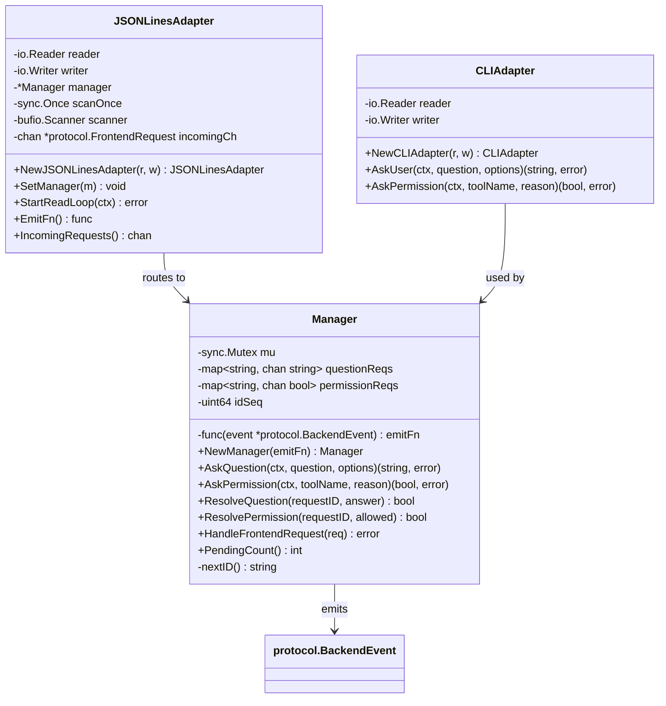
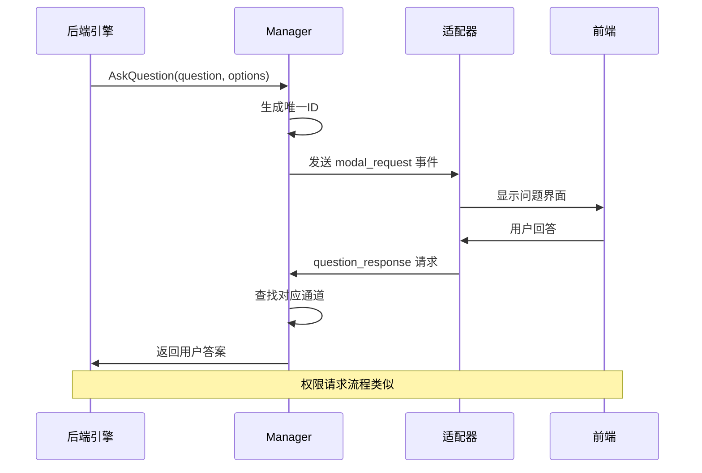
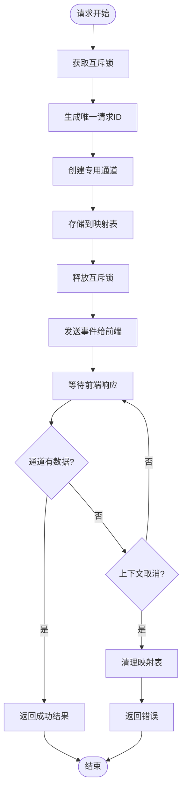
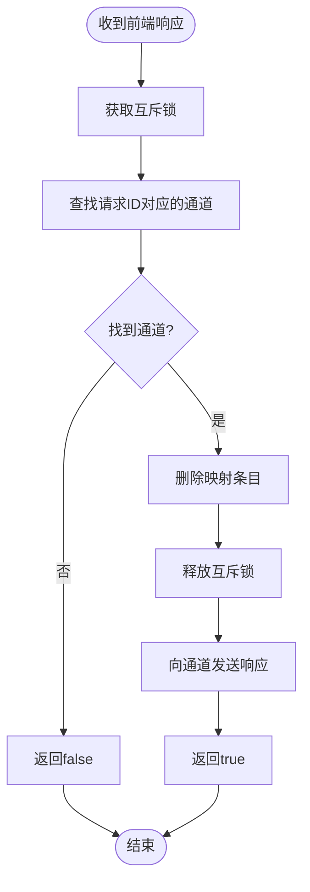
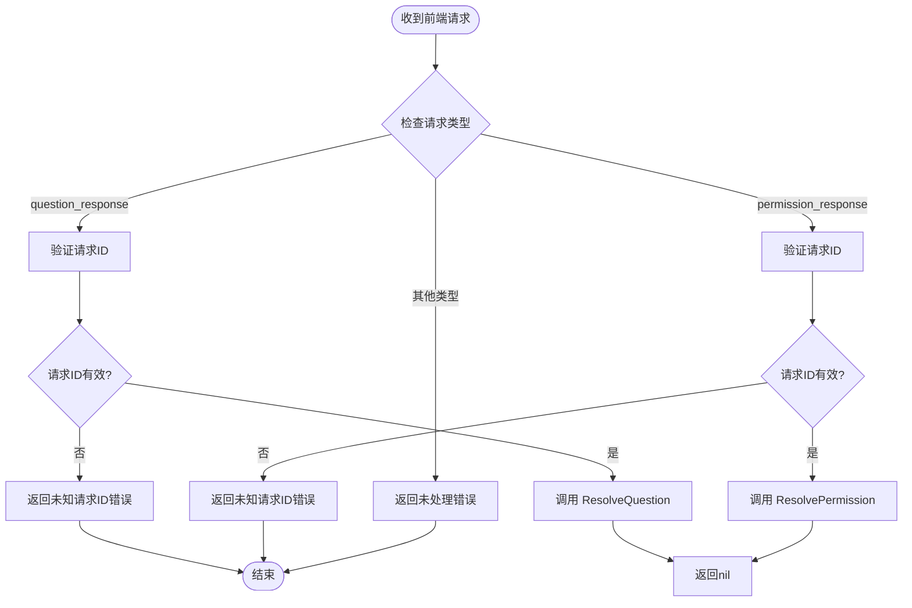
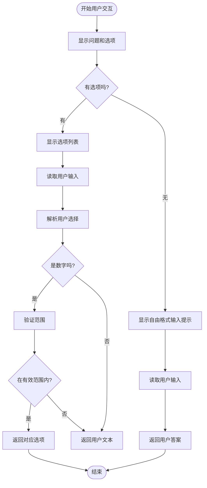
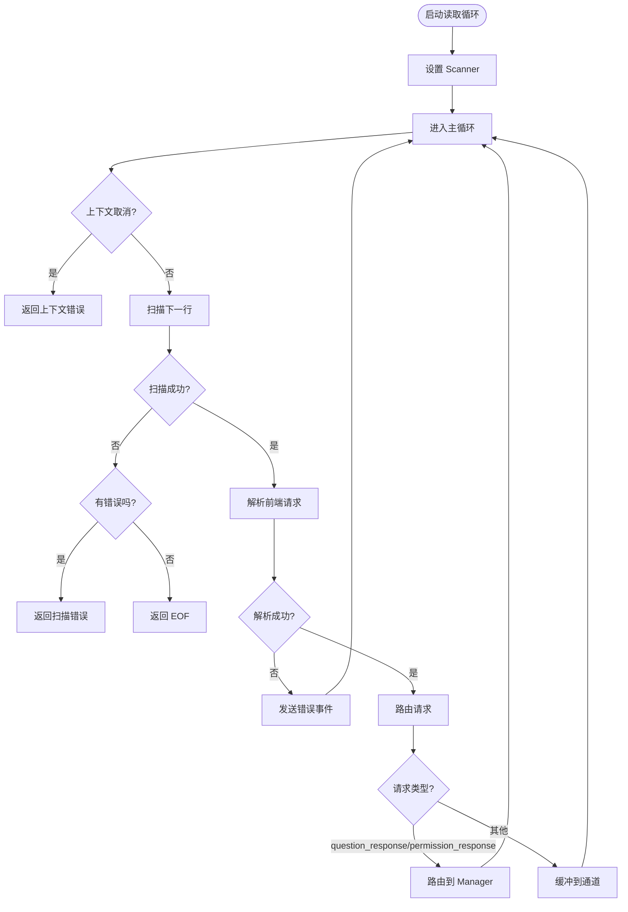
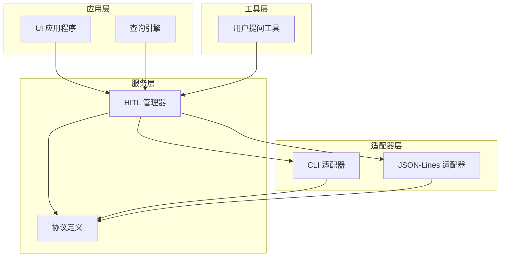

# HITL 管理器

<cite>
**本文档引用的文件**
- [manager.go](file://pkg/hitl/manager.go)
- [cli_adapter.go](file://pkg/hitl/cli_adapter.go)
- [jsonlines_adapter.go](file://pkg/hitl/jsonlines_adapter.go)
- [types.go](file://pkg/protocol/types.go)
- [app.go](file://pkg/ui/app.go)
- [Human-In-The-Loop.md](file://design/Human-In-The-Loop.md)
- [ask_user_question.go](file://pkg/tools/builtin/ask_user_question.go)
</cite>

## 目录
1. [简介](#简介)
2. [项目结构](#项目结构)
3. [核心组件](#核心组件)
4. [架构概览](#架构概览)
5. [详细组件分析](#详细组件分析)
6. [依赖关系分析](#依赖关系分析)
7. [性能考虑](#性能考虑)
8. [故障排除指南](#故障排除指南)
9. [结论](#结论)
10. [附录](#附录)

## 简介

HITL（Human-In-The-Loop，人机交互循环）管理器是 OpenHarness 项目中的关键组件，负责协调后端代理与前端用户之间的交互。该管理器实现了请求跟踪机制、并发安全处理和生命周期管理，为各种交互场景提供了统一的抽象层。

HITL 管理器支持多种交互模式：
- **CLI 模式**：通过标准输入输出进行交互
- **JSON-Lines 模式**：通过 JSON-Lines 协议进行远程交互
- **权限请求**：用于工具执行前的权限验证
- **问题询问**：用于获取用户反馈和决策

## 项目结构

HITL 管理器位于 `pkg/hitl` 目录下，包含以下核心文件：



**图表来源**
- [manager.go:1-148](file://pkg/hitl/manager.go#L1-L148)
- [cli_adapter.go:1-102](file://pkg/hitl/cli_adapter.go#L1-L102)
- [jsonlines_adapter.go:1-96](file://pkg/hitl/jsonlines_adapter.go#L1-L96)
- [types.go:1-102](file://pkg/protocol/types.go#L1-L102)

**章节来源**
- [manager.go:1-148](file://pkg/hitl/manager.go#L1-L148)
- [cli_adapter.go:1-102](file://pkg/hitl/cli_adapter.go#L1-L102)
- [jsonlines_adapter.go:1-96](file://pkg/hitl/jsonlines_adapter.go#L1-L96)

## 核心组件

### Manager 结构体设计

Manager 是 HITL 管理器的核心，负责跟踪所有正在进行的请求并协调交互流程：



**图表来源**
- [manager.go:11-18](file://pkg/hitl/manager.go#L11-L18)
- [cli_adapter.go:12-20](file://pkg/hitl/cli_adapter.go#L12-L20)
- [jsonlines_adapter.go:14-22](file://pkg/hitl/jsonlines_adapter.go#L14-L22)

### 并发安全机制

Manager 使用互斥锁确保线程安全：

- **全局互斥锁**：保护所有共享状态访问
- **独立通道映射**：问题请求和权限请求分别维护独立的通道映射
- **原子 ID 生成**：使用递增序列生成唯一请求 ID

**章节来源**
- [manager.go:12-18](file://pkg/hitl/manager.go#L12-L18)
- [manager.go:28-31](file://pkg/hitl/manager.go#L28-L31)

## 架构概览

HITL 管理器采用事件驱动架构，通过协议层实现前后端解耦：



**图表来源**
- [manager.go:35-61](file://pkg/hitl/manager.go#L35-L61)
- [manager.go:120-142](file://pkg/hitl/manager.go#L120-L142)
- [types.go:44-60](file://pkg/protocol/types.go#L44-L60)

## 详细组件分析

### Manager 组件深度分析

#### 请求跟踪机制

Manager 维护两个独立的请求映射来跟踪不同类型的操作：



**图表来源**
- [manager.go:35-61](file://pkg/hitl/manager.go#L35-L61)
- [manager.go:64-90](file://pkg/hitl/manager.go#L64-L90)

#### AskQuestion 方法工作流程

AskQuestion 方法实现了完整的请求-响应循环：

1. **请求准备阶段**：
   - 获取互斥锁
   - 生成唯一请求 ID
   - 创建带缓冲的字符串通道
   - 将请求映射到内存中

2. **事件发送阶段**：
   - 调用 emit 函数发送 modal_request 事件
   - 事件包含问题内容和选项列表

3. **响应等待阶段**：
   - 使用 select 语句监听通道和上下文取消
   - 支持超时和取消操作

4. **清理阶段**：
   - 如果上下文取消，删除映射条目
   - 返回相应的错误信息

**章节来源**
- [manager.go:35-61](file://pkg/hitl/manager.go#L35-L61)

#### AskPermission 方法工作流程

AskPermission 方法与 AskQuestion 类似，但处理布尔类型的权限响应：

1. **请求准备**：与 AskQuestion 相同
2. **事件发送**：发送包含工具名称和原因的权限请求
3. **响应处理**：接收布尔值表示允许或拒绝
4. **错误处理**：支持上下文取消和超时

**章节来源**
- [manager.go:64-90](file://pkg/hitl/manager.go#L64-L90)

#### ResolveQuestion 和 ResolvePermission 方法

这两个方法负责处理来自前端的响应：



**图表来源**
- [manager.go:92-104](file://pkg/hitl/manager.go#L92-L104)
- [manager.go:106-118](file://pkg/hitl/manager.go#L106-L118)

#### HandleFrontendRequest 方法

HandleFrontendRequest 方法实现了前端请求的路由和错误处理：



**图表来源**
- [manager.go:120-142](file://pkg/hitl/manager.go#L120-L142)

**章节来源**
- [manager.go:120-142](file://pkg/hitl/manager.go#L120-L142)

### CLI 适配器组件

CLIAdapter 提供了命令行环境下的用户交互能力：

#### AskUser 方法实现

CLIAdapter.AskUser 方法实现了智能的多选题处理：



**图表来源**
- [cli_adapter.go:23-68](file://pkg/hitl/cli_adapter.go#L23-L68)

#### AskPermission 方法实现

AskPermission 方法提供了简洁的权限确认界面：

1. **显示权限请求**：包含工具名称和执行原因
2. **读取用户输入**：支持 y/yes 或 n/no
3. **智能解析**：忽略大小写，支持多种输入形式
4. **返回布尔值**：根据用户选择返回允许或拒绝

**章节来源**
- [cli_adapter.go:71-102](file://pkg/hitl/cli_adapter.go#L71-L102)

### JSON-Lines 适配器组件

JSONLinesAdapter 实现了网络传输层的交互：

#### StartReadLoop 方法

StartReadLoop 方法实现了异步读取和处理循环：



**图表来源**
- [jsonlines_adapter.go:34-82](file://pkg/hitl/jsonlines_adapter.go#L34-L82)

#### 错误恢复机制

JSONLinesAdapter 实现了健壮的错误处理和恢复机制：

1. **解析错误处理**：发送 BEError 事件而不是中断连接
2. **上下文取消处理**：优雅地退出读取循环
3. **缓冲区管理**：使用带缓冲的通道避免阻塞
4. **资源清理**：确保 Scanner 正确关闭

**章节来源**
- [jsonlines_adapter.go:34-82](file://pkg/hitl/jsonlines_adapter.go#L34-L82)

## 依赖关系分析

HITL 管理器的依赖关系体现了清晰的分层架构：



**图表来源**
- [app.go:191-238](file://pkg/ui/app.go#L191-L238)
- [manager.go:1-148](file://pkg/hitl/manager.go#L1-L148)
- [types.go:1-102](file://pkg/protocol/types.go#L1-L102)

### 关键依赖点

1. **协议层依赖**：所有组件都依赖 protocol/types.go 中的类型定义
2. **UI 集成**：通过 UI 应用程序集成不同的适配器
3. **工具链集成**：用户提问工具通过回调函数与 Manager 交互
4. **运行时配置**：通过 RuntimeOption 注入不同的回调实现

**章节来源**
- [app.go:191-238](file://pkg/ui/app.go#L191-L238)
- [ask_user_question.go:56-80](file://pkg/tools/builtin/ask_user_question.go#L56-L80)

## 性能考虑

### 内存使用优化

1. **通道缓冲**：使用带缓冲的通道避免阻塞
2. **映射表管理**：及时清理已完成的请求映射
3. **Scanner 缓冲**：预分配大缓冲区减少内存分配

### 并发性能

1. **细粒度锁**：只在必要时获取互斥锁
2. **异步处理**：使用 goroutine 处理前端请求
3. **上下文取消**：快速响应取消信号

### 网络性能

1. **流式读取**：使用 bufio.Scanner 进行高效读取
2. **批量处理**：缓冲前端请求避免频繁调度
3. **错误恢复**：保持连接稳定避免重连开销

## 故障排除指南

### 常见问题诊断

#### 请求超时问题

**症状**：AskQuestion 或 AskPermission 方法返回超时错误

**可能原因**：
1. 前端没有正确处理 modal_request 事件
2. 适配器没有正确路由响应
3. 上下文提前取消

**解决步骤**：
1. 检查前端是否收到 modal_request 事件
2. 验证适配器的 HandleFrontendRequest 方法
3. 确认上下文生命周期管理

#### 未知请求ID错误

**症状**：ResolveQuestion 或 ResolvePermission 返回 false

**可能原因**：
1. 请求ID过期或已清理
2. 前端发送了错误的请求ID
3. 并发访问导致竞态条件

**解决步骤**：
1. 检查请求ID生成逻辑
2. 验证前端响应的请求ID一致性
3. 确保正确的清理时机

#### 内存泄漏问题

**症状**：PendingCount 持续增长

**可能原因**：
1. 请求映射没有正确清理
2. 通道阻塞导致 goroutine 泄漏
3. 上下文取消处理不当

**解决步骤**：
1. 检查所有返回路径的清理逻辑
2. 确保 select 语句正确处理所有分支
3. 验证 defer 语句的使用

**章节来源**
- [manager.go:144-148](file://pkg/hitl/manager.go#L144-L148)
- [manager.go:56-59](file://pkg/hitl/manager.go#L56-L59)
- [manager.go:85-88](file://pkg/hitl/manager.go#L85-L88)

## 结论

HITL 管理器通过精心设计的架构实现了人机交互的统一抽象。其核心优势包括：

1. **模块化设计**：清晰的职责分离和接口定义
2. **并发安全**：完善的互斥锁和通道机制
3. **可扩展性**：支持多种适配器和交互模式
4. **错误处理**：健壮的错误恢复和诊断机制

该组件为 OpenHarness 项目提供了可靠的人机交互基础设施，支持从简单的命令行界面到复杂的远程 TUI 应用的各种场景。

## 附录

### 使用示例

#### 基本使用模式

```go
// 创建 CLI 适配器
cliAdapter := hitl.NewCLIAdapter(os.Stdin, os.Stdout)

// 创建运行时并注入回调
rt, err := BuildRuntime(settings, cwd, 
    WithHITLCallbacks(cliAdapter.AskUser, cliAdapter.AskPermission))

// 在工具中使用
answer, err := execCtx.AskUser(ctx, "你的问题", []string{"选项1", "选项2"})
```

#### JSON-Lines 模式集成

```go
// 创建 JSON-Lines 适配器
jlAdapter := hitl.NewJSONLinesAdapter(os.Stdin, os.Stdout)
manager := hitl.NewManager(jlAdapter.EmitFn())
jlAdapter.SetManager(manager)

// 注入到运行时
rt, err := BuildRuntime(settings, cwd, 
    WithHITLCallbacks(manager.AskQuestion, manager.AskPermission))
```

### 最佳实践

1. **线程安全**：始终通过 Manager 方法访问共享状态
2. **资源清理**：确保正确处理上下文取消和错误情况
3. **错误处理**：实现适当的错误传播和日志记录
4. **性能监控**：定期检查 PendingCount 和内存使用情况
5. **测试覆盖**：为关键路径编写单元测试和集成测试