# HITL 类型定义

<cite>
**本文档引用的文件**
- [pkg/protocol/types.go](file://pkg/protocol/types.go)
- [pkg/hitl/manager.go](file://pkg/hitl/manager.go)
- [pkg/hitl/cli_adapter.go](file://pkg/hitl/cli_adapter.go)
- [pkg/hitl/jsonlines_adapter.go](file://pkg/hitl/jsonlines_adapter.go)
- [pkg/tools/base.go](file://pkg/tools/base.go)
- [pkg/tools/builtin/ask_user_question.go](file://pkg/tools/builtin/ask_user_question.go)
- [pkg/engine/query.go](file://pkg/engine/query.go)
- [pkg/engine/query_engine.go](file://pkg/engine/query_engine.go)
- [design/Human-In-The-Loop.md](file://design/Human-In-The-Loop.md)
</cite>

## 目录
1. [简介](#简介)
2. [项目结构](#项目结构)
3. [核心组件](#核心组件)
4. [架构概览](#架构概览)
5. [详细组件分析](#详细组件分析)
6. [依赖关系分析](#依赖关系分析)
7. [性能考虑](#性能考虑)
8. [故障排除指南](#故障排除指南)
9. [结论](#结论)
10. [附录](#附录)

## 简介

HITL（Human-In-The-Loop，人机交互回路）是 OpenHarness 项目中的关键组件，用于实现后端代理与前端界面之间的双向通信。该系统通过标准化的数据类型和协议，支持多种前端适配器（CLI、JSON-Lines、HTTP/WebSocket），为开发者提供了灵活的人机交互解决方案。

本参考文档详细说明了 HITL 类型定义的所有公共类型、常量和接口，解释了 BackendEvent、FrontendRequest、ModalInfo 等核心数据结构的设计原理和字段含义，并提供了类型之间的关系图和继承层次。

## 项目结构

HITL 功能分布在以下主要模块中：

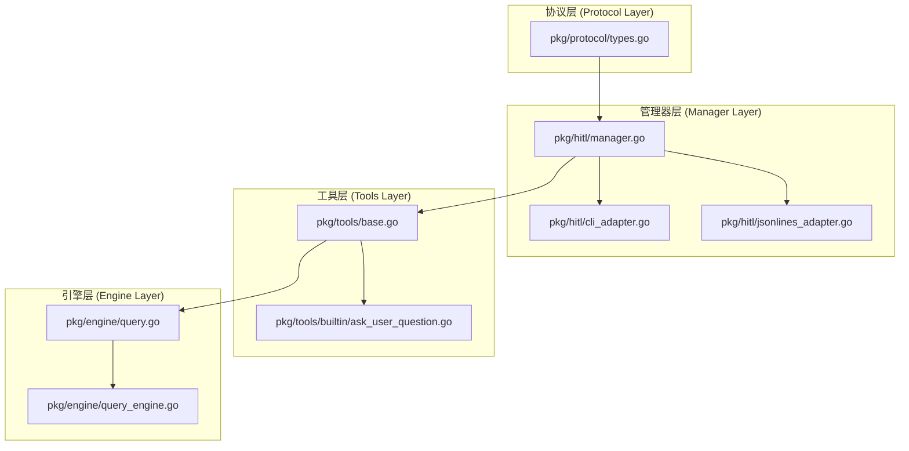

**图表来源**
- [pkg/protocol/types.go:1-102](file://pkg/protocol/types.go#L1-L102)
- [pkg/hitl/manager.go:1-148](file://pkg/hitl/manager.go#L1-L148)
- [pkg/hitl/cli_adapter.go:1-102](file://pkg/hitl/cli_adapter.go#L1-L102)
- [pkg/hitl/jsonlines_adapter.go:1-96](file://pkg/hitl/jsonlines_adapter.go#L1-L96)
- [pkg/tools/base.go:1-132](file://pkg/tools/base.go#L1-L132)
- [pkg/tools/builtin/ask_user_question.go:1-80](file://pkg/tools/builtin/ask_user_question.go#L1-L80)
- [pkg/engine/query.go:132-331](file://pkg/engine/query.go#L132-L331)
- [pkg/engine/query_engine.go:48-247](file://pkg/engine/query_engine.go#L48-L247)

**章节来源**
- [pkg/protocol/types.go:1-102](file://pkg/protocol/types.go#L1-L102)
- [pkg/hitl/manager.go:1-148](file://pkg/hitl/manager.go#L1-L148)
- [pkg/hitl/cli_adapter.go:1-102](file://pkg/hitl/cli_adapter.go#L1-L102)
- [pkg/hitl/jsonlines_adapter.go:1-96](file://pkg/hitl/jsonlines_adapter.go#L1-L96)
- [pkg/tools/base.go:1-132](file://pkg/tools/base.go#L1-L132)
- [pkg/tools/builtin/ask_user_question.go:1-80](file://pkg/tools/builtin/ask_user_question.go#L1-L80)
- [pkg/engine/query.go:132-331](file://pkg/engine/query.go#L132-L331)
- [pkg/engine/query_engine.go:48-247](file://pkg/engine/query_engine.go#L48-L247)

## 核心组件

### 协议类型定义

HITL 协议类型定义位于独立的协议包中，避免了循环依赖问题：

#### 后端事件类型 (BackendEventType)

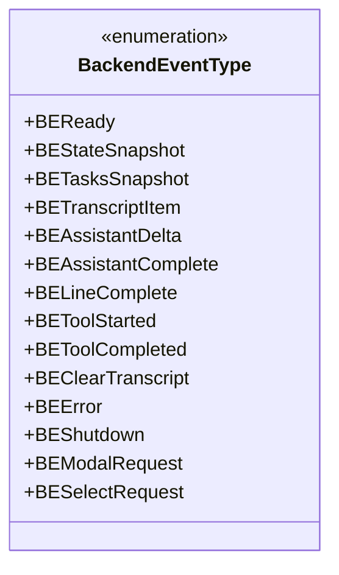

**图表来源**
- [pkg/protocol/types.go:16-35](file://pkg/protocol/types.go#L16-L35)

#### 前端请求类型 (FrontendRequestType)

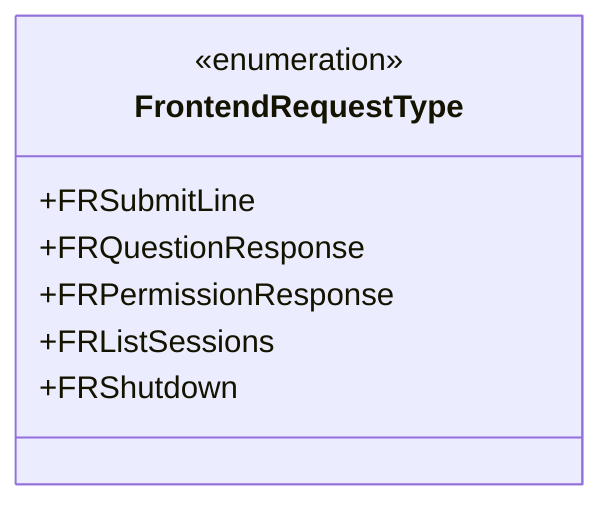

**图表来源**
- [pkg/protocol/types.go:77-85](file://pkg/protocol/types.go#L77-L85)

#### 模态框类型 (ModalKind)

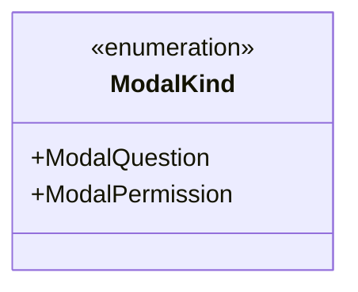

**图表来源**
- [pkg/protocol/types.go:37-42](file://pkg/protocol/types.go#L37-L42)

**章节来源**
- [pkg/protocol/types.go:16-85](file://pkg/protocol/types.go#L16-L85)

### 核心数据结构

#### BackendEvent 结构体

BackendEvent 是后端向前端发送的主要事件载体，支持多种事件类型：

```mermaid
classDiagram
class BackendEvent {
+BackendEventType Type
+string Text
+string Error
+ModalInfo~*~ Modal
+SelectOption[] SelectOptions
+map[string]interface{} Extra
+MarshalJSON() []byte
}
class ModalInfo {
+ModalKind Kind
+string RequestID
+string Question
+string[] Options
+string ToolName
+string Reason
}
class SelectOption {
+string Label
+string Value
+string Desc
}
BackendEvent --> ModalInfo : "包含"
BackendEvent --> SelectOption : "包含多个"
```

**图表来源**
- [pkg/protocol/types.go:53-66](file://pkg/protocol/types.go#L53-L66)
- [pkg/protocol/types.go:44-51](file://pkg/protocol/types.go#L44-L51)
- [pkg/protocol/types.go:62-66](file://pkg/protocol/types.go#L62-L66)

#### FrontendRequest 结构体

FrontendRequest 是前端向后端发送的请求载体：

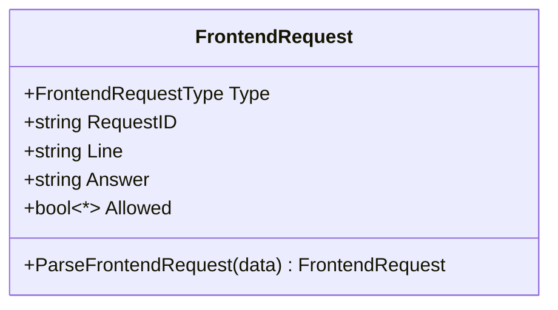

**图表来源**
- [pkg/protocol/types.go:87-93](file://pkg/protocol/types.go#L87-L93)
- [pkg/protocol/types.go:95-101](file://pkg/protocol/types.go#L95-L101)

**章节来源**
- [pkg/protocol/types.go:44-101](file://pkg/protocol/types.go#L44-L101)

## 架构概览

HITL 系统采用分层架构设计，实现了前后端解耦和多前端适配：

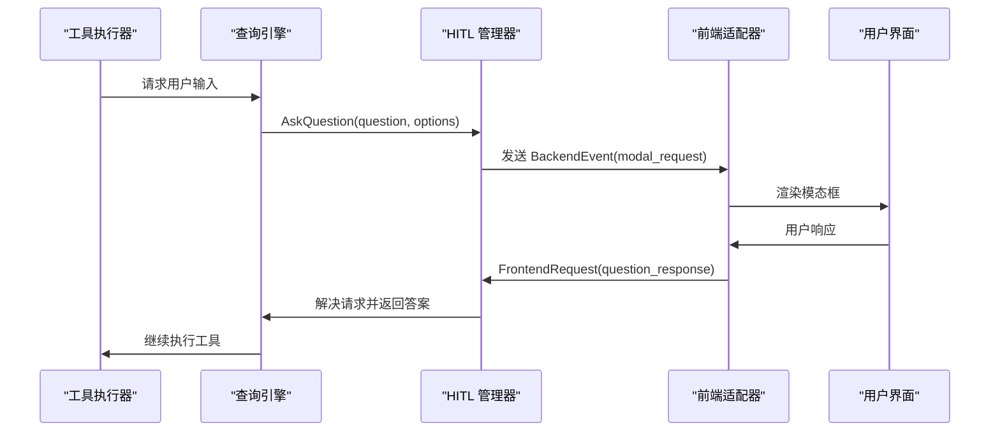

**图表来源**
- [pkg/hitl/manager.go:33-61](file://pkg/hitl/manager.go#L33-L61)
- [pkg/hitl/manager.go:120-142](file://pkg/hitl/manager.go#L120-L142)
- [pkg/hitl/jsonlines_adapter.go:56-81](file://pkg/hitl/jsonlines_adapter.go#L56-L81)

**章节来源**
- [pkg/hitl/manager.go:11-148](file://pkg/hitl/manager.go#L11-L148)
- [pkg/hitl/jsonlines_adapter.go:34-96](file://pkg/hitl/jsonlines_adapter.go#L34-L96)

## 详细组件分析

### HITL 管理器 (Manager)

HITL 管理器是系统的核心协调组件，负责跟踪每个会话中的未决请求：

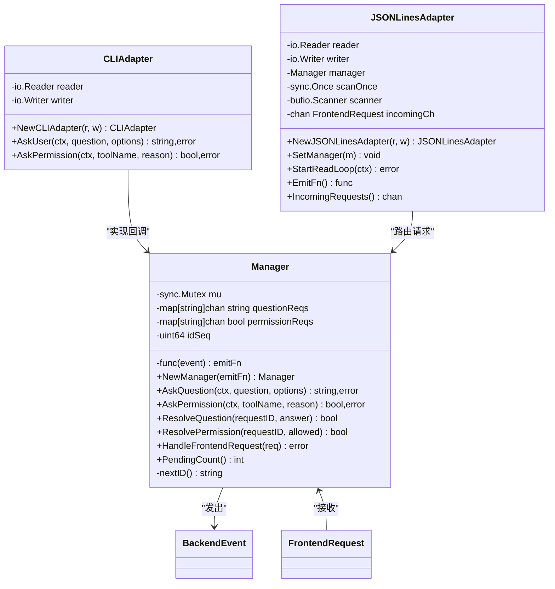

**图表来源**
- [pkg/hitl/manager.go:12-18](file://pkg/hitl/manager.go#L12-L18)
- [pkg/hitl/cli_adapter.go:13-20](file://pkg/hitl/cli_adapter.go#L13-L20)
- [pkg/hitl/jsonlines_adapter.go:15-22](file://pkg/hitl/jsonlines_adapter.go#L15-L22)

#### 管理器工作流程

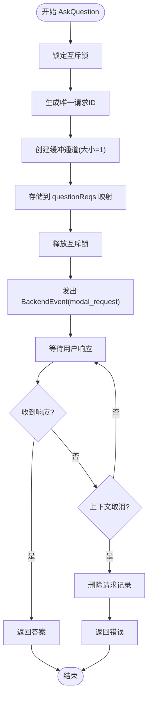

**图表来源**
- [pkg/hitl/manager.go:35-61](file://pkg/hitl/manager.go#L35-L61)

**章节来源**
- [pkg/hitl/manager.go:11-148](file://pkg/hitl/manager.go#L11-L148)

### 前端适配器

#### CLI 适配器

CLI 适配器提供命令行界面的交互能力：

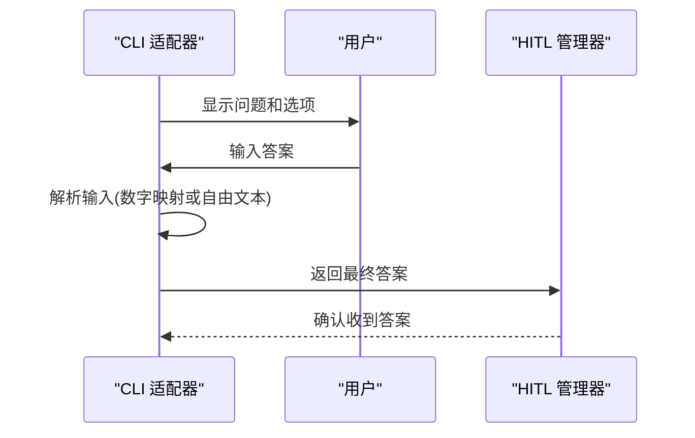

**图表来源**
- [pkg/hitl/cli_adapter.go:23-68](file://pkg/hitl/cli_adapter.go#L23-L68)

#### JSON-Lines 适配器

JSON-Lines 适配器支持远程前端连接：

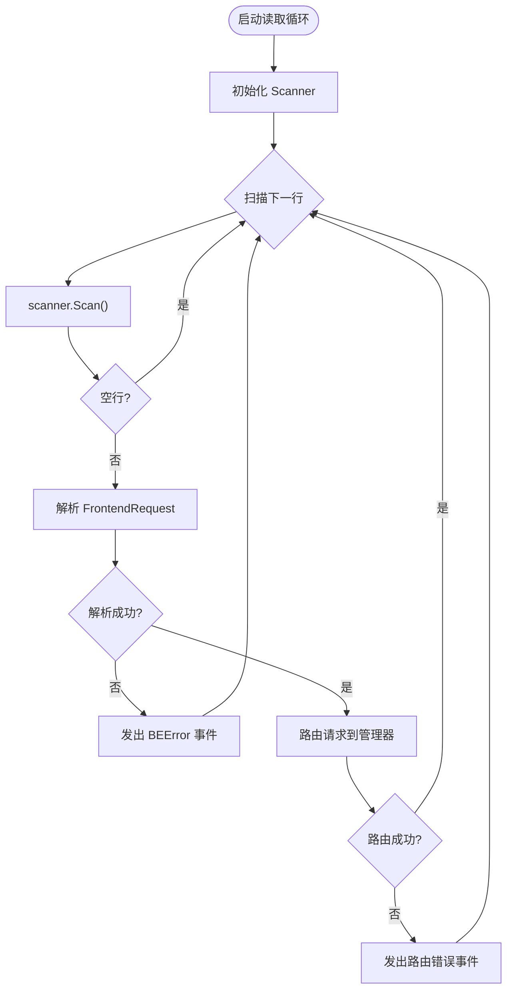

**图表来源**
- [pkg/hitl/jsonlines_adapter.go:34-81](file://pkg/hitl/jsonlines_adapter.go#L34-L81)

**章节来源**
- [pkg/hitl/cli_adapter.go:12-102](file://pkg/hitl/cli_adapter.go#L12-L102)
- [pkg/hitl/jsonlines_adapter.go:14-96](file://pkg/hitl/jsonlines_adapter.go#L14-L96)

### 工具集成

#### 问用户问题工具

AskUserQuestion 工具展示了如何在工具中使用 HITL 回调：

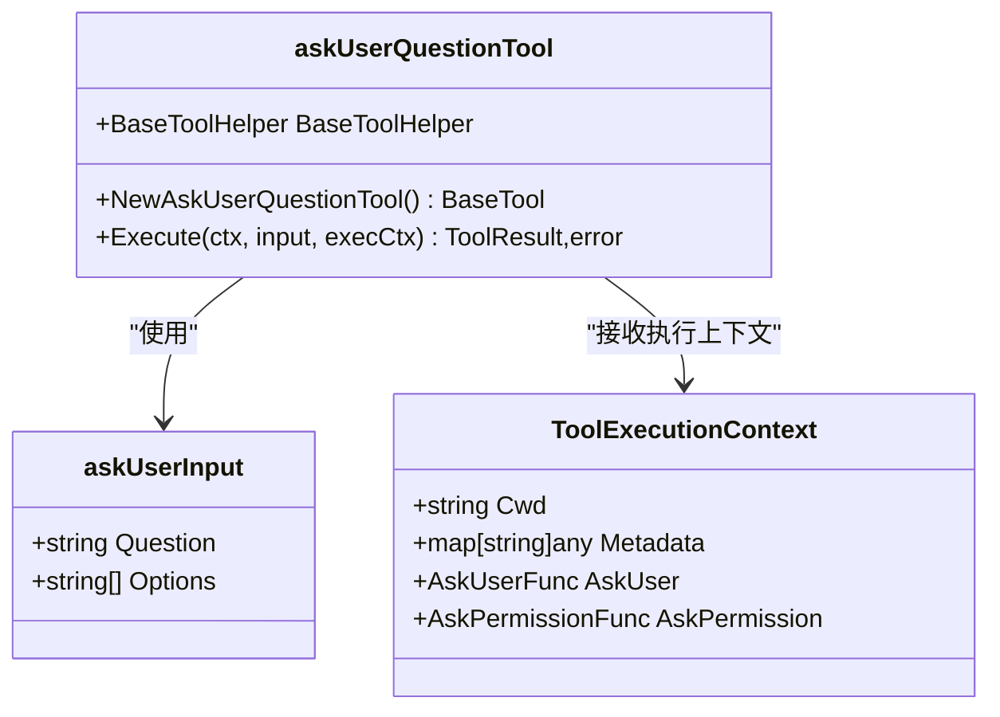

**图表来源**
- [pkg/tools/builtin/ask_user_question.go:12-54](file://pkg/tools/builtin/ask_user_question.go#L12-L54)
- [pkg/tools/base.go:19-27](file://pkg/tools/base.go#L19-L27)

**章节来源**
- [pkg/tools/builtin/ask_user_question.go:1-80](file://pkg/tools/builtin/ask_user_question.go#L1-L80)
- [pkg/tools/base.go:11-27](file://pkg/tools/base.go#L11-L27)

## 依赖关系分析

HITL 系统的依赖关系遵循清晰的分层原则：

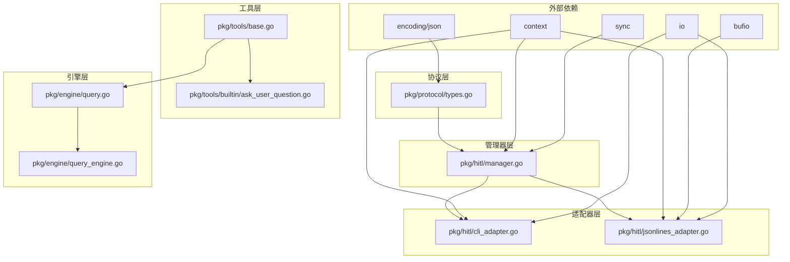

**图表来源**
- [pkg/protocol/types.go:8-10](file://pkg/protocol/types.go#L8-L10)
- [pkg/hitl/manager.go:3-9](file://pkg/hitl/manager.go#L3-L9)
- [pkg/hitl/cli_adapter.go:3-10](file://pkg/hitl/cli_adapter.go#L3-L10)
- [pkg/hitl/jsonlines_adapter.go:3-12](file://pkg/hitl/jsonlines_adapter.go#L3-L12)
- [pkg/tools/base.go:4-9](file://pkg/tools/base.go#L4-L9)

**章节来源**
- [pkg/protocol/types.go:1-102](file://pkg/protocol/types.go#L1-L102)
- [pkg/hitl/manager.go:1-148](file://pkg/hitl/manager.go#L1-L148)
- [pkg/hitl/cli_adapter.go:1-102](file://pkg/hitl/cli_adapter.go#L1-L102)
- [pkg/hitl/jsonlines_adapter.go:1-96](file://pkg/hitl/jsonlines_adapter.go#L1-L96)
- [pkg/tools/base.go:1-132](file://pkg/tools/base.go#L1-L132)
- [pkg/tools/builtin/ask_user_question.go:1-80](file://pkg/tools/builtin/ask_user_question.go#L1-L80)
- [pkg/engine/query.go:132-331](file://pkg/engine/query.go#L132-L331)
- [pkg/engine/query_engine.go:48-247](file://pkg/engine/query_engine.go#L48-L247)

## 性能考虑

### 内存管理

- **通道缓冲区**：管理器使用缓冲大小为 1 的通道，确保每个请求的独占性
- **映射存储**：使用并发安全的互斥锁保护请求映射
- **字符串 ID**：自增 ID 序列器避免重复请求 ID

### 并发安全

- **互斥锁保护**：所有对共享状态的访问都经过互斥锁保护
- **上下文取消**：原生支持 Go context 取消，避免资源泄漏
- **通道选择**：使用 select 语句处理超时和取消

### 序列化优化

- **JSON 编组**：使用标准库进行高效的 JSON 序列化
- **流式读取**：JSON-Lines 适配器使用 Scanner 进行流式读取
- **零拷贝**：尽量避免不必要的数据复制

## 故障排除指南

### 常见问题

#### 请求 ID 不存在

当前端发送未知请求 ID 时，管理器会返回错误：

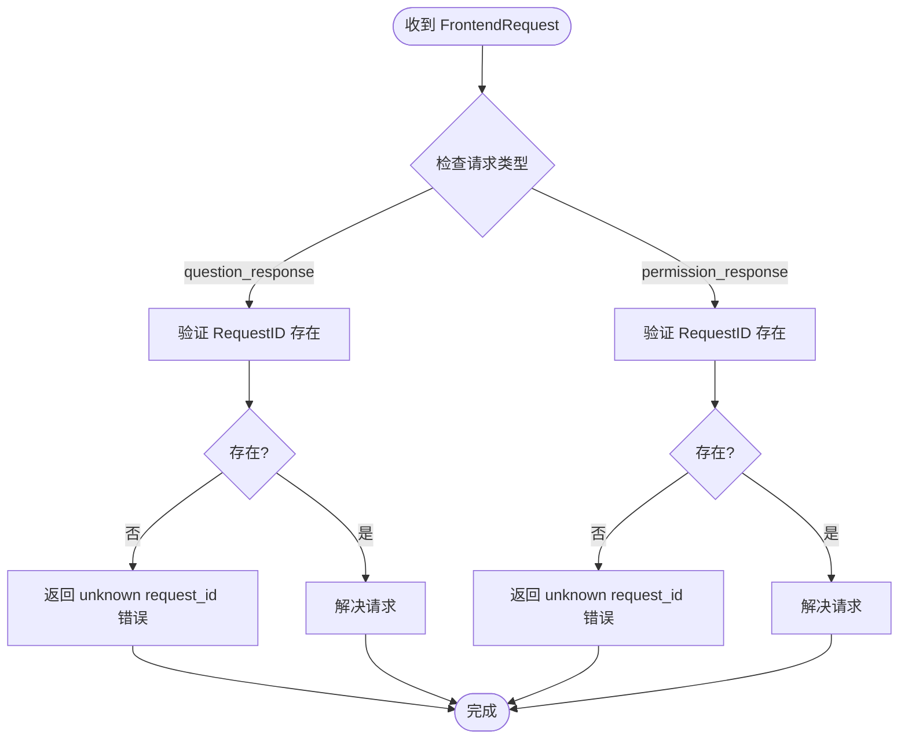

**图表来源**
- [pkg/hitl/manager.go:120-142](file://pkg/hitl/manager.go#L120-L142)

#### 上下文取消处理

当用户取消操作时，管理器会清理相关状态：

**章节来源**
- [pkg/hitl/manager.go:56-60](file://pkg/hitl/manager.go#L56-L60)
- [pkg/hitl/manager.go:84-89](file://pkg/hitl/manager.go#L84-L89)

## 结论

HITL 类型定义系统通过精心设计的分层架构和标准化的数据结构，为 OpenHarness 提供了强大而灵活的人机交互能力。系统的关键优势包括：

1. **类型安全**：强类型的枚举和结构体确保了编译时的类型安全
2. **协议独立**：协议层独立于其他模块，避免了循环依赖
3. **多前端支持**：统一的接口支持 CLI、JSON-Lines 和 HTTP/WebSocket 等多种前端
4. **并发安全**：使用 Go 语言的并发原语确保了线程安全
5. **可扩展性**：清晰的接口设计便于添加新的前端适配器和工具

开发者可以基于这些类型定义构建自己的前端适配器和工具，同时保持与现有系统的兼容性。

## 附录

### 使用示例

#### 基本问答流程

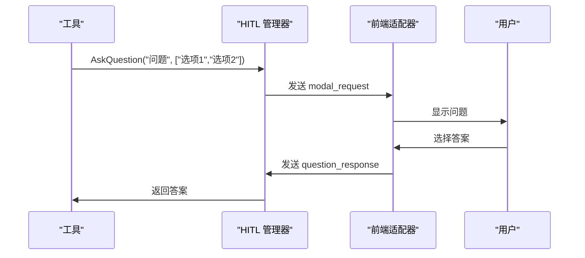

#### 权限请求流程

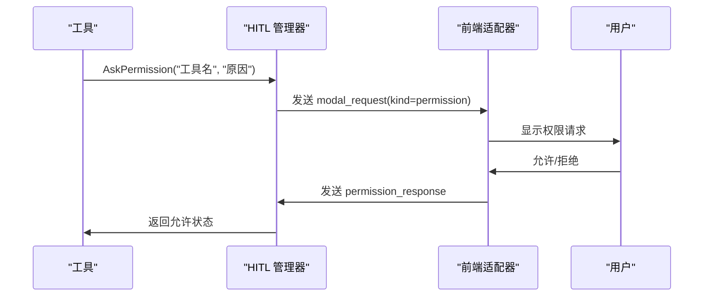

### 最佳实践

1. **错误处理**：始终检查管理器返回的错误，特别是上下文取消错误
2. **资源清理**：确保在取消或错误情况下清理请求状态
3. **类型安全**：使用正确的枚举值，避免硬编码字符串
4. **并发考虑**：在多 goroutine 环境中正确使用互斥锁
5. **序列化**：注意 JSON 序列化和反序列化的错误处理