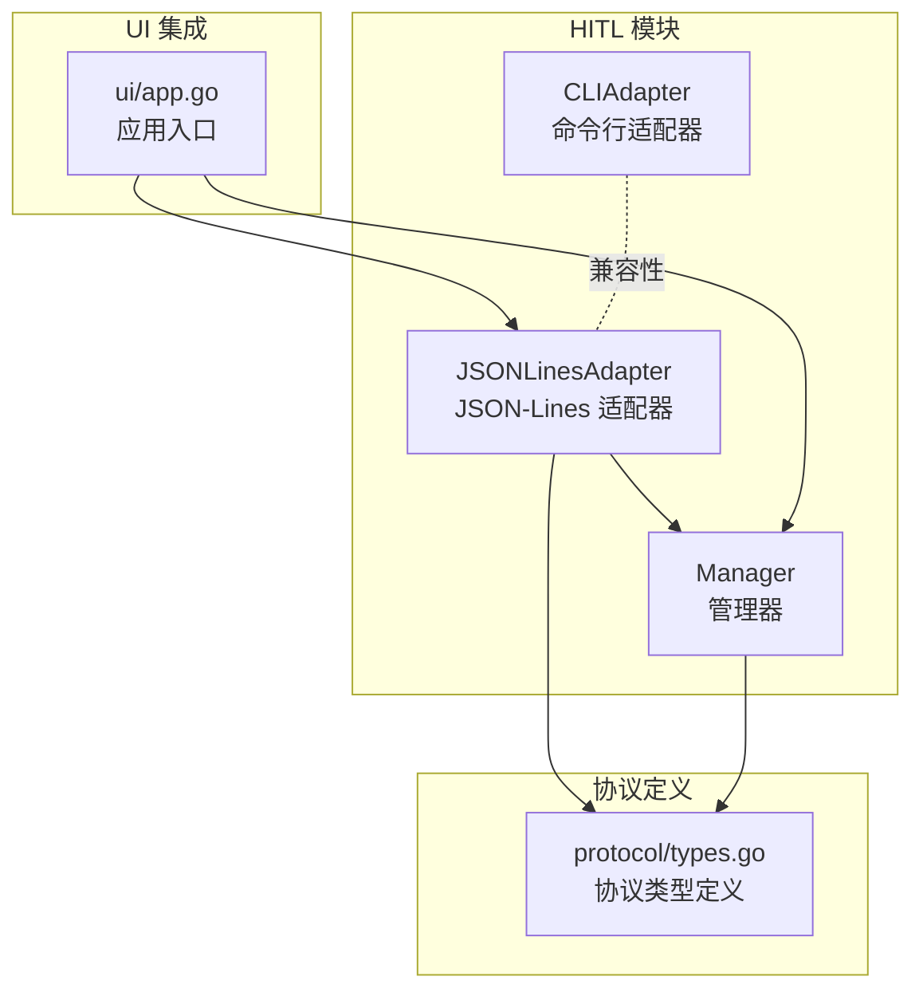
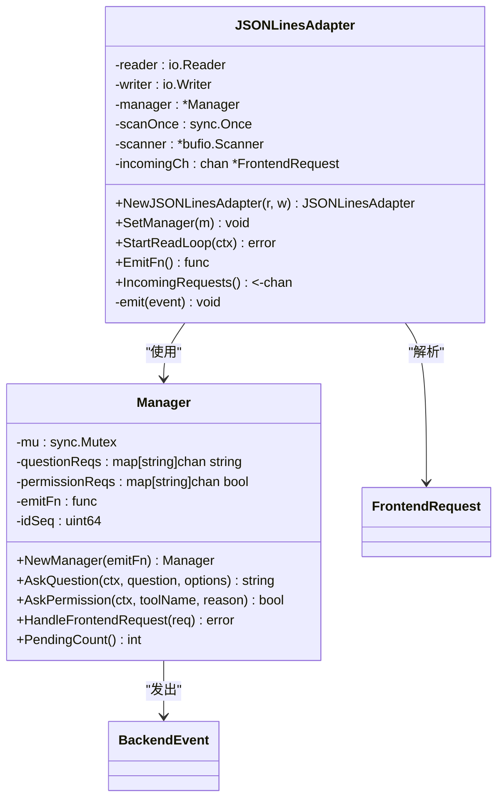
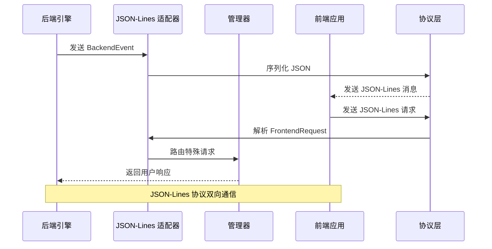
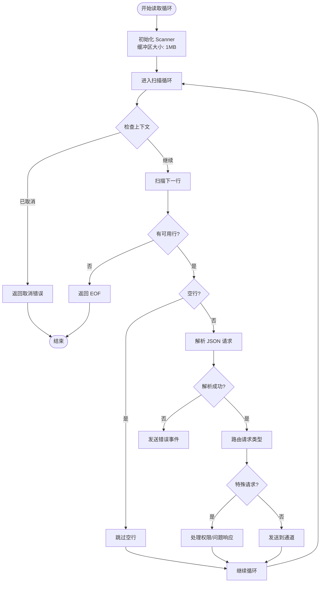
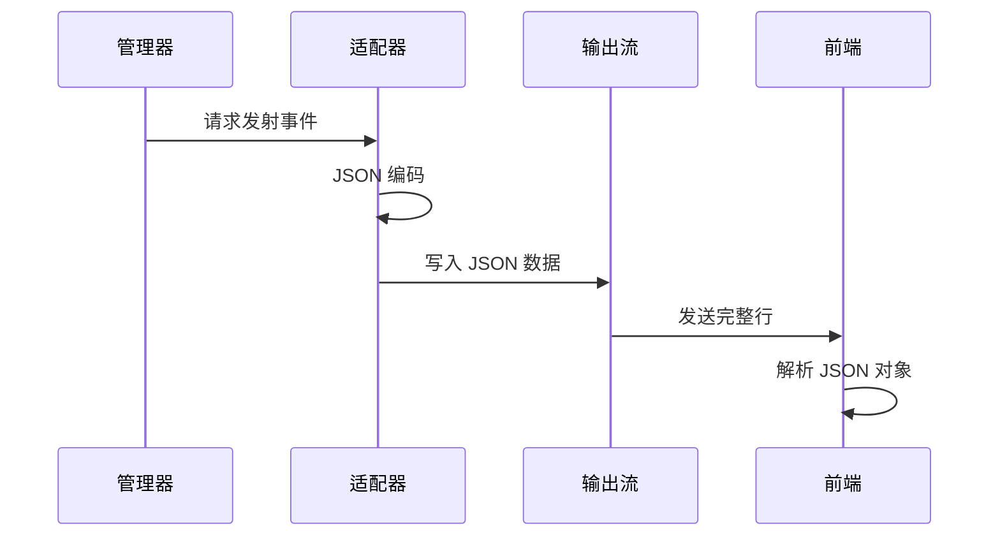
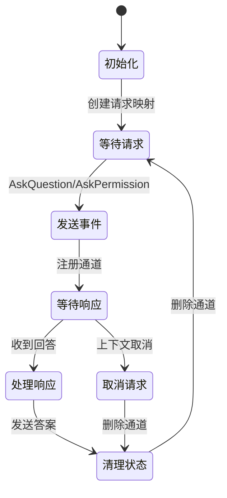
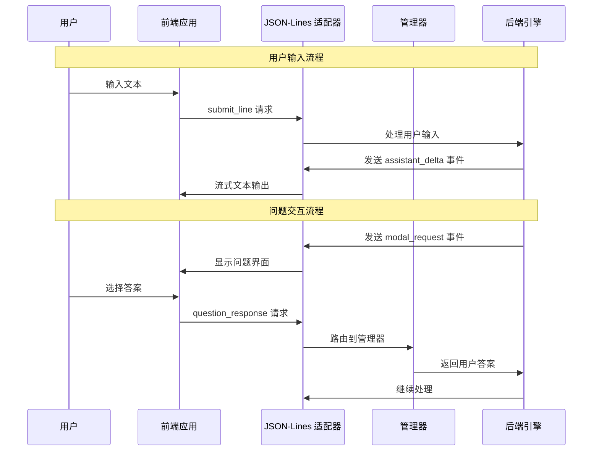
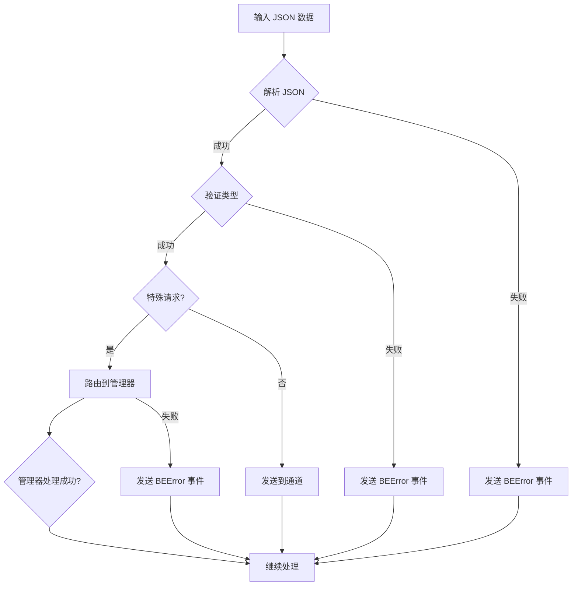
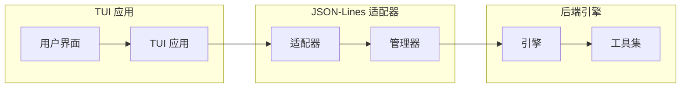

# JSON-Lines 适配器

<cite>
**本文档引用的文件**
- [jsonlines_adapter.go](file://pkg/hitl/jsonlines_adapter.go)
- [manager.go](file://pkg/hitl/manager.go)
- [types.go](file://pkg/protocol/types.go)
- [app.go](file://pkg/ui/app.go)
- [cli_adapter.go](file://pkg/hitl/cli_adapter.go)
- [Human-In-The-Loop.md](file://design/Human-In-The-Loop.md)
</cite>

## 目录
1. [简介](#简介)
2. [项目结构](#项目结构)
3. [核心组件](#核心组件)
4. [架构概览](#架构概览)
5. [详细组件分析](#详细组件分析)
6. [协议规范](#协议规范)
7. [数据流分析](#数据流分析)
8. [性能特性](#性能特性)
9. [适用场景](#适用场景)
10. [调试技巧](#调试技巧)
11. [故障排除](#故障排除)
12. [结论](#结论)

## 简介

JSON-Lines 适配器是 openharness-go 项目中用于实现 Human-In-The-Loop (HITL) 交互的核心组件。它基于 JSON-Lines 协议，通过标准输入输出流实现后端与前端之间的双向通信。该适配器支持多种前端集成方式，包括 TUI 应用、IDE 插件和远程客户端，为开发者提供了灵活的人机交互解决方案。

JSON-Lines 协议采用简单的文本行格式，每行包含一个完整的 JSON 对象，通过换行符分隔。这种设计使得协议既易于实现，又便于调试和测试。

## 项目结构

JSON-Lines 适配器位于 `pkg/hitl/` 目录下，与协议定义和 UI 集成紧密相关：



**图表来源**
- [jsonlines_adapter.go:1-96](file://pkg/hitl/jsonlines_adapter.go#L1-L96)
- [manager.go:1-148](file://pkg/hitl/manager.go#L1-L148)
- [types.go:1-102](file://pkg/protocol/types.go#L1-L102)
- [app.go:191-238](file://pkg/ui/app.go#L191-L238)

**章节来源**
- [jsonlines_adapter.go:1-96](file://pkg/hitl/jsonlines_adapter.go#L1-L96)
- [manager.go:1-148](file://pkg/hitl/manager.go#L1-L148)
- [types.go:1-102](file://pkg/protocol/types.go#L1-L102)
- [app.go:191-238](file://pkg/ui/app.go#L191-L238)

## 核心组件

### JSONLinesAdapter 结构体

JSONLinesAdapter 是适配器的核心实现，负责处理 JSON-Lines 协议的所有细节：



**图表来源**
- [jsonlines_adapter.go:14-22](file://pkg/hitl/jsonlines_adapter.go#L14-L22)
- [manager.go:12-18](file://pkg/hitl/manager.go#L12-L18)

### 协议类型系统

协议定义位于独立的 `protocol` 包中，避免了循环依赖问题：

```mermaid
classDiagram
class BackendEventType {
<<enumeration>>
+BEReady
+BEStateSnapshot
+BETasksSnapshot
+BETranscriptItem
+BEAssistantDelta
+BEAssistantComplete
+BELineComplete
+BEToolStarted
+BEToolCompleted
+BEClearTranscript
+BEError
+BEShutdown
+BEModalRequest
+BESelectRequest
}
class FrontendRequestType {
<<enumeration>>
+FRSubmitLine
+FRQuestionResponse
+FRPermissionResponse
+FRListSessions
+FRShutdown
}
class ModalKind {
<<enumeration>>
+ModalQuestion
+ModalPermission
}
class BackendEvent {
+Type : BackendEventType
+Text : string
+Error : string
+Modal : *ModalInfo
+SelectOptions : []SelectOption
+Extra : map[string]interface{}
}
class FrontendRequest {
+Type : FrontendRequestType
+RequestID : string
+Line : string
+Answer : string
+Allowed : *bool
}
class ModalInfo {
+Kind : ModalKind
+RequestID : string
+Question : string
+Options : []string
+ToolName : string
+Reason : string
}
BackendEventType --> BackendEvent : "类型"
FrontendRequestType --> FrontendRequest : "类型"
ModalKind --> ModalInfo : "类型"
```

**图表来源**
- [types.go:16-60](file://pkg/protocol/types.go#L16-L60)
- [types.go:77-93](file://pkg/protocol/types.go#L77-L93)
- [types.go:44-51](file://pkg/protocol/types.go#L44-L51)

**章节来源**
- [jsonlines_adapter.go:14-32](file://pkg/hitl/jsonlines_adapter.go#L14-L32)
- [manager.go:12-26](file://pkg/hitl/manager.go#L12-L26)
- [types.go:16-60](file://pkg/protocol/types.go#L16-L60)

## 架构概览

JSON-Lines 适配器在整个系统架构中扮演着关键角色，连接后端引擎与前端界面：



**图表来源**
- [jsonlines_adapter.go:34-82](file://pkg/hitl/jsonlines_adapter.go#L34-L82)
- [manager.go:120-142](file://pkg/hitl/manager.go#L120-L142)
- [app.go:191-238](file://pkg/ui/app.go#L191-L238)

## 详细组件分析

### JSON-Lines 适配器实现

JSON-Lines 适配器采用流式处理机制，使用 `bufio.Scanner` 进行高效的行读取：

#### 流式读取机制



**图表来源**
- [jsonlines_adapter.go:34-82](file://pkg/hitl/jsonlines_adapter.go#L34-L82)

#### 事件发射机制

适配器使用 `fmt.Fprintf` 将事件序列化为 JSON-Lines 格式：



**图表来源**
- [jsonlines_adapter.go:84-90](file://pkg/hitl/jsonlines_adapter.go#L84-L90)

**章节来源**
- [jsonlines_adapter.go:34-96](file://pkg/hitl/jsonlines_adapter.go#L34-L96)

### 管理器组件

Manager 负责跟踪所有正在进行的 HITL 请求，使用 Go 通道实现线程安全的请求-响应模式：

#### 请求跟踪机制



**图表来源**
- [manager.go:28-61](file://pkg/hitl/manager.go#L28-L61)
- [manager.go:120-142](file://pkg/hitl/manager.go#L120-L142)

#### 并发安全设计

Manager 使用 `sync.Mutex` 确保对请求映射的并发访问安全：

```go
// AskQuestion 方法的并发安全实现
func (m *Manager) AskQuestion(ctx context.Context, question string, options []string) (string, error) {
    m.mu.Lock()
    reqID := m.nextID()
    ch := make(chan string, 1)
    m.questionReqs[reqID] = ch
    m.mu.Unlock()

    // 发送事件给前端
    m.emitFn(&protocol.BackendEvent{
        Type: protocol.BEModalRequest,
        Modal: &protocol.ModalInfo{
            Kind:      protocol.ModalQuestion,
            RequestID: reqID,
            Question:  question,
            Options:   options,
        },
    })

    // 等待响应或取消
    select {
    case answer := <-ch:
        return answer, nil
    case <-ctx.Done():
        m.mu.Lock()
        delete(m.questionReqs, reqID)
        m.mu.Unlock()
        return "", ctx.Err()
    }
}
```

**章节来源**
- [manager.go:28-90](file://pkg/hitl/manager.go#L28-L90)
- [manager.go:120-148](file://pkg/hitl/manager.go#L120-L148)

## 协议规范

### 后端事件类型

JSON-Lines 协议定义了丰富的后端事件类型，用于向前端传达系统状态：

| 事件类型 | 描述 | 用途 |
|---------|------|-----|
| `ready` | 系统就绪通知 | 前端初始化完成 |
| `state_snapshot` | 状态快照 | 同步完整状态 |
| `tasks_snapshot` | 任务快照 | 同步任务列表 |
| `transcript_item` | 会话项 | 新增对话记录 |
| `assistant_delta` | 助手增量文本 | 流式输出文本 |
| `assistant_complete` | 助手完成 | 文本生成结束 |
| `line_complete` | 行完成 | 单行处理完成 |
| `tool_started` | 工具开始执行 | 工具调用开始 |
| `tool_completed` | 工具执行完成 | 工具调用结束 |
| `clear_transcript` | 清空会话 | 重置对话历史 |
| `error` | 错误事件 | 异常情况报告 |
| `shutdown` | 关闭事件 | 系统关闭通知 |
| `modal_request` | 模态请求 | 需要用户输入 |
| `select_request` | 选择请求 | 需要选项选择 |

### 前端请求类型

前端通过以下请求类型与后端交互：

| 请求类型 | 描述 | 参数 |
|---------|------|------|
| `submit_line` | 提交用户输入 | `line`: 用户输入内容 |
| `question_response` | 问题回答 | `request_id`: 请求ID, `answer`: 用户答案 |
| `permission_response` | 权限响应 | `request_id`: 请求ID, `allowed`: 是否允许 |
| `list_sessions` | 列出会话 | 无 |
| `shutdown` | 关闭请求 | 无 |

### 消息格式示例

#### 后端事件示例

```json
{
  "type": "modal_request",
  "modal": {
    "kind": "question",
    "request_id": "hitl_1",
    "question": "请选择开发框架",
    "options": ["React", "Vue", "Angular"]
  }
}
```

#### 前端请求示例

```json
{
  "type": "question_response",
  "request_id": "hitl_1",
  "answer": "React"
}
```

**章节来源**
- [types.go:16-35](file://pkg/protocol/types.go#L16-L35)
- [types.go:77-85](file://pkg/protocol/types.go#L77-L85)
- [types.go:110-132](file://pkg/protocol/types.go#L110-L132)

## 数据流分析

### 完整的消息流程



**图表来源**
- [app.go:217-236](file://pkg/ui/app.go#L217-L236)
- [jsonlines_adapter.go:56-81](file://pkg/hitl/jsonlines_adapter.go#L56-L81)
- [manager.go:120-142](file://pkg/hitl/manager.go#L120-L142)

### 错误处理机制

适配器实现了完善的错误处理策略：



**图表来源**
- [jsonlines_adapter.go:56-73](file://pkg/hitl/jsonlines_adapter.go#L56-L73)

**章节来源**
- [jsonlines_adapter.go:56-96](file://pkg/hitl/jsonlines_adapter.go#L56-L96)

## 性能特性

### 内存优化

JSON-Lines 适配器采用了多项内存优化措施：

1. **大缓冲区扫描**: 使用 1MB 缓冲区进行高效行读取
2. **通道缓冲**: 输入通道容量为 32，避免阻塞
3. **按需初始化**: Scanner 仅在首次使用时创建
4. **零拷贝处理**: 直接处理扫描器返回的字节切片

### 并发模型

系统采用 Go 通道实现高并发处理：

```go
// 关键性能特征
incomingCh := make(chan *protocol.FrontendRequest, 32)  // 32 个请求缓冲
```

这种设计确保了：
- **非阻塞接收**: 前端请求不会阻塞后端处理
- **背压控制**: 当处理能力不足时，请求会被排队
- **资源隔离**: 每个会话都有独立的适配器实例

### I/O 性能

- **流式处理**: 不需要等待完整消息，逐行处理提高响应速度
- **最小化序列化**: 仅在必要时进行 JSON 编码
- **批量读取**: 使用 Scanner 进行高效的批量读取

## 适用场景

### TUI 集成

JSON-Lines 适配器特别适合终端用户界面集成：



**图表来源**
- [app.go:191-238](file://pkg/ui/app.go#L191-L238)
- [jsonlines_adapter.go:14-22](file://pkg/hitl/jsonlines_adapter.go#L14-L22)

### IDE 集成最佳实践

对于 IDE 集成，建议采用以下架构：

1. **分离进程**: 将 openharness 作为独立进程运行
2. **管道通信**: 使用标准输入输出进行通信
3. **异步处理**: 前端 UI 保持响应，后台处理异步进行
4. **错误恢复**: 实现自动重连和错误恢复机制

### 远程客户端支持

JSON-Lines 协议天然支持远程客户端：

- **WebSocket 适配**: 可以轻松扩展为 WebSocket 版本
- **HTTP API**: 支持通过 HTTP 接收 JSON-Lines 消息
- **文件系统**: 支持通过文件系统进行异步通信

## 调试技巧

### 日志记录

建议在开发过程中启用详细的日志记录：

```go
// 在适配器中添加调试输出
func (a *JSONLinesAdapter) StartReadLoop(ctx context.Context) error {
    // 添加调试日志
    log.Printf("启动 JSON-Lines 读取循环")
    
    for {
        // ... 处理逻辑 ...
        
        if err := protocol.ParseFrontendRequest(line); err != nil {
            log.Printf("解析错误: %v", err)
            // ... 错误处理 ...
        }
    }
}
```

### 常见问题诊断

1. **连接超时**: 检查前端是否正确发送 `ready` 事件
2. **请求丢失**: 验证 `request_id` 是否匹配
3. **内存泄漏**: 确认所有请求最终都会被处理或取消
4. **死锁**: 检查通道缓冲区是否足够大

### 性能监控

```go
// 监控管理器状态
func (m *Manager) DebugStatus() {
    m.mu.Lock()
    defer m.mu.Unlock()
    fmt.Printf("待处理请求: %d\n", len(m.questionReqs) + len(m.permissionReqs))
}
```

## 故障排除

### 常见错误及解决方案

| 错误类型 | 症状 | 解决方案 |
|---------|------|---------|
| `invalid request` | 适配器无法解析前端请求 | 检查 JSON 格式和字段完整性 |
| `unknown request_id` | 响应找不到对应请求 | 确认请求ID生成和传递正确 |
| `missing request_id` | 前端请求缺少必需字段 | 验证前端实现符合协议规范 |
| `context canceled` | 请求被意外取消 | 检查上下文传播和超时设置 |
| `channel full` | 请求队列溢出 | 增加通道缓冲区大小或优化处理速度 |

### 调试工具

1. **协议验证器**: 验证 JSON-Lines 消息格式
2. **流量监控**: 监控前后端通信流量
3. **状态检查**: 定期检查管理器状态
4. **性能分析**: 分析内存使用和 CPU 占用

### 最佳实践

1. **错误处理**: 始终处理适配器返回的错误
2. **资源清理**: 确保在退出时正确清理资源
3. **超时设置**: 为长时间操作设置合理的超时
4. **重试机制**: 实现适当的重试和退避策略

**章节来源**
- [jsonlines_adapter.go:56-73](file://pkg/hitl/jsonlines_adapter.go#L56-L73)
- [manager.go:120-142](file://pkg/hitl/manager.go#L120-L142)

## 结论

JSON-Lines 适配器为 openharness-go 提供了强大而灵活的人机交互能力。通过简洁的 JSON-Lines 协议和高效的 Go 实现，它能够支持从简单命令行界面到复杂的 TUI 和 IDE 集成的各种场景。

该适配器的主要优势包括：

1. **协议简洁**: 基于 JSON-Lines 的简单文本协议
2. **实现高效**: 使用 Go 通道和流式处理
3. **扩展性强**: 易于扩展为其他传输协议
4. **调试友好**: 清晰的日志和错误处理
5. **性能优异**: 内存和 CPU 使用效率高

对于开发者而言，理解 JSON-Lines 协议的工作原理和最佳实践，将有助于构建更加稳定和高效的 HUMAN-IN-THE-LOOP 系统。