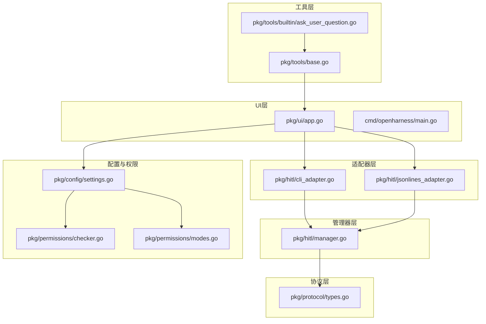
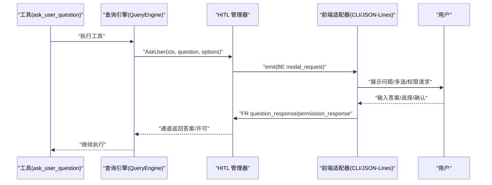
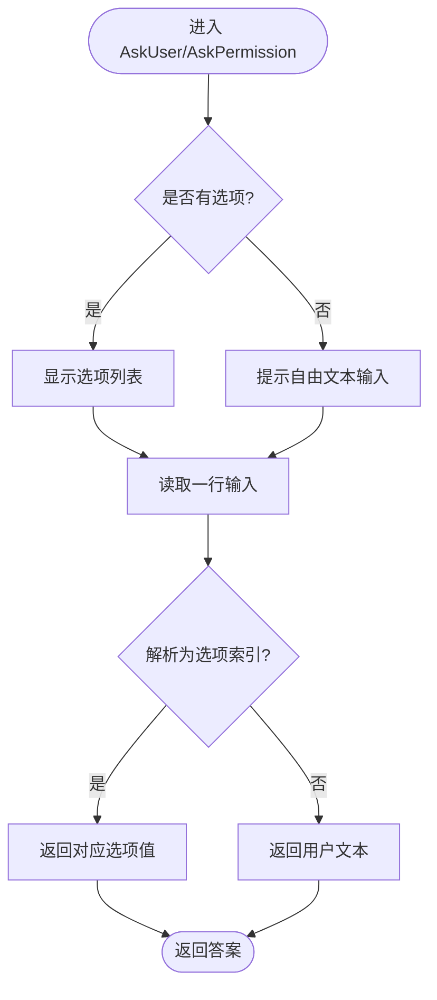
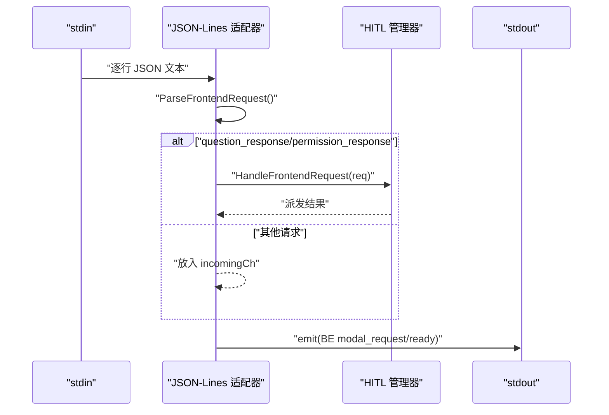
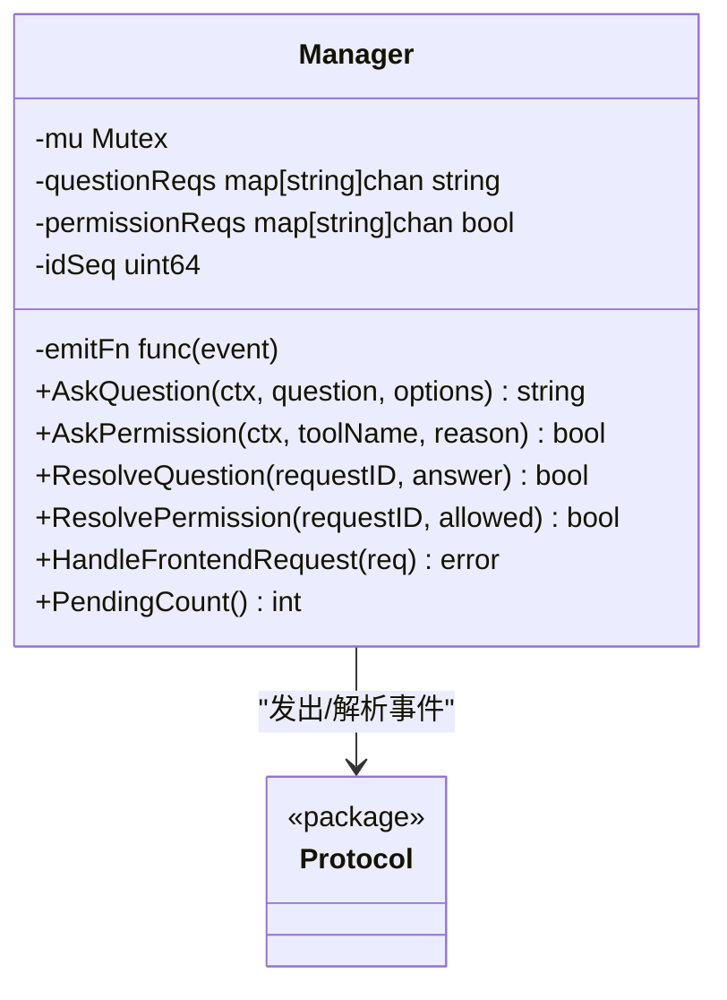
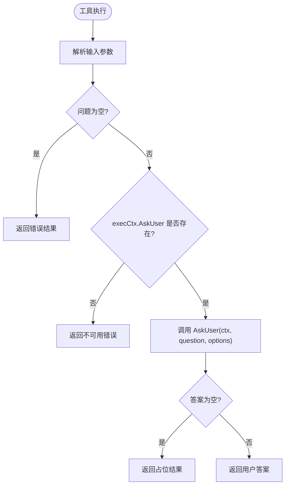
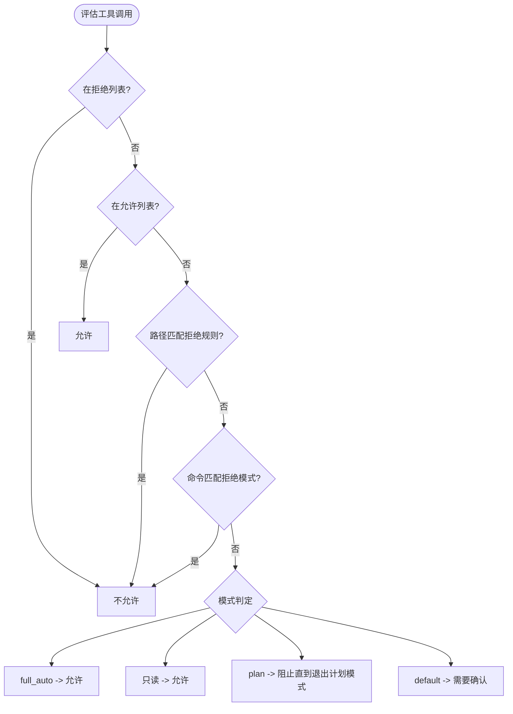
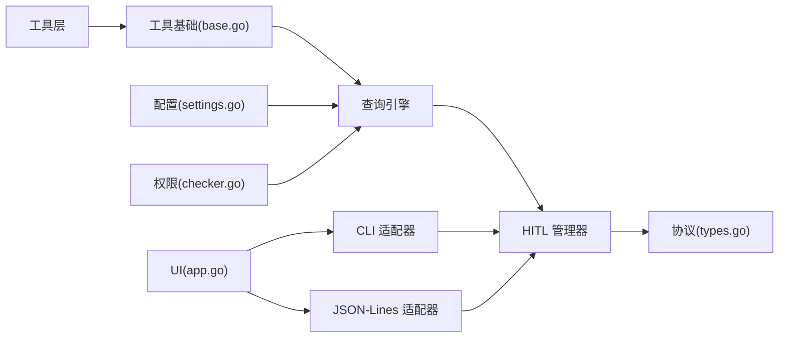

# 人机协作系统(HITL)

<cite>
**本文档引用的文件**
- [cli_adapter.go](file://pkg/hitl/cli_adapter.go)
- [jsonlines_adapter.go](file://pkg/hitl/jsonlines_adapter.go)
- [manager.go](file://pkg/hitl/manager.go)
- [types.go](file://pkg/protocol/types.go)
- [ask_user_question.go](file://pkg/tools/builtin/ask_user_question.go)
- [base.go](file://pkg/tools/base.go)
- [app.go](file://pkg/ui/app.go)
- [settings.go](file://pkg/config/settings.go)
- [checker.go](file://pkg/permissions/checker.go)
- [modes.go](file://pkg/permissions/modes.go)
- [Human-In-The-Loop.md](file://design/Human-In-The-Loop.md)
- [TASK.md](file://design/TASK.md)
- [main.go](file://cmd/openharness/main.go)
</cite>

## 目录
1. [简介](#简介)
2. [项目结构](#项目结构)
3. [核心组件](#核心组件)
4. [架构总览](#架构总览)
5. [详细组件分析](#详细组件分析)
6. [依赖关系分析](#依赖关系分析)
7. [性能考量](#性能考量)
8. [故障排除指南](#故障排除指南)
9. [结论](#结论)
10. [附录](#附录)

## 简介
本文件面向开发者与使用者，系统性阐述 openharness-go 的人机协作系统（Human-In-The-Loop, HITL）的设计与实现。HITL 使智能体在执行可能影响环境的操作前，能够暂停并与人类进行交互，以获得必要的确认、选择或输入。该系统支持两类前端适配器：命令行界面（CLI）适配器与 JSON-Lines 协议适配器；同时提供统一的权限管理与问题询问流程，确保在不同运行模式（REPL、非交互打印、JSON-Lines）下的一致行为。

## 项目结构
HITL 相关代码主要分布在以下模块：
- 协议层：定义前后端通信的事件与请求类型，独立于 UI/引擎，避免循环依赖
- 适配器层：CLI 与 JSON-Lines 两种前端适配器，负责与用户交互
- 管理器层：统一调度与路由用户响应，维护请求生命周期
- 工具层：内置 ask_user_question 工具，供智能体在需要时触发人机交互
- 配置与权限：设置加载、权限模式与规则评估
- UI 层：REPL 与 JSON-Lines 模式的入口与运行时注入

图表来源
- [cli_adapter.go:1-102](file://pkg/hitl/cli_adapter.go#L1-L102)
- [jsonlines_adapter.go:1-96](file://pkg/hitl/jsonlines_adapter.go#L1-L96)
- [manager.go:1-148](file://pkg/hitl/manager.go#L1-L148)
- [types.go:1-102](file://pkg/protocol/types.go#L1-L102)
- [ask_user_question.go:1-80](file://pkg/tools/builtin/ask_user_question.go#L1-L80)
- [base.go:1-132](file://pkg/tools/base.go#L1-L132)
- [app.go:1-238](file://pkg/ui/app.go#L1-L238)
- [settings.go:1-212](file://pkg/config/settings.go#L1-L212)
- [checker.go:1-92](file://pkg/permissions/checker.go#L1-L92)
- [modes.go:1-28](file://pkg/permissions/modes.go#L1-L28)
- [main.go:1-299](file://cmd/openharness/main.go#L1-L299)

章节来源
- [Human-In-The-Loop.md:1-120](file://design/Human-In-The-Loop.md#L1-L120)
- [TASK.md:1-120](file://design/TASK.md#L1-L120)

## 核心组件
- 协议类型：定义后端事件（如 modal_request）与前端请求（如 question_response、permission_response），以及模态信息结构
- 管理器：为一次会话跟踪待处理的“问题”与“权限”请求，通过通道实现阻塞等待与结果派发
- CLI 适配器：在 REPL 模式下通过标准输入输出与用户交互，支持多选题与自由文本
- JSON-Lines 适配器：在 TUI/IDE 或远程场景下，通过 JSON-Lines 协议双向通信
- 问题工具：ask_user_question 工具，封装了向用户提问的能力，支持多选题与自由文本
- 权限系统：基于模式与规则的工具执行控制，必要时触发权限请求

章节来源
- [types.go:14-102](file://pkg/protocol/types.go#L14-L102)
- [manager.go:11-148](file://pkg/hitl/manager.go#L11-L148)
- [cli_adapter.go:12-102](file://pkg/hitl/cli_adapter.go#L12-L102)
- [jsonlines_adapter.go:14-96](file://pkg/hitl/jsonlines_adapter.go#L14-L96)
- [ask_user_question.go:12-80](file://pkg/tools/builtin/ask_user_question.go#L12-L80)
- [checker.go:23-92](file://pkg/permissions/checker.go#L23-L92)

## 架构总览
HITL 的核心流程如下：
- 工具在执行过程中需要用户输入或权限确认时，通过注入的回调（AskUser/AskPermission）发起请求
- 管理器为每个请求生成唯一 ID，并通过协议事件通知前端
- 前端适配器接收事件并呈现给用户，收集响应后通过协议发送回后端
- 管理器根据请求 ID 将响应派发到对应的等待通道，解除阻塞

图表来源
- [ask_user_question.go:56-80](file://pkg/tools/builtin/ask_user_question.go#L56-L80)
- [manager.go:33-90](file://pkg/hitl/manager.go#L33-L90)
- [cli_adapter.go:22-68](file://pkg/hitl/cli_adapter.go#L22-L68)
- [jsonlines_adapter.go:34-96](file://pkg/hitl/jsonlines_adapter.go#L34-L96)
- [types.go:144-230](file://pkg/protocol/types.go#L144-L230)

章节来源
- [Human-In-The-Loop.md:14-122](file://design/Human-In-The-Loop.md#L14-L122)

## 详细组件分析

### CLI 适配器
- 设计目标：在 REPL 模式下提供简洁、直观的人机交互体验
- 交互特性：
  - 问题展示：支持多选题与自由文本输入
  - 权限请求：y/n 确认
  - 输入读取：异步扫描 stdin，支持 context 取消
- 错误处理：读取失败或 EOF 时返回明确错误；超时由 context 控制

图表来源
- [cli_adapter.go:22-68](file://pkg/hitl/cli_adapter.go#L22-L68)

章节来源
- [cli_adapter.go:12-102](file://pkg/hitl/cli_adapter.go#L12-L102)

### JSON-Lines 适配器
- 设计目标：为 TUI/IDE 或远程前端提供结构化协议支持
- 协议处理：
  - 读取 JSON-Lines 行，解析为前端请求
  - 对 question_response/permission_response 请求交由管理器处理
  - 其他请求放入 incomingCh 通道供上层消费
- 发送能力：通过 emitFn 将后端事件（如 ready、modal_request）发送到前端

图表来源
- [jsonlines_adapter.go:34-96](file://pkg/hitl/jsonlines_adapter.go#L34-L96)
- [types.go:205-230](file://pkg/protocol/types.go#L205-L230)

章节来源
- [jsonlines_adapter.go:14-96](file://pkg/hitl/jsonlines_adapter.go#L14-L96)

### 管理器（HITL 管理器）
- 职责：为一次会话维护问题与权限请求的映射，生成请求 ID，阻塞等待前端响应
- 数据结构：两个映射表分别保存问题与权限请求的通道
- 生命周期：
  - AskQuestion/AskPermission：注册请求、生成 ID、发出 modal_request 事件
  - ResolveQuestion/ResolvePermission：根据请求 ID 派发结果
  - HandleFrontendRequest：路由前端响应，校验请求 ID 并派发
- 并发安全：使用互斥锁保护映射表访问

图表来源
- [manager.go:11-148](file://pkg/hitl/manager.go#L11-L148)
- [types.go:144-230](file://pkg/protocol/types.go#L144-L230)

章节来源
- [manager.go:11-148](file://pkg/hitl/manager.go#L11-L148)

### 问题工具（ask_user_question）
- 能力：向用户提问，支持多选题与自由文本
- 触发条件：当 execCtx.AskUser 为 nil 时，工具返回“当前会话不可交互”的错误结果
- 输入校验：问题不能为空；空回答返回占位结果

图表来源
- [ask_user_question.go:56-80](file://pkg/tools/builtin/ask_user_question.go#L56-L80)
- [base.go:11-27](file://pkg/tools/base.go#L11-L27)

章节来源
- [ask_user_question.go:12-80](file://pkg/tools/builtin/ask_user_question.go#L12-L80)
- [base.go:11-27](file://pkg/tools/base.go#L11-L27)

### 权限管理机制
- 模式与规则：
  - 模式：default、plan、full_auto
  - 工具白/黑名单：显式允许/拒绝
  - 路径规则：基于通配符的路径允许/拒绝
  - 命令模式：基于通配符的命令拒绝
- 决策流程：优先匹配显式规则，其次依据模式判断是否需要确认
- 与 HITL 的结合：当工具为非只读且需要确认时，通过 AskPermission 触发权限请求

图表来源
- [checker.go:41-82](file://pkg/permissions/checker.go#L41-L82)
- [modes.go:4-17](file://pkg/permissions/modes.go#L4-L17)
- [settings.go:34-55](file://pkg/config/settings.go#L34-L55)

章节来源
- [checker.go:23-92](file://pkg/permissions/checker.go#L23-L92)
- [modes.go:4-28](file://pkg/permissions/modes.go#L4-L28)
- [settings.go:34-55](file://pkg/config/settings.go#L34-L55)

### 问题询问流程与用户确认过程
- 问题询问：工具调用 AskUser，管理器发出 modal_request，前端展示问题与选项，用户输入后前端发送 question_response
- 权限确认：工具调用 AskPermission，管理器发出 modal_request，前端展示工具名与原因，用户确认后发送 permission_response
- 取消支持：通过 context 取消，管理器清理未决请求

章节来源
- [manager.go:33-90](file://pkg/hitl/manager.go#L33-L90)
- [cli_adapter.go:70-102](file://pkg/hitl/cli_adapter.go#L70-L102)
- [jsonlines_adapter.go:34-96](file://pkg/hitl/jsonlines_adapter.go#L34-L96)
- [types.go:144-230](file://pkg/protocol/types.go#L144-L230)

### 集成方案与配置示例
- REPL 模式（CLI）：通过 WithHITLCallbacks 注入 CLIAdapter 的 AskUser/AskPermission，启动 REPL
- JSON-Lines 模式：通过 WithHITLCallbacks 注入 Manager 的 AskQuestion/AskPermission，启动 JSON-Lines 会话
- 配置文件：支持权限模式、工具白/黑名单、路径规则、命令模式等

章节来源
- [app.go:122-238](file://pkg/ui/app.go#L122-L238)
- [main.go:42-102](file://cmd/openharness/main.go#L42-L102)
- [settings.go:94-142](file://pkg/config/settings.go#L94-L142)

## 依赖关系分析
- 协议独立：protocol 包不依赖 UI/引擎，避免循环导入
- 适配器依赖管理器：CLI/JSON-Lines 适配器通过管理器统一路由
- 工具依赖注入：工具通过 ToolExecutionContext 获取 AskUser/AskPermission
- UI 注入：UI 层通过 WithHITLCallbacks 将适配器/管理器注入到引擎

图表来源
- [base.go:11-27](file://pkg/tools/base.go#L11-L27)
- [app.go:122-238](file://pkg/ui/app.go#L122-L238)
- [cli_adapter.go:12-20](file://pkg/hitl/cli_adapter.go#L12-L20)
- [jsonlines_adapter.go:14-32](file://pkg/hitl/jsonlines_adapter.go#L14-L32)
- [manager.go:11-26](file://pkg/hitl/manager.go#L11-L26)
- [types.go:1-102](file://pkg/protocol/types.go#L1-L102)
- [settings.go:94-142](file://pkg/config/settings.go#L94-L142)
- [checker.go:23-92](file://pkg/permissions/checker.go#L23-L92)

章节来源
- [Human-In-The-Loop.md:81-93](file://design/Human-In-The-Loop.md#L81-L93)

## 性能考量
- 通道与互斥：管理器使用互斥锁与缓冲通道，保证并发安全与低延迟
- JSON-Lines 读取优化：Scanner 使用大缓冲区，减少系统调用开销
- 事件派发：通过 emitFn 将事件序列化后一次性写出，降低 I/O 频率
- 适用场景：
  - CLI 适配器适合本地 REPL，交互简单、延迟低
  - JSON-Lines 适配器适合 TUI/IDE/远程场景，协议清晰、扩展性强

章节来源
- [manager.go:11-26](file://pkg/hitl/manager.go#L11-L26)
- [jsonlines_adapter.go:34-50](file://pkg/hitl/jsonlines_adapter.go#L34-L50)

## 故障排除指南
- 无法读取用户输入（CLI）
  - 检查 stdin 是否可用；确认适配器 reader/writer 正确初始化
  - 查看返回的错误信息，定位读取失败原因
- JSON-Lines 协议错误
  - 前端发送的请求格式不正确时，适配器会发出 BEError 事件
  - 检查请求类型与字段是否符合协议定义
- 请求 ID 未知
  - 管理器在收到未知请求 ID 时会返回错误，检查前端是否正确携带 request_id
- 权限拒绝
  - 检查权限模式与规则配置，确认工具是否在允许列表或路径规则匹配
- 超时/取消
  - 确保在工具执行链路中正确传递 context，以便及时响应取消

章节来源
- [cli_adapter.go:451-455](file://pkg/hitl/cli_adapter.go#L451-L455)
- [jsonlines_adapter.go:552-567](file://pkg/hitl/jsonlines_adapter.go#L552-L567)
- [manager.go:120-142](file://pkg/hitl/manager.go#L120-L142)
- [checker.go:41-82](file://pkg/permissions/checker.go#L41-L82)

## 结论
openharness-go 的 HITL 系统通过协议抽象、适配器与管理器的解耦设计，实现了跨前端的一致交互体验。CLI 与 JSON-Lines 适配器分别覆盖本地 REPL 与 TUI/IDE/远程场景；权限系统与问题工具共同保障了安全与可控的人机协作。开发者可通过注入回调与配置策略，灵活扩展与定制 HITL 能力。

## 附录

### 适配器适用场景与性能考虑
- CLI 适配器
  - 适用：本地开发、调试、快速原型
  - 特点：交互简单、延迟低、无需网络
- JSON-Lines 适配器
  - 适用：TUI/IDE 集成、远程协作、多端前端
  - 特点：协议清晰、扩展性强、可并行处理多个请求

章节来源
- [Human-In-The-Loop.md:3-13](file://design/Human-In-The-Loop.md#L3-L13)
- [jsonlines_adapter.go:34-50](file://pkg/hitl/jsonlines_adapter.go#L34-L50)

### 安全最佳实践
- 严格控制权限模式：默认模式下对非只读工具要求确认
- 明确路径与命令规则：避免危险操作对敏感文件或系统命令的影响
- 保持最小权限原则：仅授予工具执行所需的最小权限集合
- 审计与日志：记录权限请求与用户确认，便于审计与回溯

章节来源
- [checker.go:41-82](file://pkg/permissions/checker.go#L41-L82)
- [modes.go:4-17](file://pkg/permissions/modes.go#L4-L17)

### 开发者扩展指南
- 新增前端适配器
  - 实现与管理器相同的接口，负责将 modal_request 发送到前端，并接收 question_response/permission_response
  - 通过 emitFn 将事件发送到前端，通过 incomingCh 接收其他请求
- 新增工具
  - 在工具执行上下文中使用 AskUser/AskPermission
  - 通过 ToolExecutionContext 注入回调，确保在不同运行模式下行为一致
- 集成 UI
  - 在 UI 层通过 WithHITLCallbacks 注入适配器/管理器回调
  - 根据运行模式选择 CLI 或 JSON-Lines 适配器

章节来源
- [base.go:11-27](file://pkg/tools/base.go#L11-L27)
- [app.go:122-238](file://pkg/ui/app.go#L122-L238)
- [jsonlines_adapter.go:34-96](file://pkg/hitl/jsonlines_adapter.go#L34-L96)