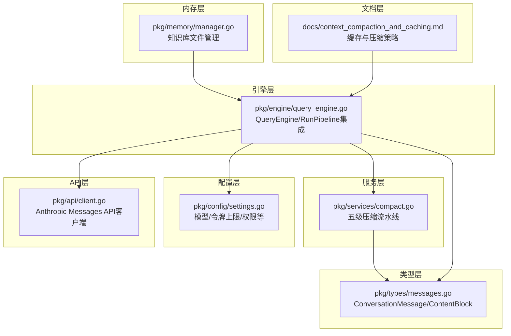
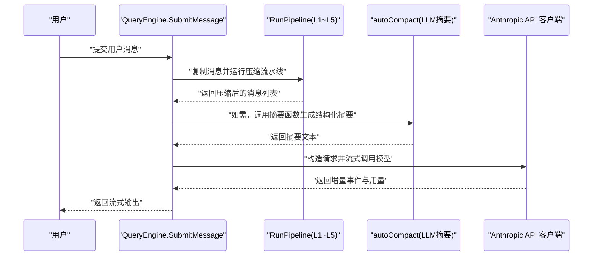
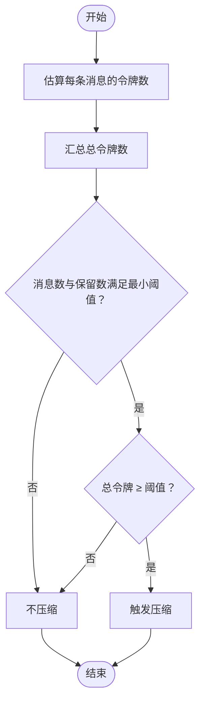
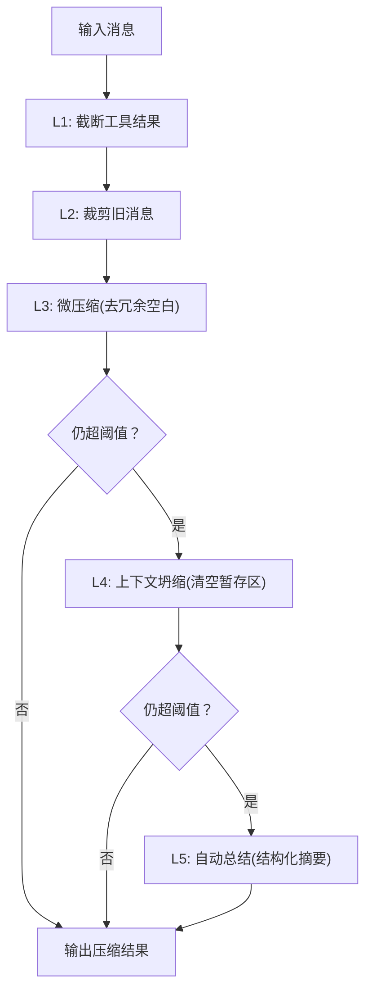
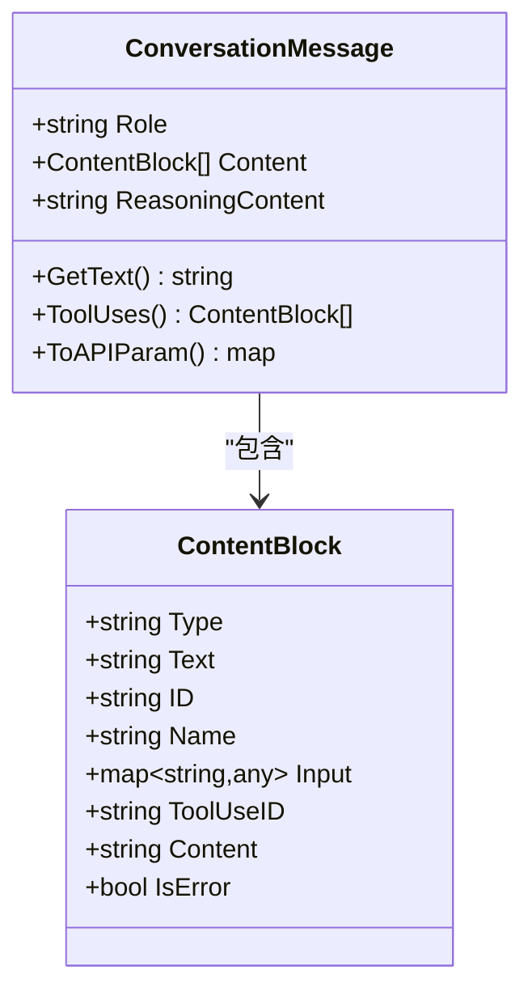
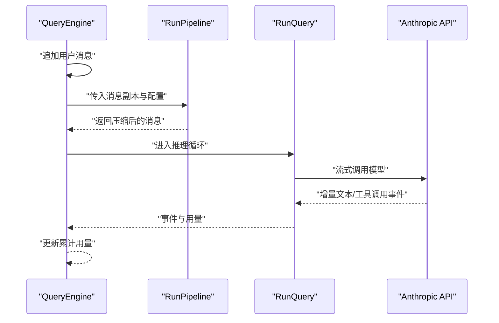
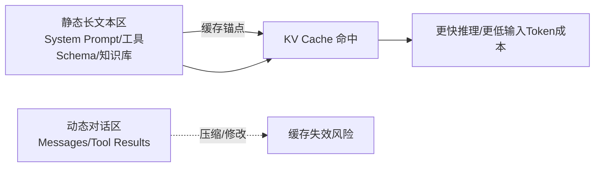
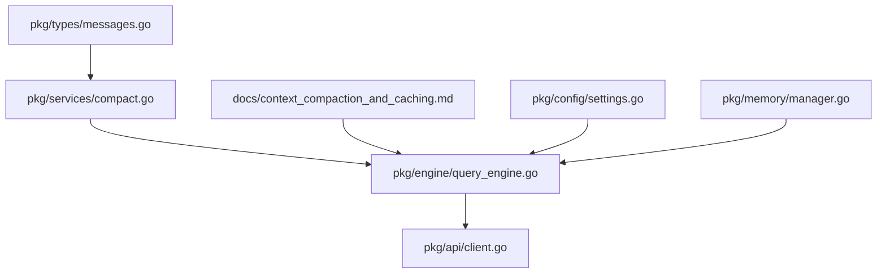

# 上下文压缩算法

<cite>
**本文引用的文件**
- [docs/context_compaction_and_caching.md](file://docs/context_compaction_and_caching.md)
- [pkg/services/compact.go](file://pkg/services/compact.go)
- [pkg/timeseries/compact.go](file://einoagent/compact/compact.go)
- [pkg/types/messages.go](file://pkg/types/messages.go)
- [pkg/engine/query_engine.go](file://pkg/engine/query_engine.go)
- [pkg/memory/manager.go](file://pkg/memory/manager.go)
- [pkg/config/settings.go](file://pkg/config/settings.go)
- [pkg/api/client.go](file://pkg/api/client.go)
- [pkg/timeseries/types.go](file://pkg/timeseries/types.go)
</cite>

## 目录
1. [引言](#引言)
2. [项目结构](#项目结构)
3. [核心组件](#核心组件)
4. [架构总览](#架构总览)
5. [详细组件分析](#详细组件分析)
6. [依赖关系分析](#依赖关系分析)
7. [性能考量](#性能考量)
8. [故障排查指南](#故障排查指南)
9. [结论](#结论)
10. [附录](#附录)

## 引言
本文件围绕上下文压缩算法展开，系统阐述其概念、触发条件、实现流程与质量保障策略，并结合仓库现有实现解析数据选择策略、长度控制机制与缓存兼容方案。文档同时给出压缩前后的对比示例思路、性能测试建议、缓存机制与失效策略、参数调优指南与最佳实践，以及对系统性能的影响与优化策略。

## 项目结构
本项目在服务层提供完整的五级渐进式上下文压缩流水线，在类型层抽象消息与内容块，在引擎层集成压缩与调用大模型，文档层提供与缓存机制的对齐建议。关键模块如下：
- 服务层：上下文压缩流水线与令牌估算
- 类型层：消息与内容块的数据结构
- 引擎层：压缩前置调用与流式响应处理
- 文档层：缓存与压缩的协同策略
- 内存层：知识库注入与检索辅助
- 配置层：模型与令牌上限等全局设置
- API 层：Anthropic Messages API 客户端

**图表来源**
- [pkg/services/compact.go:74-115](file://pkg/services/compact.go#L74-L115)
- [pkg/types/messages.go:62-67](file://pkg/types/messages.go#L62-L67)
- [pkg/engine/query_engine.go:143-172](file://pkg/engine/query_engine.go#L143-L172)
- [docs/context_compaction_and_caching.md:70-76](file://docs/context_compaction_and_caching.md#L70-L76)
- [pkg/memory/manager.go:72-90](file://pkg/memory/manager.go#L72-L90)
- [pkg/config/settings.go:98-125](file://pkg/config/settings.go#L98-L125)
- [pkg/api/client.go:43-47](file://pkg/api/client.go#L43-L47)

**章节来源**
- [pkg/services/compact.go:1-330](file://pkg/services/compact.go#L1-L330)
- [pkg/types/messages.go:1-169](file://pkg/types/messages.go#L1-L169)
- [pkg/engine/query_engine.go:1-247](file://pkg/engine/query_engine.go#L1-L247)
- [docs/context_compaction_and_caching.md:1-77](file://docs/context_compaction_and_caching.md#L1-L77)
- [pkg/memory/manager.go:1-124](file://pkg/memory/manager.go#L1-L124)
- [pkg/config/settings.go:1-212](file://pkg/config/settings.go#L1-L212)
- [pkg/api/client.go:1-128](file://pkg/api/client.go#L1-L128)

## 核心组件
- 五级压缩流水线（L1~L5）
  - L1：工具结果预算截断（原地尾部保留）
  - L2：旧消息掏空中间、保留头尾
  - L3：微压缩（去除冗余空白）
  - L4：上下文坍缩（暂存区清空，永久丢弃）
  - L5：自动总结（结构化摘要，替换历史）
- 令牌估算与触发
  - 基于内容块类型分别估算（文本、tool_result、tool_use）
  - 通过阈值与触发比例判定是否压缩
- 数据结构
  - ContentBlock：text/tool_use/tool_result 三态联合
  - ConversationMessage：角色 + 内容块数组
- 引擎集成
  - 提交消息后先运行压缩流水线，再进入推理循环
  - 支持可选的摘要函数（LLM 总结）

**章节来源**
- [pkg/services/compact.go:74-115](file://pkg/services/compact.go#L74-L115)
- [pkg/services/compact.go:41-72](file://pkg/services/compact.go#L41-L72)
- [pkg/types/messages.go:15-67](file://pkg/types/messages.go#L15-L67)
- [pkg/engine/query_engine.go:143-172](file://pkg/engine/query_engine.go#L143-L172)

## 架构总览
下图展示压缩算法在引擎中的调用序列与数据流：

**图表来源**
- [pkg/engine/query_engine.go:124-205](file://pkg/engine/query_engine.go#L124-L205)
- [pkg/services/compact.go:74-115](file://pkg/services/compact.go#L74-L115)
- [pkg/services/compact.go:243-298](file://pkg/services/compact.go#L243-L298)
- [pkg/api/client.go:106-128](file://pkg/api/client.go#L106-L128)

## 详细组件分析

### 1. 令牌估算与触发条件
- 令牌估算
  - 文本：按字符长度粗估
  - tool_result：按内容长度粗估
  - tool_use：按名称与输入 JSON 序列化长度粗估
  - 每条消息额外加固定估算值
- 触发条件
  - 当消息总数与保留近期条数满足最小阈值后，累计估算超过阈值即触发
- 参数
  - MinMessages、TokenThreshold、PreserveRecent、MaxToolResultChars、SnipMaxChars

**图表来源**
- [pkg/services/compact.go:41-72](file://pkg/services/compact.go#L41-L72)
- [pkg/services/compact.go:32-59](file://pkg/services/compact.go#L32-L59)

**章节来源**
- [pkg/services/compact.go:12-30](file://pkg/services/compact.go#L12-L30)
- [pkg/services/compact.go:32-59](file://pkg/services/compact.go#L32-L59)
- [pkg/services/compact.go:61-72](file://pkg/services/compact.go#L61-L72)

### 2. 五级压缩流水线（L1~L5）
- L1：工具结果预算截断
  - 对 tool_result 超过阈值的块，保留尾部并替换头部为截断提示
- L2：旧消息裁剪
  - 对非保留区消息，保留头尾各半预算字符，中间替换为占位
- L3：微压缩
  - 合并连续空行，去除冗余空白
- L4：上下文坍缩
  - 将旧消息移入暂存区并在必要时清空，永久丢弃
- L5：自动总结
  - 使用摘要函数生成结构化摘要，替换历史消息并保留近期消息

**图表来源**
- [pkg/services/compact.go:74-115](file://pkg/services/compact.go#L74-L115)
- [pkg/services/compact.go:130-172](file://pkg/services/compact.go#L130-L172)
- [pkg/services/compact.go:174-205](file://pkg/services/compact.go#L174-L205)
- [pkg/services/compact.go:207-241](file://pkg/services/compact.go#L207-L241)
- [pkg/services/compact.go:243-298](file://pkg/services/compact.go#L243-L298)

**章节来源**
- [pkg/services/compact.go:74-115](file://pkg/services/compact.go#L74-L115)
- [pkg/services/compact.go:130-172](file://pkg/services/compact.go#L130-L172)
- [pkg/services/compact.go:174-205](file://pkg/services/compact.go#L174-L205)
- [pkg/services/compact.go:207-241](file://pkg/services/compact.go#L207-L241)
- [pkg/services/compact.go:243-298](file://pkg/services/compact.go#L243-L298)

### 3. 数据结构与内容块
- ContentBlock
  - text：文本内容
  - tool_use：包含 id/name/input
  - tool_result：包含 tool_use_id/content/is_error
- ConversationMessage
  - Role + Content（ContentBlock 列表）
  - 提供 API 序列化与反序列化方法

**图表来源**
- [pkg/types/messages.go:15-67](file://pkg/types/messages.go#L15-L67)
- [pkg/types/messages.go:77-109](file://pkg/types/messages.go#L77-L109)

**章节来源**
- [pkg/types/messages.go:15-67](file://pkg/types/messages.go#L15-L67)
- [pkg/types/messages.go:77-109](file://pkg/types/messages.go#L77-L109)

### 4. 引擎集成与调用链
- QueryEngine 在提交消息后，先深拷贝消息，运行压缩流水线，再进入推理循环
- 支持可选摘要函数（LLM 总结），用于 L5 阶段
- 流式输出事件携带用量统计，便于成本追踪

**图表来源**
- [pkg/engine/query_engine.go:124-205](file://pkg/engine/query_engine.go#L124-L205)

**章节来源**
- [pkg/engine/query_engine.go:124-205](file://pkg/engine/query_engine.go#L124-L205)

### 5. 缓存机制与失效策略
- 文档建议采用“静态长文本区 + 动态对话区”的结构化前缀设计
- 在静态长文本区末尾打上缓存锚点（如 ephermal），确保 KV Cache 不受动态区压缩影响
- 高阈值与低频触发：在接近红线前集中压缩，避免频繁缓存失效
- L5 总结带来“重生”：以全新短前缀开启新会话，重享缓存红利

**图表来源**
- [docs/context_compaction_and_caching.md:37-76](file://docs/context_compaction_and_caching.md#L37-L76)

**章节来源**
- [docs/context_compaction_and_caching.md:37-76](file://docs/context_compaction_and_caching.md#L37-L76)

### 6. 与时间序列压缩的差异（einoagent）
- einoagent 的压缩更偏向“摘要模型 + 简易截断”，保留首条 system 与近期若干消息，其余通过摘要模型生成单条摘要消息插入到 system 之后
- 估算方式采用 4 字符/token 的经验法，触发条件为达到阈值的触发比例
- 该实现更轻量，适合快速原型与小规模场景

**章节来源**
- [einoagent/compact/compact.go:1-137](file://einoagent/compact/compact.go#L1-L137)

## 依赖关系分析
- 服务层依赖类型层的消息与内容块结构
- 引擎层依赖服务层的压缩流水线与 API 客户端
- 文档层提供缓存策略指导，建议在类型层扩展缓存控制字段并在引擎层打标
- 配置层提供模型与令牌上限等全局参数

**图表来源**
- [pkg/types/messages.go:62-67](file://pkg/types/messages.go#L62-L67)
- [pkg/services/compact.go:74-115](file://pkg/services/compact.go#L74-L115)
- [pkg/engine/query_engine.go:143-172](file://pkg/engine/query_engine.go#L143-L172)
- [docs/context_compaction_and_caching.md:70-76](file://docs/context_compaction_and_caching.md#L70-L76)
- [pkg/config/settings.go:98-125](file://pkg/config/settings.go#L98-L125)
- [pkg/memory/manager.go:72-90](file://pkg/memory/manager.go#L72-L90)

**章节来源**
- [pkg/types/messages.go:1-169](file://pkg/types/messages.go#L1-L169)
- [pkg/services/compact.go:1-330](file://pkg/services/compact.go#L1-L330)
- [pkg/engine/query_engine.go:1-247](file://pkg/engine/query_engine.go#L1-L247)
- [docs/context_compaction_and_caching.md:1-77](file://docs/context_compaction_and_caching.md#L1-L77)
- [pkg/config/settings.go:1-212](file://pkg/config/settings.go#L1-L212)
- [pkg/memory/manager.go:1-124](file://pkg/memory/manager.go#L1-L124)

## 性能考量
- 令牌估算的准确性
  - 粗估法在大规模消息时可能偏差较大，建议在关键阈值附近引入更精确的估算或采样校准
- 压缩频率与粒度
  - 高阈值与低频触发可降低缓存失效概率，但会增加峰值占用；应根据业务对话长度分布权衡
- L5 摘要的成本
  - 结构化摘要会消耗一定输入/输出 Token，建议在对话体量极大时启用，并评估收益
- 缓存策略
  - 通过静态/动态分离与缓存锚点，最大化前缀命中率，显著降低重算成本

[本节为通用性能讨论，无需特定文件来源]

## 故障排查指南
- 压缩未生效
  - 检查消息数量与保留近期条数是否满足最小阈值
  - 核对令牌估算与阈值配置是否合理
- L5 摘要失败
  - 确认摘要函数可用且返回有效文本
  - 关注摘要提示词与格式约束是否被模型遵循
- 缓存命中异常
  - 确认静态长文本区末尾已打上缓存锚点
  - 排查动态区是否在中间位置做了修改
- 用量统计异常
  - 确认流式事件中用量累加逻辑正确

**章节来源**
- [pkg/services/compact.go:61-72](file://pkg/services/compact.go#L61-L72)
- [pkg/services/compact.go:243-298](file://pkg/services/compact.go#L243-L298)
- [pkg/engine/query_engine.go:191-202](file://pkg/engine/query_engine.go#L191-L202)

## 结论
本项目实现了完整的五级渐进式上下文压缩流水线，结合令牌估算与触发机制，在保证推理质量的同时有效控制上下文长度。通过与缓存策略的协同设计（静态/动态分离、缓存锚点、高阈值低频触发、L5 总结“重生”），可在工程化场景中实现更高的缓存命中率与更低的推理成本。建议在后续版本中增强类型层对缓存控制字段的支持，并在引擎层实施打标策略，以进一步对齐工业级标准。

[本节为总结，无需特定文件来源]

## 附录

### A. 压缩前后对比示例（思路）
- 输入示例
  - 多轮对话 + 大量工具结果 + 长文本日志
- L1 截断
  - 工具结果尾部保留，头部替换为截断提示
- L2 裁剪
  - 旧消息保留头尾，中间替换为占位
- L3 微压缩
  - 合并空行，去除冗余空白
- L4 坍缩
  - 暂存区清空，永久丢弃
- L5 总结
  - 生成结构化摘要，替换历史，保留近期消息

[本节为概念性示例，无需特定文件来源]

### B. 性能测试数据（建议）
- 测试维度
  - Token 估算误差、压缩耗时、缓存命中率、输入/输出 Token 成本
- 测试方法
  - 生成不同规模与结构的消息集，记录压缩前后 Token 数与成本变化
  - 对比不同阈值与触发比例下的缓存失效次数与重算成本

[本节为通用测试建议，无需特定文件来源]

### C. 参数调优指南与最佳实践
- 令牌估算
  - 根据实际模型微调估算系数，或在关键阈值附近进行采样校准
- 触发策略
  - 高阈值 + 低频触发适用于长对话；低阈值 + 高频触发适用于短对话
- L5 启用时机
  - 当历史消息体量极大且信息冗余明显时启用，注意评估摘要成本
- 缓存兼容
  - 将 System Prompt/工具Schema/知识库作为静态长文本区，末尾打上缓存锚点
  - 压缩仅作用于动态区，避免中间修改导致缓存失效

**章节来源**
- [docs/context_compaction_and_caching.md:57-76](file://docs/context_compaction_and_caching.md#L57-L76)
- [pkg/services/compact.go:12-30](file://pkg/services/compact.go#L12-L30)