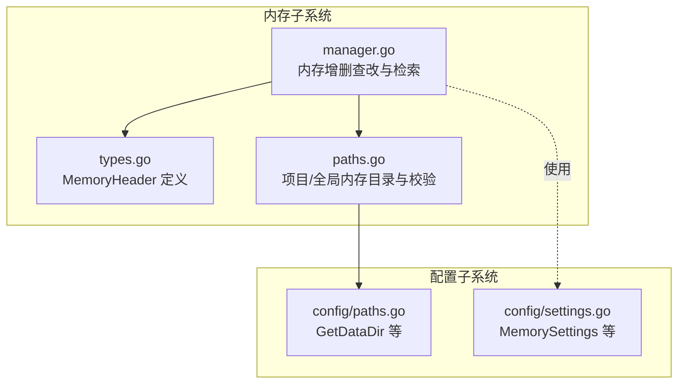
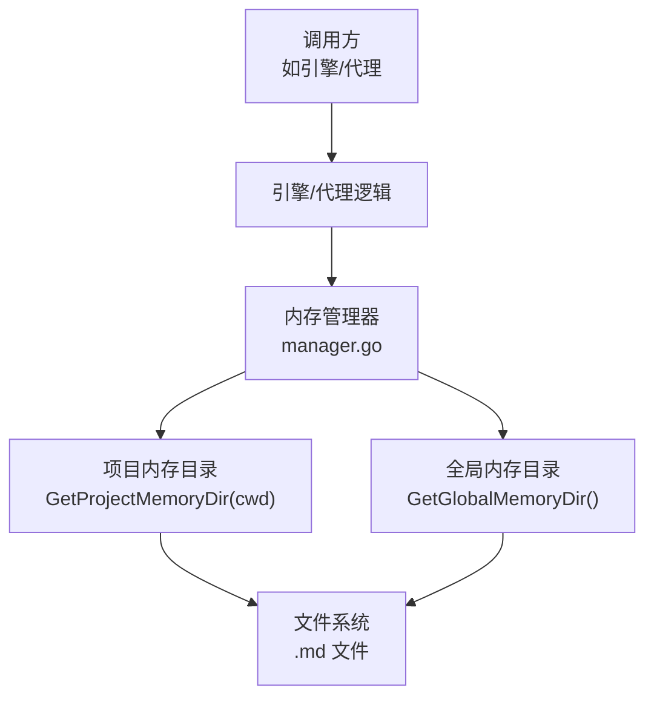
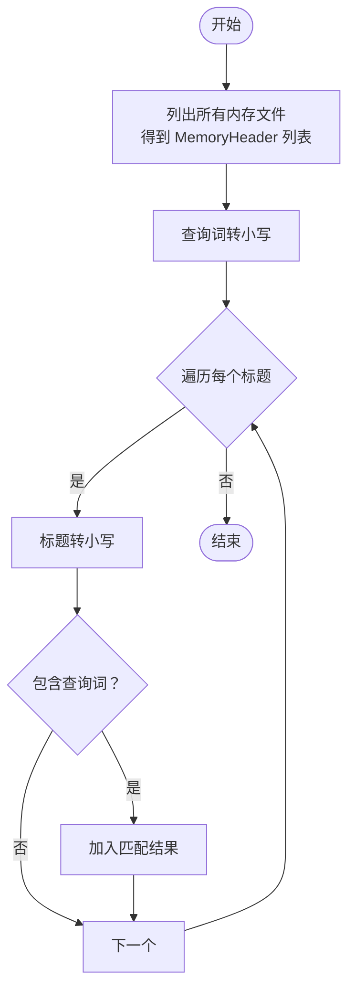
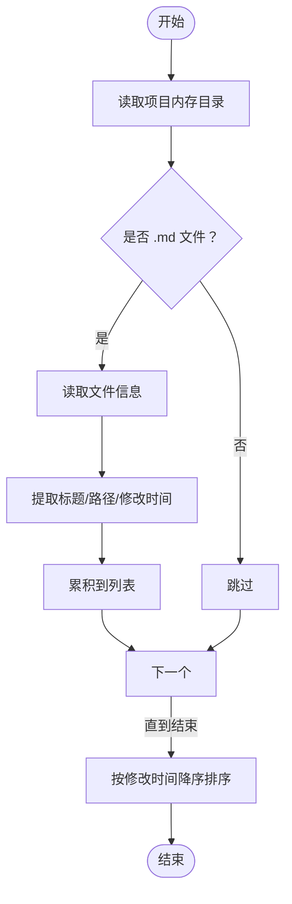
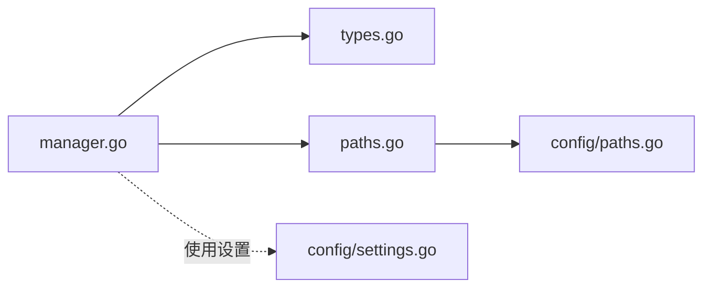

# 内存检索与查找

<cite>
**本文引用的文件**
- [pkg/memory/types.go](file://pkg/memory/types.go)
- [pkg/memory/manager.go](file://pkg/memory/manager.go)
- [pkg/memory/paths.go](file://pkg/memory/paths.go)
- [pkg/config/paths.go](file://pkg/config/paths.go)
- [pkg/config/settings.go](file://pkg/config/settings.go)
</cite>

## 目录
1. [简介](#简介)
2. [项目结构](#项目结构)
3. [核心组件](#核心组件)
4. [架构总览](#架构总览)
5. [详细组件分析](#详细组件分析)
6. [依赖关系分析](#依赖关系分析)
7. [性能考量](#性能考量)
8. [故障排查指南](#故障排查指南)
9. [结论](#结论)
10. [附录](#附录)

## 简介
本技术文档聚焦于内存检索与查找功能，围绕 FindRelevantMemories 函数展开，系统性阐述其实现原理、查找策略、大小写不敏感处理机制、排序规则、索引构建与查询优化、性能考虑与改进建议，并结合仓库现有实现说明其在整体系统中的作用与集成方式。同时提供多种查找场景的使用示例与测试建议。

## 项目结构
内存检索子系统位于 pkg/memory 目录，主要由以下模块组成：
- 类型定义：MemoryHeader，用于承载单个内存文件的元数据
- 管理器：AddMemoryEntry、RemoveMemoryEntry、ListMemoryFiles、LoadMemoryPrompt、FindRelevantMemories 等
- 路径管理：GetProjectMemoryDir、GetGlobalMemoryDir、EnsureMemoryDir
- 配置路径：GetDataDir 等，用于确定数据存储根目录

图表来源
- [pkg/memory/types.go:6-12](file://pkg/memory/types.go#L6-L12)
- [pkg/memory/manager.go:12-123](file://pkg/memory/manager.go#L12-L123)
- [pkg/memory/paths.go:12-28](file://pkg/memory/paths.go#L12-L28)
- [pkg/config/paths.go:25-28](file://pkg/config/paths.go#L25-L28)
- [pkg/config/settings.go:58-75](file://pkg/config/settings.go#L58-L75)

章节来源
- [pkg/memory/types.go:6-12](file://pkg/memory/types.go#L6-L12)
- [pkg/memory/manager.go:12-123](file://pkg/memory/manager.go#L12-L123)
- [pkg/memory/paths.go:12-28](file://pkg/memory/paths.go#L12-L28)
- [pkg/config/paths.go:25-28](file://pkg/config/paths.go#L25-L28)
- [pkg/config/settings.go:58-75](file://pkg/config/settings.go#L58-L75)

## 核心组件
- MemoryHeader：内存文件元数据载体，包含路径、标题、描述、修改时间等字段
- ListMemoryFiles：枚举项目内存目录下的所有 .md 文件，提取标题与修改时间，按修改时间降序排序
- FindRelevantMemories：基于标题进行大小写不敏感的子串匹配，返回匹配到的内存头列表
- LoadMemoryPrompt：读取全部内存文件内容，拼接为提示词字符串
- AddMemoryEntry/RemoveMemoryEntry：新增或删除内存条目，标题经清洗后作为文件名
- 项目内存目录：通过 cwd 的哈希生成项目专属目录，确保多项目隔离

章节来源
- [pkg/memory/types.go:6-12](file://pkg/memory/types.go#L6-L12)
- [pkg/memory/manager.go:36-108](file://pkg/memory/manager.go#L36-L108)
- [pkg/memory/paths.go:12-28](file://pkg/memory/paths.go#L12-L28)

## 架构总览
内存检索在系统中的位置与交互如下：

图表来源
- [pkg/memory/manager.go:36-108](file://pkg/memory/manager.go#L36-L108)
- [pkg/memory/paths.go:12-28](file://pkg/memory/paths.go#L12-L28)

## 详细组件分析

### FindRelevantMemories 实现与策略
- 查询流程
  - 先列出当前项目内存目录下所有 .md 文件，得到 MemoryHeader 列表
  - 将查询词转换为小写
  - 遍历所有标题，均转为小写后判断是否包含查询词（子串匹配）
  - 返回匹配结果列表（不排序，顺序即为遍历顺序）

- 大小写不敏感
  - 查询词与标题均转为小写后再比较，确保大小写不敏感

- 排序规则
  - 当前实现未对匹配结果进行二次排序
  - 列表本身按修改时间降序，但匹配结果仍保持遍历顺序

- 性能特征
  - 时间复杂度 O(N)，N 为内存文件数量
  - 空间复杂度 O(N)（用于暂存匹配结果）
  - 无索引：每次查询均需扫描目录并遍历标题

- 可能的优化方向
  - 建立标题到文件的倒排索引，支持前缀/模糊/正则匹配
  - 引入向量化嵌入与近似最近邻检索，实现语义相似度排序
  - 缓存最近查询结果，针对重复查询进行短路

图表来源
- [pkg/memory/manager.go:95-107](file://pkg/memory/manager.go#L95-L107)

章节来源
- [pkg/memory/manager.go:92-108](file://pkg/memory/manager.go#L92-L108)

### ListMemoryFiles 与索引构建
- 目录扫描：读取项目内存目录，过滤非 .md 文件
- 标题提取：去除扩展名作为标题
- 元数据填充：记录完整路径与修改时间
- 排序：按修改时间降序排列（最近修改的在前）

- 索引构建
  - 当前实现未建立持久化索引；每次查询重新扫描
  - 可选方案：将标题标准化（去空格、标点、统一大小写）并建立映射表，或生成前缀树/倒排索引

图表来源
- [pkg/memory/manager.go:36-70](file://pkg/memory/manager.go#L36-L70)

章节来源
- [pkg/memory/manager.go:36-70](file://pkg/memory/manager.go#L36-L70)

### LoadMemoryPrompt 与检索集成
- 功能：读取全部内存文件内容，拼接为提示词字符串
- 用途：可注入到系统提示词中，为模型提供上下文增强
- 与检索的关系：检索结果可作为选择性加载的依据，避免全量拼接带来的开销

章节来源
- [pkg/memory/manager.go:72-90](file://pkg/memory/manager.go#L72-L90)

### AddMemoryEntry/RemoveMemoryEntry 与标题清洗
- 新增：根据标题生成安全文件名（替换非法字符为下划线），若为空则使用时间戳兜底
- 删除：按标题对应的清洗后文件名删除

章节来源
- [pkg/memory/manager.go:12-34](file://pkg/memory/manager.go#L12-L34)
- [pkg/memory/manager.go:110-123](file://pkg/memory/manager.go#L110-L123)

### 项目内存目录与数据路径
- 项目内存目录：基于 cwd 的哈希生成固定长度的子目录，确保多项目隔离
- 全局内存目录：用于存放跨项目共享的记忆条目
- 数据根目录：由配置模块提供，通常位于用户主目录下的特定子目录

章节来源
- [pkg/memory/paths.go:12-28](file://pkg/memory/paths.go#L12-L28)
- [pkg/config/paths.go:25-28](file://pkg/config/paths.go#L25-L28)

## 依赖关系分析

图表来源
- [pkg/memory/manager.go:12-123](file://pkg/memory/manager.go#L12-L123)
- [pkg/memory/types.go:6-12](file://pkg/memory/types.go#L6-L12)
- [pkg/memory/paths.go:12-28](file://pkg/memory/paths.go#L12-L28)
- [pkg/config/paths.go:25-28](file://pkg/config/paths.go#L25-L28)
- [pkg/config/settings.go:58-75](file://pkg/config/settings.go#L58-L75)

章节来源
- [pkg/memory/manager.go:12-123](file://pkg/memory/manager.go#L12-L123)
- [pkg/memory/types.go:6-12](file://pkg/memory/types.go#L6-L12)
- [pkg/memory/paths.go:12-28](file://pkg/memory/paths.go#L12-L28)
- [pkg/config/paths.go:25-28](file://pkg/config/paths.go#L25-L28)
- [pkg/config/settings.go:58-75](file://pkg/config/settings.go#L58-L75)

## 性能考量
- 当前实现
  - 查询复杂度 O(N)，N 为内存文件数
  - 无索引与缓存，重复查询存在重复扫描与遍历
  - 按修改时间排序仅在列表阶段进行，不影响检索命中集

- 优化建议
  - 建立标题索引：对标题进行标准化（去空格、标点、统一大小写），构建前缀/倒排索引，支持前缀/模糊/正则匹配
  - 向量化检索：为标题与内容生成嵌入，采用近似最近邻（ANN）检索，按语义相似度排序
  - 结果缓存：对近期高频查询结果进行短期缓存，命中则直接返回
  - 分页与限制：限制返回条目数量，避免超大结果集影响响应时间
  - 并发与批处理：在批量查询场景下，利用并发读取与合并策略提升吞吐

- 查找场景示例（概念性说明）
  - 精确匹配：将查询词标准化后与标题完全一致（当前实现未提供，可通过索引扩展实现）
  - 前缀匹配：基于前缀树或字典树，快速定位以指定前缀开头的标题
  - 全文搜索：对内容建立倒排索引，支持关键词检索与评分排序
  - 语义搜索：引入嵌入模型，计算查询与标题/内容的相似度，按相似度排序

[本节为通用性能讨论，无需具体文件分析]

## 故障排查指南
- 列表为空
  - 检查项目内存目录是否存在且可读
  - 确认目录中存在 .md 文件
  - 若目录不存在，EnsureMemoryDir 会尝试创建

- 查询无结果
  - 确认查询词大小写不敏感特性
  - 检查标题是否被清洗为合法文件名（非法字符会被替换为下划线）
  - 确认标题中确实包含查询词（子串匹配）

- 权限问题
  - 确保对数据目录具有读写权限
  - 检查配置路径 GetDataDir 是否正确

章节来源
- [pkg/memory/manager.go:36-70](file://pkg/memory/manager.go#L36-L70)
- [pkg/memory/manager.go:92-108](file://pkg/memory/manager.go#L92-L108)
- [pkg/memory/paths.go:25-28](file://pkg/memory/paths.go#L25-L28)
- [pkg/config/paths.go:25-28](file://pkg/config/paths.go#L25-L28)

## 结论
当前内存检索以简单高效为主，通过标题子串匹配与按修改时间排序满足基本需求。随着项目规模增长，建议引入索引与向量化检索，以提升查询效率与语义相关性。同时配合缓存与分页策略，可在保证体验的前提下控制资源消耗。

[本节为总结性内容，无需具体文件分析]

## 附录

### 使用示例（概念性说明）
- 新增记忆条目
  - 输入：工作目录、标题、内容
  - 行为：清洗标题为安全文件名，写入 .md 文件
- 列出记忆文件
  - 输出：按修改时间降序的 MemoryHeader 列表
- 查找相关记忆
  - 输入：工作目录、查询词
  - 输出：标题包含查询词的 MemoryHeader 列表（大小写不敏感）
- 加载记忆提示
  - 输出：拼接后的纯文本提示词

章节来源
- [pkg/memory/manager.go:12-108](file://pkg/memory/manager.go#L12-L108)

### 配置与路径要点
- 数据根目录：由配置模块提供，默认位于用户主目录下的特定子目录
- 项目内存目录：基于 cwd 的哈希生成，确保多项目隔离
- 全局内存目录：用于跨项目共享的记忆条目

章节来源
- [pkg/config/paths.go:25-28](file://pkg/config/paths.go#L25-L28)
- [pkg/memory/paths.go:12-28](file://pkg/memory/paths.go#L12-L28)