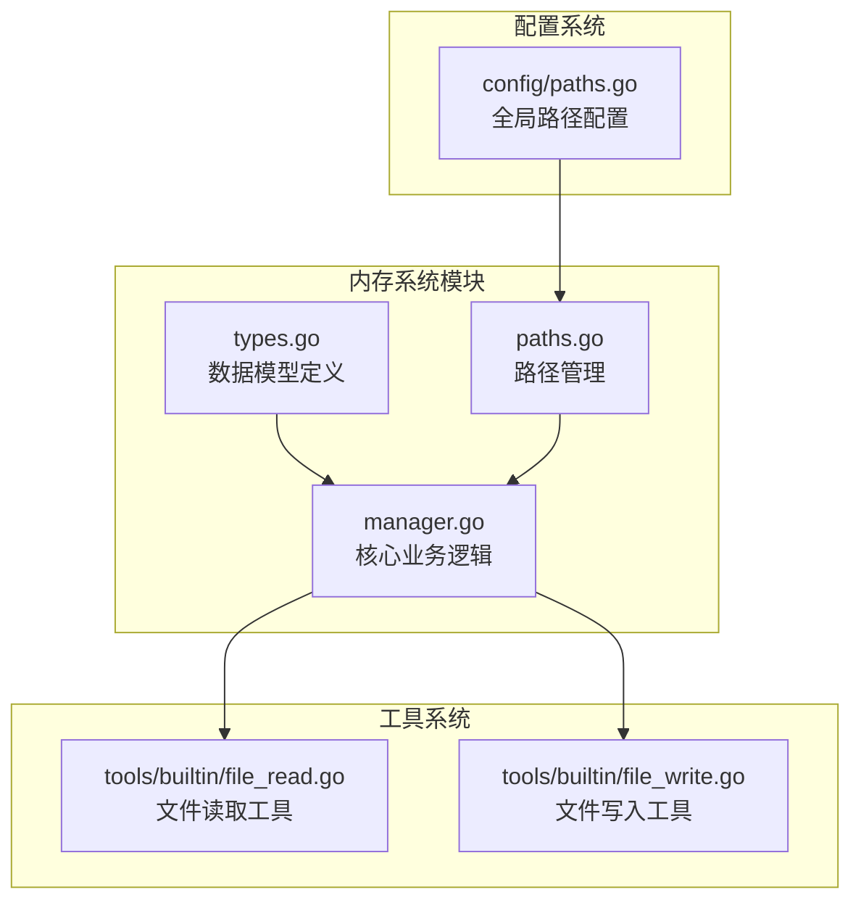
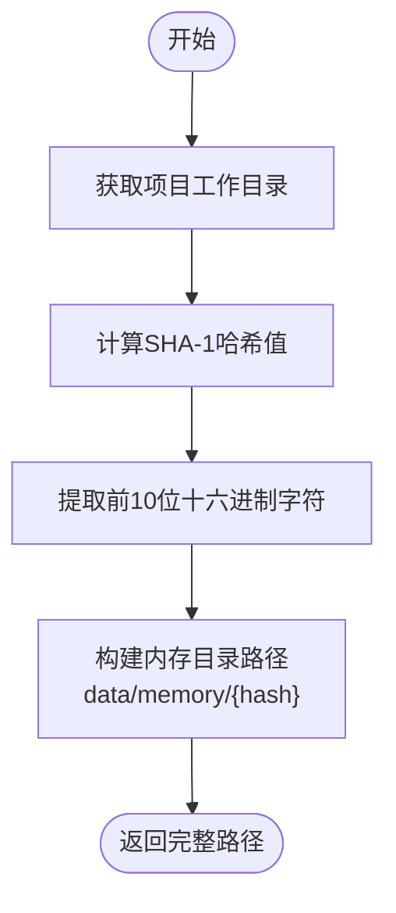
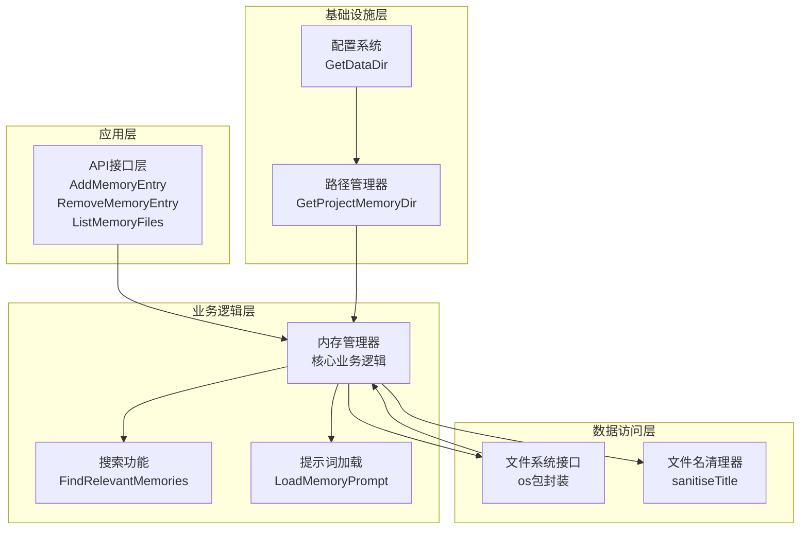
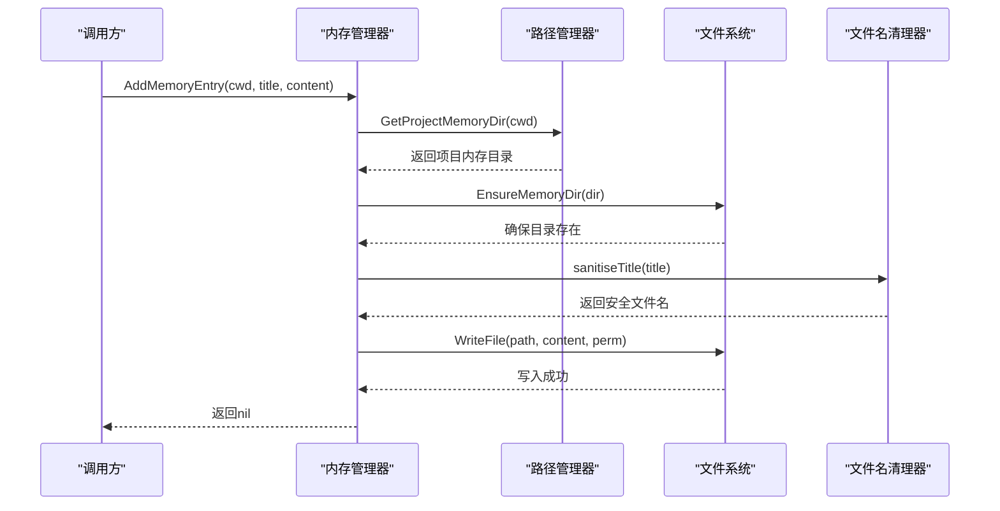
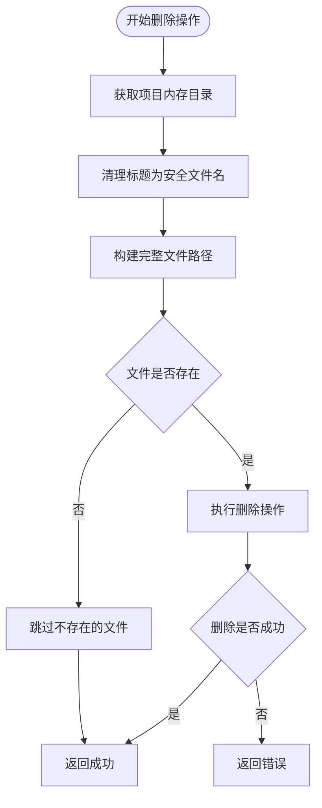
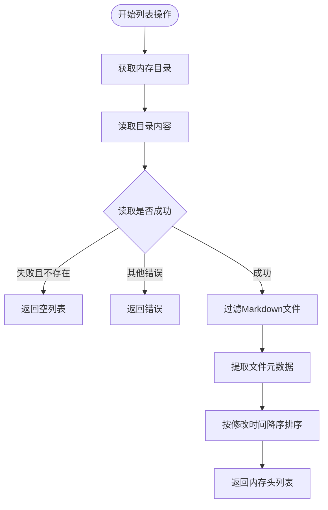
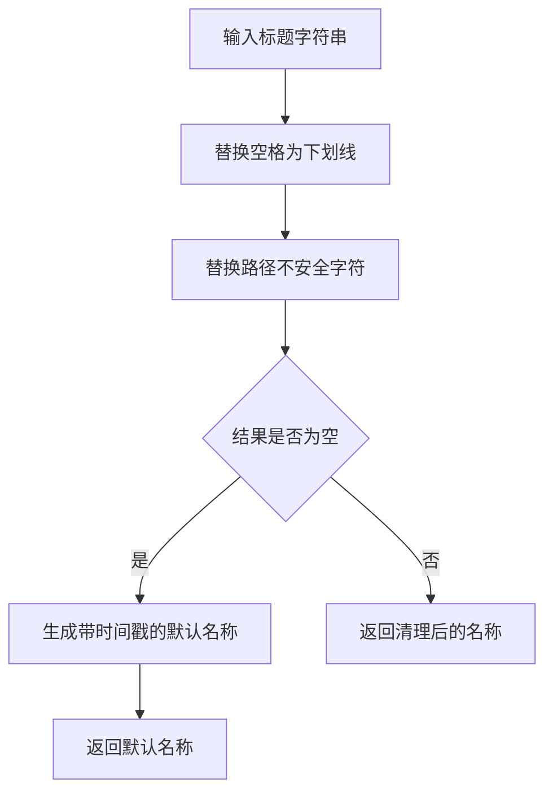
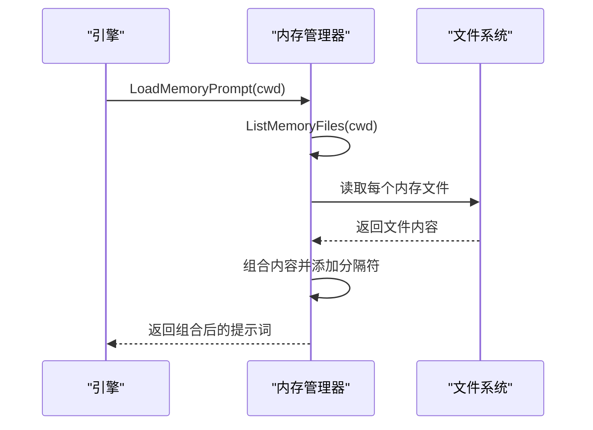
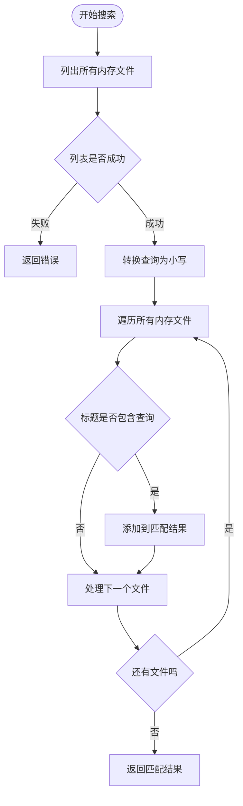
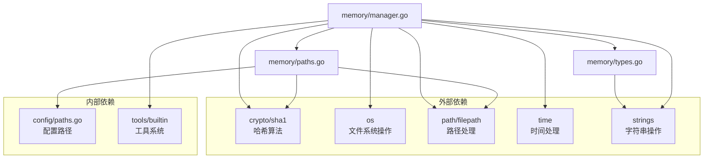

# 内存概念与存储机制

<cite>
**本文档引用的文件**
- [types.go](file://pkg/memory/types.go)
- [manager.go](file://pkg/memory/manager.go)
- [paths.go](file://pkg/memory/paths.go)
- [paths.go](file://pkg/config/paths.go)
- [file_read.go](file://pkg/tools/builtin/file_read.go)
- [file_write.go](file://pkg/tools/builtin/file_write.go)
</cite>

## 目录
1. [简介](#简介)
2. [项目结构](#项目结构)
3. [核心组件](#核心组件)
4. [架构概览](#架构概览)
5. [详细组件分析](#详细组件分析)
6. [依赖关系分析](#依赖关系分析)
7. [性能考虑](#性能考虑)
8. [故障排除指南](#故障排除指南)
9. [结论](#结论)

## 简介

OpenHarness 的内存系统是一个轻量级的知识库子系统，用于在项目生命周期中存储和管理各种记忆片段。该系统采用纯文本文件存储，通过 SHA-1 哈希算法为每个项目生成独立的存储空间，确保不同项目之间的数据隔离。

内存系统的核心设计目标是提供简单而可靠的记忆存储机制，支持基本的 CRUD 操作（创建、读取、更新、删除），同时保持与文件系统的深度集成。系统采用 Markdown 格式存储内容，便于人类阅读和编辑。

## 项目结构

内存系统位于 `pkg/memory` 目录下，包含以下关键文件：

**图表来源**
- [types.go:1-13](file://pkg/memory/types.go#L1-L13)
- [manager.go:1-124](file://pkg/memory/manager.go#L1-L124)
- [paths.go:1-29](file://pkg/memory/paths.go#L1-L29)
- [paths.go:1-75](file://pkg/config/paths.go#L1-L75)

**章节来源**
- [types.go:1-13](file://pkg/memory/types.go#L1-L13)
- [manager.go:1-124](file://pkg/memory/manager.go#L1-L124)
- [paths.go:1-29](file://pkg/memory/paths.go#L1-L29)

## 核心组件

### MemoryHeader 数据模型

MemoryHeader 是内存系统的核心数据结构，用于描述单个内存文件的元数据信息：

| 字段名 | 类型 | 描述 | JSON标签 |
|--------|------|------|----------|
| Path | string | 完整的文件路径 | path |
| Title | string | 文件标题（不包含扩展名） | title |
| Description | string | 文件描述信息 | description |
| ModifiedAt | time.Time | 最后修改时间 | modified_at |

该结构体设计简洁明了，专注于提供内存文件的基本元数据，便于上层组件进行文件管理和检索操作。

**章节来源**
- [types.go:6-12](file://pkg/memory/types.go#L6-L12)

### 路径管理系统

内存系统采用两级路径管理架构：

1. **全局数据目录**：通过 `GetDataDir()` 获取，通常位于用户主目录下的 `.openharness/data`
2. **项目特定内存目录**：基于项目工作目录的 SHA-1 哈希值生成，确保不同项目的数据隔离

**图表来源**
- [paths.go:12-18](file://pkg/memory/paths.go#L12-L18)
- [paths.go:25-28](file://pkg/config/paths.go#L25-L28)

**章节来源**
- [paths.go:12-28](file://pkg/memory/paths.go#L12-L28)
- [paths.go:25-28](file://pkg/config/paths.go#L25-L28)

## 架构概览

内存系统采用分层架构设计，各层职责明确，耦合度低：

**图表来源**
- [manager.go:12-123](file://pkg/memory/manager.go#L12-L123)
- [paths.go:12-28](file://pkg/memory/paths.go#L12-L28)

## 详细组件分析

### 核心业务逻辑组件

#### AddMemoryEntry 函数

AddMemoryEntry 负责创建或覆盖内存条目文件，其工作流程如下：

**图表来源**
- [manager.go:12-23](file://pkg/memory/manager.go#L12-L23)

**实现特点**：
- 自动创建必要的目录结构
- 使用安全的文件名清理机制
- 采用 Markdown 格式存储内容
- 设置适当的文件权限（0o644）

#### RemoveMemoryEntry 函数

RemoveMemoryEntry 提供内存条目的删除功能：

**图表来源**
- [manager.go:25-34](file://pkg/memory/manager.go#L25-L34)

**错误处理机制**：
- 对不存在的文件进行特殊处理，避免返回错误
- 对其他类型的文件系统错误进行包装和传播

#### ListMemoryFiles 函数

ListMemoryFiles 实现内存文件列表的获取和排序：

**图表来源**
- [manager.go:36-70](file://pkg/memory/manager.go#L36-L70)

**排序策略**：
- 基于最后修改时间进行降序排列
- 便于用户快速找到最新的记忆条目

### 文件名安全处理机制

sanitiseTitle 函数负责将人类可读的标题转换为安全的文件名：

**图表来源**
- [manager.go:110-123](file://pkg/memory/manager.go#L110-L123)

**安全字符映射表**：
- 空格 → 下划线
- `/` → 下划线  
- `\` → 下划线
- `:` → 下划线
- `*` → 下划线
- `?` → 下划线
- `"` → 下划线
- `<` → 下划线
- `>` → 下划线
- `|` → 下划线

当标题清理后为空时，系统会自动生成一个基于当前时间戳的唯一文件名，确保不会出现空文件名的情况。

**章节来源**
- [manager.go:110-123](file://pkg/memory/manager.go#L110-L123)

### 高级功能组件

#### LoadMemoryPrompt 功能

LoadMemoryPrompt 将所有内存文件的内容组合成适合注入到系统提示词中的格式：

**图表来源**
- [manager.go:72-90](file://pkg/memory/manager.go#L72-L90)

#### FindRelevantMemories 功能

FindRelevantMemories 提供基于查询的关键字匹配功能：

**图表来源**
- [manager.go:92-108](file://pkg/memory/manager.go#L92-L108)

**搜索策略**：
- 不区分大小写的子字符串匹配
- 支持部分匹配和模糊搜索
- 便于快速定位相关的记忆条目

**章节来源**
- [manager.go:72-108](file://pkg/memory/manager.go#L72-L108)

## 依赖关系分析

内存系统与其他组件的依赖关系如下：

**图表来源**
- [manager.go:3-10](file://pkg/memory/manager.go#L3-L10)
- [paths.go:3-10](file://pkg/memory/paths.go#L3-L10)
- [types.go](file://pkg/memory/types.go#L4)

**依赖特点**：
- 最小化外部依赖，仅使用标准库
- 清晰的模块边界，便于单元测试
- 与配置系统的松耦合设计

**章节来源**
- [manager.go:3-10](file://pkg/memory/manager.go#L3-L10)
- [paths.go:3-10](file://pkg/memory/paths.go#L3-L10)

## 性能考虑

### 时间复杂度分析

- **AddMemoryEntry**: O(1) - 单次文件写入操作
- **RemoveMemoryEntry**: O(1) - 单次文件删除操作  
- **ListMemoryFiles**: O(n log n) - 其中 n 为文件数量，主要消耗在排序操作
- **FindRelevantMemories**: O(n*m) - 其中 n 为文件数量，m 为平均标题长度

### 空间复杂度分析

- **内存占用**: O(n*m) - 存储所有内存文件的内容
- **排序开销**: O(n) - 存储内存头列表
- **文件系统缓存**: 受操作系统影响

### 优化建议

1. **批量操作**: 对于大量内存条目的操作，考虑批处理以减少文件系统调用次数
2. **缓存策略**: 在频繁访问的场景下，可以实现内存缓存以减少磁盘I/O
3. **异步处理**: 对于大文件的读取和写入操作，考虑使用异步处理机制

## 故障排除指南

### 常见问题及解决方案

#### 权限错误
**症状**: 添加或删除内存条目时出现权限错误
**原因**: 目标目录没有写入权限
**解决方案**: 
- 检查数据目录的权限设置
- 确保用户对目标目录具有适当的读写权限
- 运行 `EnsureMemoryDir` 函数自动创建必要的目录结构

#### 文件名冲突
**症状**: 多个标题可能生成相同的文件名
**原因**: 不同标题经过清理后可能得到相同的结果
**解决方案**:
- 系统会自动处理重复文件名
- 建议使用更具体的标题描述
- 考虑在标题中包含更多信息以提高唯一性

#### 路径不存在
**症状**: 列表操作返回空结果或错误
**原因**: 项目内存目录尚未创建
**解决方案**:
- 确保 `EnsureMemoryDir` 函数被正确调用
- 检查配置系统中的数据目录路径
- 验证项目工作目录的有效性

#### 编码问题
**症状**: 中文或其他非ASCII字符显示异常
**原因**: 文件编码不正确
**解决方案**:
- 系统默认使用UTF-8编码
- 确保内容字符串正确编码
- 检查文件系统对UTF-8的支持

**章节来源**
- [manager.go:14-23](file://pkg/memory/manager.go#L14-L23)
- [manager.go:26-34](file://pkg/memory/manager.go#L26-L34)
- [manager.go:38-46](file://pkg/memory/manager.go#L38-L46)

## 结论

OpenHarness 的内存系统通过简洁而有效的设计，为项目提供了可靠的内存存储机制。系统的主要优势包括：

1. **简单易用**: 基于纯文本文件的存储方式，便于人类阅读和编辑
2. **数据隔离**: 通过 SHA-1 哈希算法确保不同项目的数据完全隔离
3. **安全性**: 内置文件名清理机制，防止路径注入攻击
4. **可扩展性**: 模块化设计便于功能扩展和维护

该系统特别适用于需要长期知识积累和上下文记忆的 AI 应用场景，为后续的嵌入式搜索和智能检索功能奠定了良好的基础。随着功能的不断完善，内存系统将成为 OpenHarness 平台的重要基础设施之一。