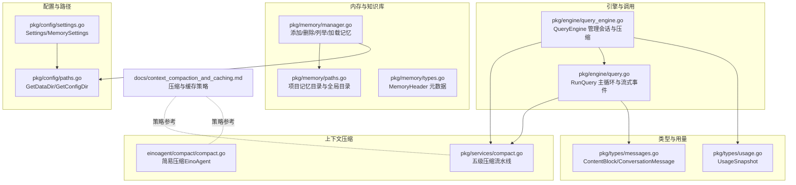
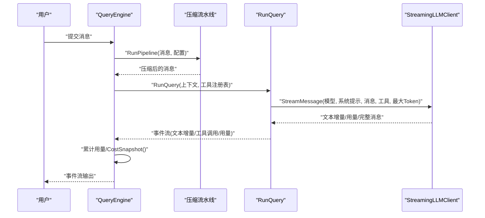
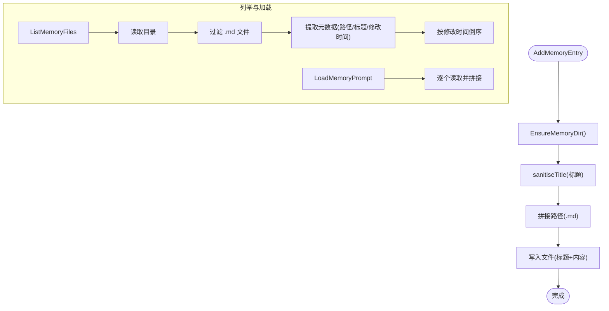
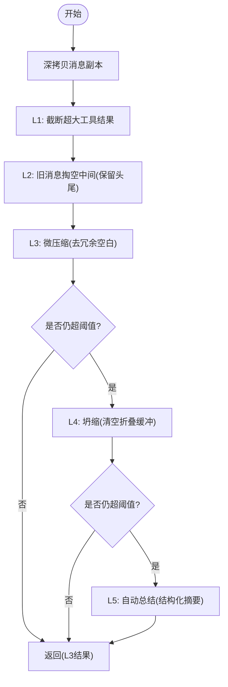
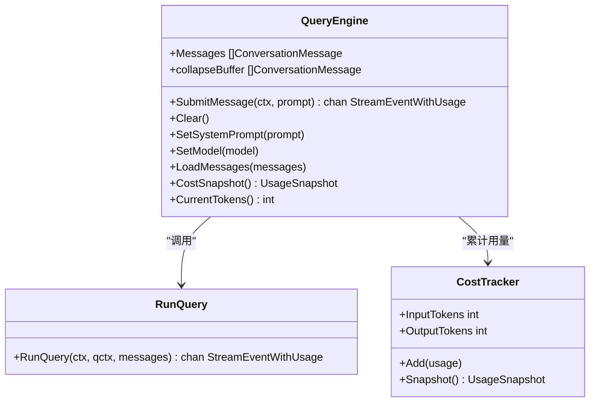
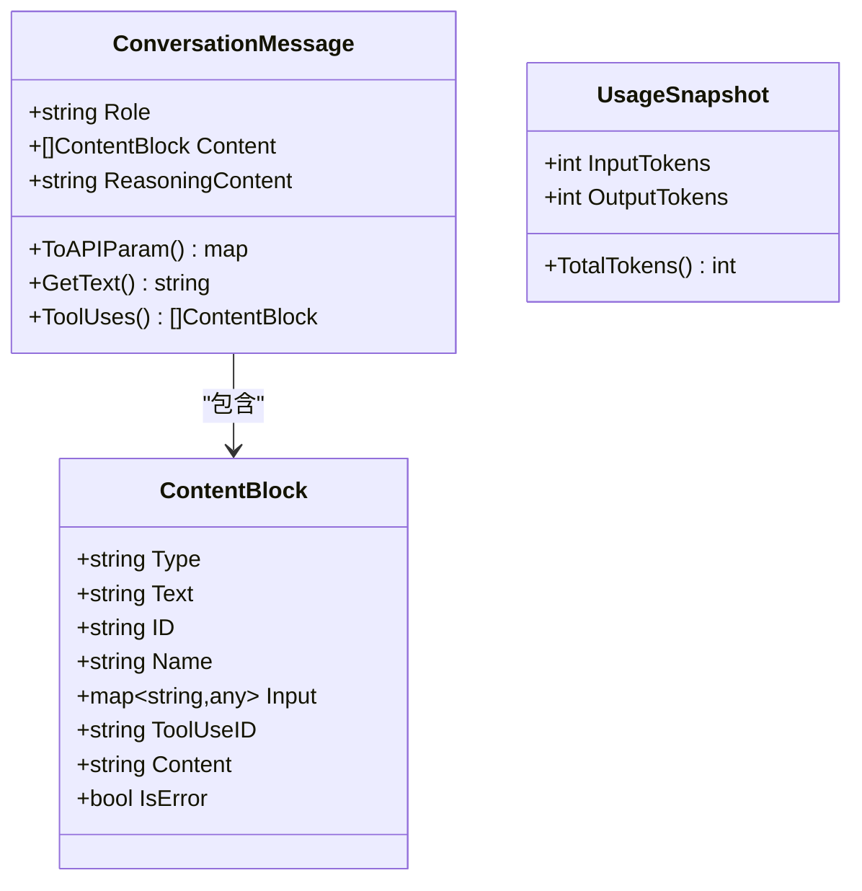
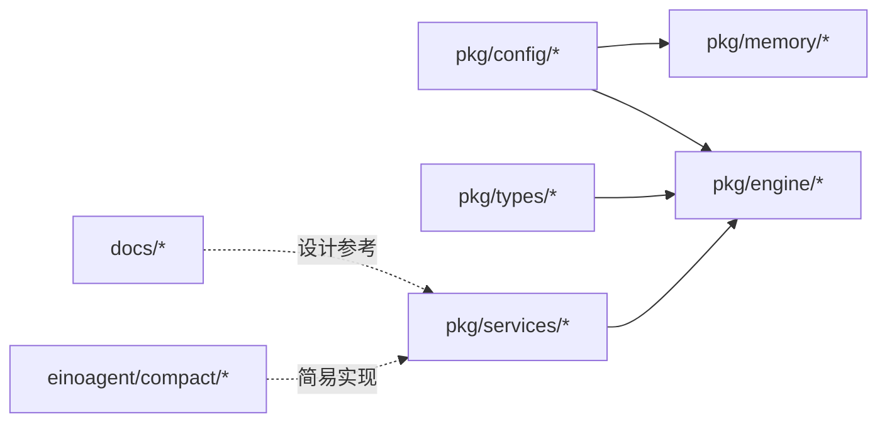

# 内存管理系统

<cite>
**本文引用的文件**
- [pkg/memory/manager.go](file://pkg/memory/manager.go)
- [pkg/memory/paths.go](file://pkg/memory/paths.go)
- [pkg/memory/types.go](file://pkg/memory/types.go)
- [pkg/services/compact.go](file://pkg/services/compact.go)
- [pkg/engine/query_engine.go](file://pkg/engine/query_engine.go)
- [pkg/engine/query.go](file://pkg/engine/query.go)
- [pkg/config/settings.go](file://pkg/config/settings.go)
- [pkg/config/paths.go](file://pkg/config/paths.go)
- [pkg/times.go](file://pkg/times.go)
- [pkg/types/messages.go](file://pkg/types/messages.go)
- [pkg/types/usage.go](file://pkg/types/usage.go)
- [docs/context_compaction_and_caching.md](file://docs/context_compaction_and_caching.md)
- [einoagent/compact/compact.go](file://einoagent/compact/compact.go)
- [einoagent/tools/fs.go](file://einoagent/tools/fs.go)
</cite>

## 目录
1. [简介](#简介)
2. [项目结构](#项目结构)
3. [核心组件](#核心组件)
4. [架构总览](#架构总览)
5. [详细组件分析](#详细组件分析)
6. [依赖关系分析](#依赖关系分析)
7. [性能考量](#性能考量)
8. [故障排除指南](#故障排除指南)
9. [结论](#结论)
10. [附录](#附录)

## 简介
本文件面向“内存管理系统”的技术文档，围绕以下目标展开：
- 解释项目记忆的概念、存储机制与上下文压缩算法
- 深入分析内存管理器的实现原理、数据结构与性能优化策略
- 说明上下文压缩的触发条件、压缩算法与恢复机制
- 提供内存配置的详细指南（存储路径、容量限制、清理策略）
- 解释与文件系统的集成方式与数据持久化机制
- 给出内存使用监控、性能调优与故障排除的实用建议

## 项目结构
本项目采用模块化组织，内存管理与上下文压缩分别由独立包实现：
- 记忆/知识库子系统：pkg/memory（文件系统持久化、项目隔离、检索）
- 上下文压缩流水线：pkg/services（五级压缩、令牌估算、暂存缓冲）
- 引擎与流式调用：pkg/engine（查询引擎、事件流、令牌统计）
- 配置与路径：pkg/config（全局数据目录、配置文件、环境变量覆盖）
- 类型与用量：pkg/types（消息结构、内容块、用量快照）
- 文档与示例：docs（上下文压缩与缓存策略）、einoagent（简易压缩与文件工具）

**图表来源**
- [pkg/memory/manager.go:1-124](file://pkg/memory/manager.go#L1-L124)
- [pkg/memory/paths.go:1-29](file://pkg/memory/paths.go#L1-L29)
- [pkg/memory/types.go:1-13](file://pkg/memory/types.go#L1-L13)
- [pkg/services/compact.go:1-330](file://pkg/services/compact.go#L1-L330)
- [einoagent/compact/compact.go:1-137](file://einoagent/compact/compact.go#L1-L137)
- [pkg/engine/query_engine.go:1-247](file://pkg/engine/query_engine.go#L1-L247)
- [pkg/engine/query.go:1-331](file://pkg/engine/query.go#L1-L331)
- [pkg/config/settings.go:1-212](file://pkg/config/settings.go#L1-L212)
- [pkg/config/paths.go:1-75](file://pkg/config/paths.go#L1-L75)
- [pkg/types/messages.go:1-169](file://pkg/types/messages.go#L1-L169)
- [pkg/types/usage.go:1-13](file://pkg/types/usage.go#L1-L13)
- [docs/context_compaction_and_caching.md:1-77](file://docs/context_compaction_and_caching.md#L1-L77)

**章节来源**
- [pkg/memory/manager.go:1-124](file://pkg/memory/manager.go#L1-L124)
- [pkg/memory/paths.go:1-29](file://pkg/memory/paths.go#L1-L29)
- [pkg/services/compact.go:1-330](file://pkg/services/compact.go#L1-L330)
- [pkg/engine/query_engine.go:1-247](file://pkg/engine/query_engine.go#L1-L247)
- [pkg/engine/query.go:1-331](file://pkg/engine/query.go#L1-L331)
- [pkg/config/settings.go:1-212](file://pkg/config/settings.go#L1-L212)
- [pkg/config/paths.go:1-75](file://pkg/config/paths.go#L1-L75)
- [pkg/types/messages.go:1-169](file://pkg/types/messages.go#L1-L169)
- [pkg/types/usage.go:1-13](file://pkg/types/usage.go#L1-L13)
- [docs/context_compaction_and_caching.md:1-77](file://docs/context_compaction_and_caching.md#L1-L77)

## 核心组件
- 记忆管理器（pkg/memory）
  - 功能：在项目隔离目录中以 Markdown 文件形式存储记忆条目；提供添加、删除、列举、加载与相关性检索
  - 存储：基于工作目录哈希生成项目专属目录，避免跨项目污染
  - 数据结构：MemoryHeader（路径、标题、修改时间）
- 上下文压缩服务（pkg/services）
  - 功能：实现五级渐进式压缩流水线，控制上下文长度，降低 Token 消耗
  - 令牌估算：按内容块类型估算 Token，结合阈值触发压缩
  - 缓冲与暂存：通过“折叠缓冲”延迟永久丢弃旧消息，提升压缩灵活性
- 查询引擎（pkg/engine）
  - 功能：封装会话状态、权限检查、工具执行与流式响应；在提交消息前后执行压缩
  - 用量统计：累计输入/输出 Token，便于监控与计费控制
- 配置与路径（pkg/config）
  - 功能：统一管理配置文件、全局数据目录、会话/任务/反馈/日志等子目录
  - 内存设置：MemorySettings 控制记忆功能开关、最大文件数与入口行数
- 类型与用量（pkg/types）
  - 功能：定义消息内容块（text/tool_use/tool_result）与会话消息结构；提供用量快照

**章节来源**
- [pkg/memory/manager.go:12-124](file://pkg/memory/manager.go#L12-L124)
- [pkg/memory/types.go:6-12](file://pkg/memory/types.go#L6-L12)
- [pkg/services/compact.go:12-115](file://pkg/services/compact.go#L12-L115)
- [pkg/engine/query_engine.go:49-247](file://pkg/engine/query_engine.go#L49-L247)
- [pkg/engine/query.go:142-280](file://pkg/engine/query.go#L142-L280)
- [pkg/config/settings.go:58-75](file://pkg/config/settings.go#L58-L75)
- [pkg/types/messages.go:15-97](file://pkg/types/messages.go#L15-L97)
- [pkg/types/usage.go:3-7](file://pkg/types/usage.go#L3-L7)

## 架构总览
内存管理与上下文压缩在引擎主循环中协同工作：用户提交消息后，先进行压缩（L1-L5），再发起 LLM 请求；随后根据工具调用结果更新上下文并继续多轮对话。

**图表来源**
- [pkg/engine/query_engine.go:124-205](file://pkg/engine/query_engine.go#L124-L205)
- [pkg/engine/query.go:142-280](file://pkg/engine/query.go#L142-L280)
- [pkg/services/compact.go:74-115](file://pkg/services/compact.go#L74-L115)

## 详细组件分析

### 记忆管理器（pkg/memory）
- 存储机制
  - 项目隔离：基于工作目录的哈希生成子目录，确保不同项目互不影响
  - 文件命名：标题经安全化处理后以 .md 存储，正文包含标题与内容
  - 目录保证：写入前确保目录存在
- 检索与加载
  - 列举：遍历目录，过滤 .md 文件，按修改时间倒序返回头信息
  - 加载：读取全部记忆文件内容，拼接为系统提示注入文本
  - 相关性：按标题（大小写无关）子串匹配返回候选
- 清理策略
  - 删除：按标题删除对应记忆文件
  - 未实现：当前未提供自动清理策略（可基于 MemorySettings 的 MaxFiles 等扩展）

**图表来源**
- [pkg/memory/manager.go:14-23](file://pkg/memory/manager.go#L14-L23)
- [pkg/memory/manager.go:38-70](file://pkg/memory/manager.go#L38-L70)
- [pkg/memory/manager.go:74-90](file://pkg/memory/manager.go#L74-L90)
- [pkg/memory/manager.go:111-123](file://pkg/memory/manager.go#L111-L123)
- [pkg/memory/paths.go:14-28](file://pkg/memory/paths.go#L14-L28)

**章节来源**
- [pkg/memory/manager.go:12-124](file://pkg/memory/manager.go#L12-L124)
- [pkg/memory/paths.go:12-28](file://pkg/memory/paths.go#L12-L28)
- [pkg/memory/types.go:6-12](file://pkg/memory/types.go#L6-L12)

### 上下文压缩（pkg/services）
- 触发条件
  - 最小消息数阈值、保留最近消息数、Token 阈值共同决定是否触发压缩
  - 令牌估算：文本、工具调用名称与参数、工具结果分别估算 Token
- 五级压缩流水线
  - L1：工具结果预算截断（保留尾部，头部替换为截断提示）
  - L2：旧消息掏空中间、保留头尾（按预算字符）
  - L3：微压缩（去除冗余空白）
  - L4：上下文坍缩（将一批旧消息移入折叠缓冲，必要时清空缓冲以换取更短上下文）
  - L5：自动总结（调用 LLM 生成结构化摘要，替换旧历史，保留最近消息）
- 恢复机制
  - 折叠缓冲用于延迟永久丢弃，可在后续仍需空间时清空
  - 自动总结提供“新会话”起点，显著降低上下文长度

**图表来源**
- [pkg/services/compact.go:74-115](file://pkg/services/compact.go#L74-L115)
- [pkg/services/compact.go:130-141](file://pkg/services/compact.go#L130-L141)
- [pkg/services/compact.go:144-172](file://pkg/services/compact.go#L144-L172)
- [pkg/services/compact.go:174-205](file://pkg/services/compact.go#L174-L205)
- [pkg/services/compact.go:207-241](file://pkg/services/compact.go#L207-L241)
- [pkg/services/compact.go:243-298](file://pkg/services/compact.go#L243-L298)

**章节来源**
- [pkg/services/compact.go:12-115](file://pkg/services/compact.go#L12-L115)
- [pkg/services/compact.go:130-172](file://pkg/services/compact.go#L130-L172)
- [pkg/services/compact.go:174-205](file://pkg/services/compact.go#L174-L205)
- [pkg/services/compact.go:207-298](file://pkg/services/compact.go#L207-L298)

### 查询引擎与流式事件（pkg/engine）
- QueryEngine
  - 管理会话消息、折叠缓冲、用量统计
  - 提交消息后，复制当前上下文与折叠缓冲，调用压缩流水线，再进入 RunQuery
- RunQuery
  - 多轮循环：每轮前检查并执行 L1-L4 压缩（避免中途爆仓）
  - 构造 LLM 请求参数（模型、系统提示、消息、工具、最大 Token）
  - 流式接收文本增量、完整消息与用量快照，向下游事件通道推送
  - 收集工具调用并发执行，组装工具结果消息
- 用量与监控
  - CostTracker 累计输入/输出 Token
  - CurrentTokens 提供当前估算 Token 数

**图表来源**
- [pkg/engine/query_engine.go:49-247](file://pkg/engine/query_engine.go#L49-L247)
- [pkg/engine/query.go:142-280](file://pkg/engine/query.go#L142-L280)
- [pkg/types/usage.go:3-7](file://pkg/types/usage.go#L3-L7)

**章节来源**
- [pkg/engine/query_engine.go:49-247](file://pkg/engine/query_engine.go#L49-L247)
- [pkg/engine/query.go:142-280](file://pkg/engine/query.go#L142-L280)
- [pkg/types/usage.go:3-7](file://pkg/types/usage.go#L3-L7)

### 类型与消息结构（pkg/types）
- ContentBlock：文本、工具调用、工具结果三种类型，携带必要字段
- ConversationMessage：角色与内容块数组，提供序列化为 API 参数的方法
- UsageSnapshot：输入/输出 Token 快照，支持合计

**图表来源**
- [pkg/types/messages.go:15-97](file://pkg/types/messages.go#L15-L97)
- [pkg/types/messages.go:99-132](file://pkg/types/messages.go#L99-L132)
- [pkg/types/usage.go:3-7](file://pkg/types/usage.go#L3-L7)

**章节来源**
- [pkg/types/messages.go:15-132](file://pkg/types/messages.go#L15-L132)
- [pkg/types/usage.go:3-7](file://pkg/types/usage.go#L3-L7)

### 配置与路径（pkg/config）
- 配置项
  - MemorySettings：启用记忆、最大文件数、入口最大行数
  - Settings：模型、最大 Token、系统提示、权限、插件、MCP 服务器、UI 等
- 路径
  - GetConfigDir/GetConfigFilePath：配置文件位置
  - GetDataDir/GetLogsDir/GetSessionsDir/GetTasksDir/GetFeedbackDir：数据与日志目录
  - GetProjectConfigDir/GetProjectIssueFile/GetProjectPRCommentsFile：项目内配置与问题/评论文件

**章节来源**
- [pkg/config/settings.go:58-142](file://pkg/config/settings.go#L58-L142)
- [pkg/config/paths.go:8-75](file://pkg/config/paths.go#L8-L75)

### 文档与策略参考（docs）
- 上下文压缩与缓存策略
  - 五级渐进式压缩与 KV Cache 前缀匹配冲突的平衡
  - 静态长文本区与动态对话区的“动静分离”
  - 高阈值与低频触发、L5 总结带来的“重生”

**章节来源**
- [docs/context_compaction_and_caching.md:1-77](file://docs/context_compaction_and_caching.md#L1-L77)

### 简易压缩与文件工具（einoagent）
- 简易压缩（einoagent/compact）
  - 粗略估算 Token（按 4 字节/Token），在达到阈值时触发
  - 保留第一条 system 与最近 N 条消息，其余通过摘要模型压缩为单条摘要
- 文件系统工具（einoagent/tools）
  - ls/read_file/write_file/edit_file：路径解析、行范围读取、写入与编辑
  - 读取限制：单次读取最大字节数，防止上下文爆炸

**章节来源**
- [einoagent/compact/compact.go:20-137](file://einoagent/compact/compact.go#L20-L137)
- [einoagent/tools/fs.go:58-280](file://einoagent/tools/fs.go#L58-L280)

## 依赖关系分析
- 内存管理依赖配置模块提供的全局数据目录，确保跨平台一致的数据存放位置
- 查询引擎依赖压缩服务进行上下文控制，同时依赖类型模块的消息结构与用量模块的统计
- 压缩服务内部使用消息结构中的内容块类型进行 Token 估算
- 文档与策略参考为压缩服务提供设计指导，帮助在实际工程中平衡上下文长度与缓存命中

**图表来源**
- [pkg/config/settings.go:1-212](file://pkg/config/settings.go#L1-L212)
- [pkg/memory/manager.go:1-124](file://pkg/memory/manager.go#L1-L124)
- [pkg/engine/query_engine.go:1-247](file://pkg/engine/query_engine.go#L1-L247)
- [pkg/services/compact.go:1-330](file://pkg/services/compact.go#L1-L330)
- [docs/context_compaction_and_caching.md:1-77](file://docs/context_compaction_and_caching.md#L1-L77)
- [einoagent/compact/compact.go:1-137](file://einoagent/compact/compact.go#L1-L137)

**章节来源**
- [pkg/config/settings.go:1-212](file://pkg/config/settings.go#L1-L212)
- [pkg/memory/manager.go:1-124](file://pkg/memory/manager.go#L1-L124)
- [pkg/engine/query_engine.go:1-247](file://pkg/engine/query_engine.go#L1-L247)
- [pkg/services/compact.go:1-330](file://pkg/services/compact.go#L1-L330)
- [docs/context_compaction_and_caching.md:1-77](file://docs/context_compaction_and_caching.md#L1-L77)
- [einoagent/compact/compact.go:1-137](file://einoagent/compact/compact.go#L1-L137)

## 性能考量
- 令牌估算
  - 粗略估算（按字符/Token 比例）在工程中快速判断是否需要压缩，减少不必要的 LLM 调用
  - 建议：在生产环境中引入更准确的分词器估算，或结合实际模型的 tokenizer
- 压缩策略
  - L1-L4 优先于 L5，尽量保持前缀 KV Cache 命中
  - L5 自动总结可显著降低上下文长度，适合在接近阈值时一次性“重生”
- 用量统计
  - 使用 CostTracker 累计输入/输出 Token，结合 MaxTokens 控制成本
  - 建议：在配置中设置合理的 MaxTokens，并在 UI 中展示当前估算 Token
- 文件系统 I/O
  - 记忆文件读写为顺序 I/O，建议控制文件数量与大小，避免频繁小文件操作
  - 可结合 MemorySettings 的 MaxFiles 与入口行数限制，减少磁盘压力

[本节为通用性能建议，无需特定文件来源]

## 故障排除指南
- 记忆文件无法写入
  - 检查全局数据目录是否存在与权限是否正确
  - 确认项目记忆目录创建成功
- 记忆文件读取失败
  - 确认文件扩展名为 .md，且标题安全化后可正常映射到文件名
  - 检查文件内容是否损坏或被外部程序占用
- 压缩未生效
  - 检查最小消息数与保留最近消息数配置，确认 Token 估算是否达到阈值
  - 确认 RunQuery 每轮前的 L1-L4 压缩逻辑是否执行
- 用量统计异常
  - 确认流式响应中是否包含用量快照
  - 检查并发工具调用是否正确汇总用量
- 配置未生效
  - 检查配置文件路径与权限
  - 确认环境变量覆盖逻辑是否正确应用

**章节来源**
- [pkg/memory/manager.go:14-23](file://pkg/memory/manager.go#L14-L23)
- [pkg/memory/paths.go:25-28](file://pkg/memory/paths.go#L25-L28)
- [pkg/services/compact.go:61-72](file://pkg/services/compact.go#L61-L72)
- [pkg/engine/query.go:173-198](file://pkg/engine/query.go#L173-L198)
- [pkg/engine/query_engine.go:194-196](file://pkg/engine/query_engine.go#L194-L196)
- [pkg/config/paths.go:20-23](file://pkg/config/paths.go#L20-L23)
- [pkg/config/settings.go:197-211](file://pkg/config/settings.go#L197-L211)

## 结论
本内存管理系统通过“项目隔离的记忆文件 + 五级上下文压缩流水线”，在保证功能可用的同时，有效控制上下文长度与 Token 成本。配合用量统计与配置管理，能够满足工程化场景下的稳定性与可观测性需求。未来可进一步引入更精确的 Token 估算、KV Cache 前缀标记策略与自动清理机制，以提升性能与用户体验。

[本节为总结性内容，无需特定文件来源]

## 附录

### 内存配置详细指南
- 存储路径
  - 全局配置目录：可通过环境变量覆盖
  - 数据目录：包含 sessions/tasks/feedback/logs 等子目录
  - 项目记忆目录：基于工作目录哈希生成，避免跨项目污染
- 容量限制
  - 记忆文件数量：MemorySettings.MaxFiles
  - 入口最大行数：MemorySettings.MaxEntrypointLines
- 清理策略
  - 当前未实现自动清理；可基于 MaxFiles 与入口行数限制进行扩展

**章节来源**
- [pkg/config/paths.go:8-75](file://pkg/config/paths.go#L8-L75)
- [pkg/config/settings.go:58-75](file://pkg/config/settings.go#L58-L75)
- [pkg/memory/paths.go:12-28](file://pkg/memory/paths.go#L12-L28)