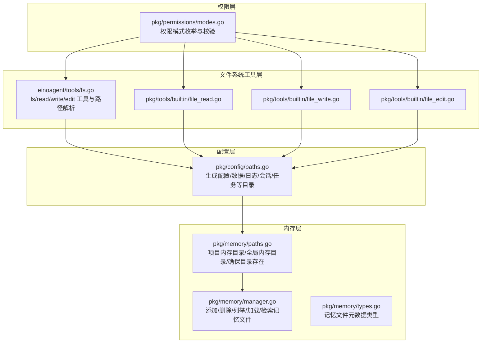
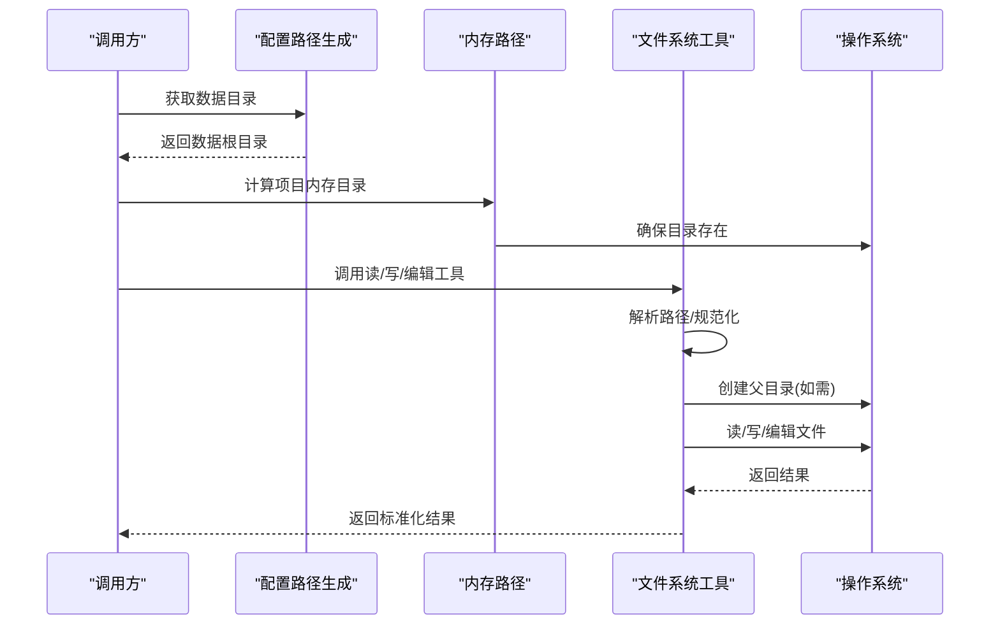
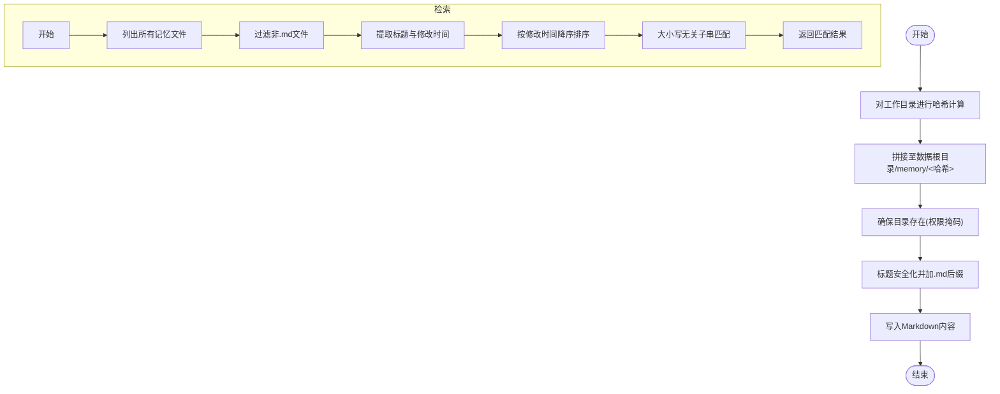
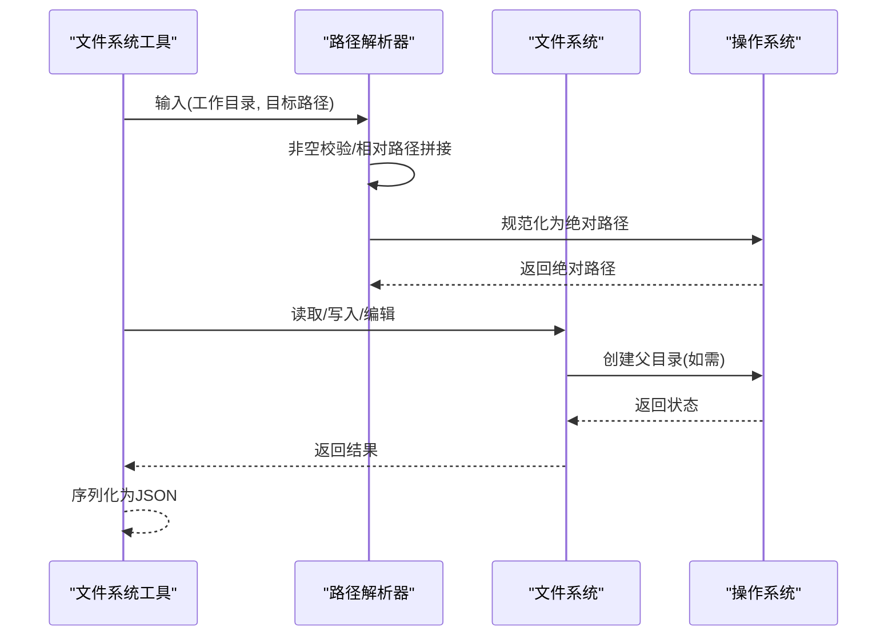
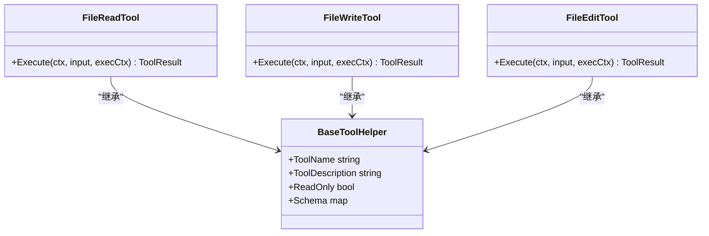
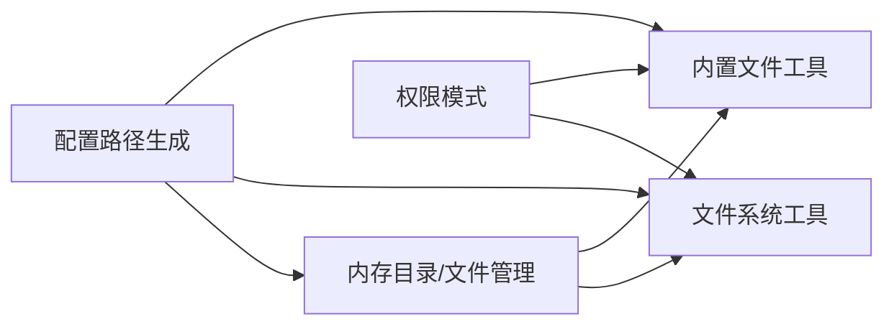

# 文件系统集成

<cite>
**本文引用的文件**
- [pkg/memory/paths.go](file://pkg/memory/paths.go)
- [pkg/memory/manager.go](file://pkg/memory/manager.go)
- [pkg/memory/types.go](file://pkg/memory/types.go)
- [pkg/config/paths.go](file://pkg/config/paths.go)
- [einoagent/tools/fs.go](file://einoagent/tools/fs.go)
- [pkg/tools/builtin/file_write.go](file://pkg/tools/builtin/file_write.go)
- [pkg/tools/builtin/file_read.go](file://pkg/tools/builtin/file_read.go)
- [pkg/tools/builtin/file_edit.go](file://pkg/tools/builtin/file_edit.go)
- [pkg/permissions/modes.go](file://pkg/permissions/modes.go)
</cite>

## 目录
1. [简介](#简介)
2. [项目结构](#项目结构)
3. [核心组件](#核心组件)
4. [架构总览](#架构总览)
5. [详细组件分析](#详细组件分析)
6. [依赖分析](#依赖分析)
7. [性能考虑](#性能考虑)
8. [故障排除指南](#故障排除指南)
9. [结论](#结论)
10. [附录](#附录)

## 简介
本文件系统集成文档聚焦于内存管理与文件系统的交互机制，围绕以下主题展开：路径解析与目录管理、项目路径解析逻辑、目录创建与权限管理、内存文件的存储位置与命名规范、跨平台兼容性与路径分隔符处理、错误处理与资源清理、性能优化策略以及故障排除与数据恢复建议。文中所有技术细节均基于仓库中的实际源码进行分析与总结。

## 项目结构
本项目的文件系统相关能力主要分布在以下模块：
- 配置与全局路径：提供配置目录、数据目录、日志与任务等子目录的统一生成逻辑。
- 内存子系统：负责项目专属与全局的“记忆/知识”文件的增删查与内容组织。
- 文件系统工具：面向 einoagent 的通用文件系统工具集，提供列出、读取、写入、编辑等能力。
- 内置工具：面向 OpenHarness 核心流程的文件读写与编辑工具，用于执行器上下文中的文件操作。
- 权限模型：定义工具执行的权限模式，为文件系统操作的安全边界提供抽象。

图表来源
- [pkg/config/paths.go:1-75](file://pkg/config/paths.go#L1-L75)
- [pkg/memory/paths.go:1-29](file://pkg/memory/paths.go#L1-L29)
- [pkg/memory/manager.go:1-124](file://pkg/memory/manager.go#L1-L124)
- [pkg/memory/types.go:1-13](file://pkg/memory/types.go#L1-L13)
- [einoagent/tools/fs.go:1-280](file://einoagent/tools/fs.go#L1-L280)
- [pkg/tools/builtin/file_read.go:1-99](file://pkg/tools/builtin/file_read.go#L1-L99)
- [pkg/tools/builtin/file_write.go:1-80](file://pkg/tools/builtin/file_write.go#L1-L80)
- [pkg/tools/builtin/file_edit.go:1-98](file://pkg/tools/builtin/file_edit.go#L1-L98)
- [pkg/permissions/modes.go:1-28](file://pkg/permissions/modes.go#L1-L28)

章节来源
- [pkg/config/paths.go:1-75](file://pkg/config/paths.go#L1-L75)
- [pkg/memory/paths.go:1-29](file://pkg/memory/paths.go#L1-L29)
- [pkg/memory/manager.go:1-124](file://pkg/memory/manager.go#L1-L124)
- [pkg/memory/types.go:1-13](file://pkg/memory/types.go#L1-L13)
- [einoagent/tools/fs.go:1-280](file://einoagent/tools/fs.go#L1-L280)
- [pkg/tools/builtin/file_read.go:1-99](file://pkg/tools/builtin/file_read.go#L1-L99)
- [pkg/tools/builtin/file_write.go:1-80](file://pkg/tools/builtin/file_write.go#L1-L80)
- [pkg/tools/builtin/file_edit.go:1-98](file://pkg/tools/builtin/file_edit.go#L1-L98)
- [pkg/permissions/modes.go:1-28](file://pkg/permissions/modes.go#L1-L28)

## 核心组件
- 配置路径生成：集中提供配置目录、数据目录及各类子目录的生成逻辑，确保不同平台下路径拼接的一致性。
- 内存目录与文件管理：以项目工作目录为输入，生成稳定的项目内存目录；提供目录确保、文件增删、列表与内容加载、标题安全化等能力。
- 文件系统工具：提供 ls、read_file、write_file、edit_file 等工具，内置路径解析、目录创建、权限设置与结果封装。
- 内置工具：面向执行器上下文的文件读写与编辑工具，具备输入校验、路径解析与权限设置。
- 权限模式：为工具执行提供权限模式抽象，便于在不同安全级别下控制文件系统操作。

章节来源
- [pkg/config/paths.go:1-75](file://pkg/config/paths.go#L1-L75)
- [pkg/memory/paths.go:1-29](file://pkg/memory/paths.go#L1-L29)
- [pkg/memory/manager.go:1-124](file://pkg/memory/manager.go#L1-L124)
- [einoagent/tools/fs.go:1-280](file://einoagent/tools/fs.go#L1-L280)
- [pkg/tools/builtin/file_read.go:1-99](file://pkg/tools/builtin/file_read.go#L1-L99)
- [pkg/tools/builtin/file_write.go:1-80](file://pkg/tools/builtin/file_write.go#L1-L80)
- [pkg/tools/builtin/file_edit.go:1-98](file://pkg/tools/builtin/file_edit.go#L1-L98)
- [pkg/permissions/modes.go:1-28](file://pkg/permissions/modes.go#L1-L28)

## 架构总览
文件系统集成在系统中的交互路径如下：
- 配置层通过环境变量与用户主目录确定全局数据根目录，再派生出日志、会话、任务、反馈等子目录。
- 内存层在数据根目录下创建 memory 子目录，并以项目工作目录的哈希作为项目专属内存目录名，确保多项目隔离。
- 文件系统工具与内置工具在执行前统一进行路径解析与规范化，必要时自动创建父目录，并使用统一的权限掩码写入文件。
- 权限模式为工具执行提供安全边界，避免越权操作。

图表来源
- [pkg/config/paths.go:25-28](file://pkg/config/paths.go#L25-L28)
- [pkg/memory/paths.go:14-27](file://pkg/memory/paths.go#L14-L27)
- [einoagent/tools/fs.go:22-35](file://einoagent/tools/fs.go#L22-L35)
- [einoagent/tools/fs.go:202-221](file://einoagent/tools/fs.go#L202-L221)

## 详细组件分析

### 组件一：内存目录与文件管理
- 项目路径解析逻辑
  - 以项目工作目录为输入，计算其哈希值，取固定长度的十六进制片段作为目录名，拼接到数据根目录下的 memory 子目录中，形成稳定且唯一的项目内存目录。
  - 全局内存目录采用固定名称，用于存放与项目无关的通用记忆条目。
- 目录创建与权限管理
  - 提供确保目录存在的函数，使用统一的权限掩码创建目录，保证跨平台一致性。
- 文件命名与格式
  - 记忆文件采用 Markdown 格式，文件名为标题安全化后的名称加后缀。
  - 标题安全化规则将路径分隔符与不安全字符替换为下划线，若为空则回退为带时间戳的占位名。
- 列表与检索
  - 列表功能遍历目录，过滤非 Markdown 文件，提取标题与修改时间，按修改时间降序排列。
  - 检索功能进行大小写无关的子串匹配，便于快速定位相关内容。

图表来源
- [pkg/memory/paths.go:14-27](file://pkg/memory/paths.go#L14-L27)
- [pkg/memory/manager.go:14-23](file://pkg/memory/manager.go#L14-L23)
- [pkg/memory/manager.go:38-70](file://pkg/memory/manager.go#L38-L70)
- [pkg/memory/manager.go:95-108](file://pkg/memory/manager.go#L95-L108)
- [pkg/memory/manager.go:111-123](file://pkg/memory/manager.go#L111-L123)

章节来源
- [pkg/memory/paths.go:12-28](file://pkg/memory/paths.go#L12-L28)
- [pkg/memory/manager.go:12-124](file://pkg/memory/manager.go#L12-L124)
- [pkg/memory/types.go:6-12](file://pkg/memory/types.go#L6-L12)

### 组件二：路径解析与目录管理（einoagent 工具）
- 路径解析
  - 对传入路径进行非空校验；若为相对路径则与工作目录拼接后再规范化为绝对路径，确保后续操作在预期根目录内。
- 目录创建与权限
  - 在写入前自动创建父目录，使用统一权限掩码，避免因缺少父目录导致失败。
- 结果封装
  - 统一以 JSON 结构返回成功或失败信息，包含路径、数据或错误描述，便于上层消费。

图表来源
- [einoagent/tools/fs.go:22-35](file://einoagent/tools/fs.go#L22-L35)
- [einoagent/tools/fs.go:202-221](file://einoagent/tools/fs.go#L202-L221)

章节来源
- [einoagent/tools/fs.go:22-35](file://einoagent/tools/fs.go#L22-L35)
- [einoagent/tools/fs.go:76-104](file://einoagent/tools/fs.go#L76-L104)
- [einoagent/tools/fs.go:130-176](file://einoagent/tools/fs.go#L130-L176)
- [einoagent/tools/fs.go:202-221](file://einoagent/tools/fs.go#L202-L221)
- [einoagent/tools/fs.go:246-276](file://einoagent/tools/fs.go#L246-L276)

### 组件三：内置文件工具（读/写/编辑）
- 读取工具
  - 支持指定偏移与限制行数，避免一次性读取过大文件导致上下文膨胀。
  - 路径解析与内置工具一致，先规范化再读取。
- 写入工具
  - 自动创建父目录，使用统一权限掩码写入文件。
- 编辑工具
  - 要求旧字符串在文件中唯一出现，否则拒绝修改，确保精确替换。

图表来源
- [pkg/tools/builtin/file_read.go:26-99](file://pkg/tools/builtin/file_read.go#L26-L99)
- [pkg/tools/builtin/file_write.go:24-80](file://pkg/tools/builtin/file_write.go#L24-L80)
- [pkg/tools/builtin/file_edit.go:26-98](file://pkg/tools/builtin/file_edit.go#L26-L98)

章节来源
- [pkg/tools/builtin/file_read.go:59-99](file://pkg/tools/builtin/file_read.go#L59-L99)
- [pkg/tools/builtin/file_write.go:54-80](file://pkg/tools/builtin/file_write.go#L54-L80)
- [pkg/tools/builtin/file_edit.go:59-98](file://pkg/tools/builtin/file_edit.go#L59-L98)

### 组件四：权限模式与安全边界
- 权限模式
  - 定义默认、计划、全自动化三种模式，提供有效性校验，便于在不同阶段启用不同的文件系统操作权限。
- 与文件系统工具的结合
  - 工具在执行前可依据权限模式决定是否允许写入、编辑等高风险操作，从而在流程层面约束文件系统行为。

章节来源
- [pkg/permissions/modes.go:4-27](file://pkg/permissions/modes.go#L4-L27)

## 依赖分析
- 配置层为其他模块提供统一的数据根目录，内存与工具层均依赖该根目录生成各自的子目录。
- 内存层依赖配置层提供的数据根目录，同时内部通过哈希映射实现项目隔离。
- 文件系统工具与内置工具均依赖路径解析与目录创建逻辑，形成一致的错误处理与权限设置。
- 权限模式为工具执行提供抽象，降低耦合度，便于在不同场景切换安全策略。

图表来源
- [pkg/config/paths.go:25-28](file://pkg/config/paths.go#L25-L28)
- [pkg/memory/paths.go:14-27](file://pkg/memory/paths.go#L14-L27)
- [einoagent/tools/fs.go:202-221](file://einoagent/tools/fs.go#L202-L221)
- [pkg/tools/builtin/file_write.go:68-76](file://pkg/tools/builtin/file_write.go#L68-L76)
- [pkg/permissions/modes.go:16-27](file://pkg/permissions/modes.go#L16-L27)

章节来源
- [pkg/config/paths.go:1-75](file://pkg/config/paths.go#L1-L75)
- [pkg/memory/paths.go:1-29](file://pkg/memory/paths.go#L1-L29)
- [einoagent/tools/fs.go:1-280](file://einoagent/tools/fs.go#L1-L280)
- [pkg/tools/builtin/file_write.go:1-80](file://pkg/tools/builtin/file_write.go#L1-L80)
- [pkg/permissions/modes.go:1-28](file://pkg/permissions/modes.go#L1-L28)

## 性能考虑
- 批量操作
  - 列表与检索采用一次遍历完成，避免多次 IO；读取工具限制行数，减少内存占用与传输开销。
- 缓存机制
  - 可借鉴文档中关于缓存利用的建议，在后续版本中引入针对静态前缀的缓存标记策略，减少重复计算与 IO。
- 目录与文件粒度
  - 内存文件采用 Markdown 格式，便于快速拼接与展示；写入前统一创建父目录，减少多次 mkdir 的开销。
- 跨平台一致性
  - 使用路径拼接与规范化函数，避免硬编码分隔符，减少平台差异带来的额外判断成本。

[本节为通用性能讨论，无需引用具体文件]

## 故障排除指南
- 常见问题与定位
  - 路径为空或非法：路径解析器对空路径直接报错；检查调用方参数与工作目录设置。
  - 权限不足：写入/编辑失败时检查目录权限与文件权限掩码；确保父目录已正确创建。
  - 文件不存在：读取/编辑前确认文件是否存在；必要时先创建父目录再写入。
  - 唯一性校验失败：编辑工具要求旧字符串唯一，若匹配次数不为 1 将拒绝修改。
- 数据恢复建议
  - 备份策略：定期备份数据根目录下的 memory 子目录，确保项目记忆文件可恢复。
  - 恢复步骤：停止写入操作后，将备份文件复制回原位；验证文件完整性与权限。
- 最佳实践
  - 错误处理：统一捕获并记录错误，返回结构化结果，便于前端或上层工具处理。
  - 资源清理：写入完成后及时关闭句柄；在批量操作中避免长时间持有文件句柄。
  - 权限检查：在执行高风险操作前，根据权限模式进行二次校验，防止误操作。

章节来源
- [einoagent/tools/fs.go:22-35](file://einoagent/tools/fs.go#L22-L35)
- [einoagent/tools/fs.go:202-221](file://einoagent/tools/fs.go#L202-L221)
- [pkg/tools/builtin/file_edit.go:79-94](file://pkg/tools/builtin/file_edit.go#L79-L94)

## 结论
本文件系统集成方案通过统一的配置路径生成、稳定的项目内存目录设计、严格的路径解析与权限管理，以及一致的工具接口，实现了跨平台、可维护、可扩展的文件系统操作体系。未来可在缓存利用与批量操作方面进一步优化，以提升整体性能与用户体验。

## 附录
- 路径分隔符与跨平台
  - 使用路径拼接与规范化函数，避免硬编码分隔符，确保在 Windows 与类 Unix 系统上的一致行为。
- 特殊字符处理
  - 内存文件标题在命名时将路径分隔符与不安全字符替换为下划线，保障文件系统兼容性。
- 文件格式标准
  - 内存文件采用 Markdown 格式，便于人类阅读与机器解析；内容包含标题与正文两部分。

章节来源
- [pkg/memory/manager.go:111-123](file://pkg/memory/manager.go#L111-L123)
- [pkg/memory/manager.go:14-23](file://pkg/memory/manager.go#L14-L23)
- [einoagent/tools/fs.go:202-221](file://einoagent/tools/fs.go#L202-L221)