# 内置工具

<cite>
**本文引用的文件**
- [pkg/tools/builtin/register.go](file://pkg/tools/builtin/register.go)
- [pkg/tools/base.go](file://pkg/tools/base.go)
- [pkg/tools/builtin/file_read.go](file://pkg/tools/builtin/file_read.go)
- [pkg/tools/builtin/file_write.go](file://pkg/tools/builtin/file_write.go)
- [pkg/tools/builtin/file_edit.go](file://pkg/tools/builtin/file_edit.go)
- [pkg/tools/builtin/glob.go](file://pkg/tools/builtin/glob.go)
- [pkg/tools/builtin/grep.go](file://pkg/tools/builtin/grep.go)
- [pkg/tools/builtin/bash.go](file://pkg/tools/builtin/bash.go)
- [pkg/tools/builtin/ask_user_question.go](file://pkg/tools/builtin/ask_user_question.go)
- [pkg/tools/builtin/task_tools.go](file://pkg/tools/builtin/task_tools.go)
- [pkg/tools/builtin/task_packet_tools.go](file://pkg/tools/builtin/task_packet_tools.go)
- [pkg/tools/builtin/skill.go](file://pkg/tools/builtin/skill.go)
- [pkg/tools/builtin/agent.go](file://pkg/tools/builtin/agent.go)
- [pkg/times/types.go](file://pkg/times/types.go)
- [pkg/skills/loader.go](file://pkg/skills/loader.go)
- [design/TASK.md](file://design/TASK.md)
- [pkg/tasks/executor.go](file://pkg/tasks/executor.go)
</cite>

## 目录
1. [简介](#简介)
2. [项目结构](#项目结构)
3. [核心组件](#核心组件)
4. [架构总览](#架构总览)
5. [详细组件分析](#详细组件分析)
6. [依赖关系分析](#依赖关系分析)
7. [性能考量](#性能考量)
8. [故障排查指南](#故障排查指南)
9. [结论](#结论)
10. [附录](#附录)

## 简介
本文件面向“内置工具”的技术文档，覆盖以下主题：
- 文件读写与编辑工具：file_read、file_write、file_edit 的输入接口、参数校验、路径解析、错误处理与行为边界。
- 搜索工具：glob、grep 的模式匹配机制、目录遍历策略、过滤规则与结果上限。
- 终端命令工具：bash 的执行环境、超时控制、标准输出/错误合并与失败语义。
- 用户交互工具：ask_user_question 的问答流程、权限与可用性约束。
- 任务相关工具：task_tools 与 task_packet_tools 的工作流、状态管理与契约定义。
- 技能工具与代理工具：skill 与 agent 在复杂任务中的作用、集成方式与沙箱限制。

## 项目结构
内置工具位于 pkg/tools/builtin 目录，统一通过注册函数集中注册到工具注册表；基础抽象与工具执行上下文定义于 pkg/tools/base.go；任务系统类型与执行器定义于 pkg/tasks；技能加载与解析定义于 pkg/skills。

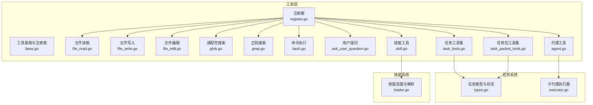

图表来源
- [pkg/tools/builtin/register.go:1-30](file://pkg/tools/builtin/register.go#L1-L30)
- [pkg/tools/base.go:1-132](file://pkg/tools/base.go#L1-L132)
- [pkg/tools/builtin/file_read.go:1-99](file://pkg/tools/builtin/file_read.go#L1-L99)
- [pkg/tools/builtin/file_write.go:1-80](file://pkg/tools/builtin/file_write.go#L1-L80)
- [pkg/tools/builtin/file_edit.go:1-98](file://pkg/tools/builtin/file_edit.go#L1-L98)
- [pkg/tools/builtin/glob.go:1-106](file://pkg/tools/builtin/glob.go#L1-L106)
- [pkg/tools/builtin/grep.go:1-141](file://pkg/tools/builtin/grep.go#L1-L141)
- [pkg/tools/builtin/bash.go:1-99](file://pkg/tools/builtin/bash.go#L1-L99)
- [pkg/tools/builtin/ask_user_question.go:1-80](file://pkg/tools/builtin/ask_user_question.go#L1-L80)
- [pkg/tools/builtin/task_tools.go:1-332](file://pkg/tools/builtin/task_tools.go#L1-L332)
- [pkg/tools/builtin/task_packet_tools.go:1-119](file://pkg/tools/builtin/task_packet_tools.go#L1-L119)
- [pkg/tools/builtin/skill.go:1-73](file://pkg/tools/builtin/skill.go#L1-L73)
- [pkg/tools/builtin/agent.go:1-72](file://pkg/tools/builtin/agent.go#L1-L72)
- [pkg/times/types.go:1-59](file://pkg/times/types.go#L1-L59)
- [pkg/skills/loader.go:1-198](file://pkg/skills/loader.go#L1-L198)
- [pkg/tasks/executor.go:1-55](file://pkg/tasks/executor.go#L1-L55)

章节来源
- [pkg/tools/builtin/register.go:1-30](file://pkg/tools/builtin/register.go#L1-L30)
- [pkg/tools/base.go:1-132](file://pkg/tools/base.go#L1-L132)

## 核心组件
- 工具注册与默认注册表：通过 RegisterAll 将内置工具批量注册到工具注册表，并提供 CreateDefaultToolRegistry 快捷入口。
- 工具基类与注册表：BaseTool 定义工具契约，BaseToolHelper 提供默认实现；ToolRegistry 提供线程安全的工具注册与查询。
- 工具执行上下文：包含当前工作目录、可扩展元数据，以及 AskUser/AskPermission 回调，用于与外部交互或权限控制。

章节来源
- [pkg/tools/builtin/register.go:7-30](file://pkg/tools/builtin/register.go#L7-L30)
- [pkg/tools/base.go:51-132](file://pkg/tools/base.go#L51-L132)

## 架构总览
内置工具围绕“工具注册表”组织，不同工具根据职责分为四类：
- 文件操作类：file_read、file_write、file_edit
- 搜索类：glob、grep
- 命令执行类：bash
- 交互与任务类：ask_user_question、task_tools、task_packet_tools、skill、agent

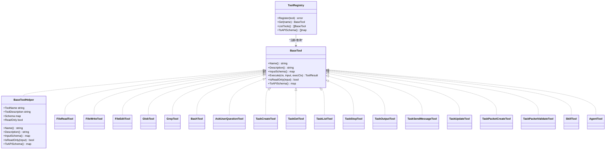

图表来源
- [pkg/tools/base.go:51-132](file://pkg/tools/base.go#L51-L132)
- [pkg/tools/builtin/file_read.go:25-57](file://pkg/tools/builtin/file_read.go#L25-L57)
- [pkg/tools/builtin/file_write.go:23-51](file://pkg/tools/builtin/file_write.go#L23-L51)
- [pkg/tools/builtin/file_edit.go:25-57](file://pkg/tools/builtin/file_edit.go#L25-L57)
- [pkg/tools/builtin/glob.go:24-52](file://pkg/tools/builtin/glob.go#L24-L52)
- [pkg/tools/builtin/grep.go:27-59](file://pkg/tools/builtin/grep.go#L27-L59)
- [pkg/tools/builtin/bash.go:24-53](file://pkg/tools/builtin/bash.go#L24-L53)
- [pkg/tools/builtin/ask_user_question.go:12-54](file://pkg/tools/builtin/ask_user_question.go#L12-L54)
- [pkg/tools/builtin/task_tools.go:12-41](file://pkg/tools/builtin/task_tools.go#L12-L41)
- [pkg/tools/builtin/task_packet_tools.go:12-52](file://pkg/tools/builtin/task_packet_tools.go#L12-L52)
- [pkg/tools/builtin/skill.go:21-52](file://pkg/tools/builtin/skill.go#L21-L52)
- [pkg/tools/builtin/agent.go:12-41](file://pkg/tools/builtin/agent.go#L12-L41)

## 详细组件分析

### 文件读取工具 file_read
- 功能：读取文件内容，支持从指定行偏移开始、限定最大行数的分段读取。
- 输入参数
  - file_path：必填，目标文件路径（相对路径基于执行上下文 Cwd）。
  - offset：可选，0 基起始行号，默认 0。
  - limit：可选，最大返回行数。
- 行为与边界
  - 若未提供 file_path，返回错误结果。
  - 路径非绝对时，自动拼接 Cwd。
  - 当 offset 超出总行数，会截断至末尾。
  - 当 offset + limit 超出范围，会截断至末尾。
- 错误处理
  - JSON 解析失败返回工具错误。
  - 文件读取失败返回工具错误。
- 使用建议
  - 大文件分页读取时，合理设置 offset 与 limit。
  - 对于二进制文件不建议使用该工具。

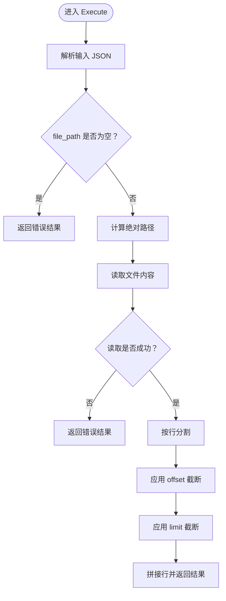

图表来源
- [pkg/tools/builtin/file_read.go:59-99](file://pkg/tools/builtin/file_read.go#L59-L99)

章节来源
- [pkg/tools/builtin/file_read.go:18-99](file://pkg/tools/builtin/file_read.go#L18-L99)

### 文件写入工具 file_write
- 功能：向文件写入内容，若文件不存在则创建，存在则覆盖。
- 输入参数
  - file_path：必填。
  - content：必填。
- 行为与边界
  - 路径非绝对时，自动拼接 Cwd。
  - 自动创建父目录（权限 0755）。
  - 写入文件（权限 0644）。
- 错误处理
  - JSON 解析失败返回工具错误。
  - 目录创建失败返回工具错误。
  - 文件写入失败返回工具错误。
- 使用建议
  - 对敏感信息避免直接明文写入，必要时配合权限控制。
  - 大文件写入建议分块处理。

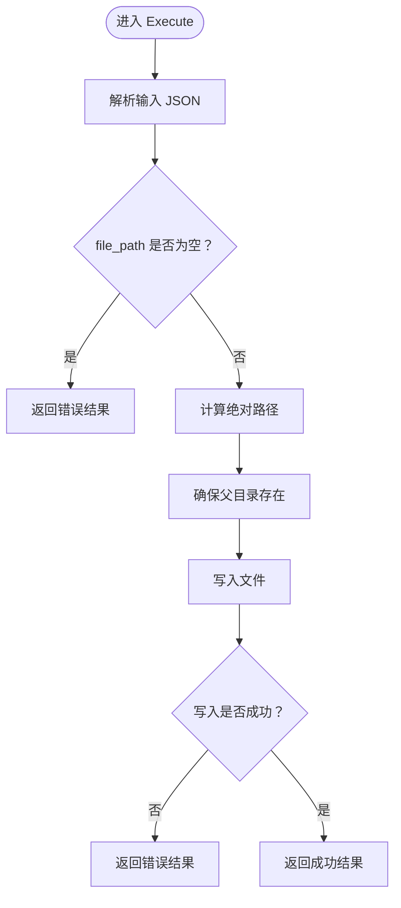

图表来源
- [pkg/tools/builtin/file_write.go:53-80](file://pkg/tools/builtin/file_write.go#L53-L80)

章节来源
- [pkg/tools/builtin/file_write.go:17-80](file://pkg/tools/builtin/file_write.go#L17-L80)

### 文件编辑工具 file_edit
- 功能：对文件进行精确字符串替换，要求旧字符串在文件中唯一出现一次。
- 输入参数
  - file_path：必填。
  - old_string：必填，必须在文件中唯一出现。
  - new_string：必填，替换文本。
- 行为与边界
  - 路径非绝对时，自动拼接 Cwd。
  - 读取全文后统计 old_string 出现次数，0 次或多次均视为失败。
  - 成功后写回新内容（权限 0644）。
- 错误处理
  - JSON 解析失败返回工具错误。
  - 文件读取失败返回工具错误。
  - old_string 不存在或重复出现返回工具错误。
  - 文件写入失败返回工具错误。
- 使用建议
  - 仅用于精确替换，避免正则表达式场景。
  - 替换前先用 grep 或 Read 验证唯一性。

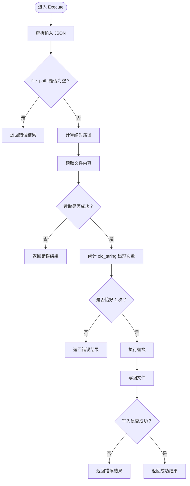

图表来源
- [pkg/tools/builtin/file_edit.go:59-98](file://pkg/tools/builtin/file_edit.go#L59-L98)

章节来源
- [pkg/tools/builtin/file_edit.go:18-98](file://pkg/tools/builtin/file_edit.go#L18-L98)

### 通配符搜索工具 glob
- 功能：在目录树中查找匹配给定通配符模式的文件，支持限定搜索根目录。
- 输入参数
  - pattern：必填，如 "**/*.go"。
  - path：可选，基准目录，默认 Cwd。
- 行为与边界
  - 路径非绝对时，自动拼接 Cwd。
  - 使用 filepath.WalkDir 遍历目录树。
  - 匹配策略：优先匹配相对路径，其次尝试匹配文件名。
  - 无匹配时返回提示信息。
- 错误处理
  - JSON 解析失败返回工具错误。
  - 遍历过程中忽略不可访问路径。
  - 结果为空返回提示信息。
- 使用建议
  - 模式使用 Go 语言的 filepath.Match 规则。
  - 大目录下谨慎使用，避免过多 IO。

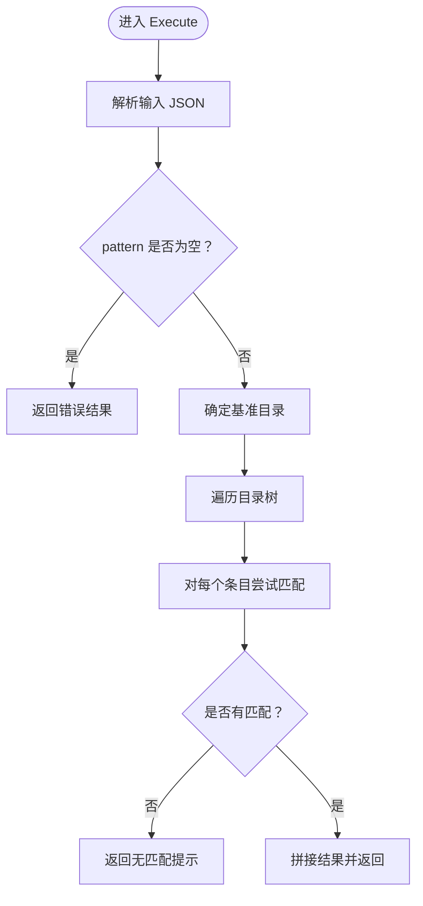

图表来源
- [pkg/tools/builtin/glob.go:54-106](file://pkg/tools/builtin/glob.go#L54-L106)

章节来源
- [pkg/tools/builtin/glob.go:18-106](file://pkg/tools/builtin/glob.go#L18-L106)

### 正则搜索工具 grep
- 功能：在目录树中按正则表达式搜索文件内容，支持按文件名通配过滤。
- 输入参数
  - pattern：必填，正则表达式。
  - path：可选，基准目录，默认 Cwd。
  - include：可选，文件名通配过滤器。
- 行为与边界
  - 编译正则失败返回工具错误。
  - 路径非绝对时，自动拼接 Cwd。
  - 遍历时先应用 include 过滤，再逐行扫描匹配。
  - 结果按“文件:行号:内容”格式记录，最多返回固定上限条目。
- 错误处理
  - JSON 解析失败返回工具错误。
  - 正则无效返回工具错误。
  - 遍历异常返回工具错误。
  - 无法读取的文件跳过。
- 使用建议
  - 正则表达式需符合 Go 语法。
  - include 与 pattern 组合使用以缩小搜索范围。

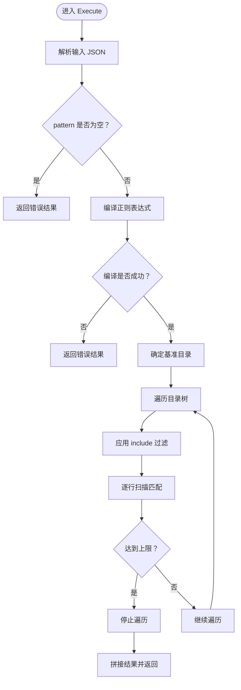

图表来源
- [pkg/tools/builtin/grep.go:61-141](file://pkg/tools/builtin/grep.go#L61-L141)

章节来源
- [pkg/tools/builtin/grep.go:20-141](file://pkg/tools/builtin/grep.go#L20-L141)

### 终端命令工具 bash
- 功能：在子进程中执行 bash 命令，支持超时控制。
- 输入参数
  - command：必填。
  - timeout：可选，秒，默认 120。
- 行为与边界
  - 使用 context.WithTimeout 控制执行时间。
  - 设置命令工作目录为 Cwd。
  - 合并标准输出与标准错误，错误时也返回错误信息。
  - 超时返回超时错误，非零退出码返回退出错误。
- 错误处理
  - JSON 解析失败返回工具错误。
  - 命令为空返回工具错误。
  - 超时返回超时错误，其他错误返回带输出的错误结果。
- 使用建议
  - 为长耗时命令设置合理 timeout。
  - 避免在生产环境执行高风险命令，结合权限控制。

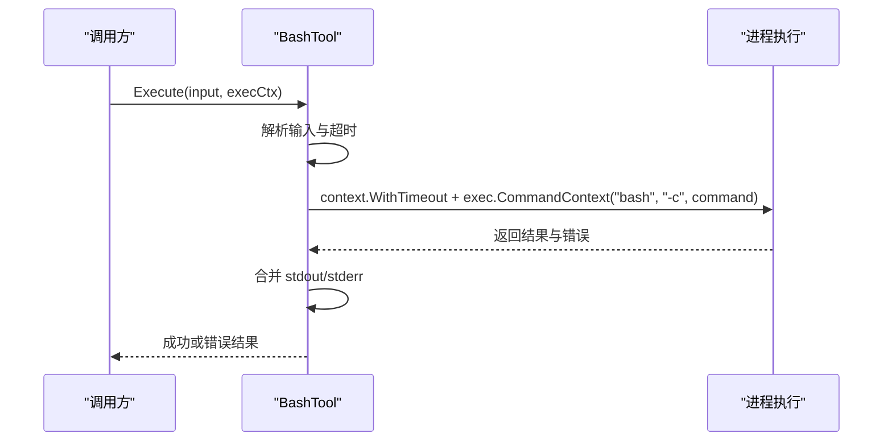

图表来源
- [pkg/tools/builtin/bash.go:55-99](file://pkg/tools/builtin/bash.go#L55-L99)

章节来源
- [pkg/tools/builtin/bash.go:18-99](file://pkg/tools/builtin/bash.go#L18-L99)

### 用户交互工具 ask_user_question
- 功能：向用户提问并等待回答，支持自由回答与多选。
- 输入参数
  - question：必填。
  - options：可选，多选列表。
- 行为与边界
  - 无可用 AskUser 回调时返回不可用提示。
  - 问题为空返回错误。
  - 去除回答前后空白，空回答返回特定提示。
- 错误处理
  - JSON 解析失败返回工具错误。
  - AskUser 回调失败返回工具错误。
- 使用建议
  - 仅在具备交互前端的会话中使用。
  - 多选题提供清晰且互斥的选项。

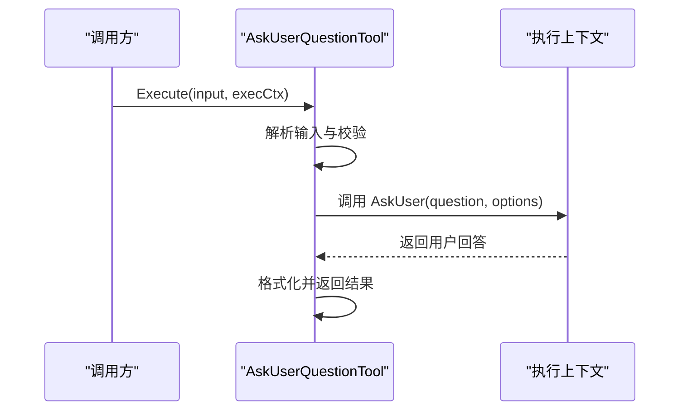

图表来源
- [pkg/tools/builtin/ask_user_question.go:56-80](file://pkg/tools/builtin/ask_user_question.go#L56-L80)

章节来源
- [pkg/tools/builtin/ask_user_question.go:16-80](file://pkg/tools/builtin/ask_user_question.go#L16-L80)

### 任务相关工具 task_tools
- 工作流与状态管理
  - TaskCreate：创建任务并异步派生子代理，返回任务 ID 与代理类型。
  - TaskGet：按任务 ID 查询任务详情（含状态、输出、消息等）。
  - TaskList：列出所有任务摘要（ID、状态、代理类型、简短提示）。
  - TaskStop：取消任务（通过 TaskRegistry 停止并取消上下文）。
  - TaskOutput：获取任务累积输出。
  - TaskSendMessage：向运行中的子代理发送消息。
  - TaskUpdate：手动更新任务状态（完成/失败/停止）。
- 关键类型
  - TaskStatus：created/running/completed/failed/stopped。
  - TaskEntry：任务条目，包含输出、消息、时间戳等。
  - SubAgentType：general-purpose/Explore/Plan/Verification。
- 集成点
  - 依赖 TaskRegistry 管理任务生命周期。
  - 依赖 SubAgentExecutor 派生子代理。

```mermaid
sequenceDiagram
participant Caller as "调用方"
participant Create as "TaskCreateTool"
participant Exec as "SubAgentExecutor"
participant Reg as "TaskRegistry"
Caller->>Create : Execute({prompt, agent_type})
Create->>Exec : SpawnAgent(config)
Exec->>Reg : Create(prompt, agent_type)
Reg-->>Exec : 返回 taskID
Exec-->>Create : 返回 taskID
Create-->>Caller : 返回任务信息
```

图表来源
- [pkg/tools/builtin/task_tools.go:43-67](file://pkg/tools/builtin/task_tools.go#L43-L67)
- [pkg/tasks/executor.go:33-51](file://pkg/tasks/executor.go#L33-L51)

章节来源
- [pkg/tools/builtin/task_tools.go:12-332](file://pkg/tools/builtin/task_tools.go#L12-L332)
- [pkg/times/types.go:8-59](file://pkg/times/types.go#L8-L59)
- [design/TASK.md:148-254](file://design/TASK.md#L148-L254)

### 任务包工具 task_packet_tools
- 功能
  - TaskPacketCreate：创建结构化任务包（目标、范围、验收测试、分支/提交策略等），以 JSON 形式输出。
  - TaskPacketValidate：验证任务包完整性与正确性，给出缺失项与警告。
- 数据模型
  - TaskPacket：包含 objective、scope、branch_policy、acceptance_tests、commit_policy 等字段。
- 使用建议
  - 在任务规划阶段使用 TaskPacketCreate 明确契约。
  - 使用 TaskPacketValidate 进行预检，减少执行期偏差。

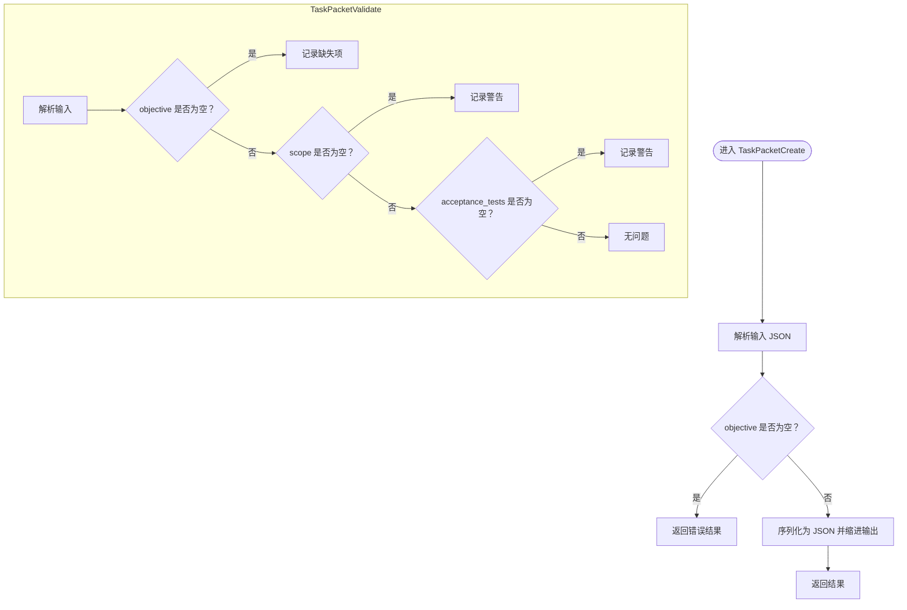

图表来源
- [pkg/tools/builtin/task_packet_tools.go:54-119](file://pkg/tools/builtin/task_packet_tools.go#L54-L119)
- [pkg/times/types.go:18-27](file://pkg/times/types.go#L18-L27)

章节来源
- [pkg/tools/builtin/task_packet_tools.go:12-119](file://pkg/tools/builtin/task_packet_tools.go#L12-L119)
- [pkg/times/types.go:18-27](file://pkg/times/types.go#L18-L27)

### 技能工具 skill
- 功能：按名称加载已加载的技能指令，作为 LLM 的“能力披露”，避免一次性注入大量上下文。
- 输入参数
  - name：必填，技能名称。
- 行为与边界
  - 未找到技能返回错误。
  - 输出包含指令包装的消息。
- 集成点
  - 依赖技能加载器加载技能集合。
  - 与可用技能列表联动，由上层展示。

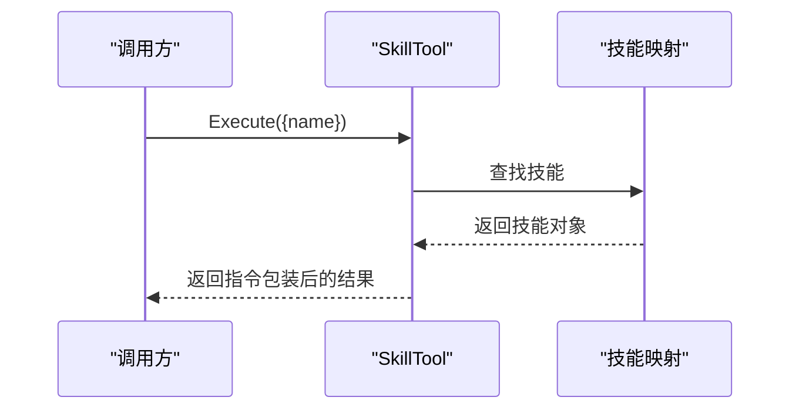

图表来源
- [pkg/tools/builtin/skill.go:54-73](file://pkg/tools/builtin/skill.go#L54-L73)
- [pkg/skills/loader.go:23-60](file://pkg/skills/loader.go#L23-L60)

章节来源
- [pkg/tools/builtin/skill.go:16-73](file://pkg/tools/builtin/skill.go#L16-L73)
- [pkg/skills/loader.go:13-198](file://pkg/skills/loader.go#L13-L198)

### 代理工具 agent
- 功能：同步派生一个具有独立对话上下文与工具访问的子代理，适合复杂任务的专用聚焦或并行执行。
- 输入参数
  - prompt：必填，任务描述/目标。
  - agent_type：可选，子代理类型（general-purpose/Explore/Plan/Verification）。
- 行为与边界
  - 默认类型为 general-purpose。
  - 同步执行，返回任务 ID 与最终输出。
  - 通过 SubAgentExecutor.SpawnAgentSync 实现。
- 集成点
  - 依赖 SubAgentExecutor 构建受限工具集（白名单沙箱）。
  - 与任务工具配合，实现异步/同步两种模式。

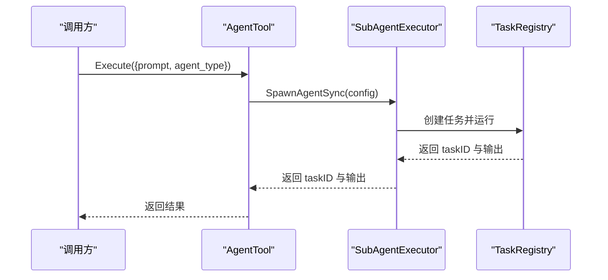

图表来源
- [pkg/tools/builtin/agent.go:43-72](file://pkg/tools/builtin/agent.go#L43-L72)
- [pkg/tasks/executor.go:53-55](file://pkg/tasks/executor.go#L53-L55)
- [design/TASK.md:148-254](file://design/TASK.md#L148-L254)

章节来源
- [pkg/tools/builtin/agent.go:17-72](file://pkg/tools/builtin/agent.go#L17-L72)
- [pkg/tasks/executor.go:16-55](file://pkg/tasks/executor.go#L16-L55)
- [design/TASK.md:148-254](file://design/TASK.md#L148-L254)

## 依赖关系分析
- 注册与发现
  - register.go 将所有内置工具注册到工具注册表，便于统一导出与调用。
- 工具基类
  - base.go 定义工具契约与注册表，确保工具的一致性与可扩展性。
- 任务系统
  - task_tools 与 task_packet_tools 依赖任务类型与注册表；agent 与 task_tools 共同构成“任务-代理”闭环。
- 技能系统
  - skill 依赖技能加载器提供的技能映射，实现“按需披露”。

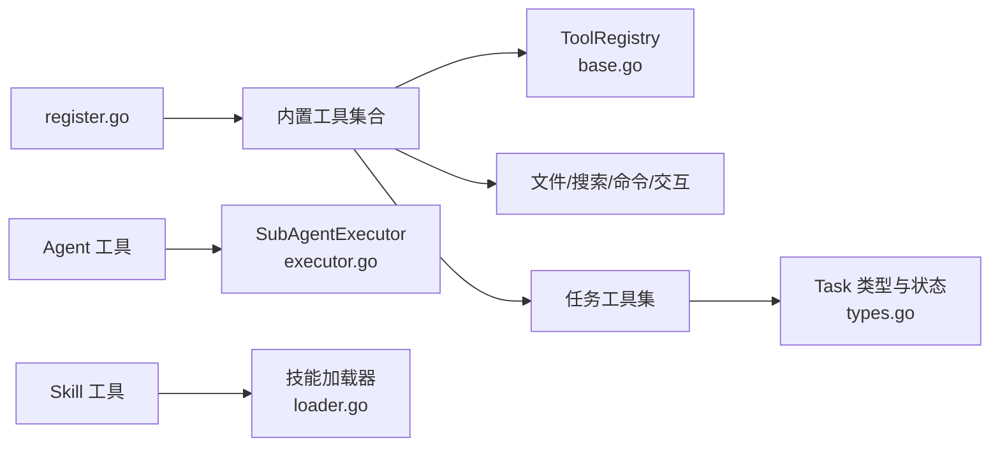

图表来源
- [pkg/tools/builtin/register.go:7-30](file://pkg/tools/builtin/register.go#L7-L30)
- [pkg/tools/base.go:81-132](file://pkg/tools/base.go#L81-L132)
- [pkg/tools/builtin/task_tools.go:12-41](file://pkg/tools/builtin/task_tools.go#L12-L41)
- [pkg/times/types.go:8-59](file://pkg/times/types.go#L8-L59)
- [pkg/tools/builtin/agent.go:12-41](file://pkg/tools/builtin/agent.go#L12-L41)
- [pkg/tasks/executor.go:24-31](file://pkg/tasks/executor.go#L24-L31)
- [pkg/tools/builtin/skill.go:21-52](file://pkg/tools/builtin/skill.go#L21-L52)
- [pkg/skills/loader.go:23-60](file://pkg/skills/loader.go#L23-L60)

章节来源
- [pkg/tools/builtin/register.go:7-30](file://pkg/tools/builtin/register.go#L7-L30)
- [pkg/tools/base.go:81-132](file://pkg/tools/base.go#L81-L132)

## 性能考量
- 文件读写
  - 分段读取（file_read）与分块写入（file_write）有助于控制内存占用。
  - 大文件建议使用 glob/grep 辅助定位后再精细读取。
- 搜索
  - grep 支持 include 过滤与结果上限，避免全盘扫描带来的开销。
  - glob 对每个条目进行两次匹配（相对路径与文件名），建议合理选择模式。
- 命令执行
  - bash 工具设置超时，防止长时间阻塞；对高风险命令应结合权限控制。
- 任务与代理
  - 子代理默认最大轮次有限，避免无限循环；可通过 TaskUpdate 手动干预。
  - 任务包验证可在执行前降低失败概率，减少重试成本。

## 故障排查指南
- 输入参数错误
  - JSON 解析失败：检查请求体格式与字段拼写。
  - 必填字段缺失：确认 required 字段是否传入。
- 文件操作失败
  - file_read/file_write/file_edit：检查路径是否存在、权限是否足够、磁盘空间是否充足。
  - file_edit：确认 old_string 唯一性，必要时先 grep 验证。
- 搜索无结果
  - glob/grep：检查 pattern 与 include 是否匹配预期；确认基准目录是否正确。
- 命令执行失败
  - bash：检查命令是否可执行、工作目录是否正确、超时是否过短。
- 任务与代理
  - TaskGet/TaskList/TaskStop/TaskOutput/TaskSendMessage/TaskUpdate：确认任务 ID 是否有效；查看 TaskRegistry 状态。
  - Agent：确认 SubAgentExecutor 配置与 AllowedTools 白名单。
- 技能与交互
  - skill：确认技能名称存在于已加载映射；检查可用技能列表。
  - ask_user_question：确认执行上下文具备 AskUser 回调。

章节来源
- [pkg/tools/builtin/file_read.go:61-67](file://pkg/tools/builtin/file_read.go#L61-L67)
- [pkg/tools/builtin/file_write.go:55-61](file://pkg/tools/builtin/file_write.go#L55-L61)
- [pkg/tools/builtin/file_edit.go:61-67](file://pkg/tools/builtin/file_edit.go#L61-L67)
- [pkg/tools/builtin/glob.go:56-62](file://pkg/tools/builtin/glob.go#L56-L62)
- [pkg/tools/builtin/grep.go:63-69](file://pkg/tools/builtin/grep.go#L63-L69)
- [pkg/tools/builtin/bash.go:57-63](file://pkg/tools/builtin/bash.go#L57-L63)
- [pkg/tools/builtin/ask_user_question.go:58-68](file://pkg/tools/builtin/ask_user_question.go#L58-L68)
- [pkg/tools/builtin/task_tools.go:95-108](file://pkg/tools/builtin/task_tools.go#L95-L108)
- [pkg/tools/builtin/agent.go:43-53](file://pkg/tools/builtin/agent.go#L43-L53)
- [pkg/tools/builtin/skill.go:55-68](file://pkg/tools/builtin/skill.go#L55-L68)

## 结论
内置工具体系以统一的工具基类与注册表为核心，围绕文件操作、搜索、命令执行、用户交互、任务与代理、技能披露等维度提供了完备的能力集。通过任务包契约与子代理沙箱机制，系统实现了复杂任务的可控执行与可观测性。建议在实际使用中遵循参数校验、路径解析、权限与超时控制的最佳实践，以获得稳定可靠的自动化体验。

## 附录
- 使用示例与最佳实践（以路径代替具体代码）
  - 文件读取
    - 示例路径：[file_read.go:59-99](file://pkg/tools/builtin/file_read.go#L59-L99)
    - 最佳实践：大文件分页读取，避免一次性加载。
  - 文件写入
    - 示例路径：[file_write.go:53-80](file://pkg/tools/builtin/file_write.go#L53-L80)
    - 最佳实践：先确保父目录存在，再写入文件。
  - 文件编辑
    - 示例路径：[file_edit.go:59-98](file://pkg/tools/builtin/file_edit.go#L59-L98)
    - 最佳实践：先 grep 验证 old_string 唯一性。
  - 通配符搜索
    - 示例路径：[glob.go:54-106](file://pkg/tools/builtin/glob.go#L54-L106)
    - 最佳实践：合理设计 pattern，避免全盘扫描。
  - 正则搜索
    - 示例路径：[grep.go:61-141](file://pkg/tools/builtin/grep.go#L61-L141)
    - 最佳实践：结合 include 过滤与结果上限。
  - 命令执行
    - 示例路径：[bash.go:55-99](file://pkg/tools/builtin/bash.go#L55-L99)
    - 最佳实践：为长耗时命令设置合理 timeout。
  - 用户交互
    - 示例路径：[ask_user_question.go:56-80](file://pkg/tools/builtin/ask_user_question.go#L56-L80)
    - 最佳实践：仅在具备交互前端的会话中使用。
  - 任务工具
    - 示例路径：[task_tools.go:43-67](file://pkg/tools/builtin/task_tools.go#L43-L67)
    - 最佳实践：异步任务使用 TaskGet 轮询状态。
  - 任务包工具
    - 示例路径：[task_packet_tools.go:54-119](file://pkg/tools/builtin/task_packet_tools.go#L54-L119)
    - 最佳实践：在任务规划阶段使用 TaskPacketCreate 与 TaskPacketValidate。
  - 技能工具
    - 示例路径：[skill.go:54-73](file://pkg/tools/builtin/skill.go#L54-L73)
    - 最佳实践：按需披露技能指令，避免上下文膨胀。
  - 代理工具
    - 示例路径：[agent.go:43-72](file://pkg/tools/builtin/agent.go#L43-L72)
    - 最佳实践：根据任务类型选择合适的子代理类型与工具白名单。