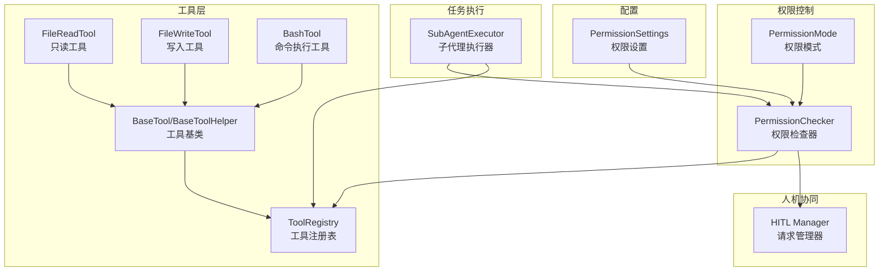
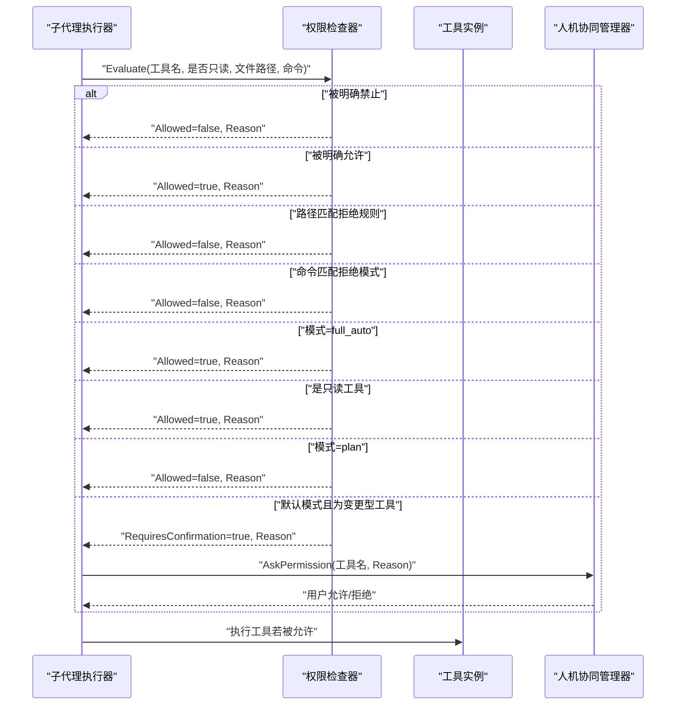
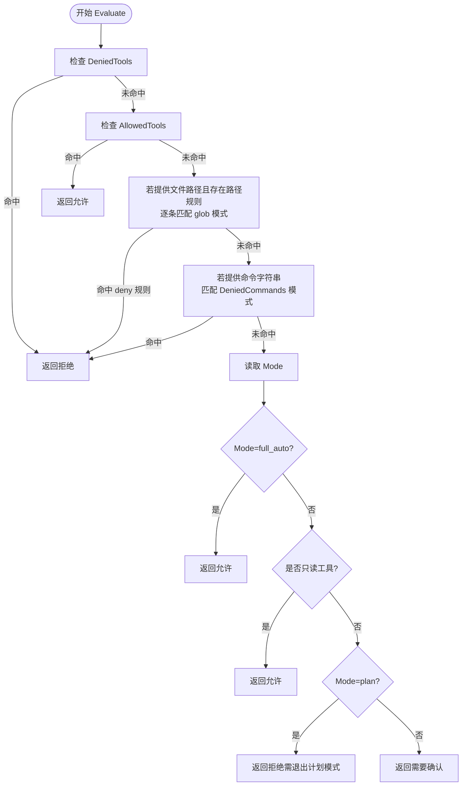
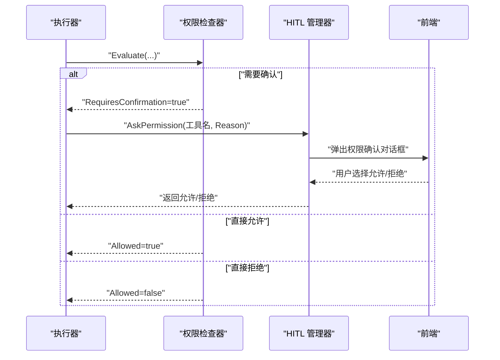
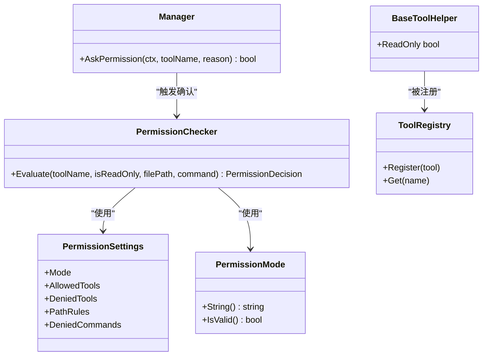

# 工具权限控制

<cite>
**本文引用的文件**
- [pkg/permissions/checker.go](file://pkg/permissions/checker.go)
- [pkg/permissions/modes.go](file://pkg/permissions/modes.go)
- [pkg/config/settings.go](file://pkg/config/settings.go)
- [pkg/tools/base.go](file://pkg/tools/base.go)
- [pkg/tools/builtin/file_read.go](file://pkg/tools/builtin/file_read.go)
- [pkg/tools/builtin/file_write.go](file://pkg/tools/builtin/file_write.go)
- [pkg/tools/builtin/bash.go](file://pkg/tools/builtin/bash.go)
- [pkg/tasks/executor.go](file://pkg/tasks/executor.go)
- [pkg/hitl/manager.go](file://pkg/hitl/manager.go)
- [design/Human-In-The-Loop.md](file://design/Human-In-The-Loop.md)
</cite>

## 目录
1. [引言](#引言)
2. [项目结构](#项目结构)
3. [核心组件](#核心组件)
4. [架构总览](#架构总览)
5. [详细组件分析](#详细组件分析)
6. [依赖分析](#依赖分析)
7. [性能考虑](#性能考虑)
8. [故障排除指南](#故障排除指南)
9. [结论](#结论)
10. [附录](#附录)

## 引言
本文件系统性阐述 OpenHarness 的“工具权限控制”体系，重点围绕权限检查器（PermissionChecker）的工作原理、检查流程与决策机制展开；同时解释权限模式（PermissionMode）的三个级别及其适用场景与安全策略；说明工具执行前的权限验证、用户授权与访问控制；介绍只读工具的识别机制、安全边界与风险控制；解释权限请求的触发时机、用户交互与决策记录；最后给出权限配置的管理方式、规则定义与动态调整建议，并提供实现示例、安全最佳实践与故障排除指南。

## 项目结构
OpenHarness 将权限控制能力集中在 pkg/permissions 包中，结合配置层（pkg/config）与工具层（pkg/tools），并通过人机协同（pkg/hitl）完成最终的人工确认闭环。任务执行路径（pkg/tasks/executor.go）在需要时注入权限检查器，以确保工具调用符合当前策略。

图表来源
- [pkg/permissions/checker.go:23-39](file://pkg/permissions/checker.go#L23-L39)
- [pkg/permissions/modes.go:4-11](file://pkg/permissions/modes.go#L4-L11)
- [pkg/config/settings.go:37-44](file://pkg/config/settings.go#L37-L44)
- [pkg/tools/base.go:51-79](file://pkg/tools/base.go#L51-L79)
- [pkg/tools/builtin/file_read.go:26-45](file://pkg/tools/builtin/file_read.go#L26-L45)
- [pkg/tools/builtin/file_write.go:24-51](file://pkg/tools/builtin/file_write.go#L24-L51)
- [pkg/tools/builtin/bash.go:24-53](file://pkg/tools/builtin/bash.go#L24-L53)
- [pkg/tasks/executor.go:108-114](file://pkg/tasks/executor.go#L108-L114)
- [pkg/hitl/manager.go:247-261](file://pkg/hitl/manager.go#L247-L261)

章节来源
- [pkg/permissions/checker.go:1-92](file://pkg/permissions/checker.go#L1-L92)
- [pkg/permissions/modes.go:1-28](file://pkg/permissions/modes.go#L1-L28)
- [pkg/config/settings.go:1-212](file://pkg/config/settings.go#L1-L212)
- [pkg/tools/base.go:1-132](file://pkg/tools/base.go#L1-L132)
- [pkg/tasks/executor.go:1-224](file://pkg/tasks/executor.go#L1-L224)
- [pkg/hitl/manager.go:246-384](file://pkg/hitl/manager.go#L246-L384)

## 核心组件
- 权限检查器（PermissionChecker）
  - 职责：根据配置的权限模式与规则，对工具调用进行许可判定，决定是否允许执行或需要人工确认。
  - 关键输入：工具名、是否只读、目标文件路径、命令字符串。
  - 关键输出：PermissionDecision（包含 Allowed、RequiresConfirmation、Reason）。
- 权限模式（PermissionMode）
  - default：默认模式，只读工具直接放行，非只读工具需用户确认。
  - plan：计划模式，阻止所有变更型工具，直到用户退出计划模式。
  - full_auto：自动放行模式，所有工具均允许执行。
- 配置（PermissionSettings）
  - 模式（Mode）、允许工具列表（AllowedTools）、禁止工具列表（DeniedTools）、路径规则（PathRules）、命令禁止模式（DeniedCommands）。
- 工具层
  - BaseToolHelper 提供只读标记（ReadOnly），用于快速识别只读工具。
  - 典型工具：只读（如 FileReadTool）、写入（FileWriteTool）、命令执行（BashTool）。
- 人机协同（HITL Manager）
  - 负责发起权限请求、等待前端响应、解析并回传结果，支持问题与权限两类请求。
- 任务执行（SubAgentExecutor）
  - 在运行子代理时可注入权限检查器，若未注入则默认放行（AllowAllPermissions）。

章节来源
- [pkg/permissions/checker.go:10-82](file://pkg/permissions/checker.go#L10-L82)
- [pkg/permissions/modes.go:4-27](file://pkg/permissions/modes.go#L4-L27)
- [pkg/config/settings.go:37-55](file://pkg/config/settings.go#L37-L55)
- [pkg/tools/base.go:62-79](file://pkg/tools/base.go#L62-L79)
- [pkg/tools/builtin/file_read.go:34-36](file://pkg/tools/builtin/file_read.go#L34-L36)
- [pkg/tools/builtin/file_write.go:32-34](file://pkg/tools/builtin/file_write.go#L32-L34)
- [pkg/tools/builtin/bash.go:32-35](file://pkg/tools/builtin/bash.go#L32-L35)
- [pkg/hitl/manager.go:247-353](file://pkg/hitl/manager.go#L247-L353)
- [pkg/tasks/executor.go:108-114](file://pkg/tasks/executor.go#L108-L114)

## 架构总览
下图展示从工具调用到权限决策与用户交互的整体流程，包括只读识别、路径与命令规则匹配、模式决策以及权限请求的触发与处理。

图表来源
- [pkg/permissions/checker.go:41-82](file://pkg/permissions/checker.go#L41-L82)
- [pkg/hitl/manager.go:298-325](file://pkg/hitl/manager.go#L298-L325)
- [pkg/tasks/executor.go:108-114](file://pkg/tasks/executor.go#L108-L114)

## 详细组件分析

### 权限检查器（PermissionChecker）工作原理
- 决策链路
  1) 工具白名单/黑名单优先：若工具在 DeniedTools 中直接拒绝；若在 AllowedTools 中直接允许。
  2) 路径规则：当存在 PathRules 且提供了文件路径时，按顺序匹配 glob 规则；若命中 deny 规则（Allow=false）则拒绝。
  3) 命令规则：当提供了命令字符串时，按顺序匹配 DeniedCommands 的 glob 模式，命中即拒绝。
  4) 模式决策：根据 Mode 进行最终裁决：
     - ModeFullAuto：全部允许。
     - isReadOnly 为真：直接允许。
     - ModePlan：阻止变更型工具。
     - 默认模式：变更型工具要求用户确认。
- 返回值 PermissionDecision
  - Allowed：是否允许执行。
  - RequiresConfirmation：是否需要用户确认。
  - Reason：简要说明决策依据，便于日志与用户提示。

图表来源
- [pkg/permissions/checker.go:41-82](file://pkg/permissions/checker.go#L41-L82)

章节来源
- [pkg/permissions/checker.go:41-82](file://pkg/permissions/checker.go#L41-L82)

### 权限模式（PermissionMode）详解
- default
  - 安全策略：变更型工具必须经用户确认；只读工具直接放行。
  - 适用场景：日常开发与探索，兼顾安全性与可用性。
- plan
  - 安全策略：阻止所有变更型工具，直至用户显式退出计划模式。
  - 适用场景：大规模重构、批量修改、高风险操作前的隔离阶段。
- full_auto
  - 安全策略：自动放行所有工具，不进行二次确认。
  - 适用场景：受控沙箱环境、自动化流水线或可信内部工具集。

章节来源
- [pkg/permissions/modes.go:7-11](file://pkg/permissions/modes.go#L7-L11)
- [pkg/permissions/modes.go:19-27](file://pkg/permissions/modes.go#L19-L27)

### 只读工具识别与安全边界
- 识别机制
  - 工具通过 BaseToolHelper.ReadOnly 字段声明自身是否只读。
  - 权限检查器在 Evaluate 中接收 isReadOnly 参数，若为真则直接放行。
- 安全边界
  - 只读工具（如文件读取、目录扫描、文本搜索）不改变系统状态，风险较低。
  - 变更型工具（写入、命令执行）在 default/plan 模式下需用户确认或被阻止。
- 风险控制
  - 通过 AllowedTools/DeniedTools 精细控制工具集合。
  - 通过 PathRules 限制可访问的文件范围，避免越权写入或覆盖关键文件。
  - 通过 DeniedCommands 限制危险命令模式，降低命令注入与误执行风险。

章节来源
- [pkg/tools/base.go:62-79](file://pkg/tools/base.go#L62-L79)
- [pkg/tools/builtin/file_read.go:34-36](file://pkg/tools/builtin/file_read.go#L34-L36)
- [pkg/tools/builtin/file_write.go:32-34](file://pkg/tools/builtin/file_write.go#L32-L34)
- [pkg/tools/builtin/bash.go:32-35](file://pkg/tools/builtin/bash.go#L32-L35)
- [pkg/permissions/checker.go:75-77](file://pkg/permissions/checker.go#L75-L77)

### 权限请求触发时机、用户交互与决策记录
- 触发时机
  - 当 Evaluate 返回 RequiresConfirmation=true 时，由执行上下文中的 AskPermission 回调发起请求。
- 用户交互
  - HITL Manager 发送 ModalPermission 请求，携带工具名与原因（Reason）。
  - 前端返回后，ResolvePermission 解析并回传给等待方。
- 决策记录
  - Reason 字段可用于审计日志与用户提示，便于追踪每次权限决策的依据。

图表来源
- [pkg/permissions/checker.go:81](file://pkg/permissions/checker.go#L81)
- [pkg/hitl/manager.go:298-325](file://pkg/hitl/manager.go#L298-L325)
- [pkg/hitl/manager.go:341-353](file://pkg/hitl/manager.go#L341-L353)

章节来源
- [pkg/hitl/manager.go:298-353](file://pkg/hitl/manager.go#L298-L353)
- [design/Human-In-The-Loop.md:235-384](file://design/Human-In-The-Loop.md#L235-L384)

### 权限配置管理、规则定义与动态调整
- 配置项
  - Mode：选择 default/plan/full_auto。
  - AllowedTools/DeniedTools：工具级白名单/黑名单。
  - PathRules：glob 模式路径规则，含 pattern 与 allow（true 表示允许，false 表示拒绝）。
  - DeniedCommands：glob 模式命令禁止列表。
- 规则定义
  - 路径规则：例如仅允许特定目录下的文件读取，或拒绝覆盖关键配置文件。
  - 命令规则：例如拒绝包含危险参数的命令模式，降低注入风险。
- 动态调整
  - 通过配置文件加载与保存（LoadSettings/SaveSettings），可在运行时更新权限策略。
  - 任务执行器可注入新的权限检查器实例，以实现按会话或任务粒度的差异化策略。

章节来源
- [pkg/config/settings.go:37-55](file://pkg/config/settings.go#L37-L55)
- [pkg/config/settings.go:160-195](file://pkg/config/settings.go#L160-L195)
- [pkg/tasks/executor.go:108-114](file://pkg/tasks/executor.go#L108-L114)

### 实现示例与最佳实践
- 示例：构建权限检查器
  - 使用配置中的 PermissionSettings 创建 PermissionChecker。
  - 在工具执行前调用 Evaluate，传入工具名、只读标志、文件路径与命令字符串。
- 最佳实践
  - 默认使用 default 模式，仅在受控环境下启用 full_auto。
  - 明确划分 AllowedTools 与 PathRules，避免宽泛的通配符导致越权。
  - 对 Bash 等高危工具，尽量限定命令模式与路径范围。
  - 记录 Reason 以便审计与复盘。
  - 在计划模式下，严格限制变更型工具，直至用户确认退出。

章节来源
- [pkg/permissions/checker.go:30-39](file://pkg/permissions/checker.go#L30-L39)
- [pkg/permissions/checker.go:41-82](file://pkg/permissions/checker.go#L41-L82)

## 依赖分析
- 组件耦合
  - PermissionChecker 依赖配置（PermissionSettings）与模式（PermissionMode）。
  - 工具层通过 BaseToolHelper 的 ReadOnly 字段参与只读识别。
  - 执行器（SubAgentExecutor）可注入权限检查器，形成“策略-执行”解耦。
  - HITL Manager 作为外部交互点，负责权限请求与响应。
- 外部依赖
  - 路径匹配使用标准库 glob 模式，命令匹配同样采用 glob 模式，保证简洁一致。

图表来源
- [pkg/permissions/checker.go:25-28](file://pkg/permissions/checker.go#L25-L28)
- [pkg/config/settings.go:37-44](file://pkg/config/settings.go#L37-L44)
- [pkg/permissions/modes.go:4-11](file://pkg/permissions/modes.go#L4-L11)
- [pkg/tools/base.go:62-79](file://pkg/tools/base.go#L62-L79)
- [pkg/hitl/manager.go:298-325](file://pkg/hitl/manager.go#L298-L325)

章节来源
- [pkg/permissions/checker.go:23-39](file://pkg/permissions/checker.go#L23-L39)
- [pkg/config/settings.go:37-55](file://pkg/config/settings.go#L37-L55)
- [pkg/tools/base.go:82-102](file://pkg/tools/base.go#L82-L102)
- [pkg/hitl/manager.go:247-261](file://pkg/hitl/manager.go#L247-L261)

## 性能考虑
- 权限检查复杂度
  - 路径规则与命令规则均为线性遍历，规则数量较多时建议精简与合并。
  - glob 匹配开销较小，但应避免过多重叠规则导致不必要的匹配次数。
- 并发与锁
  - 工具注册表为并发安全容器，权限检查本身为纯函数式判断，无共享状态。
- I/O 与外部调用
  - 权限检查不涉及磁盘或网络 I/O，主要为内存计算，延迟极低。
- 建议
  - 合理组织 PathRules 与 DeniedCommands，减少匹配轮次。
  - 在高频工具调用场景下，保持默认模式并合理使用 AllowedTools 白名单。

## 故障排除指南
- 常见问题
  - 工具被意外拒绝：检查 DeniedTools 与 PathRules 是否过于严格；确认工具名拼写与大小写。
  - 变更型工具无法执行：确认当前模式是否为 plan 或 default；若为 plan，需先退出计划模式。
  - 命令被拦截：检查 DeniedCommands 是否匹配了目标命令模式。
  - 权限请求未出现：确认执行上下文中已注入 AskPermission 回调；检查 HITL 管理器是否正确处理前端响应。
- 排查步骤
  - 查看 PermissionDecision.Reason，定位具体拒绝原因。
  - 逐步缩小规则范围，验证 PathRules 与 DeniedCommands 的匹配逻辑。
  - 切换至 full_auto 快速验证工具功能，再逐步收紧策略。
  - 检查配置文件加载与保存流程，确保最新配置生效。

章节来源
- [pkg/permissions/checker.go:48-68](file://pkg/permissions/checker.go#L48-L68)
- [pkg/hitl/manager.go:130-141](file://pkg/hitl/manager.go#L130-L141)
- [pkg/config/settings.go:160-195](file://pkg/config/settings.go#L160-L195)

## 结论
OpenHarness 的权限控制体系以清晰的决策链路与可配置的模式为核心，结合只读工具识别、路径与命令规则、以及人机协同确认，实现了从策略到执行的完整闭环。通过合理配置与最佳实践，可以在保障安全的前提下提升工具使用的灵活性与可控性。

## 附录
- 相关实现参考
  - 权限检查器与模式：[pkg/permissions/checker.go:1-92](file://pkg/permissions/checker.go#L1-L92)、[pkg/permissions/modes.go:1-28](file://pkg/permissions/modes.go#L1-L28)
  - 配置模型：[pkg/config/settings.go:37-55](file://pkg/config/settings.go#L37-L55)
  - 工具基类与只读标识：[pkg/tools/base.go:62-79](file://pkg/tools/base.go#L62-L79)
  - 典型工具（只读/写入/命令）：[pkg/tools/builtin/file_read.go:26-45](file://pkg/tools/builtin/file_read.go#L26-L45)、[pkg/tools/builtin/file_write.go:24-51](file://pkg/tools/builtin/file_write.go#L24-L51)、[pkg/tools/builtin/bash.go:24-53](file://pkg/tools/builtin/bash.go#L24-L53)
  - 任务执行与权限注入：[pkg/tasks/executor.go:108-114](file://pkg/tasks/executor.go#L108-L114)
  - 人机协同权限请求：[pkg/hitl/manager.go:298-325](file://pkg/hitl/manager.go#L298-L325)、[design/Human-In-The-Loop.md:235-384](file://design/Human-In-The-Loop.md#L235-L384)