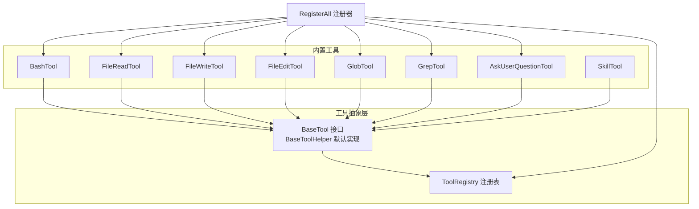
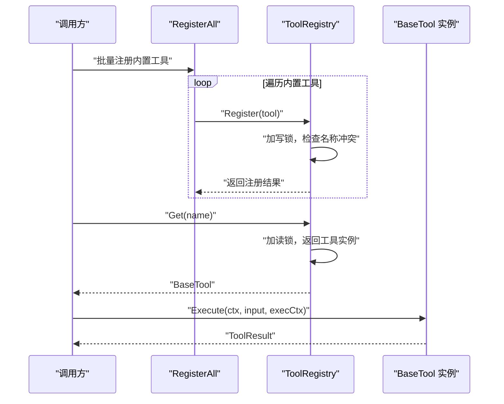
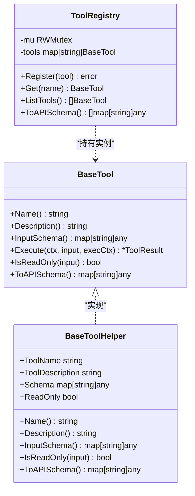
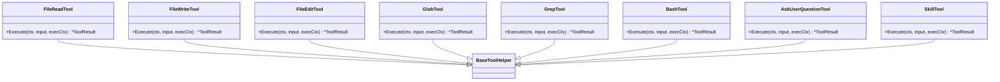
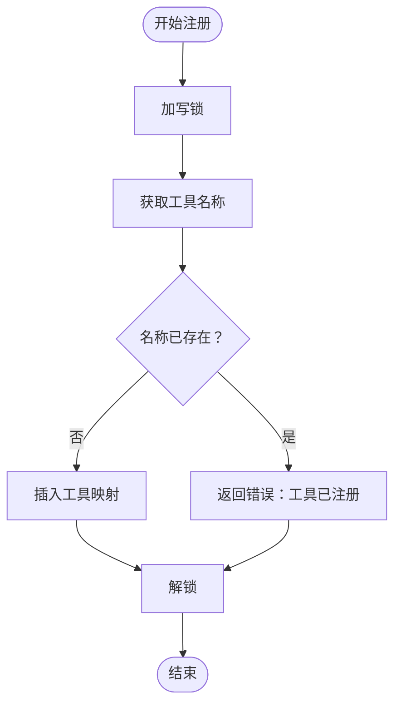
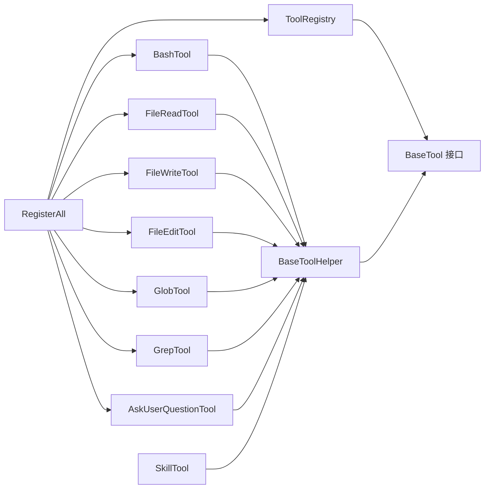

# 工具注册表机制

<cite>
**本文引用的文件**
- [pkg/tools/base.go](file://pkg/tools/base.go)
- [pkg/tools/builtin/register.go](file://pkg/tools/builtin/register.go)
- [pkg/tools/builtin/bash.go](file://pkg/tools/builtin/bash.go)
- [pkg/tools/builtin/file_read.go](file://pkg/tools/builtin/file_read.go)
- [pkg/tools/builtin/file_write.go](file://pkg/tools/builtin/file_write.go)
- [pkg/tools/builtin/file_edit.go](file://pkg/tools/builtin/file_edit.go)
- [pkg/tools/builtin/glob.go](file://pkg/tools/builtin/glob.go)
- [pkg/tools/builtin/grep.go](file://pkg/tools/builtin/grep.go)
- [pkg/tools/builtin/ask_user_question.go](file://pkg/tools/builtin/ask_user_question.go)
- [pkg/tools/builtin/skill.go](file://pkg/tools/builtin/skill.go)
</cite>

## 目录
1. [简介](#简介)
2. [项目结构](#项目结构)
3. [核心组件](#核心组件)
4. [架构总览](#架构总览)
5. [详细组件分析](#详细组件分析)
6. [依赖关系分析](#依赖关系分析)
7. [性能考量](#性能考量)
8. [故障排查指南](#故障排查指南)
9. [结论](#结论)
10. [附录：使用示例与最佳实践](#附录使用示例与最佳实践)

## 简介
本文件系统化阐述工具注册表机制的设计与实现，重点覆盖以下方面：
- ToolRegistry 的线程安全设计（读写锁、并发访问模型）
- 注册流程与查找机制（原子性、冲突检测、错误处理）
- BaseTool 接口定义、方法职责与生命周期管理
- BaseToolHelper 的默认实现、可选方法与简化开发流程
- 工具 API 模式转换、Schema 生成与元数据管理
- 工具列表获取、动态加载与运行时管理
- 使用示例、性能优化建议与扩展指南

## 项目结构
工具注册表与内置工具位于 tools 包中，并通过统一的注册入口集中初始化。下图展示与本文相关的核心文件与模块关系。

图表来源
- [pkg/tools/base.go:51-131](file://pkg/tools/base.go#L51-L131)
- [pkg/tools/builtin/register.go:7-29](file://pkg/tools/builtin/register.go#L7-L29)

章节来源
- [pkg/tools/base.go:1-132](file://pkg/tools/base.go#L1-L132)
- [pkg/tools/builtin/register.go:1-30](file://pkg/tools/builtin/register.go#L1-L30)

## 核心组件
本节从接口契约、默认实现与注册表三部分入手，梳理工具体系的核心构件。

- BaseTool 接口
  - 职责：定义工具的最小能力集（名称、描述、输入 Schema、执行、只读判定、API Schema 输出）。
  - 生命周期：由调用方在运行时按需创建实例，注册到注册表后可被全局查找与执行。
- BaseToolHelper
  - 职责：为 BaseTool 提供默认实现，减少重复样板代码；支持自定义名称、描述、Schema、只读标记。
  - 适用场景：大多数内置工具直接组合该 Helper，仅重写 Execute 即可快速落地。
- ToolRegistry
  - 职责：线程安全地维护工具映射，提供注册、查询、枚举与 API Schema 导出能力。
  - 并发模型：使用 RWMutex 实现读多写少的高效并发；写路径加互斥锁，读路径共享锁。

章节来源
- [pkg/tools/base.go:51-79](file://pkg/tools/base.go#L51-L79)
- [pkg/tools/base.go:81-131](file://pkg/tools/base.go#L81-L131)

## 架构总览
下图展示工具注册表在系统中的位置与交互关系：调用方通过注册器批量注册内置工具，随后在运行时通过注册表获取工具并执行。

图表来源
- [pkg/tools/builtin/register.go:7-29](file://pkg/tools/builtin/register.go#L7-L29)
- [pkg/tools/base.go:92-109](file://pkg/tools/base.go#L92-L109)

## 详细组件分析

### BaseTool 接口与生命周期
- 方法清单与职责
  - Name()/Description(): 返回工具标识与说明，用于元数据与 API Schema。
  - InputSchema(): 返回 JSON Schema 描述工具输入格式，便于调用方校验与提示。
  - Execute(ctx, input, execCtx): 执行工具逻辑，返回不可变结果对象。
  - IsReadOnly(input): 判定是否只读，用于权限与安全策略。
  - ToAPISchema(): 将工具元数据与 Schema 转换为对外 API 模式。
- 生命周期管理
  - 创建：由具体工具构造函数或工厂创建实例。
  - 注册：通过 ToolRegistry.Register 完成注册，确保名称唯一。
  - 查找：通过 ToolRegistry.Get 或 ListTools 获取实例集合。
  - 执行：调用 Execute，传入上下文、输入与执行上下文。
  - 销毁：Go GC 自动回收；若存在资源句柄，应在工具内部管理释放。

图表来源
- [pkg/tools/base.go:51-131](file://pkg/tools/base.go#L51-L131)

章节来源
- [pkg/tools/base.go:51-79](file://pkg/tools/base.go#L51-L79)
- [pkg/tools/base.go:81-131](file://pkg/tools/base.go#L81-L131)

### BaseToolHelper 默认实现与简化开发
- 设计要点
  - 将工具名称、描述、Schema、只读标记作为字段，统一由构造函数注入。
  - 默认实现 Name/Description/InputSchema/IsReadOnly/ToAPISchema，避免重复代码。
- 开发流程简化
  - 新建工具：定义结构体并嵌入 BaseToolHelper。
  - 仅需实现 Execute 与必要的输入结构体，即可快速完成工具落地。
- 典型内置工具
  - 文件读写类：FileReadTool、FileWriteTool、FileEditTool
  - 搜索类：GlobTool、GrepTool
  - 命令执行类：BashTool
  - 用户交互类：AskUserQuestionTool
  - 技能加载类：SkillTool

图表来源
- [pkg/tools/builtin/file_read.go:25-99](file://pkg/tools/builtin/file_read.go#L25-L99)
- [pkg/tools/builtin/file_write.go:23-80](file://pkg/tools/builtin/file_write.go#L23-L80)
- [pkg/tools/builtin/file_edit.go:25-98](file://pkg/tools/builtin/file_edit.go#L25-L98)
- [pkg/tools/builtin/glob.go:24-106](file://pkg/tools/builtin/glob.go#L24-L106)
- [pkg/tools/builtin/grep.go:27-141](file://pkg/tools/builtin/grep.go#L27-L141)
- [pkg/tools/builtin/bash.go:24-99](file://pkg/tools/builtin/bash.go#L24-L99)
- [pkg/tools/builtin/ask_user_question.go:12-80](file://pkg/tools/builtin/ask_user_question.go#L12-L80)
- [pkg/tools/builtin/skill.go:21-73](file://pkg/tools/builtin/skill.go#L21-L73)
- [pkg/tools/base.go:61-79](file://pkg/tools/base.go#L61-L79)

章节来源
- [pkg/tools/builtin/file_read.go:1-99](file://pkg/tools/builtin/file_read.go#L1-L99)
- [pkg/tools/builtin/file_write.go:1-80](file://pkg/tools/builtin/file_write.go#L1-L80)
- [pkg/tools/builtin/file_edit.go:1-98](file://pkg/tools/builtin/file_edit.go#L1-L98)
- [pkg/tools/builtin/glob.go:1-106](file://pkg/tools/builtin/glob.go#L1-L106)
- [pkg/tools/builtin/grep.go:1-141](file://pkg/tools/builtin/grep.go#L1-L141)
- [pkg/tools/builtin/bash.go:1-99](file://pkg/tools/builtin/bash.go#L1-L99)
- [pkg/tools/builtin/ask_user_question.go:1-80](file://pkg/tools/builtin/ask_user_question.go#L1-L80)
- [pkg/tools/builtin/skill.go:1-73](file://pkg/tools/builtin/skill.go#L1-L73)
- [pkg/tools/base.go:61-79](file://pkg/tools/base.go#L61-L79)

### ToolRegistry 线程安全设计与并发模型
- 并发控制
  - 写路径：Register 在加互斥锁后进行名称冲突检查与插入，保证注册的原子性。
  - 读路径：Get/ListTools/ToAPISchema 在加共享锁后遍历映射，允许多个读操作并发。
- 原子性与一致性
  - 注册阶段：先检查再插入，避免覆盖已有工具；失败时返回错误，调用方可据此重试或回滚。
  - 查询阶段：读锁期间不修改映射，保证查询结果的一致性视图。
- 错误处理策略
  - 名称冲突：返回明确错误，提示已注册工具名。
  - 查询未命中：返回空值或空集合，调用方可选择记录日志或抛出异常。
  - API 导出：遍历所有工具并调用其 ToAPISchema，聚合为数组返回。

图表来源
- [pkg/tools/base.go:92-102](file://pkg/tools/base.go#L92-L102)

章节来源
- [pkg/tools/base.go:81-131](file://pkg/tools/base.go#L81-L131)

### 工具 API 模式转换、Schema 生成与元数据管理
- 模式转换
  - BaseTool.ToAPISchema 将工具名称、描述与输入 Schema 组装为统一 API 模式。
  - ToolRegistry.ToAPISchema 遍历所有工具，聚合输出为数组，便于前端或外部系统消费。
- 输入 Schema 管理
  - 各内置工具在构造函数中定义 JSON Schema，包含属性、类型、必填项等。
  - 执行前可基于 Schema 进行参数校验与提示，提升调用体验。
- 元数据管理
  - 名称与描述用于工具识别与展示；只读标记用于安全策略与权限控制。

章节来源
- [pkg/tools/base.go:73-79](file://pkg/tools/base.go#L73-L79)
- [pkg/tools/base.go:122-131](file://pkg/tools/base.go#L122-L131)
- [pkg/tools/builtin/bash.go:32-53](file://pkg/tools/builtin/bash.go#L32-L53)
- [pkg/tools/builtin/file_read.go:31-57](file://pkg/tools/builtin/file_read.go#L31-L57)
- [pkg/tools/builtin/file_write.go:28-51](file://pkg/tools/builtin/file_write.go#L28-L51)
- [pkg/tools/builtin/file_edit.go:30-57](file://pkg/tools/builtin/file_edit.go#L30-L57)
- [pkg/tools/builtin/glob.go:29-52](file://pkg/tools/builtin/glob.go#L29-L52)
- [pkg/tools/builtin/grep.go:32-59](file://pkg/tools/builtin/grep.go#L32-L59)
- [pkg/tools/builtin/ask_user_question.go:21-54](file://pkg/tools/builtin/ask_user_question.go#L21-L54)
- [pkg/tools/builtin/skill.go:27-52](file://pkg/tools/builtin/skill.go#L27-L52)

### 工具列表获取、动态加载与运行时管理
- 列表获取
  - ToolRegistry.ListTools 返回当前所有已注册工具的切片，便于 UI 展示或统计。
- 动态加载
  - RegisterAll 将一组内置工具批量注册至给定注册表；CreateDefaultToolRegistry 提供便捷入口。
- 运行时管理
  - 通过 ToolExecutionContext 传递工作目录与回调（如用户提问、权限请求），增强工具在不同环境下的适配能力。
  - 工具执行结果以不可变 ToolResult 表达，便于上层统一处理成功与错误分支。

章节来源
- [pkg/tools/base.go:111-119](file://pkg/tools/base.go#L111-L119)
- [pkg/tools/builtin/register.go:7-29](file://pkg/tools/builtin/register.go#L7-L29)
- [pkg/tools/base.go:17-32](file://pkg/tools/base.go#L17-L32)
- [pkg/tools/base.go:34-49](file://pkg/tools/base.go#L34-L49)

## 依赖关系分析
- 组件耦合
  - ToolRegistry 依赖 BaseTool 接口，不关心具体实现细节，具备高内聚低耦合特性。
  - BaseToolHelper 为具体工具提供默认实现，降低重复代码量。
  - RegisterAll 作为装配器，负责将多个工具实例注册到同一注册表。
- 外部依赖
  - 内置工具在执行时可能依赖文件系统、进程执行、正则表达式等标准库能力。
- 循环依赖
  - 当前结构无循环依赖：注册表持有工具实例，工具不反向依赖注册表。

图表来源
- [pkg/tools/base.go:51-131](file://pkg/tools/base.go#L51-L131)
- [pkg/tools/builtin/register.go:7-29](file://pkg/tools/builtin/register.go#L7-L29)

章节来源
- [pkg/tools/base.go:51-131](file://pkg/tools/base.go#L51-L131)
- [pkg/tools/builtin/register.go:1-30](file://pkg/tools/builtin/register.go#L1-L30)

## 性能考量
- 并发读写
  - 使用 RWMutex 将读写分离，读多写少场景下显著提升吞吐；写路径尽量短小，避免持有锁过久。
- 遍历开销
  - ListTools 与 ToAPISchema 会遍历映射，规模较大时注意缓存或延迟构建策略。
- 序列化与 Schema
  - ToAPISchema 对每个工具调用一次转换，建议在注册完成后一次性导出并缓存。
- 执行效率
  - 文件系统与进程执行类工具应合理设置超时与限制（如最大匹配数），避免阻塞与资源耗尽。

## 故障排查指南
- 注册失败：名称冲突
  - 现象：Register 返回“工具已注册”错误。
  - 处理：检查工具名称是否重复；必要时调整命名或删除旧实例后再注册。
- 查询为空：工具未找到
  - 现象：Get 返回空；ListTools 返回空切片。
  - 处理：确认是否已完成注册；核对名称大小写与拼写。
- 执行异常：输入参数无效
  - 现象：Execute 返回错误结果或空响应。
  - 处理：依据工具的输入 Schema 校验参数；检查工作目录与权限。
- 交互受限：缺少回调
  - 现象：AskUserQuestionTool 无法获取用户输入。
  - 处理：确保 ToolExecutionContext 中已注入 AskUser 回调。

章节来源
- [pkg/tools/base.go:96-99](file://pkg/tools/base.go#L96-L99)
- [pkg/tools/builtin/ask_user_question.go:64-68](file://pkg/tools/builtin/ask_user_question.go#L64-L68)
- [pkg/tools/builtin/grep.go:109-110](file://pkg/tools/builtin/grep.go#L109-L110)

## 结论
工具注册表机制通过清晰的接口契约、默认实现与线程安全容器，实现了工具的标准化、可扩展与高可用。借助 BaseToolHelper 可大幅降低开发成本，借助 ToolRegistry 可实现工具的集中管理与动态发现。配合完善的 Schema 与 API 模式转换，系统在易用性与安全性之间取得良好平衡。

## 附录：使用示例与最佳实践
- 快速创建一个只读工具
  - 步骤：定义结构体并嵌入 BaseToolHelper；在构造函数中设置名称、描述、Schema、ReadOnly；实现 Execute。
  - 参考：[pkg/tools/builtin/file_read.go:25-57](file://pkg/tools/builtin/file_read.go#L25-L57)
- 快速创建一个可写工具
  - 步骤：与只读类似，但 ReadOnly 设置为 false，并在 Execute 中实现写入逻辑。
  - 参考：[pkg/tools/builtin/file_write.go:23-76](file://pkg/tools/builtin/file_write.go#L23-L76)
- 批量注册内置工具
  - 步骤：创建 ToolRegistry；调用 RegisterAll 注册；或使用 CreateDefaultToolRegistry 一步到位。
  - 参考：[pkg/tools/builtin/register.go:7-29](file://pkg/tools/builtin/register.go#L7-L29)
- 导出 API Schema
  - 步骤：调用 ToolRegistry.ToAPISchema 获取工具元数据与输入 Schema 数组。
  - 参考：[pkg/tools/base.go:122-131](file://pkg/tools/base.go#L122-L131)
- 最佳实践
  - 命名规范：工具名称全局唯一且语义明确。
  - Schema 设计：输入 Schema 清晰、完整，标注必填字段与默认值。
  - 权限控制：根据 IsReadOnly 与业务规则实施最小权限原则。
  - 超时与限制：对潜在阻塞操作设置超时与结果上限。
  - 错误处理：统一返回 ToolResult，区分错误与非错误输出，便于上层处理。