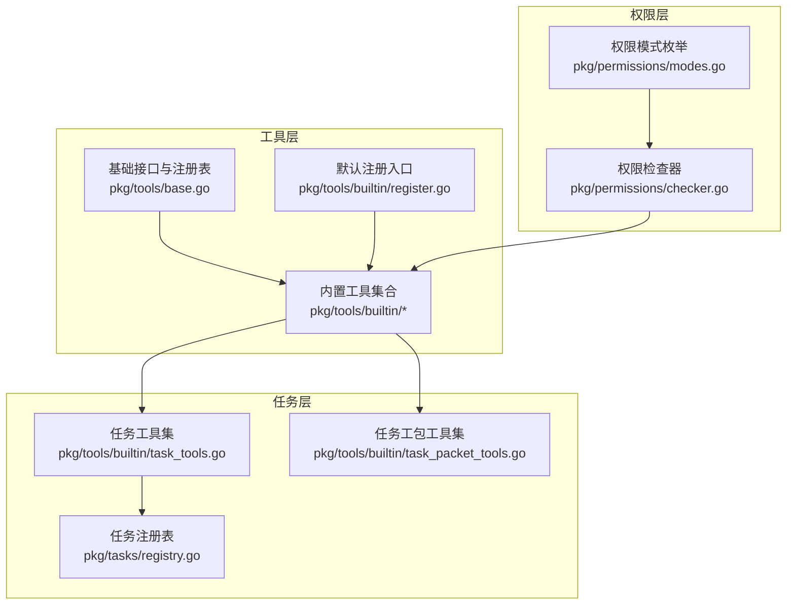
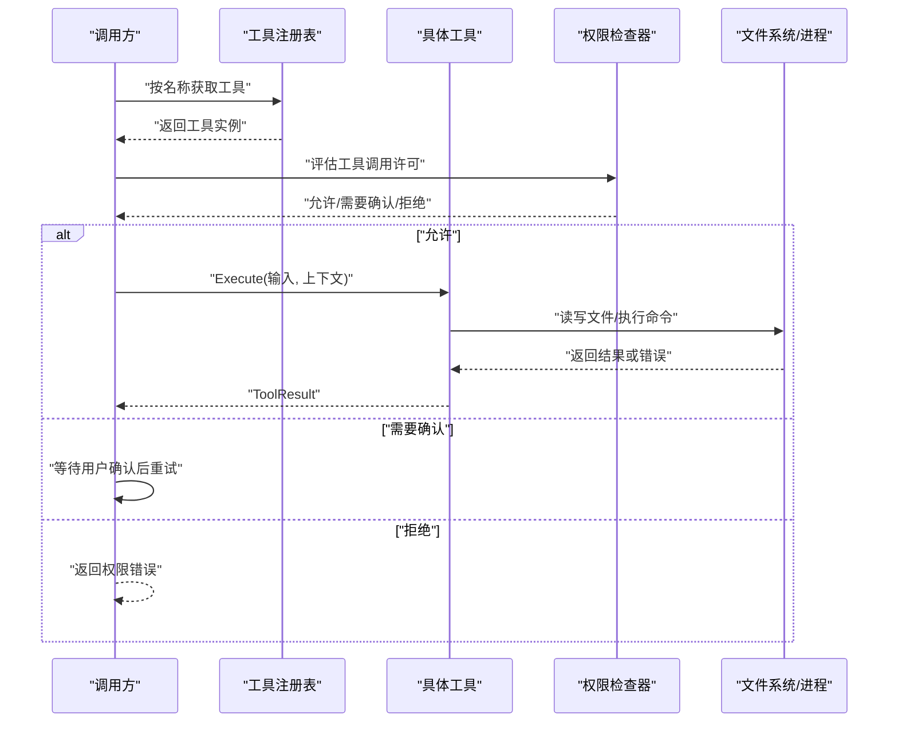
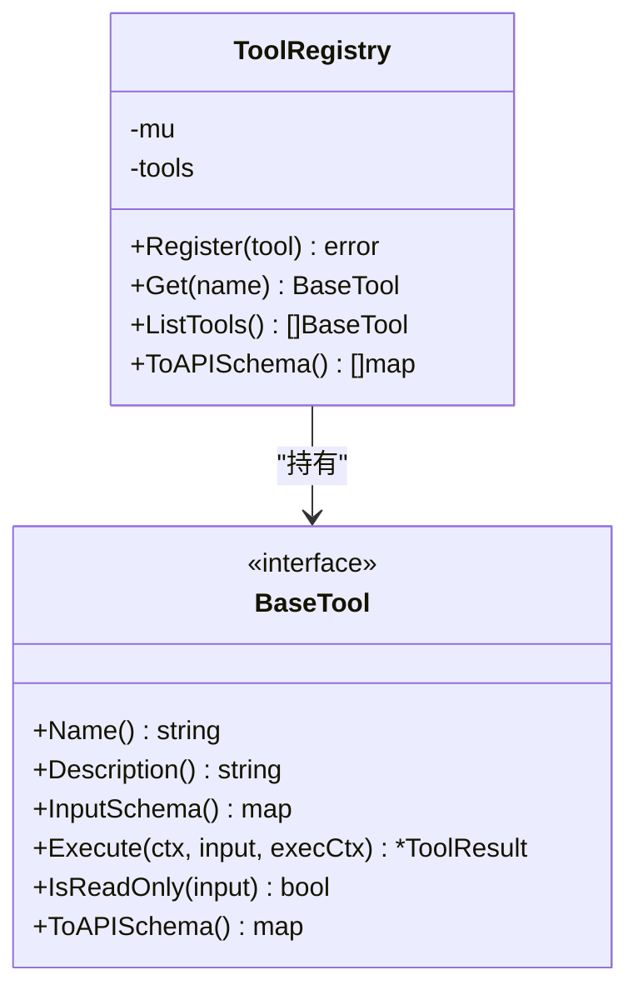
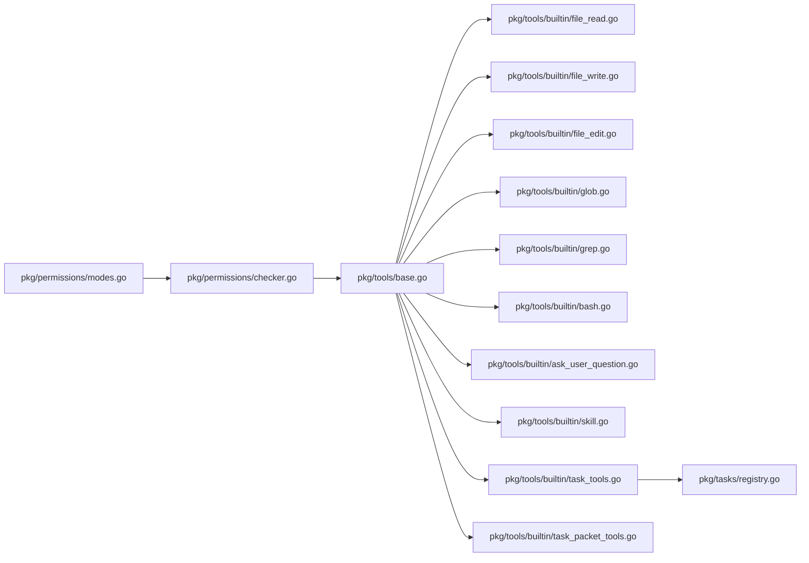

# 工具系统

<cite>
**本文引用的文件**
- [pkg/tools/base.go](file://pkg/tools/base.go)
- [pkg/tools/builtin/register.go](file://pkg/tools/builtin/register.go)
- [pkg/tools/builtin/file_read.go](file://pkg/tools/builtin/file_read.go)
- [pkg/tools/builtin/file_write.go](file://pkg/tools/builtin/file_write.go)
- [pkg/tools/builtin/file_edit.go](file://pkg/tools/builtin/file_edit.go)
- [pkg/tools/builtin/glob.go](file://pkg/tools/builtin/glob.go)
- [pkg/tools/builtin/grep.go](file://pkg/tools/builtin/grep.go)
- [pkg/tools/builtin/bash.go](file://pkg/tools/builtin/bash.go)
- [pkg/tools/builtin/ask_user_question.go](file://pkg/tools/builtin/ask_user_question.go)
- [pkg/tools/builtin/skill.go](file://pkg/tools/builtin/skill.go)
- [pkg/tools/builtin/task_tools.go](file://pkg/tools/builtin/task_tools.go)
- [pkg/tools/builtin/task_packet_tools.go](file://pkg/tools/builtin/task_packet_tools.go)
- [pkg/tasks/registry.go](file://pkg/tasks/registry.go)
- [pkg/permissions/checker.go](file://pkg/permissions/checker.go)
- [pkg/permissions/modes.go](file://pkg/permissions/modes.go)
</cite>

## 目录
1. [简介](#简介)
2. [项目结构](#项目结构)
3. [核心组件](#核心组件)
4. [架构总览](#架构总览)
5. [详细组件分析](#详细组件分析)
6. [依赖关系分析](#依赖关系分析)
7. [性能考量](#性能考量)
8. [故障排查指南](#故障排查指南)
9. [结论](#结论)
10. [附录](#附录)

## 简介
本文件系统性阐述工具系统的架构与实现，重点覆盖以下方面：
- 工具注册表机制：线程安全注册、查询与导出 API 模式
- 内置工具的功能与实现细节：文件读写、搜索、终端命令、用户交互、技能加载、任务编排与工包校验
- 使用方法与配置选项：输入参数、工作目录、只读/可变语义、超时控制
- 自定义工具开发指南：接口定义、参数校验、错误处理、权限控制
- 生命周期管理、缓存机制与性能优化策略
- 集成最佳实践与安全注意事项

## 项目结构
工具系统位于 pkg/tools 目录，采用“基础抽象 + 内置工具 + 注册器”的分层设计；权限控制位于 pkg/permissions；任务编排与状态管理位于 pkg/tasks。

图表来源
- [pkg/tools/base.go:1-132](file://pkg/tools/base.go#L1-L132)
- [pkg/tools/builtin/register.go:1-30](file://pkg/tools/builtin/register.go#L1-L30)
- [pkg/permissions/checker.go:1-92](file://pkg/permissions/checker.go#L1-L92)
- [pkg/permissions/modes.go:1-28](file://pkg/permissions/modes.go#L1-L28)
- [pkg/tasks/registry.go:1-191](file://pkg/tasks/registry.go#L1-L191)
- [pkg/tools/builtin/task_tools.go:1-332](file://pkg/tools/builtin/task_tools.go#L1-L332)
- [pkg/tools/builtin/task_packet_tools.go:1-119](file://pkg/tools/builtin/task_packet_tools.go#L1-L119)

章节来源
- [pkg/tools/base.go:1-132](file://pkg/tools/base.go#L1-L132)
- [pkg/tools/builtin/register.go:1-30](file://pkg/tools/builtin/register.go#L1-L30)
- [pkg/permissions/checker.go:1-92](file://pkg/permissions/checker.go#L1-L92)
- [pkg/permissions/modes.go:1-28](file://pkg/permissions/modes.go#L1-L28)
- [pkg/tasks/registry.go:1-191](file://pkg/tasks/registry.go#L1-L191)
- [pkg/tools/builtin/task_tools.go:1-332](file://pkg/tools/builtin/task_tools.go#L1-L332)
- [pkg/tools/builtin/task_packet_tools.go:1-119](file://pkg/tools/builtin/task_packet_tools.go#L1-L119)

## 核心组件
- 基础接口与上下文
  - 工具执行上下文携带工作目录与元数据，并注入用户提问与权限请求回调
  - 工具结果为不可变对象，支持成功输出与错误标记
- 工具接口
  - 名称、描述、输入模式、执行函数、只读判定、API 模式导出
- 注册表
  - 线程安全注册、按名检索、列举工具、导出 API 模式清单

章节来源
- [pkg/tools/base.go:11-132](file://pkg/tools/base.go#L11-L132)

## 架构总览
工具系统通过注册表集中管理所有工具，内置工具在启动时统一注册；权限检查器在执行前评估工具是否允许；任务工具与任务注册表配合实现子代理任务的生命周期管理；技能工具从已加载技能映射中返回指令内容；文件/搜索/命令类工具围绕工作目录与只读语义进行操作。

图表来源
- [pkg/tools/base.go:81-132](file://pkg/tools/base.go#L81-L132)
- [pkg/permissions/checker.go:41-82](file://pkg/permissions/checker.go#L41-L82)
- [pkg/tools/builtin/file_read.go:59-98](file://pkg/tools/builtin/file_read.go#L59-L98)
- [pkg/tools/builtin/bash.go:55-98](file://pkg/tools/builtin/bash.go#L55-L98)

## 详细组件分析

### 工具注册表与内置工具注册
- 注册表提供线程安全的注册、查询、列举与 API 模式导出能力
- 默认注册器一次性注册所有内置工具，便于快速启用

图表来源
- [pkg/tools/base.go:81-132](file://pkg/tools/base.go#L81-L132)

章节来源
- [pkg/tools/base.go:81-132](file://pkg/tools/base.go#L81-L132)
- [pkg/tools/builtin/register.go:7-29](file://pkg/tools/builtin/register.go#L7-L29)

### 文件读取工具（Read）
- 输入参数：文件路径、可选偏移行数、可选限制行数
- 行为：解析输入、拼接工作目录、按行切分与截取、返回合并文本
- 只读语义：true

章节来源
- [pkg/tools/builtin/file_read.go:18-98](file://pkg/tools/builtin/file_read.go#L18-L98)

### 文件写入工具（Write）
- 输入参数：文件路径、内容
- 行为：解析输入、拼接工作目录、确保父目录存在、写入文件、返回字节数统计
- 可变语义：false（写文件）

章节来源
- [pkg/tools/builtin/file_write.go:17-79](file://pkg/tools/builtin/file_write.go#L17-L79)

### 文件编辑工具（Edit）
- 输入参数：文件路径、旧字符串、新字符串
- 行为：读取全文、计数唯一出现、替换一次、写回文件
- 错误处理：未找到或重复出现时报错
- 可变语义：false（写文件）

章节来源
- [pkg/tools/builtin/file_edit.go:18-97](file://pkg/tools/builtin/file_edit.go#L18-L97)

### 全局匹配工具（Glob）
- 输入参数：glob 模式、可选起始路径
- 行为：遍历目录树，相对路径匹配模式或基名匹配，收集结果
- 只读语义：true

章节来源
- [pkg/tools/builtin/glob.go:18-105](file://pkg/tools/builtin/glob.go#L18-L105)

### 正则搜索工具（Grep）
- 输入参数：正则表达式、可选起始路径、可选文件名过滤
- 行为：遍历目录树，按需过滤文件名，逐行扫描匹配，限制最大结果数量
- 只读语义：true

章节来源
- [pkg/tools/builtin/grep.go:20-140](file://pkg/tools/builtin/grep.go#L20-L140)

### 终端命令工具（Bash）
- 输入参数：命令、可选超时（秒，默认 120）
- 行为：构造子进程，设置工作目录与超时，捕获标准输出与错误输出，区分超时与退出码错误
- 可变语义：false（执行外部命令）

章节来源
- [pkg/tools/builtin/bash.go:18-98](file://pkg/tools/builtin/bash.go#L18-L98)

### 用户提问工具（ask_user_question）
- 输入参数：问题文本、可选选项列表
- 行为：调用执行上下文中的用户回调，返回用户应答或提示无响应
- 只读语义：true

章节来源
- [pkg/tools/builtin/ask_user_question.go:16-79](file://pkg/tools/builtin/ask_user_question.go#L16-L79)

### 技能工具（Skill）
- 输入参数：技能名称
- 行为：从已加载技能映射中查找并返回指令内容
- 只读语义：true

章节来源
- [pkg/tools/builtin/skill.go:16-72](file://pkg/tools/builtin/skill.go#L16-L72)

### 任务工具集（TaskCreate/TaskGet/TaskList/TaskStop/TaskOutput/TaskSendMessage/TaskUpdate）
- TaskCreate：创建子代理任务并异步运行
- TaskGet：按 ID 查询任务详情
- TaskList：列出所有任务摘要
- TaskStop：取消运行中的任务
- TaskOutput：获取累积输出
- TaskSendMessage：向运行中的任务发送消息
- TaskUpdate：手动更新任务状态
- 依赖：任务注册表与子代理执行器

章节来源
- [pkg/tools/builtin/task_tools.go:12-331](file://pkg/tools/builtin/task_tools.go#L12-L331)
- [pkg/tasks/registry.go:13-191](file://pkg/tasks/registry.go#L13-L191)

### 任务工包工具集（TaskPacketCreate/TaskPacketValidate）
- TaskPacketCreate：根据输入字段生成结构化工包
- TaskPacketValidate：校验工包完整性与建议项
- 依赖：任务类型定义

章节来源
- [pkg/tools/builtin/task_packet_tools.go:12-118](file://pkg/tools/builtin/task_packet_tools.go#L12-L118)

## 依赖关系分析
- 工具层依赖
  - 所有内置工具依赖基础接口与执行上下文
  - 任务工具依赖任务注册表
  - 技能工具依赖已加载技能映射
- 权限层依赖
  - 权限检查器依赖配置与模式枚举
  - 工具执行前由权限检查器评估
- 外部依赖
  - 文件系统访问、正则表达式、进程执行、路径匹配

图表来源
- [pkg/tools/base.go:1-132](file://pkg/tools/base.go#L1-L132)
- [pkg/tools/builtin/file_read.go:1-98](file://pkg/tools/builtin/file_read.go#L1-L98)
- [pkg/tools/builtin/file_write.go:1-79](file://pkg/tools/builtin/file_write.go#L1-L79)
- [pkg/tools/builtin/file_edit.go:1-97](file://pkg/tools/builtin/file_edit.go#L1-L97)
- [pkg/tools/builtin/glob.go:1-105](file://pkg/tools/builtin/glob.go#L1-L105)
- [pkg/tools/builtin/grep.go:1-140](file://pkg/tools/builtin/grep.go#L1-L140)
- [pkg/tools/builtin/bash.go:1-98](file://pkg/tools/builtin/bash.go#L1-L98)
- [pkg/tools/builtin/ask_user_question.go:1-79](file://pkg/tools/builtin/ask_user_question.go#L1-L79)
- [pkg/tools/builtin/skill.go:1-72](file://pkg/tools/builtin/skill.go#L1-L72)
- [pkg/tools/builtin/task_tools.go:1-331](file://pkg/tools/builtin/task_tools.go#L1-L331)
- [pkg/tools/builtin/task_packet_tools.go:1-118](file://pkg/tools/builtin/task_packet_tools.go#L1-L118)
- [pkg/tasks/registry.go:1-191](file://pkg/tasks/registry.go#L1-L191)
- [pkg/permissions/checker.go:1-92](file://pkg/permissions/checker.go#L1-L92)
- [pkg/permissions/modes.go:1-28](file://pkg/permissions/modes.go#L1-L28)

## 性能考量
- 文件/搜索工具
  - 路径遍历与正则匹配可能带来高开销，建议：
    - 限定搜索范围（指定起始路径）
    - 使用更精确的文件名过滤（如 include/glob 过滤）
    - 控制最大结果数量（已有上限保护）
- 命令执行
  - 设置合理超时，避免长时间阻塞
  - 将大输出分流到文件或分块处理
- 注册表
  - 读多写少场景下，注册表的读锁开销较低；批量注册时注意避免竞争
- 任务工具
  - 异步子代理执行，避免阻塞主流程；定期清理过期任务

## 故障排查指南
- 输入参数错误
  - 工具对必填字段进行校验并返回错误结果；检查 required 字段与类型
- 文件访问失败
  - 检查工作目录与相对路径拼接逻辑；确认权限与父目录存在性
- 正则无效
  - 编译失败会直接报错；请修正正则表达式
- 命令执行异常
  - 区分超时与非零退出码；查看标准输出与错误输出
- 权限被拒
  - 检查权限模式与规则配置；必要时在 Plan 或 FullAuto 模式下运行
- 任务相关
  - 确认任务 ID 存在且状态允许；检查消息发送与输出获取时机

章节来源
- [pkg/tools/builtin/file_read.go:60-98](file://pkg/tools/builtin/file_read.go#L60-L98)
- [pkg/tools/builtin/file_write.go:54-79](file://pkg/tools/builtin/file_write.go#L54-L79)
- [pkg/tools/builtin/file_edit.go:59-97](file://pkg/tools/builtin/file_edit.go#L59-L97)
- [pkg/tools/builtin/grep.go:61-117](file://pkg/tools/builtin/grep.go#L61-L117)
- [pkg/tools/builtin/bash.go:55-98](file://pkg/tools/builtin/bash.go#L55-L98)
- [pkg/permissions/checker.go:41-82](file://pkg/permissions/checker.go#L41-L82)
- [pkg/tasks/registry.go:51-191](file://pkg/tasks/registry.go#L51-L191)

## 结论
该工具系统以清晰的接口抽象与模块化内置工具为核心，结合权限控制与任务编排，提供了从文件操作、搜索、命令执行到技能与任务管理的完整能力。通过注册表统一管理工具生命周期，配合只读/可变语义与严格的参数校验，既保证了易用性也兼顾了安全性与可扩展性。

## 附录

### 自定义工具开发指南
- 接口实现
  - 实现工具接口：名称、描述、输入模式、执行函数、只读判定、API 模式导出
  - 使用辅助结构体快速实现可选方法
- 参数验证
  - 在 Execute 中解码输入并校验必填字段与类型
  - 对外部资源（文件/命令）进行边界检查
- 错误处理
  - 成功返回 ToolResult；错误返回带 is_error 标记的结果
  - 明确区分参数错误、外部资源错误与超时/退出码错误
- 权限控制
  - 通过 IsReadOnly 标识只读工具；在执行前交由权限检查器评估
  - 支持工具白/黑名单、路径规则与命令模式匹配
- 生命周期与并发
  - 注册表为线程安全容器；工具内部避免共享可变状态
- 最佳实践
  - 明确定义输入模式与示例，便于 LLM 调用
  - 对潜在高开销操作设置上限与超时
  - 提供清晰的错误信息与回退策略

章节来源
- [pkg/tools/base.go:51-79](file://pkg/tools/base.go#L51-L79)
- [pkg/permissions/checker.go:41-82](file://pkg/permissions/checker.go#L41-L82)