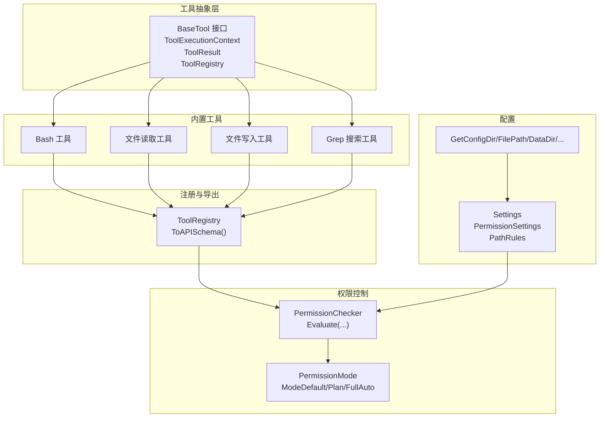
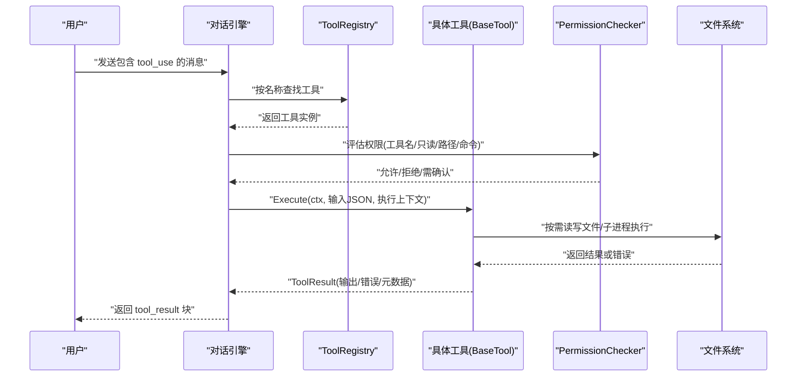
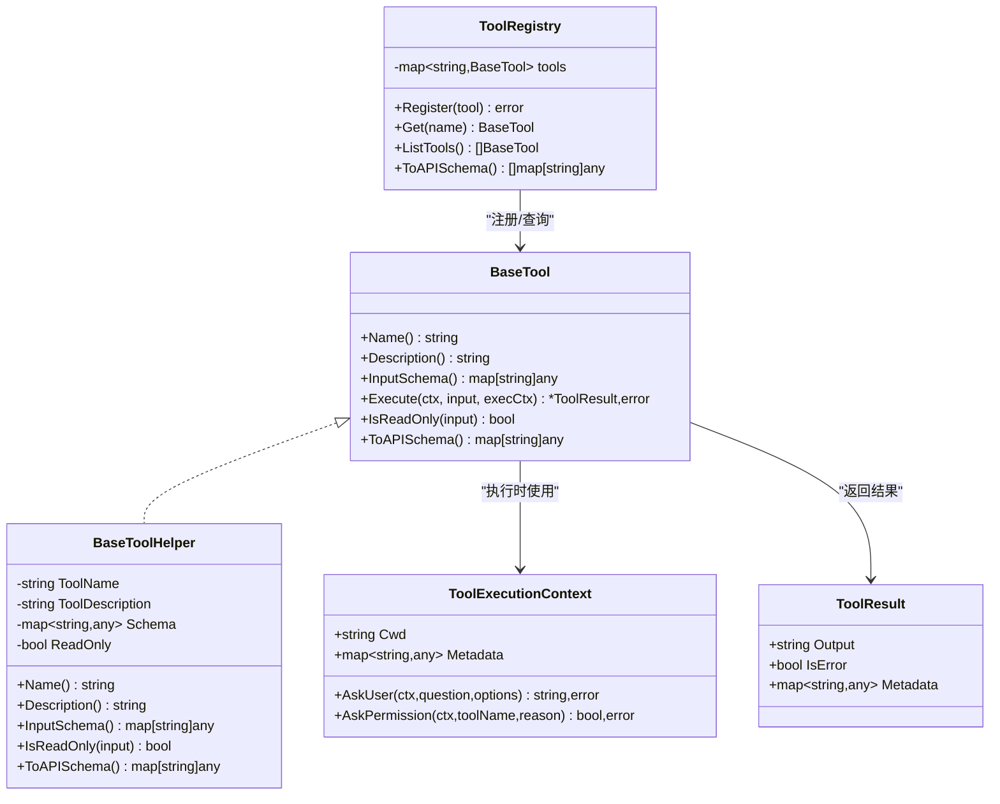
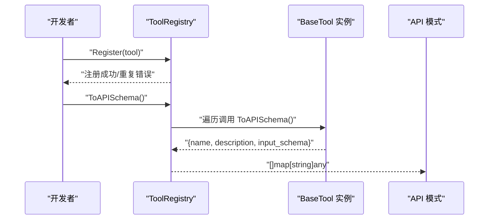
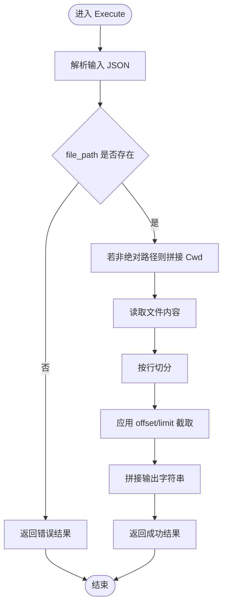
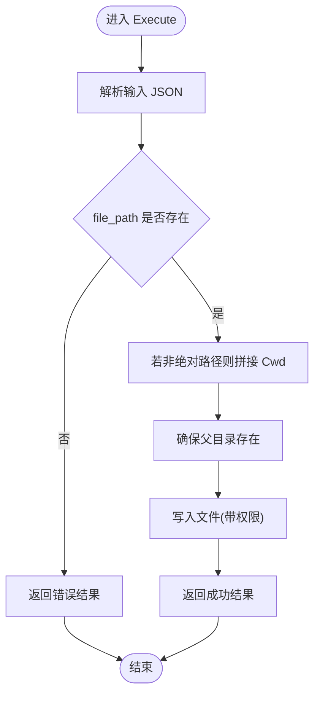
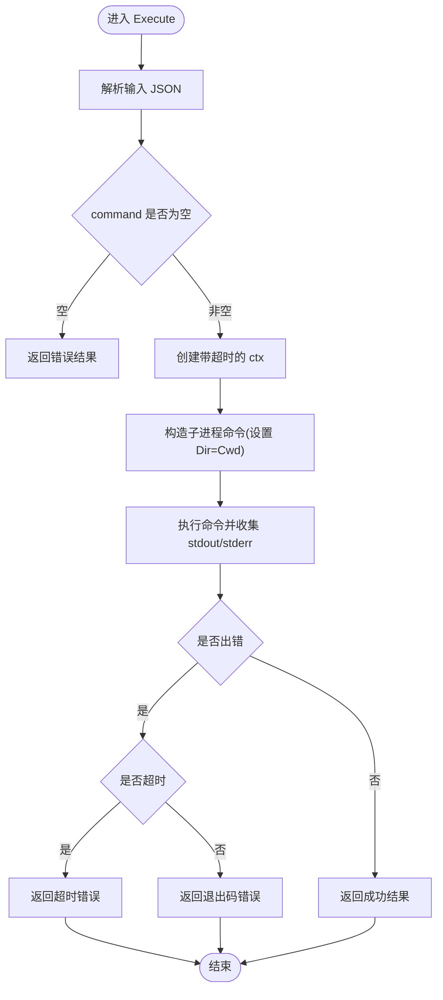
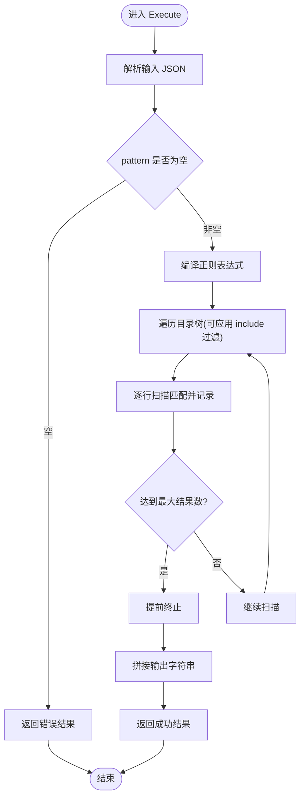
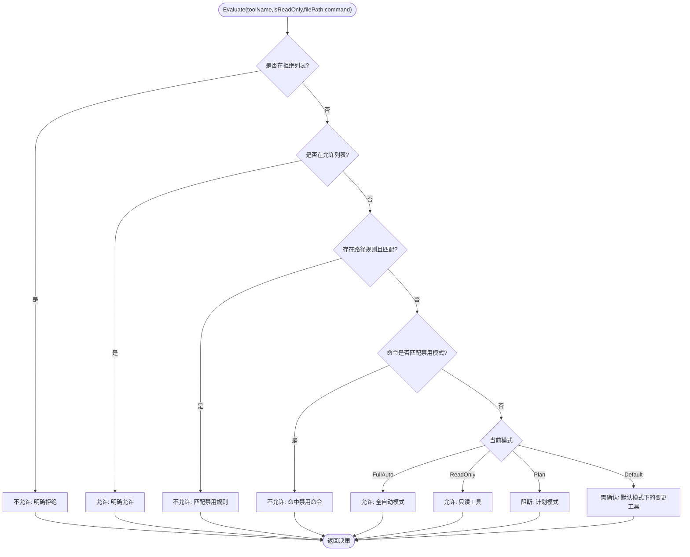
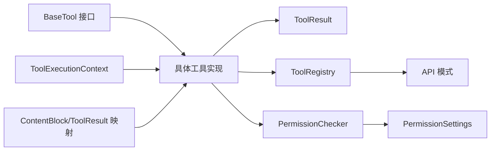

# 自定义工具开发

<cite>
**本文引用的文件**
- [pkg/tools/base.go](file://pkg/tools/base.go)
- [pkg/tools/builtin/register.go](file://pkg/tools/builtin/register.go)
- [pkg/tools/builtin/bash.go](file://pkg/tools/builtin/bash.go)
- [pkg/tools/builtin/file_read.go](file://pkg/tools/builtin/file_read.go)
- [pkg/tools/builtin/file_write.go](file://pkg/tools/builtin/file_write.go)
- [pkg/tools/builtin/grep.go](file://pkg/tools/builtin/grep.go)
- [pkg/permissions/checker.go](file://pkg/permissions/checker.go)
- [pkg/permissions/modes.go](file://pkg/permissions/modes.go)
- [pkg/config/settings.go](file://pkg/config/settings.go)
- [pkg/config/paths.go](file://pkg/config/paths.go)
- [pkg/types/messages.go](file://pkg/types/messages.go)
- [pkg/types/errors.go](file://pkg/types/errors.go)
</cite>

## 目录
1. [简介](#简介)
2. [项目结构](#项目结构)
3. [核心组件](#核心组件)
4. [架构总览](#架构总览)
5. [详细组件分析](#详细组件分析)
6. [依赖关系分析](#依赖关系分析)
7. [性能考量](#性能考量)
8. [故障排查指南](#故障排查指南)
9. [结论](#结论)
10. [附录：从零开始开发一个自定义工具](#附录从零开始开发一个自定义工具)

## 简介
本指南面向希望在 OpenHarness 中开发自定义工具（Tool）的开发者，系统讲解如何实现 BaseTool 接口、定义工具名称与描述、设计输入模式与 Schema、使用工具执行上下文（ToolExecutionContext）、管理工作目录与元数据、构建工具结果（ToolResult）、进行错误处理与元数据附加、生成 API 模式、进行 Schema 验证与类型安全、制定测试策略与调试技巧、优化性能，并总结最佳实践与常见陷阱。

## 项目结构
OpenHarness 的工具体系由“抽象层 + 内置工具 + 注册中心 + 权限控制 + 配置”构成：
- 抽象层：定义 BaseTool 接口、工具执行上下文、工具结果、注册表等基础能力
- 内置工具：提供 Bash、文件读写、Grep 等示例工具，展示如何实现 BaseTool
- 注册中心：集中注册与导出工具 API 模式
- 权限控制：基于配置的工具与路径规则、命令模式检查
- 配置：默认设置、路径解析、权限模式与规则

图表来源
- [pkg/tools/base.go:51-131](file://pkg/tools/base.go#L51-L131)
- [pkg/tools/builtin/register.go:7-29](file://pkg/tools/builtin/register.go#L7-L29)
- [pkg/permissions/checker.go:41-82](file://pkg/permissions/checker.go#L41-L82)
- [pkg/permissions/modes.go:4-27](file://pkg/permissions/modes.go#L4-L27)
- [pkg/config/settings.go:37-55](file://pkg/config/settings.go#L37-L55)
- [pkg/config/paths.go:8-23](file://pkg/config/paths.go#L8-L23)

章节来源
- [pkg/tools/base.go:1-132](file://pkg/tools/base.go#L1-L132)
- [pkg/tools/builtin/register.go:1-30](file://pkg/tools/builtin/register.go#L1-L30)
- [pkg/permissions/checker.go:1-92](file://pkg/permissions/checker.go#L1-L92)
- [pkg/permissions/modes.go:1-28](file://pkg/permissions/modes.go#L1-L28)
- [pkg/config/settings.go:1-212](file://pkg/config/settings.go#L1-L212)
- [pkg/config/paths.go:1-75](file://pkg/config/paths.go#L1-L75)

## 核心组件
- BaseTool 接口：定义工具的名称、描述、输入 Schema、执行方法、只读标记、API 模式导出
- ToolExecutionContext：携带工作目录与任意元数据，支持向用户提问与请求权限
- ToolResult：不可变的结果对象，包含输出文本、错误标记与元数据
- BaseToolHelper：为 BaseTool 提供默认实现（名称、描述、Schema、只读标记、API 模式）
- ToolRegistry：线程安全的工具注册表，支持注册、查询、列出与导出 API 模式
- 权限检查器与模式：根据配置决定工具是否允许执行、是否需要确认或受路径/命令规则限制
- 配置与路径：提供默认设置、权限模式与规则、配置文件路径解析

章节来源
- [pkg/tools/base.go:51-79](file://pkg/tools/base.go#L51-L79)
- [pkg/tools/base.go:17-32](file://pkg/tools/base.go#L17-L32)
- [pkg/tools/base.go:34-49](file://pkg/tools/base.go#L34-L49)
- [pkg/tools/base.go:81-131](file://pkg/tools/base.go#L81-L131)
- [pkg/permissions/checker.go:10-82](file://pkg/permissions/checker.go#L10-L82)
- [pkg/permissions/modes.go:4-27](file://pkg/permissions/modes.go#L4-L27)
- [pkg/config/settings.go:37-55](file://pkg/config/settings.go#L37-L55)

## 架构总览
下图展示了工具调用链路：外部消息触发工具使用块（tool_use），经注册表查找工具，结合执行上下文与权限检查后执行，最终以工具结果返回。

图表来源
- [pkg/types/messages.go:38-56](file://pkg/types/messages.go#L38-L56)
- [pkg/tools/base.go:51-59](file://pkg/tools/base.go#L51-L59)
- [pkg/tools/base.go:81-131](file://pkg/tools/base.go#L81-L131)
- [pkg/permissions/checker.go:41-82](file://pkg/permissions/checker.go#L41-L82)

## 详细组件分析

### BaseTool 接口与执行上下文
- 接口职责
  - Name/Description：工具标识与说明
  - InputSchema：输入 JSON Schema，用于类型安全与验证
  - Execute：执行逻辑，接收上下文、原始输入与执行上下文
  - IsReadOnly：声明工具是否只读，影响权限决策
  - ToAPISchema：导出工具的 API 模式（名称、描述、输入 Schema）
- 执行上下文
  - Cwd：工作目录，所有文件操作应相对此目录进行
  - Metadata：任意键值对元数据，便于跨层传递
  - AskUser/AskPermission：回调接口，允许工具在执行中与用户交互或请求许可

图表来源
- [pkg/tools/base.go:51-79](file://pkg/tools/base.go#L51-L79)
- [pkg/tools/base.go:17-32](file://pkg/tools/base.go#L17-L32)
- [pkg/tools/base.go:34-49](file://pkg/tools/base.go#L34-L49)
- [pkg/tools/base.go:81-131](file://pkg/tools/base.go#L81-L131)

章节来源
- [pkg/tools/base.go:51-79](file://pkg/tools/base.go#L51-L79)
- [pkg/tools/base.go:17-32](file://pkg/tools/base.go#L17-L32)
- [pkg/tools/base.go:34-49](file://pkg/tools/base.go#L34-L49)
- [pkg/tools/base.go:81-131](file://pkg/tools/base.go#L81-L131)

### 工具注册与 API 模式导出
- 注册方式：通过注册函数将内置工具批量注册到 ToolRegistry
- API 模式：每个工具导出 name/description/input_schema；注册表可统一导出全部工具的 API 模式
- 使用场景：对外暴露工具清单，供上层引擎或客户端进行工具选择与参数校验

图表来源
- [pkg/tools/builtin/register.go:7-29](file://pkg/tools/builtin/register.go#L7-L29)
- [pkg/tools/base.go:122-131](file://pkg/tools/base.go#L122-L131)

章节来源
- [pkg/tools/builtin/register.go:1-30](file://pkg/tools/builtin/register.go#L1-L30)
- [pkg/tools/base.go:122-131](file://pkg/tools/base.go#L122-L131)

### 文件读取工具（只读示例）
- 设计要点
  - 只读工具：IsReadOnly 返回 true
  - 输入模式：file_path 必填，支持可选 offset/limit
  - 路径解析：非绝对路径时拼接执行上下文 Cwd
  - 结果：成功返回内容片段，失败返回错误结果
- 典型流程

图表来源
- [pkg/tools/builtin/file_read.go:59-98](file://pkg/tools/builtin/file_read.go#L59-L98)

章节来源
- [pkg/tools/builtin/file_read.go:18-57](file://pkg/tools/builtin/file_read.go#L18-L57)
- [pkg/tools/builtin/file_read.go:59-98](file://pkg/tools/builtin/file_read.go#L59-L98)

### 文件写入工具（变更型示例）
- 设计要点
  - 非只读工具：IsReadOnly 返回 false
  - 输入模式：file_path 与 content 必填
  - 安全性：确保父目录存在，使用安全权限写入
  - 结果：成功返回写入统计，失败返回错误结果
- 典型流程

图表来源
- [pkg/tools/builtin/file_write.go:53-79](file://pkg/tools/builtin/file_write.go#L53-L79)

章节来源
- [pkg/tools/builtin/file_write.go:17-51](file://pkg/tools/builtin/file_write.go#L17-L51)
- [pkg/tools/builtin/file_write.go:53-79](file://pkg/tools/builtin/file_write.go#L53-L79)

### Bash 工具（子进程执行示例）
- 设计要点
  - 非只读工具：IsReadOnly 返回 false
  - 输入模式：command 必填，支持可选 timeout（秒）
  - 上下文：使用执行上下文 Cwd 设置子进程工作目录
  - 超时：通过 context.WithTimeout 控制执行时间
  - 输出：合并标准输出与错误输出，错误时区分超时与退出码
- 典型流程

图表来源
- [pkg/tools/builtin/bash.go:55-98](file://pkg/tools/builtin/bash.go#L55-L98)

章节来源
- [pkg/tools/builtin/bash.go:18-53](file://pkg/tools/builtin/bash.go#L18-L53)
- [pkg/tools/builtin/bash.go:55-98](file://pkg/tools/builtin/bash.go#L55-L98)

### Grep 工具（搜索型示例）
- 设计要点
  - 只读工具：IsReadOnly 返回 true
  - 输入模式：pattern 必填，支持可选 path 与 include（文件名通配）
  - 范围：默认从执行上下文 Cwd 开始递归扫描，支持 include 过滤
  - 限制：最大匹配数量，避免过多输出
- 典型流程

图表来源
- [pkg/tools/builtin/grep.go:61-140](file://pkg/tools/builtin/grep.go#L61-L140)

章节来源
- [pkg/tools/builtin/grep.go:20-59](file://pkg/tools/builtin/grep.go#L20-L59)
- [pkg/tools/builtin/grep.go:61-140](file://pkg/tools/builtin/grep.go#L61-L140)

### 权限控制与安全
- 权限决策
  - 显式允许/拒绝工具
  - 路径规则：glob 匹配禁止访问的路径
  - 命令模式：禁止特定命令模式
  - 模式策略：默认模式下只读工具放行，非只读工具需确认；Plan 模式阻断变更；FullAuto 允许所有
- 集成点
  - 工具执行前调用 Evaluate 获取 PermissionDecision
  - 若 RequiresConfirmation 为真，需弹窗或交互确认

图表来源
- [pkg/permissions/checker.go:41-82](file://pkg/permissions/checker.go#L41-L82)
- [pkg/permissions/modes.go:7-11](file://pkg/permissions/modes.go#L7-L11)

章节来源
- [pkg/permissions/checker.go:10-82](file://pkg/permissions/checker.go#L10-L82)
- [pkg/permissions/modes.go:4-27](file://pkg/permissions/modes.go#L4-L27)

### 配置与路径
- 配置模型
  - PermissionSettings：包含模式、允许/拒绝工具列表、路径规则、拒绝命令列表
  - 默认设置：提供合理的缺省值
- 路径解析
  - 配置目录与文件路径
  - 数据/日志/会话/任务等子目录

章节来源
- [pkg/config/settings.go:37-55](file://pkg/config/settings.go#L37-L55)
- [pkg/config/settings.go:127-142](file://pkg/config/settings.go#L127-L142)
- [pkg/config/paths.go:8-23](file://pkg/config/paths.go#L8-L23)
- [pkg/config/paths.go:25-75](file://pkg/config/paths.go#L25-L75)

## 依赖关系分析
- 组件耦合
  - 工具实现依赖 BaseTool 接口与 ToolExecutionContext
  - 注册表依赖工具实现，提供统一 API 模式导出
  - 权限检查器依赖配置设置与路径规则
  - 类型系统中的消息块与工具结果相互映射
- 外部依赖
  - 文件系统：文件读写、目录遍历
  - 子进程：命令执行与超时控制
  - JSON：输入/输出序列化与 Schema 验证

图表来源
- [pkg/tools/base.go:51-79](file://pkg/tools/base.go#L51-L79)
- [pkg/tools/base.go:81-131](file://pkg/tools/base.go#L81-L131)
- [pkg/permissions/checker.go:41-82](file://pkg/permissions/checker.go#L41-L82)
- [pkg/types/messages.go:38-56](file://pkg/types/messages.go#L38-L56)

章节来源
- [pkg/tools/base.go:51-131](file://pkg/tools/base.go#L51-L131)
- [pkg/permissions/checker.go:1-92](file://pkg/permissions/checker.go#L1-L92)
- [pkg/types/messages.go:15-56](file://pkg/types/messages.go#L15-L56)

## 性能考量
- I/O 限制
  - 文件读写：尽量使用流式处理，避免一次性加载大文件
  - 目录遍历：设置最大结果数与早期终止，避免全量扫描
- 超时与并发
  - 子进程执行使用带超时的 context，防止长时间阻塞
  - 并发工具调用时注意共享资源竞争与锁粒度
- 缓存与复用
  - 对频繁读取的小文件可考虑缓存
  - 工具注册表为线程安全，可在多协程中安全查询
- 错误快速失败
  - 输入校验尽早失败，减少无效调用
  - 对上游 API 错误进行分类与降级处理

## 故障排查指南
- 常见错误类型
  - 认证失败、速率限制、通用请求失败等上游错误
  - 工具输入 JSON 解析失败或字段缺失
  - 文件路径不存在、无权限、磁盘空间不足
  - 子进程执行超时或退出码异常
- 定位技巧
  - 在工具 Execute 中打印关键输入与上下文
  - 使用 ToolResult 的 Metadata 附加诊断信息
  - 利用 PermissionChecker 的 Reason 字段判断权限问题
- 修复建议
  - 补齐 InputSchema 的 required 字段
  - 规范路径拼接与权限设置
  - 合理设置超时与最大结果数
  - 将错误转换为 ToolResultError 并保留上下文

章节来源
- [pkg/types/errors.go:5-39](file://pkg/types/errors.go#L5-L39)
- [pkg/tools/builtin/bash.go:90-98](file://pkg/tools/builtin/bash.go#L90-L98)
- [pkg/tools/builtin/file_read.go:74-77](file://pkg/tools/builtin/file_read.go#L74-L77)
- [pkg/tools/builtin/file_write.go:74-76](file://pkg/tools/builtin/file_write.go#L74-L76)
- [pkg/permissions/checker.go:47-81](file://pkg/permissions/checker.go#L47-L81)

## 结论
通过抽象层、内置工具示例、注册表与权限控制的协同，OpenHarness 提供了清晰、可扩展的工具开发框架。开发者只需遵循 BaseTool 接口契约，合理设计输入 Schema，正确使用执行上下文与结果对象，并结合权限与配置策略，即可快速构建安全、可靠、可测试的自定义工具。

## 附录：从零开始开发一个自定义工具
- 步骤一：定义输入结构体
  - 为工具输入设计结构体，明确必填字段与可选字段
  - 参考现有工具的输入结构体命名与注释风格
  - 示例参考：[Bash 输入结构体:18-22](file://pkg/tools/builtin/bash.go#L18-L22)、[文件读取输入结构体:18-23](file://pkg/tools/builtin/file_read.go#L18-L23)、[文件写入输入结构体:17-21](file://pkg/tools/builtin/file_write.go#L17-L21)、[Grep 输入结构体:20-25](file://pkg/tools/builtin/grep.go#L20-L25)
- 步骤二：实现 BaseTool
  - 声明 Name/Description/IsReadOnly
  - 实现 InputSchema：使用 JSON Schema 描述输入字段、类型、默认值与必填项
  - 实现 Execute：解析输入、校验参数、使用 execCtx.Cwd、必要时调用 AskUser/AskPermission
  - 实现 ToAPISchema：导出工具 API 模式
  - 参考示例：[Bash 工具实现:24-53](file://pkg/tools/builtin/bash.go#L24-L53)、[文件读取工具实现:25-57](file://pkg/tools/builtin/file_read.go#L25-L57)、[文件写入工具实现:23-51](file://pkg/tools/builtin/file_write.go#L23-L51)、[Grep 工具实现:27-59](file://pkg/tools/builtin/grep.go#L27-L59)
- 步骤三：工作目录与元数据
  - 非绝对路径时拼接 execCtx.Cwd
  - 通过 execCtx.Metadata 传递上下文信息
  - 参考：[工作目录使用示例:73-74](file://pkg/tools/builtin/bash.go#L73-L74)、[元数据字段定义:19-21](file://pkg/tools/base.go#L19-L21)
- 步骤四：结果与错误处理
  - 成功：使用 NewToolResult 构建结果
  - 失败：使用 NewToolResultError 构建错误结果
  - 可附加 Metadata 用于追踪与诊断
  - 参考：[结果构造函数:41-49](file://pkg/tools/base.go#L41-L49)
- 步骤五：只读标记与安全
  - 只读工具返回 true，变更工具返回 false
  - 遵循权限模式策略，必要时请求用户确认
  - 参考：[权限评估逻辑:47-81](file://pkg/permissions/checker.go#L47-81)
- 步骤六：API 模式与 Schema 验证
  - ToAPISchema 导出工具清单
  - 使用 InputSchema 进行前端/客户端参数校验
  - 参考：[API 模式导出:73-79](file://pkg/tools/base.go#L73-L79)、[注册表导出:122-131](file://pkg/tools/base.go#L122-L131)
- 步骤七：测试与调试
  - 单元测试：覆盖正常路径、边界条件、错误分支
  - 集成测试：模拟权限决策、文件系统行为、子进程超时
  - 调试技巧：在关键节点打印输入/上下文/中间结果；利用 ToolResult.Metadata 附加诊断
- 步骤八：性能优化
  - I/O 限制与超时控制
  - 最大结果数与早期终止
  - 缓存与复用策略
- 步骤九：最佳实践与常见陷阱
  - 最佳实践
    - 明确定义输入 Schema，保持字段语义清晰
    - 严格处理路径拼接与权限
    - 使用 context 控制超时与取消
    - 将错误转换为 ToolResultError 并保留上下文
  - 常见陷阱
    - 忽略只读标记导致权限策略失效
    - 直接使用相对路径而不拼接 Cwd
    - 未设置超时导致长时间阻塞
    - 忽略错误分支，直接返回空结果