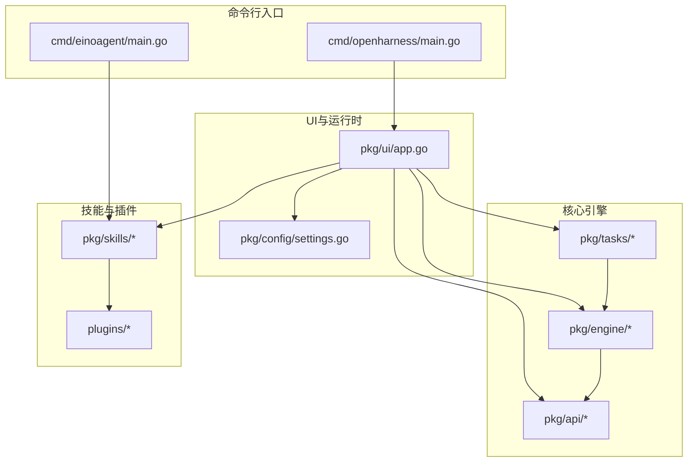
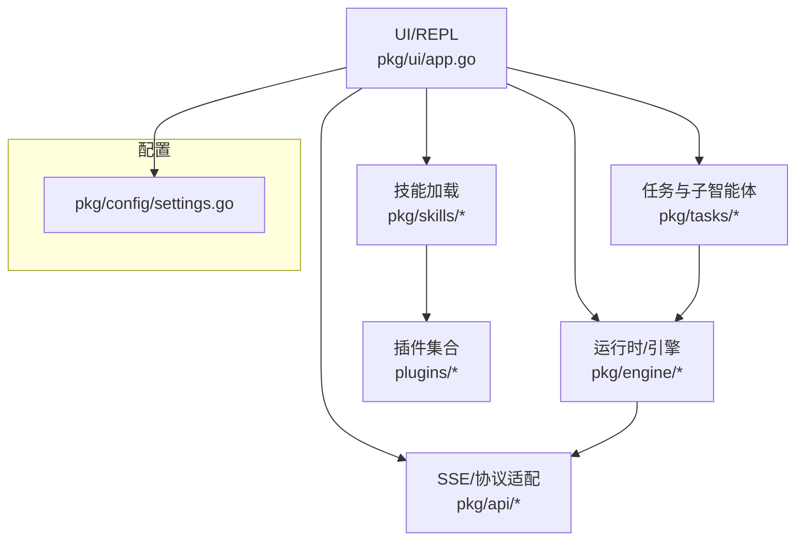
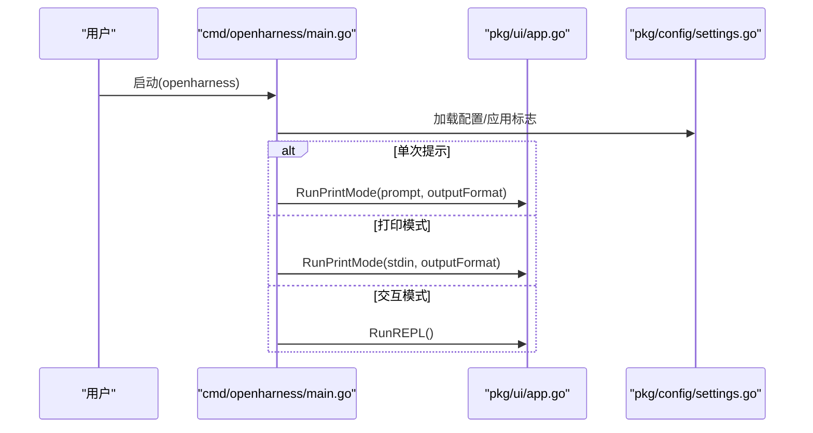
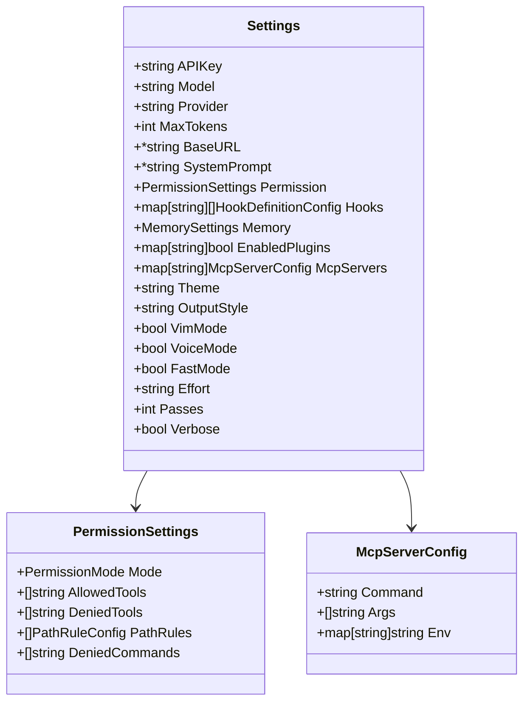
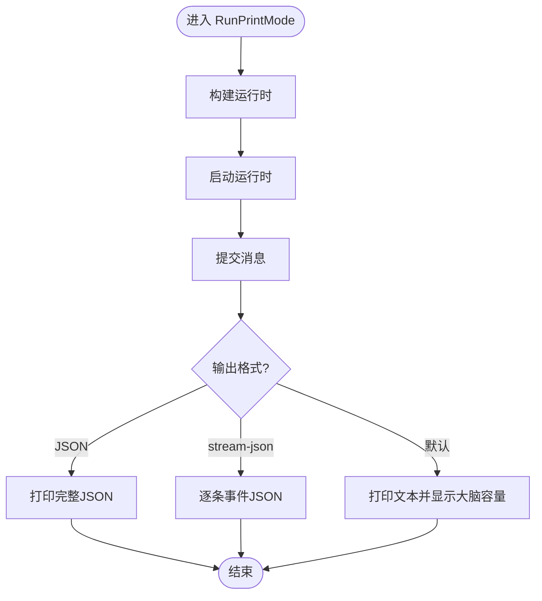
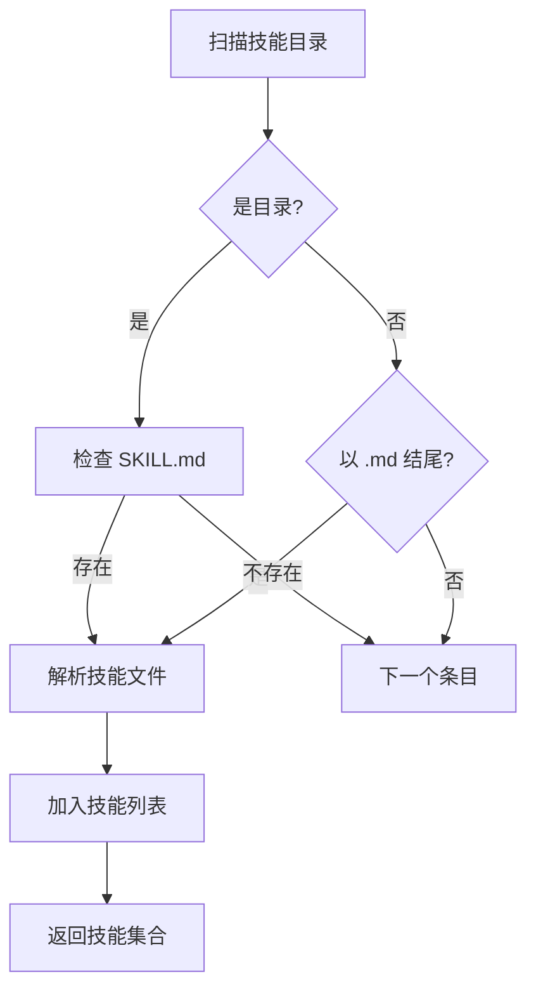
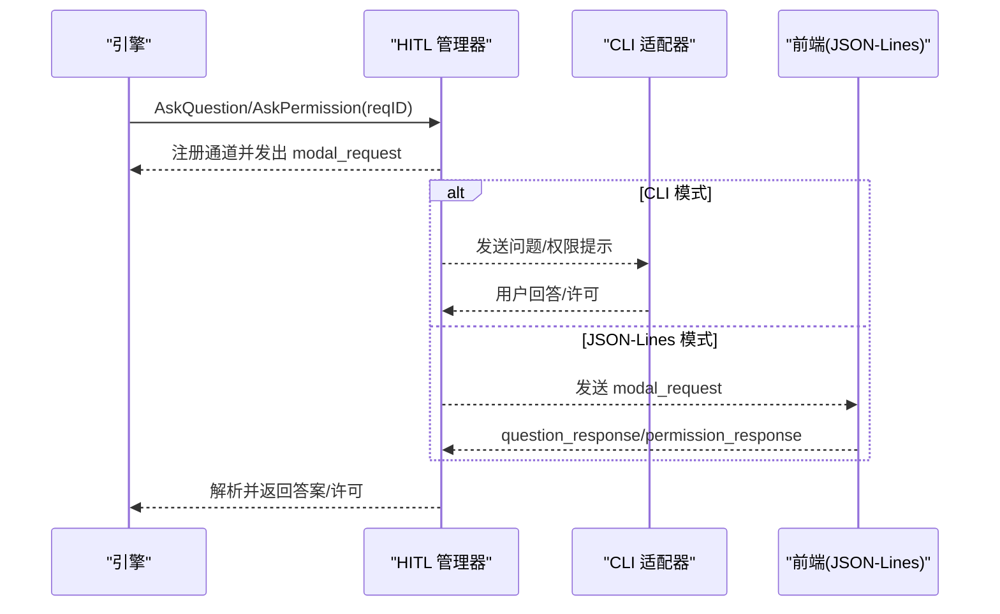
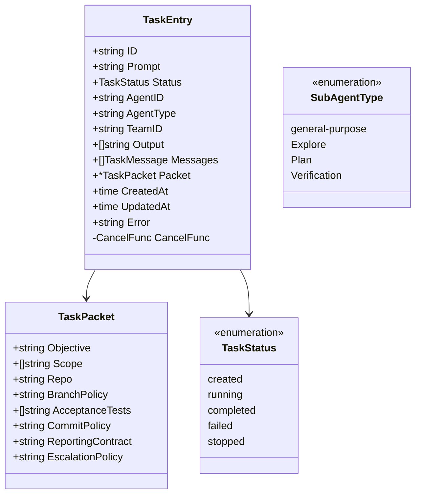
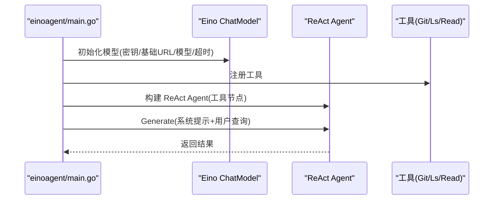
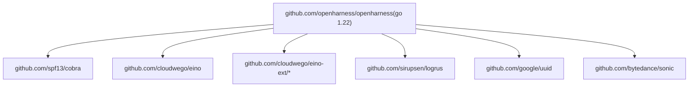

# 开发指南

<cite>
**本文档引用的文件**
- [go.mod](file://go.mod)
- [README.md](file://README.md)
- [cmd/openharness/main.go](file://cmd/openharness/main.go)
- [cmd/einoagent/main.go](file://cmd/einoagent/main.go)
- [pkg/config/settings.go](file://pkg/config/settings.go)
- [pkg/ui/app.go](file://pkg/ui/app.go)
- [pkg/skills/loader.go](file://pkg/skills/loader.go)
- [pkg/skills/loader_test.go](file://pkg/skills/loader_test.go)
- [design/Human-In-The-Loop.md](file://design/Human-In-The-Loop.md)
- [design/TASK.md](file://design/TASK.md)
- [design/eino.md](file://design/eino.md)
</cite>

## 目录
1. [简介](#简介)
2. [项目结构](#项目结构)
3. [核心组件](#核心组件)
4. [架构总览](#架构总览)
5. [详细组件分析](#详细组件分析)
6. [依赖关系分析](#依赖关系分析)
7. [性能考量](#性能考量)
8. [故障排查指南](#故障排查指南)
9. [结论](#结论)
10. [附录](#附录)

## 简介
本指南面向新贡献者与维护者，提供 OpenHarness Go 项目的开发环境搭建、代码贡献流程、测试策略、调试与性能分析、代码风格与最佳实践，以及项目结构与开发工作流的深入说明。项目采用 Go 语言实现，提供 CLI 与 TUI/JSON-Lines 交互方式，支持 MCP 协议、渐进式披露技能系统、并行任务与子智能体（SubAgent）执行、以及人机协作（HITL）能力。

## 项目结构
项目采用按功能域划分的包结构，主要模块如下：
- 命令行入口：cmd/openharness、cmd/einoagent
- 核心引擎与交互：pkg/engine、pkg/api、pkg/ui
- 技能与插件：pkg/skills、plugins/*
- 工具与权限：pkg/tools、pkg/permissions
- 记忆与上下文：pkg/memory、pkg/state
- 任务与子智能体：pkg/tasks
- 协议与适配：pkg/protocol、pkg/hitl
- 配置与设置：pkg/config

**图表来源**
- [cmd/openharness/main.go:15-102](file://cmd/openharness/main.go#L15-L102)
- [cmd/einoagent/main.go:25-107](file://cmd/einoagent/main.go#L25-L107)
- [pkg/ui/app.go:18-61](file://pkg/ui/app.go#L18-L61)
- [pkg/config/settings.go:97-142](file://pkg/config/settings.go#L97-L142)

**章节来源**
- [README.md:103-112](file://README.md#L103-L112)
- [go.mod:1-43](file://go.mod#L1-L43)

## 核心组件
- CLI 与子命令：openharness 提供根命令、mcp 子命令与 auth 子命令；einoagent 提供基于 Eino ReAct 的演示入口。
- 配置系统：集中管理模型、API 密钥、权限模式、MCP 服务器、输出样式等。
- UI 与运行时：支持 REPL、非交互打印模式、JSON-Lines 协议模式；集成 HITL（人机协作）。
- 技能系统：支持 Markdown 前言块定义的技能加载与插件集合懒加载索引。
- 任务与子智能体：Task 注册表、子 Agent 执行器、工具白名单沙箱、并行执行与结果汇总。

**章节来源**
- [cmd/openharness/main.go:22-102](file://cmd/openharness/main.go#L22-L102)
- [cmd/einoagent/main.go:25-107](file://cmd/einoagent/main.go#L25-L107)
- [pkg/config/settings.go:97-142](file://pkg/config/settings.go#L97-L142)
- [pkg/ui/app.go:18-61](file://pkg/ui/app.go#L18-L61)
- [pkg/skills/loader.go:21-60](file://pkg/skills/loader.go#L21-L60)

## 架构总览
系统分为三层：UI/交互层、Agent 引擎层、工具与插件层。引擎负责上下文压缩、工具调度与任务编排；UI 层提供 CLI、TUI/JSON-Lines 与 HITL 适配；工具层包含内置工具、MCP 连接器与插件技能。

**图表来源**
- [pkg/ui/app.go:18-61](file://pkg/ui/app.go#L18-L61)
- [pkg/config/settings.go:97-142](file://pkg/config/settings.go#L97-L142)
- [design/TASK.md:114-147](file://design/TASK.md#L114-L147)

## 详细组件分析

### CLI 与命令行入口
- 根命令：解析标志、加载配置、选择运行模式（REPL、单次提示、打印模式）、支持 MCP 与认证子命令。
- einoagent：基于 Eino 初始化 ChatModel 与 Agent，支持一次性与 REPL 模式。

**图表来源**
- [cmd/openharness/main.go:46-76](file://cmd/openharness/main.go#L46-L76)
- [pkg/ui/app.go:18-61](file://pkg/ui/app.go#L18-L61)
- [pkg/config/settings.go:160-178](file://pkg/config/settings.go#L160-L178)

**章节来源**
- [cmd/openharness/main.go:15-102](file://cmd/openharness/main.go#L15-L102)
- [cmd/einoagent/main.go:25-107](file://cmd/einoagent/main.go#L25-L107)

### 配置系统
- 设置模型、API 密钥、最大 Token、系统提示、权限模式、主题、输出样式、快速模式、努力等级、轮次等。
- 支持从环境变量覆盖配置项；提供默认值与保存/加载逻辑。

**图表来源**
- [pkg/config/settings.go:97-142](file://pkg/config/settings.go#L97-L142)
- [pkg/config/settings.go:37-55](file://pkg/config/settings.go#L37-L55)
- [pkg/config/settings.go:86-91](file://pkg/config/settings.go#L86-L91)

**章节来源**
- [pkg/config/settings.go:144-212](file://pkg/config/settings.go#L144-L212)

### UI 与运行时
- 非交互打印模式：提交消息、按格式输出（文本/JSON/流式 JSON），显示“大脑容量”百分比。
- REPL 模式：支持清屏、帮助、成本查询等命令；集成 HITL 适配器。
- JSON-Lines 模式：与 TUI/IDE/远程前端通过协议通信。

**图表来源**
- [pkg/ui/app.go:18-61](file://pkg/ui/app.go#L18-L61)

**章节来源**
- [pkg/ui/app.go:18-189](file://pkg/ui/app.go#L18-L189)

### 技能系统与插件加载
- 技能加载：扫描目录，支持 SKILL.md 与 *.md；解析 YAML 前言块提取 name/description/instructions。
- 插件集合：为每个插件生成顶层索引技能，子技能名前缀为 plugin:name，便于按需下钻加载。

**图表来源**
- [pkg/skills/loader.go:21-60](file://pkg/skills/loader.go#L21-L60)
- [pkg/skills/loader.go:127-197](file://pkg/skills/loader.go#L127-L197)

**章节来源**
- [pkg/skills/loader.go:21-124](file://pkg/skills/loader.go#L21-L124)
- [pkg/skills/loader_test.go:9-70](file://pkg/skills/loader_test.go#L9-L70)

### 人机协作（HITL）
- 协议：BackendEvent/FrontendRequest，支持问题与权限两类模态请求。
- 管理器：按请求 ID 维护通道，支持取消与并发安全。
- 适配器：CLI 与 JSON-Lines 适配器，分别对接 stdin/stdout 与协议流。

**图表来源**
- [design/Human-In-The-Loop.md:16-34](file://design/Human-In-The-Loop.md#L16-L34)
- [design/Human-In-The-Loop.md:268-325](file://design/Human-In-The-Loop.md#L268-L325)
- [design/Human-In-The-Loop.md:409-490](file://design/Human-In-The-Loop.md#L409-L490)
- [design/Human-In-The-Loop.md:529-591](file://design/Human-In-The-Loop.md#L529-L591)

**章节来源**
- [design/Human-In-The-Loop.md:14-123](file://design/Human-In-The-Loop.md#L14-L123)

### 任务与子智能体（Task 系统）
- 数据结构：TaskStatus、TaskPacket、TaskEntry、TaskMessage。
- 注册表：线程安全的任务生命周期管理与输出/消息接口。
- 执行器：根据子 Agent 类型构建工具白名单沙箱，隔离执行并写回结果。
- 工具：TaskCreate/TaskGet/List/Stop/Update/Output/SendMessage/PacketCreate/Validate 等。

**图表来源**
- [design/TASK.md:66-112](file://design/TASK.md#L66-L112)
- [design/TASK.md:119-146](file://design/TASK.md#L119-L146)
- [design/TASK.md:153-218](file://design/TASK.md#L153-L218)

**章节来源**
- [design/TASK.md:1-366](file://design/TASK.md#L1-L366)

### Eino ReAct Agent 示例
- 基于 Eino 的 ReAct Agent，初始化 ChatModel 与工具（Git/Ls/Read），支持 MaxStep 控制。
- 提供分支比较场景的 Agent 使用示例。

**图表来源**
- [cmd/einoagent/main.go:39-106](file://cmd/einoagent/main.go#L39-L106)
- [design/eino.md:93-140](file://design/eino.md#L93-L140)

**章节来源**
- [cmd/einoagent/main.go:25-107](file://cmd/einoagent/main.go#L25-L107)
- [design/eino.md:1-295](file://design/eino.md#L1-L295)

## 依赖关系分析
- 语言与版本：Go 1.22.0。
- 主要依赖：spf13/cobra（CLI）、cloudwego/eino 及其扩展（ReAct/工具）、日志与序列化库等。
- 间接依赖：通过 go.mod 管理，建议使用 go mod tidy 保持一致性。

**图表来源**
- [go.mod:3-42](file://go.mod#L3-L42)

**章节来源**
- [go.mod:1-43](file://go.mod#L1-L43)

## 性能考量
- 上下文压缩：在引擎层实现多阶段压缩，降低 Token 溢出风险，监控“大脑容量”百分比。
- 并行执行：任务注册表与子 Agent 执行器支持并发，结合工具白名单沙箱保障安全。
- 输出格式：打印模式支持 JSON/流式 JSON，减少不必要的文本渲染开销。
- 日志与指标：在 UI 层显示当前 Token 使用与阈值，辅助性能观察。

**章节来源**
- [pkg/ui/app.go:46-59](file://pkg/ui/app.go#L46-L59)
- [design/TASK.md:148-218](file://design/TASK.md#L148-L218)

## 故障排查指南
- 环境与配置
  - 确认 ANTHROPIC_API_KEY 或配置文件中的 api_key 已正确设置。
  - 检查配置文件路径与默认值覆盖逻辑。
- CLI 行为
  - 单次提示与打印模式的区别：前者直接执行，后者从 stdin 读取。
  - REPL 模式支持 /clear、/cost、/help、/exit 等命令。
- 技能加载
  - 确保 SKILL.md 前言块格式正确；插件集合会自动生成索引技能。
- HITL
  - 若无交互前端连接，ask_user_question 工具会返回不可用提示。
  - JSON-Lines 模式需遵循协议事件与请求类型。
- 调试技巧
  - 使用 systematic-debugging 技能进行四阶段根因调查。
  - 使用 condition-based waiting 替代任意延时，提升测试稳定性。
  - 使用 find-polluter.sh 定位污染测试。

**章节来源**
- [pkg/config/settings.go:144-154](file://pkg/config/settings.go#L144-L154)
- [pkg/ui/app.go:122-189](file://pkg/ui/app.go#L122-L189)
- [pkg/skills/loader.go:127-197](file://pkg/skills/loader.go#L127-L197)
- [design/Human-In-The-Loop.md:594-677](file://design/Human-In-The-Loop.md#L594-L677)
- [plugins/superpowers/skills/systematic-debugging/SKILL.md:1-297](file://plugins/superpowers/skills/systematic-debugging/SKILL.md#L1-L297)
- [plugins/superpowers/skills/systematic-debugging/condition-based-waiting.md:1-47](file://plugins/superpowers/skills/systematic-debugging/condition-based-waiting.md#L1-L47)
- [plugins/superpowers/skills/systematic-debugging/find-polluter.sh:1-63](file://plugins/superpowers/skills/systematic-debugging/find-polluter.sh#L1-L63)

## 结论
本指南提供了 OpenHarness Go 项目的开发环境、贡献流程、测试与调试、性能优化与最佳实践的系统性说明。建议新贡献者先从 CLI 与配置入手，逐步理解 UI/引擎/任务/技能/插件的协作关系，再深入 HITL 与并行任务机制。遵循本文档的流程与规范，可显著提升开发效率与代码质量。

## 附录

### 开发环境搭建
- Go 版本：1.22.0
- 依赖安装：go mod tidy
- IDE 配置：启用 gofmt/goimports、静态检查（如 revive/golint）、测试运行配置

**章节来源**
- [go.mod:3-3](file://go.mod#L3-L3)
- [README.md:43-54](file://README.md#L43-L54)

### 代码贡献流程
- 分支策略：建议采用 feature/fix/refactor 前缀分支，合并前清理历史与冗余提交。
- 提交规范：遵循 Conventional Commits，包含 type(scope)、subject 与可选 body。
- 代码审查：PR 需至少一次审查通过，附带测试与变更说明；涉及性能/安全改动需特别标注。

[本节为通用流程说明，无需具体文件引用]

### 测试策略
- 单元测试：使用 go test，覆盖关键模块（如技能加载）。
- 集成测试：通过 CLI/REPL/JSON-Lines 模式验证端到端行为。
- 示例测试：参考 skills/loader_test.go 的测试模式。

**章节来源**
- [pkg/skills/loader_test.go:9-70](file://pkg/skills/loader_test.go#L9-L70)

### 调试与性能分析
- 调试：使用 systematic-debugging 四阶段法；避免症状修复。
- 性能：关注 Token 使用与上下文压缩阈值；并行任务合理设置 MaxTurns 与工具白名单。

**章节来源**
- [plugins/superpowers/skills/systematic-debugging/SKILL.md:1-297](file://plugins/superpowers/skills/systematic-debugging/SKILL.md#L1-L297)
- [pkg/ui/app.go:46-59](file://pkg/ui/app.go#L46-L59)

### 代码风格与最佳实践
- 命名与结构：包内职责单一、函数短小、错误显式返回。
- 并发安全：HITL 管理器使用互斥锁与通道；任务注册表使用 RWMutex。
- 配置优先：优先使用环境变量覆盖配置；避免硬编码敏感信息。
- 文档与注释：为公共 API 与复杂流程补充注释与设计文档链接。

**章节来源**
- [design/Human-In-The-Loop.md:233-384](file://design/Human-In-The-Loop.md#L233-L384)
- [design/TASK.md:114-147](file://design/TASK.md#L114-L147)