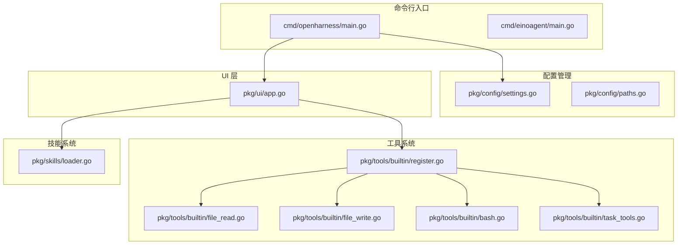
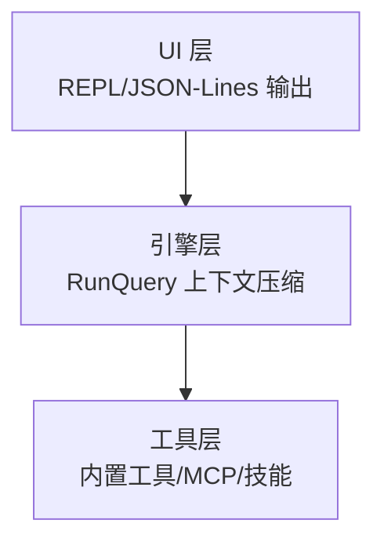
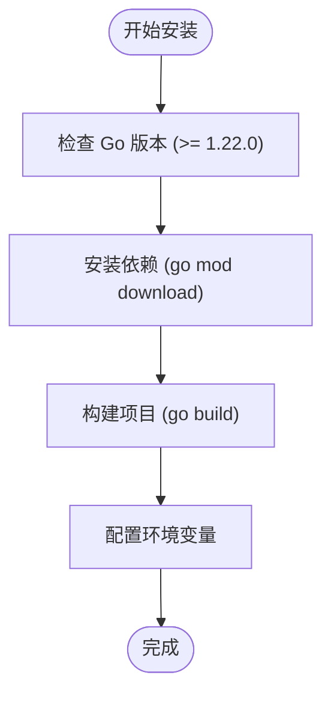
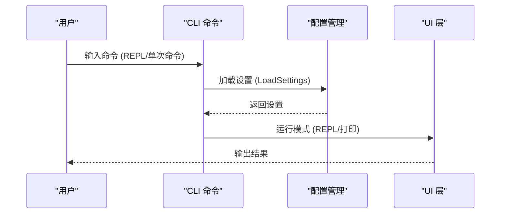
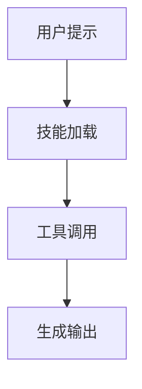
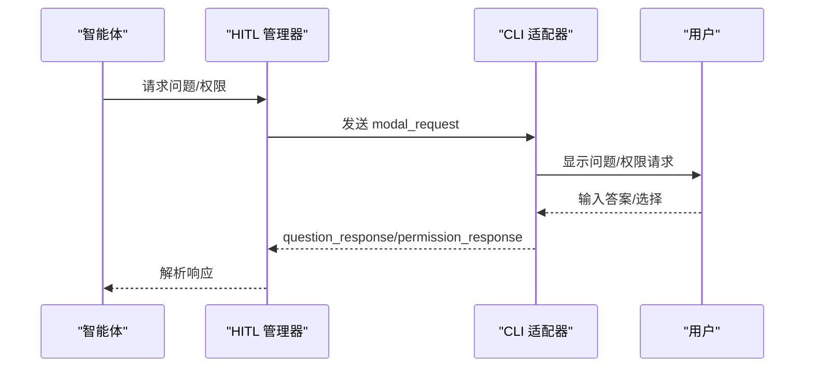
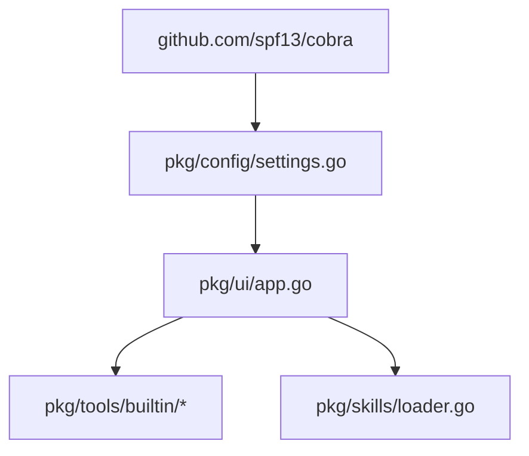

# 快速开始

<cite>
**本文档引用的文件**
- [README.md](file://README.md)
- [go.mod](file://go.mod)
- [cmd/openharness/main.go](file://cmd/openharness/main.go)
- [pkg/config/settings.go](file://pkg/config/settings.go)
- [pkg/config/paths.go](file://pkg/config/paths.go)
- [pkg/ui/app.go](file://pkg/ui/app.go)
- [pkg/tools/builtin/register.go](file://pkg/tools/builtin/register.go)
- [pkg/tools/builtin/file_read.go](file://pkg/tools/builtin/file_read.go)
- [pkg/tools/builtin/file_write.go](file://pkg/tools/builtin/file_write.go)
- [pkg/tools/builtin/bash.go](file://pkg/tools/builtin/bash.go)
- [pkg/tools/builtin/task_tools.go](file://pkg/tools/builtin/task_tools.go)
- [pkg/skills/loader.go](file://pkg/skills/loader.go)
- [plugins/superpowers/skills/systematic-debugging/SKILL.md](file://plugins/superpowers/skills/systematic-debugging/SKILL.md)
- [plugins/anthropic/skills/code-review/SKILL.md](file://plugins/anthropic/skills/code-review/SKILL.md)
- [design/Human-In-The-Loop.md](file://design/Human-In-The-Loop.md)
</cite>

## 目录
1. [简介](#简介)
2. [项目结构](#项目结构)
3. [核心组件](#核心组件)
4. [架构总览](#架构总览)
5. [详细组件分析](#详细组件分析)
6. [依赖分析](#依赖分析)
7. [性能考虑](#性能考虑)
8. [故障排除指南](#故障排除指南)
9. [结论](#结论)
10. [附录](#附录)

## 简介
OpenHarness Go 是一个基于 Go 语言开发的高性能、高可扩展的 AI Agent Harness 项目。它提供了一个受控、安全且具备强大上下文管理能力的执行环境，适用于自动化代码开发、代码审查、系统管理以及复杂的并行任务编排。项目内置了多轮会话引擎、动态上下文压缩、高维插件与技能系统、并行任务与子智能体、MCP 客户端集成以及深度思考模型支持等核心能力。

## 项目结构
OpenHarness Go 采用模块化设计，主要分为命令行入口、配置管理、UI 层、工具系统、技能系统、任务系统、MCP 集成等模块。命令行入口位于 cmd/openharness，核心逻辑集中在 pkg 目录下，插件与技能位于 plugins 目录。

**图表来源**
- [cmd/openharness/main.go:1-299](file://cmd/openharness/main.go#L1-L299)
- [pkg/config/settings.go:1-212](file://pkg/config/settings.go#L1-L212)
- [pkg/ui/app.go:1-238](file://pkg/ui/app.go#L1-L238)
- [pkg/tools/builtin/register.go:1-30](file://pkg/tools/builtin/register.go#L1-L30)
- [pkg/skills/loader.go:1-198](file://pkg/skills/loader.go#L1-L198)

**章节来源**
- [README.md:1-133](file://README.md#L1-L133)
- [go.mod:1-43](file://go.mod#L1-L43)

## 核心组件
- 命令行入口：提供 CLI 接口，支持交互式 REPL、非交互模式、认证管理、MCP 服务器管理等功能。
- 配置管理：负责设置加载、保存、环境变量覆盖以及配置文件路径管理。
- UI 层：实现非交互模式、REPL 模式以及 JSON-Lines 协议模式。
- 工具系统：内置文件读写、Bash 执行、任务管理等工具，并支持插件与技能扩展。
- 技能系统：支持 Markdown 定义的技能加载与动态索引，实现按需下钻加载。
- 任务系统：支持并行任务注册表与子智能体执行器。
- MCP 集成：实现 JSON-RPC 2.0 协议的 MCP 客户端集成。

**章节来源**
- [cmd/openharness/main.go:15-102](file://cmd/openharness/main.go#L15-L102)
- [pkg/config/settings.go:97-142](file://pkg/config/settings.go#L97-L142)
- [pkg/ui/app.go:18-61](file://pkg/ui/app.go#L18-L61)
- [pkg/tools/builtin/register.go:7-21](file://pkg/tools/builtin/register.go#L7-L21)
- [pkg/skills/loader.go:21-60](file://pkg/skills/loader.go#L21-L60)

## 架构总览
OpenHarness Go 的架构分为三层：UI 层（REPL/JSON-Lines）、引擎层（RunQuery）、工具层（内置工具/MCP/技能）。UI 层负责用户交互与输出格式化；引擎层负责 LLM 交互、上下文压缩与工具分发；工具层提供文件操作、Shell 执行、任务管理等能力。

**图表来源**
- [README.md:16-41](file://README.md#L16-L41)
- [pkg/ui/app.go:122-181](file://pkg/ui/app.go#L122-L181)
- [pkg/tools/builtin/register.go:8-21](file://pkg/tools/builtin/register.go#L8-L21)

## 详细组件分析

### 安装与环境配置
- 系统要求：Go 1.22.0+
- 依赖安装：项目使用 Go Modules 管理依赖，构建时会自动下载所需依赖。
- 环境配置：支持通过环境变量覆盖配置，如 ANTHROPIC_API_KEY、ANTHROPIC_MODEL、ANTHROPIC_BASE_URL 等。

**图表来源**
- [go.mod:3](file://go.mod#L3)
- [README.md:43-54](file://README.md#L43-L54)

**章节来源**
- [go.mod:3](file://go.mod#L3)
- [README.md:43-54](file://README.md#L43-L54)
- [pkg/config/settings.go:197-211](file://pkg/config/settings.go#L197-L211)

### CLI 使用示例
- 启动 REPL 模式：直接运行 openharness 命令进入交互式会话。
- 执行单次命令：使用 --prompt 参数或 --print 参数进行非交互模式调用。
- 配置认证：使用 auth 子命令进行登录、登出与状态查看。

**图表来源**
- [cmd/openharness/main.go:46-76](file://cmd/openharness/main.go#L46-L76)
- [pkg/config/settings.go:160-178](file://pkg/config/settings.go#L160-L178)
- [pkg/ui/app.go:122-181](file://pkg/ui/app.go#L122-L181)

**章节来源**
- [cmd/openharness/main.go:46-102](file://cmd/openharness/main.go#L46-L102)
- [pkg/ui/app.go:18-61](file://pkg/ui/app.go#L18-L61)

### 常见使用场景示例
- 文件读取：使用 Read 工具读取文件内容，支持偏移与限制行数。
- 代码生成：结合技能系统，使用内置工具与技能进行代码生成与审查。
- 技能调用：通过技能加载器动态加载 Markdown 定义的技能，实现按需下钻加载。

**图表来源**
- [pkg/tools/builtin/file_read.go:59-98](file://pkg/tools/builtin/file_read.go#L59-L98)
- [pkg/skills/loader.go:21-60](file://pkg/skills/loader.go#L21-L60)

**章节来源**
- [pkg/tools/builtin/file_read.go:18-57](file://pkg/tools/builtin/file_read.go#L18-L57)
- [pkg/skills/loader.go:126-197](file://pkg/skills/loader.go#L126-L197)

### 人类在回路 (HITL) 交互
OpenHarness Go 实现了完整的 HITL 机制，支持多选题与权限请求，通过 CLI 或 JSON-Lines 协议与用户交互。

**图表来源**
- [design/Human-In-The-Loop.md:16-34](file://design/Human-In-The-Loop.md#L16-L34)
- [pkg/ui/app.go:122-181](file://pkg/ui/app.go#L122-L181)

**章节来源**
- [design/Human-In-The-Loop.md:59-122](file://design/Human-In-The-Loop.md#L59-L122)
- [pkg/ui/app.go:183-189](file://pkg/ui/app.go#L183-L189)

## 依赖分析
OpenHarness Go 使用 Cobra 作为 CLI 框架，依赖关系清晰，模块间耦合度较低。核心依赖包括配置管理、UI 层、工具系统、技能系统等。

**图表来源**
- [go.mod:5](file://go.mod#L5)
- [cmd/openharness/main.go:10-12](file://cmd/openharness/main.go#L10-L12)

**章节来源**
- [go.mod:1-43](file://go.mod#L1-L43)
- [cmd/openharness/main.go:10-12](file://cmd/openharness/main.go#L10-L12)

## 性能考虑
- 上下文压缩：内置五阶段上下文压缩管道，确保长时间会话不会导致 Token 溢出。
- 动态技能加载：通过分层索引机制，仅在需要时加载具体技能，避免初始上下文爆炸。
- 并行任务：支持并行任务注册表与子智能体执行器，提高复杂任务处理效率。

## 故障排除指南
- API 密钥未配置：检查 ANTHROPIC_API_KEY 环境变量或配置文件中的 api_key 字段。
- 配置文件路径：默认位于用户主目录下的 ~/.openharness/settings.json。
- 权限模式：根据需求调整 permission.mode，支持 default、plan、full_auto 三种模式。
- MCP 服务器：使用 mcp 子命令管理 MCP 服务器的添加、删除与列表查看。

**章节来源**
- [pkg/config/settings.go:144-154](file://pkg/config/settings.go#L144-L154)
- [pkg/config/paths.go:21](file://pkg/config/paths.go#L21)
- [cmd/openharness/main.go:237-298](file://cmd/openharness/main.go#L237-L298)

## 结论
OpenHarness Go 提供了一个功能完整、易于扩展的 AI Agent 开发与部署平台。通过模块化设计与丰富的内置工具、技能系统，用户可以在 15 分钟内完成安装并体验核心功能。建议新用户从 REPL 模式开始，逐步探索文件读写、代码生成、技能调用等场景，并根据实际需求配置认证与权限模式。

## 附录
- 快速开始命令示例：构建项目后，直接运行 openharness 进入 REPL，或使用 --prompt 参数进行单次命令执行。
- 插件与技能：项目内置了多个高质量插件与技能，如 superpowers、anthropic 等，可通过技能加载器动态加载。
- MCP 集成：支持通过 mcp 子命令管理 MCP 服务器，实现外部服务的无缝接入。

**章节来源**
- [README.md:43-102](file://README.md#L43-L102)
- [cmd/einoagent/main.go:25-107](file://cmd/einoagent/main.go#L25-L107)