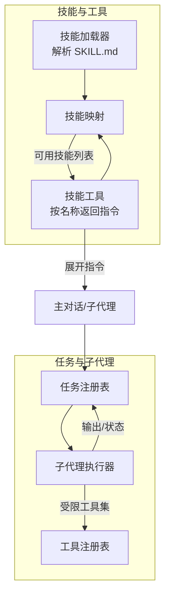
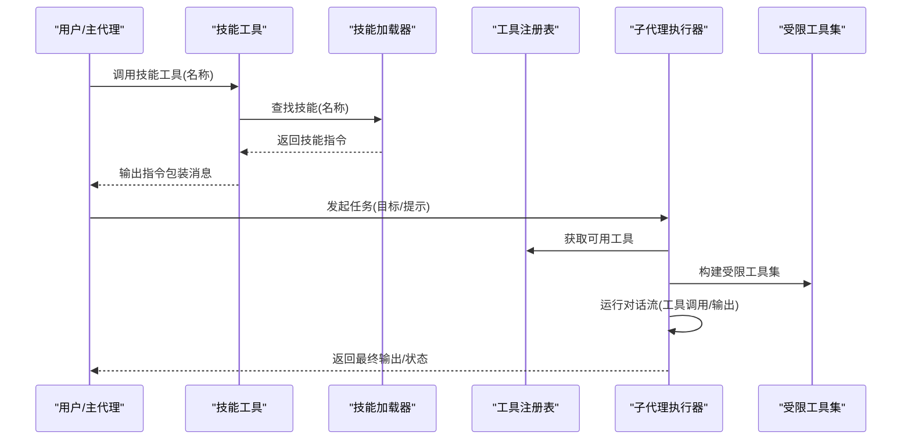
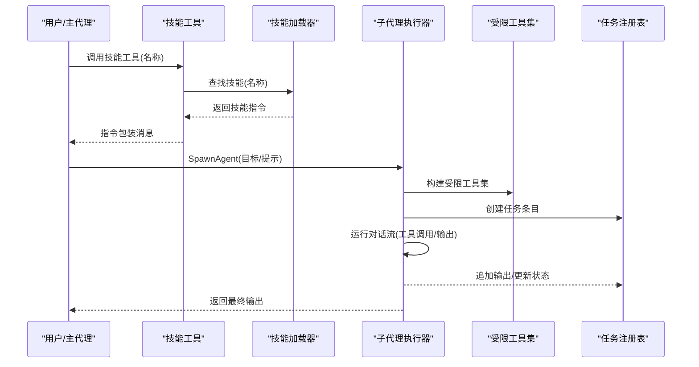
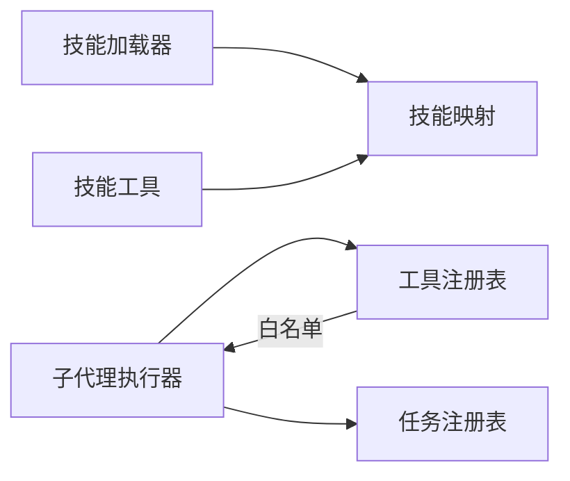
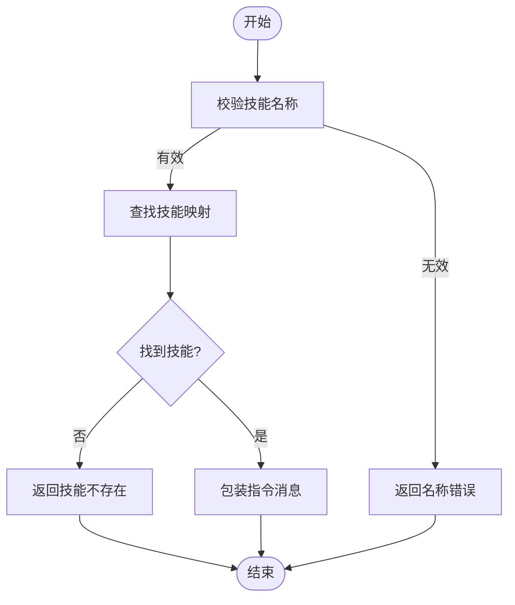
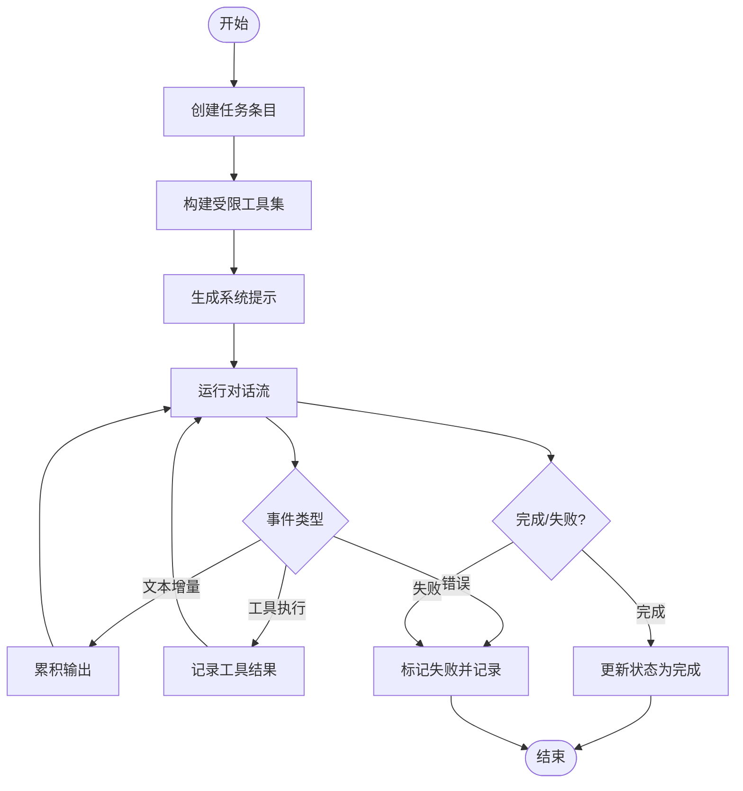

# 内置技能示例

<cite>
**本文引用的文件**
- [pkg/skills/loader.go](file://pkg/skills/loader.go)
- [pkg/tools/builtin/skill.go](file://pkg/tools/builtin/skill.go)
- [plugins/superpowers/skills/systematic-debugging/SKILL.md](file://plugins/superpowers/skills/systematic-debugging/SKILL.md)
- [plugins/superpowers/skills/test-driven-development/SKILL.md](file://plugins/superpowers/skills/test-driven-development/SKILL.md)
- [plugins/superpowers/skills/writing-skills/SKILL.md](file://plugins/superpowers/skills/writing-skills/SKILL.md)
- [plugins/superpowers/skills/executing-plans/SKILL.md](file://plugins/superpowers/skills/executing-plans/SKILL.md)
- [plugins/superpowers/skills/subagent-driven-development/SKILL.md](file://plugins/superpowers/skills/subagent-driven-development/SKILL.md)
- [plugins/superpowers/skills/verification-before-completion/SKILL.md](file://plugins/superpowers/skills/verification-before-completion/SKILL.md)
- [plugins/superpowers/skills/writing-plans/SKILL.md](file://plugins/superpowers/skills/writing-plans/SKILL.md)
- [pkg/tools/base.go](file://pkg/tools/base.go)
- [pkg/tools/builtin/register.go](file://pkg/tools/builtin/register.go)
- [pkg/taks/executor.go](file://pkg/tasks/executor.go)
- [pkg/tasks/registry.go](file://pkg/tasks/registry.go)
- [pkg/tasks/types.go](file://pkg/tasks/types.go)
</cite>

## 目录
1. [简介](#简介)
2. [项目结构](#项目结构)
3. [核心组件](#核心组件)
4. [架构总览](#架构总览)
5. [详细组件分析](#详细组件分析)
6. [依赖分析](#依赖分析)
7. [性能考虑](#性能考虑)
8. [故障排查指南](#故障排查指南)
9. [结论](#结论)
10. [附录](#附录)

## 简介
本文件面向“内置技能示例”的参考与实践，聚焦于系统中已内置的技能：写作技能、调试技能、测试技能与项目管理（计划与执行）技能。文档从实现原理、输入输出规范、执行流程、实际使用场景、技能间依赖与组合、适用领域与限制、效果评估与性能、以及定制扩展建议等维度进行系统化说明，帮助用户在真实任务中高效选择与编排技能，实现可验证、可迭代的任务自动化。

## 项目结构
- 技能定义与加载
  - 技能以 Markdown 文件形式存在，采用 YAML 风格的 frontmatter 声明元数据（名称、描述），正文为技能指令与流程。
  - 加载器负责扫描目录，解析 SKILL.md 或同名 .md 文件，构建技能对象列表，并支持插件集合的虚拟索引生成。
- 工具与技能交互
  - 工具层提供统一的工具抽象与注册机制；技能工具用于按名称检索并返回对应技能的完整指令文本，供主对话或子代理执行。
- 子代理与任务编排
  - 任务系统支持创建、查询、停止、发送消息、更新状态等能力；子代理执行器根据类型与白名单工具集构建受限上下文，运行目标提示并收集输出。
- 超级力量（Superpowers）系列技能
  - 提供调试、测试、写作、计划、执行、验证等闭环技能，强调“先基线再改进”的 TDD 思想与“证据优先”的验证流程。

**图表来源**
- [pkg/skills/loader.go:23-60](file://pkg/skills/loader.go#L23-L60)
- [pkg/tools/builtin/skill.go:27-52](file://pkg/tools/builtin/skill.go#L27-L52)
- [pkg/tasks/executor.go:33-51](file://pkg/tasks/executor.go#L33-L51)
- [pkg/tasks/registry.go:30-49](file://pkg/tasks/registry.go#L30-L49)

**章节来源**
- [pkg/skills/loader.go:21-60](file://pkg/skills/loader.go#L21-L60)
- [pkg/tools/builtin/skill.go:16-52](file://pkg/tools/builtin/skill.go#L16-L52)
- [pkg/tasks/executor.go:16-31](file://pkg/tasks/executor.go#L16-L31)

## 核心组件
- 技能模型与加载
  - 技能对象包含名称、描述、指令正文与是否为子技能标记；加载器支持目录扫描、插件集合索引与前缀命名，避免冲突。
  - 解析器支持 frontmatter 与纯文本两种模式，便于灵活组织技能内容。
- 技能工具
  - 暴露只读工具接口，输入为 JSON 对象，包含技能名称字段；执行时返回带指令头的消息与技能正文，便于模型在当前会话中展开执行。
- 任务与子代理
  - 任务注册表提供创建、查询、停止、追加输出、发送消息、设置状态与错误等能力；子代理执行器负责沙箱化工具集、构造系统提示、运行对话流并汇总输出。
- 工具基础与注册
  - 工具抽象定义了名称、描述、输入模式、执行上下文、只读属性与 API 模式导出；工具注册表提供并发安全的注册与枚举能力。

**章节来源**
- [pkg/skills/loader.go:13-60](file://pkg/skills/loader.go#L13-L60)
- [pkg/tools/builtin/skill.go:16-72](file://pkg/tools/builtin/skill.go#L16-L72)
- [pkg/tasks/registry.go:13-49](file://pkg/tasks/registry.go#L13-L49)
- [pkg/tasks/executor.go:24-31](file://pkg/tasks/executor.go#L24-L31)
- [pkg/tools/base.go:51-79](file://pkg/tools/base.go#L51-L79)

## 架构总览
下图展示了技能加载、工具调用与子代理执行的整体流程，体现“指令展开—受限工具—对话执行—状态回写”的闭环。

**图表来源**
- [pkg/tools/builtin/skill.go:54-72](file://pkg/tools/builtin/skill.go#L54-L72)
- [pkg/skills/loader.go:127-197](file://pkg/skills/loader.go#L127-L197)
- [pkg/tasks/executor.go:86-137](file://pkg/tasks/executor.go#L86-L137)

## 详细组件分析

### 写作技能（Writing Skills）
- 功能特性
  - 将“测试驱动开发”思想迁移到过程文档与技能创作，强调“先基线后改进”的 RED-GREEN-REFACTOR 循环。
  - 强调触发条件描述（描述字段）与关键词覆盖，避免在描述中总结流程，确保检索与发现质量。
- 输入输出规范
  - 输入：技能名称（用于检索与对比）。
  - 输出：技能指令正文，包含触发条件、核心原则、快速参考、常见误区与实证影响等。
- 执行流程
  - 基线压力测试：在没有技能的情况下，让子代理在压力场景下执行，记录其行为与理性化借口。
  - 最小化技能：针对基线暴露的问题点，编写最小可行技能内容。
  - 反复重构：持续测试新场景，补充反理性化清单与红灯规则，直至子弹壳。
- 实际示例与使用场景
  - 新建技能：先设计压力场景，运行基线，记录失败模式，再撰写技能并验证合规性。
  - 编辑现有技能：对修改进行压力测试，识别新的理性化路径，补充约束与反例。
- 适用领域与限制
  - 适用于需要高可发现性与强约束的流程类技能；不适合一次性、非重复性的场景。
  - 描述必须严格遵循“触发条件”而非“流程总结”，否则可能被模型跳过正文直接执行。
- 评估指标与性能
  - 可用性：描述字段命中率、技能加载速度、正文长度与压缩效率。
  - 质量：压力测试下的违规次数、红灯触发频率、重构轮次与收敛速度。
- 定制与扩展建议
  - 使用交叉引用明确前置技能要求，避免强制加载造成上下文膨胀。
  - 采用可视化流程图仅在决策点复杂时使用，保持正文简洁。

**章节来源**
- [plugins/superpowers/skills/writing-skills/SKILL.md:1-656](file://plugins/superpowers/skills/writing-skills/SKILL.md#L1-L656)

### 调试技能（Systematic Debugging）
- 功能特性
  - 四阶段调试法：根因调查、模式分析、假设与测试、实施修复；强调“先调查再修复”的铁律。
  - 在多组件系统中增加诊断仪器，逐层定位问题边界。
- 输入输出规范
  - 输入：问题描述、环境信息、错误日志、复现步骤等（由调用方提供）。
  - 输出：阶段性结论、证据清单、修复建议与回归测试方案。
- 执行流程
  - Phase 1：阅读错误、重现问题、检查变更、收集证据。
  - Phase 2：寻找工作范例、对比差异、理解依赖。
  - Phase 3：形成单一假设、最小化验证、验证后再继续。
  - Phase 4：创建失败测试、单点修复、验证通过、必要时质疑架构。
- 实际示例与使用场景
  - 测试失败、生产缺陷、性能退化、构建失败、集成问题等。
  - 应急响应、多次修复无效、不完全理解问题时尤为适用。
- 适用领域与限制
  - 适合复杂系统与跨层问题；对简单问题可能显得繁琐，但长期收益显著。
  - 若证据不足或环境不稳定，需先稳定环境再进入根因调查。
- 评估指标与性能
  - 效率：首次修复时间、平均修复尝试次数、新问题引入率。
  - 成功率：首次修复率、回归率、重复问题比例。
- 定制与扩展建议
  - 结合“防御式深度”“基于条件的等待”等配套技术，提升诊断与修复质量。

**章节来源**
- [plugins/superpowers/skills/systematic-debugging/SKILL.md:1-297](file://plugins/superpowers/skills/systematic-debugging/SKILL.md#L1-L297)

### 测试技能（Test-Driven Development）
- 功能特性
  - 红绿重构循环：先写失败测试、验证失败、写最少代码使其通过、验证全部通过、重构清理。
  - 强调“未见失败即未验证”，杜绝“测试后补”与“凭感觉实现”。
- 输入输出规范
  - 输入：功能需求、边界条件、期望行为。
  - 输出：通过的测试、最小实现、重构后的整洁代码。
- 执行流程
  - RED：写出失败测试，确认失败原因正确。
  - GREEN：写出最小实现使其通过，确保其他测试不受影响。
  - REFACTOR：清理重复、改善命名、提取助手，保持测试全绿。
- 实际示例与使用场景
  - 新功能开发、缺陷修复、重构与行为变更。
  - 特别适用于需要自动化回归与可演进代码库的场景。
- 适用领域与限制
  - 适合可测试性强的模块；对难以隔离或耦合极深的模块，需先进行必要的解耦。
  - 不适用于“一次性原型”“自动生成代码”“配置文件”等场景。
- 评估指标与性能
  - 质量：测试覆盖率、失败测试数量、重构次数、回归测试通过率。
  - 效率：从需求到通过的时间、平均每次迭代耗时。
- 定制与扩展建议
  - 与“验证前完成”技能配合，在提交或合并前进行证据核查，防止虚假成功声明。

**章节来源**
- [plugins/superpowers/skills/test-driven-development/SKILL.md:1-372](file://plugins/superpowers/skills/test-driven-development/SKILL.md#L1-L372)

### 项目管理技能（计划与执行）
- 写计划（Writing Plans）
  - 功能特性：产出可执行的实现计划，任务粒度细、文件路径精确、步骤可验证、遵循 DRY/YAGNI/TDD/频繁提交。
  - 关键点：文件结构分解、任务拆分、无占位符、自审清单。
- 执行计划（Executing Plans）
  - 功能特性：加载并评审计划，逐项执行与验证，完成后使用“完成开发分支”收尾。
  - 关键点：关键检查点、阻塞处理、与人类伙伴沟通。
- 子代理驱动开发（Subagent-Driven Development）
  - 功能特性：每任务派发新鲜子代理，两阶段审查（规范符合性→代码质量），同一会话内连续推进。
  - 关键点：模型选型、实现者状态处理、审查回路、成本与效率权衡。
- 验证前完成（Verification Before Completion）
  - 功能特性：在宣称完成/修复/通过之前，必须运行验证命令并依据输出做出声明。
  - 关键点：证据优先、红灯清单、常见失败模式与对策。
- 实际示例与使用场景
  - 计划阶段：需求→计划→选择执行方式（子代理/批量）。
  - 执行阶段：任务级 TDD、两阶段审查、最终收尾与验证。
- 适用领域与限制
  - 适合大型、多任务、跨模块的工程化任务；对单人短任务可能过度工程化。
  - 必须有稳定的子代理平台与工具链支持，否则执行质量下降。
- 评估指标与性能
  - 交付质量：任务完成率、审查通过率、阻塞次数与解决时长。
  - 迭代效率：任务平均耗时、审查回路次数、总迭代轮次。
- 定制与扩展建议
  - 明确子代理角色与工具白名单，按任务复杂度选择模型；建立标准化的审查模板与问题处理流程。

**章节来源**
- [plugins/superpowers/skills/writing-plans/SKILL.md:1-153](file://plugins/superpowers/skills/writing-plans/SKILL.md#L1-L153)
- [plugins/superpowers/skills/executing-plans/SKILL.md:1-71](file://plugins/superpowers/skills/executing-plans/SKILL.md#L1-L71)
- [plugins/superpowers/skills/subagent-driven-development/SKILL.md:1-278](file://plugins/superpowers/skills/subagent-driven-development/SKILL.md#L1-L278)
- [plugins/superpowers/skills/verification-before-completion/SKILL.md:1-140](file://plugins/superpowers/skills/verification-before-completion/SKILL.md#L1-L140)

### 技能调用与执行序列（代码级）
以下序列图映射到实际代码中的工具调用与执行器运行流程。

**图表来源**
- [pkg/tools/builtin/skill.go:54-72](file://pkg/tools/builtin/skill.go#L54-L72)
- [pkg/skills/loader.go:127-197](file://pkg/skills/loader.go#L127-L197)
- [pkg/tasks/executor.go:33-51](file://pkg/tasks/executor.go#L33-L51)
- [pkg/tasks/registry.go:30-49](file://pkg/tasks/registry.go#L30-L49)

## 依赖分析
- 技能系统
  - 技能加载器依赖文件系统扫描与 Markdown 解析；插件集合通过前缀命名与虚拟索引聚合子技能。
  - 技能工具依赖技能映射表，按名称检索并返回指令。
- 任务与子代理
  - 子代理执行器依赖任务注册表、工具注册表与沙箱化策略；受限工具集按子代理类型动态生成。
  - 任务注册表提供并发安全的状态与输出管理。
- 工具体系
  - 工具抽象与注册表为所有内置工具提供统一契约与导出；默认注册器集中注册常用工具。

**图表来源**
- [pkg/skills/loader.go:65-124](file://pkg/skills/loader.go#L65-L124)
- [pkg/tools/builtin/skill.go:27-52](file://pkg/tools/builtin/skill.go#L27-L52)
- [pkg/tasks/executor.go:139-163](file://pkg/tasks/executor.go#L139-L163)
- [pkg/tasks/registry.go:13-49](file://pkg/tasks/registry.go#L13-L49)

**章节来源**
- [pkg/skills/loader.go:62-124](file://pkg/skills/loader.go#L62-L124)
- [pkg/tools/builtin/skill.go:27-52](file://pkg/tools/builtin/skill.go#L27-L52)
- [pkg/tasks/executor.go:139-163](file://pkg/tasks/executor.go#L139-L163)
- [pkg/tasks/registry.go:13-49](file://pkg/tasks/registry.go#L13-L49)

## 性能考虑
- 技能加载
  - 目录扫描与 frontmatter 解析开销与技能数量、文件大小成正比；插件集合索引会增加一次遍历成本。
  - 建议：将常用技能置于扁平命名空间，减少层级；控制描述与正文长度，提升检索效率。
- 工具调用
  - 工具注册表为并发安全容器，注册与查询为 O(1)；输入模式校验与只读标记降低误用风险。
  - 建议：按需注册工具，避免一次性加载过多工具导致上下文膨胀。
- 子代理执行
  - 沙箱化工具集与系统提示构建为轻量操作；对话流事件驱动输出累积，内存占用与对话轮数线性相关。
  - 建议：合理设置最大轮次与令牌上限，避免长时间运行；对长输出进行截断与摘要。

[本节为通用指导，无需特定文件来源]

## 故障排查指南
- 技能工具报错
  - 现象：名称为空、技能不存在、输入格式错误。
  - 处理：检查可用技能列表，核对名称拼写；确保输入 JSON 符合模式。
- 子代理执行失败
  - 现象：任务状态为失败、输出包含错误信息、无法获取输出。
  - 处理：查看任务错误字段与输出片段；检查工具白名单与系统提示；确认工作目录与权限。
- 任务状态异常
  - 现象：任务不可停止、状态不可更新、消息丢失。
  - 处理：确认任务 ID 正确；检查运行中/已创建状态；重新发送消息或手动更新状态。
- 验证前完成违规
  - 现象：宣称完成但未运行验证命令。
  - 处理：立即运行验证命令，依据输出修正声明；建立自动化的验证钩子。

**章节来源**
- [pkg/tools/builtin/skill.go:54-72](file://pkg/tools/builtin/skill.go#L54-L72)
- [pkg/tasks/executor.go:118-137](file://pkg/tasks/executor.go#L118-L137)
- [pkg/tasks/registry.go:74-90](file://pkg/tasks/registry.go#L74-L90)
- [plugins/superpowers/skills/verification-before-completion/SKILL.md:16-38](file://plugins/superpowers/skills/verification-before-completion/SKILL.md#L16-L38)

## 结论
内置技能示例以“可验证、可迭代、可组合”为核心设计原则，结合 TDD 思想与证据优先的验证流程，形成从计划、执行到收尾的闭环。通过技能工具与子代理执行器的协作，用户可以在不同复杂度与规模的任务中灵活选择合适技能，并通过组合与编排实现端到端的自动化。建议在实践中坚持“先基线后改进”的创作与执行策略，持续优化技能描述与工具集，以获得更高的质量与效率。

[本节为总结性内容，无需特定文件来源]

## 附录
- 技能调用流程（算法级）

**图表来源**
- [pkg/tools/builtin/skill.go:54-72](file://pkg/tools/builtin/skill.go#L54-L72)

- 子代理执行流程（算法级）

**图表来源**
- [pkg/tasks/executor.go:78-137](file://pkg/tasks/executor.go#L78-L137)