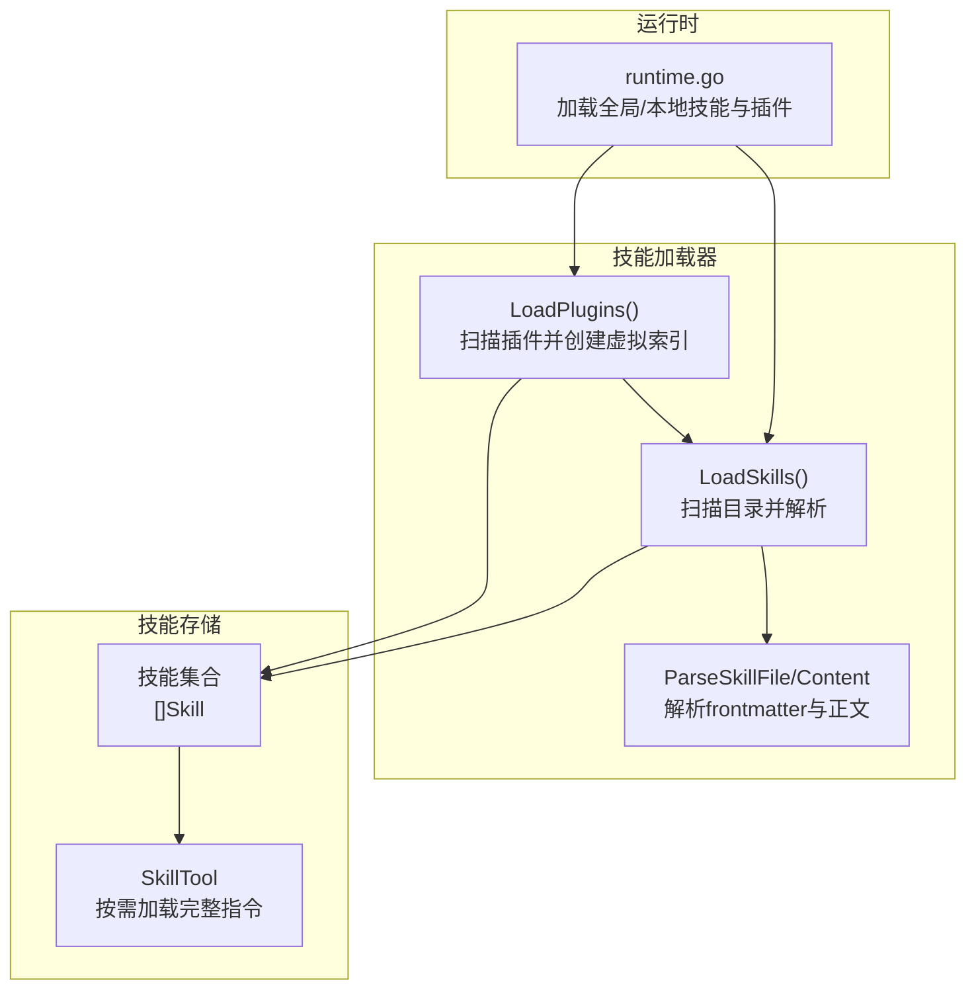
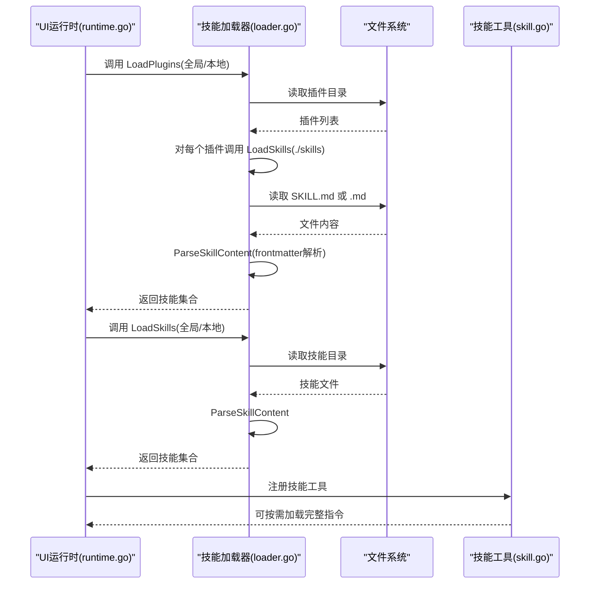
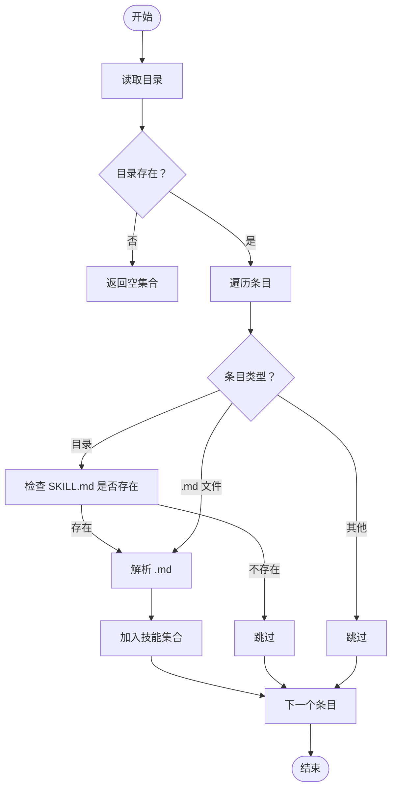
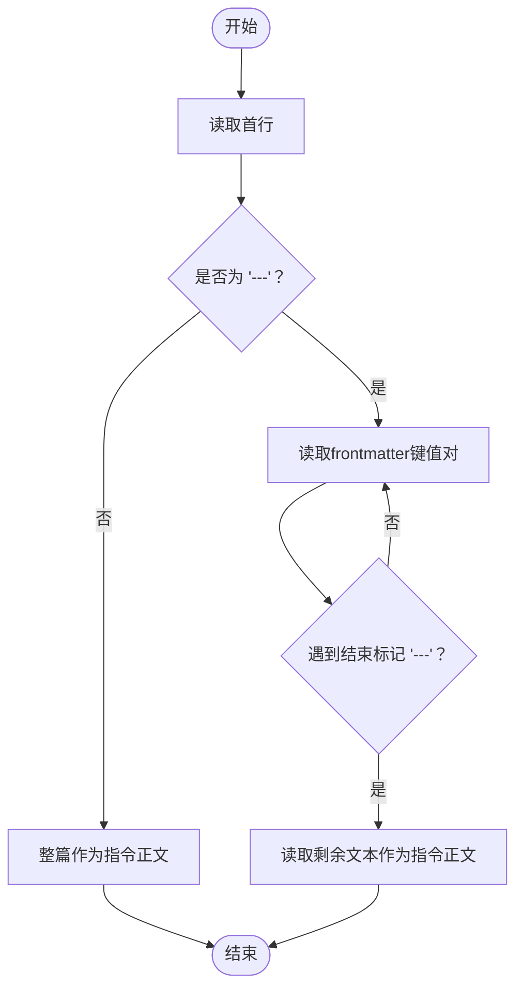
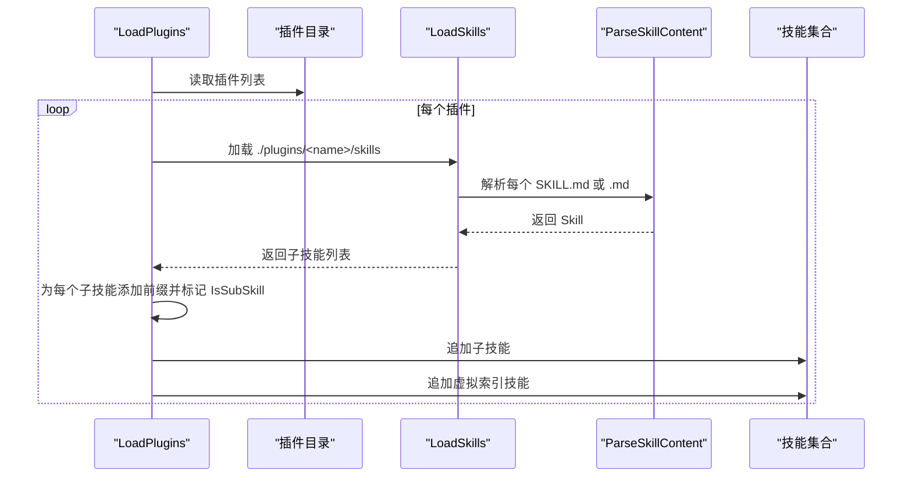
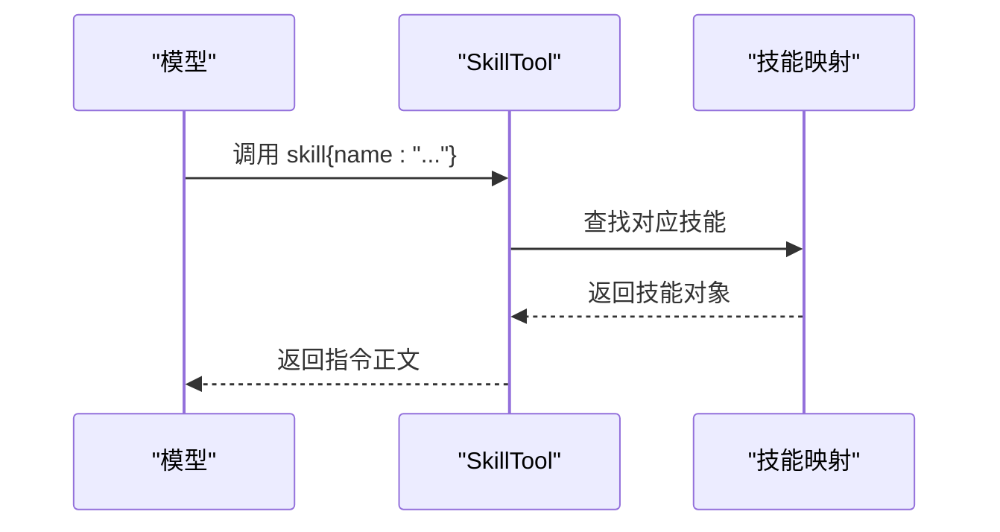
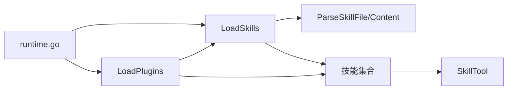

# 技能加载机制

<cite>
**本文引用的文件**
- [loader.go](file://pkg/skills/loader.go)
- [loader_test.go](file://pkg/skills/loader_test.go)
- [runtime.go](file://pkg/ui/runtime.go)
- [skill.go](file://pkg/tools/builtin/skill.go)
- [skills.go](file://einoagent/skills/skills.go)
- [SKILL.md](file://plugins/anthropic/skills/code-review/SKILL.md)
- [SKILL.md](file://plugins/superpowers/skills/brainstorming/SKILL.md)
- [SKILL.md](file://plugins/karpathy/skills/SKILL.md)
</cite>

## 目录
1. [简介](#简介)
2. [项目结构](#项目结构)
3. [核心组件](#核心组件)
4. [架构总览](#架构总览)
5. [详细组件分析](#详细组件分析)
6. [依赖关系分析](#依赖关系分析)
7. [性能考量](#性能考量)
8. [故障排查指南](#故障排查指南)
9. [结论](#结论)
10. [附录](#附录)

## 简介
本文件面向“技能加载机制”的技术文档，聚焦于以下目标：
- 深入解释 LoadSkills 与 LoadPlugins 函数的实现原理与工作流程
- 分析目录扫描算法（递归遍历、文件过滤与路径解析）
- 阐述技能文件发现机制（SKILL.md 识别与普通 .md 处理）
- 解释插件系统的技能加载（虚拟技能创建、技能名前缀与冲突避免）
- 给出技能缓存、增量加载与热重载的实现方案建议
- 总结错误处理与异常场景（文件权限、格式错误、依赖缺失）
- 提供性能优化与批量加载最佳实践

## 项目结构
OpenHarness 将“技能”抽象为一组以 Markdown 文件形式存在的能力单元，支持两类来源：
- 全局技能：位于用户主目录下的特定路径
- 本地技能：位于当前工作目录下的特定路径
- 插件技能：位于各插件包内的 skills 子目录中

运行时通过 UI 层加载这些技能，并将其注册为工具，供模型在对话中按需调用。

图表来源
- [runtime.go:79-97](file://pkg/ui/runtime.go#L79-L97)
- [loader.go:21-60](file://pkg/skills/loader.go#L21-L60)
- [loader.go:62-124](file://pkg/skills/loader.go#L62-L124)
- [loader.go:126-197](file://pkg/skills/loader.go#L126-L197)
- [skill.go:21-72](file://pkg/tools/builtin/skill.go#L21-L72)

章节来源
- [runtime.go:79-97](file://pkg/ui/runtime.go#L79-L97)

## 核心组件
- 技能数据结构：包含名称、描述、指令正文以及是否为子技能标记
- 目录扫描与解析：支持两种发现模式（SKILL.md 与普通 .md），并解析 YAML 风格 frontmatter
- 插件聚合：为每个插件生成一个“虚拟技能”索引，同时为子技能添加前缀避免冲突
- 工具集成：将已加载技能注册为可调用工具，按需返回完整指令正文

章节来源
- [loader.go:13-19](file://pkg/skills/loader.go#L13-L19)
- [loader.go:21-60](file://pkg/skills/loader.go#L21-L60)
- [loader.go:62-124](file://pkg/skills/loader.go#L62-L124)
- [loader.go:126-197](file://pkg/skills/loader.go#L126-L197)
- [skill.go:21-72](file://pkg/tools/builtin/skill.go#L21-L72)

## 架构总览
下图展示了从 UI 初始化到技能可用的关键调用链路。

图表来源
- [runtime.go:79-97](file://pkg/ui/runtime.go#L79-L97)
- [loader.go:21-60](file://pkg/skills/loader.go#L21-L60)
- [loader.go:62-124](file://pkg/skills/loader.go#L62-L124)
- [loader.go:126-197](file://pkg/skills/loader.go#L126-L197)
- [skill.go:21-72](file://pkg/tools/builtin/skill.go#L21-L72)

## 详细组件分析

### 目录扫描与文件发现算法
- 递归遍历策略
  - 对给定目录进行一次读取，逐项判断：
    - 若为目录：检查是否存在 SKILL.md；存在则解析该文件
    - 若为 .md 文件：直接解析该文件
    - 其他类型：跳过
- 路径解析
  - 使用路径拼接确保跨平台兼容性
  - 对不存在的目录返回空结果而非报错，体现容错设计
- 文件过滤
  - 仅接受 .md 结尾的文件或包含 SKILL.md 的子目录
  - 忽略无法读取或解析失败的条目

图表来源
- [loader.go:23-60](file://pkg/skills/loader.go#L23-L60)

章节来源
- [loader.go:23-60](file://pkg/skills/loader.go#L23-L60)

### 技能文件解析与 frontmatter 处理
- frontmatter 格式
  - 以 "---" 开始与结束，键值对以冒号分隔
  - 支持 name 与 description 键；其余键可扩展
- 正文提取
  - frontmatter 结束后的剩余内容作为指令正文
  - 若无 frontmatter，则整篇内容作为指令正文
- 解析流程
  - 读取首行判断是否存在 frontmatter
  - 逐行解析键值对，去除多余空白与引号
  - 剩余文本作为 Instructions

图表来源
- [loader.go:126-197](file://pkg/skills/loader.go#L126-L197)

章节来源
- [loader.go:126-197](file://pkg/skills/loader.go#L126-L197)

### 插件系统与虚拟技能索引
- 插件扫描
  - 读取插件根目录，遍历每个子目录
  - 对每个插件，调用 LoadSkills 加载其 skills 子目录
- 虚拟技能创建
  - 为每个插件生成一个“顶层索引技能”，描述该插件包含的子技能数量
  - 为每个子技能添加前缀（插件名:子技能名），避免命名冲突
  - 子技能的 Instructions 前附加“来自插件的子技能”提示，并标记 IsSubSkill
- 冲突避免策略
  - 前缀化命名确保不同插件的同名技能不会互相覆盖
  - 顶层索引技能不标记为子技能，保证可见性

图表来源
- [loader.go:62-124](file://pkg/skills/loader.go#L62-L124)
- [loader.go:126-197](file://pkg/skills/loader.go#L126-L197)

章节来源
- [loader.go:62-124](file://pkg/skills/loader.go#L62-L124)

### 工具集成与按需加载
- 注册方式
  - 运行时将已加载的技能集合注册为工具
- 调用行为
  - 当模型请求某个技能时，工具返回该技能的完整指令正文
  - 采用“渐进式披露”策略，避免一次性将大量内容塞入上下文

图表来源
- [skill.go:21-72](file://pkg/tools/builtin/skill.go#L21-L72)

章节来源
- [skill.go:21-72](file://pkg/tools/builtin/skill.go#L21-L72)

### 示例：典型技能文件
- anthropic/code-review：展示复杂多步骤的代码审查流程
- superpowers/brainstorming：强调设计前置与规范流程
- karpathy：提供行为准则与最佳实践

章节来源
- [SKILL.md:1-94](file://plugins/anthropic/skills/code-review/SKILL.md#L1-L94)
- [SKILL.md:1-165](file://plugins/superpowers/skills/brainstorming/SKILL.md#L1-L165)
- [SKILL.md:1-68](file://plugins/karpathy/skills/SKILL.md#L1-L68)

## 依赖关系分析
- 运行时依赖
  - UI 运行时在启动阶段调用技能加载器，分别加载全局与本地技能及插件
  - 将加载结果注册为工具，供后续对话使用
- 加载器内部依赖
  - LoadSkills 与 LoadPlugins 依赖 ParseSkillFile/Content 完成 frontmatter 解析
  - 文件系统 API 用于目录读取与文件读取

图表来源
- [runtime.go:79-97](file://pkg/ui/runtime.go#L79-L97)
- [loader.go:21-60](file://pkg/skills/loader.go#L21-L60)
- [loader.go:62-124](file://pkg/skills/loader.go#L62-L124)
- [loader.go:126-197](file://pkg/skills/loader.go#L126-L197)
- [skill.go:21-72](file://pkg/tools/builtin/skill.go#L21-L72)

章节来源
- [runtime.go:79-97](file://pkg/ui/runtime.go#L79-L97)
- [loader.go:21-60](file://pkg/skills/loader.go#L21-L60)
- [loader.go:62-124](file://pkg/skills/loader.go#L62-L124)
- [loader.go:126-197](file://pkg/skills/loader.go#L126-L197)
- [skill.go:21-72](file://pkg/tools/builtin/skill.go#L21-L72)

## 性能考量
- 扫描与解析复杂度
  - 目录扫描为 O(N)，N 为目录项数
  - frontmatter 解析为 O(M)，M 为 frontmatter 行数
- 缓存与增量加载建议
  - 缓存：对已解析的技能内容建立内存缓存，键为文件路径；当文件未变更时直接复用
  - 增量加载：记录上次扫描时间戳或文件哈希，仅对变更项重新解析
  - 批量加载：在 UI 启动时并行加载多个插件目录，但注意控制并发度避免阻塞
- 热重载建议
  - 使用文件系统监控（如 fs.watch）监听技能目录变化，触发增量刷新
  - 对 HTML/可视化类资源可结合 WebSocket 广播“reload”事件，前端自动刷新
- 上下文控制
  - 保持“仅列出名称与描述”的目录清单，按需加载完整指令，降低上下文开销

[本节为通用性能建议，不直接分析具体文件，故无章节来源]

## 故障排查指南
- 目录不存在
  - 现象：返回空集合且不报错
  - 处理：确认路径正确，必要时创建目录
- 文件权限不足
  - 现象：读取失败被忽略
  - 处理：修正文件权限或运行环境权限
- frontmatter 格式错误
  - 现象：键值对解析失败，可能丢失 name/description
  - 处理：确保 frontmatter 以 "---" 包裹，键值对使用 "key: value" 格式
- 未找到技能
  - 现象：调用工具时报“技能未找到”
  - 处理：核对技能名称大小写与前缀（插件名:子技能名）

章节来源
- [loader.go:27-31](file://pkg/skills/loader.go#L27-L31)
- [loader.go:49-52](file://pkg/skills/loader.go#L49-L52)
- [loader.go:167-178](file://pkg/skills/loader.go#L167-L178)
- [skill.go:65-68](file://pkg/tools/builtin/skill.go#L65-L68)

## 结论
OpenHarness 的技能加载机制通过简洁的目录扫描与 frontmatter 解析，实现了对技能文件的高效发现与加载。插件系统通过虚拟索引与前缀化命名，有效避免了命名冲突，并提供了清晰的“渐进式披露”。结合缓存、增量与热重载策略，可在保证性能的同时提升开发体验。

[本节为总结性内容，不直接分析具体文件，故无章节来源]

## 附录

### API 定义（基于现有实现）
- LoadSkills(dir string) ([]Skill, error)
  - 功能：扫描目录并加载技能
  - 输入：技能根目录路径
  - 输出：技能列表
- LoadPlugins(pluginsDir string) ([]Skill, error)
  - 功能：扫描插件目录并加载插件技能
  - 输入：插件根目录路径
  - 输出：技能列表（含插件虚拟索引）
- ParseSkillFile(path string) (*Skill, error)
  - 功能：解析单个技能文件
  - 输入：文件路径
  - 输出：技能对象
- ParseSkillContent(data []byte) (*Skill, error)
  - 功能：解析字节数组中的 frontmatter 与正文
  - 输入：文件内容字节数组
  - 输出：技能对象

章节来源
- [loader.go:21-60](file://pkg/skills/loader.go#L21-L60)
- [loader.go:62-124](file://pkg/skills/loader.go#L62-L124)
- [loader.go:126-197](file://pkg/skills/loader.go#L126-L197)

### 测试要点（基于现有测试）
- 解析带 frontmatter 的 .md 文件，验证 name 与 description 提取
- 在根目录与子目录中分别放置 .md 与 SKILL.md，验证发现逻辑
- 确保未匹配的文件被正确跳过

章节来源
- [loader_test.go:9-35](file://pkg/skills/loader_test.go#L9-L35)
- [loader_test.go:37-70](file://pkg/skills/loader_test.go#L37-L70)