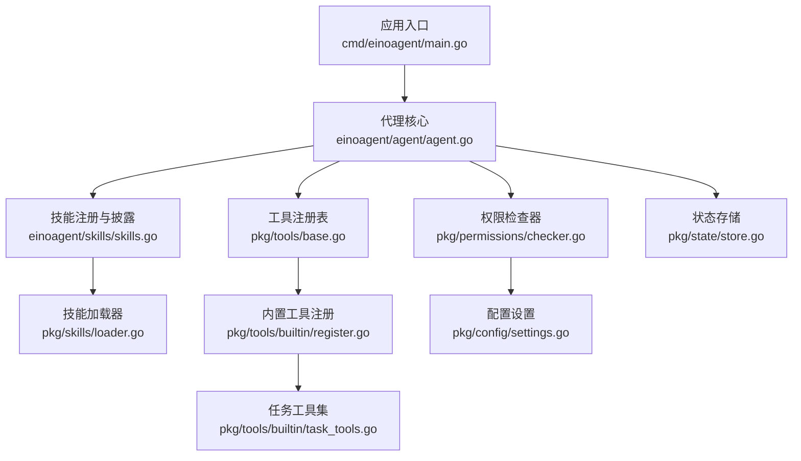
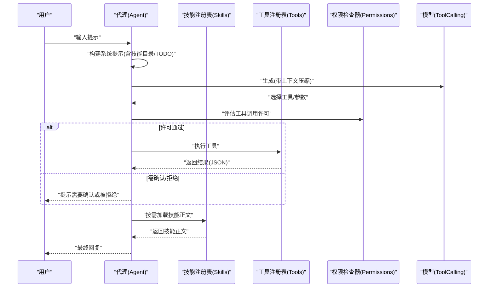
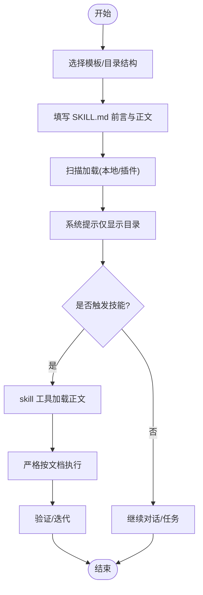
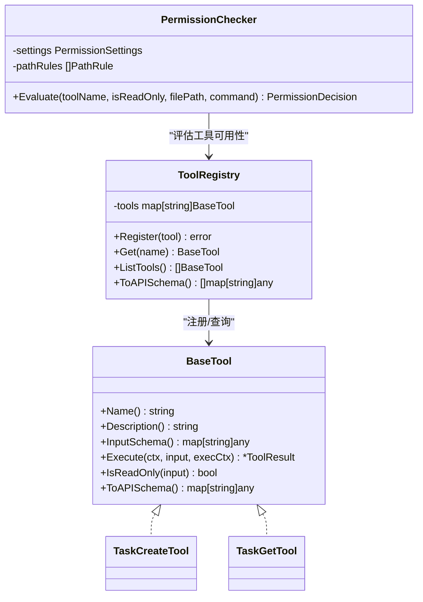
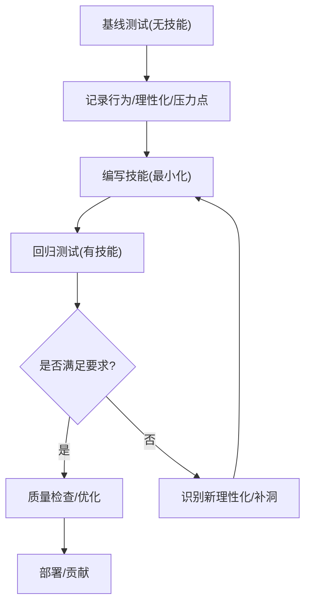
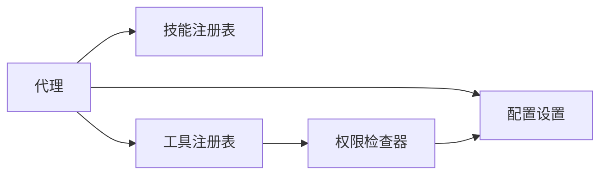

# 技能开发指南

<cite>
**本文引用的文件**
- [cmd/einoagent/main.go](file://cmd/einoagent/main.go)
- [einoagent/agent/agent.go](file://einoagent/agent/agent.go)
- [einoagent/skills/skills.go](file://einoagent/skills/skills.go)
- [pkg/skills/loader.go](file://pkg/skills/loader.go)
- [pkg/tools/base.go](file://pkg/tools/base.go)
- [pkg/tools/builtin/register.go](file://pkg/tools/builtin/register.go)
- [pkg/tools/builtin/task_tools.go](file://pkg/tools/builtin/task_tools.go)
- [pkg/permissions/checker.go](file://pkg/permissions/checker.go)
- [pkg/config/settings.go](file://pkg/config/settings.go)
- [pkg/state/store.go](file://pkg/state/store.go)
- [plugins/superpowers/skills/writing-skills/SKILL.md](file://plugins/superpowers/skills/writing-skills/SKILL.md)
- [plugins/superpowers/skills/systematic-debugging/SKILL.md](file://plugins/superpowers/skills/systematic-debugging/SKILL.md)
- [plugins/anthropic/skills/skill-creator/SKILL.md](file://plugins/anthropic/skills/skill-creator/SKILL.md)
</cite>

## 目录
1. [简介](#简介)
2. [项目结构](#项目结构)
3. [核心组件](#核心组件)
4. [架构总览](#架构总览)
5. [详细组件分析](#详细组件分析)
6. [依赖分析](#依赖分析)
7. [性能考量](#性能考量)
8. [故障排查指南](#故障排查指南)
9. [结论](#结论)
10. [附录](#附录)

## 简介
本指南面向希望在本项目中从零开始创建与优化“技能”的开发者，提供端到端的开发流程、参数设计原则、工具集成方法、状态管理最佳实践、调试与测试策略，以及性能优化与常见问题解决方案。内容以仓库现有实现为依据，结合插件中的技能编写与调试范式，帮助你在保持一致性的前提下快速构建高质量技能。

## 项目结构
本项目围绕“代理 + 技能 + 工具 + 权限 + 状态”五大维度组织：
- 应用入口与运行时：cmd/einoagent/main.go 启动代理，连接模型与上下文压缩。
- 代理与技能：einoagent/agent/agent.go 组装 ReAct 代理，注入技能目录与工具集；einoagent/skills/skills.go 提供技能渐进式披露。
- 技能加载与解析：pkg/skills/loader.go 支持本地与插件技能目录扫描与聚合。
- 工具体系：pkg/tools/base.go 定义工具抽象与注册表；pkg/tools/builtin/register.go 注册内置工具；task_tools.go 提供任务编排工具。
- 权限控制：pkg/permissions/checker.go 基于配置进行工具与路径校验。
- 配置与状态：pkg/config/settings.go 提供权限与行为配置；pkg/state/store.go 提供线程安全的状态存储与订阅。

**图表来源**
- [cmd/einoagent/main.go:1-107](file://cmd/einoagent/main.go#L1-L107)
- [einoagent/agent/agent.go:1-180](file://einoagent/agent/agent.go#L1-L180)
- [einoagent/skills/skills.go:1-181](file://einoagent/skills/skills.go#L1-L181)
- [pkg/skills/loader.go:1-198](file://pkg/skills/loader.go#L1-L198)
- [pkg/tools/base.go:1-132](file://pkg/tools/base.go#L1-L132)
- [pkg/tools/builtin/register.go:1-30](file://pkg/tools/builtin/register.go#L1-L30)
- [pkg/tools/builtin/task_tools.go:1-332](file://pkg/tools/builtin/task_tools.go#L1-L332)
- [pkg/permissions/checker.go:1-92](file://pkg/permissions/checker.go#L1-L92)
- [pkg/config/settings.go:1-212](file://pkg/config/settings.go#L1-L212)
- [pkg/state/store.go:1-102](file://pkg/state/store.go#L1-L102)

**章节来源**
- [cmd/einoagent/main.go:1-107](file://cmd/einoagent/main.go#L1-L107)
- [einoagent/agent/agent.go:1-180](file://einoagent/agent/agent.go#L1-L180)
- [einoagent/skills/skills.go:1-181](file://einoagent/skills/skills.go#L1-L181)
- [pkg/skills/loader.go:1-198](file://pkg/skills/loader.go#L1-L198)
- [pkg/tools/base.go:1-132](file://pkg/tools/base.go#L1-L132)
- [pkg/tools/builtin/register.go:1-30](file://pkg/tools/builtin/register.go#L1-L30)
- [pkg/tools/builtin/task_tools.go:1-332](file://pkg/tools/builtin/task_tools.go#L1-L332)
- [pkg/permissions/checker.go:1-92](file://pkg/permissions/checker.go#L1-L92)
- [pkg/config/settings.go:1-212](file://pkg/config/settings.go#L1-L212)
- [pkg/state/store.go:1-102](file://pkg/state/store.go#L1-L102)

## 核心组件
- 代理与会话：负责消息历史管理、上下文压缩、系统提示构造与工具调用编排。
- 技能系统：支持本地与插件技能目录扫描、渐进式披露（仅在触发时加载正文）。
- 工具体系：统一的工具抽象、注册表、只读/可变区分与 API Schema 导出。
- 权限控制：基于工具白黑名单、路径规则与命令模式的决策器。
- 配置与状态：集中化的权限与行为配置，线程安全的应用状态存储与订阅。

**章节来源**
- [einoagent/agent/agent.go:34-98](file://einoagent/agent/agent.go#L34-L98)
- [einoagent/skills/skills.go:31-106](file://einoagent/skills/skills.go#L31-L106)
- [pkg/tools/base.go:51-132](file://pkg/tools/base.go#L51-L132)
- [pkg/permissions/checker.go:23-82](file://pkg/permissions/checker.go#L23-L82)
- [pkg/config/settings.go:94-142](file://pkg/config/settings.go#L94-L142)
- [pkg/state/store.go:25-102](file://pkg/state/store.go#L25-L102)

## 架构总览
下图展示了从用户输入到工具执行与结果返回的关键路径，以及技能与权限控制的集成点。

**图表来源**
- [einoagent/agent/agent.go:100-153](file://einoagent/agent/agent.go#L100-L153)
- [einoagent/skills/skills.go:143-181](file://einoagent/skills/skills.go#L143-L181)
- [pkg/tools/base.go:81-132](file://pkg/tools/base.go#L81-L132)
- [pkg/permissions/checker.go:41-82](file://pkg/permissions/checker.go#L41-L82)

## 详细组件分析

### 从零创建新技能：流程与模板
- 选择模板与目录结构
  - 推荐参考“写作技能”与“技能创作者”等插件技能，采用“name/description/frontmatter + SKILL.md + 可选资源”的标准结构。
  - 将技能放置于本地 skills 目录或插件 skills 子目录，确保可通过扫描加载。
- 填写 SKILL.md 前言与正文
  - 前言字段：name、description 等，遵循规范长度与命名约束。
  - 正文：概述、何时使用、核心模式、快速参考、实现、常见误区等模块化组织。
- 渐进式披露
  - 系统提示仅展示技能名称与一句话描述；通过 skill 工具按需加载全文，避免上下文膨胀。
- 插件化与命名空间
  - 插件内的子技能名自动加上插件前缀，避免冲突；同时生成插件索引技能，汇总子技能列表。

**图表来源**
- [einoagent/skills/skills.go:37-106](file://einoagent/skills/skills.go#L37-L106)
- [pkg/skills/loader.go:21-124](file://pkg/skills/loader.go#L21-L124)
- [plugins/superpowers/skills/writing-skills/SKILL.md:72-137](file://plugins/superpowers/skills/writing-skills/SKILL.md#L72-L137)
- [plugins/anthropic/skills/skill-creator/SKILL.md:73-110](file://plugins/anthropic/skills/skill-creator/SKILL.md#L73-L110)

**章节来源**
- [einoagent/skills/skills.go:31-106](file://einoagent/skills/skills.go#L31-L106)
- [pkg/skills/loader.go:21-124](file://pkg/skills/loader.go#L21-L124)
- [plugins/superpowers/skills/writing-skills/SKILL.md:72-137](file://plugins/superpowers/skills/writing-skills/SKILL.md#L72-L137)
- [plugins/anthropic/skills/skill-creator/SKILL.md:73-110](file://plugins/anthropic/skills/skill-creator/SKILL.md#L73-L110)

### 技能参数设计原则
- 输入参数
  - 明确必填字段与枚举值，使用 JSON Schema 描述参数类型与约束。
  - 对于“技能正文加载”，参数为技能名；对于“任务编排”，参数包含提示与代理类型等。
- 输出格式
  - 统一返回结构，包含操作成功标志与错误信息；正文类工具返回完整文本或引用资源路径。
- 约束条件
  - 严格区分只读与可变工具；对敏感路径与命令进行规则限制。
  - 描述字段聚焦“何时触发”，避免总结流程；正文聚焦“如何做”。

**章节来源**
- [einoagent/skills/skills.go:150-181](file://einoagent/skills/skills.go#L150-L181)
- [pkg/tools/builtin/task_tools.go:24-67](file://pkg/tools/builtin/task_tools.go#L24-L67)
- [pkg/tools/base.go:51-79](file://pkg/tools/base.go#L51-L79)
- [plugins/superpowers/skills/writing-skills/SKILL.md:95-103](file://plugins/superpowers/skills/writing-skills/SKILL.md#L95-L103)

### 工具调用集成方法
- 内置工具注册
  - 通过注册函数一次性注册常用工具（如 Bash、文件读写、Grep、AskUser 等）。
- 自定义工具注册
  - 实现工具接口，提供名称、描述、输入 Schema、执行逻辑与只读标记；通过注册表注册。
- 权限控制
  - 基于配置的模式（默认/计划/全量自动）、工具白名单/黑名单、路径规则与命令模式进行决策。
  - 只读工具默认放行；非只读工具在不同模式下可能需要确认或直接拒绝。

**图表来源**
- [pkg/tools/base.go:51-132](file://pkg/tools/base.go#L51-L132)
- [pkg/tools/builtin/register.go:7-29](file://pkg/tools/builtin/register.go#L7-L29)
- [pkg/tools/builtin/task_tools.go:12-41](file://pkg/tools/builtin/task_tools.go#L12-L41)
- [pkg/permissions/checker.go:23-82](file://pkg/permissions/checker.go#L23-L82)

**章节来源**
- [pkg/tools/base.go:51-132](file://pkg/tools/base.go#L51-L132)
- [pkg/tools/builtin/register.go:7-29](file://pkg/tools/builtin/register.go#L7-L29)
- [pkg/tools/builtin/task_tools.go:12-332](file://pkg/tools/builtin/task_tools.go#L12-L332)
- [pkg/permissions/checker.go:23-82](file://pkg/permissions/checker.go#L23-L82)

### 状态管理最佳实践
- 会话状态
  - 代理内部维护消息历史与 TODO 计数，用于强制反思与任务推进。
- 应用状态
  - 提供线程安全的状态存储与订阅机制，支持更新回调与手动通知。
- 并发安全
  - 读写锁保护共享状态；发布/订阅在复制快照后触发回调，避免锁持有期间阻塞。
- 持久化
  - 状态存储本身为内存态；如需持久化，可在上层封装文件/数据库写入逻辑，并在启动时恢复。

**章节来源**
- [einoagent/agent/agent.go:34-43](file://einoagent/agent/agent.go#L34-L43)
- [einoagent/agent/agent.go:100-153](file://einoagent/agent/agent.go#L100-L153)
- [pkg/state/store.go:25-102](file://pkg/state/store.go#L25-L102)

### 调试与测试策略
- 单元测试
  - 对工具执行与权限评估进行断言，覆盖正常路径与错误路径。
- 集成测试
  - 以代理为载体，模拟完整对话流程，验证技能加载、工具调用与权限控制链路。
- 性能测试
  - 测量上下文压缩前后 token 数变化、工具执行耗时与并发下的稳定性。
- 技能验证
  - 参考“系统性调试”与“写作技能”中的 TDD 方法：先写压力场景（基线），再写技能，最后反复重构与补洞。

**图表来源**
- [plugins/superpowers/skills/systematic-debugging/SKILL.md:46-232](file://plugins/superpowers/skills/systematic-debugging/SKILL.md#L46-L232)
- [plugins/superpowers/skills/writing-skills/SKILL.md:395-561](file://plugins/superpowers/skills/writing-skills/SKILL.md#L395-L561)

**章节来源**
- [plugins/superpowers/skills/systematic-debugging/SKILL.md:46-232](file://plugins/superpowers/skills/systematic-debugging/SKILL.md#L46-L232)
- [plugins/superpowers/skills/writing-skills/SKILL.md:395-561](file://plugins/superpowers/skills/writing-skills/SKILL.md#L395-L561)

### 技能优化与性能调优
- 技能体积
  - 控制 SKILL.md 长度，必要时拆分到独立文件并通过链接引用。
- 触发准确性
  - 描述聚焦“何时触发”，关键词覆盖更广；避免总结流程。
- 工具与上下文
  - 仅在需要时加载技能正文；合理使用只读工具减少上下文与权限复杂度。
- 并发与稳定性
  - 工具执行与权限评估应尽量幂等；对易变资源增加重试与幂等键。

**章节来源**
- [plugins/superpowers/skills/writing-skills/SKILL.md:140-221](file://plugins/superpowers/skills/writing-skills/SKILL.md#L140-L221)
- [einoagent/skills/skills.go:95-106](file://einoagent/skills/skills.go#L95-L106)

### 常见问题与解决方案
- 技能未被发现
  - 检查目录结构与 frontmatter；确认扫描路径与插件前缀。
- 工具调用被拒绝
  - 核对权限模式、工具白/黑名单、路径规则与命令模式；必要时切换到全量自动或添加允许项。
- 上下文过长
  - 启用上下文压缩；减少一次性加载的技能正文；拆分长文档。
- 并发冲突
  - 使用线程安全的数据结构与锁；避免在回调中执行阻塞操作。

**章节来源**
- [pkg/skills/loader.go:21-124](file://pkg/skills/loader.go#L21-L124)
- [pkg/permissions/checker.go:41-82](file://pkg/permissions/checker.go#L41-L82)
- [pkg/state/store.go:25-102](file://pkg/state/store.go#L25-L102)

## 依赖分析
- 组件耦合
  - 代理依赖技能注册表与工具注册表；工具注册表依赖权限检查器；配置驱动权限与行为。
- 外部依赖
  - 模型调用、文件系统工具、任务编排与 MCP 服务器配置由设置文件驱动。
- 循环依赖
  - 当前结构清晰，未见循环依赖迹象。

**图表来源**
- [einoagent/agent/agent.go:66-97](file://einoagent/agent/agent.go#L66-L97)
- [pkg/tools/base.go:81-132](file://pkg/tools/base.go#L81-L132)
- [pkg/permissions/checker.go:30-39](file://pkg/permissions/checker.go#L30-L39)
- [pkg/config/settings.go:94-142](file://pkg/config/settings.go#L94-L142)

**章节来源**
- [einoagent/agent/agent.go:66-97](file://einoagent/agent/agent.go#L66-L97)
- [pkg/tools/base.go:81-132](file://pkg/tools/base.go#L81-L132)
- [pkg/permissions/checker.go:30-39](file://pkg/permissions/checker.go#L30-L39)
- [pkg/config/settings.go:94-142](file://pkg/config/settings.go#L94-L142)

## 性能考量
- 上下文压缩：在每轮模型调用前进行上下文压缩，减少 token 使用。
- 渐进式披露：仅在触发时加载技能正文，降低初始上下文。
- 工具只读优先：优先使用只读工具，减少权限与副作用开销。
- 并发与锁：使用读写锁与回调快照，避免长时间持锁。

**章节来源**
- [einoagent/agent/agent.go:107-130](file://einoagent/agent/agent.go#L107-L130)
- [einoagent/skills/skills.go:95-106](file://einoagent/skills/skills.go#L95-L106)
- [pkg/state/store.go:25-102](file://pkg/state/store.go#L25-L102)

## 故障排查指南
- 启动失败
  - 检查环境变量与模型配置；确认技能目录存在且可读。
- 技能加载异常
  - 核对 frontmatter 与文件编码；查看扫描日志与错误输出。
- 工具执行错误
  - 检查输入参数 JSON 结构；确认工具注册与权限评估结果。
- 权限相关问题
  - 检查权限模式与规则；必要时临时切换到全量自动定位问题。

**章节来源**
- [cmd/einoagent/main.go:25-63](file://cmd/einoagent/main.go#L25-L63)
- [pkg/skills/loader.go:21-60](file://pkg/skills/loader.go#L21-L60)
- [pkg/permissions/checker.go:41-82](file://pkg/permissions/checker.go#L41-L82)

## 结论
通过遵循渐进式披露、参数规范化、权限与状态管理最佳实践，以及以 TDD 方式进行技能验证与优化，可以在本项目中高效地创建高质量技能。建议在开发过程中持续关注上下文大小、触发准确性与工具执行效率，并结合插件中的范式进行迭代完善。

## 附录
- 示例与模板
  - 技能模板与结构参考：[writing-skills/SKILL.md:72-137](file://plugins/superpowers/skills/writing-skills/SKILL.md#L72-L137)
  - 技能创作流程参考：[skill-creator/SKILL.md:62-161](file://plugins/anthropic/skills/skill-creator/SKILL.md#L62-L161)
  - 系统性调试流程参考：[systematic-debugging/SKILL.md:46-232](file://plugins/superpowers/skills/systematic-debugging/SKILL.md#L46-L232)
- 关键实现参考
  - 代理与技能：[agent.go:100-153](file://einoagent/agent/agent.go#L100-L153)、[skills.go:143-181](file://einoagent/skills/skills.go#L143-L181)
  - 工具与注册：[base.go:51-132](file://pkg/tools/base.go#L51-132)、[register.go:7-29](file://pkg/tools/builtin/register.go#L7-29)、[task_tools.go:12-332](file://pkg/tools/builtin/task_tools.go#L12-332)
  - 权限与配置：[checker.go:23-82](file://pkg/permissions/checker.go#L23-82)、[settings.go:94-142](file://pkg/config/settings.go#L94-142)
  - 状态存储：[store.go:25-102](file://pkg/state/store.go#L25-102)