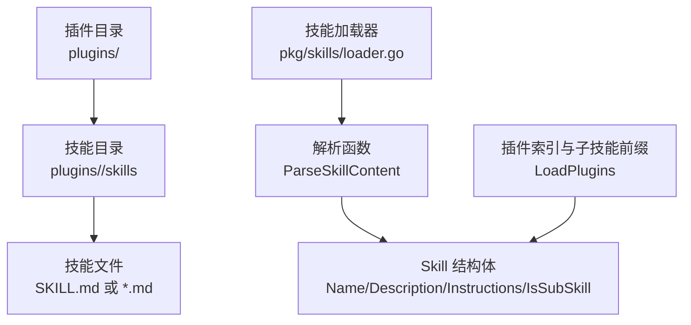
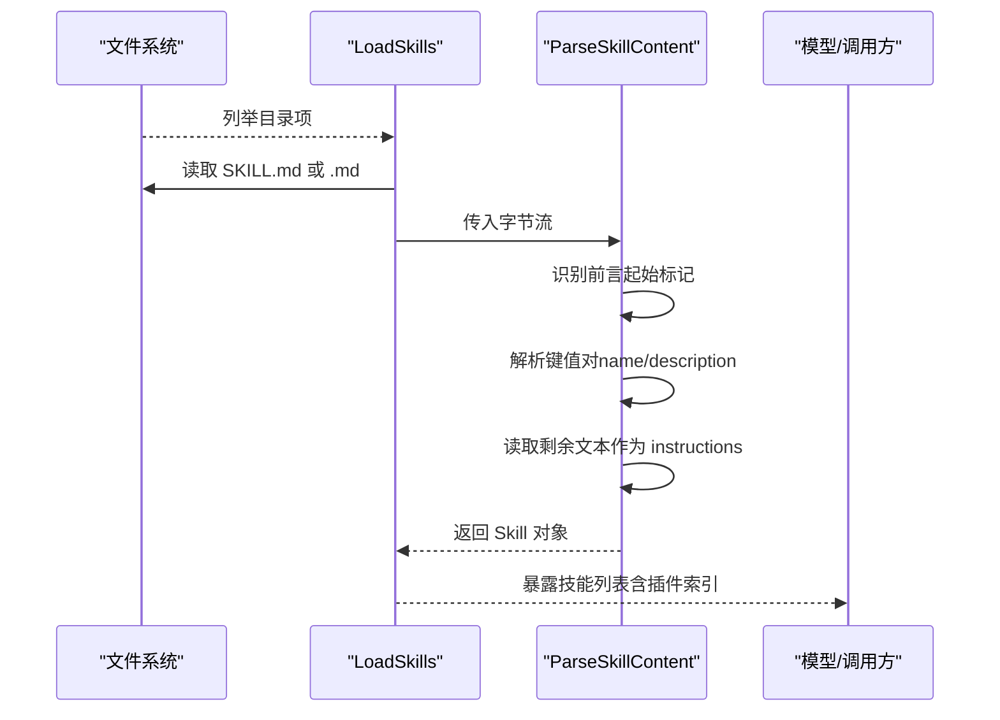
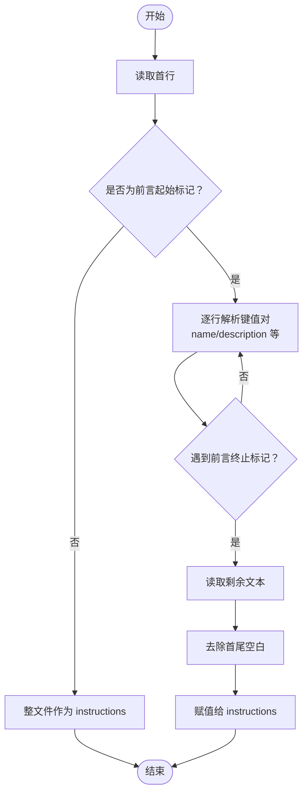
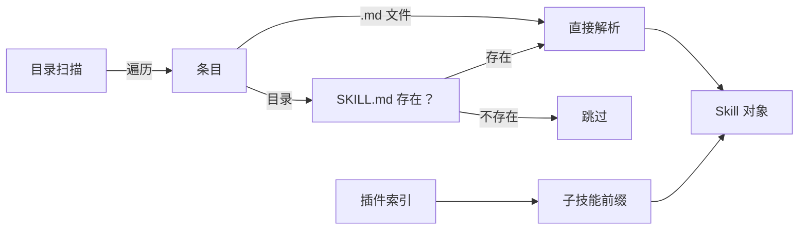

# 技能文件格式

<cite>
**本文引用的文件**
- [README.md](file://README.md)
- [loader.go](file://pkg/skills/loader.go)
- [loader_test.go](file://pkg/skills/loader_test.go)
- [SKILL.md（Anthropic：代码审查）](file://plugins/anthropic/skills/code-review/SKILL.md)
- [SKILL.md（Anthropic：代码简化器）](file://plugins/anthropic/skills/code-simplifier/SKILL.md)
- [SKILL.md（Karpathy：指南）](file://plugins/karpathy/skills/SKILL.md)
- [SKILL.md（Superpowers：头脑风暴）](file://plugins/superpowers/skills/brainstorming/SKILL.md)
- [SKILL.md（Superpowers：写作技能）](file://plugins/superpowers/skills/writing-skills/SKILL.md)
- [SKILL.md（Superpowers：测试驱动开发）](file://plugins/superpowers/skills/test-driven-development/SKILL.md)
- [SKILL.md（Anthropic：前端设计）](file://plugins/anthropic/skills/frontend-design/SKILL.md)
- [SKILL.md（Anthropic：MCP 构建器）](file://plugins/anthropic/skills/mcp-builder/SKILL.md)
</cite>

## 目录
1. [简介](#简介)
2. [项目结构](#项目结构)
3. [核心组件](#核心组件)
4. [架构总览](#架构总览)
5. [详细组件分析](#详细组件分析)
6. [依赖关系分析](#依赖关系分析)
7. [性能考量](#性能考量)
8. [故障排除指南](#故障排除指南)
9. [结论](#结论)
10. [附录](#附录)

## 简介
本文件面向“技能文件格式”的技术规范，聚焦于 SKILL.md 文件的结构与解析流程。SKILL.md 是一种以 Markdown 为载体、采用 YAML 风格前言（frontmatter）的技能定义文件，用于描述 AI Agent 的可渐进披露技能（Progressive Disclosure Skills）。该规范覆盖：
- 前言部分的语法与字段定义
- name、description 字段的职责、命名约定与最佳实践
- instructions 部分的格式要求与处理流程
- 文件解析流程（前言识别、字段提取、指令文本处理）
- 不同类型技能文件的示例与差异（简单技能、复杂技能、插件技能）
- 编码、换行符与特殊字符处理注意事项
- 文件验证与错误处理建议

## 项目结构
本仓库通过插件与技能目录组织 SKILL.md 文件，系统在运行时扫描这些文件并解析为内部 Skill 对象，供模型按需加载。

图表来源
- [loader.go:21-124](file://pkg/skills/loader.go#L21-L124)
- [loader.go:126-197](file://pkg/skills/loader.go#L126-L197)

章节来源
- [README.md:74-101](file://README.md#L74-L101)
- [loader.go:21-124](file://pkg/skills/loader.go#L21-L124)

## 核心组件
- Skill 结构体：承载解析后的技能元数据与指令内容
- ParseSkillContent：负责识别前言、提取字段、拼接指令文本
- LoadSkills：扫描目录，发现 SKILL.md 或 .md 技能文件
- LoadPlugins：构建插件索引与子技能前缀，生成虚拟插件技能

章节来源
- [loader.go:13-19](file://pkg/skills/loader.go#L13-L19)
- [loader.go:126-197](file://pkg/skills/loader.go#L126-L197)
- [loader.go:21-124](file://pkg/skills/loader.go#L21-L124)

## 架构总览
技能文件解析的整体流程如下：

图表来源
- [loader.go:21-124](file://pkg/skills/loader.go#L21-L124)
- [loader.go:126-197](file://pkg/skills/loader.go#L126-L197)

## 详细组件分析

### 前言部分（YAML 风格）与字段定义
- 起始标记：必须以三连字符开头，作为前言起始标识
- 终止标记：遇到下一个三连字符即结束前言
- 字段提取：逐行解析冒号分隔的键值对，去除首尾空白与外侧引号
- 可识别字段：
  - name：技能名称，用于索引与显示
  - description：技能描述，用于触发条件与检索
  - 其他字段：如 license 等，解析器会跳过未显式处理的字段
- 无前言：若文件不以三连字符开头，则整份文件视为 instructions

章节来源
- [loader.go:141-179](file://pkg/skills/loader.go#L141-L179)
- [loader.go:181-196](file://pkg/skills/loader.go#L181-L196)

### name 字段
- 作用：唯一标识技能，用于索引与显示
- 命名约定：
  - 使用字母、数字与短横线
  - 不包含括号与特殊字符
  - 插件子技能通常以“插件名:技能名”形式组合，避免冲突
- 示例参考：
  - 简单技能：code-review、code-simplifier、karpathy-guidelines
  - 插件技能：anthropic:code-review、superpowers:test-driven-development

章节来源
- [SKILL.md（Anthropic：代码审查）:1-5](file://plugins/anthropic/skills/code-review/SKILL.md#L1-L5)
- [SKILL.md（Anthropic：代码简化器）:1-5](file://plugins/anthropic/skills/code-simplifier/SKILL.md#L1-L5)
- [SKILL.md（Karpathy：指南）:1-5](file://plugins/karpathy/skills/SKILL.md#L1-L5)
- [SKILL.md（Superpowers：写作技能）:95-109](file://plugins/superpowers/skills/writing-skills/SKILL.md#L95-L109)
- [loader.go:100-110](file://pkg/skills/loader.go#L100-L110)

### description 字段
- 作用：描述何时使用该技能，帮助模型决定是否加载
- 命名约定与最佳实践：
  - 使用“Use when...”开头，聚焦触发条件
  - 第三人称描述，仅描述触发情境，不总结技能流程
  - 避免在描述中直接陈述技能过程或工作流
  - 保持简洁，尽量少于 500 字符
- 示例参考：
  - code-review：描述 PR 审查场景
  - code-simplifier：强调简化与一致性
  - karpathy-guidelines：行为准则与常见陷阱
  - Superpowers：写作技能与 TDD 的规范

章节来源
- [SKILL.md（Anthropic：代码审查）:1-5](file://plugins/anthropic/skills/code-review/SKILL.md#L1-L5)
- [SKILL.md（Anthropic：代码简化器）:1-5](file://plugins/anthropic/skills/code-simplifier/SKILL.md#L1-L5)
- [SKILL.md（Karpathy：指南）:1-5](file://plugins/karpathy/skills/SKILL.md#L1-L5)
- [SKILL.md（Superpowers：写作技能）:95-109](file://plugins/superpowers/skills/writing-skills/SKILL.md#L95-L109)
- [SKILL.md（Superpowers：写作技能）:140-197](file://plugins/superpowers/skills/writing-skills/SKILL.md#L140-L197)

### instructions 部分
- 作用：技能的正文内容，包含概述、使用场景、实现细节、流程图、示例等
- 处理方式：解析器读取前言终止后剩余文本，去除首尾空白，作为 instructions
- 格式要求：
  - 可包含标题、列表、代码块、Mermaid 图等 Markdown 元素
  - 复杂技能可包含流程图与参考文件
  - 插件子技能会在 instructions 前添加小标题头，提示其来自插件
- 示例参考：
  - 复杂技能：code-review、mcp-builder、brainstorming
  - 简单技能：code-simplifier、karpathy-guidelines
  - 插件技能：anthropic:code-review、superpowers:test-driven-development

章节来源
- [loader.go:181-196](file://pkg/skills/loader.go#L181-L196)
- [SKILL.md（Anthropic：代码审查）:6-94](file://plugins/anthropic/skills/code-review/SKILL.md#L6-L94)
- [SKILL.md（Anthropic：MCP 构建器）:1-237](file://plugins/anthropic/skills/mcp-builder/SKILL.md#L1-L237)
- [SKILL.md（Superpowers：头脑风暴）:1-165](file://plugins/superpowers/skills/brainstorming/SKILL.md#L1-L165)
- [loader.go:107-110](file://pkg/skills/loader.go#L107-L110)

### 文件解析流程（代码级）

图表来源
- [loader.go:126-197](file://pkg/skills/loader.go#L126-L197)

章节来源
- [loader.go:126-197](file://pkg/skills/loader.go#L126-L197)

### 不同类型技能文件的示例与差异
- 简单技能（Simple Skill）
  - 特点：字段集中、内容相对简洁
  - 示例：code-simplifier、karpathy-guidelines
  - 适用场景：明确的行为准则或单一方法论
- 复杂技能（Complex Skill）
  - 特点：包含流程图、步骤清单、参考文件、多阶段流程
  - 示例：code-review、mcp-builder、brainstorming
  - 适用场景：需要多步骤协作或跨工具集成的任务
- 插件技能（Plugin Skill）
  - 特点：通过插件索引统一暴露；子技能名带前缀；instructions 前有小标题头
  - 示例：anthropic:code-review、superpowers:test-driven-development
  - 适用场景：大规模技能集合的懒加载与命名空间隔离

章节来源
- [SKILL.md（Anthropic：代码简化器）:1-53](file://plugins/anthropic/skills/code-simplifier/SKILL.md#L1-L53)
- [SKILL.md（Karpathy：指南）:1-68](file://plugins/karpathy/skills/SKILL.md#L1-L68)
- [SKILL.md（Anthropic：代码审查）:1-94](file://plugins/anthropic/skills/code-review/SKILL.md#L1-L94)
- [SKILL.md（Anthropic：MCP 构建器）:1-237](file://plugins/anthropic/skills/mcp-builder/SKILL.md#L1-L237)
- [SKILL.md（Superpowers：头脑风暴）:1-165](file://plugins/superpowers/skills/brainstorming/SKILL.md#L1-L165)
- [loader.go:93-121](file://pkg/skills/loader.go#L93-L121)
- [loader.go:107-110](file://pkg/skills/loader.go#L107-L110)

### 编码、换行符与特殊字符处理
- 编码：解析器以字节流读取文件，建议使用 UTF-8 编码，确保非 ASCII 字符正确显示
- 换行符：解析器按行读取，支持 LF（Unix）与 CRLF（Windows）；最终 instructions 保留原始换行
- 特殊字符：
  - 前言键值对中的冒号与空格会被解析器处理
  - 引号会被去除（单引号与双引号）
  - 未识别字段会被忽略，不会影响解析结果
- 建议：
  - 在前言中使用英文冒号与空格分隔键值
  - 若值包含冒号或特殊字符，建议使用引号包裹（解析器会去除外侧引号）

章节来源
- [loader.go:167-171](file://pkg/skills/loader.go#L167-L171)
- [loader.go:171](file://pkg/skills/loader.go#L171)

### 文件验证与错误处理
- 加载器行为：
  - 目录不存在：返回空列表（不报错）
  - 子目录无 SKILL.md：跳过该目录
  - 解析失败：跳过该文件（不中断整体加载）
  - 名称为空：跳过该技能（不加入结果）
- 建议的验证清单：
  - 前言起止标记正确
  - name 与 description 存在且符合命名约定
  - instructions 非空（至少包含概述或流程）
  - 插件子技能前缀与父插件名一致
- 单元测试参考：
  - 验证前言解析与 instructions 拼接
  - 验证目录扫描与子目录 SKILL.md 发现

章节来源
- [loader.go:26-60](file://pkg/skills/loader.go#L26-L60)
- [loader.go:49-57](file://pkg/skills/loader.go#L49-L57)
- [loader_test.go:9-35](file://pkg/skills/loader_test.go#L9-L35)
- [loader_test.go:37-70](file://pkg/skills/loader_test.go#L37-L70)

## 依赖关系分析
- 目录扫描依赖 OS 文件系统 API
- 解析依赖 bufio/bytes 流式读取与字符串处理
- 插件索引依赖字符串拼接与前缀规范化

图表来源
- [loader.go:21-124](file://pkg/skills/loader.go#L21-L124)
- [loader.go:126-197](file://pkg/skills/loader.go#L126-L197)

章节来源
- [loader.go:21-124](file://pkg/skills/loader.go#L21-L124)
- [loader.go:126-197](file://pkg/skills/loader.go#L126-L197)

## 性能考量
- 懒加载：通过插件索引与按需加载，避免一次性加载大量技能造成上下文膨胀
- I/O：按行读取，内存占用低；建议将大型参考文件拆分为独立文件，减少 SKILL.md 体积
- 命名与描述：简洁的 name 与高质量 description 有助于模型快速筛选，减少不必要的加载

## 故障排除指南
- 现象：技能未出现在可用列表
  - 排查：目录是否存在、是否有 SKILL.md、name 是否为空
  - 参考：加载器对空 name 的过滤逻辑
- 现象：解析报错或技能缺失
  - 排查：前言起止标记是否正确、文件编码是否为 UTF-8
  - 参考：解析器对 EOF 的处理与错误返回
- 现象：插件子技能名称异常
  - 排查：插件名与子技能名拼接是否一致、是否被重复前缀
  - 参考：插件索引与前缀生成逻辑

章节来源
- [loader.go:26-60](file://pkg/skills/loader.go#L26-L60)
- [loader.go:141-155](file://pkg/skills/loader.go#L141-L155)
- [loader.go:93-121](file://pkg/skills/loader.go#L93-L121)

## 结论
SKILL.md 以简洁的 YAML 风格前言与丰富的 Markdown 正文，为 AI Agent 提供了可渐进披露的技能定义格式。遵循本文档的字段规范、命名约定与解析流程，可以确保技能文件在系统中稳定加载与高效使用。对于复杂技能，建议配合流程图与参考文件，提升可读性与可维护性；对于插件技能，务必使用统一的前缀与清晰的描述，以便模型准确选择与加载。

## 附录

### 字段定义一览
- name：技能名称（必填，字母、数字、短横线）
- description：触发条件描述（必填，Use when 开头，第三人称）
- 其他字段：如 license 等（可选，解析器会跳过未显式处理的字段）

章节来源
- [SKILL.md（Anthropic：代码审查）:1-5](file://plugins/anthropic/skills/code-review/SKILL.md#L1-L5)
- [SKILL.md（Anthropic：代码简化器）:1-5](file://plugins/anthropic/skills/code-simplifier/SKILL.md#L1-L5)
- [SKILL.md（Karpathy：指南）:1-5](file://plugins/karpathy/skills/SKILL.md#L1-L5)
- [SKILL.md（Superpowers：写作技能）:95-109](file://plugins/superpowers/skills/writing-skills/SKILL.md#L95-L109)
- [loader.go:167-177](file://pkg/skills/loader.go#L167-L177)

### 示例文件路径
- 简单技能
  - [plugins/anthropic/skills/code-simplifier/SKILL.md](file://plugins/anthropic/skills/code-simplifier/SKILL.md)
  - [plugins/karpathy/skills/SKILL.md](file://plugins/karpathy/skills/SKILL.md)
- 复杂技能
  - [plugins/anthropic/skills/code-review/SKILL.md](file://plugins/anthropic/skills/code-review/SKILL.md)
  - [plugins/anthropic/skills/mcp-builder/SKILL.md](file://plugins/anthropic/skills/mcp-builder/SKILL.md)
  - [plugins/superpowers/skills/brainstorming/SKILL.md](file://plugins/superpowers/skills/brainstorming/SKILL.md)
- 插件技能
  - [plugins/anthropic/skills/code-review/SKILL.md](file://plugins/anthropic/skills/code-review/SKILL.md)
  - [plugins/superpowers/skills/test-driven-development/SKILL.md](file://plugins/superpowers/skills/test-driven-development/SKILL.md)