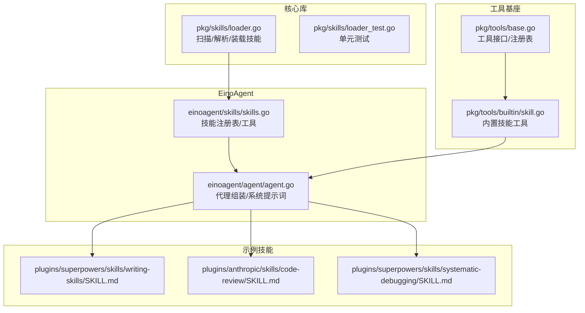
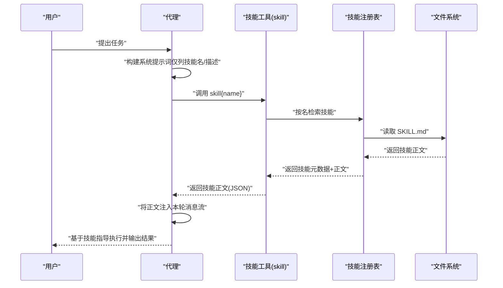
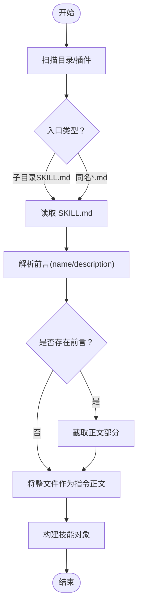
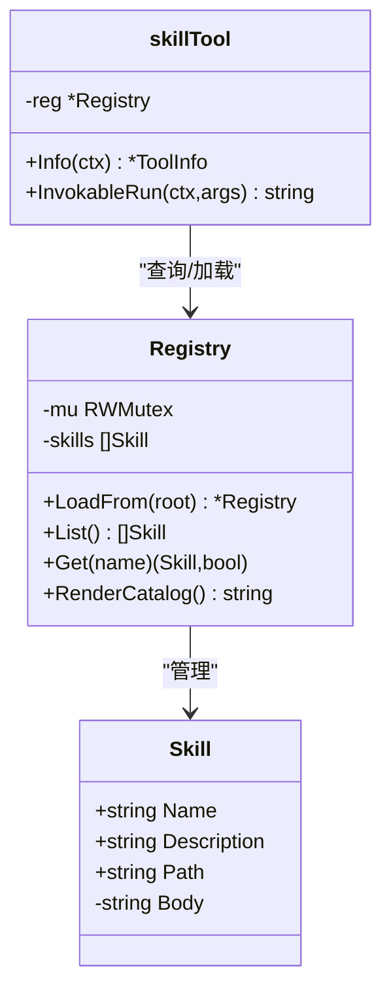
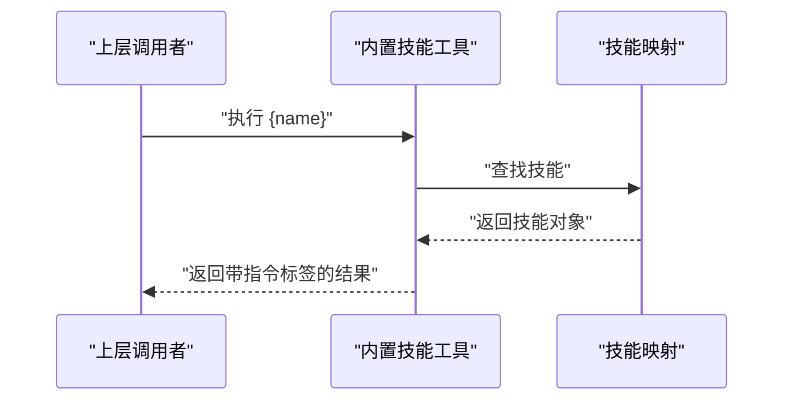
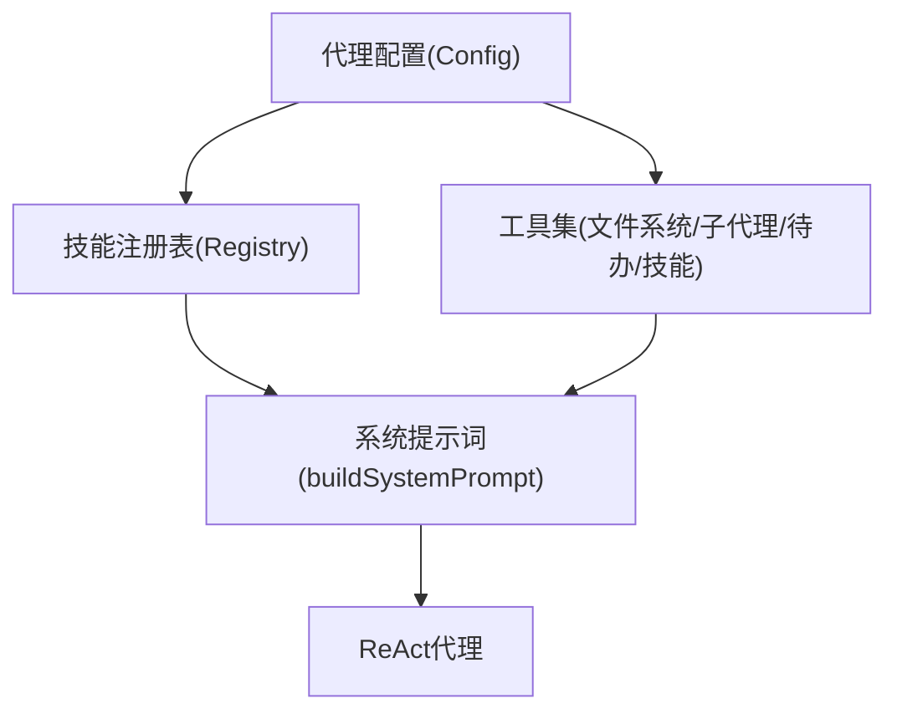
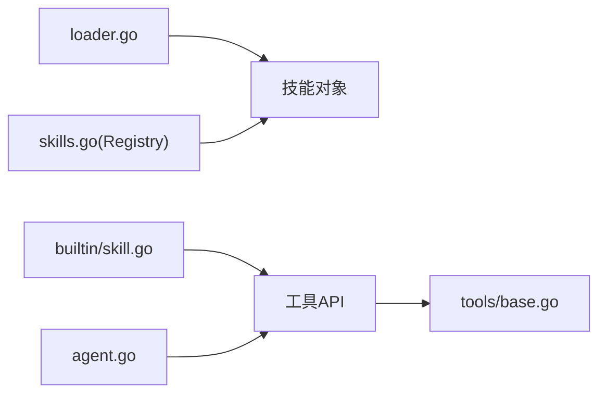

# 技能概念与设计

<cite>
**本文引用的文件**
- [pkg/skills/loader.go](file://pkg/skills/loader.go)
- [pkg/skills/loader_test.go](file://pkg/skills/loader_test.go)
- [einoagent/skills/skills.go](file://einoagent/skills/skills.go)
- [pkg/tools/builtin/skill.go](file://pkg/tools/builtin/skill.go)
- [einoagent/agent/agent.go](file://einoagent/agent/agent.go)
- [pkg/tools/base.go](file://pkg/tools/base.go)
- [plugins/superpowers/skills/writing-skills/SKILL.md](file://plugins/superpowers/skills/writing-skills/SKILL.md)
- [plugins/anthropic/skills/code-review/SKILL.md](file://plugins/anthropic/skills/code-review/SKILL.md)
- [plugins/superpowers/skills/systematic-debugging/SKILL.md](file://plugins/superpowers/skills/systematic-debugging/SKILL.md)
- [design/eino.md](file://design/eino.md)
</cite>

## 目录
1. [引言](#引言)
2. [项目结构](#项目结构)
3. [核心组件](#核心组件)
4. [架构总览](#架构总览)
5. [详细组件分析](#详细组件分析)
6. [依赖关系分析](#依赖关系分析)
7. [性能考量](#性能考量)
8. [故障排查指南](#故障排查指南)
9. [结论](#结论)
10. [附录](#附录)

## 引言
本文件围绕“技能”这一核心概念，系统阐述其在本项目中的设计思想、渐进式披露机制、与传统编程方法的区别，以及技能系统的架构设计（生命周期、状态管理、执行流程）。我们将从技能的自然语言描述如何引导AI代理行为入手，解释YAML前言部分的元数据定义与解析，再到指令文本的解析与执行，最后总结最佳实践与设计模式，帮助开发者高效构建高质量技能。

## 项目结构
本项目的技能体系由两套实现并行存在：
- 核心库实现（pkg/skills）：负责扫描、解析、装载技能文件，支持插件集合的虚拟索引与子技能前缀化。
- EinoAgent实现（einoagent/skills）：提供可调用工具形式的“技能工具”，在系统提示词中仅展示技能名与简述，按需加载全文，实现上下文的渐进式披露。

此外，工具基座（pkg/tools）定义了统一的工具接口与注册表，代理（einoagent/agent）将技能工具与文件系统工具、子代理、待办反思等能力组合为ReAct代理。

图表来源
- [pkg/skills/loader.go:1-198](file://pkg/skills/loader.go#L1-L198)
- [einoagent/skills/skills.go:1-181](file://einoagent/skills/skills.go#L1-L181)
- [einoagent/agent/agent.go:1-180](file://einoagent/agent/agent.go#L1-L180)
- [pkg/tools/base.go:1-132](file://pkg/tools/base.go#L1-L132)
- [pkg/tools/builtin/skill.go:1-73](file://pkg/tools/builtin/skill.go#L1-L73)
- [plugins/superpowers/skills/writing-skills/SKILL.md:1-656](file://plugins/superpowers/skills/writing-skills/SKILL.md#L1-L656)
- [plugins/anthropic/skills/code-review/SKILL.md:1-94](file://plugins/anthropic/skills/code-review/SKILL.md#L1-L94)
- [plugins/superpowers/skills/systematic-debugging/SKILL.md:1-297](file://plugins/superpowers/skills/systematic-debugging/SKILL.md#L1-L297)

章节来源
- [pkg/skills/loader.go:1-198](file://pkg/skills/loader.go#L1-L198)
- [einoagent/skills/skills.go:1-181](file://einoagent/skills/skills.go#L1-L181)
- [einoagent/agent/agent.go:1-180](file://einoagent/agent/agent.go#L1-L180)
- [pkg/tools/base.go:1-132](file://pkg/tools/base.go#L1-L132)
- [pkg/tools/builtin/skill.go:1-73](file://pkg/tools/builtin/skill.go#L1-L73)

## 核心组件
- 技能解析器与装载器：扫描目录中的技能文件（支持SKILL.md与同名.md两种形式），解析YAML风格前言元数据，提取name、description与指令正文，支持插件集合的虚拟索引与子技能命名空间前缀化。
- 技能注册表与工具：在EinoAgent侧提供可调用的“skill”工具，系统提示词仅列出技能名与简述，调用后才加载全文，避免上下文膨胀。
- 工具基座：定义工具接口、只读标记、注册表与API Schema导出，内置技能工具复用该基座。
- 代理装配：将文件系统工具、子代理、待办反思与技能工具整合为ReAct代理，每轮生成前进行上下文压缩与系统提示词动态构建。

章节来源
- [pkg/skills/loader.go:21-124](file://pkg/skills/loader.go#L21-L124)
- [einoagent/skills/skills.go:31-106](file://einoagent/skills/skills.go#L31-L106)
- [pkg/tools/base.go:51-132](file://pkg/tools/base.go#L51-L132)
- [pkg/tools/builtin/skill.go:21-72](file://pkg/tools/builtin/skill.go#L21-L72)
- [einoagent/agent/agent.go:34-98](file://einoagent/agent/agent.go#L34-L98)

## 架构总览
技能系统采用“渐进式披露”的核心理念：系统提示词仅列出可用技能的名称与一句话描述；当代理需要具体操作指导时，通过“skill”工具按需加载技能全文。该机制显著降低初始上下文负担，提升长对话与复杂任务场景下的稳定性与效率。

图表来源
- [einoagent/skills/skills.go:143-180](file://einoagent/skills/skills.go#L143-L180)
- [einoagent/agent/agent.go:158-179](file://einoagent/agent/agent.go#L158-L179)
- [pkg/skills/loader.go:127-197](file://pkg/skills/loader.go#L127-L197)

## 详细组件分析

### 组件A：技能解析与装载（核心库）
- 扫描策略：支持两类入口
  - 子目录中的SKILL.md
  - 同级目录下的*.md（文件名即技能名）
- 插件集合：遍历plugins目录，为每个插件的skills子目录生成“虚拟索引技能”，并对子技能名加前缀以避免冲突，同时为子技能注入头部说明，表明其来自某插件。
- 前言解析：识别“---”起止的YAML风格前言，提取name与description；若无前言，则将整文件视为指令正文。
- 结果对象：返回包含名称、描述、指令正文的技能对象列表。

图表来源
- [pkg/skills/loader.go:21-124](file://pkg/skills/loader.go#L21-L124)
- [pkg/skills/loader.go:127-197](file://pkg/skills/loader.go#L127-L197)

章节来源
- [pkg/skills/loader.go:21-124](file://pkg/skills/loader.go#L21-L124)
- [pkg/skills/loader.go:127-197](file://pkg/skills/loader.go#L127-L197)
- [pkg/skills/loader_test.go:9-70](file://pkg/skills/loader_test.go#L9-L70)

### 组件B：技能注册表与“skill”工具（EinoAgent）
- 注册表：按目录扫描SKILL.md，解析首行标题与第二行描述作为默认元数据，缓存全文以便按需加载。
- 渲染目录：将技能名与描述渲染为系统提示词中的“可用技能”列表，避免加载正文。
- “skill”工具：接收name参数，返回技能的名称、描述与正文，确保代理严格按技能步骤执行。

图表来源
- [einoagent/skills/skills.go:23-106](file://einoagent/skills/skills.go#L23-L106)
- [einoagent/skills/skills.go:143-180](file://einoagent/skills/skills.go#L143-L180)

章节来源
- [einoagent/skills/skills.go:23-106](file://einoagent/skills/skills.go#L23-L106)
- [einoagent/skills/skills.go:143-180](file://einoagent/skills/skills.go#L143-L180)

### 组件C：内置技能工具（pkg/tools/builtin）
- 内置技能工具：将已加载的技能映射为只读工具，输入为技能名，输出为带指令标签的消息，确保代理在调用后严格遵循技能步骤。
- 与工具基座集成：复用BaseToolHelper与工具注册表，统一Schema与API导出。

图表来源
- [pkg/tools/builtin/skill.go:21-72](file://pkg/tools/builtin/skill.go#L21-L72)
- [pkg/tools/base.go:51-79](file://pkg/tools/base.go#L51-L79)

章节来源
- [pkg/tools/builtin/skill.go:21-72](file://pkg/tools/builtin/skill.go#L21-L72)
- [pkg/tools/base.go:51-79](file://pkg/tools/base.go#L51-L79)

### 组件D：代理装配与系统提示词
- 代理配置：包含聊天模型、工作目录、技能根目录、最大步数、反射周期与上下文压缩配置。
- 工具注册：注册文件系统工具、子代理工具、待办工具与技能工具。
- 系统提示词：固定工作准则、当前工作目录、可用技能目录（仅名与描述）、当前待办列表；每N轮工具调用强制反思，避免陷入死循环。

图表来源
- [einoagent/agent/agent.go:24-98](file://einoagent/agent/agent.go#L24-L98)
- [einoagent/agent/agent.go:158-179](file://einoagent/agent/agent.go#L158-L179)

章节来源
- [einoagent/agent/agent.go:24-98](file://einoagent/agent/agent.go#L24-L98)
- [einoagent/agent/agent.go:158-179](file://einoagent/agent/agent.go#L158-L179)

### 组件E：技能与传统编程方法的区别
- 自然语言描述驱动：技能通过自然语言描述触发条件与使用场景，而非硬编码函数签名；代理根据描述选择合适技能，再按技能正文执行。
- 渐进式披露：系统提示词仅列出技能名与描述，避免一次性加载大量上下文；按需加载正文，显著降低token消耗与上下文污染风险。
- 可演进性：技能以文档形式存在，易于迭代与版本化；通过压力测试与子代理验证，持续优化触发条件与执行流程。

章节来源
- [einoagent/skills/skills.go:95-106](file://einoagent/skills/skills.go#L95-L106)
- [plugins/superpowers/skills/writing-skills/SKILL.md:140-221](file://plugins/superpowers/skills/writing-skills/SKILL.md#L140-L221)

## 依赖关系分析
- 技能解析器依赖文件系统读写与字符串处理，输出标准化技能对象。
- 技能注册表依赖解析器结果，提供按名检索与目录渲染能力。
- 内置技能工具依赖技能映射，输出标准化结果。
- 代理依赖工具注册表与系统提示词构建器，串联上下文压缩与ReAct流程。

图表来源
- [pkg/skills/loader.go:1-198](file://pkg/skills/loader.go#L1-L198)
- [einoagent/skills/skills.go:1-181](file://einoagent/skills/skills.go#L1-L181)
- [pkg/tools/builtin/skill.go:1-73](file://pkg/tools/builtin/skill.go#L1-L73)
- [pkg/tools/base.go:1-132](file://pkg/tools/base.go#L1-L132)
- [einoagent/agent/agent.go:1-180](file://einoagent/agent/agent.go#L1-L180)

章节来源
- [pkg/skills/loader.go:1-198](file://pkg/skills/loader.go#L1-L198)
- [einoagent/skills/skills.go:1-181](file://einoagent/skills/skills.go#L1-L181)
- [pkg/tools/builtin/skill.go:1-73](file://pkg/tools/builtin/skill.go#L1-L73)
- [pkg/tools/base.go:1-132](file://pkg/tools/base.go#L1-L132)
- [einoagent/agent/agent.go:1-180](file://einoagent/agent/agent.go#L1-L180)

## 性能考量
- 渐进式披露：仅在代理真正需要时加载技能正文，显著减少初始上下文与token消耗。
- 插件集合前缀化：避免技能名冲突，减少误选概率，间接提升执行效率。
- 上下文压缩：每轮生成前进行上下文压缩，保留关键历史与系统提示词，降低长对话成本。
- 工具调用反思：定期强制反思，避免无效循环与重复调用，提高整体稳定性。

章节来源
- [einoagent/skills/skills.go:95-106](file://einoagent/skills/skills.go#L95-L106)
- [einoagent/agent/agent.go:107-130](file://einoagent/agent/agent.go#L107-L130)
- [plugins/superpowers/skills/writing-skills/SKILL.md:213-267](file://plugins/superpowers/skills/writing-skills/SKILL.md#L213-L267)

## 故障排查指南
- 技能未显示在可用列表
  - 检查技能文件是否位于正确路径（SKILL.md或同名.md），且包含有效前言。
  - 确认插件集合的虚拟索引是否生成，子技能名是否带有插件前缀。
- 调用“skill”工具失败
  - 确认传入的name是否与技能名一致（大小写敏感）。
  - 检查技能文件是否可读且包含正文。
- 上下文过大导致性能下降
  - 启用上下文压缩配置，减少非必要历史消息。
  - 将长文档拆分为多个技能或链接到外部文件，保持正文简洁。
- 触发条件不准确
  - 优化技能描述字段，聚焦触发条件而非过程概述，参考“搜索优化(CSO)”原则。

章节来源
- [pkg/skills/loader.go:21-124](file://pkg/skills/loader.go#L21-L124)
- [einoagent/skills/skills.go:160-180](file://einoagent/skills/skills.go#L160-L180)
- [plugins/superpowers/skills/writing-skills/SKILL.md:140-221](file://plugins/superpowers/skills/writing-skills/SKILL.md#L140-L221)

## 结论
技能系统通过“渐进式披露”与“自然语言触发”的设计，实现了对AI代理行为的可控引导与高效执行。结合插件集合、前言元数据、按需加载与压力测试验证，技能具备良好的可维护性与可演进性。建议在实际开发中遵循CSO原则、最小正文与清晰触发条件，持续以子代理与压力场景验证技能质量。

## 附录

### 技能生命周期与状态管理
- 生命周期阶段
  - 发现与装载：扫描目录/插件，解析前言与正文，构建技能对象。
  - 注册与渲染：注册表缓存技能，系统提示词仅渲染目录（名+描述）。
  - 调用与加载：代理调用“skill”工具，按需加载正文并注入消息流。
  - 执行与反馈：代理严格遵循技能步骤，输出结果并记录历史。
- 状态管理
  - 注册表内部使用读写锁保护并发访问。
  - 待办列表随工具调用轮次递增，定期强制反思，避免陷入循环。

章节来源
- [einoagent/skills/skills.go:31-106](file://einoagent/skills/skills.go#L31-L106)
- [einoagent/agent/agent.go:107-130](file://einoagent/agent/agent.go#L107-L130)

### 指令文本解析与执行
- 前言解析：识别“---”起止的YAML风格前言，提取name与description；若无前言则整文件为指令正文。
- 指令执行：内置技能工具将技能正文包装为带指令标签的消息返回，代理据此执行。

章节来源
- [pkg/skills/loader.go:127-197](file://pkg/skills/loader.go#L127-L197)
- [pkg/tools/builtin/skill.go:54-72](file://pkg/tools/builtin/skill.go#L54-L72)

### 示例技能参考
- 写作技能（TDD适配）：强调触发条件与CSO原则，提供结构化模板与压力测试方法。
- 代码评审：定义明确的步骤与工具约束，强调可信度评分与证据链。
- 系统化调试：四阶段流程与红灯清单，强调根因调查与架构质疑。

章节来源
- [plugins/superpowers/skills/writing-skills/SKILL.md:1-656](file://plugins/superpowers/skills/writing-skills/SKILL.md#L1-L656)
- [plugins/anthropic/skills/code-review/SKILL.md:1-94](file://plugins/anthropic/skills/code-review/SKILL.md#L1-L94)
- [plugins/superpowers/skills/systematic-debugging/SKILL.md:1-297](file://plugins/superpowers/skills/systematic-debugging/SKILL.md#L1-L297)

### 最佳实践与设计模式
- 触发条件优先：描述字段聚焦触发条件，避免过程概述与工作流总结。
- 正文简洁：遵循字数限制与Token效率原则，将细节移至工具帮助或外部文件。
- 插件隔离：使用插件前缀避免命名冲突，生成虚拟索引技能便于导航。
- 压力验证：以子代理与多压力场景验证技能在真实负载下的合规性。
- 架构审视：当多次修复仍无法根除问题时，停止修复并审视架构设计。

章节来源
- [plugins/superpowers/skills/writing-skills/SKILL.md:140-221](file://plugins/superpowers/skills/writing-skills/SKILL.md#L140-L221)
- [plugins/superpowers/skills/systematic-debugging/SKILL.md:199-214](file://plugins/superpowers/skills/systematic-debugging/SKILL.md#L199-L214)