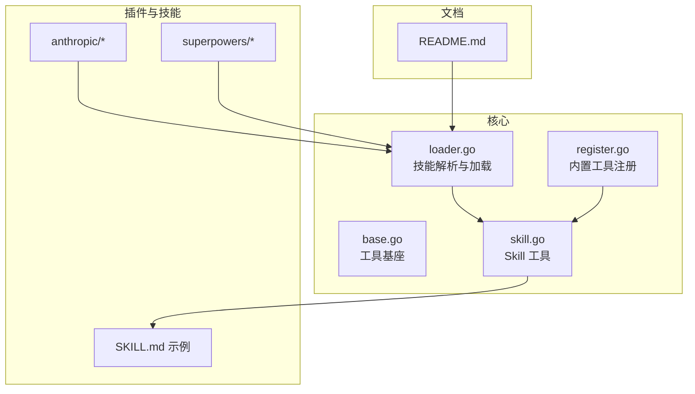
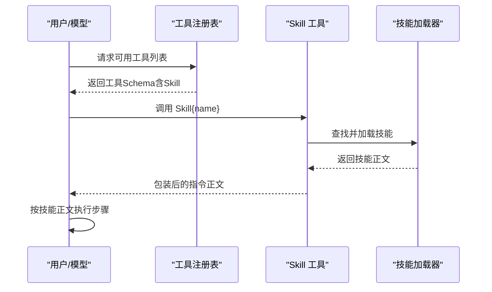
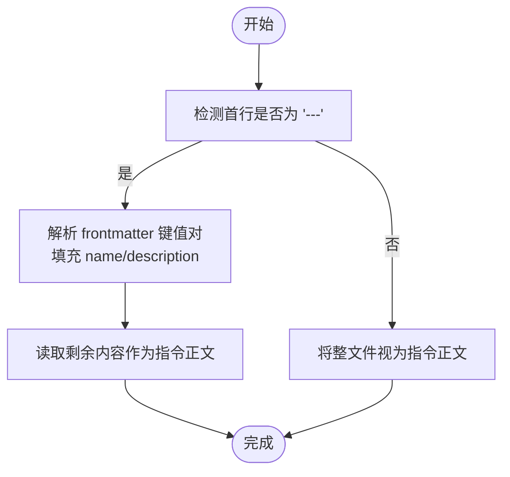
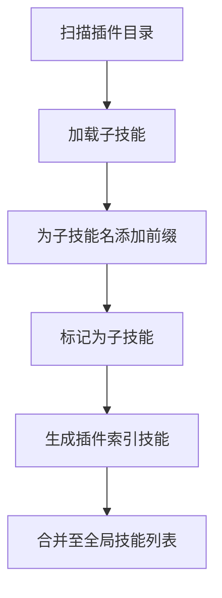
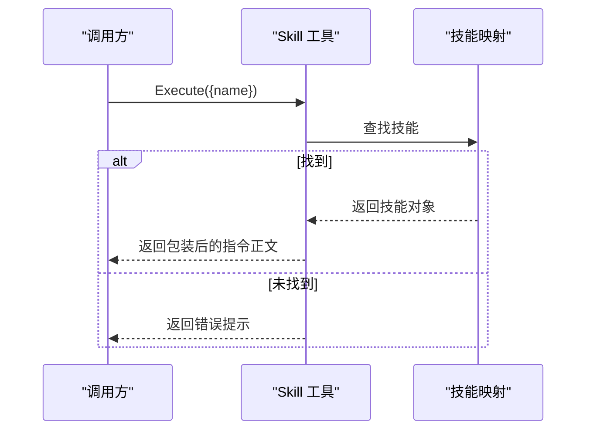
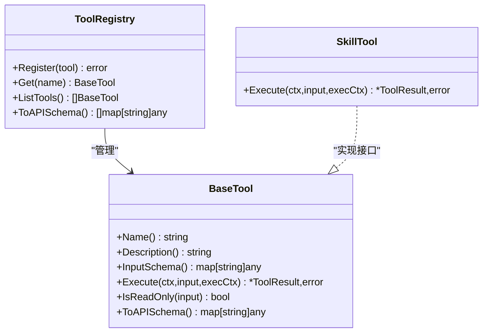
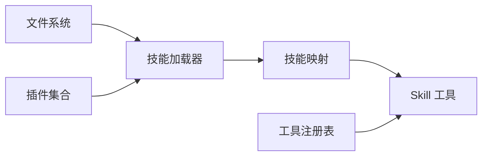

# 技能系统

<cite>
**本文引用的文件**
- [README.md](file://README.md)
- [loader.go](file://pkg/skills/loader.go)
- [loader_test.go](file://pkg/skills/loader_test.go)
- [skill.go](file://pkg/tools/builtin/skill.go)
- [base.go](file://pkg/tools/base.go)
- [register.go](file://pkg/tools/builtin/register.go)
- [SKILL.md（code-review）](file://plugins/anthropic/skills/code-review/SKILL.md)
- [SKILL.md（code-simplifier）](file://plugins/anthropic/skills/code-simplifier/SKILL.md)
- [SKILL.md（brainstorming）](file://plugins/superpowers/skills/brainstorming/SKILL.md)
- [SKILL.md（writing-skills）](file://plugins/superpowers/skills/writing-skills/SKILL.md)
- [SKILL.md（systematic-debugging）](file://plugins/superpowers/skills/systematic-debugging/SKILL.md)
- [SKILL.md（skill-creator）](file://plugins/anthropic/skills/skill-creator/SKILL.md)
- [skills.go](file://einoagent/skills/skills.go)
</cite>

## 目录
1. [简介](#简介)
2. [项目结构](#项目结构)
3. [核心组件](#核心组件)
4. [架构总览](#架构总览)
5. [详细组件分析](#详细组件分析)
6. [依赖分析](#依赖分析)
7. [性能考虑](#性能考虑)
8. [故障排查指南](#故障排查指南)
9. [结论](#结论)
10. [附录](#附录)

## 简介
本文件系统性阐述 OpenHarness-Go 的“技能系统”，围绕以下目标展开：
- 技能的概念与设计原理：以 Markdown 文件承载技能定义，采用 YAML 风格的 frontmatter 描述元信息，正文承载可执行的步骤与约束。
- 渐进式披露机制：系统仅在顶层暴露插件索引与技能摘要，按需加载具体技能正文，避免上下文爆炸。
- 技能文件格式与加载：统一的 SKILL.md 解析流程，支持插件集合的虚拟索引与子技能前缀化命名，避免冲突。
- 动态注册与工具调用：通过内置工具“Skill”按名称检索并返回技能正文，实现“可用技能清单 + 按需加载”的工作流。
- 开发指南：从模板、参数定义到工具调用与状态管理，覆盖内置技能与插件技能的最佳实践。
- 组合与依赖：通过交叉引用与前置条件，构建技能间的协作与依赖关系。
- 调试、测试与性能优化：结合测试用例与触发优化策略，提升技能质量与响应效率。
- 高级扩展：面向高级用户的自定义技能开发与评估体系。

## 项目结构
技能系统主要分布在以下位置：
- 核心加载与解析：pkg/skills/loader.go
- 内置工具：pkg/tools/builtin/skill.go
- 工具基座与注册：pkg/tools/base.go、pkg/tools/builtin/register.go
- 插件与技能样例：plugins/anthropic/skills/* 与 plugins/superpowers/skills/*
- 文档与说明：README.md
- 兼容实现（einoagent）：einoagent/skills/skills.go

图表来源
- [loader.go:21-124](file://pkg/skills/loader.go#L21-L124)
- [skill.go:21-72](file://pkg/tools/builtin/skill.go#L21-L72)
- [base.go:51-131](file://pkg/tools/base.go#L51-L131)
- [register.go:7-29](file://pkg/tools/builtin/register.go#L7-L29)
- [README.md:74-101](file://README.md#L74-L101)

章节来源
- [README.md:74-101](file://README.md#L74-L101)

## 核心组件
- 技能数据结构与解析
  - 技能对象包含名称、描述、指令正文与是否为子技能标记。
  - 支持两种加载路径：根目录下的 *.md 或 plugins/*/skills/*/SKILL.md。
  - frontmatter 使用 YAML 风格键值对，解析后填充技能元信息，其余内容作为指令正文。
- 渐进式披露工具
  - 内置 Skill 工具接收 name 参数，返回带包装的指令正文，避免一次性加载全部技能内容。
- 工具注册与 API
  - 工具注册表提供线程安全的注册、查询与 API Schema 导出能力。
  - 内置工具集中注册，便于统一暴露给引擎或前端。

章节来源
- [loader.go:13-197](file://pkg/skills/loader.go#L13-L197)
- [skill.go:16-72](file://pkg/tools/builtin/skill.go#L16-L72)
- [base.go:51-131](file://pkg/tools/base.go#L51-L131)
- [register.go:7-29](file://pkg/tools/builtin/register.go#L7-L29)

## 架构总览
技能系统采用“分层懒加载”与“按需披露”的架构：
- 初始化阶段：仅扫描 plugins/*/skills/ 生成插件索引与技能摘要（名称+描述）。
- 使用阶段：当模型选择某技能时，通过 Skill 工具按名称加载并返回技能正文，再进入执行流程。
- 插件集合：每个插件内部可包含多个子技能，系统为子技能添加前缀并标注为子技能，同时生成插件级索引技能。

图表来源
- [skill.go:54-72](file://pkg/tools/builtin/skill.go#L54-L72)
- [loader.go:126-197](file://pkg/skills/loader.go#L126-L197)
- [base.go:104-131](file://pkg/tools/base.go#L104-L131)

## 详细组件分析

### 技能文件格式与解析（SKILL.md）
- frontmatter 必须以 "---" 开始与结束，支持 name 与 description 等字段；其余内容作为指令正文。
- 若无 frontmatter，整份文件即为指令正文。
- 加载器支持两类路径：
  - plugins/<plugin>/skills/<skill>/SKILL.md
  - <dir>/<skill>.md（根目录下直接的 .md 文件）

图表来源
- [loader.go:126-197](file://pkg/skills/loader.go#L126-L197)

章节来源
- [loader.go:126-197](file://pkg/skills/loader.go#L126-L197)

### 插件与子技能的动态注册与命名
- 对于每个插件目录，系统扫描其 skills 子目录，为每个子技能生成带前缀的名称（plugin:skill），并将其标记为子技能。
- 同时生成一个插件级索引技能，描述该插件包含的子技能列表，便于模型在顶层浏览与选择。

图表来源
- [loader.go:62-124](file://pkg/skills/loader.go#L62-L124)

章节来源
- [loader.go:62-124](file://pkg/skills/loader.go#L62-L124)

### 渐进式披露工具（Skill 工具）
- 输入参数：name（必填）
- 行为：根据名称查找技能，若存在则返回包装后的指令正文；否则返回错误提示。
- 输出：包含指令正文的工具结果，供后续执行。

图表来源
- [skill.go:54-72](file://pkg/tools/builtin/skill.go#L54-L72)

章节来源
- [skill.go:16-72](file://pkg/tools/builtin/skill.go#L16-L72)

### 工具注册与 API Schema
- 工具注册表提供线程安全的注册、查询与导出能力。
- 内置工具集中注册，便于统一暴露给上层引擎或前端。

图表来源
- [base.go:51-131](file://pkg/tools/base.go#L51-L131)
- [skill.go:21-72](file://pkg/tools/builtin/skill.go#L21-L72)

章节来源
- [base.go:51-131](file://pkg/tools/base.go#L51-L131)
- [register.go:7-29](file://pkg/tools/builtin/register.go#L7-L29)

### 内置技能示例与最佳实践
- code-review：面向 Pull Request 的并行代码审查流程，强调触发条件、并行代理与评分机制。
- code-simplifier：专注于代码简化与一致性，强调保留功能不变的前提下提升可读性。
- brainstorming：创意工作前置的设计流程，强调在实现前先产出设计并通过审批。
- systematic-debugging：系统化调试框架，强调根因调查与最小验证。
- skill-creator：元技能，指导如何创建、评估与优化技能，包含触发优化与评测闭环。

章节来源
- [SKILL.md（code-review）:1-94](file://plugins/anthropic/skills/code-review/SKILL.md#L1-L94)
- [SKILL.md（code-simplifier）:1-53](file://plugins/anthropic/skills/code-simplifier/SKILL.md#L1-L53)
- [SKILL.md（brainstorming）:1-165](file://plugins/superpowers/skills/brainstorming/SKILL.md#L1-L165)
- [SKILL.md（systematic-debugging）:1-297](file://plugins/superpowers/skills/systematic-debugging/SKILL.md#L1-L297)
- [SKILL.md（skill-creator）:1-486](file://plugins/anthropic/skills/skill-creator/SKILL.md#L1-L486)

### 技能开发指南（模板、参数、工具调用与状态）
- 模板与结构
  - frontmatter：name、description（触发条件优先）、可选 model 等。
  - 正文：概述、何时使用、核心模式、快速参考、实现细节、常见误区、影响等。
- 参数定义
  - 使用工具输入 Schema 描述参数类型与必填项，确保 Skill 工具的 name 字段正确传递。
- 工具调用
  - 通过 Skill 工具按需加载技能正文，随后按步骤执行；必要时结合其他工具（如 Bash、文件读写）完成任务。
- 状态管理
  - 利用工具执行上下文（如工作目录、元数据）与任务系统（tasks）进行状态持久化与跨步骤协调。

章节来源
- [skill.go:16-72](file://pkg/tools/builtin/skill.go#L16-L72)
- [base.go:17-27](file://pkg/tools/base.go#L17-L27)
- [README.md:74-101](file://README.md#L74-L101)

### 技能之间的依赖与组合
- 交叉引用：通过技能名称进行显式引用，避免强制加载与上下文膨胀。
- 前置条件：某些技能要求先掌握背景技能（如 TDD、系统化调试），并在描述中明确标注。
- 组合使用：例如在“头脑风暴”之后调用“写作计划”，形成从设计到执行的闭环。

章节来源
- [SKILL.md（brainstorming）:133-136](file://plugins/superpowers/skills/brainstorming/SKILL.md#L133-L136)
- [SKILL.md（writing-skills）:282-288](file://plugins/superpowers/skills/writing-skills/SKILL.md#L282-L288)

### 测试与验证
- 单元测试：验证 frontmatter 解析、目录扫描与子技能加载。
- 触发优化：通过生成触发/非触发查询集，评估描述字段的触发准确性并迭代优化。
- 评测闭环：使用子代理并行运行“有技能”与“基线”场景，生成基准报告与可视化评审。

章节来源
- [loader_test.go:9-70](file://pkg/skills/loader_test.go#L9-L70)
- [SKILL.md（skill-creator）:333-405](file://plugins/anthropic/skills/skill-creator/SKILL.md#L333-L405)

### 兼容实现（einoagent）
- einoagent 提供了类似的渐进式披露实现，包括技能目录渲染、按需加载与工具封装，便于在不同组件间复用。

章节来源
- [skills.go:1-180](file://einoagent/skills/skills.go#L1-L180)

## 依赖分析
- 组件耦合
  - 技能加载器依赖文件系统扫描与 Markdown 解析。
  - Skill 工具依赖技能映射（由加载器构建）与工具执行上下文。
  - 工具注册表为所有工具提供统一的生命周期管理。
- 外部依赖
  - 插件集合位于 plugins/*，遵循统一的 skills 子目录结构。
  - README 提供了整体架构与使用说明，指导如何接入与扩展。

图表来源
- [loader.go:21-124](file://pkg/skills/loader.go#L21-L124)
- [skill.go:28-72](file://pkg/tools/builtin/skill.go#L28-L72)
- [base.go:82-131](file://pkg/tools/base.go#L82-L131)

章节来源
- [loader.go:21-124](file://pkg/skills/loader.go#L21-L124)
- [base.go:82-131](file://pkg/tools/base.go#L82-L131)

## 性能考虑
- 上下文控制
  - 仅在顶层暴露技能摘要，避免一次性加载大量技能正文。
  - frontmatter 与正文分离，减少不必要的上下文占用。
- 加载策略
  - 插件索引先行，子技能按需加载，降低初始 Token 消耗。
- 触发优化
  - 通过触发查询集与描述优化，提高技能命中率，减少无效加载。

## 故障排查指南
- 常见问题
  - 技能未被识别：检查 SKILL.md 是否位于正确路径，frontmatter 是否规范。
  - 插件子技能冲突：确认是否使用了插件前缀命名。
  - Skill 工具调用失败：核对 name 参数是否正确，技能是否存在。
- 排查步骤
  - 使用单元测试验证解析逻辑。
  - 通过 README 的内置插件列表核对技能可用性。
  - 使用 skill-creator 的评测流程定位问题并迭代优化。

章节来源
- [loader_test.go:9-70](file://pkg/skills/loader_test.go#L9-L70)
- [README.md:74-101](file://README.md#L74-L101)
- [SKILL.md（skill-creator）:163-251](file://plugins/anthropic/skills/skill-creator/SKILL.md#L163-L251)

## 结论
技能系统通过“渐进式披露 + 动态注册 + 插件集合”的设计，实现了大规模技能库的安全、可控与高效使用。结合内置工具与评测体系，开发者可以快速创建、验证与优化技能，形成可持续演进的知识与能力资产。

## 附录
- 快速上手
  - 在 plugins/<plugin>/skills/<skill>/ 下创建 SKILL.md，确保 frontmatter 包含 name 与 description。
  - 使用 Skill 工具按名称加载技能正文并执行。
  - 参考内置技能样例（如 code-review、brainstorming、systematic-debugging）进行对照与改进。
- 扩展建议
  - 为大型参考材料拆分为独立文件并通过链接引用，保持 SKILL.md 精炼。
  - 使用触发优化与评测闭环持续改进技能描述与实现。