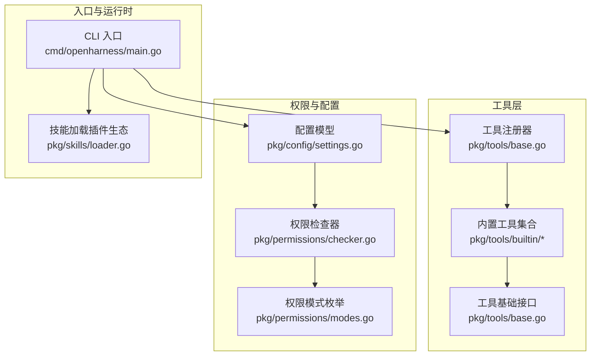
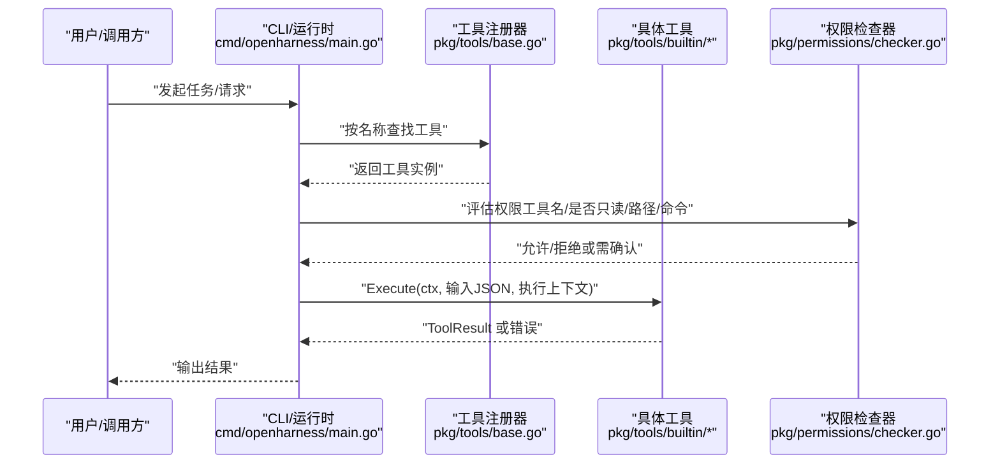
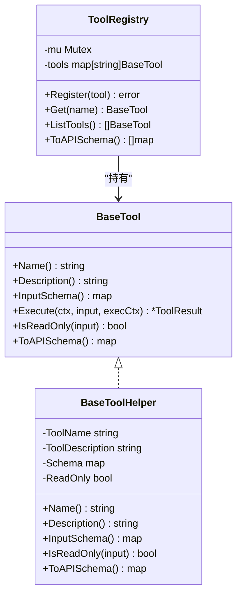
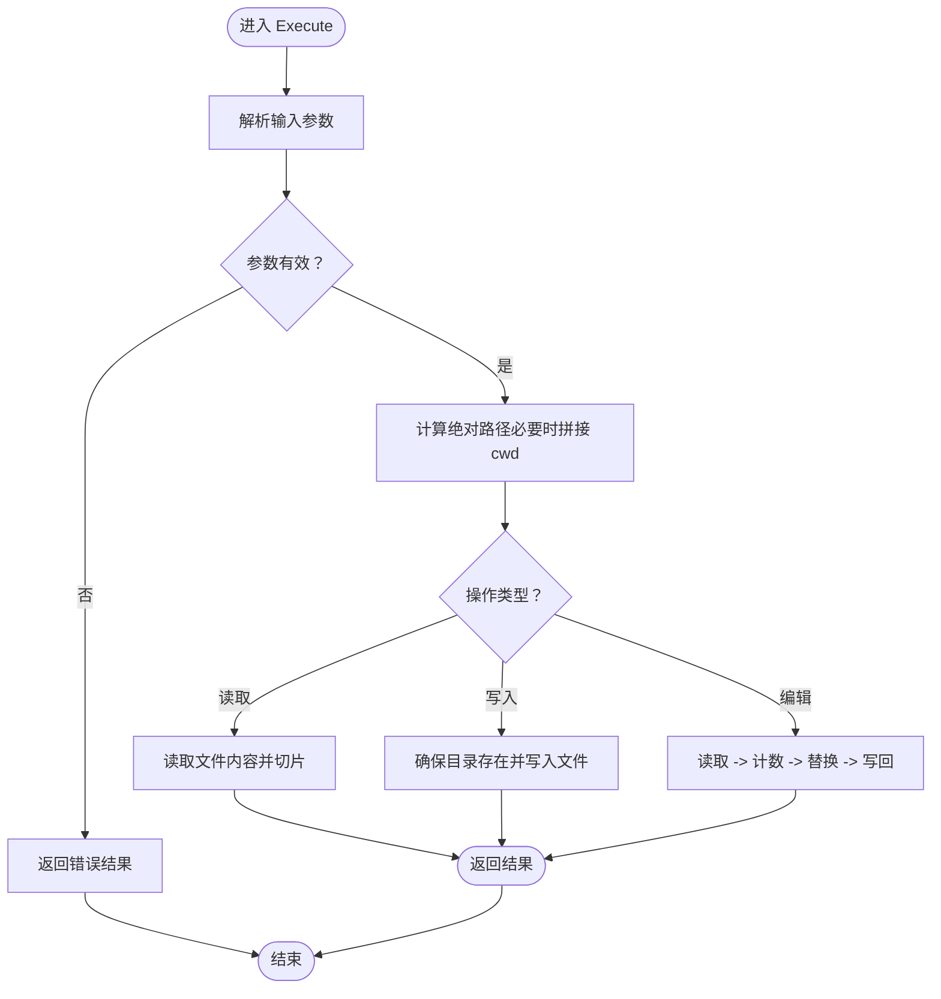
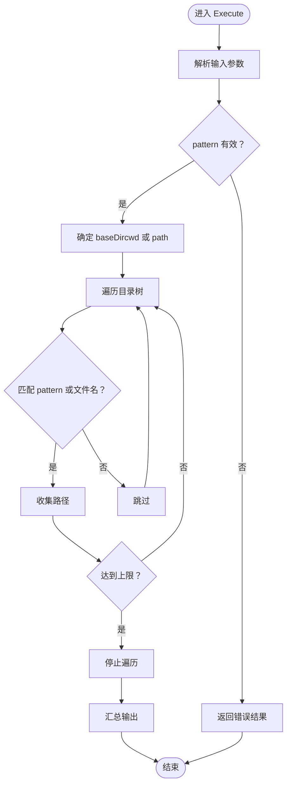
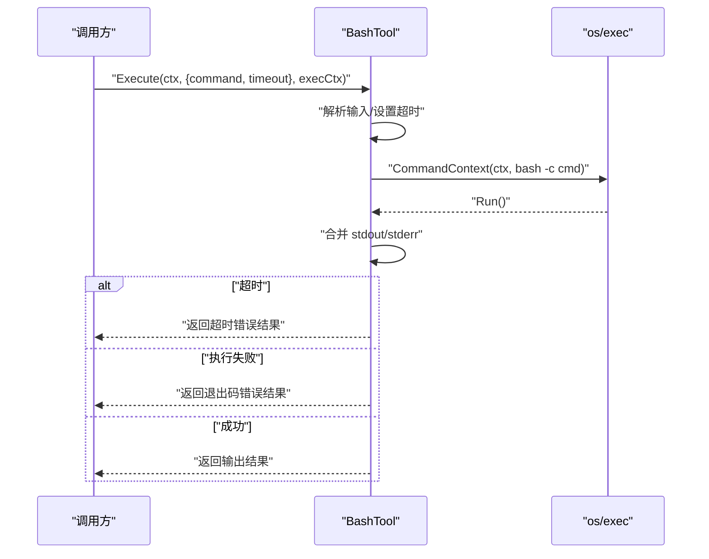
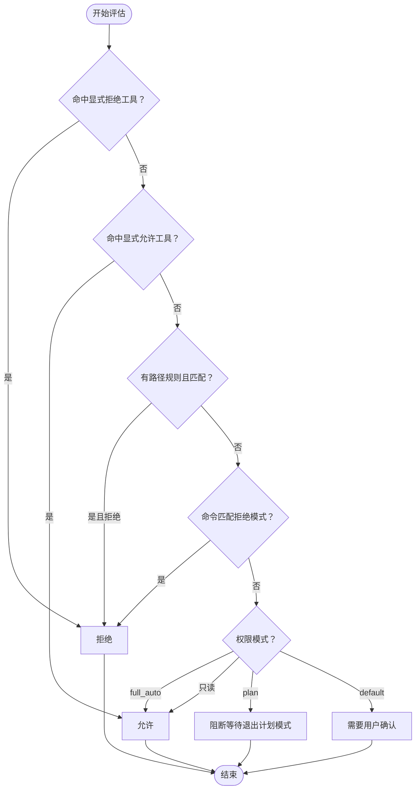
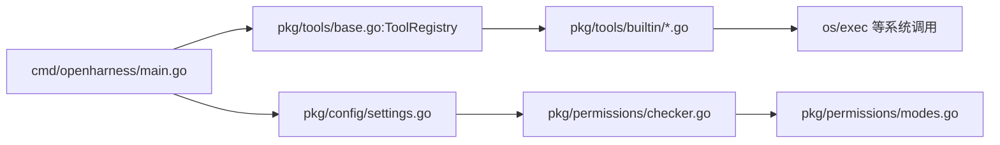

# 工具插件开发

<cite>
**本文引用的文件**
- [pkg/tools/base.go](file://pkg/tools/base.go)
- [pkg/tools/builtin/register.go](file://pkg/tools/builtin/register.go)
- [pkg/tools/builtin/bash.go](file://pkg/tools/builtin/bash.go)
- [pkg/tools/builtin/file_read.go](file://pkg/tools/builtin/file_read.go)
- [pkg/tools/builtin/file_write.go](file://pkg/tools/builtin/file_write.go)
- [pkg/tools/builtin/glob.go](file://pkg/tools/builtin/glob.go)
- [pkg/tools/builtin/grep.go](file://pkg/tools/builtin/grep.go)
- [pkg/tools/builtin/file_edit.go](file://pkg/tools/builtin/file_edit.go)
- [pkg/tools/builtin/ask_user_question.go](file://pkg/tools/builtin/ask_user_question.go)
- [pkg/permissions/checker.go](file://pkg/permissions/checker.go)
- [pkg/permissions/modes.go](file://pkg/permissions/modes.go)
- [pkg/config/settings.go](file://pkg/config/settings.go)
- [cmd/openharness/main.go](file://cmd/openharness/main.go)
- [pkg/skills/loader.go](file://pkg/skills/loader.go)
</cite>

## 目录
1. [简介](#简介)
2. [项目结构](#项目结构)
3. [核心组件](#核心组件)
4. [架构总览](#架构总览)
5. [详细组件分析](#详细组件分析)
6. [依赖关系分析](#依赖关系分析)
7. [性能考量](#性能考量)
8. [故障排查指南](#故障排查指南)
9. [结论](#结论)
10. [附录：开发模板与最佳实践](#附录开发模板与最佳实践)

## 简介
本指南面向希望在 OpenHarness 中开发“自定义工具插件”的工程师与高级用户。内容覆盖工具接口设计、注册机制、生命周期与参数处理、权限与安全、测试策略、性能优化以及打包与分发流程。通过阅读本指南，您将能够：
- 基于统一接口实现新的工具
- 正确注册与暴露工具能力
- 处理工作目录与交互回调
- 实现安全可控的文件与命令操作
- 设计可测试、可维护的工具实现
- 规范化工具的打包与版本管理

## 项目结构
OpenHarness 将“工具”抽象为统一接口，并提供一组内置工具作为参考实现；同时通过配置与权限模块对工具调用进行约束。

**图表来源**
- [pkg/tools/base.go:1-132](file://pkg/tools/base.go#L1-L132)
- [pkg/tools/builtin/register.go:1-30](file://pkg/tools/builtin/register.go#L1-L30)
- [pkg/permissions/checker.go:1-92](file://pkg/permissions/checker.go#L1-L92)
- [pkg/permissions/modes.go:1-28](file://pkg/permissions/modes.go#L1-L28)
- [pkg/config/settings.go:1-212](file://pkg/config/settings.go#L1-L212)
- [cmd/openharness/main.go:1-299](file://cmd/openharness/main.go#L1-L299)
- [pkg/skills/loader.go:1-198](file://pkg/skills/loader.go#L1-L198)

**章节来源**
- [pkg/tools/base.go:1-132](file://pkg/tools/base.go#L1-L132)
- [pkg/tools/builtin/register.go:1-30](file://pkg/tools/builtin/register.go#L1-L30)
- [pkg/permissions/checker.go:1-92](file://pkg/permissions/checker.go#L1-L92)
- [pkg/permissions/modes.go:1-28](file://pkg/permissions/modes.go#L1-L28)
- [pkg/config/settings.go:1-212](file://pkg/config/settings.go#L1-L212)
- [cmd/openharness/main.go:1-299](file://cmd/openharness/main.go#L1-L299)
- [pkg/skills/loader.go:1-198](file://pkg/skills/loader.go#L1-L198)

## 核心组件
- 工具接口与上下文
  - BaseTool：定义工具名称、描述、输入模式、执行、只读判定、API 模式导出等契约
  - ToolExecutionContext：携带工作目录与元数据，以及用户提问与授权回调
  - ToolResult：不可变的执行结果封装
- 工具基类与注册器
  - BaseToolHelper：为实现者提供默认的 Name/Description/InputSchema/IsReadOnly/APISchema
  - ToolRegistry：线程安全的工具注册表，支持注册、查询、列举与导出 API 模式
- 内置工具样例
  - 文件读取、写入、编辑
  - 路径匹配与内容搜索
  - Bash 子进程执行
  - 用户问答工具

**章节来源**
- [pkg/tools/base.go:11-132](file://pkg/tools/base.go#L11-L132)
- [pkg/tools/builtin/register.go:7-30](file://pkg/tools/builtin/register.go#L7-L30)

## 架构总览
工具插件的典型调用链如下：

**图表来源**
- [cmd/openharness/main.go:46-76](file://cmd/openharness/main.go#L46-L76)
- [pkg/tools/base.go:81-132](file://pkg/tools/base.go#L81-L132)
- [pkg/permissions/checker.go:41-82](file://pkg/permissions/checker.go#L41-L82)

## 详细组件分析

### 工具接口与基类设计
- 接口职责
  - Name/Description：用于 UI 展示与 API 导出
  - InputSchema：基于 JSON Schema 的输入约束，便于前端校验与自动补全
  - Execute：实际执行逻辑，接收上下文、原始输入与执行上下文
  - IsReadOnly：决定是否需要用户确认
  - ToAPISchema：导出工具的 API 描述
- 基类辅助
  - BaseToolHelper 提供默认实现，减少样板代码
- 注册器
  - 线程安全，避免重复注册，支持批量导出 API 模式

**图表来源**
- [pkg/tools/base.go:51-132](file://pkg/tools/base.go#L51-L132)

**章节来源**
- [pkg/tools/base.go:51-132](file://pkg/tools/base.go#L51-L132)

### 文件操作工具（读取/写入/编辑）
- 文件读取
  - 支持偏移与行数限制，相对路径自动拼接至工作目录
  - 返回指定范围的文本
- 文件写入
  - 自动创建父目录，写入内容并返回字节数统计
- 文件编辑
  - 严格要求旧字符串唯一出现一次，避免误替换
  - 成功后返回编辑提示信息

**图表来源**
- [pkg/tools/builtin/file_read.go:59-99](file://pkg/tools/builtin/file_read.go#L59-L99)
- [pkg/tools/builtin/file_write.go:53-80](file://pkg/tools/builtin/file_write.go#L53-L80)
- [pkg/tools/builtin/file_edit.go:59-98](file://pkg/tools/builtin/file_edit.go#L59-L98)

**章节来源**
- [pkg/tools/builtin/file_read.go:18-99](file://pkg/tools/builtin/file_read.go#L18-L99)
- [pkg/tools/builtin/file_write.go:17-80](file://pkg/tools/builtin/file_write.go#L17-L80)
- [pkg/tools/builtin/file_edit.go:18-98](file://pkg/tools/builtin/file_edit.go#L18-L98)

### 路径与内容检索工具（Glob/Grep）
- Glob
  - 在工作目录或指定目录下递归匹配相对路径，支持简单文件名匹配
- Grep
  - 遍历文件树，按正则匹配行，支持文件名过滤与最大结果限制

**图表来源**
- [pkg/tools/builtin/glob.go:54-106](file://pkg/tools/builtin/glob.go#L54-L106)
- [pkg/tools/builtin/grep.go:61-141](file://pkg/tools/builtin/grep.go#L61-L141)

**章节来源**
- [pkg/tools/builtin/glob.go:18-106](file://pkg/tools/builtin/glob.go#L18-L106)
- [pkg/tools/builtin/grep.go:20-141](file://pkg/tools/builtin/grep.go#L20-L141)

### 系统命令执行工具（Bash）
- 支持超时控制，子进程在上下文取消或超时时终止
- 合并标准输出与错误输出，区分超时与退出码错误
- 默认超时与可配置超时

**图表来源**
- [pkg/tools/builtin/bash.go:55-99](file://pkg/tools/builtin/bash.go#L55-L99)

**章节来源**
- [pkg/tools/builtin/bash.go:18-99](file://pkg/tools/builtin/bash.go#L18-L99)

### 用户交互工具（AskUserQuestion）
- 通过执行上下文中的回调向用户提问，支持选项列表
- 若未提供回调，则返回不可用提示

**章节来源**
- [pkg/tools/builtin/ask_user_question.go:16-80](file://pkg/tools/builtin/ask_user_question.go#L16-L80)

### 权限控制与安全
- 权限模式
  - default：默认模式，只读工具放行，变更型工具需确认
  - plan：计划模式，阻止变更型工具直至退出计划模式
  - full_auto：自动放行所有工具
- 规则评估
  - 显式允许/拒绝工具
  - 路径规则（glob 匹配），拒绝特定路径
  - 命令模式（glob 匹配），拒绝敏感命令
- 安全建议
  - 对外部命令输入进行白名单/黑名单过滤
  - 对文件路径进行严格验证与规范化
  - 限制命令超时与资源消耗

**图表来源**
- [pkg/permissions/checker.go:41-82](file://pkg/permissions/checker.go#L41-L82)
- [pkg/permissions/modes.go:4-28](file://pkg/permissions/modes.go#L4-L28)

**章节来源**
- [pkg/permissions/checker.go:10-92](file://pkg/permissions/checker.go#L10-L92)
- [pkg/permissions/modes.go:4-28](file://pkg/permissions/modes.go#L4-L28)
- [pkg/config/settings.go:37-55](file://pkg/config/settings.go#L37-L55)

### 生命周期与参数处理
- 生命周期
  - 初始化：构造工具实例（通常由工厂函数完成）
  - 注册：将工具注册到全局注册器
  - 调用：运行时根据名称获取工具，传入上下文与输入
  - 结果：返回不可变结果对象
- 参数处理
  - 使用 JSON Schema 定义输入结构，便于前端与工具侧共同校验
  - 在 Execute 中解包输入，进行业务参数校验与默认值处理
  - 对外部命令与文件路径进行安全处理（规范化、限制范围）

**章节来源**
- [pkg/tools/base.go:51-132](file://pkg/tools/base.go#L51-L132)
- [pkg/tools/builtin/register.go:7-30](file://pkg/tools/builtin/register.go#L7-L30)

## 依赖关系分析
- 组件耦合
  - 工具实现依赖工具基类与注册器，保持低耦合高内聚
  - 运行时通过注册器按名称解析工具，避免硬编码
- 外部依赖
  - os/exec 用于命令执行
  - 正则表达式与文件系统 API 用于检索与匹配
- 权限与配置
  - 权限检查器依赖配置中的模式与规则
  - CLI 从配置文件加载设置并传递给运行时

**图表来源**
- [cmd/openharness/main.go:46-76](file://cmd/openharness/main.go#L46-L76)
- [pkg/tools/base.go:81-132](file://pkg/tools/base.go#L81-L132)
- [pkg/permissions/checker.go:41-82](file://pkg/permissions/checker.go#L41-L82)
- [pkg/config/settings.go:97-142](file://pkg/config/settings.go#L97-L142)

**章节来源**
- [cmd/openharness/main.go:46-76](file://cmd/openharness/main.go#L46-L76)
- [pkg/tools/base.go:81-132](file://pkg/tools/base.go#L81-L132)
- [pkg/permissions/checker.go:41-82](file://pkg/permissions/checker.go#L41-L82)
- [pkg/config/settings.go:97-142](file://pkg/config/settings.go#L97-L142)

## 性能考量
- IO 与扫描
  - Glob/Grep 遍历文件树时注意限制结果数量与深度，避免长时间扫描
  - 对大文件读取建议使用流式处理或分块读取
- 命令执行
  - 为外部命令设置合理超时，防止阻塞
  - 合理拆分长命令，避免 shell 特殊字符带来的开销与风险
- 并发与锁
  - 注册器已内置互斥锁，避免并发注册冲突
- 缓存与复用
  - 对频繁查询的结果进行缓存（如路径索引），降低重复扫描成本

[本节为通用指导，无需列出章节来源]

## 故障排查指南
- 工具未被识别
  - 检查是否正确注册到注册器，名称是否重复
  - 确认运行时是否从注册器按名称获取工具
- 权限被拒绝
  - 查看权限模式与规则配置，确认工具是否在允许/拒绝列表中
  - 检查路径是否匹配拒绝规则，命令是否命中拒绝模式
- 文件操作异常
  - 确认路径是否为绝对路径或正确拼接了工作目录
  - 检查父目录是否存在与权限是否足够
- 命令执行失败
  - 检查命令是否为空或超时
  - 查看标准错误输出以定位问题

**章节来源**
- [pkg/tools/base.go:92-110](file://pkg/tools/base.go#L92-L110)
- [pkg/permissions/checker.go:41-82](file://pkg/permissions/checker.go#L41-L82)
- [pkg/tools/builtin/bash.go:55-99](file://pkg/tools/builtin/bash.go#L55-L99)

## 结论
通过统一的工具接口与注册机制，OpenHarness 为开发者提供了清晰、可扩展的工具体系。结合严格的权限控制与安全实践，可以在保证安全性的同时灵活地扩展工具能力。建议在实现新工具时遵循本文提供的模板与最佳实践，确保一致性与可维护性。

[本节为总结，无需列出章节来源]

## 附录：开发模板与最佳实践

### 开发模板（步骤清单）
- 定义输入结构体与 JSON Schema
  - 参考现有工具的输入结构与 Schema 定义
  - 示例路径：[pkg/tools/builtin/file_read.go:18-56](file://pkg/tools/builtin/file_read.go#L18-L56)
- 实现工具结构体与工厂函数
  - 使用 BaseToolHelper 作为嵌入字段
  - 示例路径：[pkg/tools/builtin/file_write.go:23-51](file://pkg/tools/builtin/file_write.go#L23-L51)
- 实现 Execute 方法
  - 解析输入、参数校验、执行业务逻辑、返回 ToolResult
  - 示例路径：[pkg/tools/builtin/grep.go:61-117](file://pkg/tools/builtin/grep.go#L61-L117)
- 实现只读标记与 API 模式导出
  - IsReadOnly 标记是否需要用户确认
  - ToAPISchema 导出工具描述
  - 示例路径：[pkg/tools/base.go:61-79](file://pkg/tools/base.go#L61-L79)
- 注册工具
  - 在注册函数中加入新工具实例
  - 示例路径：[pkg/tools/builtin/register.go:7-21](file://pkg/tools/builtin/register.go#L7-L21)

### 常见工具实现要点
- 文件操作
  - 路径规范化与 cwd 拼接
  - 目录不存在时自动创建
  - 严格限制写入范围，避免越权
  - 参考：[pkg/tools/builtin/file_write.go:53-80](file://pkg/tools/builtin/file_write.go#L53-L80)
- 命令执行
  - 设置超时上下文，捕获超时与退出码
  - 合并输出并区分错误类型
  - 参考：[pkg/tools/builtin/bash.go:55-99](file://pkg/tools/builtin/bash.go#L55-L99)
- 搜索与匹配
  - 使用正则与 glob 控制匹配范围
  - 限制最大结果数量，避免性能问题
  - 参考：[pkg/tools/builtin/grep.go:61-117](file://pkg/tools/builtin/grep.go#L61-L117)

### 测试策略
- 单元测试
  - 针对 Execute 的输入边界与异常路径进行覆盖
  - 使用 mock 上下文与最小化依赖
- 集成测试
  - 在真实工作目录中验证文件读写与路径行为
  - 验证权限规则生效（允许/拒绝/确认）
- 回归测试
  - 对比历史输出，确保修改不破坏兼容性

### 性能优化建议
- IO 优化
  - 大文件按行扫描，避免一次性读入内存
  - 对热点路径建立索引或缓存
- 并发与锁
  - 仅在注册阶段使用互斥锁，运行时尽量无锁
- 资源限制
  - 为命令执行设置超时与资源上限
  - 限制搜索范围与结果数量

### 打包、分发与版本管理
- 插件生态
  - 把工具与技能组织在 plugins/<plugin>/skills 下
  - 加载器会自动扫描并生成虚拟插件索引
  - 参考：[pkg/skills/loader.go:62-124](file://pkg/skills/loader.go#L62-L124)
- 配置与发布
  - 通过配置文件控制权限模式与工具启用
  - 参考：[pkg/config/settings.go:97-142](file://pkg/config/settings.go#L97-L142)
- 版本管理
  - 以插件目录名作为版本标识，配合语义化版本命名
  - 在技能文件中记录变更日志与兼容性说明

**章节来源**
- [pkg/tools/builtin/register.go:7-30](file://pkg/tools/builtin/register.go#L7-L30)
- [pkg/skills/loader.go:62-124](file://pkg/skills/loader.go#L62-L124)
- [pkg/config/settings.go:97-142](file://pkg/config/settings.go#L97-L142)