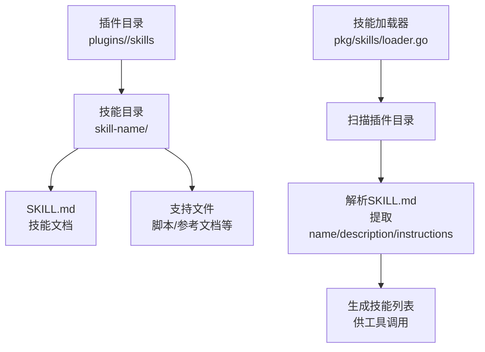
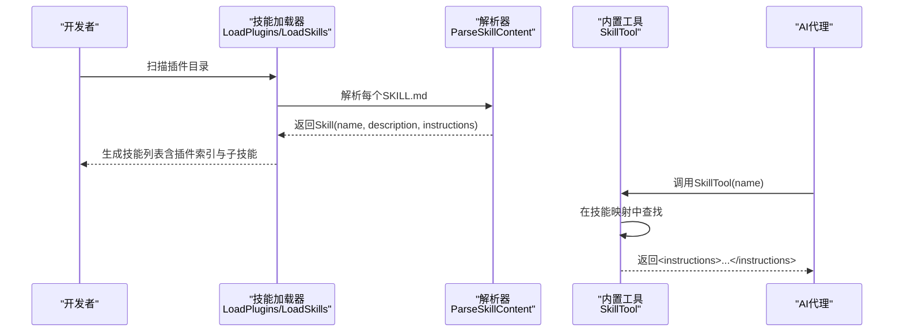
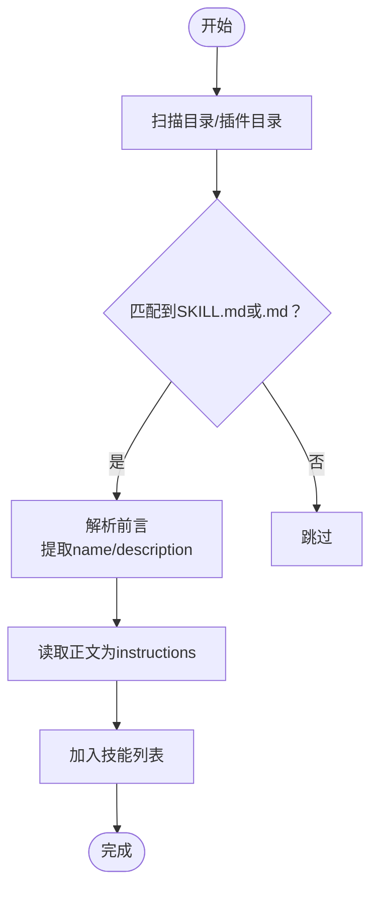
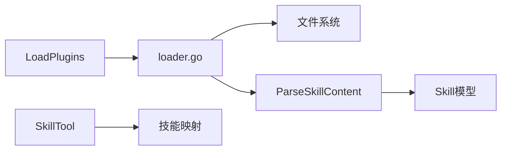

# 技能插件开发

<cite>
**本文引用的文件**
- [loader.go](file://pkg/skills/loader.go)
- [loader_test.go](file://pkg/skills/loader_test.go)
- [skill.go](file://pkg/tools/builtin/skill.go)
- [code-review/SKILL.md](file://plugins/anthropic/skills/code-review/SKILL.md)
- [test-driven-development/SKILL.md](file://plugins/superpowers/skills/test-driven-development/SKILL.md)
- [writing-skills/SKILL.md](file://plugins/superpowers/skills/writing-skills/SKILL.md)
- [systematic-debugging/SKILL.md](file://plugins/superpowers/skills/systematic-debugging/SKILL.md)
- [brainstorming/SKILL.md](file://plugins/superpowers/skills/brainstorming/SKILL.md)
- [subagent-driven-development/SKILL.md](file://plugins/superpowers/skills/subagent-driven-development/SKILL.md)
- [verification-before-completion/SKILL.md](file://plugins/superpowers/skills/verification-before-completion/SKILL.md)
- [testing-skills-with-subagents.md](file://plugins/superpowers/skills/writing-skills/testing-skills-with-subagents.md)
- [CLAUDE_MD_TESTING.md](file://plugins/superpowers/skills/writing-skills/examples/CLAUDE_MD_TESTING.md)
</cite>

## 目录
1. [简介](#简介)
2. [项目结构](#项目结构)
3. [核心组件](#核心组件)
4. [架构总览](#架构总览)
5. [详细组件分析](#详细组件分析)
6. [依赖关系分析](#依赖关系分析)
7. [性能考量](#性能考量)
8. [故障排查指南](#故障排查指南)
9. [结论](#结论)
10. [附录](#附录)

## 简介
本指南面向技能插件开发者，系统讲解如何在本项目中创建与实现技能插件（SKILL.md），涵盖：
- SKILL.md 的编写规范与内容结构
- YAML 前言部分 name 与 description 字段的正确格式与最佳实践
- 技能指令内容的编写指南（步骤、示例与使用场景）
- 技能的分类与组织方式（主技能与子技能）
- 典型开发示例：代码审查、测试驱动开发、写作技能等
- 技能插件的测试方法与调试技巧

## 项目结构
本仓库采用“插件 + 技能”的分层组织方式：
- 插件目录 plugins/<provider>/skills 下存放具体技能
- 每个技能以独立目录存在，包含 SKILL.md 及可选的辅助文件
- 核心加载器负责扫描插件目录并解析 SKILL.md，生成技能索引与指令

图表来源
- [loader.go:21-124](file://pkg/skills/loader.go#L21-L124)
- [code-review/SKILL.md:1-94](file://plugins/anthropic/skills/code-review/SKILL.md#L1-L94)

章节来源
- [loader.go:21-124](file://pkg/skills/loader.go#L21-L124)

## 核心组件
- 技能数据模型：包含名称、描述、指令正文、是否为子技能标记
- 技能加载器：扫描目录、识别 SKILL.md 或 .md 文件，解析 YAML 前言，提取 name/description/instructions
- 插件聚合：对每个插件目录，生成“插件索引技能”和“子技能”，并对子技能名进行前缀化避免冲突
- 内置工具：SkillTool 提供按名称检索技能指令的能力

章节来源
- [loader.go:13-197](file://pkg/skills/loader.go#L13-L197)
- [skill.go:16-72](file://pkg/tools/builtin/skill.go#L16-L72)

## 架构总览
技能插件的加载与调用流程如下：

图表来源
- [loader.go:62-124](file://pkg/skills/loader.go#L62-L124)
- [loader.go:126-197](file://pkg/skills/loader.go#L126-L197)
- [skill.go:54-72](file://pkg/tools/builtin/skill.go#L54-L72)

## 详细组件分析

### YAML 前言与 SKILL.md 结构
- 前言必须以三短划线开始与结束，包含 name 与 description 等字段
- name 应使用字母、数字与连字符，避免括号与特殊字符
- description 必须聚焦“何时触发”，而非“技能做什么”
- 正文为技能指令，建议遵循“概述 → 使用时机 → 核心模式/快速参考 → 实施 → 常见误区 → 影响”等结构

章节来源
- [writing-skills/SKILL.md:95-137](file://plugins/superpowers/skills/writing-skills/SKILL.md#L95-L137)
- [code-review/SKILL.md:1-94](file://plugins/anthropic/skills/code-review/SKILL.md#L1-L94)

### 加载器与解析器
- 支持两种入口：
  - 直接扫描目录中的 SKILL.md
  - 扫描插件目录下的 skills 子目录，生成“插件索引技能”和“子技能”
- 解析器从文件头读取 YAML 前言，提取 name 与 description；其余正文作为 instructions
- 子技能名会加上插件名前缀，避免命名冲突

图表来源
- [loader.go:21-60](file://pkg/skills/loader.go#L21-L60)
- [loader.go:126-197](file://pkg/skills/loader.go#L126-L197)

章节来源
- [loader.go:21-124](file://pkg/skills/loader.go#L21-L124)
- [loader_test.go:9-70](file://pkg/skills/loader_test.go#L9-L70)

### 内置工具：SkillTool
- 输入：JSON 对象，包含 name 字段
- 输出：返回带有 <instructions> 包裹的技能指令正文
- 若未找到技能，返回错误提示（请查看可用技能列表）

章节来源
- [skill.go:16-72](file://pkg/tools/builtin/skill.go#L16-L72)

### 技能类型与组织方式
- 主技能：直接位于插件的 skills 目录下
- 子技能：由插件聚合时生成，名称前缀为“插件名:技能名”，且 IsSubSkill=true
- 插件索引技能：列出该插件的所有子技能，便于用户浏览

章节来源
- [loader.go:62-124](file://pkg/skills/loader.go#L62-L124)

### 典型技能示例与实现要点

#### 示例一：代码审查（Anthropic）
- 触发条件：拉取请求需要审查
- 关键流程：多阶段并行评审（合规性、缺陷、历史上下文、注释一致性）+ 置信度评分 + 过滤低置信度问题
- 指令编写要点：明确步骤、链接引用、输出格式要求、避免构建信号检查

章节来源
- [code-review/SKILL.md:10-94](file://plugins/anthropic/skills/code-review/SKILL.md#L10-L94)

#### 示例二：测试驱动开发（Superpowers）
- 核心原则：先写失败测试，再写最小实现，最后重构
- 流程图：红-绿-重构循环，强调“验证失败”与“验证通过”的必要性
- 指令编写要点：清晰的“好测试/坏测试”对比、常见借口与现实对照表、验证清单

章节来源
- [test-driven-development/SKILL.md:47-372](file://plugins/superpowers/skills/test-driven-development/SKILL.md#L47-L372)

#### 示例三：写作技能（Superpowers）
- 面向“过程文档”的 TDD：先写压力场景（基线），再写技能，再重构补漏洞
- CSO（Claude 搜索优化）：描述字段只写触发条件，不总结流程；关键词覆盖；命名动词优先；跨引用减少冗余
- 指令编写要点：小流程图仅用于非显而易见决策；示例精炼；文件组织扁平化

章节来源
- [writing-skills/SKILL.md:30-137](file://plugins/superpowers/skills/writing-skills/SKILL.md#L30-L137)
- [writing-skills/SKILL.md:140-277](file://plugins/superpowers/skills/writing-skills/SKILL.md#L140-L277)

#### 示例四：系统化调试（Superpowers）
- 四阶段：根因调查 → 模式分析 → 假设与测试 → 实施
- 指令编写要点：红灯清单、人类伙伴信号、常见借口与现实对照、快速参考表格

章节来源
- [systematic-debugging/SKILL.md:46-297](file://plugins/superpowers/skills/systematic-debugging/SKILL.md#L46-L297)

#### 示例五：头脑风暴（Superpowers）
- 强制设计前置：探索项目背景、视觉助手、逐问澄清、提出2-3方案、呈现设计、自审、用户评审、转入计划
- 指令编写要点：硬门槛（设计未批准不得进入实现）、可视化决策点、边界清晰

章节来源
- [brainstorming/SKILL.md:20-165](file://plugins/superpowers/skills/brainstorming/SKILL.md#L20-L165)

#### 示例六：子代理驱动开发（Superpowers）
- 同会话内执行：每任务派发新子代理，两阶段评审（规范符合性 → 代码质量）
- 指令编写要点：模型选择策略、实现者状态处理、提示模板、优势与成本权衡

章节来源
- [subagent-driven-development/SKILL.md:40-278](file://plugins/superpowers/skills/subagent-driven-development/SKILL.md#L40-L278)

#### 示例七：完成前验证（Superpowers）
- 门禁函数：识别 → 运行 → 读取 → 验证 → 仅在确认后声明结果
- 指令编写要点：常见失败模式、红灯清单、关键模式与反例

章节来源
- [verification-before-completion/SKILL.md:24-140](file://plugins/superpowers/skills/verification-before-completion/SKILL.md#L24-L140)

### 技能指令编写指南
- 结构化组织：概述、何时使用、核心模式、快速参考、实施、常见误区、影响
- 触发条件优先：description 仅描述触发条件，不总结流程
- 示例与反例：提供高质量单一语言示例，避免多语言稀释
- 可发现性：关键词覆盖、动词命名、跨引用减少冗余
- 流程图使用：仅用于非显而易见的决策点或循环

章节来源
- [writing-skills/SKILL.md:95-137](file://plugins/superpowers/skills/writing-skills/SKILL.md#L95-L137)
- [writing-skills/SKILL.md:290-317](file://plugins/superpowers/skills/writing-skills/SKILL.md#L290-L317)

## 依赖关系分析
- 技能加载器依赖文件系统扫描与文本解析
- 插件聚合依赖子技能目录结构与命名约定
- 内置工具依赖技能映射（name→instructions）

图表来源
- [loader.go:21-124](file://pkg/skills/loader.go#L21-L124)
- [skill.go:28-52](file://pkg/tools/builtin/skill.go#L28-L52)

章节来源
- [loader.go:21-124](file://pkg/skills/loader.go#L21-L124)
- [skill.go:28-52](file://pkg/tools/builtin/skill.go#L28-L52)

## 性能考量
- 技能加载：按需扫描插件目录，避免一次性加载全部
- 指令长度控制：遵循“Getting Started <150字，常用技能<200字，其他<500字”的目标
- 子技能前缀化：避免重复扫描与命名冲突
- 工具调用：SkillTool 仅返回指令正文，不引入额外计算开销

## 故障排查指南
- 加载失败
  - 检查插件目录是否存在且可读
  - 确认 SKILL.md 是否存在且格式正确（前言三短划线）
- 解析异常
  - 确保 YAML 前言字段合法（name/description）
  - 检查文件编码与换行符
- 调用失败
  - 确认技能名称拼写一致（含插件前缀）
  - 使用可用技能列表进行核对
- 基线测试与验证
  - 参考“Writing Skills”中的 TDD 循环：RED（基线）→ GREEN（写技能）→ REFACTOR（补漏洞）
  - 使用压力场景（时间压力、沉没成本、权威、疲惫）验证技能鲁棒性

章节来源
- [loader_test.go:37-70](file://pkg/skills/loader_test.go#L37-L70)
- [writing-skills/testing-skills-with-subagents.md:30-42](file://plugins/superpowers/skills/writing-skills/testing-skills-with-subagents.md#L30-L42)
- [CLAUDE_MD_TESTING.md:1-51](file://plugins/superpowers/skills/writing-skills/examples/CLAUDE_MD_TESTING.md#L1-L51)

## 结论
本指南提供了从 SKILL.md 编写规范、YAML 前言字段最佳实践，到技能分类与组织、典型实现示例以及测试与调试方法的完整路径。遵循这些规范与流程，可以高效产出高质量、可发现、可验证的技能插件。

## 附录

### YAML 前言字段规范
- name：使用字母、数字与连字符，避免括号与特殊字符
- description：聚焦触发条件（Use when...），不总结流程
- 其他字段：参考官方规范（agentskills.io/specification）

章节来源
- [writing-skills/SKILL.md:95-104](file://plugins/superpowers/skills/writing-skills/SKILL.md#L95-L104)

### 技能测试方法与调试技巧
- TDD 循环：RED（基线）→ GREEN（写技能）→ REFACTOR（补漏洞）→ STAY GREEN（持续验证）
- 压力场景：时间压力、沉没成本、权威、疲惫、认知偏差
- 基线记录：准确记录代理行为与借口，形成“理性化表格”
- 验证清单：确保每个测试都运行了命令并读取了输出

章节来源
- [writing-skills/testing-skills-with-subagents.md:30-42](file://plugins/superpowers/skills/writing-skills/testing-skills-with-subagents.md#L30-L42)
- [writing-skills/testing-skills-with-subagents.md:43-70](file://plugins/superpowers/skills/writing-skills/testing-skills-with-subagents.md#L43-L70)
- [CLAUDE_MD_TESTING.md:5-51](file://plugins/superpowers/skills/writing-skills/examples/CLAUDE_MD_TESTING.md#L5-L51)