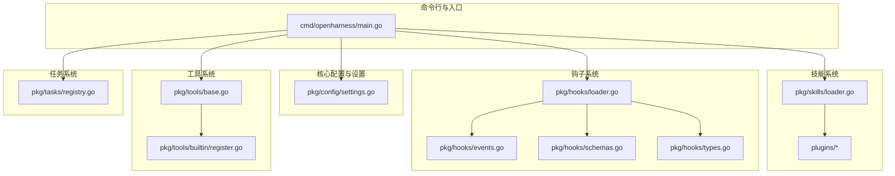
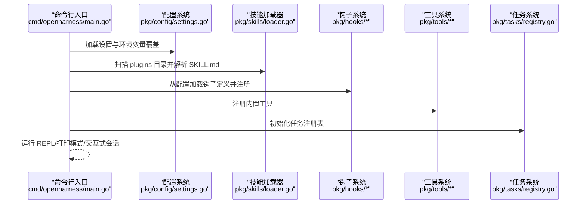
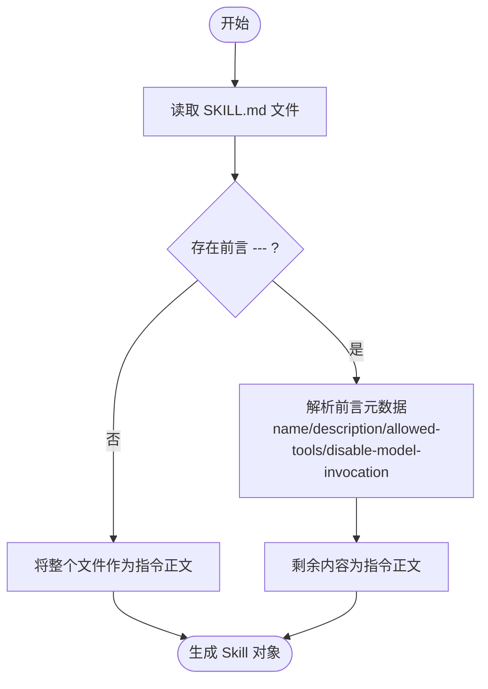
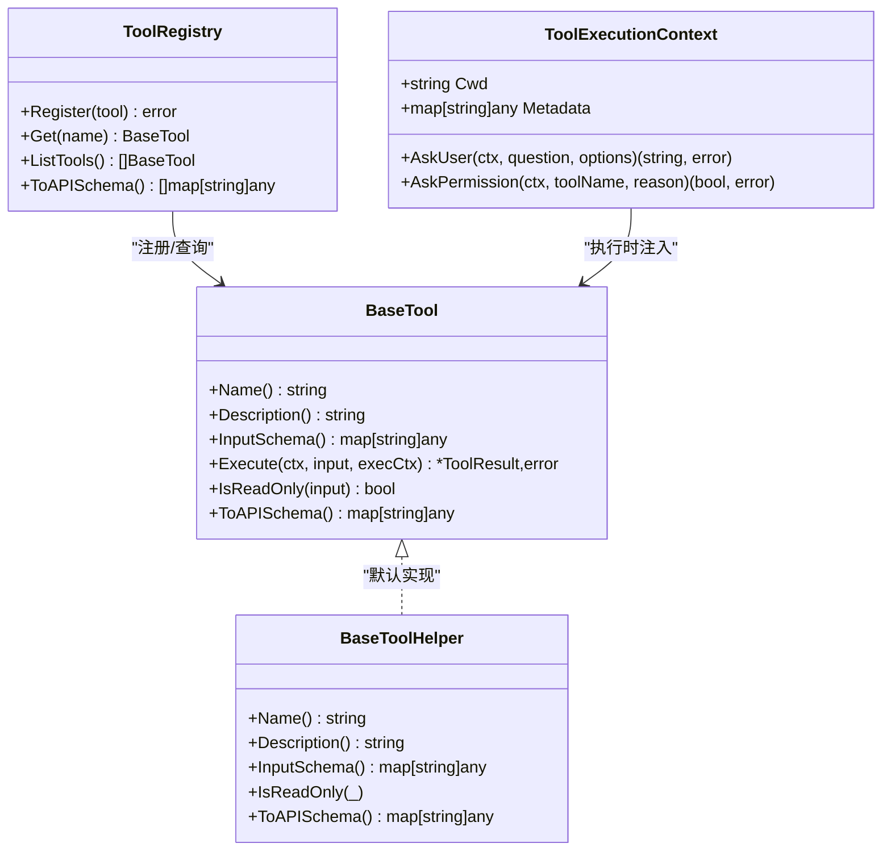
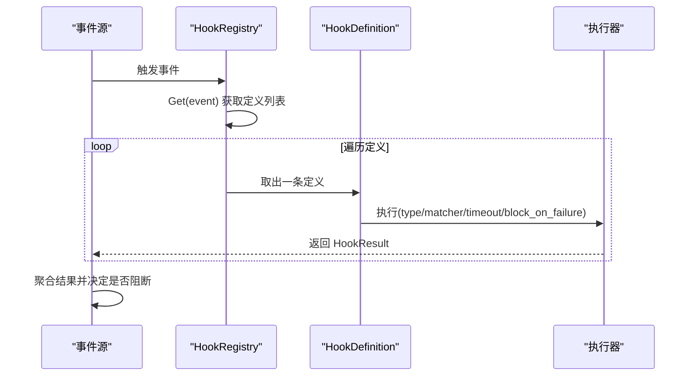
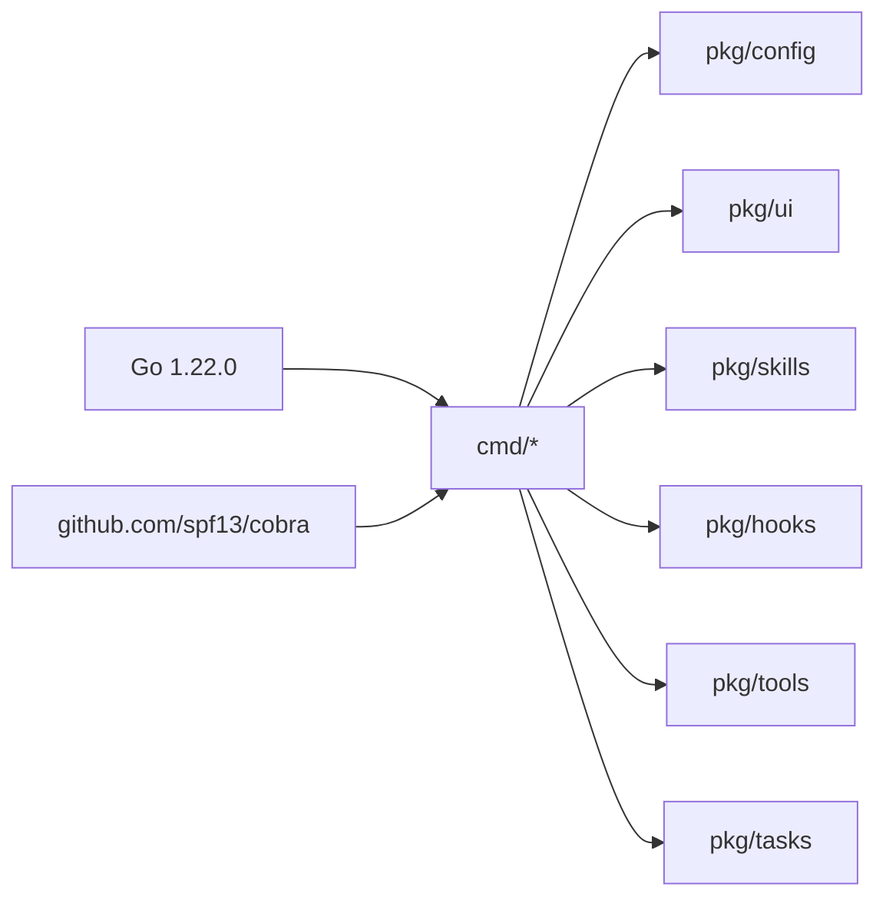

# 插件开发指南

<cite>
**本文引用的文件**
- [go.mod](file://go.mod)
- [cmd/openharness/main.go](file://cmd/openharness/main.go)
- [pkg/config/settings.go](file://pkg/config/settings.go)
- [pkg/skills/loader.go](file://pkg/skills/loader.go)
- [pkg/hooks/loader.go](file://pkg/hooks/loader.go)
- [pkg/hooks/events.go](file://pkg/hooks/events.go)
- [pkg/hooks/schemas.go](file://pkg/hooks/schemas.go)
- [pkg/hooks/types.go](file://pkg/hooks/types.go)
- [pkg/tools/base.go](file://pkg/tools/base.go)
- [pkg/tools/builtin/register.go](file://pkg/tools/builtin/register.go)
- [pkg/tasks/registry.go](file://pkg/tasks/registry.go)
- [plugins/anthropic/skills/code-review/SKILL.md](file://plugins/anthropic/skills/code-review/SKILL.md)
- [plugins/superpowers/skills/using-superpowers/SKILL.md](file://plugins/superpowers/skills/using-superpowers/SKILL.md)
- [plugins/superpowers/skills/brainstorming/SKILL.md](file://plugins/superpowers/skills/brainstorming/SKILL.md)
- [plugins/superpowers/skills/systematic-debugging/SKILL.md](file://plugins/superpowers/skills/systematic-debugging/SKILL.md)
</cite>

## 目录
1. [简介](#简介)
2. [项目结构](#项目结构)
3. [核心组件](#核心组件)
4. [架构总览](#架构总览)
5. [详细组件分析](#详细组件分析)
6. [依赖关系分析](#依赖关系分析)
7. [性能考量](#性能考量)
8. [故障排查指南](#故障排查指南)
9. [结论](#结论)
10. [附录](#附录)

## 简介
本指南面向希望在 OpenHarness 生态中开发“技能插件”和“工具插件”的开发者，系统讲解插件架构设计、开发方法、环境搭建、构建与测试、插件加载与生命周期管理、动态注册、打包分发与版本管理、调试与性能优化、安全注意事项以及高级扩展实践。文档以仓库现有代码为依据，结合实际文件路径与结构进行说明，帮助你从零到一完成高质量插件开发。

## 项目结构
OpenHarness 采用模块化分层组织：命令行入口位于 cmd，核心能力分布在 pkg（配置、工具、任务、钩子、权限等），插件资源位于 plugins。插件体系由“技能插件”和“工具插件”两部分组成，前者通过 Markdown + 前言元数据描述技能内容，后者通过统一的工具接口注册与执行。

图表来源
- [cmd/openharness/main.go:15-102](file://cmd/openharness/main.go#L15-L102)
- [pkg/config/settings.go:97-142](file://pkg/config/settings.go#L97-L142)
- [pkg/skills/loader.go:21-60](file://pkg/skills/loader.go#L21-L60)
- [pkg/hooks/loader.go:42-65](file://pkg/hooks/loader.go#L42-L65)
- [pkg/hooks/events.go:6-15](file://pkg/hooks/events.go#L6-L15)
- [pkg/hooks/schemas.go:25-94](file://pkg/hooks/schemas.go#L25-L94)
- [pkg/hooks/types.go:4-22](file://pkg/hooks/types.go#L4-L22)
- [pkg/tools/base.go:81-132](file://pkg/tools/base.go#L81-L132)
- [pkg/tools/builtin/register.go:7-29](file://pkg/tools/builtin/register.go#L7-L29)
- [pkg/tasks/registry.go:13-28](file://pkg/tasks/registry.go#L13-L28)

章节来源
- [cmd/openharness/main.go:15-102](file://cmd/openharness/main.go#L15-L102)
- [pkg/config/settings.go:97-142](file://pkg/config/settings.go#L97-L142)

## 核心组件
- 配置与设置：集中管理模型、令牌、权限、内存、插件启用列表、MCP 服务器等，支持从文件与环境变量加载。
- 技能加载器：扫描 plugins 目录，解析 SKILL.md，生成虚拟插件索引与子技能前缀化列表。
- 钩子系统：事件驱动的生命周期钩子，支持命令、提示词、HTTP、智能体四类定义，可阻断或输出结果。
- 工具系统：统一的工具接口与注册表，内置工具通过注册函数集中注册。
- 任务系统：任务创建、状态管理、消息与输出收集、取消控制等。

章节来源
- [pkg/config/settings.go:97-142](file://pkg/config/settings.go#L97-L142)
- [pkg/skills/loader.go:21-124](file://pkg/skills/loader.go#L21-L124)
- [pkg/hooks/loader.go:42-90](file://pkg/hooks/loader.go#L42-L90)
- [pkg/hooks/schemas.go:25-94](file://pkg/hooks/schemas.go#L25-L94)
- [pkg/tools/base.go:81-132](file://pkg/tools/base.go#L81-L132)
- [pkg/tasks/registry.go:13-191](file://pkg/tasks/registry.go#L13-L191)

## 架构总览
OpenHarness 的插件体系围绕“配置驱动 + 文件约定 + 接口抽象”展开。CLI 启动后读取配置，加载技能与钩子，初始化工具注册表，并根据用户输入或会话上下文选择合适的技能与工具执行。

图表来源
- [cmd/openharness/main.go:46-76](file://cmd/openharness/main.go#L46-L76)
- [pkg/config/settings.go:160-195](file://pkg/config/settings.go#L160-L195)
- [pkg/skills/loader.go:62-124](file://pkg/skills/loader.go#L62-L124)
- [pkg/hooks/loader.go:48-65](file://pkg/hooks/loader.go#L48-L65)
- [pkg/tools/builtin/register.go:7-29](file://pkg/tools/builtin/register.go#L7-L29)
- [pkg/tasks/registry.go:19-28](file://pkg/tasks/registry.go#L19-L28)

## 详细组件分析

### 技能插件开发
技能插件通过目录内嵌的 SKILL.md 文件描述，使用 YAML 风格前言元数据声明名称、描述、允许工具、禁用模型调用等；解析器负责提取元数据与正文指令，生成 Skill 结构供引擎使用。

- 开发要点
  - 使用标准前言元数据字段：name、description、allowed-tools、disable-model-invocation 等。
  - 指令正文遵循清晰的步骤与约束，便于模型按流程执行。
  - 子技能前缀化与虚拟插件索引：插件目录下 skills 子目录中的每个子技能会被自动加上“插件名:技能名”的前缀，并生成顶层索引技能，避免命名冲突。
  - 解析流程：读取文件 → 判断是否存在前言 → 提取元数据 → 剩余作为指令正文。

图表来源
- [pkg/skills/loader.go:127-197](file://pkg/skills/loader.go#L127-L197)

章节来源
- [pkg/skills/loader.go:21-124](file://pkg/skills/loader.go#L21-L124)
- [pkg/skills/loader.go:127-197](file://pkg/skills/loader.go#L127-L197)
- [plugins/anthropic/skills/code-review/SKILL.md:1-94](file://plugins/anthropic/skills/code-review/SKILL.md#L1-L94)
- [plugins/superpowers/skills/using-superpowers/SKILL.md:1-118](file://plugins/superpowers/skills/using-superpowers/SKILL.md#L1-L118)

### 工具插件开发
工具插件通过实现统一的 BaseTool 接口并注册到 ToolRegistry 中，即可被技能与钩子系统调用。内置工具通过 RegisterAll 统一注册，新工具只需实现必要方法并加入注册列表。

- 开发要点
  - 实现 BaseTool 接口：Name、Description、InputSchema、Execute、IsReadOnly、ToAPISchema。
  - 使用 ToolExecutionContext 传递工作目录与回调（如询问用户、请求权限）。
  - 通过 ToolRegistry.Register 完成注册，避免重复注册。
  - 可参考内置工具注册方式，保持一致的命名与行为。

图表来源
- [pkg/tools/base.go:51-132](file://pkg/tools/base.go#L51-L132)
- [pkg/tools/builtin/register.go:7-29](file://pkg/tools/builtin/register.go#L7-L29)

章节来源
- [pkg/tools/base.go:51-132](file://pkg/tools/base.go#L51-L132)
- [pkg/tools/builtin/register.go:7-29](file://pkg/tools/builtin/register.go#L7-L29)

### 钩子系统与生命周期管理
钩子系统提供事件驱动的生命周期扩展点，支持命令、提示词、HTTP、智能体四种类型定义，可设置匹配器、超时、失败阻断等。配置文件中以事件名为键，值为定义数组，加载器负责反序列化与默认值应用。

- 生命周期事件
  - pre_tool_use：工具调用前触发
  - post_tool_use：工具调用后触发
  - on_error：发生错误时触发
  - on_notification：通知事件触发

- 配置与加载
  - HooksConfig 映射事件名到原始 JSON 定义数组
  - FromSettings 将配置转换为 HookRegistry
  - applyDefaults 应用类型相关的默认行为（如某些类型默认阻断）

图表来源
- [pkg/hooks/events.go:6-15](file://pkg/hooks/events.go#L6-L15)
- [pkg/hooks/schemas.go:107-164](file://pkg/hooks/schemas.go#L107-L164)
- [pkg/hooks/loader.go:48-65](file://pkg/hooks/loader.go#L48-L65)
- [pkg/hooks/types.go:4-22](file://pkg/hooks/types.go#L4-L22)

章节来源
- [pkg/hooks/events.go:6-15](file://pkg/hooks/events.go#L6-L15)
- [pkg/hooks/schemas.go:25-94](file://pkg/hooks/schemas.go#L25-L94)
- [pkg/hooks/loader.go:42-90](file://pkg/hooks/loader.go#L42-L90)
- [pkg/hooks/types.go:4-22](file://pkg/hooks/types.go#L4-L22)

### 插件加载机制与动态注册
- 技能插件加载
  - LoadPlugins 扫描 plugins 目录，遍历每个插件的 skills 子目录，解析子技能并生成带前缀的子技能列表，同时生成顶层索引技能。
  - LoadSkills 支持两种发现方式：目录内含 SKILL.md 或直接扫描 .md 文件。
- 工具插件注册
  - CreateDefaultToolRegistry + RegisterAll 创建并注册内置工具，新工具加入注册列表即可生效。
- 配置驱动的启用
  - Settings.EnabledPlugins 控制插件启用状态，配合 CLI 子命令进行管理（例如 MCP 服务器管理）。

章节来源
- [pkg/skills/loader.go:62-124](file://pkg/skills/loader.go#L62-L124)
- [pkg/skills/loader.go:21-60](file://pkg/skills/loader.go#L21-L60)
- [pkg/tools/builtin/register.go:7-29](file://pkg/tools/builtin/register.go#L7-L29)
- [pkg/config/settings.go:111-114](file://pkg/config/settings.go#L111-L114)
- [cmd/openharness/main.go:165-231](file://cmd/openharness/main.go#L165-L231)

### 开发示例与最佳实践

- 技能插件模板
  - 建议参考现有插件的 SKILL.md 结构，使用标准前言字段，明确 allowed-tools 与 disable-model-invocation。
  - 示例参考：[plugins/anthropic/skills/code-review/SKILL.md:1-94](file://plugins/anthropic/skills/code-review/SKILL.md#L1-L94)、[plugins/superpowers/skills/using-superpowers/SKILL.md:1-118](file://plugins/superpowers/skills/using-superpowers/SKILL.md#L1-L118)。

- 工具插件实现
  - 实现 BaseTool 接口，确保 InputSchema 与 ToAPISchema 一致，Execute 内部处理上下文与错误。
  - 参考工具基类与注册方式：[pkg/tools/base.go:51-132](file://pkg/tools/base.go#L51-L132)、[pkg/tools/builtin/register.go:7-29](file://pkg/tools/builtin/register.go#L7-L29)。

- 配置文件格式
  - Settings 结构体定义了 API、权限、内存、钩子、插件启用、MCP 服务器等字段，支持 JSON 序列化与环境变量覆盖。
  - 参考：[pkg/config/settings.go:97-142](file://pkg/config/settings.go#L97-L142)、[pkg/config/settings.go:160-195](file://pkg/config/settings.go#L160-L195)。

- 典型技能流程参考
  - 头脑风暴：强调先设计再实现，严格流程与检查清单。参考：[plugins/superpowers/skills/brainstorming/SKILL.md:1-165](file://plugins/superpowers/skills/brainstorming/SKILL.md#L1-L165)。
  - 系统化调试：四阶段根因调查与最小验证修复。参考：[plugins/superpowers/skills/systematic-debugging/SKILL.md:1-297](file://plugins/superpowers/skills/systematic-debugging/SKILL.md#L1-L297)。

章节来源
- [plugins/anthropic/skills/code-review/SKILL.md:1-94](file://plugins/anthropic/skills/code-review/SKILL.md#L1-L94)
- [plugins/superpowers/skills/using-superpowers/SKILL.md:1-118](file://plugins/superpowers/skills/using-superpowers/SKILL.md#L1-L118)
- [plugins/superpowers/skills/brainstorming/SKILL.md:1-165](file://plugins/superpowers/skills/brainstorming/SKILL.md#L1-L165)
- [plugins/superpowers/skills/systematic-debugging/SKILL.md:1-297](file://plugins/superpowers/skills/systematic-debugging/SKILL.md#L1-L297)
- [pkg/tools/base.go:51-132](file://pkg/tools/base.go#L51-L132)
- [pkg/tools/builtin/register.go:7-29](file://pkg/tools/builtin/register.go#L7-L29)
- [pkg/config/settings.go:97-142](file://pkg/config/settings.go#L97-L142)
- [pkg/config/settings.go:160-195](file://pkg/config/settings.go#L160-L195)

## 依赖关系分析
- 语言与运行时
  - Go 1.22.0，使用 cobra 作为 CLI 框架。
- 外部依赖
  - 包含 JSON 解析、日志、并发、反射等常用库，以及与 OpenAI/MCP 相关的组件。
- 项目内依赖
  - CLI 依赖配置、UI、工具、任务、钩子等模块；技能系统依赖文件解析与插件目录约定。

图表来源
- [go.mod:3-43](file://go.mod#L3-L43)
- [cmd/openharness/main.go:4-13](file://cmd/openharness/main.go#L4-L13)

章节来源
- [go.mod:3-43](file://go.mod#L3-L43)
- [cmd/openharness/main.go:4-13](file://cmd/openharness/main.go#L4-L13)

## 性能考量
- 并发与锁
  - 工具注册表与钩子注册表均使用读写锁保护，避免竞态；建议在高频调用场景下减少不必要的写操作。
- I/O 与解析
  - 技能解析涉及文件读取与文本扫描，建议缓存已解析技能或限制扫描深度；对大型仓库可按需延迟加载。
- 超时与阻断
  - 钩子定义支持超时与失败阻断，合理设置超时阈值，避免长时间阻塞主流程。
- 任务管理
  - 任务注册表提供原子计数与时间戳更新，注意在高并发下避免频繁创建销毁任务。

章节来源
- [pkg/tools/base.go:81-132](file://pkg/tools/base.go#L81-L132)
- [pkg/hooks/loader.go:9-20](file://pkg/hooks/loader.go#L9-L20)
- [pkg/hooks/schemas.go:107-164](file://pkg/hooks/schemas.go#L107-L164)
- [pkg/tasks/registry.go:13-28](file://pkg/tasks/registry.go#L13-L28)

## 故障排查指南
- 配置问题
  - API 密钥解析优先级：实例值 > 环境变量 > 错误提示；确认配置文件路径与权限。
  - 环境变量覆盖：支持 ANTHROPIC_API_KEY、ANTHROPIC_MODEL、ANTHROPIC_BASE_URL 等。
- 技能加载问题
  - plugins 目录不存在或不可读时返回空列表；检查目录权限与文件编码。
  - 子技能未显示：确认 SKILL.md 前言字段完整且名称非空。
- 钩子执行问题
  - 未知事件或类型：检查事件名与 type 字段；查看默认值应用逻辑。
  - 匹配器与阻断：确认 matcher 正则与 block_on_failure 设置。
- 工具执行问题
  - 重复注册：避免同名工具多次注册；检查注册顺序。
  - 上下文缺失：确保 ToolExecutionContext 提供正确的 Cwd 与回调。

章节来源
- [pkg/config/settings.go:144-154](file://pkg/config/settings.go#L144-L154)
- [pkg/config/settings.go:197-211](file://pkg/config/settings.go#L197-L211)
- [pkg/skills/loader.go:26-32](file://pkg/skills/loader.go#L26-L32)
- [pkg/hooks/loader.go:50-54](file://pkg/hooks/loader.go#L50-L54)
- [pkg/hooks/schemas.go:107-164](file://pkg/hooks/schemas.go#L107-L164)
- [pkg/tools/base.go:92-102](file://pkg/tools/base.go#L92-L102)

## 结论
OpenHarness 的插件体系以“配置 + 文件约定 + 接口抽象”为核心，既保证了灵活性，又提供了清晰的扩展边界。通过规范化的技能与工具开发流程、完善的生命周期钩子与权限控制，开发者可以快速构建高质量的插件生态。建议在开发过程中遵循本文档的结构化流程与最佳实践，确保插件的可维护性、可测试性与安全性。

## 附录

### 开发环境搭建与构建
- 环境要求
  - Go 1.22.0
  - 依赖管理：go mod tidy
- 构建与运行
  - 使用 go build 或 go run 在 cmd 目录下构建 CLI
  - 运行 openharness 命令，结合 --help 查看可用选项
- 测试策略
  - 单元测试：针对工具与钩子定义的反序列化与默认值应用
  - 集成测试：模拟技能加载、工具执行与钩子触发
  - 端到端测试：通过 CLI 与真实配置文件验证插件加载与执行

章节来源
- [go.mod:3-43](file://go.mod#L3-L43)
- [cmd/openharness/main.go:46-76](file://cmd/openharness/main.go#L46-L76)

### 插件打包、分发与版本管理
- 目录结构
  - 插件应放置于 plugins/<插件名>/skills 下，每个技能一个 SKILL.md
- 版本管理
  - 建议在插件根目录维护变更日志与版本号，遵循语义化版本
- 分发建议
  - 通过包管理器或源码发布；提供最小可运行示例与 README

章节来源
- [pkg/skills/loader.go:62-124](file://pkg/skills/loader.go#L62-L124)

### 安全考虑
- 权限控制
  - 使用 PermissionSettings 精细控制工具与路径访问，避免危险命令
- 钩子安全
  - 限制命令钩子的执行范围与超时；谨慎使用 HTTP 钩子
- 输入校验
  - 工具输入 Schema 与 ToAPISchema 保持一致，防止越权参数

章节来源
- [pkg/config/settings.go:37-44](file://pkg/config/settings.go#L37-L44)
- [pkg/hooks/schemas.go:25-94](file://pkg/hooks/schemas.go#L25-L94)
- [pkg/tools/base.go:73-79](file://pkg/tools/base.go#L73-L79)

### 高级扩展与定制
- 自定义钩子类型
  - 在 hooks 包中新增定义并扩展 UnmarshalHookDefinition 与默认值逻辑
- 动态工具注册
  - 在运行时根据配置或环境条件注册/注销工具
- 任务编排
  - 利用任务注册表的状态机与消息队列，实现复杂工作流

章节来源
- [pkg/hooks/schemas.go:107-164](file://pkg/hooks/schemas.go#L107-L164)
- [pkg/tools/builtin/register.go:7-29](file://pkg/tools/builtin/register.go#L7-L29)
- [pkg/tasks/registry.go:30-191](file://pkg/tasks/registry.go#L30-L191)