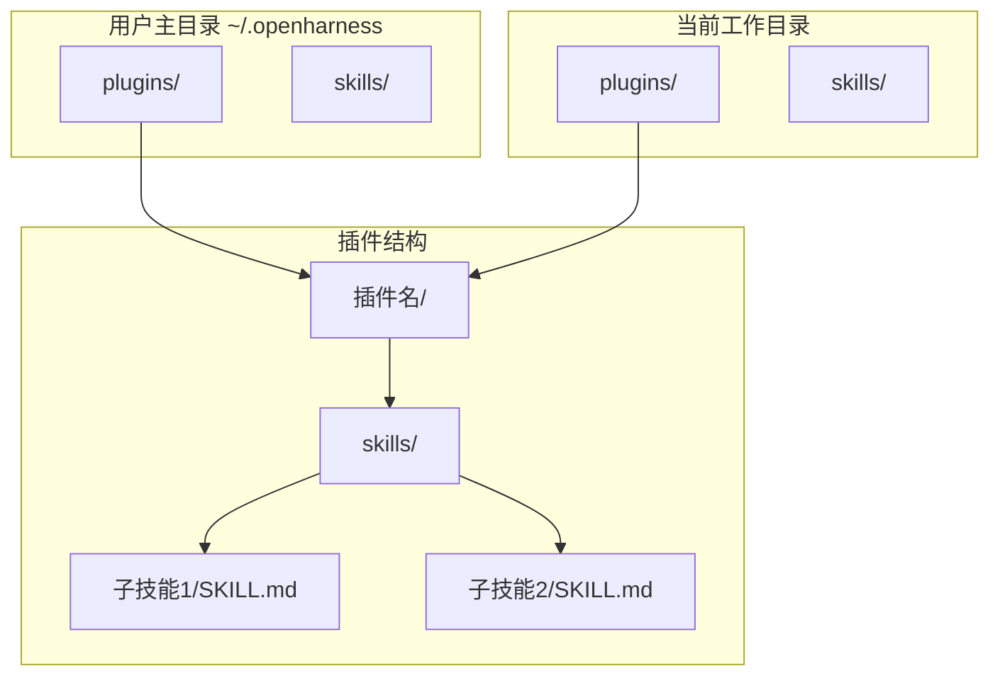
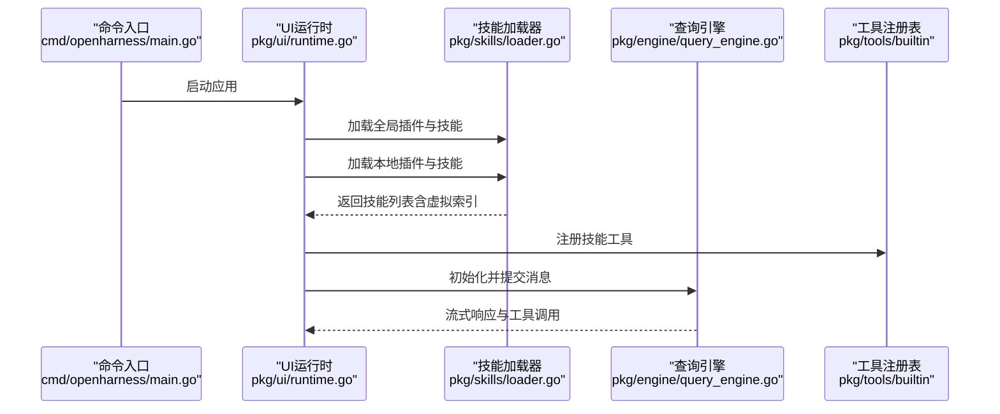
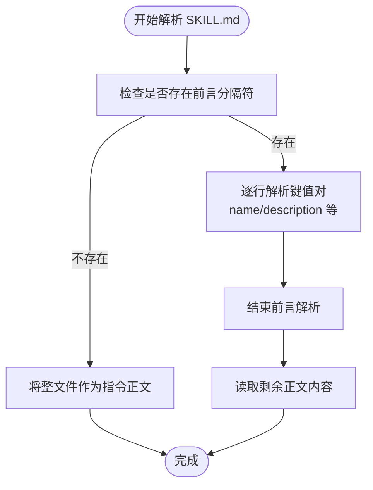
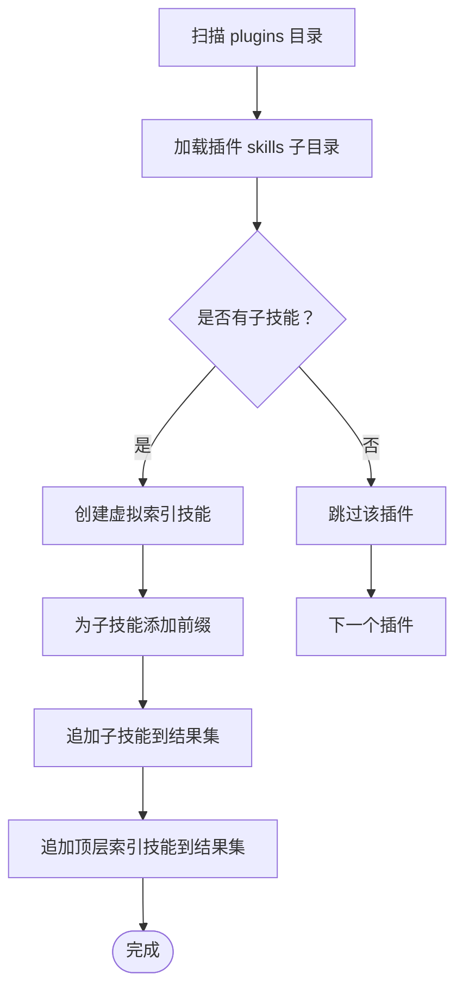
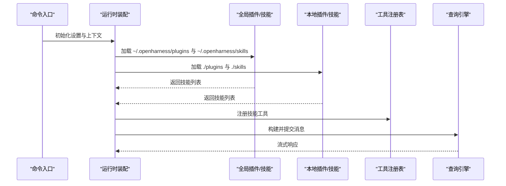
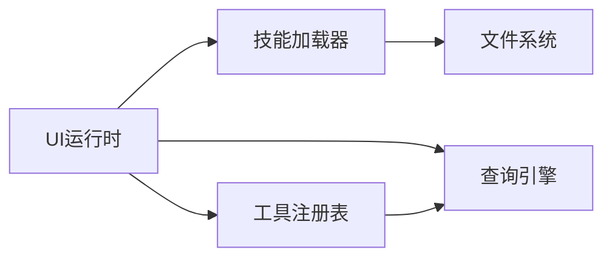
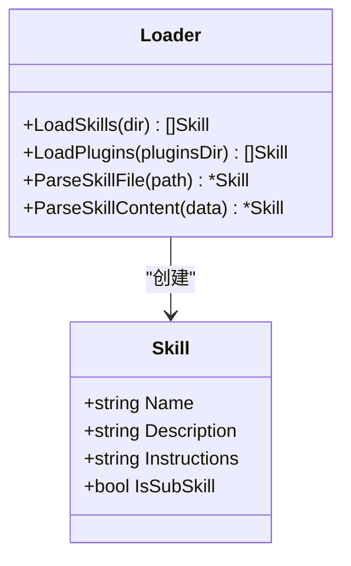

# 插件架构设计

<cite>
**本文档引用的文件**
- [loader.go](file://pkg/skills/loader.go)
- [loader_test.go](file://pkg/skills/loader_test.go)
- [runtime.go](file://pkg/ui/runtime.go)
- [app.go](file://pkg/ui/app.go)
- [settings.go](file://pkg/config/settings.go)
- [main.go](file://cmd/openharness/main.go)
- [SKILL.md](file://plugins/anthropic/skills/code-review/SKILL.md)
- [SKILL.md](file://plugins/superpowers/skills/brainstorming/SKILL.md)
- [SKILL.md](file://plugins/superpowers/skills/writing-skills/SKILL.md)
- [SKILL.md](file://plugins/karpathy/skills/SKILL.md)
</cite>

## 目录
1. [简介](#简介)
2. [项目结构](#项目结构)
3. [核心组件](#核心组件)
4. [架构总览](#架构总览)
5. [详细组件分析](#详细组件分析)
6. [依赖关系分析](#依赖关系分析)
7. [性能考量](#性能考量)
8. [故障排查指南](#故障排查指南)
9. [结论](#结论)
10. [附录](#附录)

## 简介
本文件系统性阐述 OpenHarness 插件架构的设计与实现，重点覆盖以下方面：
- 插件目录结构与文件命名规范
- 技能文件（SKILL.md）的格式规范与解析机制
- 插件虚拟索引机制：如何为插件创建顶层技能索引，并为子技能添加前缀以避免命名冲突
- 插件目录布局最佳实践：skills 子目录的组织方式与文件命名约定
- 插件加载流程与组件交互关系的架构图与序列图

## 项目结构
OpenHarness 的插件体系由“全局插件”和“本地插件”两层构成，分别位于用户主目录与工作目录下的 plugins 子目录中。每个插件内部通过 skills 子目录承载具体技能文件（SKILL.md），并通过统一的加载器解析为可执行的技能集合。

**图表来源**
- [runtime.go:79-97](file://pkg/ui/runtime.go#L79-L97)
- [SKILL.md:1-94](file://plugins/anthropic/skills/code-review/SKILL.md#L1-L94)

**章节来源**
- [runtime.go:79-97](file://pkg/ui/runtime.go#L79-L97)

## 核心组件
- 技能加载器（Skills Loader）
  - 负责扫描目录中的 SKILL.md 或 .md 文件，解析 YAML 前言部分的 name/description 字段，并提取正文作为指令内容。
  - 支持插件目录结构，自动生成“虚拟索引技能”，并对子技能名称进行前缀化处理，避免命名冲突。
- 运行时装配（Runtime Assembly）
  - 在应用启动时，从用户主目录与当前工作目录加载全局与本地插件及技能，组装工具注册表与系统提示词，供引擎调用。
- 配置系统（Settings）
  - 提供插件启用开关、权限控制、输出风格等运行参数，影响技能可用性与行为。

**章节来源**
- [loader.go:13-197](file://pkg/skills/loader.go#L13-L197)
- [runtime.go:79-97](file://pkg/ui/runtime.go#L79-L97)
- [settings.go:97-125](file://pkg/config/settings.go#L97-L125)

## 架构总览
下图展示了 OpenHarness 插件加载的整体流程：从命令入口到 UI 运行时，再到技能加载与工具注册，最终进入查询引擎执行阶段。

**图表来源**
- [main.go:15-76](file://cmd/openharness/main.go#L15-L76)
- [runtime.go:79-97](file://pkg/ui/runtime.go#L79-L97)
- [loader.go:62-124](file://pkg/skills/loader.go#L62-L124)

## 详细组件分析

### 技能文件（SKILL.md）格式规范
- 前言部分（YAML 风格）
  - 必填字段：name、description
  - 其他字段示例：license 等
  - 解析逻辑：读取首行是否为分隔符，若存在则逐行解析键值对，直到再次遇到分隔符为止；其余内容作为指令正文。
- 指令内容组织
  - 可采用 Markdown 结构，包含概述、何时使用、核心模式、快速参考、实现细节、常见误区等章节。
  - 对于复杂技能，建议拆分为多个文件或脚本，通过链接引用，保持 SKILL.md 的简洁性与可检索性。

**图表来源**
- [loader.go:126-197](file://pkg/skills/loader.go#L126-L197)

**章节来源**
- [SKILL.md:1-94](file://plugins/anthropic/skills/code-review/SKILL.md#L1-L94)
- [SKILL.md:1-165](file://plugins/superpowers/skills/brainstorming/SKILL.md#L1-L165)
- [SKILL.md:95-137](file://plugins/superpowers/skills/writing-skills/SKILL.md#L95-L137)
- [SKILL.md:1-68](file://plugins/karpathy/skills/SKILL.md#L1-L68)
- [loader.go:126-197](file://pkg/skills/loader.go#L126-L197)

### 插件虚拟索引机制
- 插件目录扫描
  - 遍历 plugins 目录下的每个子目录，定位其 skills 子目录，收集所有 SKILL.md 或 .md 技能文件。
- 虚拟索引生成
  - 为每个插件生成一个“顶层索引技能”，描述该插件包含的子技能数量，并列出子技能的前缀化名称与简要描述。
  - 子技能名称统一加上“插件名:子技能名”的前缀，确保在全局命名空间内唯一。
  - 子技能的指令正文会附加“来自某插件”的头部信息，便于模型识别其来源。
- 可见性控制
  - 顶层索引技能标记为可见（IsSubSkill=false），子技能标记为不可见（IsSubSkill=true），从而在可用技能列表中仅显示顶层索引，避免重复与混乱。

**图表来源**
- [loader.go:62-124](file://pkg/skills/loader.go#L62-L124)

**章节来源**
- [loader.go:62-124](file://pkg/skills/loader.go#L62-L124)

### 插件目录布局最佳实践
- 目录结构
  - 插件根目录下必须包含 skills 子目录，用于存放 SKILL.md 与相关支持文件。
  - 子技能目录建议采用“动作-名词”或“领域-主题”的语义化命名，便于检索与维护。
- 文件命名约定
  - 主文件：SKILL.md（必需）
  - 支持文件：按需放置脚本、模板、参考文档等，避免将大量内容写入 SKILL.md。
- 命名与描述
  - name 字段使用小写字母、数字与短横线组合，避免特殊字符。
  - description 字段聚焦“触发条件与症状”，而非技能流程摘要，提升搜索命中率与模型正确加载概率。
- 内容组织
  - 将“技术细节”移至独立文件，SKILL.md 保持精炼，遵循“概览-何时使用-核心模式-快速参考-实现-常见误区”的结构。

**章节来源**
- [SKILL.md:72-137](file://plugins/superpowers/skills/writing-skills/SKILL.md#L72-L137)
- [SKILL.md:140-277](file://plugins/superpowers/skills/writing-skills/SKILL.md#L140-L277)

### 运行时装配与技能加载流程
- 入口与初始化
  - 命令入口负责解析参数并启动 UI；UI 在构建运行时阶段加载技能与插件。
- 加载顺序
  - 先加载用户主目录下的全局插件与技能，再加载当前工作目录下的本地插件与技能。
  - 将加载得到的技能注册到工具注册表，供后续查询引擎调用。
- 执行路径
  - 用户输入经由查询引擎提交，引擎根据系统提示词与工具能力选择合适的技能执行，返回流式响应。

**图表来源**
- [main.go:15-76](file://cmd/openharness/main.go#L15-L76)
- [runtime.go:79-97](file://pkg/ui/runtime.go#L79-L97)

**章节来源**
- [main.go:15-76](file://cmd/openharness/main.go#L15-L76)
- [runtime.go:79-97](file://pkg/ui/runtime.go#L79-L97)

## 依赖关系分析
- 组件耦合
  - UI 运行时依赖技能加载器与工具注册表，形成清晰的装配边界。
  - 技能加载器与文件系统交互，解析 YAML 前言与正文，不直接依赖业务逻辑。
- 外部依赖
  - 配置系统提供 API 密钥解析、权限模式、输出风格等参数，间接影响技能可用性与行为。
- 潜在循环依赖
  - 当前结构中未发现循环依赖；加载器仅单向依赖文件系统与字符串处理，UI 仅依赖加载器与工具注册表。

**图表来源**
- [runtime.go:79-97](file://pkg/ui/runtime.go#L79-L97)
- [loader.go:21-60](file://pkg/skills/loader.go#L21-L60)

**章节来源**
- [runtime.go:79-97](file://pkg/ui/runtime.go#L79-L97)
- [loader.go:21-60](file://pkg/skills/loader.go#L21-L60)

## 性能考量
- 加载性能
  - 插件与技能加载发生在应用启动阶段，建议控制 SKILL.md 的体量与嵌套文件数量，避免在热路径上引入过多 IO。
- 命名冲突与索引效率
  - 通过虚拟索引与前缀化命名，减少全局命名空间冲突，提高技能检索效率。
- 输出与日志
  - 在非交互模式下，UI 层提供多种输出格式（文本、JSON、流式 JSON），可根据场景选择以平衡可观测性与性能。

[本节为通用指导，无需特定文件来源]

## 故障排查指南
- 插件未被加载
  - 确认插件目录结构完整（plugins/<插件名>/skills/），且包含至少一个 SKILL.md 或 .md 文件。
  - 检查 SKILL.md 是否包含有效的 YAML 前言分隔符与必填字段。
- 命名冲突
  - 若出现同名技能，确认是否来自不同插件；系统会自动为子技能添加前缀，应使用“插件名:子技能名”的全名调用。
- 权限与输出
  - 如需调整权限模式、输出风格或模型参数，可通过配置系统或命令行参数进行设置。

**章节来源**
- [loader.go:62-124](file://pkg/skills/loader.go#L62-L124)
- [settings.go:97-125](file://pkg/config/settings.go#L97-L125)

## 结论
OpenHarness 的插件架构通过“虚拟索引 + 前缀化命名”的策略，在保证命名空间唯一性的同时，提供了清晰的技能组织与检索体验。结合统一的 YAML 前言解析与灵活的文件组织方式，开发者可以高效地扩展与维护技能生态。未来可在以下方向持续优化：
- 增强插件元数据校验与错误报告
- 引入增量加载与缓存机制
- 提供插件开发与测试工具链

[本节为总结性内容，无需特定文件来源]

## 附录

### 技能加载器类图

**图表来源**
- [loader.go:13-197](file://pkg/skills/loader.go#L13-L197)

**章节来源**
- [loader.go:13-197](file://pkg/skills/loader.go#L13-L197)

### 技能加载单元测试要点
- 验证 YAML 前言解析：name 与 description 字段正确提取。
- 验证目录扫描：根目录 .md 文件与子目录 SKILL.md 文件均被识别。
- 验证命名冲突规避：子技能名称自动前缀化。

**章节来源**
- [loader_test.go:9-70](file://pkg/skills/loader_test.go#L9-L70)