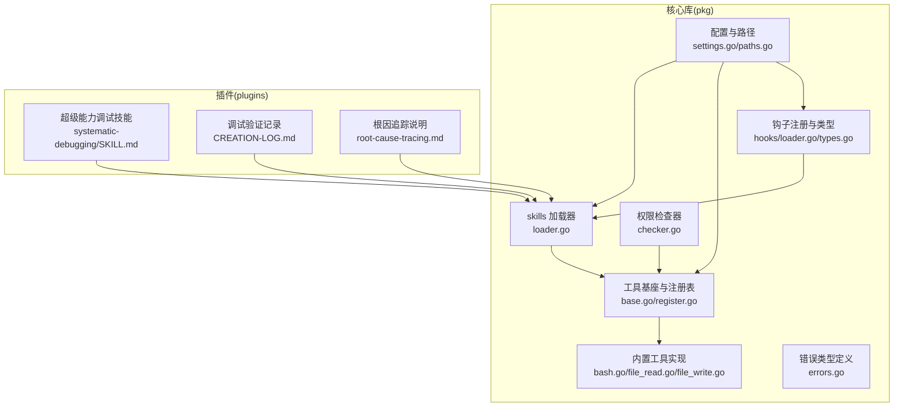
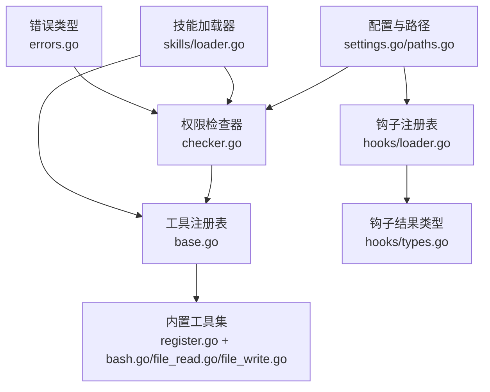
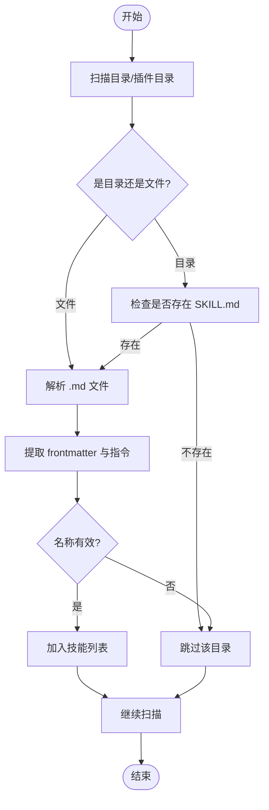
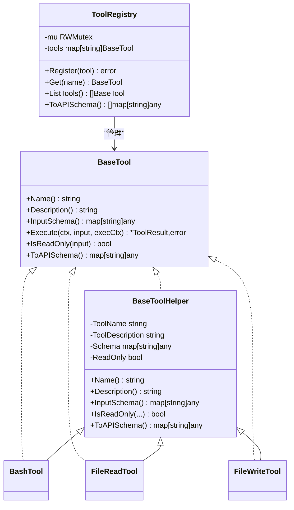
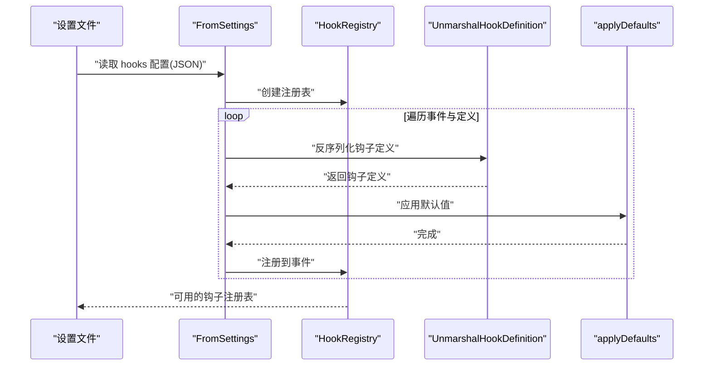
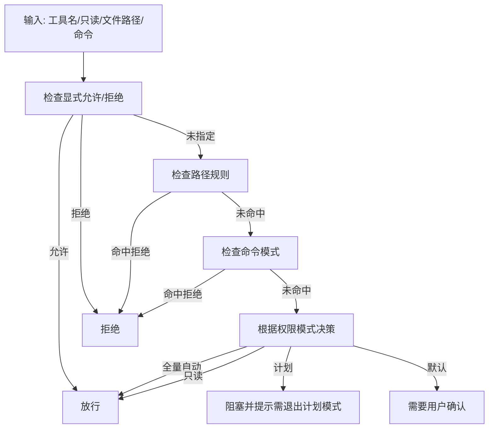
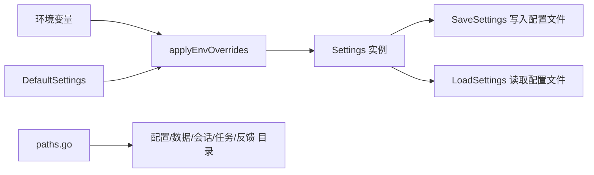
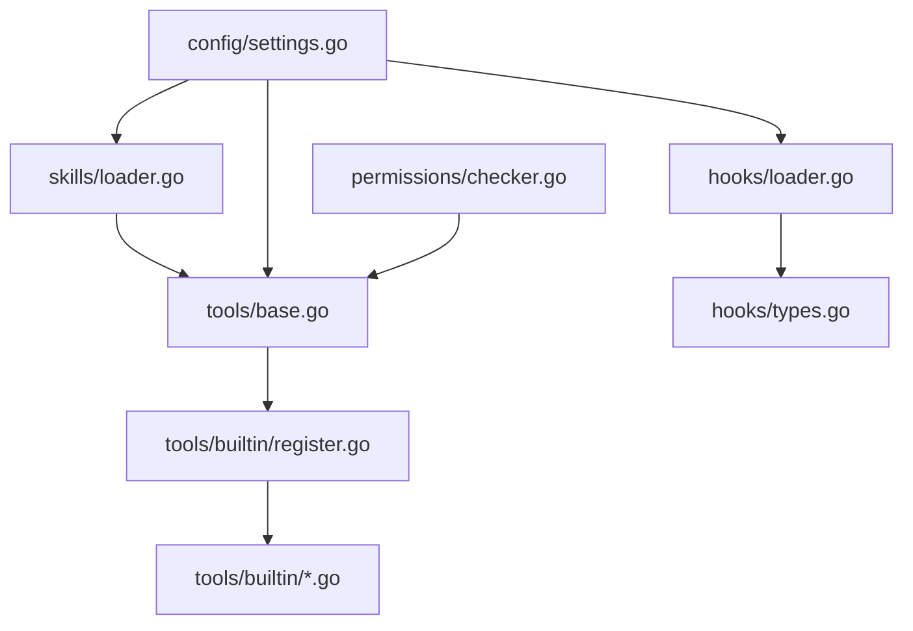

# 插件测试与调试

<cite>
**本文引用的文件**
- [loader_test.go](file://pkg/skills/loader_test.go)
- [loader.go](file://pkg/skills/loader.go)
- [loader.go](file://pkg/hooks/loader.go)
- [types.go](file://pkg/hooks/types.go)
- [base.go](file://pkg/tools/base.go)
- [register.go](file://pkg/tools/builtin/register.go)
- [bash.go](file://pkg/tools/builtin/bash.go)
- [file_read.go](file://pkg/tools/builtin/file_read.go)
- [file_write.go](file://pkg/tools/builtin/file_write.go)
- [settings.go](file://pkg/config/settings.go)
- [paths.go](file://pkg/config/paths.go)
- [checker.go](file://pkg/permissions/checker.go)
- [errors.go](file://pkg/types/errors.go)
- [SKILL.md](file://plugins/superpowers/skills/systematic-debugging/SKILL.md)
- [CREATION-LOG.md](file://plugins/superpowers/skills/systematic-debugging/CREATION-LOG.md)
- [root-cause-tracing.md](file://plugins/superpowers/skills/systematic-debugging/root-cause-tracing.md)
</cite>

## 目录
1. [引言](#引言)
2. [项目结构](#项目结构)
3. [核心组件](#核心组件)
4. [架构总览](#架构总览)
5. [详细组件分析](#详细组件分析)
6. [依赖分析](#依赖分析)
7. [性能考虑](#性能考虑)
8. [故障排查指南](#故障排查指南)
9. [结论](#结论)
10. [附录](#附录)

## 引言
本指南面向插件开发者与维护者，系统讲解在本项目中如何进行插件测试与调试。内容覆盖单元测试编写（含技能加载器与工具插件）、调试技巧（日志、错误追踪、性能分析）、多环境测试策略（开发/测试/生产），以及常见问题诊断与自动化测试/持续集成最佳实践。文档以仓库现有实现为依据，结合插件目录中的“系统化调试”技能文档，帮助你建立可复现、可验证、可回归的测试体系。

## 项目结构
本项目采用按功能域分层的组织方式：核心能力位于 pkg 下，插件位于 plugins 下。与测试和调试直接相关的关键模块包括：
- 技能加载与解析：pkg/skills
- 工具注册与执行：pkg/tools 及其内置工具
- 配置与路径：pkg/config
- 权限控制：pkg/permissions
- 错误类型：pkg/types
- 钩子注册与执行：pkg/hooks
- 插件样例与调试技能：plugins/superpowers/skills/systematic-debugging

图表来源
- [loader.go:21-60](file://pkg/skills/loader.go#L21-L60)
- [base.go:81-132](file://pkg/tools/base.go#L81-L132)
- [register.go:7-21](file://pkg/tools/builtin/register.go#L7-L21)
- [settings.go:97-125](file://pkg/config/settings.go#L97-L125)
- [paths.go:8-33](file://pkg/config/paths.go#L8-L33)
- [checker.go:23-82](file://pkg/permissions/checker.go#L23-L82)
- [loader.go:41-65](file://pkg/hooks/loader.go#L41-L65)
- [types.go:3-22](file://pkg/hooks/types.go#L3-L22)
- [errors.go:5-39](file://pkg/types/errors.go#L5-L39)
- [SKILL.md:1-120](file://plugins/superpowers/skills/systematic-debugging/SKILL.md#L1-L120)
- [CREATION-LOG.md:55-75](file://plugins/superpowers/skills/systematic-debugging/CREATION-LOG.md#L55-L75)
- [root-cause-tracing.md:163-170](file://plugins/superpowers/skills/systematic-debugging/root-cause-tracing.md#L163-L170)

章节来源
- [loader.go:21-60](file://pkg/skills/loader.go#L21-L60)
- [base.go:81-132](file://pkg/tools/base.go#L81-L132)
- [register.go:7-21](file://pkg/tools/builtin/register.go#L7-L21)
- [settings.go:97-125](file://pkg/config/settings.go#L97-L125)
- [paths.go:8-33](file://pkg/config/paths.go#L8-L33)
- [checker.go:23-82](file://pkg/permissions/checker.go#L23-L82)
- [loader.go:41-65](file://pkg/hooks/loader.go#L41-L65)
- [types.go:3-22](file://pkg/hooks/types.go#L3-L22)
- [errors.go:5-39](file://pkg/types/errors.go#L5-L39)
- [SKILL.md:1-120](file://plugins/superpowers/skills/systematic-debugging/SKILL.md#L1-L120)
- [CREATION-LOG.md:55-75](file://plugins/superpowers/skills/systematic-debugging/CREATION-LOG.md#L55-L75)
- [root-cause-tracing.md:163-170](file://plugins/superpowers/skills/systematic-debugging/root-cause-tracing.md#L163-L170)

## 核心组件
- 技能加载器：支持从目录扫描 SKILL.md 或 .md 文件，解析 YAML 风格的 frontmatter，生成 Skill 结构；支持插件集合加载并在技能名前缀去重。
- 工具基座与注册表：定义工具接口、执行上下文、结果封装，并提供线程安全的工具注册表；内置工具通过统一注册入口集中注册。
- 配置与路径：提供默认设置、环境变量覆盖、配置文件读写与目录约定（配置、数据、会话、任务、反馈等）。
- 权限检查器：基于工具名白/黑名单、路径规则、命令模式匹配与权限模式（默认/计划/全量自动）进行决策。
- 钩子系统：事件到钩子定义的注册表，支持从设置文件加载钩子配置并应用默认值。
- 错误类型：统一上游 API 错误类型与判定方法，便于上层处理与测试断言。

章节来源
- [loader.go:13-59](file://pkg/skills/loader.go#L13-L59)
- [loader.go:126-197](file://pkg/skills/loader.go#L126-L197)
- [base.go:51-59](file://pkg/tools/base.go#L51-L59)
- [base.go:81-132](file://pkg/tools/base.go#L81-L132)
- [register.go:7-21](file://pkg/tools/builtin/register.go#L7-L21)
- [settings.go:97-142](file://pkg/config/settings.go#L97-L142)
- [paths.go:8-33](file://pkg/config/paths.go#L8-L33)
- [checker.go:23-82](file://pkg/permissions/checker.go#L23-L82)
- [loader.go:41-65](file://pkg/hooks/loader.go#L41-L65)
- [errors.go:5-39](file://pkg/types/errors.go#L5-L39)

## 架构总览
下图展示测试与调试相关组件之间的交互关系，重点体现“配置→权限→工具→钩子→技能加载”的主链路，以及“内置工具注册→工具执行→结果返回”的执行路径。

图表来源
- [settings.go:97-142](file://pkg/config/settings.go#L97-L142)
- [paths.go:8-33](file://pkg/config/paths.go#L8-L33)
- [checker.go:23-82](file://pkg/permissions/checker.go#L23-L82)
- [base.go:81-132](file://pkg/tools/base.go#L81-L132)
- [register.go:7-21](file://pkg/tools/builtin/register.go#L7-L21)
- [bash.go:24-99](file://pkg/tools/builtin/bash.go#L24-L99)
- [file_read.go:25-99](file://pkg/tools/builtin/file_read.go#L25-L99)
- [file_write.go:23-80](file://pkg/tools/builtin/file_write.go#L23-L80)
- [loader.go:41-65](file://pkg/hooks/loader.go#L41-L65)
- [types.go:3-22](file://pkg/hooks/types.go#L3-L22)
- [loader.go:21-60](file://pkg/skills/loader.go#L21-L60)
- [errors.go:5-39](file://pkg/types/errors.go#L5-L39)

## 详细组件分析

### 技能加载器与测试用例
技能加载器负责从目录或插件目录中发现并解析技能文件，支持两种模式：
- 目录内存在 SKILL.md 的子目录：作为独立技能加载；
- 根目录下的 .md 文件：直接解析为技能；
- 插件集合加载：遍历 plugins 目录，为每个插件生成一个“虚拟索引技能”，并将子技能名加上前缀避免冲突。

单元测试覆盖了：
- 单文件解析：frontmatter 提取与指令拼接；
- 批量加载：根目录与子目录 SKILL.md 的识别与合并。

图表来源
- [loader.go:21-60](file://pkg/skills/loader.go#L21-L60)
- [loader.go:62-124](file://pkg/skills/loader.go#L62-L124)
- [loader.go:126-197](file://pkg/skills/loader.go#L126-L197)

章节来源
- [loader_test.go:9-35](file://pkg/skills/loader_test.go#L9-L35)
- [loader_test.go:37-70](file://pkg/skills/loader_test.go#L37-L70)
- [loader.go:21-60](file://pkg/skills/loader.go#L21-L60)
- [loader.go:62-124](file://pkg/skills/loader.go#L62-L124)
- [loader.go:126-197](file://pkg/skills/loader.go#L126-L197)

### 工具注册与执行流程
工具基座定义了统一接口与注册表，内置工具通过注册入口集中注册。工具执行上下文包含工作目录与元数据，并支持用户提问与权限请求回调。工具执行结果封装输出、错误标记与元数据。

图表来源
- [base.go:51-59](file://pkg/tools/base.go#L51-L59)
- [base.go:81-132](file://pkg/tools/base.go#L81-L132)
- [register.go:7-21](file://pkg/tools/builtin/register.go#L7-L21)
- [bash.go:24-99](file://pkg/tools/builtin/bash.go#L24-L99)
- [file_read.go:25-99](file://pkg/tools/builtin/file_read.go#L25-L99)
- [file_write.go:23-80](file://pkg/tools/builtin/file_write.go#L23-L80)

章节来源
- [base.go:51-59](file://pkg/tools/base.go#L51-L59)
- [base.go:81-132](file://pkg/tools/base.go#L81-L132)
- [register.go:7-21](file://pkg/tools/builtin/register.go#L7-L21)
- [bash.go:24-99](file://pkg/tools/builtin/bash.go#L24-L99)
- [file_read.go:25-99](file://pkg/tools/builtin/file_read.go#L25-L99)
- [file_write.go:23-80](file://pkg/tools/builtin/file_write.go#L23-L80)

### 钩子系统与配置加载
钩子注册表将事件映射到多个钩子定义，支持从设置文件加载并应用默认值。聚合结果用于判断是否阻塞及阻塞原因。

图表来源
- [loader.go:41-65](file://pkg/hooks/loader.go#L41-L65)
- [types.go:3-22](file://pkg/hooks/types.go#L3-L22)

章节来源
- [loader.go:41-65](file://pkg/hooks/loader.go#L41-L65)
- [types.go:3-22](file://pkg/hooks/types.go#L3-L22)

### 权限控制与测试要点
权限检查器根据配置的模式与规则决定工具是否允许执行，支持只读工具豁免、路径规则匹配与命令模式匹配。测试应覆盖：
- 显式允许/拒绝工具；
- 路径规则匹配（允许/拒绝）；
- 命令模式匹配；
- 不同权限模式的行为差异（默认/计划/全量自动）。

图表来源
- [checker.go:42-82](file://pkg/permissions/checker.go#L42-L82)

章节来源
- [checker.go:23-82](file://pkg/permissions/checker.go#L23-L82)

### 配置与路径约定
配置模块提供默认设置、环境变量覆盖与配置文件读写；路径模块提供配置、数据、会话、任务、反馈等目录约定，便于日志与状态持久化。

图表来源
- [settings.go:127-142](file://pkg/config/settings.go#L127-L142)
- [settings.go:197-211](file://pkg/config/settings.go#L197-L211)
- [settings.go:160-178](file://pkg/config/settings.go#L160-L178)
- [settings.go:180-195](file://pkg/config/settings.go#L180-L195)
- [paths.go:8-33](file://pkg/config/paths.go#L8-L33)

章节来源
- [settings.go:127-142](file://pkg/config/settings.go#L127-L142)
- [settings.go:197-211](file://pkg/config/settings.go#L197-L211)
- [settings.go:160-178](file://pkg/config/settings.go#L160-L178)
- [settings.go:180-195](file://pkg/config/settings.go#L180-L195)
- [paths.go:8-33](file://pkg/config/paths.go#L8-L33)

### 错误类型与测试断言
错误类型统一了上游 API 失败场景（认证失败、速率限制、请求失败），并提供类型判定函数，便于在测试中断言错误类型与消息。

章节来源
- [errors.go:5-39](file://pkg/types/errors.go#L5-L39)

### 插件样例与系统化调试
插件目录中的“系统化调试”技能提供了完整的调试流程与验证方法，强调“先定位根因再修复症状”，并通过多轮测试验证流程的有效性。

章节来源
- [SKILL.md:1-120](file://plugins/superpowers/skills/systematic-debugging/SKILL.md#L1-L120)
- [CREATION-LOG.md:55-75](file://plugins/superpowers/skills/systematic-debugging/CREATION-LOG.md#L55-L75)
- [root-cause-tracing.md:163-170](file://plugins/superpowers/skills/systematic-debugging/root-cause-tracing.md#L163-L170)

## 依赖分析
- 组件耦合度：技能加载器依赖工具注册表与权限检查器；工具注册表依赖工具基座；钩子系统依赖设置与类型；配置模块贯穿于权限、钩子与日志路径。
- 外部依赖：工具执行涉及系统命令与文件操作；钩子配置来自设置文件；权限规则来源于配置。
- 潜在循环依赖：当前实现未见直接循环依赖，但建议在新增插件时保持“配置→权限→工具→钩子”的单向依赖。

图表来源
- [loader.go:21-60](file://pkg/skills/loader.go#L21-L60)
- [base.go:81-132](file://pkg/tools/base.go#L81-L132)
- [register.go:7-21](file://pkg/tools/builtin/register.go#L7-L21)
- [settings.go:97-142](file://pkg/config/settings.go#L97-L142)
- [checker.go:23-82](file://pkg/permissions/checker.go#L23-L82)
- [loader.go:41-65](file://pkg/hooks/loader.go#L41-L65)
- [types.go:3-22](file://pkg/hooks/types.go#L3-L22)

章节来源
- [loader.go:21-60](file://pkg/skills/loader.go#L21-L60)
- [base.go:81-132](file://pkg/tools/base.go#L81-L132)
- [register.go:7-21](file://pkg/tools/builtin/register.go#L7-L21)
- [settings.go:97-142](file://pkg/config/settings.go#L97-L142)
- [checker.go:23-82](file://pkg/permissions/checker.go#L23-L82)
- [loader.go:41-65](file://pkg/hooks/loader.go#L41-L65)
- [types.go:3-22](file://pkg/hooks/types.go#L3-L22)

## 性能考虑
- 技能加载：目录扫描与文件读取为 I/O 密集，建议在 CI 中缓存配置目录，减少重复扫描。
- 工具执行：命令超时与工作目录隔离可避免长时间阻塞；对大文件读写建议分块处理与限制行数。
- 钩子执行：批量钩子聚合结果时注意输出大小，必要时截断或异步处理。
- 权限检查：路径规则与命令模式匹配为字符串操作，建议预编译模式或使用更高效的数据结构（如前缀树）。

## 故障排查指南
- 插件加载失败
  - 现象：技能列表为空或部分技能缺失。
  - 排查：确认目录结构是否符合“子目录含 SKILL.md”或“根目录 .md 文件”；检查 frontmatter 格式与文件读取权限。
  - 参考：技能加载器的扫描与解析逻辑。
  
  章节来源
  - [loader.go:21-60](file://pkg/skills/loader.go#L21-L60)
  - [loader.go:126-197](file://pkg/skills/loader.go#L126-L197)

- 权限问题
  - 现象：工具执行被阻塞或拒绝。
  - 排查：核对权限模式、工具白/黑名单、路径规则与命令模式；确认只读工具是否被正确识别。
  - 参考：权限检查器的决策流程。

  章节来源
  - [checker.go:42-82](file://pkg/permissions/checker.go#L42-L82)

- 兼容性问题
  - 现象：不同平台命令或路径不一致导致失败。
  - 排查：统一使用相对路径与工作目录；在工具输入中明确超时与错误处理；避免硬编码绝对路径。
  - 参考：工具执行上下文与内置工具实现。

  章节来源
  - [base.go:17-27](file://pkg/tools/base.go#L17-L27)
  - [bash.go:55-99](file://pkg/tools/builtin/bash.go#L55-L99)
  - [file_read.go:59-99](file://pkg/tools/builtin/file_read.go#L59-L99)
  - [file_write.go:53-80](file://pkg/tools/builtin/file_write.go#L53-L80)

- 日志与错误追踪
  - 建议：利用配置模块提供的日志目录与反馈日志路径；在钩子与工具执行中记录关键信息与错误码；使用统一错误类型进行断言。
  - 参考：路径约定与错误类型。

  章节来源
  - [paths.go:30-53](file://pkg/config/paths.go#L30-L53)
  - [errors.go:5-39](file://pkg/types/errors.go#L5-L39)

- 系统化调试方法
  - 建议：遵循“系统化调试”技能的四阶段流程，优先定位根因；在多组件系统中逐层注入诊断日志；使用回溯技术定位数据流源头。
  - 参考：调试技能文档与验证记录。

  章节来源
  - [SKILL.md:50-120](file://plugins/superpowers/skills/systematic-debugging/SKILL.md#L50-L120)
  - [CREATION-LOG.md:55-75](file://plugins/superpowers/skills/systematic-debugging/CREATION-LOG.md#L55-L75)
  - [root-cause-tracing.md:163-170](file://plugins/superpowers/skills/systematic-debugging/root-cause-tracing.md#L163-L170)

## 结论
通过将技能加载器、工具注册表、权限检查器、钩子系统与配置路径有机结合，本项目为插件测试与调试提供了清晰的实现基础。建议在开发与测试环境中严格执行单元测试与系统化调试流程，在生产环境关注权限与路径的跨平台一致性，并通过统一的日志与错误类型体系提升可观测性与可维护性。

## 附录
- 测试策略清单
  - 技能加载：frontmatter 解析、子目录 SKILL.md、根目录 .md、插件集合前缀与索引生成。
  - 工具插件：只读/非只读、输入校验、超时与错误处理、工作目录隔离。
  - 权限控制：白/黑名单、路径规则、命令模式、权限模式切换。
  - 钩子系统：事件映射、定义反序列化、默认值应用、阻塞判断。
  - 配置与路径：默认值、环境变量覆盖、配置读写、目录存在性。
  - 调试流程：根因定位、可重复复现、证据收集、逐层诊断、源点修复。

- 自动化测试与持续集成最佳实践
  - 使用临时目录与最小化 fixture 进行单元测试，确保可重复性。
  - 在 CI 中固定配置目录与日志输出位置，便于归档与分析。
  - 对关键路径（权限决策、工具执行、钩子聚合）增加边界条件与异常分支测试。
  - 将“系统化调试”流程纳入团队知识库，形成可复用的排障模板。