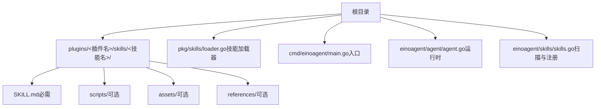
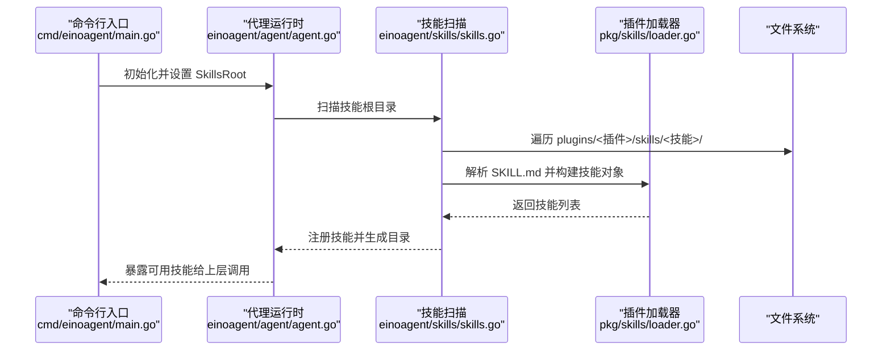
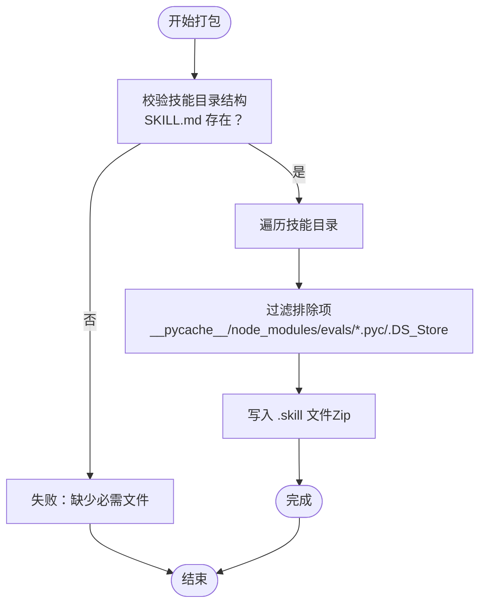
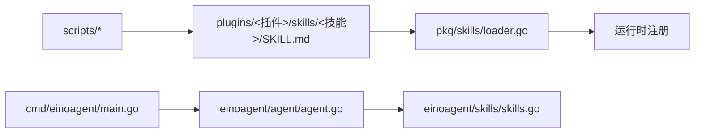
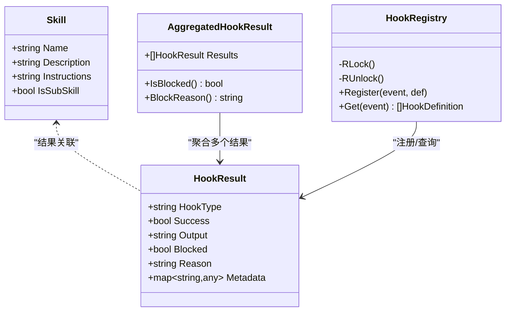

# 插件部署与分发

<cite>
**本文引用的文件**   
- [go.mod](file://go.mod)
- [pkg/skills/loader.go](file://pkg/skills/loader.go)
- [plugins/anthropic/skills/skill-creator/scripts/package_skill.py](file://plugins/anthropic/skills/skill-creator/scripts/package_skill.py)
- [plugins/anthropic/skills/skill-creator/SKILL.md](file://plugins/anthropic/skills/skill-creator/SKILL.md)
- [plugins/anthropic/skills/code-review/SKILL.md](file://plugins/anthropic/skills/code-review/SKILL.md)
- [plugins/anthropic/skills/webapp-testing/SKILL.md](file://plugins/anthropic/skills/webapp-testing/SKILL.md)
- [plugins/anthropic/skills/mcp-builder/scripts/connections.py](file://plugins/anthropic/skills/mcp-builder/scripts/connections.py)
- [plugins/superpowers/skills/brainstorming/scripts/start-server.sh](file://plugins/superpowers/skills/brainstorming/scripts/start-server.sh)
- [plugins/superpowers/skills/systematic-debugging/SKILL.md](file://plugins/superpowers/skills/systematic-debugging/SKILL.md)
- [plugins/superpowers/skills/using-superpowers/SKILL.md](file://plugins/superpowers/skills/using-superpowers/SKILL.md)
- [pkg/hooks/types.go](file://pkg/hooks/types.go)
- [pkg/hooks/loader.go](file://pkg/hooks/loader.go)
- [cmd/einoagent/main.go](file://cmd/einoagent/main.go)
- [einoagent/agent/agent.go](file://einoagent/agent/agent.go)
- [einoagent/skills/skills.go](file://einoagent/skills/skills.go)
</cite>

## 目录
1. [引言](#引言)
2. [项目结构](#项目结构)
3. [核心组件](#核心组件)
4. [架构总览](#架构总览)
5. [详细组件分析](#详细组件分析)
6. [依赖分析](#依赖分析)
7. [性能考虑](#性能考虑)
8. [故障排查指南](#故障排查指南)
9. [结论](#结论)
10. [附录](#附录)

## 引言
本指南面向希望在本项目中进行“插件（技能）打包、安装与分发”的工程师与产品人员。内容覆盖：
- 插件目录结构与标准化要求（必需文件与可选资源）
- 版本管理策略（版本号规范、向后兼容性与升级路径）
- 安装方法（手动安装与自动安装）
- 分发平台与工作流（GitHub、.skill 包等）
- 发布流程（代码评审、测试验证、发布）
- 维护与更新策略（Bug 修复与功能迭代）

## 项目结构
本仓库采用“插件集合 + 技能目录”的组织方式，插件位于 plugins 目录下，每个插件内部以 skills 子目录承载具体技能。技能通过标准的 SKILL.md 文件定义元数据与执行说明；部分技能附带 scripts/ 等资源目录。

图示来源
- [pkg/skills/loader.go:21-124](file://pkg/skills/loader.go#L21-L124)
- [plugins/anthropic/skills/code-review/SKILL.md:1-94](file://plugins/anthropic/skills/code-review/SKILL.md#L1-L94)
- [plugins/anthropic/skills/webapp-testing/SKILL.md:1-96](file://plugins/anthropic/skills/webapp-testing/SKILL.md#L1-L96)
- [plugins/anthropic/skills/mcp-builder/scripts/connections.py:1-152](file://plugins/anthropic/skills/mcp-builder/scripts/connections.py#L1-L152)
- [plugins/superpowers/skills/brainstorming/scripts/start-server.sh:1-149](file://plugins/superpowers/skills/brainstorming/scripts/start-server.sh#L1-L149)

章节来源
- [pkg/skills/loader.go:21-124](file://pkg/skills/loader.go#L21-L124)
- [plugins/anthropic/skills/code-review/SKILL.md:1-94](file://plugins/anthropic/skills/code-review/SKILL.md#L1-L94)
- [plugins/anthropic/skills/webapp-testing/SKILL.md:1-96](file://plugins/anthropic/skills/webapp-testing/SKILL.md#L1-L96)
- [plugins/anthropic/skills/mcp-builder/scripts/connections.py:1-152](file://plugins/anthropic/skills/mcp-builder/scripts/connections.py#L1-L152)
- [plugins/superpowers/skills/brainstorming/scripts/start-server.sh:1-149](file://plugins/superpowers/skills/brainstorming/scripts/start-server.sh#L1-L149)

## 核心组件
- 技能加载器：负责扫描 plugins 目录下的技能，解析 SKILL.md 元数据，生成可用技能列表，并为插件创建“索引技能”用于展示子技能清单。
- 插件打包器：将技能目录打包为 .skill 文件（Zip），便于分发与安装。
- 运行时与入口：命令行入口与代理运行时负责读取技能根目录、扫描并注册技能。

章节来源
- [pkg/skills/loader.go:21-124](file://pkg/skills/loader.go#L21-L124)
- [plugins/anthropic/skills/skill-creator/scripts/package_skill.py:1-136](file://plugins/anthropic/skills/skill-creator/scripts/package_skill.py#L1-L136)
- [cmd/einoagent/main.go:54](file://cmd/einoagent/main.go#L54)
- [einoagent/agent/agent.go:27](file://einoagent/agent/agent.go#L27)
- [einoagent/agent/agent.go:53](file://einoagent/agent/agent.go#L53)
- [einoagent/agent/agent.go:173](file://einoagent/agent/agent.go#L173)
- [einoagent/skills/skills.go:3](file://einoagent/skills/skills.go#L3)

## 架构总览
从“发现—加载—注册—调用”的视角，整体流程如下：

图示来源
- [cmd/einoagent/main.go:54](file://cmd/einoagent/main.go#L54)
- [einoagent/agent/agent.go:27](file://einoagent/agent/agent.go#L27)
- [einoagent/agent/agent.go:53](file://einoagent/agent/agent.go#L53)
- [einoagent/agent/agent.go:173](file://einoagent/agent/agent.go#L173)
- [einoagent/skills/skills.go:3](file://einoagent/skills/skills.go#L3)
- [pkg/skills/loader.go:21-124](file://pkg/skills/loader.go#L21-L124)

## 详细组件分析

### 技能目录结构与标准化要求
- 必需文件
  - SKILL.md：技能元数据（name、description 等）与执行说明。解析逻辑见技能加载器。
- 可选资源
  - scripts/：可执行脚本或工具，支持自动化任务。
  - assets/：输出模板、图标、字体等资源。
  - references/：参考文档，按需加载。
- 插件索引
  - 加载器会为每个插件生成一个“索引技能”，列出其子技能名称与描述，并对子技能名进行前缀化避免冲突。

章节来源
- [pkg/skills/loader.go:21-124](file://pkg/skills/loader.go#L21-L124)
- [plugins/anthropic/skills/skill-creator/SKILL.md:75-110](file://plugins/anthropic/skills/skill-creator/SKILL.md#L75-L110)
- [plugins/anthropic/skills/webapp-testing/SKILL.md:11-14](file://plugins/anthropic/skills/webapp-testing/SKILL.md#L11-L14)

### 插件打包与分发（.skill 文件）
- 打包器
  - 将技能目录压缩为 .skill 文件（Zip），自动排除缓存与构建产物，保留核心资源。
- 使用场景
  - 本地开发完成后，生成 .skill 文件用于分发或安装。
- 分发介质
  - GitHub Releases、内部制品库、平台商店等均可承载 .skill 文件。

图示来源
- [plugins/anthropic/skills/skill-creator/scripts/package_skill.py:27-109](file://plugins/anthropic/skills/skill-creator/scripts/package_skill.py#L27-L109)

章节来源
- [plugins/anthropic/skills/skill-creator/scripts/package_skill.py:1-136](file://plugins/anthropic/skills/skill-creator/scripts/package_skill.py#L1-L136)
- [plugins/anthropic/skills/skill-creator/SKILL.md:408-417](file://plugins/anthropic/skills/skill-creator/SKILL.md#L408-L417)

### 安装方法（手动安装与自动安装）
- 手动安装
  - 将 .skill 文件解压到技能根目录（默认 ./.skills 或由运行时配置指定），确保目录结构符合“插件/技能/SKILL.md”。
- 自动安装
  - 通过运行时扫描技能根目录自动发现并注册技能；也可结合平台提供的安装工具（例如 .skill 文件的安装脚本）实现一键安装。
- 运行时配置
  - 运行时可通过配置项设置 SkillsRoot，默认值为 ./.skills。

章节来源
- [cmd/einoagent/main.go:54](file://cmd/einoagent/main.go#L54)
- [einoagent/agent/agent.go:27](file://einoagent/agent/agent.go#L27)
- [einoagent/agent/agent.go:53](file://einoagent/agent/agent.go#L53)
- [einoagent/skills/skills.go:3](file://einoagent/skills/skills.go#L3)

### 插件分发平台与工作流
- GitHub
  - 使用 Releases 承载 .skill 文件下载链接；配合 CHANGELOG/版本标签实现版本追踪。
- 平台商店
  - 若存在平台商店，可提交 .skill 包并配置元数据（名称、描述、许可等）。
- 工作流建议
  - 提交 PR 后触发自动化测试（技能有效性、脚本可执行性、打包产物完整性）。
  - 通过 CI 生成 .skill 文件并上传为 Artifacts，供发布阶段使用。

章节来源
- [plugins/anthropic/skills/webapp-testing/SKILL.md:1-96](file://plugins/anthropic/skills/webapp-testing/SKILL.md#L1-L96)
- [plugins/anthropic/skills/code-review/SKILL.md:1-94](file://plugins/anthropic/skills/code-review/SKILL.md#L1-L94)

### 版本管理策略
- 版本号规范
  - 建议采用语义化版本（主.次.补丁），并在发布标签中体现（如 v1.2.3）。
- 向后兼容性
  - 对于 SKILL.md 的变更，优先保持 name 与 description 的稳定性；若涉及行为变更，应在文档中明确标注。
- 升级路径
  - 新版本 .skill 文件应包含完整的资源与脚本；旧版用户可直接替换安装，无需额外迁移步骤。

章节来源
- [plugins/anthropic/skills/skill-creator/SKILL.md:472-481](file://plugins/anthropic/skills/skill-creator/SKILL.md#L472-L481)

### 发布流程（代码评审、测试验证、发布）
- 代码评审
  - 团队内审阅 SKILL.md 内容与脚本逻辑，确保触发条件、执行步骤与输出格式清晰。
- 测试验证
  - 在不同环境下运行技能（含脚本依赖），验证自动化流程与输出一致性。
- 发布
  - 生成 .skill 文件并上传至分发渠道；更新发布说明与版本标签。

章节来源
- [plugins/anthropic/skills/skill-creator/SKILL.md:163-251](file://plugins/anthropic/skills/skill-creator/SKILL.md#L163-L251)
- [plugins/anthropic/skills/skill-creator/SKILL.md:420-436](file://plugins/anthropic/skills/skill-creator/SKILL.md#L420-L436)

### 维护与更新策略
- Bug 修复
  - 通过增量 .skill 文件发布修复版本；在发布说明中标注问题与修复范围。
- 功能迭代
  - 保持 SKILL.md 的稳定性，新增脚本或资源时遵循“最小变更原则”，并通过评估工具对比前后效果。
- 变更记录
  - 在技能目录中维护变更日志（如 CREATION-LOG.md），便于回溯与审计。

章节来源
- [plugins/superpowers/skills/systematic-debugging/SKILL.md:199-213](file://plugins/superpowers/skills/systematic-debugging/SKILL.md#L199-L213)
- [plugins/superpowers/skills/brainstorming/scripts/start-server.sh:1-149](file://plugins/superpowers/skills/brainstorming/scripts/start-server.sh#L1-L149)

## 依赖分析
- 技能加载依赖
  - 加载器依赖文件系统扫描与 YAML-like frontmatter 解析能力。
- 打包器依赖
  - 依赖 Zip 写入与排除规则，确保产物精简且可复现。
- 运行时依赖
  - 通过配置项设置技能根目录，扫描并注册技能。

图示来源
- [pkg/skills/loader.go:21-124](file://pkg/skills/loader.go#L21-L124)
- [cmd/einoagent/main.go:54](file://cmd/einoagent/main.go#L54)
- [einoagent/agent/agent.go:27](file://einoagent/agent/agent.go#L27)
- [einoagent/agent/agent.go:53](file://einoagent/agent/agent.go#L53)
- [einoagent/skills/skills.go:3](file://einoagent/skills/skills.go#L3)

章节来源
- [pkg/skills/loader.go:21-124](file://pkg/skills/loader.go#L21-L124)
- [cmd/einoagent/main.go:54](file://cmd/einoagent/main.go#L54)
- [einoagent/agent/agent.go:27](file://einoagent/agent/agent.go#L27)
- [einoagent/agent/agent.go:53](file://einoagent/agent/agent.go#L53)
- [einoagent/skills/skills.go:3](file://einoagent/skills/skills.go#L3)

## 性能考虑
- 扫描与解析
  - 控制 SKILL.md 体量，避免超长上下文影响加载性能；必要时拆分 references/。
- 资源管理
  - scripts/ 中的脚本尽量幂等、短路执行，减少 IO 与外部依赖等待。
- 打包体积
  - 排除不必要的中间产物与缓存目录，缩短下载与安装时间。

## 故障排查指南
- 技能未被识别
  - 检查 SKILL.md 是否存在且格式正确；确认目录层级是否符合“插件/技能/”约定。
- 脚本不可执行
  - 确认脚本权限与环境（Python/Node 等）已就绪；参考相关技能文档中的使用提示。
- 运行时无法定位技能根目录
  - 检查运行时配置项 SkillsRoot 是否指向正确的路径。

章节来源
- [pkg/skills/loader.go:21-124](file://pkg/skills/loader.go#L21-L124)
- [plugins/anthropic/skills/webapp-testing/SKILL.md:11-14](file://plugins/anthropic/skills/webapp-testing/SKILL.md#L11-L14)
- [cmd/einoagent/main.go:54](file://cmd/einoagent/main.go#L54)
- [einoagent/agent/agent.go:27](file://einoagent/agent/agent.go#L27)
- [einoagent/agent/agent.go:53](file://einoagent/agent/agent.go#L53)

## 结论
通过标准化的技能目录结构、严格的打包与分发流程以及完善的版本与维护策略，可以高效地在本项目中实现插件的全生命周期管理。建议团队在日常协作中遵循本文档的规范与流程，确保技能质量与用户体验。

## 附录
- 相关模块类图（技能加载与注册）

图示来源
- [pkg/skills/loader.go:13-19](file://pkg/skills/loader.go#L13-L19)
- [pkg/hooks/types.go:3-43](file://pkg/hooks/types.go#L3-L43)
- [pkg/hooks/loader.go:9-35](file://pkg/hooks/loader.go#L9-L35)