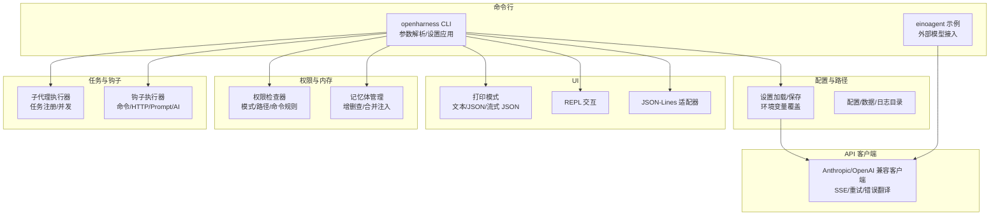
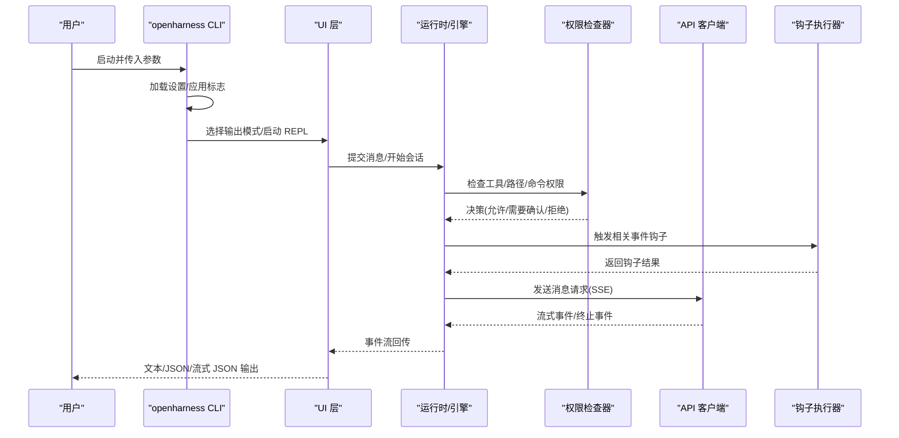
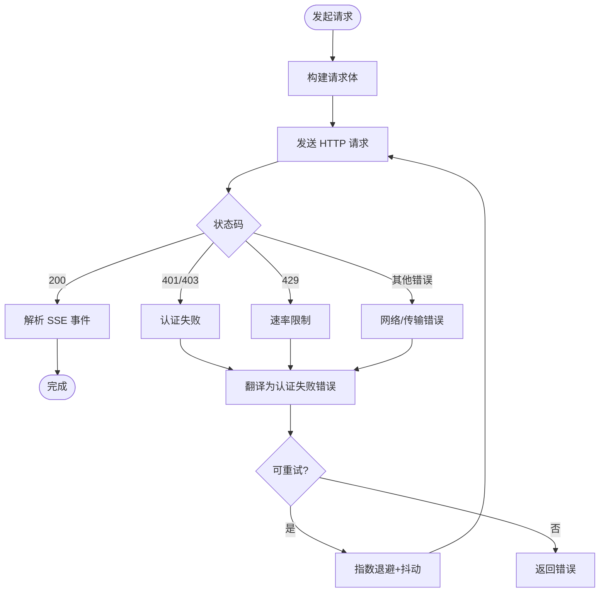
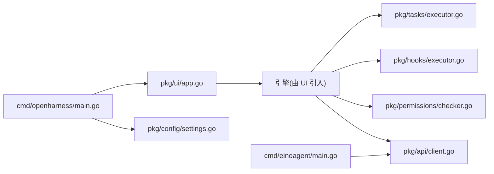

# 故障排除

<cite>
**本文引用的文件**
- [go.mod](file://go.mod)
- [cmd/openharness/main.go](file://cmd/openharness/main.go)
- [cmd/einoagent/main.go](file://cmd/einoagent/main.go)
- [pkg/config/settings.go](file://pkg/config/settings.go)
- [pkg/config/paths.go](file://pkg/config/paths.go)
- [pkg/api/client.go](file://pkg/api/client.go)
- [pkg/types/errors.go](file://pkg/types/errors.go)
- [pkg/ui/app.go](file://pkg/ui/app.go)
- [pkg/permissions/checker.go](file://pkg/permissions/checker.go)
- [pkg/memory/manager.go](file://pkg/memory/manager.go)
- [pkg/tasks/executor.go](file://pkg/tasks/executor.go)
- [pkg/hooks/executor.go](file://pkg/hooks/executor.go)
- [pkg/hooks/loader.go](file://pkg/hooks/loader.go)
- [plugins/superpowers/skills/systematic-debugging/SKILL.md](file://plugins/superpowers/skills/systematic-debugging/SKILL.md)
- [plugins/superpowers/skills/systematic-debugging/root-cause-tracing.md](file://plugins/superpowers/skills/systematic-debugging/root-cause-tracing.md)
</cite>

## 目录
1. [简介](#简介)
2. [项目结构](#项目结构)
3. [核心组件](#核心组件)
4. [架构总览](#架构总览)
5. [详细组件分析](#详细组件分析)
6. [依赖分析](#依赖分析)
7. [性能考虑](#性能考虑)
8. [故障排除指南](#故障排除指南)
9. [结论](#结论)
10. [附录](#附录)

## 简介
本指南面向使用者与开发者，提供针对安装、配置、运行时异常、网络连接、API 认证、权限控制、日志分析与性能诊断的系统化排障方法。文档结合代码实现，给出可操作的步骤、常见错误码说明、定位技巧与优化建议，帮助快速自助解决问题。

## 项目结构
- 命令行入口
  - openharness CLI：主程序入口，负责解析参数、加载设置、选择输出模式（文本/JSON/流式 JSON）、启动交互式 REPL 或非交互打印模式。
  - einoagent 示例：基于外部模型库的简单 ReAct 演示入口，用于验证外部 API 能力。
- 配置与路径
  - 设置加载与保存、环境变量覆盖、默认值、配置文件路径解析。
- API 客户端
  - 带重试与 SSE 流式响应的上游 API 客户端，支持认证失败、限流、请求失败等错误分类。
- UI 层
  - 打印模式、REPL、JSON-Lines 协议适配器；输出格式切换与工具执行状态展示。
- 权限与内存
  - 工具调用权限决策、路径规则匹配、只读工具放行、计划/全量自动模式差异；项目级记忆体管理。
- 任务与钩子
  - 子代理执行器、任务注册表；命令/HTTP/Prompt/AI 钩子执行器与结果聚合。
- 日志与数据目录
  - 配置/数据/会话/任务/反馈/日志等目录约定，便于定位日志与持久化数据。

**图表来源**
- [cmd/openharness/main.go:15-102](file://cmd/openharness/main.go#L15-L102)
- [cmd/einoagent/main.go:25-107](file://cmd/einoagent/main.go#L25-L107)
- [pkg/config/settings.go:160-195](file://pkg/config/settings.go#L160-L195)
- [pkg/config/paths.go:8-75](file://pkg/config/paths.go#L8-L75)
- [pkg/api/client.go:85-148](file://pkg/api/client.go#L85-L148)
- [pkg/ui/app.go:18-181](file://pkg/ui/app.go#L18-L181)
- [pkg/permissions/checker.go:23-82](file://pkg/permissions/checker.go#L23-L82)
- [pkg/memory/manager.go:12-124](file://pkg/memory/manager.go#L12-L124)
- [pkg/tasks/executor.go:24-137](file://pkg/tasks/executor.go#L24-L137)
- [pkg/hooks/executor.go:53-105](file://pkg/hooks/executor.go#L53-L105)

**章节来源**
- [go.mod:1-43](file://go.mod#L1-L43)
- [cmd/openharness/main.go:15-102](file://cmd/openharness/main.go#L15-L102)
- [cmd/einoagent/main.go:25-107](file://cmd/einoagent/main.go#L25-L107)
- [pkg/config/settings.go:160-195](file://pkg/config/settings.go#L160-L195)
- [pkg/config/paths.go:8-75](file://pkg/config/paths.go#L8-L75)

## 核心组件
- 设置与配置
  - 默认设置、环境变量覆盖、配置文件读写、API Key 解析优先级。
- API 客户端
  - 请求构建、SSE 流解析、重试策略、错误类型映射（认证失败/限流/请求失败）。
- UI 输出
  - 文本/JSON/流式 JSON 输出、工具执行状态提示、REPL 命令与帮助。
- 权限检查
  - 模式（默认/计划/全量自动）、显式允许/拒绝工具、路径规则、命令模式匹配。
- 记忆体管理
  - 项目级记忆体文件增删、列表、内容合并、标题安全化。
- 任务与钩子
  - 子代理执行、任务注册与状态、钩子类型（命令/HTTP/Prompt/AI）执行与聚合。

**章节来源**
- [pkg/config/settings.go:97-142](file://pkg/config/settings.go#L97-L142)
- [pkg/api/client.go:43-148](file://pkg/api/client.go#L43-L148)
- [pkg/ui/app.go:18-181](file://pkg/ui/app.go#L18-L181)
- [pkg/permissions/checker.go:23-82](file://pkg/permissions/checker.go#L23-L82)
- [pkg/memory/manager.go:12-124](file://pkg/memory/manager.go#L12-L124)
- [pkg/tasks/executor.go:24-137](file://pkg/tasks/executor.go#L24-L137)
- [pkg/hooks/executor.go:53-105](file://pkg/hooks/executor.go#L53-L105)

## 架构总览
下图展示从 CLI 到引擎、API、UI、权限与钩子的整体调用链路与数据流。

**图表来源**
- [cmd/openharness/main.go:46-76](file://cmd/openharness/main.go#L46-L76)
- [pkg/ui/app.go:18-181](file://pkg/ui/app.go#L18-L181)
- [pkg/permissions/checker.go:42-82](file://pkg/permissions/checker.go#L42-L82)
- [pkg/hooks/executor.go:70-105](file://pkg/hooks/executor.go#L70-L105)
- [pkg/api/client.go:107-148](file://pkg/api/client.go#L107-L148)

## 详细组件分析

### 组件一：设置与配置（Settings/Paths）
- 关键点
  - 默认设置与环境变量覆盖顺序；API Key 解析优先级（实例字段 > 环境变量）。
  - 配置文件路径、数据/日志/会话/任务/反馈目录约定。
- 常见问题
  - 配置文件不存在或解析失败导致默认值生效。
  - 环境变量未正确设置导致认证失败。
- 排障步骤
  - 检查配置文件是否存在与可读；查看默认配置是否符合预期。
  - 使用环境变量覆盖模型/基础地址；确认 ANTHROPIC_API_KEY 是否存在。
  - 查看配置目录与日志目录位置，确保有写权限。

**章节来源**
- [pkg/config/settings.go:160-195](file://pkg/config/settings.go#L160-L195)
- [pkg/config/settings.go:197-212](file://pkg/config/settings.go#L197-L212)
- [pkg/config/paths.go:8-75](file://pkg/config/paths.go#L8-L75)

### 组件二：API 客户端（Anthropic/OpenAI 兼容）
- 关键点
  - SSE 流解析、重试逻辑（指数退避+抖动）、可重试状态码、错误翻译。
  - 错误类型：认证失败、速率限制、请求失败。
- 常见问题
  - 401/403：认证失败，检查 API Key。
  - 429：触发速率限制，等待后重试。
  - 网络错误：连接被拒/超时/主机不可达，检查网络与代理。
- 排障步骤
  - 开启详细日志观察重试次数与延迟。
  - 校验 BaseURL 与 API Key；确认上游服务可用性。
  - 若出现 SSE 错误，解析具体错误类型与消息。

**图表来源**
- [pkg/api/client.go:174-210](file://pkg/api/client.go#L174-L210)
- [pkg/api/client.go:359-405](file://pkg/api/client.go#L359-L405)

**章节来源**
- [pkg/api/client.go:26-405](file://pkg/api/client.go#L26-L405)
- [pkg/types/errors.go:5-40](file://pkg/types/errors.go#L5-L40)

### 组件三：UI 输出与交互（打印模式/REPL/JSON-Lines）
- 关键点
  - 打印模式支持文本/JSON/流式 JSON；REPL 支持清屏、帮助、成本查询。
  - 工具执行状态以 ANSI 彩色输出提示。
- 常见问题
  - 输出格式不匹配导致解析困难。
  - REPL 中工具执行失败无明确提示。
- 排障步骤
  - 明确输出格式并按需切换；在流式 JSON 模式下逐条解析事件类型。
  - 在 REPL 中使用 /cost 查看当前内存占用百分比，接近阈值时触发压缩。

**章节来源**
- [pkg/ui/app.go:18-181](file://pkg/ui/app.go#L18-L181)

### 组件四：权限检查（PermissionChecker）
- 关键点
  - 模式：默认/计划/全量自动；只读工具始终允许；计划模式阻断变更型工具。
  - 路径规则与命令模式匹配；显式允许/拒绝优先于规则。
- 常见问题
  - 变更型工具在默认模式下被阻断，需用户确认或切换到全量自动。
  - 路径规则匹配不当导致误判。
- 排障步骤
  - 检查权限模式与路径规则；必要时调整为全量自动或细化规则。
  - 对于命令型工具，检查命令模式匹配是否正确。

**章节来源**
- [pkg/permissions/checker.go:23-82](file://pkg/permissions/checker.go#L23-L82)

### 组件五：记忆体管理（Memory Manager）
- 关键点
  - 项目级记忆体目录、文件命名安全化、列表排序、内容合并。
- 常见问题
  - 目录不存在或无写权限导致无法保存/删除。
  - 文件名非法字符导致创建失败。
- 排障步骤
  - 确认项目记忆体目录存在且可写；检查标题安全化逻辑。
  - 清理无效文件或重建目录。

**章节来源**
- [pkg/memory/manager.go:12-124](file://pkg/memory/manager.go#L12-L124)

### 组件六：任务与钩子（SubAgentExecutor/HookExecutor）
- 关键点
  - 子代理执行器：创建任务、并发运行、状态跟踪、工具沙箱。
  - 钩子执行器：命令/HTTP/Prompt/AI 四类钩子，带超时与阻断策略。
- 常见问题
  - 命令钩子执行失败或超时。
  - HTTP 钩子返回非 2xx 状态码。
  - Prompt/AI 钩子缺少 API 客户端导致失败。
- 排障步骤
  - 检查命令钩子工作目录与环境变量注入；确认 Bash 可用。
  - 校验 HTTP 钩子 URL、头部与超时；关注返回状态码。
  - 确保 Prompt/AI 钩子绑定有效 API 客户端与模型。

**章节来源**
- [pkg/tasks/executor.go:24-137](file://pkg/tasks/executor.go#L24-L137)
- [pkg/hooks/executor.go:53-336](file://pkg/hooks/executor.go#L53-L336)
- [pkg/hooks/loader.go:9-45](file://pkg/hooks/loader.go#L9-L45)

## 依赖分析
- 外部依赖
  - Cobra：CLI 框架；Logrus：日志；Sonric/EasyJSON 等序列化库。
- 内部模块耦合
  - CLI 依赖配置与 UI；UI 依赖引擎与权限；引擎通过 API 客户端访问上游；钩子与任务贯穿各层。

**图表来源**
- [go.mod:5-42](file://go.mod#L5-L42)
- [cmd/openharness/main.go:10-12](file://cmd/openharness/main.go#L10-L12)
- [cmd/einoagent/main.go:19-23](file://cmd/einoagent/main.go#L19-L23)

**章节来源**
- [go.mod:1-43](file://go.mod#L1-L43)

## 性能考虑
- 令牌使用与容量提示
  - 打印模式在文本输出后显示当前令牌使用百分比与阈值，接近阈值时应触发压缩或清理。
- 重试与延迟
  - API 客户端采用指数退避与抖动，避免雪崩；合理设置超时与最大重试次数。
- 输出格式
  - 流式 JSON 更适合实时消费与低延迟场景；文本格式便于人类阅读但吞吐较低。
- 权限与钩子
  - 严格权限与最小工具集可减少不必要的 IO 与系统调用；钩子超时避免阻塞主流程。

**章节来源**
- [pkg/ui/app.go:46-60](file://pkg/ui/app.go#L46-L60)
- [pkg/api/client.go:379-390](file://pkg/api/client.go#L379-L390)

## 故障排除指南

### 一、安装与环境准备
- 症状
  - 启动时报找不到命令或依赖缺失。
- 排障步骤
  - 确认 Go 版本满足要求；安装依赖后重新编译。
  - 检查 PATH 与可执行文件位置。
- 参考
  - [go.mod:3](file://go.mod#L3)

**章节来源**
- [go.mod:1-43](file://go.mod#L1-L43)

### 二、配置错误
- 症状
  - 配置文件不存在或解析失败；API Key 未生效；模型/基础地址不正确。
- 排障步骤
  - 检查配置文件路径与权限；确认 ANTHROPIC_API_KEY 或配置项已设置。
  - 使用环境变量覆盖模型与基础地址；核对配置目录存在且可写。
- 参考
  - [pkg/config/settings.go:160-195](file://pkg/config/settings.go#L160-L195)
  - [pkg/config/settings.go:197-212](file://pkg/config/settings.go#L197-L212)
  - [pkg/config/paths.go:8-23](file://pkg/config/paths.go#L8-L23)

**章节来源**
- [pkg/config/settings.go:160-195](file://pkg/config/settings.go#L160-L195)
- [pkg/config/paths.go:8-23](file://pkg/config/paths.go#L8-L23)

### 三、运行时异常与错误码
- 常见错误类型
  - 认证失败：401/403，检查 API Key。
  - 速率限制：429，等待后重试。
  - 请求失败：网络/传输错误，检查连接与代理。
- 排障步骤
  - 开启详细日志观察重试与状态码；根据错误类型采取相应措施。
  - 使用 CLI 的 auth 子命令检查认证状态与登录/登出。
- 参考
  - [pkg/types/errors.go:5-40](file://pkg/types/errors.go#L5-L40)
  - [pkg/api/client.go:392-405](file://pkg/api/client.go#L392-L405)
  - [cmd/openharness/main.go:237-298](file://cmd/openharness/main.go#L237-L298)

**章节来源**
- [pkg/types/errors.go:5-40](file://pkg/types/errors.go#L5-L40)
- [pkg/api/client.go:392-405](file://pkg/api/client.go#L392-L405)
- [cmd/openharness/main.go:237-298](file://cmd/openharness/main.go#L237-L298)

### 四、日志分析与工具
- 日志位置
  - 数据/日志目录约定，便于集中收集与分析。
- 日志级别与关键信息
  - 重试尝试、状态码、延迟时间、错误消息；SSE 事件类型与终止原因。
- 排障步骤
  - 定位最近的日志文件；搜索关键字如“retry”、“status=429”、“API error”。
  - 结合输出格式（文本/JSON/流式 JSON）进行事件解析。
- 参考
  - [pkg/config/paths.go:30-33](file://pkg/config/paths.go#L30-L33)
  - [pkg/api/client.go:133-144](file://pkg/api/client.go#L133-L144)

**章节来源**
- [pkg/config/paths.go:30-33](file://pkg/config/paths.go#L30-L33)
- [pkg/api/client.go:133-144](file://pkg/api/client.go#L133-L144)

### 五、网络连接与 API 认证
- 症状
  - 无法连接上游 API；认证失败；超时。
- 排障步骤
  - 校验 BaseURL 与代理设置；确认 DNS 与防火墙策略。
  - 使用 einoagent 示例验证外部模型接入，隔离问题范围。
- 参考
  - [cmd/einoagent/main.go:28-48](file://cmd/einoagent/main.go#L28-L48)
  - [pkg/api/client.go:94-104](file://pkg/api/client.go#L94-L104)

**章节来源**
- [cmd/einoagent/main.go:28-48](file://cmd/einoagent/main.go#L28-L48)
- [pkg/api/client.go:94-104](file://pkg/api/client.go#L94-L104)

### 六、权限配置与工具执行
- 症状
  - 工具执行被阻断；路径规则误伤；命令模式匹配失败。
- 排障步骤
  - 检查权限模式与路径规则；对变更型工具启用全量自动或在计划模式下退出计划。
  - 使用 UI 的 /help 与 /cost 命令辅助诊断。
- 参考
  - [pkg/permissions/checker.go:42-82](file://pkg/permissions/checker.go#L42-L82)
  - [pkg/ui/app.go:183-189](file://pkg/ui/app.go#L183-L189)

**章节来源**
- [pkg/permissions/checker.go:42-82](file://pkg/permissions/checker.go#L42-L82)
- [pkg/ui/app.go:183-189](file://pkg/ui/app.go#L183-L189)

### 七、钩子与任务执行问题
- 症状
  - 命令钩子执行失败或超时；HTTP 钩子返回非 2xx；Prompt/AI 钩子缺少客户端。
- 排障步骤
  - 检查命令工作目录、环境变量注入与 Bash 可用性；校验 HTTP 钩子 URL/头部/超时。
  - 确保 Prompt/AI 钩子绑定有效 API 客户端与模型。
- 参考
  - [pkg/hooks/executor.go:111-151](file://pkg/hooks/executor.go#L111-L151)
  - [pkg/hooks/executor.go:157-206](file://pkg/hooks/executor.go#L157-L206)
  - [pkg/hooks/executor.go:212-269](file://pkg/hooks/executor.go#L212-L269)

**章节来源**
- [pkg/hooks/executor.go:111-151](file://pkg/hooks/executor.go#L111-L151)
- [pkg/hooks/executor.go:157-206](file://pkg/hooks/executor.go#L157-L206)
- [pkg/hooks/executor.go:212-269](file://pkg/hooks/executor.go#L212-L269)

### 八、系统健康检查与自助诊断
- 建议流程
  - 检查配置文件与 API Key；验证网络连通性；确认权限模式与规则。
  - 使用打印模式快速验证输出；在 REPL 中逐步调试。
  - 查看日志与令牌使用情况；必要时清理记忆体或触发压缩。
- 参考
  - [pkg/ui/app.go:18-181](file://pkg/ui/app.go#L18-L181)
  - [pkg/memory/manager.go:12-124](file://pkg/memory/manager.go#L12-L124)

**章节来源**
- [pkg/ui/app.go:18-181](file://pkg/ui/app.go#L18-L181)
- [pkg/memory/manager.go:12-124](file://pkg/memory/manager.go#L12-L124)

### 九、系统化调试与根因追踪
- 方法论
  - 先调查根因再修复；多组件系统中在边界处添加诊断日志；深挖调用栈寻找原始触发点。
- 实践要点
  - 仔细阅读错误消息与堆栈；稳定复现问题；检查最近变更；分层验证环境与配置传播。
- 参考
  - [plugins/superpowers/skills/systematic-debugging/SKILL.md:50-120](file://plugins/superpowers/skills/systematic-debugging/SKILL.md#L50-L120)
  - [plugins/superpowers/skills/systematic-debugging/root-cause-tracing.md:32-52](file://plugins/superpowers/skills/systematic-debugging/root-cause-tracing.md#L32-L52)

**章节来源**
- [plugins/superpowers/skills/systematic-debugging/SKILL.md:50-120](file://plugins/superpowers/skills/systematic-debugging/SKILL.md#L50-L120)
- [plugins/superpowers/skills/systematic-debugging/root-cause-tracing.md:32-52](file://plugins/superpowers/skills/systematic-debugging/root-cause-tracing.md#L32-L52)

## 结论
通过结合配置、API 客户端、UI 输出、权限与钩子等模块的排障实践，并配合系统化调试方法与日志分析，可以高效定位并解决大多数安装、配置与运行时问题。建议在生产环境中开启合适的日志级别与输出格式，定期监控令牌使用与系统健康状况，以获得更好的稳定性与可观测性。

## 附录
- 常用命令与子命令
  - auth status/login/logout：认证状态检查与配置。
  - mcp list/add/remove：MCP 服务器管理。
- 输出格式
  - 文本/JSON/流式 JSON，分别适用于人类阅读、程序解析与实时消费。

**章节来源**
- [cmd/openharness/main.go:237-298](file://cmd/openharness/main.go#L237-L298)
- [cmd/openharness/main.go:165-231](file://cmd/openharness/main.go#L165-L231)
- [pkg/ui/app.go:38-120](file://pkg/ui/app.go#L38-L120)