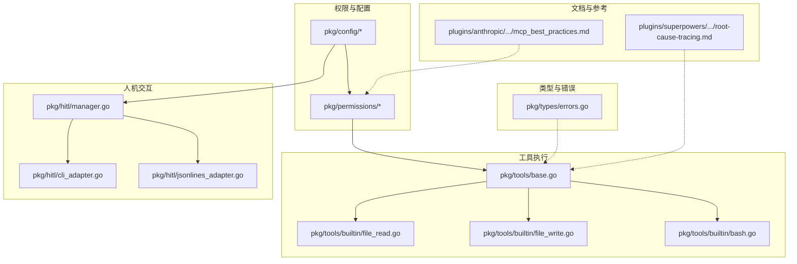
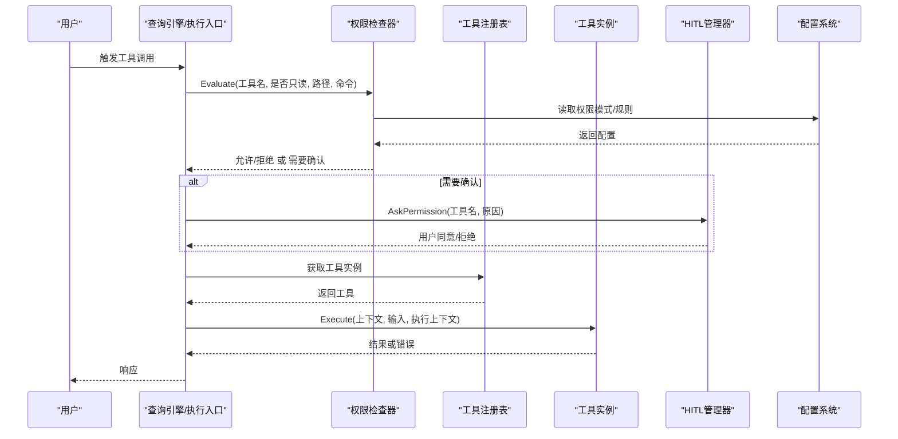
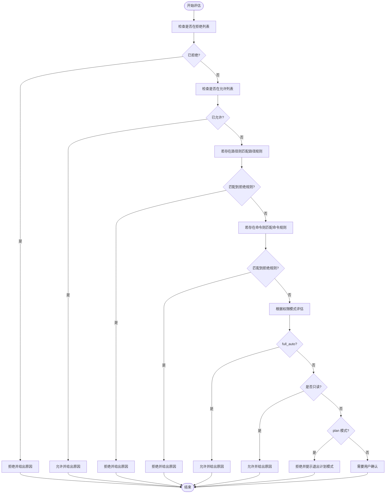
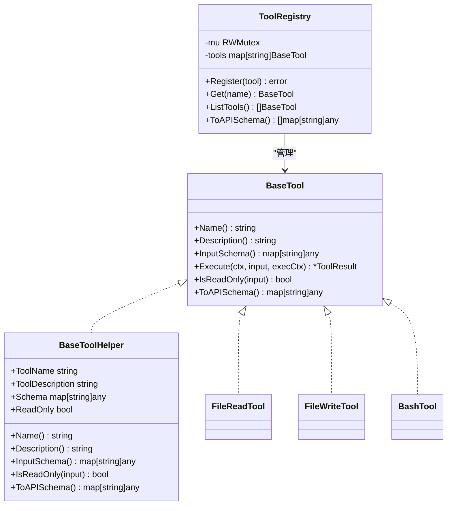
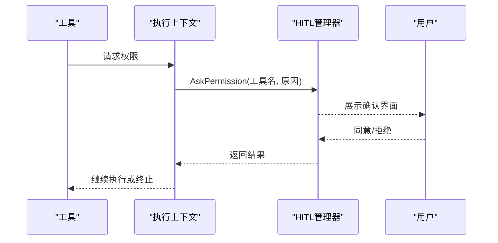

# 安全策略与最佳实践

<cite>
**本文档引用的文件**
- [checker.go](file://pkg/permissions/checker.go)
- [modes.go](file://pkg/permissions/modes.go)
- [settings.go](file://pkg/config/settings.go)
- [paths.go](file://pkg/config/paths.go)
- [base.go](file://pkg/tools/base.go)
- [bash.go](file://pkg/tools/builtin/bash.go)
- [file_read.go](file://pkg/tools/builtin/file_read.go)
- [file_write.go](file://pkg/tools/builtin/file_write.go)
- [errors.go](file://pkg/types/errors.go)
- [manager.go](file://pkg/hitl/manager.go)
- [cli_adapter.go](file://pkg/hitl/cli_adapter.go)
- [jsonlines_adapter.go](file://pkg/hitl/jsonlines_adapter.go)
- [mcp_best_practices.md](file://plugins/anthropic/skills/mcp-builder/reference/mcp_best_practices.md)
- [root-cause-tracing.md](file://plugins/superpowers/skills/systematic-debugging/root-cause-tracing.md)
- [go.mod](file://go.mod)
</cite>

## 目录
1. [引言](#引言)
2. [项目结构](#项目结构)
3. [核心组件](#核心组件)
4. [架构总览](#架构总览)
5. [详细组件分析](#详细组件分析)
6. [依赖分析](#依赖分析)
7. [性能考虑](#性能考虑)
8. [故障排查指南](#故障排查指南)
9. [结论](#结论)
10. [附录](#附录)

## 引言
本文件面向安全策略与最佳实践，结合代码库中的权限控制、工具执行、人机交互与配置管理等模块，系统阐述安全设计理念、威胁模型、配置指南、风险防护、评估方法与应急响应流程。目标是帮助读者在不深入源码的前提下理解系统如何通过“最小权限、纵深防御、可观测性”等原则保障运行安全，并提供可操作的落地建议。

## 项目结构
围绕安全主题的关键目录与文件如下：
- 权限控制：pkg/permissions（权限模式、规则检查）
- 配置与路径：pkg/config（设置加载、路径解析、日志与数据目录）
- 工具执行：pkg/tools（工具基类、注册表、只读标记）、pkg/tools/builtin（具体工具实现）
- 人机交互：pkg/hitl（权限请求与用户问答通道）
- 错误类型：pkg/types（上游API错误抽象）
- 文档与参考：plugins/*/...（MCP安全最佳实践、调试与根因追踪）

图表来源
- [checker.go:1-92](file://pkg/permissions/checker.go#L1-L92)
- [settings.go:1-212](file://pkg/config/settings.go#L1-L212)
- [base.go:1-132](file://pkg/tools/base.go#L1-L132)
- [bash.go:1-99](file://pkg/tools/builtin/bash.go#L1-L99)
- [file_read.go:1-99](file://pkg/tools/builtin/file_read.go#L1-L99)
- [file_write.go:1-80](file://pkg/tools/builtin/file_write.go#L1-L80)
- [manager.go:1-200](file://pkg/hitl/manager.go#L1-L200)
- [cli_adapter.go:1-200](file://pkg/hitl/cli_adapter.go#L1-L200)
- [jsonlines_adapter.go:1-200](file://pkg/hitl/jsonlines_adapter.go#L1-L200)
- [errors.go:1-40](file://pkg/types/errors.go#L1-L40)
- [mcp_best_practices.md:152-164](file://plugins/anthropic/skills/mcp-builder/reference/mcp_best_practices.md#L152-L164)
- [root-cause-tracing.md:163-170](file://plugins/superpowers/skills/systematic-debugging/root-cause-tracing.md#L163-L170)

章节来源
- [settings.go:1-212](file://pkg/config/settings.go#L1-L212)
- [paths.go:1-75](file://pkg/config/paths.go#L1-L75)

## 核心组件
- 权限检查器：基于工具名、只读属性、路径规则与命令模式进行决策，支持显式允许/拒绝、路径匹配与命令匹配。
- 权限模式：默认、计划模式、全自动化三种模式，决定是否需要人工确认或完全放行。
- 工具基类与只读标记：通过 ReadOnly 字段区分读写工具，配合权限检查器形成最小权限执行。
- 配置与路径：集中管理设置加载、环境变量覆盖、配置文件路径与数据/日志目录。
- 人机交互：统一的 AskPermission 回调，将高风险工具的执行置于人类监督之下。
- 错误类型：对上游API错误进行抽象，便于统一处理与告警。

章节来源
- [checker.go:1-92](file://pkg/permissions/checker.go#L1-L92)
- [modes.go:1-28](file://pkg/permissions/modes.go#L1-L28)
- [base.go:1-132](file://pkg/tools/base.go#L1-L132)
- [settings.go:1-212](file://pkg/config/settings.go#L1-L212)
- [paths.go:1-75](file://pkg/config/paths.go#L1-L75)
- [errors.go:1-40](file://pkg/types/errors.go#L1-L40)

## 架构总览
下图展示安全相关模块之间的交互关系：配置驱动权限检查器；工具执行前由权限检查器判定；高风险工具通过人机交互请求确认；错误类型用于统一处理上游失败场景。

图表来源
- [checker.go:41-82](file://pkg/permissions/checker.go#L41-L82)
- [base.go:51-79](file://pkg/tools/base.go#L51-L79)
- [manager.go:1-200](file://pkg/hitl/manager.go#L1-L200)
- [settings.go:160-195](file://pkg/config/settings.go#L160-L195)

## 详细组件分析

### 权限控制系统
- 设计理念
  - 最小权限：通过 ReadOnly 标记与权限模式，限制写操作与高风险命令。
  - 显式许可：优先使用显式允许/拒绝列表，避免默认放行。
  - 纵深防御：路径规则与命令模式共同约束，降低越权风险。
  - 人机协同：高风险工具在默认模式下必须经用户确认。
- 关键流程
  - 工具名白名单/黑名单优先判断。
  - 路径规则按 glob 匹配，deny 优先于 allow。
  - 命令模式支持 deny patterns，防止危险命令执行。
  - 模式切换：full_auto 放行所有工具；plan 模式阻止变更型工具；默认模式要求确认。

图表来源
- [checker.go:41-82](file://pkg/permissions/checker.go#L41-L82)

章节来源
- [checker.go:1-92](file://pkg/permissions/checker.go#L1-L92)
- [modes.go:1-28](file://pkg/permissions/modes.go#L1-L28)

### 工具执行与最小权限
- 只读工具：文件读取等只读工具默认 ReadOnly=true，通常可直接放行或在默认模式下快速通过。
- 写入工具：文件写入等变更型工具默认 ReadOnly=false，需严格受控。
- Bash 工具：执行外部命令，具备极高风险，必须配合权限模式与人机交互使用。
- 工具注册与调度：通过注册表统一管理，确保调用链清晰可控。

图表来源
- [base.go:51-132](file://pkg/tools/base.go#L51-L132)
- [file_read.go:25-57](file://pkg/tools/builtin/file_read.go#L25-L57)
- [file_write.go:23-51](file://pkg/tools/builtin/file_write.go#L23-L51)
- [bash.go:24-53](file://pkg/tools/builtin/bash.go#L24-L53)

章节来源
- [base.go:1-132](file://pkg/tools/base.go#L1-L132)
- [file_read.go:1-99](file://pkg/tools/builtin/file_read.go#L1-L99)
- [file_write.go:1-80](file://pkg/tools/builtin/file_write.go#L1-L80)
- [bash.go:1-99](file://pkg/tools/builtin/bash.go#L1-L99)

### 人机交互与权限请求
- 统一回调：AskPermission 回调在工具执行前触发，确保高风险动作得到明确授权。
- 多前端适配：CLI、JSON-Lines、HTTP/WebSocket 等前端均可通过统一协议接入。
- 取消与超时：原生支持 context.Cancel，避免阻塞与资源泄漏。

图表来源
- [base.go:14-27](file://pkg/tools/base.go#L14-L27)
- [manager.go:1-200](file://pkg/hitl/manager.go#L1-L200)
- [cli_adapter.go:458-490](file://pkg/hitl/cli_adapter.go#L458-L490)
- [jsonlines_adapter.go:1-200](file://pkg/hitl/jsonlines_adapter.go#L1-L200)

章节来源
- [base.go:1-132](file://pkg/tools/base.go#L1-L132)
- [manager.go:1-200](file://pkg/hitl/manager.go#L1-L200)
- [cli_adapter.go:1-200](file://pkg/hitl/cli_adapter.go#L1-L200)
- [jsonlines_adapter.go:1-200](file://pkg/hitl/jsonlines_adapter.go#L1-L200)

### 配置与路径
- 设置加载：支持从配置文件加载默认值，并允许环境变量覆盖。
- 路径解析：集中定义配置目录、数据目录、日志目录、会话与任务目录等，便于审计与隔离。
- 安全要点：配置文件权限应限制为仅当前用户可读写；日志与数据目录应避免敏感信息泄露。

章节来源
- [settings.go:160-195](file://pkg/config/settings.go#L160-L195)
- [paths.go:1-75](file://pkg/config/paths.go#L1-L75)

### 上游API错误处理
- 抽象接口：将认证失败、速率限制、通用请求失败等统一为可识别的错误类型。
- 用途：便于在权限控制与人机交互之外，对上游服务异常进行一致化处理与告警。

章节来源
- [errors.go:1-40](file://pkg/types/errors.go#L1-L40)

## 依赖分析
- 外部依赖：项目使用 Cobra、日志、JSON 解析等常用库，未发现明显高危依赖。
- 安全影响：外部依赖版本稳定，建议定期更新以修复已知漏洞。

章节来源
- [go.mod:1-43](file://go.mod#L1-L43)

## 性能考虑
- 权限检查复杂度：主要为线性扫描允许/拒绝列表与路径规则，时间复杂度 O(n+m)，其中 n 为规则数量，m 为路径规则数量。可通过缓存热点规则与预编译模式减少开销。
- 工具执行：Bash 工具引入子进程与 I/O，建议设置合理超时与资源限制，避免长时间阻塞。
- 人机交互：通道与回调为轻量同步，注意避免在高频工具调用中产生过多阻塞。

## 故障排查指南
- 权限被拒绝
  - 检查工具名是否在拒绝列表中；确认是否在允许列表中。
  - 若涉及路径，请核对路径规则是否匹配 deny 规则。
  - 若涉及命令，请核对命令模式是否匹配 deny patterns。
  - 检查当前权限模式：是否处于 plan 模式导致变更型工具被阻断。
- 高风险工具未触发确认
  - 确认执行上下文中是否注入了 AskPermission 回调。
  - 检查前端适配器是否正确实现了权限请求流程。
- 配置加载失败
  - 检查配置文件路径与权限；确认环境变量覆盖是否生效。
  - 查看日志目录与数据目录是否存在且可写。
- 上游API错误
  - 使用统一错误类型进行分类处理，记录详细错误信息以便定位。

章节来源
- [checker.go:41-82](file://pkg/permissions/checker.go#L41-L82)
- [base.go:14-27](file://pkg/tools/base.go#L14-L27)
- [settings.go:160-195](file://pkg/config/settings.go#L160-L195)
- [paths.go:30-58](file://pkg/config/paths.go#L30-L58)
- [errors.go:1-40](file://pkg/types/errors.go#L1-L40)

## 结论
本项目通过“显式许可 + 最小权限 + 人机确认 + 纵深防御”的组合，构建了可配置、可审计、可扩展的安全执行框架。建议在生产环境中：
- 默认采用“默认模式”，仅在受控场景启用“全自动化模式”；
- 严格限制路径与命令规则，避免宽泛匹配；
- 对高风险工具（如 Bash）强制要求用户确认；
- 完善日志与审计，定期审查权限配置与工具使用情况；
- 将安全纳入开发流程，结合根因追踪与合规检查持续改进。

## 附录

### 安全配置指南
- 最小权限原则
  - 优先使用只读工具；变更型工具必须显式允许。
  - 通过路径规则限制访问范围，deny 优先于 allow。
- 纵深防御策略
  - 启用权限模式与命令模式双重约束。
  - 对高风险命令（如系统级命令）加入 deny patterns。
- 监控与审计
  - 日志目录与数据目录分离，定期轮转与清理。
  - 记录权限决策与用户确认事件，便于回溯。

章节来源
- [modes.go:1-28](file://pkg/permissions/modes.go#L1-L28)
- [checker.go:41-82](file://pkg/permissions/checker.go#L41-L82)
- [paths.go:30-58](file://pkg/config/paths.go#L30-L58)

### 威胁模型与防护
- 命令注入防护
  - Bash 工具通过参数化输入与超时控制降低注入风险；建议进一步限制可用命令集与工作目录。
- 路径遍历攻击防范
  - 文件读写工具在处理相对路径时合并到执行目录，建议固定工作目录并限制符号链接解析。
- 权限提升漏洞预防
  - 通过权限模式与人机交互，将高风险动作置于人类监督之下；避免在容器或受限环境中以高权限运行。

章节来源
- [bash.go:55-99](file://pkg/tools/builtin/bash.go#L55-L99)
- [file_read.go:60-99](file://pkg/tools/builtin/file_read.go#L60-L99)
- [file_write.go:53-80](file://pkg/tools/builtin/file_write.go#L53-L80)
- [manager.go:1-200](file://pkg/hitl/manager.go#L1-L200)

### 安全评估与合规检查清单
- 配置层面
  - 配置文件权限：仅当前用户可读写
  - 环境变量覆盖：明确覆盖项与默认值
  - 日志与数据目录：权限与容量限制
- 权限层面
  - 工具白名单/黑名单：完整且最小化
  - 路径规则：无宽泛 deny 规则
  - 命令模式：deny patterns 覆盖高风险命令
  - 权限模式：默认模式下高风险工具需确认
- 运行层面
  - Bash 工具：超时与工作目录限制
  - 人机交互：回调注入与前端适配器有效性
  - 错误处理：统一错误类型与告警

章节来源
- [settings.go:160-195](file://pkg/config/settings.go#L160-L195)
- [checker.go:41-82](file://pkg/permissions/checker.go#L41-L82)
- [bash.go:55-99](file://pkg/tools/builtin/bash.go#L55-L99)
- [base.go:14-27](file://pkg/tools/base.go#L14-L27)
- [errors.go:1-40](file://pkg/types/errors.go#L1-L40)

### 安全事件响应流程
- 发现与分级
  - 识别异常权限决策、高风险工具调用、上游API错误。
- 快速处置
  - 临时收紧权限模式与路径规则；暂停高风险工具；限制 Bash 工具使用。
- 根因分析
  - 使用根因追踪文档中的方法，逐层回溯调用链与决策点。
- 改进与验证
  - 更新策略与规则；回归测试；持续监控。

章节来源
- [root-cause-tracing.md:163-170](file://plugins/superpowers/skills/systematic-debugging/root-cause-tracing.md#L163-L170)
- [mcp_best_practices.md:152-164](file://plugins/anthropic/skills/mcp-builder/reference/mcp_best_practices.md#L152-L164)