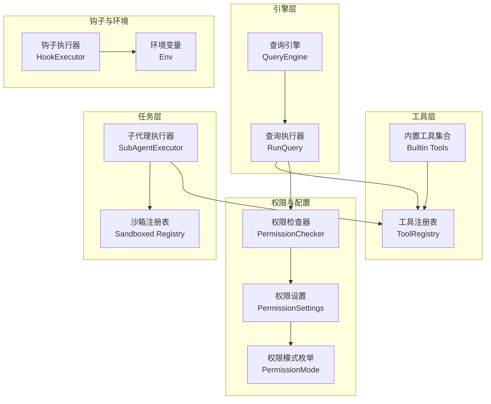
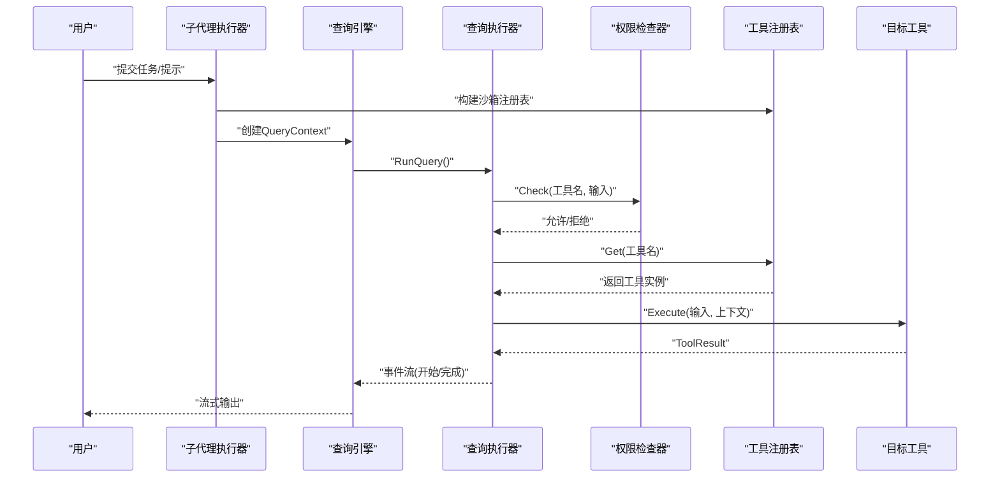
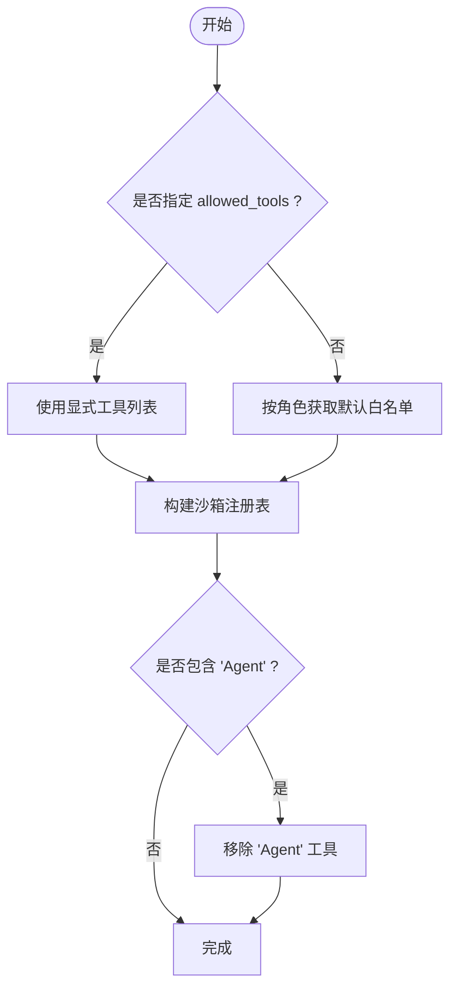
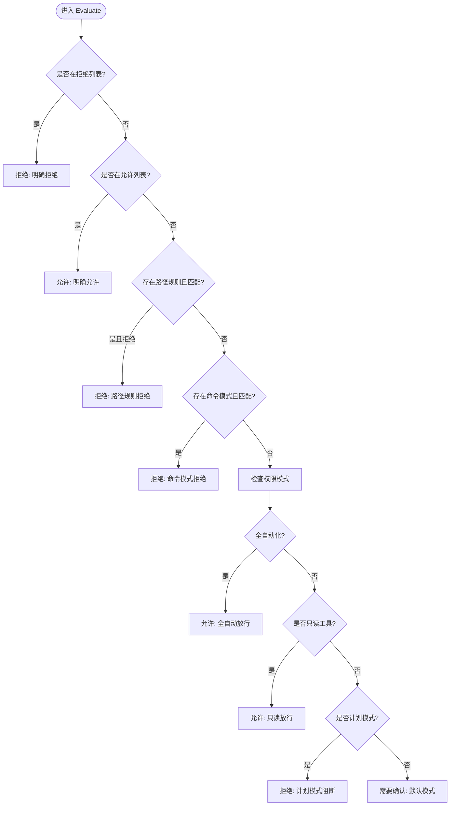
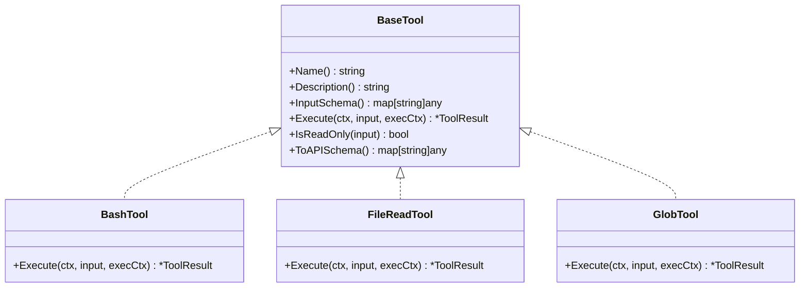
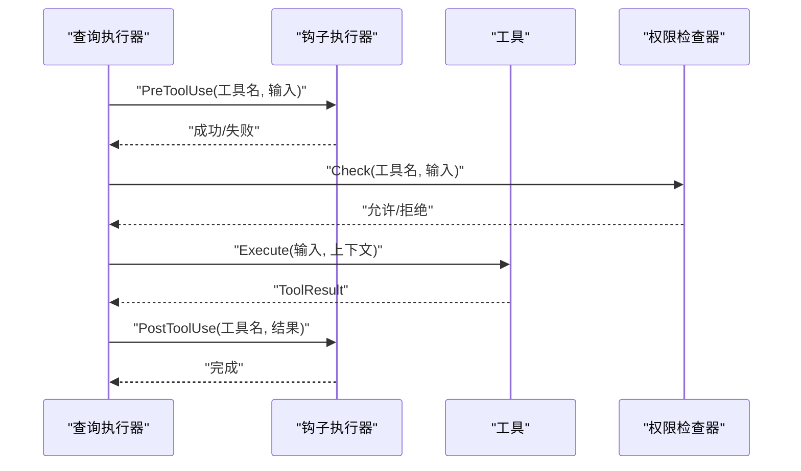
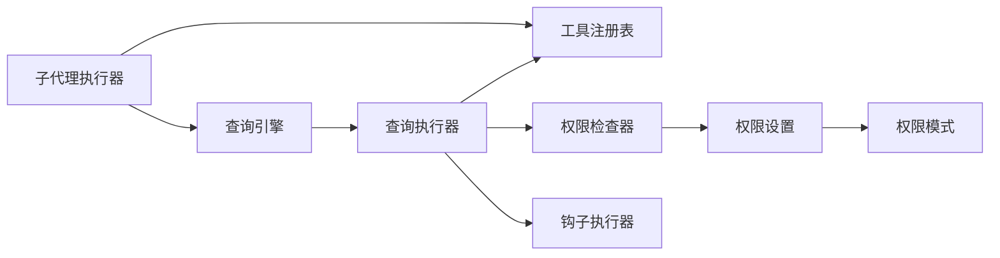

# 工具沙箱机制

<cite>
**本文档引用的文件**
- [pkg/tools/base.go](file://pkg/tools/base.go)
- [pkg/tools/builtin/bash.go](file://pkg/tools/builtin/bash.go)
- [pkg/tools/builtin/register.go](file://pkg/tools/builtin/register.go)
- [pkg/tools/builtin/file_read.go](file://pkg/tools/builtin/file_read.go)
- [pkg/tools/builtin/glob.go](file://pkg/tools/builtin/glob.go)
- [pkg/engine/query.go](file://pkg/engine/query.go)
- [pkg/engine/query_engine.go](file://pkg/engine/query_engine.go)
- [pkg/tasks/executor.go](file://pkg/tasks/executor.go)
- [pkg/permissions/checker.go](file://pkg/permissions/checker.go)
- [pkg/permissions/modes.go](file://pkg/permissions/modes.go)
- [pkg/config/settings.go](file://pkg/config/settings.go)
- [pkg/config/paths.go](file://pkg/config/paths.go)
- [pkg/hooks/executor.go](file://pkg/hooks/executor.go)
</cite>

## 目录
1. [简介](#简介)
2. [项目结构](#项目结构)
3. [核心组件](#核心组件)
4. [架构总览](#架构总览)
5. [详细组件分析](#详细组件分析)
6. [依赖关系分析](#依赖关系分析)
7. [性能考虑](#性能考虑)
8. [故障排除指南](#故障排除指南)
9. [结论](#结论)
10. [附录](#附录)

## 简介
本文件系统性阐述 OpenHarness 中“工具沙箱机制”的设计与实现，重点解释工具执行的安全边界与隔离策略，涵盖命令执行限制、资源访问控制、环境变量管理；深入分析工具沙箱与权限检查器的协作关系，以及如何通过沙箱机制防止恶意工具执行；提供配置选项与自定义方法（命令白名单、参数验证、输出过滤）；说明在不同权限模式下的行为差异与安全保证。

## 项目结构
OpenHarness 将“工具”抽象为统一接口，通过注册表集中管理；“引擎”负责对话循环与工具调用；“任务执行器”构建受限的工具注册表以实现沙箱；“权限检查器”在运行时对工具调用进行决策；“配置模块”提供权限模式与规则的持久化与加载。

图表来源
- [pkg/tasks/executor.go:139-163](file://pkg/tasks/executor.go#L139-L163)
- [pkg/engine/query.go:142-280](file://pkg/engine/query.go#L142-L280)
- [pkg/permissions/checker.go:41-82](file://pkg/permissions/checker.go#L41-L82)
- [pkg/config/settings.go:37-55](file://pkg/config/settings.go#L37-L55)

章节来源
- [pkg/tasks/executor.go:139-176](file://pkg/tasks/executor.go#L139-L176)
- [pkg/engine/query.go:142-280](file://pkg/engine/query.go#L142-L280)
- [pkg/permissions/checker.go:41-82](file://pkg/permissions/checker.go#L41-L82)
- [pkg/config/settings.go:37-55](file://pkg/config/settings.go#L37-L55)

## 核心组件
- 工具抽象与注册表：定义工具契约、上下文传递、结果封装，并提供线程安全的注册表容器。
- 内置工具：包含只读工具（如文件读取、目录扫描）与可变工具（如 Bash 执行），用于演示沙箱边界。
- 查询执行器：负责将工具调用纳入权限检查与钩子执行流程。
- 子代理执行器：按角色构建“沙箱注册表”，仅暴露允许的工具集。
- 权限检查器：基于配置的模式、工具白/黑名单、路径规则与命令模式匹配进行决策。
- 配置系统：提供默认设置、持久化与环境变量覆盖。

章节来源
- [pkg/tools/base.go:51-131](file://pkg/tools/base.go#L51-L131)
- [pkg/tools/builtin/register.go:7-29](file://pkg/tools/builtin/register.go#L7-L29)
- [pkg/engine/query.go:286-325](file://pkg/engine/query.go#L286-L325)
- [pkg/tasks/executor.go:139-176](file://pkg/tasks/executor.go#L139-L176)
- [pkg/permissions/checker.go:41-82](file://pkg/permissions/checker.go#L41-L82)
- [pkg/config/settings.go:37-55](file://pkg/config/settings.go#L37-L55)

## 架构总览
工具沙箱通过“子代理执行器”构建受限工具注册表，结合“权限检查器”在运行时进行决策，最终由“查询执行器”完成一次完整的工具调用生命周期。钩子执行器在工具调用前后注入额外逻辑，但不改变沙箱边界。

图表来源
- [pkg/tasks/executor.go:139-176](file://pkg/tasks/executor.go#L139-L176)
- [pkg/engine/query.go:142-280](file://pkg/engine/query.go#L142-L280)
- [pkg/engine/query.go:286-325](file://pkg/engine/query.go#L286-L325)

## 详细组件分析

### 沙箱注册表与工具选择
- 角色白名单：根据子代理类型（探索、规划、验证等）预设允许的工具集合。
- 显式覆盖：若显式指定 allowed_tools，则优先使用该列表。
- Agent 工具排除：沙箱注册表会排除 Agent 工具，避免递归或越权调用。
- 完全开放：当未指定工具列表时，构建包含所有已注册工具的注册表（不建议在生产使用）。

图表来源
- [pkg/tasks/executor.go:139-176](file://pkg/tasks/executor.go#L139-L176)

章节来源
- [pkg/tasks/executor.go:139-176](file://pkg/tasks/executor.go#L139-L176)

### 权限检查器与决策流程
- 工具级控制：显式允许/拒绝工具列表优先于其他规则。
- 路径级控制：基于 glob 模式的路径规则，支持允许/拒绝路径。
- 命令级控制：基于 glob 模式拒绝特定命令片段。
- 模式控制：默认模式下只读工具放行，非只读工具需确认；计划模式下阻止变更操作；全自动模式放行所有工具。
- 决策输出：返回允许/拒绝、是否需要确认及原因，便于上层展示与审计。

图表来源
- [pkg/permissions/checker.go:41-82](file://pkg/permissions/checker.go#L41-L82)
- [pkg/permissions/modes.go:7-17](file://pkg/permissions/modes.go#L7-L17)

章节来源
- [pkg/permissions/checker.go:41-82](file://pkg/permissions/checker.go#L41-L82)
- [pkg/permissions/modes.go:7-17](file://pkg/permissions/modes.go#L7-L17)

### 工具执行边界与隔离
- Bash 工具：通过子进程执行命令，支持超时控制；输出合并标准输出与错误输出；超时与退出状态错误均作为错误结果返回。
- 文件读取工具：解析输入参数，支持绝对/相对路径，自动拼接工作目录；按行切分后应用偏移与限制。
- Glob 工具：遍历目录树匹配 glob 模式，支持相对路径与基础目录切换；忽略不可访问路径。
- 只读标记：工具接口提供 IsReadOnly 标记，权限检查器据此快速放行只读工具。

图表来源
- [pkg/tools/base.go:51-79](file://pkg/tools/base.go#L51-L79)
- [pkg/tools/builtin/bash.go:24-99](file://pkg/tools/builtin/bash.go#L24-L99)
- [pkg/tools/builtin/file_read.go:25-99](file://pkg/tools/builtin/file_read.go#L25-L99)
- [pkg/tools/builtin/glob.go:24-106](file://pkg/tools/builtin/glob.go#L24-L106)

章节来源
- [pkg/tools/builtin/bash.go:55-99](file://pkg/tools/builtin/bash.go#L55-L99)
- [pkg/tools/builtin/file_read.go:59-99](file://pkg/tools/builtin/file_read.go#L59-L99)
- [pkg/tools/builtin/glob.go:54-106](file://pkg/tools/builtin/glob.go#L54-L106)
- [pkg/tools/base.go:51-79](file://pkg/tools/base.go#L51-L79)

### 查询执行器与钩子集成
- 查询执行器将工具调用纳入统一事件流，支持并发执行多个工具调用。
- 在每次工具调用前/后执行钩子（PreToolUse/PostToolUse），可用于审计、告警或二次校验。
- 工具执行上下文包含工作目录与回调函数，便于工具进行交互与权限请求。

图表来源
- [pkg/engine/query.go:286-325](file://pkg/engine/query.go#L286-L325)
- [pkg/hooks/executor.go:111-151](file://pkg/hooks/executor.go#L111-L151)

章节来源
- [pkg/engine/query.go:286-325](file://pkg/engine/query.go#L286-L325)
- [pkg/hooks/executor.go:111-151](file://pkg/hooks/executor.go#L111-L151)

### 配置与环境变量
- 权限设置：包含模式、允许/拒绝工具列表、路径规则、拒绝命令模式等。
- 默认设置：提供合理的默认值，便于开箱即用。
- 环境变量覆盖：支持从环境变量覆盖 API Key、模型、基础地址等敏感配置。
- 配置文件路径：统一管理配置目录与文件路径。

章节来源
- [pkg/config/settings.go:37-55](file://pkg/config/settings.go#L37-L55)
- [pkg/config/settings.go:127-142](file://pkg/config/settings.go#L127-L142)
- [pkg/config/settings.go:197-211](file://pkg/config/settings.go#L197-L211)
- [pkg/config/paths.go:8-23](file://pkg/config/paths.go#L8-L23)

## 依赖关系分析
- 子代理执行器依赖工具注册表与任务注册表，构建沙箱注册表后交由查询引擎执行。
- 查询执行器依赖工具注册表、权限检查器与钩子执行器，形成完整的工具调用管线。
- 权限检查器依赖配置模块提供的权限设置，受权限模式与规则约束。
- 钩子执行器独立于沙箱边界，但可影响工具调用的前置条件与后置处理。

图表来源
- [pkg/tasks/executor.go:139-176](file://pkg/tasks/executor.go#L139-L176)
- [pkg/engine/query.go:142-280](file://pkg/engine/query.go#L142-L280)
- [pkg/permissions/checker.go:41-82](file://pkg/permissions/checker.go#L41-L82)
- [pkg/config/settings.go:37-55](file://pkg/config/settings.go#L37-L55)

章节来源
- [pkg/tasks/executor.go:139-176](file://pkg/tasks/executor.go#L139-L176)
- [pkg/engine/query.go:142-280](file://pkg/engine/query.go#L142-L280)
- [pkg/permissions/checker.go:41-82](file://pkg/permissions/checker.go#L41-L82)
- [pkg/config/settings.go:37-55](file://pkg/config/settings.go#L37-L55)

## 性能考虑
- 并发工具执行：查询执行器并发执行多个工具调用，提高吞吐量。
- 事件流与内存：通过事件通道与消息压缩管道控制内存占用，避免长轮询导致的内存膨胀。
- 超时与资源限制：Bash 工具支持超时，避免长时间阻塞；钩子执行器同样具备超时控制。
- 日志与审计：钩子与权限检查器可记录决策原因，便于问题定位与性能分析。

## 故障排除指南
- 工具未找到：检查沙箱注册表是否包含目标工具，确认工具名称大小写与拼写。
- 权限被拒：查看权限模式与规则，确认是否命中拒绝列表、路径规则或命令模式。
- Bash 执行异常：检查命令是否超时、是否包含被拒绝的模式；关注标准错误输出。
- 文件读取失败：确认文件路径是否正确、是否在允许的路径范围内。
- 钩子失败：检查钩子命令/HTTP 请求是否超时、返回码是否有效；核对环境变量注入。

章节来源
- [pkg/engine/query.go:286-325](file://pkg/engine/query.go#L286-L325)
- [pkg/permissions/checker.go:41-82](file://pkg/permissions/checker.go#L41-L82)
- [pkg/hooks/executor.go:111-151](file://pkg/hooks/executor.go#L111-L151)

## 结论
OpenHarness 的工具沙箱通过“角色白名单 + 显式覆盖 + 只读放行 + 权限模式”的组合，在保证功能可用的同时最大化降低风险。权限检查器与查询执行器协同工作，确保每次工具调用都经过严格的决策与可观测的执行流程。配合钩子与配置系统，可在不破坏沙箱边界的前提下实现灵活的扩展与治理。

## 附录

### 配置选项与自定义方法
- 权限模式
  - default：默认模式，只读工具放行，非只读工具需要用户确认。
  - plan：计划模式，阻止变更类工具，直至退出计划模式。
  - full_auto：全自动模式，放行所有工具。
- 工具白/黑名单：通过 allowed_tools 与 denied_tools 控制工具可用性。
- 路径规则：基于 glob 模式对文件路径进行允许/拒绝控制。
- 命令模式：基于 glob 模式拒绝特定命令片段。
- 环境变量覆盖：支持从环境变量覆盖敏感配置项。

章节来源
- [pkg/permissions/modes.go:7-17](file://pkg/permissions/modes.go#L7-L17)
- [pkg/config/settings.go:37-55](file://pkg/config/settings.go#L37-L55)
- [pkg/config/settings.go:197-211](file://pkg/config/settings.go#L197-L211)

### 不同权限模式下的行为差异
- default：只读工具放行；非只读工具需要用户确认；适合交互式场景。
- plan：阻止变更类工具，强调先计划再执行；适合高风险环境。
- full_auto：放行所有工具，无须确认；适合受控的开发/测试环境。

章节来源
- [pkg/permissions/checker.go:70-81](file://pkg/permissions/checker.go#L70-L81)
- [pkg/permissions/modes.go:7-17](file://pkg/permissions/modes.go#L7-L17)